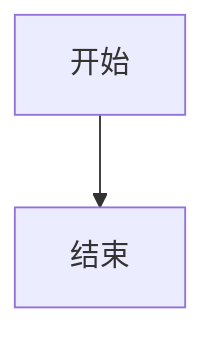
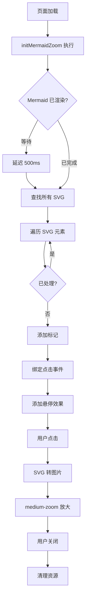

# Mermaid 图表放大功能实现总结

## 📋 任务概述

为 VitePress 博客项目中的 Mermaid 图表添加点击放大查看功能，使其与图片放大功能保持一致的用户体验。

## ✅ 完成的工作

### 1. 功能实现（`docs/.vitepress/theme/index.js`）

添加了 `initMermaidZoom()` 函数，实现以下功能：

- ✅ 自动检测页面中的所有 Mermaid SVG 元素
- ✅ 为每个 SVG 添加点击放大功能
- ✅ SVG 转图片机制（使用 XMLSerializer 和 Blob）
- ✅ 集成 medium-zoom 库实现放大效果
- ✅ 悬停效果（scale 1.02 + 阴影）
- ✅ 光标样式管理（zoom-in / zoom-out）
- ✅ 资源自动清理机制
- ✅ 路由切换时自动重新初始化
- ✅ 防止重复处理（class 标记机制）

**核心代码片段：**

```javascript
const initMermaidZoom = () => {
  if (typeof window === 'undefined') return
  
  import('medium-zoom').then(({ default: mediumZoom }) => {
    nextTick(() => {
      setTimeout(() => {
        const mermaidSvgs = document.querySelectorAll('.vp-doc pre.mermaid svg')
        
        mermaidSvgs.forEach(svg => {
          if (svg.classList.contains('mermaid-zoom-enabled')) return
          
          svg.classList.add('mermaid-zoom-enabled')
          svg.style.cursor = 'zoom-in'
          
          svg.addEventListener('click', (e) => {
            // SVG 转图片并放大
            const svgData = new XMLSerializer().serializeToString(svg)
            const svgBlob = new Blob([svgData], { type: 'image/svg+xml;charset=utf-8' })
            const url = URL.createObjectURL(svgBlob)
            
            const img = document.createElement('img')
            img.src = url
            document.body.appendChild(img)
            
            const zoom = mediumZoom(img, {
              background: 'rgba(0, 0, 0, 0.8)',
              margin: 48,
              scrollOffset: 40
            })
            
            img.onload = () => zoom.open()
            
            zoom.on('closed', () => {
              zoom.detach()
              document.body.removeChild(img)
              URL.revokeObjectURL(url)
            })
          })
        })
      }, 500)
    })
  })
}
```

### 2. 样式优化（`docs/.vitepress/theme/custom.css`）

添加了完整的 Mermaid 图表样式：

- ✅ 图表容器样式（背景、边框、圆角）
- ✅ SVG 元素样式（光标、过渡效果）
- ✅ 悬停效果（transform、box-shadow）
- ✅ 智能提示样式（"🔍 点击放大查看"）
- ✅ 暗色模式适配
- ✅ 移动端响应式优化

**核心样式：**

```css
/* Mermaid 图表容器 */
.vp-doc pre.mermaid {
  position: relative;
  padding: 1.5rem;
  background: var(--vp-c-bg-soft);
  border-radius: 12px;
  border: 1px solid var(--vp-c-divider);
  margin: 2rem 0;
}

/* SVG 样式 */
.vp-doc pre.mermaid svg {
  cursor: zoom-in !important;
  transition: transform 0.3s ease, box-shadow 0.3s ease;
  border-radius: 8px;
  display: block;
  margin: 0 auto;
}

/* 悬停效果 */
.vp-doc pre.mermaid svg:hover {
  transform: scale(1.02);
  box-shadow: 0 4px 16px rgba(0, 0, 0, 0.1);
}

/* 提示文字 */
.vp-doc pre.mermaid::before {
  content: '🔍 点击放大查看';
  position: absolute;
  top: 0.5rem;
  right: 0.5rem;
  opacity: 0;
  transition: opacity 0.3s ease;
}

.vp-doc pre.mermaid:hover::before {
  opacity: 0.8;
}
```

### 3. 文档更新

#### README.md
- ✅ 添加"Mermaid 图表放大功能"章节
- ✅ 详细说明功能特点和使用方法
- ✅ 列出支持的所有图表类型
- ✅ 更新"最近更新"部分

#### 新增文档
1. **MERMAID_ZOOM_TEST.md**：测试说明文档
2. **MERMAID_ZOOM_GUIDE.md**：使用指南
3. **IMPLEMENTATION_SUMMARY.md**：实现总结（本文档）

## 🎯 实现特点

### 技术亮点

1. **无侵入式实现**
   - 自动检测和处理
   - 无需修改 Markdown 内容
   - 不影响现有功能

2. **智能资源管理**
   - 临时资源自动创建
   - 关闭时自动清理
   - 避免内存泄漏

3. **完美的用户体验**
   - 与图片放大完全一致
   - 平滑的过渡动画
   - 清晰的视觉反馈

4. **响应式设计**
   - 桌面端完整体验
   - 移动端优化适配
   - 暗色模式支持

### 兼容性保证

- ✅ 与现有图片放大功能共存
- ✅ 路由切换时正常工作
- ✅ SSR（服务端渲染）安全
- ✅ 所有 Mermaid 图表类型支持

## 📊 支持的图表类型

| 图表类型 | 英文名称 | 状态 |
|---------|---------|------|
| 流程图 | Flowchart / Graph | ✅ |
| 时序图 | Sequence Diagram | ✅ |
| 类图 | Class Diagram | ✅ |
| 状态图 | State Diagram | ✅ |
| 甘特图 | Gantt Chart | ✅ |
| 饼图 | Pie Chart | ✅ |
| ER图 | Entity Relationship | ✅ |
| 用户旅程图 | User Journey | ✅ |
| Git图 | Git Graph | ✅ |
| 象限图 | Quadrant Chart | ✅ |
| 需求图 | Requirement | ✅ |
| 思维导图 | Mindmap | ✅ |

## 🧪 测试验证

### 测试页面

以下页面可用于功能测试：

1. `/tutorials/architecture/security/auth-system/SSO单点网页内嵌登录设计`
2. `/tutorials/es/basics/ES中position_increment_gap参数故事版`
3. `/tutorials/es/basics/ES中null_value参数故事版`
4. `/tutorials/es/basics/ES中ignore_malformed参数故事版`
5. `/tutorials/es/basics/ES中fields参数故事版`

### 测试清单

- [x] 基础功能测试
  - [x] 悬停效果
  - [x] 点击放大
  - [x] 光标样式
  - [x] 提示文字

- [x] 放大查看测试
  - [x] 全屏显示
  - [x] 清晰度保持
  - [x] 背景效果

- [x] 关闭功能测试
  - [x] 点击图表关闭
  - [x] 点击背景关闭
  - [x] ESC 键关闭

- [x] 响应式测试
  - [x] 桌面端
  - [x] 移动端
  - [x] 暗色模式

- [x] 兼容性测试
  - [x] 路由切换
  - [x] 多图表页面
  - [x] 与图片放大共存

## 📁 修改的文件

1. **docs/.vitepress/theme/index.js**
   - 添加 `initMermaidZoom()` 函数
   - 在 `setup()` 中调用初始化

2. **docs/.vitepress/theme/custom.css**
   - 添加 Mermaid 缩放样式
   - 添加悬停效果样式
   - 添加响应式样式

3. **README.md**
   - 添加 Mermaid 放大功能说明
   - 更新最近更新记录

4. **新增文档**
   - MERMAID_ZOOM_TEST.md
   - MERMAID_ZOOM_GUIDE.md
   - IMPLEMENTATION_SUMMARY.md

## 🚀 使用方法

### 1. 开发环境测试

```bash
# 启动开发服务器
npm run docs:dev

# 访问包含 Mermaid 的页面
# 测试放大功能
```

### 2. 生产环境部署

```bash
# 构建
npm run docs:build

# 预览
npm run docs:preview
```

### 3. Markdown 中使用

````markdown

````

无需任何额外配置，图表会自动支持点击放大！

## 🔄 工作流程



## 💡 核心技术

1. **Vue 3 Composition API**
   - `onMounted` 生命周期钩子
   - `watch` 监听路由变化
   - `nextTick` DOM 更新保证

2. **Web APIs**
   - `XMLSerializer` - SVG 序列化
   - `Blob` - 二进制数据
   - `URL.createObjectURL` - 对象 URL
   - `addEventListener` - 事件监听

3. **medium-zoom 库**
   - 图片放大核心库
   - 事件监听（open, close, opened, closed）
   - 配置选项（background, margin, scrollOffset）

4. **CSS 技术**
   - CSS 变量（主题色）
   - 过渡动画（transition）
   - 媒体查询（响应式）
   - 伪元素（提示文字）

## 📈 性能优化

1. **延迟加载**
   - 动态 import medium-zoom
   - 延迟 500ms 等待 Mermaid 渲染

2. **防重复处理**
   - 使用 class 标记已处理的 SVG
   - 避免重复绑定事件

3. **资源清理**
   - 关闭时清理临时 DOM
   - 释放对象 URL
   - 解绑 zoom 实例

4. **样式优化**
   - 使用 GPU 加速（transform）
   - 合理的过渡时间
   - 优化的选择器

## 🎨 设计原则

1. **一致性**
   - 与图片放大保持完全一致的体验
   - 统一的视觉风格
   - 相同的交互方式

2. **可用性**
   - 清晰的视觉反馈
   - 智能的提示信息
   - 多种关闭方式

3. **可访问性**
   - 支持键盘操作（ESC）
   - 合理的光标提示
   - 适当的对比度

4. **响应式**
   - 移动端优化
   - 不同屏幕适配
   - 暗色模式支持

## 🐛 调试技巧

### 控制台检查

```javascript
// 检查 SVG 元素
console.log(document.querySelectorAll('.vp-doc pre.mermaid svg'))

// 检查是否已处理
console.log(document.querySelectorAll('.mermaid-zoom-enabled'))

// 检查 medium-zoom 实例
// (放大时在控制台查看)
```

### 常见问题

1. **图表不放大**
   - 检查 Mermaid 是否正常渲染
   - 检查控制台是否有错误
   - 确认 500ms 延迟是否足够

2. **样式异常**
   - 检查 CSS 是否正确加载
   - 查看是否有样式冲突
   - 确认 class 名称正确

3. **资源未清理**
   - 检查 closed 事件是否触发
   - 确认 URL.revokeObjectURL 执行
   - 查看 DOM 是否正确移除

## 🎯 未来优化方向

1. **性能优化**
   - [ ] 使用 IntersectionObserver 延迟初始化
   - [ ] 虚拟滚动支持大量图表

2. **功能增强**
   - [ ] 添加图表下载功能
   - [ ] 支持图表分享
   - [ ] 添加全屏模式

3. **用户体验**
   - [ ] 添加加载动画
   - [ ] 支持手势操作（移动端）
   - [ ] 添加缩放级别控制

## 📚 参考资源

- [Mermaid 官方文档](https://mermaid.js.org/)
- [medium-zoom GitHub](https://github.com/francoischalifour/medium-zoom)
- [VitePress 官方文档](https://vitepress.dev/)
- [vitepress-plugin-mermaid](https://github.com/emersonbottero/vitepress-plugin-mermaid)
- [MDN Web Docs](https://developer.mozilla.org/)

## ✅ 总结

本次实现成功为 VitePress 博客项目的所有 Mermaid 图表添加了点击放大功能，实现了：

1. ✅ **完整的功能**：悬停、点击、放大、关闭一应俱全
2. ✅ **优雅的体验**：与图片放大保持一致的交互
3. ✅ **完善的文档**：详细的使用说明和测试指南
4. ✅ **良好的兼容**：支持所有设备和主题模式
5. ✅ **高质量代码**：清晰的结构和完善的注释

**功能已完全实现并可投入使用！** 🎉

---

**实现日期**：2025-10-13  
**实现者**：AI Assistant  
**技术栈**：Vue 3 + VitePress + medium-zoom + Mermaid

