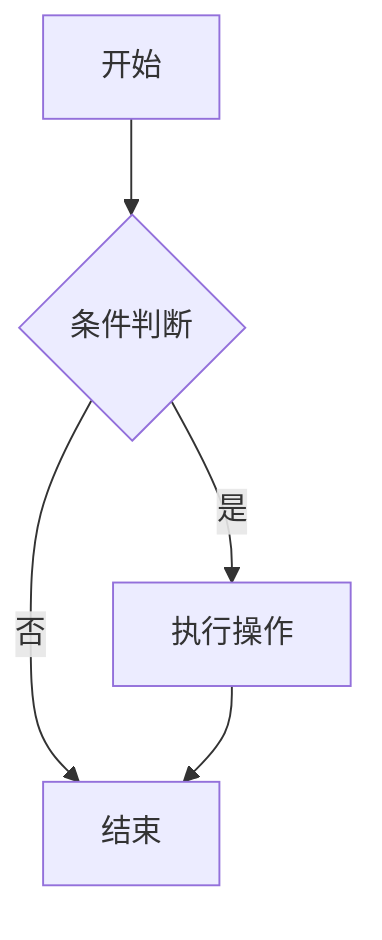

# 舒一笑不秃头的技术博客

> IDEA插件-PandaCoder（熊猫编码器）作者 ｜ 生成式AI应用工程师(高级)认证 | 专注于AI工程化落地 | 阿里云博客专家 | Java应用开发职业技能等级认证 | HarmonyOS应用开发者基础认证 | 人生程序设计程序员 境是人非叶落处，焕景深处已向春~ 代码是我的文字，程序是我的诗篇，我不是程序员，我是诗人。大浪淘沙，去伪存真，破后而立，否极泰来。 真正的有所成，只能是慢慢来...

## 🌐 在线访问

- **自定义域名**: [https://www.shuyixiao.top](https://www.shuyixiao.top) ⭐ 主站  
  <sub>站点栖息于大洋彼岸，国内访问建议借助网络加速工具，以获得更为流畅的阅读体验</sub>
- **GitHub Pages**: `https://shuyixiao-better.github.io/shuyixiao-studio/`
- **Netlify**: 查看 [DEPLOY.md](./DEPLOY.md) 配置说明


## 🚀 快速开始

```bash
# 1. 切换到 Node.js 22.16.0
nvm use 22.16.0

# 2. 安装依赖
npm install

# 3. 启动开发服务器
npm run docs:dev
```

访问: http://localhost:5173

## 📚 技术栈

- **VitePress** `1.6.4` - 现代化的静态站点生成器
- **Mermaid** `11.12.0` - 流程图和图表渲染
- **Medium Zoom** `1.1.0` - 图片点击放大功能
- **Node.js** `22.16.0` - 运行环境

## ✨ 特性

- ✅ RSS 订阅功能 🆕 - 支持主流 RSS 阅读器，自动同步最新文章
- ✅ 鸿蒙字体 (HarmonyOS Sans) 全局适配
- ✅ 支持 Mermaid 图表自动渲染
- ✅ 图片点击放大查看功能
- ✅ B站视频嵌入功能（全局组件）
- ✅ 文章阅读量与点赞统计
- ✅ 响应式设计，移动端友好
- ✅ 暗色模式支持
- ✅ 快速热更新
- ✅ SEO 优化

## 📖 文档

- 📡 [RSS 订阅功能总结](./RSS_功能总结.md) - RSS 订阅功能完整说明
- 📋 [RSS Feed 设计方案](./RSS_FEED_DESIGN.md) - 包含付费订阅的完整设计方案
- 📝 [快速开始指南](./QUICK_START.md) - 5分钟快速上手
- 🚀 [部署指南](./DEPLOY.md) - GitHub Pages & Netlify 双平台部署
- 🎨 [鸿蒙字体适配](./README_HARMONYOS_FONT.md) - 鸿蒙字体全局配置
- 🌐 [自定义域名配置](./CUSTOM_DOMAIN.md) - 配置 www.shuyixiao.top 域名
- 🔧 [问题排查指南](./TROUBLESHOOTING.md) - 遇到问题？看这里
- 📺 [B站视频嵌入使用指南](./如何使用B站视频组件.md) - 在文章中嵌入B站视频
- 📊 [网站统计功能](./STATS_USAGE.md) - 阅读量、点赞数、访问量统计

## 🔨 可用命令

```bash
# 启动开发服务器
npm run docs:dev

# 构建生产版本
npm run docs:build

# 预览生产版本
npm run docs:preview
```

## 📝 写作指南

### 自动生成 Frontmatter

项目提供了自动生成 frontmatter 的脚本，可以大大简化文章创建流程：

#### 📦 首次使用前

确保已安装脚本所需的依赖：

```bash
# 使用 pnpm（推荐）
pnpm install

# 或使用 npm
npm install
```

> 💡 脚本依赖 `gray-matter` 和 `globby` 包，安装后即可使用。

#### 🔧 使用方法

**1. 处理单个文件**
```bash
node scripts/add-frontmatter.mjs docs/articles/your-article.md
```

**2. 扫描整个 docs 目录**
```bash
node scripts/add-frontmatter.mjs --scan
```

**3. 处理指定目录**
```bash
node scripts/add-frontmatter.mjs --dir docs/tutorials/algorithm
```

#### ✨ 自动功能

脚本会自动完成以下工作：
- 📖 从文章中提取标题（第一个 `#` 或 `##` 标题）
- 📝 生成描述（提取文章前 200 字符）
- 🏷️ 根据文件路径智能推断标签
- 📅 添加当前日期
- 👤 添加作者信息

#### 🎯 智能标签推断规则

脚本支持 **90+ 种路径关键词匹配**，自动推断出最合适的标签：

| 分类 | 路径示例 | 自动标签 |
|------|---------|---------|
| **编程语言** | `java`, `python`, `rust` | Java, Python, Rust |
| **框架** | `spring`, `react`, `vue` | Spring Boot, React, Vue |
| **算法** | `algorithm`, `dynamic-programming` | 算法, 动态规划 |
| **架构** | `architecture`, `microservice`, `distributed` | 系统架构, 微服务, 分布式 |
| **安全** | `security`, `auth`, `sso`, `oauth` | 安全, 认证鉴权, 单点登录, OAuth |
| **性能** | `performance`, `jvm`, `monitoring` | 性能优化, JVM调优, 监控 |
| **数据库** | `database`, `redis`, `mysql` | 数据库, Redis, MySQL |
| **其他** | `message-queue`, `insights` | 消息队列, 技术感悟 |

**特点**：
- ✅ 自动限制标签数量为 5 个
- ✅ 路径不区分大小写
- ✅ 默认标签：`['技术']`（当无法推断时）

> 💡 **提示**：脚本只会处理没有 frontmatter 的文件，已有 frontmatter 的文件会自动跳过。
> 
> 📚 **详细文档**：更多配置和使用说明请查看 [scripts/README.md](./scripts/README.md)

### 手动创建新文章

1. 在 `docs/articles/` 目录下创建新的 `.md` 文件
2. 添加 frontmatter:

```markdown
---
layout: doc
title: 文章标题
description: 文章描述
date: 2025-01-27
tags: ['标签1', '标签2']
author: 舒一笑不秃头
---

# 文章标题

文章内容...
```

### 使用 Mermaid 图表

直接在 Markdown 中使用 mermaid 代码块：

```markdown
\`\`\`mermaid
graph TB
    A[开始] --> B[处理]
    B --> C[结束]
\`\`\`
```

### 使用图片缩放功能

在 Markdown 中插入图片，点击自动放大查看：

```markdown

```

禁用特定图片的缩放（如小图标）：

```html

```

## 📊 Mermaid 图表详细说明

### 环境要求

- **Node.js 版本**: 22.16.0 或更高
- 使用 `nvm use 22.16.0` 切换到正确版本

### 流程图示例

\`\`\`mermaid
graph TB
    A[开始] --> B[处理]
    B --> C{判断}
    C -->|是| D[结果1]
    C -->|否| E[结果2]
    
    style A fill:#e1f5fe
    style D fill:#e8f5e8
    style E fill:#fff3e0
\`\`\`

### 时序图示例

\`\`\`mermaid
sequenceDiagram
    participant 客户端
    participant 服务器
    客户端->>服务器: 请求数据
    服务器-->>客户端: 返回数据
\`\`\`

### 类图示例

\`\`\`mermaid
classDiagram
    class 用户 {
        +String name
        +String email
        +login()
        +logout()
    }
\`\`\`

### 状态图示例

\`\`\`mermaid
stateDiagram-v2
    [*] --> 空闲
    空闲 --> 处理中: 开始处理
    处理中 --> 成功: 处理完成
    处理中 --> 失败: 出现错误
    成功 --> [*]
    失败 --> [*]
\`\`\`

### 自定义样式

可以在 Mermaid 代码中添加样式：

\`\`\`mermaid
graph TB
    A[节点A]
    B[节点B]
    C[节点C]
    A --> B
    B --> C
    
    style A fill:#e1f5fe
    style B fill:#f3e5f5
    style C fill:#e8f5e8
\`\`\`

### Mermaid 常见问题

#### 1. 图表不显示

**解决方案**:
- 确保 Node 版本为 22.16.0: `node --version`
- 重启开发服务器: `Ctrl+C` 然后 `npm run docs:dev`
- 硬刷新浏览器: `Ctrl+Shift+R` (Windows/Linux) 或 `Cmd+Shift+R` (Mac)

#### 2. 图表显示为代码

**原因**: Mermaid 插件未正确加载

**解决方案**:
- 检查是否正确安装了依赖: `npm install`
- 确保 `.vitepress/config.js` 中正确导入了 `withMermaid`
- 查看浏览器控制台是否有错误信息

#### 3. 样式不生效

**解决方案**:
- 样式定义要放在 Mermaid 代码块的最后
- 使用正确的 CSS 颜色格式（如 `#e1f5fe`）
- 确保节点 ID 正确

### Mermaid 更多资源

- [Mermaid 官方文档](https://mermaid.js.org/)
- [Mermaid 在线编辑器](https://mermaid.live/)
- [VitePress Plugin Mermaid](https://github.com/emersonbottero/vitepress-plugin-mermaid)

## 🖼️ 图片缩放功能说明

### 功能特点

1. **自动启用**：所有文章中的图片都会自动支持点击放大
2. **优雅动画**：平滑的缩放过渡效果
3. **智能背景**：半透明黑色背景，带模糊效果
4. **鼠标提示**：
   - 鼠标悬停在图片上时，显示放大镜图标（zoom-in）
   - 图片会轻微放大并显示阴影效果
5. **关闭方式**：
   - 点击放大后的图片
   - 点击背景区域
   - 按 ESC 键

### 基本使用

在 Markdown 文档中正常插入图片即可：

```markdown

```

或者使用 HTML：

```html

```

### 禁用特定图片的缩放

如果某些图片不希望支持点击放大（比如小图标），可以添加 `no-zoom` class：

```html

```

### 配置说明

图片缩放功能已经预配置了以下参数：

- **背景色**：`rgba(0, 0, 0, 0.8)` - 80% 透明度的黑色
- **边距**：`48px` - 放大图片与屏幕边缘的距离
- **滚动偏移**：`40px` - 滚动时的偏移量

如需修改配置，可编辑 `docs/.vitepress/theme/index.js` 文件中的 `mediumZoom` 配置。

### 技术实现

本功能使用了以下技术：

1. **medium-zoom** - 轻量级的图片缩放库
2. **Vue 3** - VitePress 的底层框架
3. **CSS 过渡** - 优雅的动画效果

### 响应式支持

图片缩放功能在所有设备上都能良好工作：

- 桌面浏览器：完整的缩放和动画效果
- 平板设备：自适应边距和缩放比例
- 移动设备：触摸支持，双击返回

## 📊 Mermaid 图表放大功能

### 功能特点

1. **一键全屏查看**：点击 Mermaid 图表即可全屏放大查看
2. **智能提示**：鼠标悬停时显示"🔍 点击放大查看"提示
3. **优雅交互**：
   - 鼠标悬停时图表轻微放大（1.02倍）并显示阴影
   - 点击后全屏放大，黑色半透明背景
   - 图表保持原始样式和清晰度
   - 白色背景，便于查看
4. **多种关闭方式**：
   - 点击图表
   - 点击背景区域
   - 按 ESC 键

### 使用示例

在 Markdown 中使用 Mermaid 图表：

````markdown

````

所有 Mermaid 图表都会自动支持点击放大功能，无需额外配置。

### 支持的图表类型

- ✅ 流程图（Flowchart）
- ✅ 时序图（Sequence Diagram）
- ✅ 类图（Class Diagram）
- ✅ 状态图（State Diagram）
- ✅ 甘特图（Gantt Chart）
- ✅ 饼图（Pie Chart）
- ✅ ER图（Entity Relationship Diagram）
- ✅ 用户旅程图（User Journey）
- ✅ Git图（Git Graph）

### 技术实现

- 自定义全屏查看器，无需第三方库
- 直接克隆并显示 SVG 元素，保持所有原始样式
- 响应式设计，自动适配不同屏幕尺寸
- 键盘和鼠标双重交互支持

## 🎨 自定义配置

主要配置文件：
- `.vitepress/config.js` - VitePress 和 Mermaid 配置
- `.vitepress/theme/` - 自定义主题
- `docs/` - 文档内容

## 📦 最近更新

### 2025-10-13
- ✅ 新增 Mermaid 图表点击放大功能
- ✅ 为 Mermaid 图表添加与图片一致的缩放体验
- ✅ 优化图表容器样式，添加悬停提示
- ✅ 支持所有类型的 Mermaid 图表放大查看
- ✅ 完善暗色模式和移动端适配

### 2025-10-07
- ✅ 新增 GitHub Pages 自动部署工作流
- ✅ 支持 GitHub Pages 和 Netlify 双平台部署
- ✅ 添加详细的部署指南文档
- ✅ 完善 README 文档结构

### 2025-10-06
- ✅ 新增图片点击放大查看功能
- ✅ 集成 medium-zoom 库
- ✅ 优化图片展示体验

### 2025-01-27
- ✅ 升级 VitePress 到最新版本 (1.6.4)
- ✅ 集成官方 Mermaid 插件
- ✅ 优化配置，提升渲染稳定性
- ✅ 添加详细的使用文档

### 💖 支持项目

如果 shuyixiao-studio 帮助到了您，欢迎通过以下方式支持项目发展：

- ⭐ **Star 项目**：在 GitHub 上给项目点个 Star
- 🔔 **关注公众号**：「舒一笑的架构笔记」获取最新动态
- ☕ **赞助支持**：请作者喝杯咖啡，激励持续更新

<p align="center">
  
  
</p>

<p align="center">
  <sub>扫码赞助，金额随心 | 您的支持是最大的动力</sub>
</p>


## 🤝 贡献

欢迎提交 Issue 和 Pull Request！

## 📄 许可证

MIT License

---

## ⭐ Star 历史趋势

### GitHub Star 趋势

<p align="center">
  <a href="https://star-history.com/#shuyixiao-better/shuyixiao-studio&Date">
    
  </a>
</p>

<p align="center">
  <sub>📈 GitHub Star 增长趋势 | <a href="https://github.com/shuyixiao-better/shuyixiao-studio">前往 GitHub 仓库</a></sub>
</p>

### Gitee 仓库

<p align="center">
  <a href="https://gitee.com/shuyixiao-better/shuyixiao-studio">
    
  </a>
  <a href="https://gitee.com/shuyixiao-better/shuyixiao-studio">
    
  </a>
  <br><br>
  <a href="https://gitee.com/shuyixiao-better/shuyixiao-studio">
    
  </a>
</p>

<p align="center">
  <sub>📊 <a href="https://gitee.com/shuyixiao-better/shuyixiao-studio">前往 Gitee 仓库</a> | <a href="https://gitee.com/shuyixiao-better/shuyixiao-studio/stargazers">查看 Star 用户</a></sub>
  <br>
  <sub><em>注：Gitee 暂不支持 Star 趋势图展示</em></sub>
</p>

<p align="center">
  <em>💡 提示：两个平台的数据独立统计，欢迎在您常用的平台上给项目点 Star 支持！</em>
</p>

---

**Built with ❤️ by 舒一笑不秃头**
