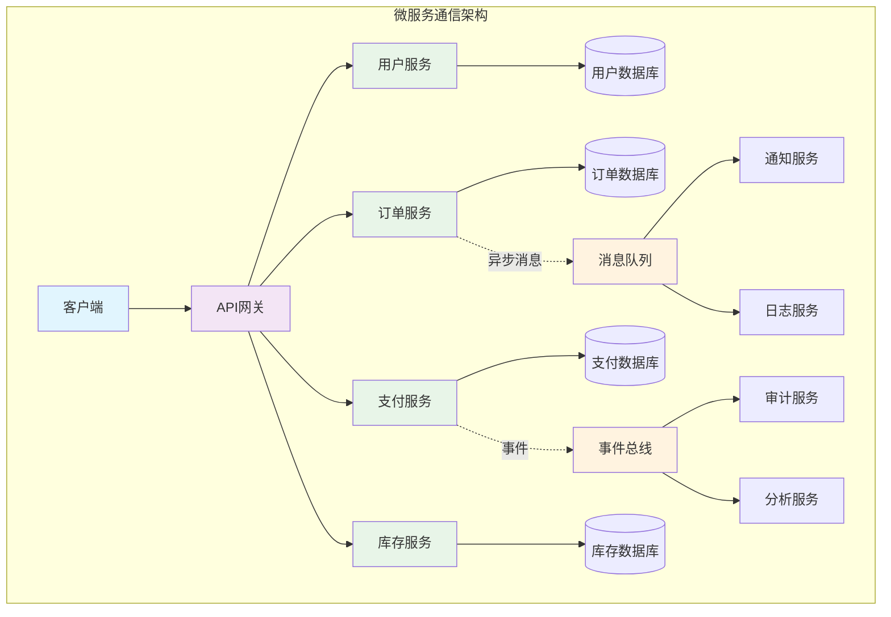
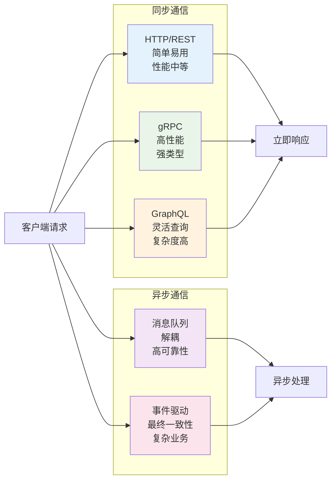
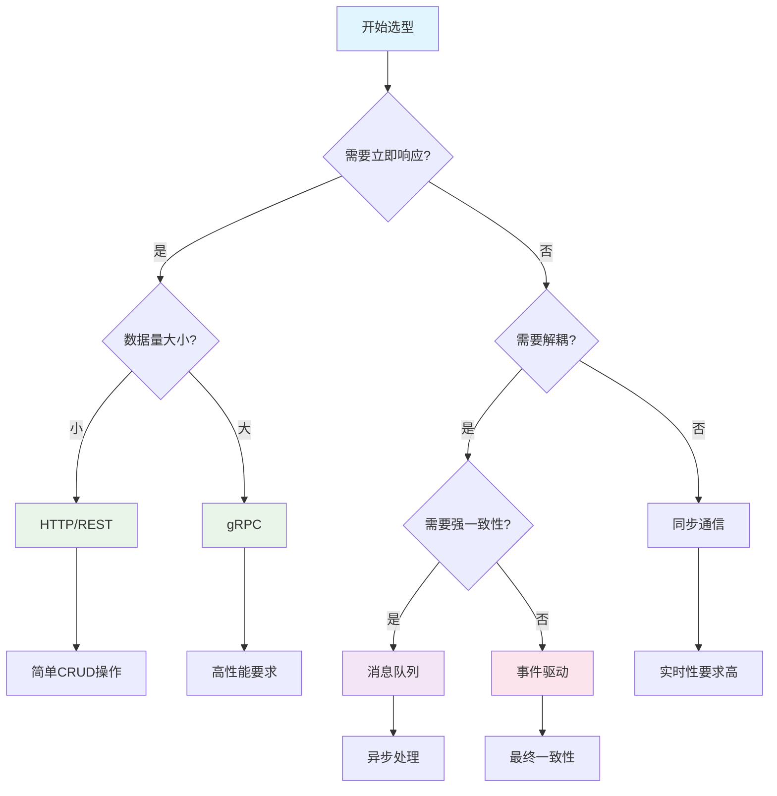
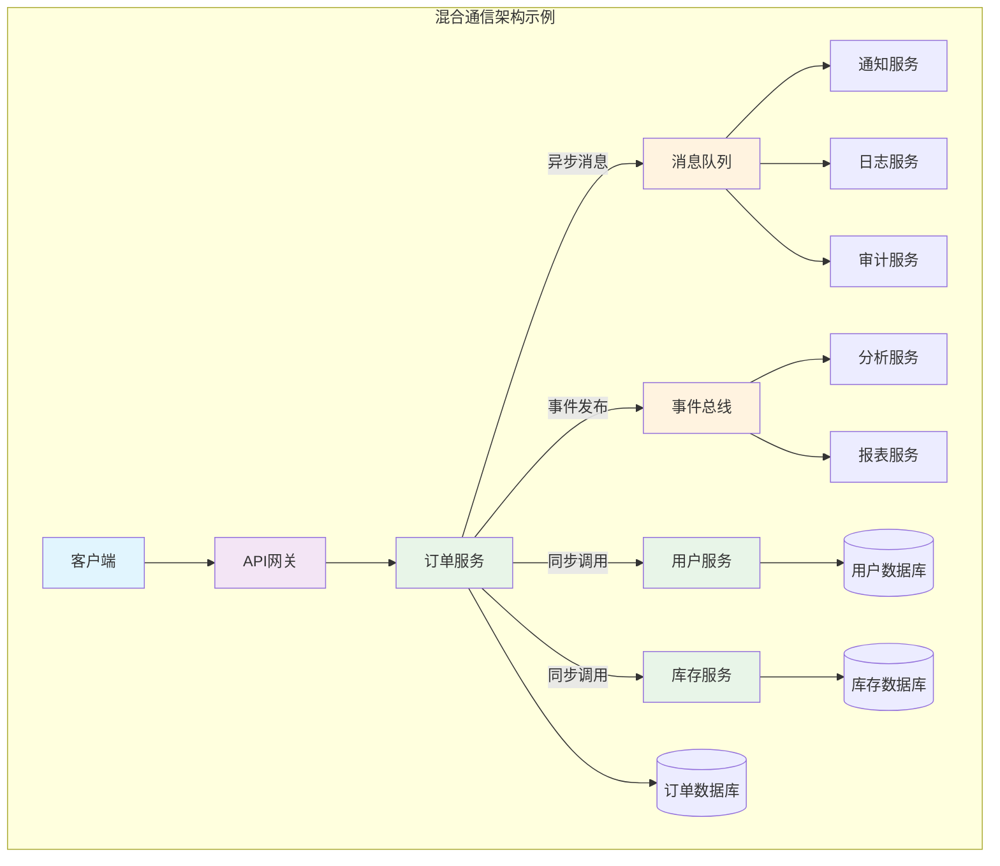

# 微服务架构下的通信方案选型



## 前言

在微服务架构中，服务间的通信是系统设计的核心问题之一。不同的通信方案会直接影响系统的性能、可靠性、可维护性等关键指标。本文将深入分析微服务架构中的各种通信方案，包括同步通信、异步通信以及混合模式，并提供详细的选型指导。

## 微服务通信概述

微服务架构的核心思想是将单体应用拆分为多个独立的服务，每个服务专注于特定的业务功能。这种架构带来了诸多好处，但也引入了新的挑战，其中最重要的就是服务间的通信问题。

### 通信模式分类

微服务通信主要分为两大类：

1. **同步通信**：调用方等待被调用方返回结果
2. **异步通信**：调用方不等待结果，通过消息传递进行通信

## 同步通信方案

### 1. HTTP/REST API

HTTP/REST是目前最常用的同步通信方案，具有简单、易理解、易调试的特点。

#### 优势
- **简单直观**：基于HTTP协议，易于理解和实现
- **语言无关**：任何编程语言都支持HTTP
- **工具丰富**：有大量的调试工具和监控工具
- **缓存友好**：可以利用HTTP缓存机制

#### 劣势
- **性能开销**：每次请求都需要建立连接
- **耦合度高**：服务间存在强依赖关系
- **扩展性差**：难以处理高并发场景

#### 代码示例

```java
// 服务提供方
@RestController
@RequestMapping("/api/users")
public class UserController {
    
    @Autowired
    private UserService userService;
    
    @GetMapping("/{id}")
    public ResponseEntity<User> getUser(@PathVariable Long id) {
        User user = userService.findById(id);
        return ResponseEntity.ok(user);
    }
}

// 服务消费方
@Service
public class OrderService {
    
    @Autowired
    private RestTemplate restTemplate;
    
    public User getUserInfo(Long userId) {
        String url = "http://user-service/api/users/" + userId;
        return restTemplate.getForObject(url, User.class);
    }
}
```

### 2. gRPC

gRPC是Google开发的高性能RPC框架，基于HTTP/2协议和Protocol Buffers。

#### 优势
- **高性能**：基于HTTP/2，支持多路复用
- **强类型**：使用Protocol Buffers定义接口
- **跨语言**：支持多种编程语言
- **流式处理**：支持流式数据传输

#### 劣势
- **学习成本**：需要学习Protocol Buffers
- **调试困难**：二进制格式，不易调试
- **浏览器支持差**：需要代理才能在前端使用

#### 代码示例

```protobuf
// user.proto
syntax = "proto3";

package user;

service UserService {
    rpc GetUser(GetUserRequest) returns (GetUserResponse);
    rpc GetUsers(GetUsersRequest) returns (stream GetUserResponse);
}

message GetUserRequest {
    int64 user_id = 1;
}

message GetUserResponse {
    int64 id = 1;
    string name = 2;
    string email = 3;
}
```

```java
// 服务实现
@GrpcService
public class UserServiceImpl extends UserServiceGrpc.UserServiceImplBase {
    
    @Override
    public void getUser(GetUserRequest request, StreamObserver<GetUserResponse> responseObserver) {
        User user = userService.findById(request.getUserId());
        GetUserResponse response = GetUserResponse.newBuilder()
            .setId(user.getId())
            .setName(user.getName())
            .setEmail(user.getEmail())
            .build();
        responseObserver.onNext(response);
        responseObserver.onCompleted();
    }
}
```

### 3. GraphQL

GraphQL是一种查询语言和运行时，允许客户端精确指定需要的数据。

#### 优势
- **灵活查询**：客户端可以精确指定需要的数据
- **类型安全**：强类型系统，编译时检查
- **单一端点**：所有查询都通过一个端点
- **实时订阅**：支持实时数据推送

#### 劣势
- **复杂度高**：查询复杂度控制困难
- **缓存复杂**：难以利用HTTP缓存
- **学习成本**：需要学习GraphQL语法

## 异步通信方案

### 1. 消息队列

消息队列是异步通信的核心组件，常用的有RabbitMQ、Apache Kafka、Amazon SQS等。

#### RabbitMQ

```java
// 消息生产者
@Component
public class OrderEventPublisher {
    
    @Autowired
    private RabbitTemplate rabbitTemplate;
    
    public void publishOrderCreated(Order order) {
        OrderCreatedEvent event = new OrderCreatedEvent(order);
        rabbitTemplate.convertAndSend("order.exchange", "order.created", event);
    }
}

// 消息消费者
@Component
@RabbitListener(queues = "order.created.queue")
public class OrderEventHandler {
    
    @Autowired
    private NotificationService notificationService;
    
    public void handleOrderCreated(OrderCreatedEvent event) {
        notificationService.sendOrderConfirmation(event.getOrder());
    }
}
```

#### Apache Kafka

```java
// 消息生产者
@Component
public class OrderEventProducer {
    
    @Autowired
    private KafkaTemplate<String, Object> kafkaTemplate;
    
    public void publishOrderCreated(Order order) {
        OrderCreatedEvent event = new OrderCreatedEvent(order);
        kafkaTemplate.send("order-created", event);
    }
}

// 消息消费者
@Component
public class OrderEventHandler {
    
    @KafkaListener(topics = "order-created")
    public void handleOrderCreated(OrderCreatedEvent event) {
        // 处理订单创建事件
        processOrderCreated(event);
    }
}
```

### 2. 事件驱动架构

事件驱动架构通过事件来解耦服务间的依赖关系。

#### 事件发布

```java
@Component
public class OrderService {
    
    @Autowired
    private ApplicationEventPublisher eventPublisher;
    
    public Order createOrder(OrderRequest request) {
        Order order = new Order(request);
        order = orderRepository.save(order);
        
        // 发布订单创建事件
        OrderCreatedEvent event = new OrderCreatedEvent(order);
        eventPublisher.publishEvent(event);
        
        return order;
    }
}
```

#### 事件监听

```java
@Component
public class InventoryEventHandler {
    
    @EventListener
    @Async
    public void handleOrderCreated(OrderCreatedEvent event) {
        // 异步处理库存扣减
        inventoryService.reduceStock(event.getOrder().getItems());
    }
}
```

## 通信方案对比



| 方案 | 性能 | 可靠性 | 复杂度 | 调试难度 | 适用场景 |
|------|------|--------|--------|----------|----------|
| HTTP/REST | 中等 | 中等 | 低 | 低 | 简单查询、CRUD操作 |
| gRPC | 高 | 高 | 中等 | 中等 | 高性能、强类型要求 |
| GraphQL | 中等 | 中等 | 高 | 高 | 复杂查询、多端应用 |
| 消息队列 | 高 | 高 | 中等 | 中等 | 异步处理、解耦 |
| 事件驱动 | 高 | 高 | 高 | 高 | 复杂业务、最终一致性 |

## 选型指导原则



### 1. 根据业务场景选择

**同步通信适用于：**
- 需要立即获取结果的场景
- 简单的CRUD操作
- 实时性要求高的场景

**异步通信适用于：**
- 可以接受延迟处理的场景
- 需要解耦的服务
- 高并发、高吞吐量的场景

### 2. 考虑系统约束

- **网络延迟**：内网通信可选择gRPC，外网通信选择HTTP
- **数据量**：大数据量传输选择消息队列
- **一致性要求**：强一致性选择同步通信，最终一致性选择异步通信

### 3. 团队技术栈

- 选择团队熟悉的技术
- 考虑维护成本
- 评估学习成本

## 混合通信模式

在实际项目中，通常采用混合通信模式：



```java
@Service
public class OrderService {
    
    // 同步调用：获取用户信息
    @Autowired
    private UserServiceClient userServiceClient;
    
    // 异步调用：发送通知
    @Autowired
    private NotificationEventPublisher notificationPublisher;
    
    public Order createOrder(OrderRequest request) {
        // 同步获取用户信息
        User user = userServiceClient.getUser(request.getUserId());
        
        // 创建订单
        Order order = new Order(request, user);
        order = orderRepository.save(order);
        
        // 异步发送通知
        notificationPublisher.publishOrderCreated(order);
        
        return order;
    }
}
```

## 最佳实践

### 1. 服务发现与负载均衡

```java
@Configuration
public class ServiceDiscoveryConfig {
    
    @Bean
    @LoadBalanced
    public RestTemplate restTemplate() {
        return new RestTemplate();
    }
    
    @Bean
    public DiscoveryClient discoveryClient() {
        return new EurekaDiscoveryClient();
    }
}
```

### 2. 熔断器模式

```java
@Component
public class UserServiceClient {
    
    @HystrixCommand(fallbackMethod = "getUserFallback")
    public User getUser(Long userId) {
        return restTemplate.getForObject("/api/users/" + userId, User.class);
    }
    
    public User getUserFallback(Long userId) {
        return new User(userId, "Unknown", "unknown@example.com");
    }
}
```

### 3. 重试机制

```java
@Retryable(value = {Exception.class}, maxAttempts = 3, backoff = @Backoff(delay = 1000))
public User getUser(Long userId) {
    return restTemplate.getForObject("/api/users/" + userId, User.class);
}
```

### 4. 监控与日志

```java
@Component
public class CommunicationMonitor {
    
    private final MeterRegistry meterRegistry;
    
    public CommunicationMonitor(MeterRegistry meterRegistry) {
        this.meterRegistry = meterRegistry;
    }
    
    public void recordServiceCall(String serviceName, String method, long duration) {
        Timer.Sample sample = Timer.start(meterRegistry);
        sample.stop(Timer.builder("service.call.duration")
            .tag("service", serviceName)
            .tag("method", method)
            .register(meterRegistry));
    }
}
```

## 总结

微服务通信方案的选择需要综合考虑业务需求、技术约束、团队能力等多个因素。在实际项目中，通常采用混合模式，根据不同的场景选择最合适的通信方式。

关键要点：
1. **同步通信**适合需要立即响应的场景
2. **异步通信**适合需要解耦和高并发的场景
3. **混合模式**是最常见的选择
4. **监控和容错**是成功实施的关键

选择合适的通信方案不仅能提升系统性能，还能降低维护成本，提高系统的可扩展性和可靠性。

## 参考资料

1. [Microservices Patterns](https://microservices.io/)
2. [Spring Cloud Documentation](https://spring.io/projects/spring-cloud)
3. [gRPC Documentation](https://grpc.io/docs/)
4. [Apache Kafka Documentation](https://kafka.apache.org/documentation/)

---

<div class="article-footer">
  <div class="article-tags">
    <span class="tag">微服务</span>
    <span class="tag">架构设计</span>
    <span class="tag">通信方案</span>
    <span class="tag">分布式系统</span>
  </div>
  <div class="article-share">
    分享到：
    <a href="#" class="share-link">微信</a>
    <a href="#" class="share-link">微博</a>
  </div>
</div>

