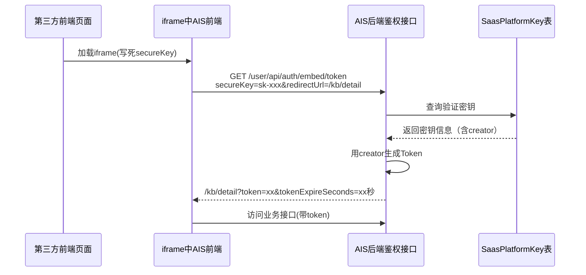
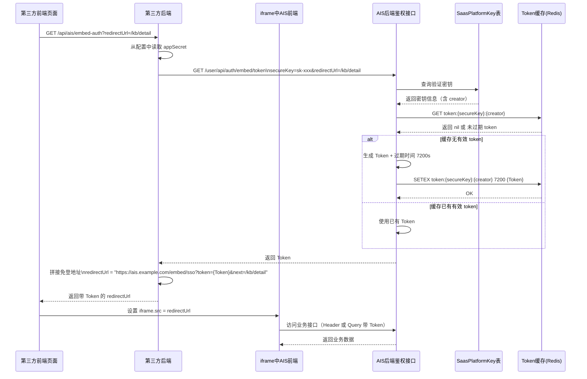

# SSO单点网页内嵌登录鉴权设计

## 方案一：基础版本（不安全，不推荐）

### 问题说明

密钥暴露在前端代码中，任何人可通过浏览器查看源代码获取密钥，存在严重安全隐患。

### 实现流程



### 具体实现说明

#### 第三方前端集成

**方式一：直接设置iframe的src（密钥暴露）**

```html
<!DOCTYPE html>
<html>
<head>
    <title>嵌入示例</title>
</head>
<body>
    <h1>嵌入应用示例</h1>
    <iframe 
        id="embedFrame" 
        width="100%" 
        height="100%" 
        frameborder="0">
    </iframe>

    <script>
        // 密钥, 可以是平台密钥 或者 临时token
        const secureKey = '760019c8c8a64b6d9ff417f330457834';
        // 嵌入地址
        const embedUrl = 'https://your-domain.com/embed/sso';
        // 登录成功后, 重定向的地址, 请使用 encodeURIComponent 进行编码
        // 可选参数, 不传的话, 默认跳到第一个有权限的页面
        const redirect = encodeURIComponent('https://your-domain.com/')
        
       document.getElementById('embedFrame').src = `${embedUrl}?secureKey=${secureKey}&redirect=${redirect}`
    </script>
</body>
</html>
```

#### AIS后端实现大致思路部分

```java
  @GetMapping("/token")
    @Operation(summary = "获取嵌入Token", description = "支持两种模式：1.平台密钥(tk-开头)获取token 2.临时token换取新token")
    public Result<ModuleEmbedAuthResp> getToken(
            @RequestParam("secureKey") @Parameter(description = "密钥或临时token", required = true, in = ParameterIn.QUERY) String secureKey,
            HttpServletRequest request,
            HttpServletResponse response) {

        log.info("获取嵌入Token, secureKey: {}", secureKey);
        
        ModuleEmbedAuthResp resp;
        String newToken;
        
        // 判断secureKey是否以tk-开头（平台密钥）
        if (secureKey.startsWith(Cns.API_TOKEN_PREFIX_V2)) {
            // 模式1：平台密钥模式（tk-开头）
            log.info("模式1：使用平台密钥获取token, secureKey: {}", secureKey);
            
            // getEmbedToken内部会添加Bearer前缀
            resp = moduleEmbedAuthService.getEmbedToken(secureKey, request);
            newToken = resp.getToken();
            
            log.info("模式1：平台密钥生成token成功");
            
        } else {
            // 模式2：临时token模式（从/apiToken接口获取的token）
            log.info("模式2：使用临时token换取新token, tempToken: {}", secureKey);
            
            // 从Redis中查询userCode
            String redisKey = "embed:api_token:" + secureKey;
            String userCode = RedisUtil.getString(redisKey);
            
            // 验证临时token是否有效
            Assert.isTrue(StringUtils.isNotEmpty(userCode), () -> new BizException(ErrorCodeEnum.PARAM_ERROR.getCode(), "临时token无效或已使用"));
            
            log.info("模式2：从Redis查询到userCode: {}", userCode);
            
            // 删除Redis中的临时token记录（保证一次性使用）
            RedisUtil.del(redisKey);
            log.info("模式2：已删除Redis中的临时token记录，保证一次性使用");
            
            // 使用userCode生成新的token
            SysUserInfo userInfo = userAuthService.getUserInfo(userCode, 0, Cns.SYS_TYPE.CLI);
            Assert.notNull(userInfo, () -> new BizException("用户不存在"));
            
            // 生成新Token
            StpUtil.login(userCode);
            UserContextHolder.setCurrentUser(userInfo);
            newToken = StpUtil.getTokenInfo().getTokenValue();
            
            Integer tokenExpireSeconds = 7200; // 默认过期时间2小时
            resp = new ModuleEmbedAuthResp();
            resp.setToken(newToken);
            resp.setTokenExpireSeconds(tokenExpireSeconds);
            
            log.info("模式2：临时token换取新token成功");
        }

        // 设置Cookie，将新token写入到自己域名的Cookie中
        if (StringUtils.isNotEmpty(newToken)) {
            // 使用token的过期时间作为Cookie的存活时间
            // 优先使用resp中的过期时间，如果没有则使用Sa-Token配置文件中的timeout值
            int cookieAliveTime = resp.getTokenExpireSeconds() != null 
                ? resp.getTokenExpireSeconds() 
                : (int) saTokenConfig.getTimeout();

            // 写入Sa-Token识别的Cookie名称（与配置文件中的token-name保持一致）
            JakartaServletUtil.addCookie(response, saTokenConfig.getTokenName(), newToken, cookieAliveTime);
            log.info("设置Sa-Token Cookie成功, cookieName: {}, cookieAliveTime: {}秒", saTokenConfig.getTokenName(), cookieAliveTime);
        }

        return Result.success(resp);
    }
```

#### 配置文件

**application.yml**

```yaml
# 模块嵌入配置
embed:
  # Token过期时间（秒）
  default-token-expire: 7200
```

#### 核心逻辑说明

1. **密钥验证**：
   - 使用`PlatformKeyService.getByKey()`方法验证密钥
   - 密钥格式：`Bearer sk-xxxxxxxxxxxxx`
   - 从`saas_platform_key`表中查询密钥信息
2. **用户登录**：
   - 从密钥信息中获取`creator`字段作为登录用户编码
   - 使用`UserAuthService.getUserInfo()`获取用户完整信息
   - 调用`StpUtil.login(userCode)`生成Sa-Token
   - 设置用户上下文`UserContextHolder.setCurrentUser(userInfo)`
3. **iframe自动跳转**：
   - iframe的src指向鉴权接口
   - 最终iframe展示的是带token的目标页面

### 安全风险

⚠️ **关键问题：密钥暴露**

- 密钥直接写在HTML源代码中
- 任何人通过"查看网页源代码"即可获取密钥
- 获取密钥后可无限制调用AIS接口

⚠️ **无法控制访问**

- 无法限制密钥的使用范围
- 无法追踪密钥泄露源头
- 密钥被盗用后难以及时发现

⚠️ **仅适用场景**

- 内网环境（无外部访问风险）
- 快速原型验证


---

## 方案二：安全版本（推荐）

### 核心思想

密钥只存储在第三方服务端，前端通过第三方后端代理获取token，密钥不暴露给浏览器。

### 实现流程



### AIS后端实现部分

#### 1. Token生成接口（返回JSON）

```java
    @GetMapping("/apiToken")
    @Operation(summary = "获取API Token（纯接口版本）", description = "用于第三方系统纯后端API调用，根据平台密钥生成一次性临时Token")
    public Result<ModuleEmbedAuthResp> getApiToken(
            @RequestParam("secureKey") @Parameter(description = "平台密钥（完整格式：tk-xxx）", required = true, in = ParameterIn.QUERY) String secureKey,
            HttpServletRequest request) {

        log.info("获取API Token（纯接口版本）, secureKey: {}", secureKey);

        // 如果传入的secureKey不包含tk-前缀，自动添加（兼容旧接口）
        String fullSecureKey = secureKey.startsWith(Cns.API_TOKEN_PREFIX_V2) ? secureKey : Cns.API_TOKEN_PREFIX_V2 + secureKey;
        
        // 调用服务层生成Token（支持缓存机制）
        ModuleEmbedAuthResp resp = moduleEmbedAuthService.getEmbedToken(fullSecureKey, request);
        String userCode = StpUtil.getLoginIdAsString();
        
        // 生成一个临时token（一次性使用）
        String tempToken = IdUtil.fastSimpleUUID();
        
        // 将临时token和userCode的映射存储到Redis，有效期与tokenExpireSeconds保持一致
        Integer expireSeconds = resp.getTokenExpireSeconds() != null ? resp.getTokenExpireSeconds() : 7200;
        String redisKey = "embed:api_token:" + tempToken;
        RedisUtil.setString(redisKey, userCode, expireSeconds);
        
        log.info("生成临时API Token成功, tempToken: {}, userCode: {}, expireSeconds: {}秒", tempToken, userCode, expireSeconds);

        // 返回临时token
        ModuleEmbedAuthResp result = new ModuleEmbedAuthResp();
        result.setToken(tempToken);
        result.setTokenExpireSeconds(expireSeconds);
        
        return Result.success(result);
    }
```

#### 3. 配置文件

**application.yml**

```yaml
# 模块嵌入配置
embed:
  # Token过期时间（秒，默认7200=2小时）
  token-expire: 7200
```


# 嵌入认证API对接指南

## 文档概述

本文档提供了嵌入式Token认证API的完整对接说明，用于第三方系统、嵌入式应用或跨域应用获取访问令牌。

------

## 前置条件

### 获取平台密钥

在使用API之前，您需要先在系统中创建平台密钥：

1. 登录系统

2. 进入 **管理中心** → **密钥管理** → **密钥管理**

   

3. 点击 **新增密钥**，填写密钥名称

4. 创建成功后，系统会生成形如 `tk-f374bde1861db87387398b39c4644edc` 的平台密钥

5. **重要**: 请妥善保存密钥，密钥只在创建时完整显示一次

------

## API接口说明

系统提供两个认证接口，适用于不同的使用场景：

| 接口                      | 场景                 | Token类型        | 生命周期        |
| ------------------------- | -------------------- | ---------------- | --------------- |
| `/user/api/auth/token`    | 前端嵌入、浏览器场景 | 可复用的访问令牌 | 支持缓存，2小时 |
| `/user/api/auth/apiToken` | 纯后端API调用        | 一次性临时令牌   | 仅可使用一次    |

------

## 接口一：获取嵌入Token

### 基本信息

- **接口路径**: `/user/api/auth/token`
- **请求方法**: `GET`
- **适用场景**: 
  - iframe嵌入场景
  - 跨域前端应用
  - 需要在浏览器中设置Cookie的场景
- **特点**: 
  - 支持两种模式：平台密钥模式和临时token模式
  - 自动设置Cookie到响应中
  - Token可缓存复用

### 请求参数

| 参数名    | 类型   | 必填 | 说明                | 示例                                  |
| --------- | ------ | ---- | ------------------- | ------------------------------------- |
| secureKey | String | 是   | 平台密钥或临时token | `tk-f374bde1861db87387398b39c4644edc` |

### 两种使用模式

#### 模式1：平台密钥模式（推荐用于iframe嵌入）

**适用场景**: 前端应用通过iframe嵌入，需要自动登录

**请求示例**:

```http
GET /user/api/auth/token?secureKey=tk-f374bde1861db87387398b39c4644edc HTTP/1.1
Host: your-domain.com
```

**cURL示例**:

```bash
curl -X GET "https://your-domain.com/user/api/auth/token?secureKey=tk-f374bde1861db87387398b39c4644edc"
```

### 密钥有误示例

#### 密钥错误

**JavaScript示例**:

```javascript
// 前端直接调用（适用于iframe嵌入场景）
const secureKey = 'tk-f374bde1861db87387398b39c4644edc';
fetch(`https://your-domain.com/user/api/auth/token?secureKey=${secureKey}`, {
  method: 'GET',
  credentials: 'include' // 重要：允许设置Cookie
})
.then(response => response.json())
.then(data => {
  console.log('Token:', data.data.token);
  console.log('过期时间（秒）:', data.data.tokenExpireSeconds);
  // Cookie已自动设置，可以直接访问需要登录的页面
  window.location.href = '/dashboard';
});
```

#### 模式2：临时Token模式（适用于后端中转场景，更加安全）

**适用场景**:

- 后端服务获取临时token，需要先调用**获取API Token（纯接口版本）**
- 通过重定向传递给前端
- 前端用临时token换取真实token

**流程说明**:

```
后端服务 → 调用/apiToken获取临时token → 重定向到前端 → 前端调用/token换取真实token
```

**请求示例**:

```http
GET /user/api/auth/token?secureKey=a3f8d9e2c1b4a5f6g7h8i9j0 HTTP/1.1
Host: your-domain.com
```

**注意**:

- 临时token格式为32位UUID（不含`tk-`前缀）
- 临时token只能使用一次，使用后自动失效
- 临时token有效期与平台密钥生成的token有效期一致（默认2小时）

### 响应结果

**成功响应** (HTTP 200):

```json
{
  "code": 200,
  "msg": "success",
  "data": {
    "token": "eyJhbGciOiJIUzI1NiIsInR5cCI6IkpXVCJ9...",
    "tokenExpireSeconds": 7200
  }
}
```

**响应字段说明**:

| 字段                    | 类型    | 说明                                   |
| ----------------------- | ------- | -------------------------------------- |
| code                    | Integer | 状态码，200表示成功                    |
| msg                     | String  | 响应消息                               |
| data.token              | String  | 访问令牌，用于后续API调用              |
| data.tokenExpireSeconds | Integer | Token有效期（秒），默认7200秒（2小时） |

**特殊行为**:

- 响应会自动设置名为 `token` 的Cookie
- Cookie的有效期与tokenExpireSeconds一致
- Cookie会被设置到当前域名下

**错误响应** (HTTP 200，业务错误):

```json
{
  "code": 8500,
  "msg": "密钥无效",
  "data": null
}
```

------

## 接口二：获取API Token（纯接口版本）

### 基本信息

- **接口路径**: `/user/api/auth/apiToken`
- **请求方法**: `GET`
- **适用场景**: 
  - 纯后端服务对服务调用
  - 需要生成一次性临时token
- **特点**: 
  - 返回一次性临时token
  - 不设置Cookie
  - 支持与`/token`接口配合使用

### 请求参数

| 参数名    | 类型   | 必填 | 说明                 | 示例                                  |
| --------- | ------ | ---- | -------------------- | ------------------------------------- |
| secureKey | String | 是   | 平台密钥（完整格式） | `tk-f374bde1861db87387398b39c4644edc` |

**注意**:

- 传入完整格式（含`tk-`前缀）

### 请求示例

**HTTP请求**:

```http
GET /user/api/auth/apiToken?secureKey=tk-f374bde1861db87387398b39c4644edc HTTP/1.1
Host: your-domain.com
```

**cURL示例**:

```bash
curl -X GET "https://your-domain.com/user/api/auth/apiToken?secureKey=tk-f374bde1861db87387398b39c4644edc"
```

**Java示例**:

```java
// 后端服务调用
String secureKey = "tk-f374bde1861db87387398b39c4644edc";
String url = "https://your-domain.com/user/api/auth/apiToken?secureKey=" + secureKey;

HttpResponse<String> response = HttpClient.newHttpClient()
    .send(HttpRequest.newBuilder()
        .uri(URI.create(url))
        .GET()
        .build(), 
    HttpResponse.BodyHandlers.ofString());

JSONObject result = new JSONObject(response.body());
String tempToken = result.getJSONObject("data").getString("token");
Integer expireSeconds = result.getJSONObject("data").getInt("tokenExpireSeconds");

// 将临时token传递给前端（例如通过重定向）
String redirectUrl = "https://frontend.com/auth?token=" + tempToken;
```

**Python示例**:

```python
import requests

secure_key = "tk-f374bde1861db87387398b39c4644edc"
url = f"https://your-domain.com/user/api/auth/apiToken?secureKey={secure_key}"

response = requests.get(url)
data = response.json()

temp_token = data['data']['token']
expire_seconds = data['data']['tokenExpireSeconds']

print(f"临时Token: {temp_token}")
print(f"有效期: {expire_seconds}秒")
```

### 响应结果

**成功响应** (HTTP 200):

```json
{
  "code": 200,
  "msg": "success",
  "data": {
    "token": "a3f8d9e2c1b4a5f6g7h8i9j0",
    "tokenExpireSeconds": 7200
  }
}
```

**响应字段说明**:

| 字段                    | 类型    | 说明                            |
| ----------------------- | ------- | ------------------------------- |
| data.token              | String  | 一次性临时token（32位UUID格式） |
| data.tokenExpireSeconds | Integer | Token有效期（秒）               |

**重要特性**:

- 返回的token是临时token，不是真实的访问令牌
- 临时token只能使用一次
- 需要调用`/user/api/auth/token`接口换取真实token

------

## ⚠️ 错误码说明

| 错误码 | 错误信息              | 原因                            | 解决方案                           |
| ------ | --------------------- | ------------------------------- | ---------------------------------- |
| 8500   | 密钥无效              | 平台密钥不存在或已被删除        | 检查密钥是否正确，确认密钥未被删除 |
| 8500   | 密钥创建人不存在      | 创建密钥的用户已被删除          | 联系管理员重新创建密钥             |
| 8500   | 临时token无效或已使用 | 临时token不存在、已过期或已使用 | 重新获取临时token                  |
| 8500   | 用户不存在            | 关联的用户账号已被删除          | 联系管理员处理                     |


## 完整使用流程示例

### 场景1：前端iframe嵌入（简单模式）

**步骤**:

1. 前端在iframe的src中携带: 密钥和重定向地址
2. 系统自动完成认证并设置Cookie
3. 系统自动重定向到指定页面

**示例代码**:

```html
<!DOCTYPE html>
<html>
<head>
    <title>嵌入示例</title>
</head>
<body>
    <h1>嵌入应用示例</h1>
    <iframe 
        id="embedFrame" 
        width="100%" 
        height="100%" 
        frameborder="0">
    </iframe>

    <script>
        // 密钥, 可以是平台密钥 或者 临时token
        const secureKey = '760019c8c8a64b6d9ff417f330457834';
        // 嵌入地址
        const embedUrl = 'https://your-domain.com/embed/sso';
        // 登录成功后, 重定向的地址, 请使用 encodeURIComponent 进行编码
        // 可选参数, 不传的话, 默认跳到第一个有权限的页面
        const redirect = encodeURIComponent('https://your-domain.com/')
        
       document.getElementById('embedFrame').src = `${embedUrl}?secureKey=${secureKey}&redirect=${redirect}`
    </script>
</body>
</html>
```

### 场景2：后端生成临时token，前端换取真实token

**后端代码（Java Spring Boot）**:

```java
@GetMapping("/redirect-to-app")
public void redirectToApp(HttpServletResponse response) throws IOException {
    String secureKey = "tk-f374bde1861db87387398b39c4644edc";
    
    // 调用apiToken接口获取临时token
    String apiUrl = "https://your-domain.com/user/api/auth/apiToken?secureKey=" + secureKey;
    RestTemplate restTemplate = new RestTemplate();
    ResponseEntity<Map> apiResponse = restTemplate.getForEntity(apiUrl, Map.class);
    
    Map<String, Object> data = (Map<String, Object>) apiResponse.getBody().get("data");
    String tempToken = (String) data.get("token");
    
    // 重定向到前端，携带临时token
    String redirectUrl = "https://frontend.com/auth-callback?tempToken=" + tempToken;
    response.sendRedirect(redirectUrl);
}
```

**前端代码（JavaScript）**:

```javascript
// 前端从URL获取临时token
const urlParams = new URLSearchParams(window.location.search);
const tempToken = urlParams.get('tempToken');

if (tempToken) {
    // 用临时token换取真实token
    fetch(`https://your-domain.com/user/api/auth/token?secureKey=${tempToken}`, {
        credentials: 'include'
    })
    .then(response => response.json())
    .then(data => {
        if (data.code === 200) {
            console.log('认证成功');
            // Cookie已设置，可以访问需要登录的页面
            window.location.href = '/dashboard';
        } else {
            console.error('临时token无效或已使用');
        }
    });
}
```

------

## 常见问题 (FAQ)

### Q1: 平台密钥和临时token有什么区别？

**A**:

- **平台密钥**: 以`tk-`开头，长期有效，由管理员在后台创建，需要妥善保管
- **临时token**: 32位UUID格式，由`/apiToken`接口生成，一次性使用，使用后立即失效

### Q2: 我应该使用哪个接口？

**A**:

- 如果是**前端嵌入场景**（iframe），使用 `/token` 接口（模式1）。但是密钥直接暴露不安全
- 如果是**后端中转场景**，先用 `/apiToken` 获取临时token，前端再用 `/token` 换取真实token

### Q3: Token过期了怎么办？

**A**: Token过期后，重新调用认证接口获取新token即可。系统有缓存机制，不会造成性能问题。

### Q4: 为什么调用接口返回"密钥无效"？

**A**: 可能的原因：

1. 密钥格式错误（检查是否包含`tk-`前缀）
2. 密钥已被删除
3. 密钥输入错误（注意大小写）

### Q5: 临时token可以多次使用吗？

**A**: 不可以。临时token是一次性的，使用后会立即从系统中删除。如果需要多次使用，请缓存换取到的真实token。

### Q6: Cookie没有设置成功怎么办？

**A**:

1. 确认请求时使用了 `credentials: 'include'`
2. 确认域名配置正确，跨域需要配置CORS
3. 检查浏览器是否禁用了第三方Cookie

### Q7: 如何在后续API调用中使用token？

**A**:
有两种方式：

1. **Cookie方式**（推荐）: `/token`接口已自动设置Cookie，后续请求会自动携带
2. **Header方式**: 在请求头中添加 `Authorization: Bearer {token}`

### Q8: 平台密钥可以传给前端吗？

**A**:

- **不推荐**: 平台密钥是长期有效的，不应该暴露在前端代码中
- **推荐方案**: 后端使用`/apiToken`生成临时token，再传给前端
