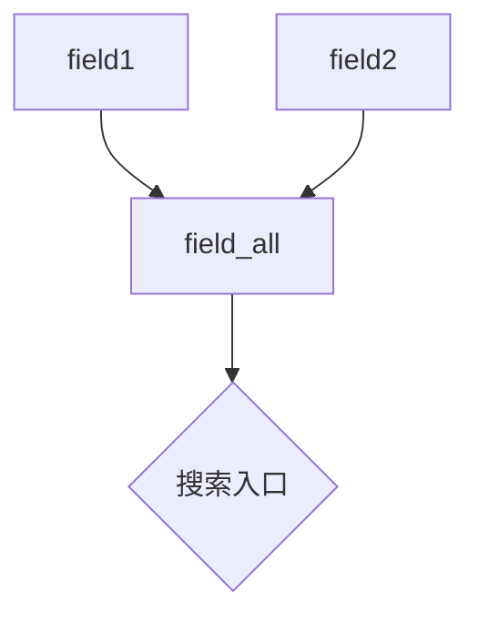

# ES中Copy_to参数故事版

> ## copy_to
>
> **copy_to**：该参数允许将多个字段的值复制到组字段中，然后可以将其作为单个字段进行查询
>
> ```java
> #copy_to
> delete copy_to
> PUT copy_to
> {
>   "mappings": {
>     "properties": {
>       "field1": {
>         "type": "text",
>         "copy_to": "field_all" 
>       },
>       "field2": {
>         "type": "text",
>         "copy_to": "field_all" 
>       },
>       "field_all": {
>         "type": "text"
>       }
>     }
>   }
> }
> 
> PUT copy_to/_doc/1
> {
>   "field1": "field1",
>   "field2": "field2"
> }
> GET copy_to/_search
> 
> GET copy_to/_search
> {
>   "query": {
>     "term": {
>       "field_all": "field2"
>     }
>   }
> }
> ```
>


# **Copy_to 参数：数字村的"中央情报局" 🕵️♂️**

想象数字村有多个部门（字段），每个部门都有自己的情报档案。但村长发现每次查资料都要跑遍所有部门太麻烦了！于是成立了**中央情报局（copy_to字段）**，把各部门的重要情报都复制一份到这里，方便统一查询。

## **故事：中央情报局的运作**

### **1. 建立情报网络**
```json
PUT copy_to
{
  "mappings": {
    "properties": {
      "field1": {                  // 情报部门1
        "type": "text",
        "copy_to": "field_all"     // 向中央情报局报送情报
      },
      "field2": {                  // 情报部门2
        "type": "text",
        "copy_to": "field_all"     // 向中央情报局报送情报
      },
      "field_all": {               // 中央情报局
        "type": "text"             // 汇总所有情报
      }
    }
  }
}
```

### **2. 各部门提交情报**
```json
PUT copy_to/_doc/1
{
  "field1": "恐怖分子在A区活动",  // 部门1的情报
  "field2": "B区发现可疑包裹"     // 部门2的情报
}
```

### **3. 中央情报局的秘密档案**
虽然没直接给`field_all`字段赋值，但它自动拥有了：
```
"field_all": "恐怖分子在A区活动 B区发现可疑包裹"
```

### **4. 高效查询演示**
```json
GET copy_to/_search
{
  "query": {
    "match": {
      "field_all": "可疑包裹"  // 直接在中央情报局查情报
    }
  }
}
```
✅ **结果：立即找到文档1！**
- 尽管"可疑包裹"原本属于`field2`
- 中央情报局`field_all`汇总了所有情报

---

## **关键原理图解**



- **情报复制是实时的**：写入时自动复制
- **原始数据保持不变**：`field1`和`field2`仍有独立存储
- **中央情报局是只读的**：不能直接修改`field_all`

---

## **为什么需要中央情报局？**

### **场景1：跨字段联合搜索**
```json
// 传统方式：繁琐的多字段查询
"query": {
  "bool": {
    "should": [
      {"match": {"field1": "关键词"}},
      {"match": {"field2": "关键词"}}
    ]
  }
}

// 中央情报局方式：简洁高效
"query": {
  "match": {
    "field_all": "关键词"  // 一次查询覆盖所有字段
  }
}
```

### **场景2：解决中文分词问题**
```json
// 问题：跨字段的分词不一致
"field1": "人工智能" → 分成["人工","智能"]
"field2": "智能机器" → 分成["智能","机器"]

// 中央情报局：
"field_all": "人工智能 智能机器" → 分成["人工","智能","智能","机器"]
```
- 搜索"智能"时，能同时匹配两个字段的内容

### **场景3：提升搜索体验**
```json
// 电商搜索示例
PUT products
{
  "mappings": {
    "properties": {
      "title": {
        "type": "text",
        "copy_to": "full_search"  
      },
      "description": {
        "type": "text",
        "copy_to": "full_search"  
      },
      "tags": {
        "type": "keyword",
        "copy_to": "full_search"  
      },
      "full_search": {"type": "text"}  // 中央搜索字段
    }
  }
}
```
- 用户搜索框只需查询`full_search`字段
- 自动涵盖标题、描述、标签所有内容

---

## **使用技巧与注意事项**

### **1. 多字段复制到同一字段**
```json
"field1": {"type": "text", "copy_to": "combined"},
"field2": {"type": "text", "copy_to": "combined"},
"field3": {"type": "text", "copy_to": "combined"},
"combined": {"type": "text"}
```

### **2. 复制到多个字段**
```json
"content": {
  "type": "text",
  "copy_to": ["field_all", "search_field"] 
}
```

### **3. 重要限制**
| 特性 | 说明 |
|------|------|
| **仅文本类型** | 只支持text类型字段的复制 |
| **复制而非移动** | 原始字段值保持不变 |
| **不支持数组** | 不能复制数组到数组 |
| **存储开销** | 会增加存储空间占用 |
| **索引开销** | 会增加索引处理时间 |

### **4. 实战替代方案**
```json
// 需要搜索非文本字段时
PUT alternative
{
  "mappings": {
    "properties": {
      "name": {"type": "text"},
      "price": {"type": "float"},
      "combined": {
        "type": "text",
        "analyzer": "custom_analyzer"
      }
    }
  }
}

// 应用层在写入时手动组合字段
PUT alternative/_doc/1
{
  "name": "手机",
  "price": 3999,
  "combined": "手机 3999"  // 手动组合
}
```

---

## **记忆口诀**

**Copy_to 像情报中心：**
- **分散收集**：各字段向中央字段报送数据
- **集中使用**：只需查询中央字段就能搜全部内容
- **提高效率**：简化复杂查询
- **空间换时间**：增加存储但提升搜索体验

**适用场景：**
- 跨字段联合搜索
- 统一搜索入口
- 解决字段分词不一致问题

记住这个中央情报局的比喻，你就掌握了高效搜索的秘诀！🔍🚀
