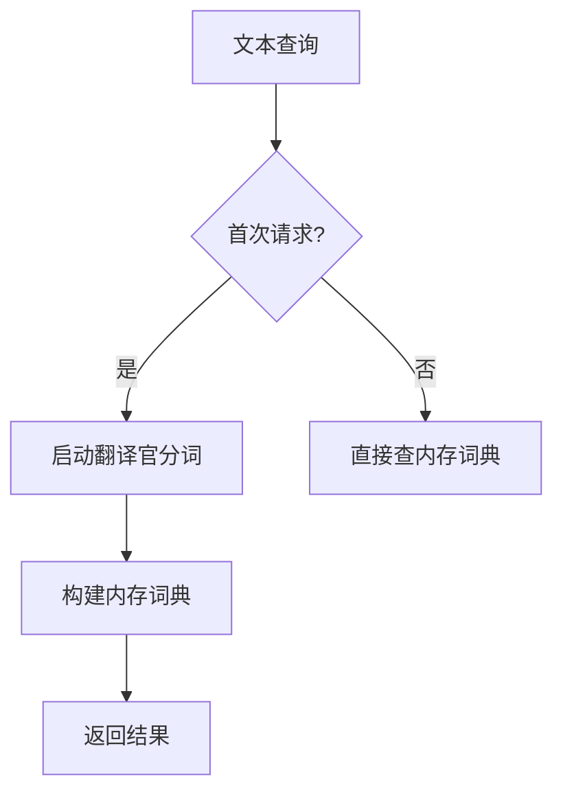

# ES中Doc_Values 与 Fielddata 故事版

> ## doc_values 和 fielddata
>
> **doc_values**：为了提升排序和聚合效率，默认true，如果确定不需要对字段进行排序或聚合，也不需要通过脚本访问字段值，则可以禁用doc值以节省磁盘空间（不支持text和annotated_text）
>
> 大部分的字段在索引时都会生成 doc_values，除了 text。text 字段在查询时会生成一个 fielddata 的数据结构，fieldata 在字段首次被聚合、排序的时候生成


# **Doc_Values 与 Fielddata：数字村的「档案馆」与「实时翻译站」 📚🔄**

让我们用数字村的**档案馆**和**实时翻译站**来比喻这两个关键概念：

---

## **故事背景**
数字村所有资料都存储在**图书馆（Elasticsearch）**中：
- **结构化数据**（数字、日期、标签）→ 存放在**档案馆（Doc_Values）**
- **文本内容**（文章、描述）→ 需要**实时翻译站（Fielddata）**处理

---

## **1. 档案馆（Doc_Values）**
### **工作方式**


### **核心特点**
| 特性 | 说明 | 比喻 |
|------|------|------|
| **提前准备** | 数据写入时生成 | 新书入库时直接归档 |
| **列式存储** | 按字段纵向存储 | 所有书籍按「出版年」单独归档 |
| **磁盘存储** | 不占内存 | 档案存在地下室（磁盘） |
| **默认开启** | 数值/日期等自动启用 | 新档案馆自动建成 |
| **高效聚合** | 快速计算总和/平均值 | 秒算全村平均年龄 |

### **禁用场景（省磁盘空间）**
```json
PUT citizens
{
  "mappings": {
    "properties": {
      "secret_code": {       // 绝密编码
        "type": "keyword",
        "doc_values": false  // 关闭档案馆存储
      }
    }
  }
}
```
- **适用**：永不排序/聚合的字段（如加密哈希值）

---

## **2. 实时翻译站（Fielddata）**
### **工作方式**


### **核心特点**
| 特性 | 说明 | 比喻 |
|------|------|------|
| **按需启动** | 首次聚合/排序时触发 | 村民咨询时才召翻译官 |
| **内存存储** | 直接加载到内存 | 翻译官大脑记忆内容 |
| **分词依赖** | 需先拆分文本 | 翻译官先拆解句子 |
| **默认关闭** | Text字段需手动开启 | 翻译站平时不运营 |
| **资源消耗** | 可能内存溢出 | 翻译官脑容量有限 |

### **开启示例（谨慎使用！）**
```json
PUT library
{
  "mappings": {
    "properties": {
      "book_content": {
        "type": "text",
        "fielddata": true  // 启用实时翻译站
      }
    }
  }
}
```

---

## **对比总结：档案馆 vs 翻译站**

| 特性 | 档案馆（Doc_Values） | 翻译站（Fielddata） |
|------|----------------------|---------------------|
| **存储位置** | 磁盘 | 内存 |
| **生成时机** | 写入数据时 | 首次查询时 |
| **数据类型** | 数值/日期/Keyword | Text文本 |
| **默认状态** | 开启（结构化字段） | 关闭（需手动开启） |
| **主要用途** | 排序、聚合、脚本 | 文本聚合、分词排序 |
| **资源消耗** | 磁盘空间 | 内存容量 |
| **性能影响** | 持续稳定 | 首次查询慢，可能内存溢出 |

---

## **村民实践笔记**

### **场景1：商品价格分析（用档案馆）**
```json
GET products/_search
{
  "size": 0,
  "aggs": {
    "price_stats": {
      "stats": {"field": "price"} // 直接访问档案馆数据
    }
  }
}
```
- ✅ 毫秒级响应（数据已预归档）

### **场景2：文章关键词统计（用翻译站）**
```json
GET articles/_search
{
  "size": 0,
  "aggs": {
    "top_words": {
      "terms": {"field": "content"} // 触发Fielddata加载
    }
  }
}
```
- ⚠️ 首次执行较慢（需分词建索引）
- ⚠️ 可能内存告警（百万级词项）

### **生产环境黄金法则**
```json
// 好的配置示例
PUT best_practice_index
{
  "mappings": {
    "properties": {
      // 结构化字段 → 用档案馆
      "price": {"type": "scaled_float", "doc_values": true},
      "create_time": {"type": "date"},
      
      // 文本字段 → 谨慎开翻译站
      "description": {
        "type": "text",
        "fielddata": false,  // 默认关闭
        
        // 添加专用Keyword字段代替
        "fields": {
          "keyword": {"type": "keyword"}
        }
      },
      
      // 需要文本聚合的特殊字段
      "tags": {
        "type": "text",
        "fielddata": true,   // 明确开启
        "analyzer": "simple" // 简单分词降低内存消耗
      }
    }
  }
}
```

---

## **记忆口诀**

**两大数据处理器：**
- **档案馆（Doc_Values）**  
  📍 **磁盘存** 📍 **提前备** 📍 **结构化数据好帮手**  
- **翻译站（Fielddata）**  
  📍 **内存跑** 📍 **按需建** 📍 **文本处理要慎用**

**避坑指南：**
> ✋ 文本聚合先问己：  
> 是否真需分词统计？  
> 数据量会爆内存？  
> 改用Keyword可否替？  

记住这个比喻，你就能在磁盘与内存间做出智慧权衡！ ⚖️🚀