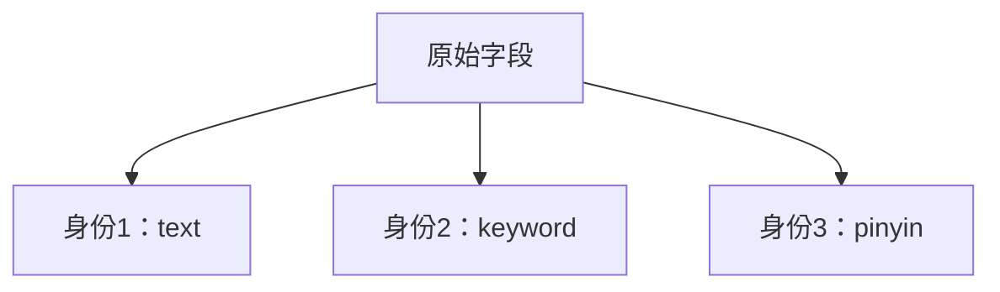
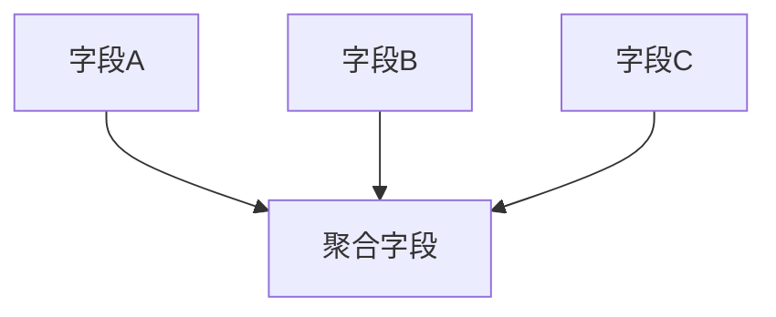

# ES中fields参数故事版

> ## fields
>
> fields 参数可以让同一字段有多种不同的索引方式
>
> ```java
> #fields
> DELETE blog
> 
> PUT blog
> {
>   "mappings": {
>     "properties": {
>       "title":{
>         "type": "text",
>         "fields": {
>           "raw":{
>             "type":"keyword"
>           }
>         }
>       }
>     }
>   }
> }
> 
> PUT blog/_doc/1
> {
>   "title":"javaboy"
> }
> 
> GET blog/_search
> {
>   "query": {
>     "term": {
>       "title.raw": "javaboy"
>     }
>   }
> }
> GET blog/_doc/1
> ```
>


# **fields参数：超市商品的「多重身份标签系统」🏷️👤→👥**

想象数字村的超市里，每件商品都有一个**智能标签机**，可以同时生成多种不同用途的标签！这就是Elasticsearch的fields参数——让一个字段拥有多重身份！

---

## **故事：智能标签机的妙用**

### **1. 普通商品标签（单一面孔）**
```json
// 传统做法（单一标签）
"product_name": {
  "type": "text"   // 只能全文搜索
}
```
**局限性：**
- 🔍 能搜"有机苹果"
- ❌ 不能精确匹配"有机苹果"
- ❌ 不能按字母顺序排列商品

---

### **2. 智能标签机上线（fields参数）**
```json
PUT supermarket
{
  "mappings": {
    "properties": {
      "product_name": {
        "type": "text",   // 主标签：可模糊搜索
        "fields": {
          "raw": {        // 子标签1：精确身份证
            "type": "keyword"
          },
          "pinyin": {      // 子标签2：拼音搜索
            "type": "text",
            "analyzer": "pinyin"
          }
        }
      }
    }
  }
}
```
**标签机工作流程：**
1. 商品"有机苹果"入库
2. 同时生成三种标签：
   - **主标签**：`"有机苹果"`（可分词搜索）
   - **raw标签**：`"有机苹果"`（完整精确匹配）
   - **pinyin标签**：`"you ji ping guo"`（拼音搜索）

---

### **3. 各司其职的标签**
#### **场景1：模糊搜索（用主标签）**
```json
GET supermarket/_search
{
  "query": {
    "match": {
      "product_name": "苹果"  // 搜到所有含"苹果"的商品
    }
  }
}
```

#### **场景2：精确筛选（用raw标签）**
```json
GET supermarket/_search
{
  "query": {
    "term": {
      "product_name.raw": "有机苹果"  // 必须完全匹配
    }
  }
}
```

#### **场景3：拼音搜索（用pinyin标签）**
```json
GET supermarket/_search
{
  "query": {
    "match": {
      "product_name.pinyin": "youji"  // 搜"有机"
    }
  }
}
```

---

## **你的DSL案例解析**
```json
PUT blog
{
  "mappings": {
    "properties": {
      "title":{
        "type": "text",       // 主身份：文本分词
        "fields": {
          "raw":{            // 子身份：精确关键字
            "type":"keyword"
          }
        }
      }
    }
  }
}
```
**实际效果：**
```json
// 插入数据
PUT blog/_doc/1
{
  "title": "Hello Elasticsearch"  
}

// 生成双重身份：
//   title = ["hello", "elasticsearch"]  (可分词搜索)
//   title.raw = "Hello Elasticsearch"   (精确匹配)
```

**精准搜索演示：**
```json
// 精确匹配原始标题
GET blog/_search
{
  "query": {
    "term": {
      "title.raw": "Hello Elasticsearch"  // ✅ 成功
    }
  }
}

// 对比：分词搜索
GET blog/_search
{
  "query": {
    "term": {
      "title": "Hello Elasticsearch"  // ❌ 失败（需分词）
    }
  }
}
```

---

## **为什么需要多重身份？**

### **解决三大矛盾需求**
| 需求 | 单一字段困境 | fields解决方案 |
|------|--------------|----------------|
| **既要模糊又要精确** | 只能选一种类型 | 主字段text + 子字段keyword |
| **中英文混合搜索** | 无法同时处理 | 主字段中文分词 + 子字段英文分词 |
| **简繁字体兼容** | 需额外字段 | 主字段简体 + 子字段繁体 |

### **实际应用场景**
```json
// 用户系统
"username": {
  "type": "text",   // 可模糊搜"张三"
  "fields": {
    "exact": { "type": "keyword" },  // 精确登录
    "pinyin": {                      // 拼音搜索
      "type": "text",
      "analyzer": "pinyin_analyzer"
    }
  }
}

// 搜索示例
// 1. 精确登录：username.exact="张三"
// 2. 拼音搜索：username.pinyin="zhangsan"
// 3. 模糊搜索：username="张"
```

---

## **fields与copy_to的区别**

### **fields：多重身份**

- **特点**：同一字段的不同面孔
- **存储**：只存一份原始值
- **应用**：`字段名.子身份`

### **copy_to：分身术**

- **特点**：多个字段复制到新字段
- **存储**：复制多份数据
- **应用**：单独搜索聚合字段

---

## **黄金配置法则**

```json
PUT best_practice
{
  "mappings": {
    "properties": {
      // 核心字段配置多重身份
      "title": {
        "type": "text",
        "fields": {
          "raw": { "type": "keyword" },       // 精确匹配
          "icu": { "type": "text", "analyzer": "icu_analyzer" },  // 多语言
          "for_sort": { "type": "keyword", "normalizer": "lowercase" } // 排序
        }
      },
      
      // 数值字段的特殊处理
      "price": {
        "type": "scaled_float",
        "scaling_factor": 100,
        "fields": {
          "range": { "type": "float" }  // 用于范围查询
        }
      }
    }
  }
}
```

---

## **记忆口诀**

**智能标签三特性：**
1. **一字段，多面孔** → 不同场景换身份  
2. **主身自由搜索** → text类型当家  
3. **分身各显神通** → keyword精确/pinyin搜索/专用于排序  

**使用场景：**  
> 🏷️ **精确匹配** → `字段名.raw`  
> 🔡 **拼音搜索** → `字段名.pinyin`  
> 🌐 **多语言处理** → `字段名.icu`  
> 🔢 **特殊数值处理** → `字段名.range`  

记住这个智能标签机的比喻，轻松玩转Elasticsearch的多重字段映射！ 🎯🚀