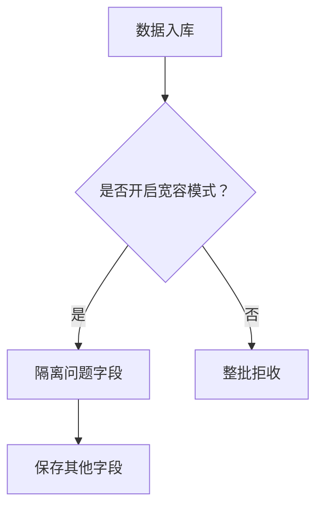

# ES中ignore_malformed参数故事版

> ## ignore_malformed
>
> ignore_malformed 可以忽略不规则的数据，该参数默认为 false
>
> ```java
> #ignore_malformed
> DELETE users
> PUT users
> {
>   "mappings": {
>     "properties": {
>       "birthday":{
>         "type": "date",
>         "format": "yyyy-MM-dd||yyyy-MM-dd HH:mm:ss"
>       },
>       "age":{
>         "type": "integer",
>         "ignore_malformed": true
>       }
>     }
>   }
> }
> 
> PUT users/_doc/1
> {
>   "birthday":"2020-11-11",
>   "age":99
> }
> 
> PUT users/_doc/2
> {
>   "birthday":"2020-11-11 11:11:11",
>   "age":"abc"
> }
> 
> GET users/_doc/2
> 
> PUT users/_doc/2
> {
>   "birthday":"2020-11-11 11:11:11aaa",
>   "age":"abc"
> }
> ```
>


# **ignore_malformed：数字村的「宽容质检员」 🛂✨**

想象数字村有个**海关质检站**，所有进口货物（数据）都要在这里接受检查。而 `ignore_malformed` 参数就是质检员的工作模式开关，决定了如何处理不合格的货物：

---

## **故事：两种质检模式**

### **1. 严格模式（默认 false）**
```json
"age": {
  "type": "integer",
  "ignore_malformed": false   // 默认值
}
```
**质检员行为：**
- 🔍 发现"abc"冒充数字 → 🚫 **立即拒收整个货柜！**
- ❌ 错误信息：`"reason": "For input string: \"abc\""`

### **2. 宽容模式（设置 true）**
```json
"age": {
  "type": "integer",
  "ignore_malformed": true    // 开启宽容模式
}
```
**质检员行为：**
- 🔍 发现"abc"冒充数字 → ⚠️ **单独隔离问题货物**
- ✅ **放行其他合格货物**
- 📦 **问题货物存隔离仓**（保留原始值但不使用）

---

## **实战场景演示**

### **场景1：合格货物正常通行**
```json
PUT village/_doc/1
{
  "birthday": "2020-11-11",  // ✅ 合格日期
  "age": 99                  // ✅ 合格数字
}
```
结果：顺利通关，货物可搜索

### **场景2：混装货物宽容处理**
```json
PUT village/_doc/2
{
  "birthday": "2020-11-11 11:11:11",  // ✅ 合格日期
  "age": "abc"                        // ❌ 假数字
}
```
宽容质检员：
1. 放行 `birthday` → 可搜索
2. 隔离 `age` → 不索引但存储
3. 整批货物仍可查询（通过其他字段）

### **场景3：危险货物坚决拦截**
```json
PUT village/_doc/3
{
  "birthday": "2020-11-11 11:11:11aaa",  // ❌ 污染日期
  "age": "abc"                           // ❌ 假数字
}
```
结果：
- 🚫 **整批货物被拒收！**
- 错误信息：`"reason": "failed to parse date field [...]"`

---

## **核心规则图解**



---

## **宽容质检员的秘密仓库**

### **查看被隔离的货物**
```json
GET village/_doc/2
/* 返回：
{
  "birthday": "2020-11-11 11:11:11",
  "age": "abc"   // ❌ 仍在仓库但无索引
} */
```

### **搜索测试**
```json
// 尝试搜索问题字段（失败）
GET village/_search
{
  "query": {"term": {"age": "abc"}}  // ❌ 无结果
}

// 搜索正常字段（成功）
GET village/_search
{
  "query": {"match": {"birthday": "2020-11-11"}}  // ✅ 找到文档
}
```

---

## **为什么需要宽容模式？**

### **数据清洗场景**
| 数据类型 | 问题示例 | 宽容模式价值 |
|----------|----------|--------------|
| 用户年龄 | "未知"、"保密" | ✅ 保留其他信息 |
| 商品价格 | "面议"、"拍卖" | ✅ 忽略异常值 |
| 网络延迟 | "timeout" | ✅ 记录异常事件 |
| 传感器数据 | "ERR_001" | ✅ 保存错误代码 |

### **严格模式适用场景**
```json
// 金融交易系统（必须严格）
PUT bank_transactions
{
  "mappings": {
    "properties": {
      "amount": {
        "type": "scaled_float",
        "scaling_factor": 100,
        "ignore_malformed": false   // 必须严格
      }
    }
  }
}
```

---

## **避坑指南**

### **坑1：日期格式宽容陷阱**
```json
"birthday": {
  "type": "date",
  "format": "yyyy-MM-dd",       // 只定义一种格式
  "ignore_malformed": true      // 开启宽容
}

// 插入非常规格式 → 被宽容接受但不工作！
PUT data/_doc/1
{
  "birthday": "2020/11/11"     // ❌ 格式错误但被放行
}

// 解决方案：明确定义多种格式
"format": "yyyy-MM-dd||yyyy/MM/dd||epoch_millis"
```

### **坑2：跨字段污染**
```json
// 错误认知：以为宽容模式能救所有字段
PUT test/_doc/1
{
  "valid_field": "正常值",
  "malformed_field1": "abc",   // 被宽容
  "malformed_field2": "2020/11/11" // 未定义宽容 → 整批拒收！
}

// 解决方案：为每个字段单独设置
"malformed_field2": {
  "type": "date",
  "ignore_malformed": true
}
```

---

## **最佳实践配置**

### **推荐方案：分层宽容策略**
```json
PUT smart_village
{
  "mappings": {
    "properties": {
      // 核心字段（严格检查）
      "user_id": {
        "type": "keyword",
        "ignore_malformed": false   // 必须准确
      },
      
      // 次要字段（宽容处理）
      "user_age": {
        "type": "integer",
        "ignore_malformed": true    // 允许异常
      },
      
      // 日志类字段（完全宽容）
      "error_message": {
        "type": "text",
        "ignore_malformed": true    // 兼容各种乱码
      }
    }
  }
}
```

---

## **记忆口诀**

**宽容质检三原则：**
1. **隔离代替拒收** → 保存问题货物  
2. **字段独立处理** → 不影响其他数据  
3. **原始值存仓库** → _source中可见  

**使用场景：**  
> 🟢 **开宽容** → 日志/用户输入/传感器数据  
> 🔴 **关宽容** → 金融/交易/核心业务数据  

**特别注意：**  
⚠️ 日期字段要明确定义格式  
⚠️ 每个字段需单独配置  

记住这个质检员的比喻，轻松应对数据海洋中的"瑕疵品"！ 🌊🔧
