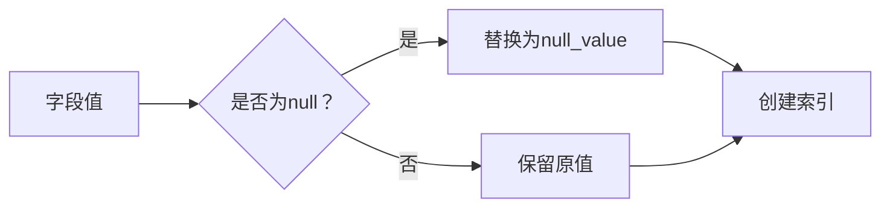

# ES中null_value参数故事版

> ## null_value
>
> 在 es 中，值为 null 的字段不索引也不可以被搜索，null_value 可以让值为 null 的字段显式的可索引、可搜索（用另外一个字符替代）
>
> ```Java
> #null_value
> DELETE users
> PUT users
> {
>   "mappings": {
>     "properties": {
>       "name":{
>         "type": "keyword",
>         "null_value": "javaboy_null"
>       }
>     }
>   }
> }
> 
> PUT users/_doc/1
> {
>   "name":null,
>   "age":99
> }
> 
> GET users/_search
> {
>   "query": {
>     "term": {
>       "name": "javaboy_null"
>     }
>   }
> }
> GET users/_doc/1
> 
> ```
>


# **null_value：数字村的「空房标识牌」🏠🚫→🏷️**

想象数字村有一片住宅区，每栋房子都挂着**门牌（字段值）**。但有些房子是**空置（null）**的，村长想了个妙招：给空房挂上**特殊标识牌（null_value）**，让普查员能统计到它们！

---

## **故事：空房普查大行动**

### **1. 问题：空房消失之谜**
```json
// 初始配置（无null_value）
"house_number": {
  "type": "keyword"
}
```
**现象：**
- 🏠 101房 → 住着"张三"（正常记录）
- 🏠 102房 → 空置（`null`，无记录）
- 🔍 普查员搜索空房 → **找不到102房！**

**操作验证：**
```json
PUT village/_doc/102
{
  "house_number": null  // 空置房
}

// 尝试找空房（失败）
GET village/_search
{
  "query": {"term": {"house_number": null}}  // ❌ 无结果
}
```

---

### **2. 解决方案：挂上特殊门牌**
```json
// 配置空房标识
"house_number": {
  "type": "keyword",
  "null_value": "空置"  // 给空房挂标识牌
}
```
**村长新规：**
- 🏷️ 所有空房必须挂**"空置"牌**
- 📝 普查员看到此牌 → 知道是空房

**操作演示：**
```json
PUT village/_doc/102
{
  "house_number": null  // 自动挂"空置"牌
}

// 成功找到空房！
GET village/_search
{
  "query": {"term": {"house_number": "空置"}}  // ✅ 找到102房
}
```

---

## **技术原理图解**



---

## **你的DSL案例解析**

### **步骤1：设置空值标识**
```json
PUT users
{
  "mappings": {
    "properties": {
      "name":{
        "type": "keyword",
        "null_value": "javaboy_null"  // 空值标识
      }
    }
  }
}
```
- 🏷️ 规定：所有空名字挂**"javaboy_null"**牌

### **步骤2：挂标识牌**
```json
PUT users/_doc/1
{
  "name": null,   // 自动挂"javaboy_null"牌
  "age": 99
}
```

### **步骤3：精准查找空值**
```json
GET users/_search
{
  "query": {
    "term": {
      "name": "javaboy_null"  // 搜索挂此牌的房子
    }
  }
}
// 结果：找到文档1
```

### **原始数据依然保留**
```json
GET users/_doc/1
/* 返回：
{
  "name": null,   // 原始状态仍是null
  "age": 99
} */
```
- 📦 仓库记录保持原貌
- 🔍 但搜索时用标识牌

---

## **为什么需要null_value？**

### **三大核心价值**
| 场景 | 问题 | null_value解决方案 |
|------|------|-------------------|
| **空值统计** | 无法搜索`null` | `"空置"`代替`null` |
| **数据清洗** | 缺失值干扰分析 | 统一标记缺失字段 |
| **安全防护** | 空值导致程序异常 | 提供安全替代值 |

### **实际应用场景**
```json
// 电商订单系统
PUT orders
{
  "mappings": {
    "properties": {
      "coupon_code": {
        "type": "keyword",
        "null_value": "未使用优惠券"  // 标记未用券订单
      }
    }
  }
}

// 查找未用券订单
GET orders/_search
{
  "query": {"term": {"coupon_code": "未使用优惠券"}}
}
```

---

## **避坑指南**

### **坑1：错误用于text字段**
```json
// 错误配置（text类型不支持）
"address": {
  "type": "text",              // ❌ 必须是keyword
  "null_value": "地址未知"       // 设置无效
}

// 正确做法
"address": {
  "type": "keyword",            // ✅ keyword类型
  "null_value": "地址未知"
}
```

### **坑2：标识牌冲突**
```json
// 危险配置
"product_id": {
  "type": "keyword",
  "null_value": "000000"  // ❌ 可能与真实ID冲突
}

// 安全方案
"product_id": {
  "type": "keyword",
  "null_value": "NULL_ID"  // ✅ 用特殊前缀
}
```

### **坑3：忘记真实数据**
```json
// 插入真实数据
PUT system/_doc/1
{
  "status": "javaboy_null"  // 真实值非null！
}

// 搜索时误判为空值！
GET system/_search
{
  "query": {"term": {"status": "javaboy_null"}} 
  // 会混入真实数据
}
```

---

## **最佳实践配置**

### **推荐方案：专用空值标识**
```json
PUT best_practice
{
  "mappings": {
    "properties": {
      // 用户ID（不可空）
      "user_id": {
        "type": "keyword"  // 不设null_value
      },
      
      // 可选字段（允许空值）
      "wechat_id": {
        "type": "keyword",
        "null_value": "未绑定微信"  // 安全标识
      },
      
      // 数值型空值处理
      "login_count": {
        "type": "integer",
        "null_value": -1  // 用-1代表空值
      }
    }
  }
}
```

### **查询示例：找未绑定微信用户**
```json
GET best_practice/_search
{
  "query": {
    "term": {"wechat_id": "未绑定微信"}
  }
}
```

---

## **记忆口诀**

**空房标识三要素：**
1. **专治空值隐身术** → 让`null`现形  
2. **keyword类型专属** → text字段不支持  
3. **标识牌要独特** → 避免撞衫真实数据  

**使用场景：**  
> 🟢 **需要统计空值** → 订单/用户信息  
> 🟢 **避免空值干扰** → 数据清洗场景  
> 🟢 **提供安全值** → 防止程序报错  

**特别注意：**  
⚠️ 真实数据可能伪装成空值标识 → 设计标识要够独特！  
⚠️ 数值字段可用特殊值（如-1）替代null  

记住「空房挂牌」的比喻，轻松搞定Elasticsearch的空值难题！ 🎯🔑