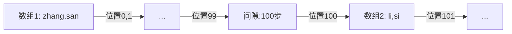

# ES中position_increment_gap参数故事版

> ## position_increment_gap
>
> 被解析的 text 字段会将 term 的位置考虑进去，目的是为了支持近似查询和短语查询，当我们去索引一个含有多个值的 text 字段时，会在各个值之间添加一个假想的空间，将值隔开，这样就可以有效避免一些无意义的短语匹配，间隙大小通过 position_increment_gap 来控制，默认是 100。
>
> ```java
> #position_increment_gap
> DELETE users
> 
> PUT users
> PUT users/_doc/1
> {
>   "name":["zhang san","li si"]
> }
> 
> GET users/_search
> {
>   "query": {
>     "match_phrase": {
>       "name": {
>         "query": "san li"
>       }
>     }
>   }
> }
> #sanli 搜索不到，因为两个短语之间有一个假想的空隙，为 100
> GET users/_search
> {
>   "query": {
>     "match_phrase": {
>       "name": {
>         "query": "san li",
>         "slop": 100
>       }
>     }
>   }
> }
> ```
>


# **position_increment_gap：超市的「货架隔离带」🛒📏**

想象数字村有个大型超市，商品按类别放在不同货架上。顾客想找**组合商品**（比如"牛奶+麦片"），但管理员故意在货架间留了**超宽通道（默认100步）**，防止顾客误把不同货架的商品当成组合！

---

## **故事：超市的智能货架系统**

### **1. 默认设置：超宽隔离带**
```json
"product_tags": {
  "type": "text",       // 多值字段
  "position_increment_gap": 100  // 默认值
}
```
**货架布局：**
```
🛒 货架A： ["纯牛奶", "全麦面包"]
       │
       │  ← 100步宽通道
       │
🛒 货架B： ["水果麦片", "蜂蜜"]
```

**顾客行为：**
- 🛒 顾客想找"牛奶+麦片"组合
- 🔍 搜索短语："牛奶 麦片"
- ❌ **搜索失败！**  
  *原因：牛奶在货架A，麦片在货架B，中间隔着100步通道*

---

### **2. 问题重现（你的DSL案例）**
```json
// 用户数据
"name": ["zhang san", "li si"]

// 相当于：
货架1：["zhang", "san"]
       │
       │ ← 100步通道
       │
货架2：["li", "si"]
```
**搜索测试：**
```json
// 搜索"san li"（失败）
GET users/_search
{
  "query": {
    "match_phrase": {
      "name": "san li"  // 需要跨越100步通道
    }
  }
}
```
*结果：无匹配*  
⚠️ "san"在第一个数组末尾，"li"在第二个数组开头，间隔100步！

---

### **3. 解决方案：允许跨货架搜索**
```json
// 放宽通道限制（slop=100）
GET users/_search
{
  "query": {
    "match_phrase": {
      "name": {
        "query": "san li",
        "slop": 100  // 允许跨越100步
      }
    }
  }
}
```
**效果：**  
✅ 成功匹配！  
*系统认为："san"和"li"之间虽然隔了100步，但在允许范围内*

---




- **普通短语查询**：要求词项**紧密相邻**（如"san"位置99 → "li"位置100 ❌）
- **slop参数**：允许词项间有**间隔距离**（slop=100时，99→100视为相邻 ✅）

---

## **为什么需要隔离带？**

### **避免错误组合**
| 场景 | 无隔离带 | 有隔离带 |
|------|----------|----------|
| 数据 | `["苹果", "手机"]`<br>`["充电器", "数据线"]` |  |
| 搜索"苹果手机" | ❌ 错误匹配 | ✅ 正确拒绝 |
| 搜索"充电器数据线" | ❌ 错误匹配 | ✅ 正确拒绝 |

### **实际应用场景**
```json
// 博客标签系统
PUT blogs
{
  "mappings": {
    "properties": {
      "tags": {
        "type": "text",
        "position_increment_gap": 100  // 防止跨标签匹配
      }
    }
  }
}

// 插入数据
PUT blogs/_doc/1
{
  "tags": ["编程", "机器学习", "前端", "算法"]
}
```
- 搜索"前端算法" → 被拒绝（间隔100步）
- 搜索"机器学习前端" → 被拒绝（间隔100步）

---

## **自定义隔离带宽度**

### **收紧隔离带（更易跨组）**
```json
"product_names": {
  "type": "text",
  "position_increment_gap": 20  // 窄通道
}
```
**效果：**
- 允许更多跨组匹配
- 但可能增加误匹配

### **完全移除隔离带（危险！）**
```json
"keywords": {
  "type": "text",
  "position_increment_gap": 0   // 无隔离
}
```
**后果：**
- `["牛奶", "面包"]` + `["麦片", "蜂蜜"]`
- 搜索"面包麦片" → 错误匹配！

---

## **实战配置建议**

### **场景1：严格保持分组**
```json
// 人名分组（不同人分开）
"passengers": {
  "type": "text",
  "position_increment_gap": 100  // 默认严格隔离
}
```
- 👨 组1：["张三", "李四"]
- 👩 组2：["王五", "赵六"]
- 🔍 搜索"李四 王五" → 需要slop=100

### **场景2：允许弱分组**
```json
// 文章关键词（可弱关联）
"keywords": {
  "type": "text",
  "position_increment_gap": 10   // 较窄隔离
}
```
- 搜索"人工智能 医疗" → 即使在不同组也可能匹配

### **场景3：禁用分组特性**
```json
// 标签云（所有标签平等）
"all_tags": {
  "type": "text",
  "position_increment_gap": 0   // 无隔离
}
```
- 搜索任意两个标签 → 都可能匹配

---

## **记忆口诀**

**超市货架三法则：**
1. **默认宽通道（100步）** → 防误组  
2. **slop 是通行证** → 决定能跨多远  
3. **0通道风险高** → 慎用！  

**配置指南：**  
> 🛒 分组数据用 **默认100**  
> 📦 弱关联数据用 **10-50**  
> 🧩 平铺数据用 **0**  

记住：**position_increment_gap是ES防止跨组误匹配的安全锁**🔒，合理设置才能平衡精准与灵活！