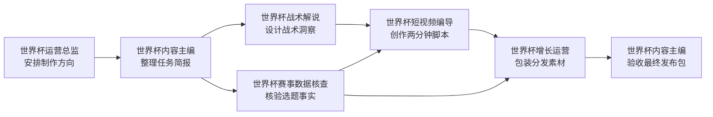

# Windows + WSL2 完整复现 Avernet WAIC 6 Bot 协作演示

> 适用目标：在 Windows 电脑上，通过 WSL2 Ubuntu 安装并运行 Avernet，启动 BCS、Web 前端和 6 个世界杯内容 Bot，最终在 Windows 浏览器中完成一次“世界杯比赛前瞻内容生产”自定义协作。
>
> 本文按 Avernet 仓库 `dev` 分支编写，主要参考：
>
> - `docs/waic-live-demo-tutorial.zh-CN.md`
> - `docs/dependencies.zh-CN.md`
> - `scripts/singlebox.sh`
> - `scripts/toolchain.sh`
> - `.env.example`
>
> 重要说明：原 WAIC 教程主要按 macOS 编写，但 Avernet 官方依赖文档明确支持 Debian / Ubuntu；仓库工具脚本也包含 Linux 与 `apt-get` 的安装逻辑。因此，WSL2 Ubuntu 可以使用同一套 `singlebox.sh` 主流程，但需要额外处理 Windows 与 WSL 的文件系统、端口、代理和网络访问问题。

---

## 目录

- [1. 最终实现效果](#1-最终实现效果)
- [2. 运行架构](#2-运行架构)
- [3. 开始前准备](#3-开始前准备)
- [4. 安装和检查 WSL2](#4-安装和检查-wsl2)
- [5. 可选：配置 WSL 资源和镜像网络](#5-可选配置-wsl-资源和镜像网络)
- [6. 初始化 Ubuntu](#6-初始化-ubuntu)
- [7. 在 WSL 中安装基础依赖](#7-在-wsl-中安装基础依赖)
- [8. 克隆 Avernet dev 分支](#8-克隆-avernet-dev-分支)
- [9. 安装 Avernet 工具链](#9-安装-avernet-工具链)
- [10. 编译 BCS 并安装前端依赖](#10-编译-bcs-并安装前端依赖)
- [11. 配置真实大模型](#11-配置真实大模型)
- [12. 启动 BCS 和前端](#12-启动-bcs-和前端)
- [13. 启动世界杯 6 Bot](#13-启动世界杯-6-bot)
- [14. 在 Windows 浏览器打开 Avernet](#14-在-windows-浏览器打开-avernet)
- [15. 创建自定义协作](#15-创建自定义协作)
- [16. 绑定 6 个 Bot 角色](#16-绑定-6-个-bot-角色)
- [17. 提交演示任务](#17-提交演示任务)
- [18. 查看结果](#18-查看结果)
- [19. 停止、重启和再次使用](#19-停止重启和再次使用)
- [20. WSL 与 Clash/VPN/代理配置](#20-wsl-与-clashvpn代理配置)
- [21. 常见报错处理](#21-常见报错处理)
- [22. 日志与诊断命令](#22-日志与诊断命令)
- [23. 最短执行清单](#23-最短执行清单)
- [24. 安全与数据说明](#24-安全与数据说明)
- [25. 参考资料](#25-参考资料)

---

# 1. 最终实现效果

运行成功后，你的 Windows 电脑中会形成下面的结构：

1. **Windows**
   - 负责运行 WSL2。
   - 使用 Chrome、Edge 等浏览器访问 Avernet 前端。
   - 可继续使用 Clash Verge、VPN 或本地模型服务。

2. **WSL2 Ubuntu**
   - 运行 Avernet 项目源码。
   - 运行 BCS 服务。
   - 运行 Avernet Web 前端。
   - 运行 6 个 OpenClaw Bot。
   - 保存 Bot 身份、协作群、会话、日志和构建产物。

3. **模型服务**
   - 可以是公网 OpenAI-compatible API。
   - 也可以是 Windows 本机运行的兼容服务。
   - 必须提供 Base URL、API Key 和模型 ID，才能获得真实 Bot 回复。

最终你会在 Windows 浏览器打开：

```text
http://127.0.0.1:8000/
```

然后创建一个自定义协作群，让 6 个 Bot 按固定流程协作完成世界杯比赛前瞻内容。

---

# 2. 运行架构

Avernet WAIC 演示主要包含三个部分：

| 组件 | 默认端口 | 作用 |
| --- | ---: | --- |
| Avernet 前端 | 8000 | 创建协作群、绑定 Bot、提交任务、查看结果 |
| BCS | 21000 | Bot 接入、发现、路由和自定义协作执行 |
| 世界杯运营总监 | 30401 | 明确内容目标、受众、平台和总体方向 |
| 世界杯内容主编 | 30411 | 整理任务简报并验收最终发布包 |
| 世界杯赛事数据核查 | 30421 | 核验赛事事实和信息边界 |
| 世界杯战术解说 | 30431 | 设计战术看点和关键对位 |
| 世界杯短视频编导 | 30441 | 生成口播稿和文字分镜 |
| 世界杯增长运营 | 30451 | 生成标题、封面和发布包装 |

协作流程：



---

# 3. 开始前准备

## 3.1 Windows 要求

推荐：

- Windows 11。
- 已开启 CPU 虚拟化。
- WSL2，而不是 WSL1。
- 现代浏览器：Chrome 或 Edge。
- 网络能够访问 GitHub、npm、Rust crates、模型 API。
- 至少预留十几 GB 可用磁盘空间；Rust 构建和前端依赖可能占用数 GB。

实践建议：

- 电脑内存为 16 GB 或以上时，体验会更稳定。
- 如果整机只有 8 GB 内存，也可以尝试，但首次 Rust 编译可能较慢或出现内存不足。
- 项目必须放在 WSL 的 Linux 文件系统中，不要放在 `/mnt/c`、Windows 桌面或下载目录。

## 3.2 模型要求

真实复现必须准备以下一种方式：

### 方式 A：已有 OpenClaw 配置

文件位置：

```text
~/.openclaw/openclaw.json
```

### 方式 B：OpenAI-compatible API

需要准备：

```text
Base URL
API Key
模型 ID
```

例如，服务地址：

```text
https://taotoken.net/api
```

注意：

- 不要把真实 API Key 发到聊天、群聊或截图中。
- 不要把 API Key 写进 Git 提交。
- 本教程会把密钥保存在仓库根目录的 `.env.local` 中。
- `.env.local` 在仓库示例中被设计为本地、Git 忽略文件。

## 3.3 不要使用 root 用户开发

进入 Ubuntu 后，命令行应类似：

```text
yourname@DESKTOP-XXXX:~$
```

不建议长期使用：

```text
root@DESKTOP-XXXX:~#
```

原因：

- Node、npm、nvm、Rust、OpenClaw 的文件权限容易混乱。
- 后续普通用户可能无法修改项目和配置。
- `npm install -g` 在 nvm 环境下本来不需要 `sudo`。

---

# 4. 安装和检查 WSL2

下面命令在 **Windows PowerShell 管理员窗口** 中执行，不是在 Ubuntu 中执行。

## 4.1 打开管理员 PowerShell

在 Windows 开始菜单中搜索：

```text
PowerShell
```


右键选择：

```text
以管理员身份运行
```

也可以使用：

```text
Windows Terminal（管理员）
```

## 4.2 安装 WSL 和 Ubuntu

执行：

```powershell
wsl --install -d Ubuntu-24.04
```


## 4.3 第一次启动 Ubuntu

重启后，在开始菜单搜索：

```text
Ubuntu
```


第一次启动会要求创建 Linux 用户名和密码。

建议用户名（自己命名就行）：

```text
shuyixiao
```

要求：

- 使用小写英文或数字。
- 不要使用中文。
- 不要使用空格。

输入密码时终端不会显示字符或星号，这是正常现象。

## 4.4 更新 WSL

回到 Windows PowerShell：

```powershell
wsl --update
```


检查版本：

```powershell
wsl --version
```


检查发行版：

```powershell
wsl -l -v
```

正常应看到：


如果 Ubuntu 显示为 WSL1，执行：

```powershell
wsl --set-version Ubuntu 2
```

设置今后默认使用 WSL2：

```powershell
wsl --set-default-version 2
```

---

# 5. 可选：配置 WSL 资源和镜像网络

这一节不是必须步骤。默认配置可以先运行；出现内存不足、VPN、Clash 或本地模型访问问题时再配置。

## 5.1 创建 `.wslconfig`

在 Windows PowerShell 中执行：

```powershell
notepad $env:USERPROFILE\.wslconfig
```

Windows 11 22H2 及以上可参考：

```ini
[wsl2]
memory=8GB
processors=4
swap=8GB
networkingMode=mirrored
dnsTunneling=true
autoProxy=true
```

说明：

- `memory=8GB`：WSL 最大可使用 8 GB 内存。
- `processors=4`：WSL 最大使用 4 个 CPU 逻辑核心。
- `swap=8GB`：内存不足时提供交换空间。
- `networkingMode=mirrored`：改善 VPN、代理和 Windows/WSL 双向 localhost 访问。
- `dnsTunneling=true`：改善部分 VPN 和 DNS 环境。
- `autoProxy=true`：尝试同步 Windows 代理配置。

不要盲目照抄资源值：

- 16 GB 内存电脑可先给 WSL 6～8 GB。
- 32 GB 内存电脑可给 8～16 GB。
- 不要把全部内存都分配给 WSL，要给 Windows 和浏览器留空间。

修改后执行：

```powershell
wsl --shutdown
```

然后重新打开 Ubuntu。

## 5.2 检查 WSL 网络模式

在 Windows PowerShell 执行：

```powershell
wsl --status
```

在 Ubuntu 中检查网络：

```bash
ip addr
ip route
```

---

# 6. 初始化 Ubuntu

下面开始，除非特别注明，所有命令都在 **Ubuntu / WSL 终端** 中执行。

## 6.1 更新软件源

```bash
sudo apt-get update
sudo apt-get upgrade -y
```


## 6.2 检查系统

```bash
uname -a
cat /etc/os-release
whoami
pwd
```

预期：

- `uname` 中能看到 Linux 和 Microsoft/WSL 信息。
- `whoami` 返回你创建的普通用户名。
- 当前目录通常是 `/home/你的用户名`。


## 6.3 创建 Linux 工作目录

```bash
mkdir -p ~/workspace
cd ~/workspace
```

后续项目路径应类似：

```text
/home/你的用户名/workspace/Avernet
```


不要使用：

```text
/mnt/c/Users/你的Windows用户名/Desktop/Avernet
```

原因：

- Rust、npm 和 Git 在 `/mnt/c` 上处理大量小文件时通常更慢。
- 容易出现权限、软链接、可执行位和大小写差异问题。
- `node_modules` 和 Rust `target` 会产生大量文件，跨文件系统性能损耗明显。

## 6.4 Windows 查看 WSL 文件

在 Ubuntu 中执行：

```bash
explorer.exe .
```

Windows 文件资源管理器会打开当前 Linux 目录。


也可在 Windows 文件资源管理器地址栏输入：

```text
\\wsl.localhost\Ubuntu
```

---

# 7. 在 WSL 中安装基础依赖

Avernet 官方 Debian / Ubuntu 依赖命令为：

```bash
sudo apt-get update

sudo apt-get install -y \
  build-essential \
  pkg-config \
  perl \
  protobuf-compiler \
  libssl-dev \
  libsqlite3-dev \
  curl \
  git \
  jq \
  lsof \
  ca-certificates
```

要是上述问题出现安装问题走VPN代理

```shell
sudo apt-get \
  -o Acquire::http::Proxy="http://127.0.0.1:7897" \
  -o Acquire::https::Proxy="http://127.0.0.1:7897" \
  update
```


```shell
sudo apt-get \
  -o Acquire::http::Proxy="http://127.0.0.1:7897" \
  -o Acquire::https::Proxy="http://127.0.0.1:7897" \
  install -y \
  build-essential \
  pkg-config \
  perl \
  protobuf-compiler \
  libssl-dev \
  libsqlite3-dev \
  curl \
  git \
  jq \
  lsof \
  ca-certificates
```


为了方便排查和日常使用，可以额外安装：

```bash
sudo apt-get install -y \
  wget \
  unzip \
  zip \
  tree \
  nano \
  python3 \
  python3-pip
```

检查依赖：

```bash
git --version
curl --version
jq --version
lsof -v 2>&1 | head
protoc --version
pkg-config --modversion sqlite3
pkg-config --modversion openssl
gcc --version
make --version
perl --version
```

正常情况下：

- `protoc --version` 能显示版本。
- `pkg-config --modversion sqlite3` 有输出。
- `pkg-config --modversion openssl` 有输出。
- `gcc`、`make` 和 `perl` 均可用。

---

# 8. 克隆 Avernet dev 分支

## 8.1 避免 Windows CRLF 换行影响脚本

在 WSL 中执行：

```bash
git config --global core.autocrlf input
```


## 8.2 克隆仓库

```bash
cd ~/workspace

git clone --branch dev --single-branch \
  https://github.com/inclusionAI/Avernet.git

cd Avernet
```


检查位置和分支：

```bash
pwd
git branch --show-current
git status
```

预期：

```text
/home/你的用户名/workspace/Avernet
dev
```


## 8.3 确认 WAIC 模板和 6 Bot 配置存在

```bash
test -f \
  src/bcs/seeds/collaboration-templates/zh-CN/world-cup-preview-content-production.yaml \
  && echo "世界杯模板已找到"

test -f \
  scripts/6bots_world_cup_creator_profile/bots.json \
  && echo "世界杯 Bot 配置已找到"
```

两行都应输出“已找到”。


## 8.4 检查脚本权限

```bash
chmod +x scripts/singlebox.sh
./scripts/singlebox.sh --help
```

如果 `--help` 能正常输出，说明脚本可以执行。


---

# 9. 安装 Avernet 工具链

Avernet 脚本会检查和安装：

- Node.js 22+
- npm
- uv
- OpenClaw `>= 2026.3.28`
- Rust / Cargo 1.91+
- protobuf / protoc
- jq、curl、lsof
- OpenSSL 和 SQLite 开发库

## 9.1 中国大陆网络可选配置

如果访问 npm、Rust、PyPI 或 GitHub 较慢，可以在当前终端先执行：

```bash
export USE_CN_MIRROR=1
```

该变量会让 Avernet 脚本尝试使用公开镜像源。

如果你的网络能稳定访问官方源，不需要设置。


## 9.2 执行工具安装

确保当前位于仓库根目录：

```bash
cd ~/workspace/Avernet
```

执行：

```bash
./scripts/singlebox.sh install-tools
```


安装过程中会出现交互确认，例如：

```text
Install missing system commands now? [y/N]
Install openclaw ...? [y/N]
Install Rust/Cargo 1.91.0 now? [y/N]
Install protobuf/protoc now? [y/N]
```

为了完成本教程，缺少的必要工具通常都选择：

```text
y
```

注意：

- 先看清楚它要安装什么，再输入 `y`。
- 不要关闭终端。
- Rust 第一次下载和安装可能较慢。
- OpenClaw 会通过 npm 全局安装，但如果 Node 由 nvm 管理，文件仍属于当前 Linux 用户，一般不需要 `sudo npm`。


## 9.3 重新加载环境变量

安装完成后执行：

```bash
source ~/.bashrc 2>/dev/null || true
[ -f ~/.cargo/env ] && source ~/.cargo/env
export PATH="$HOME/.local/bin:$PATH"
```


为了让 `~/.local/bin` 后续自动生效：

```bash
grep -q 'HOME/.local/bin' ~/.bashrc || \
  echo 'export PATH="$HOME/.local/bin:$PATH"' >> ~/.bashrc
```


## 9.4 验证工具版本

```bash
node --version
npm --version
rustc --version
cargo --version
protoc --version
uv --version
openclaw --version
jq --version
```

重点要求：

```text
Node.js：22 或更高
Rust：1.91 或更高
OpenClaw：2026.3.28 或更高
```


## 9.5 执行基础预检

```bash
./scripts/singlebox.sh check bcs_frontend
```

此时主要检查：

- BCS 编译依赖。
- Node.js 和 npm。
- 前端目录。
- 8000 和 21000 端口。
- Cargo 和 protoc。

此时 BCS 还没有编译，因此后面还要执行 setup。


---

# 10. 编译 BCS 并安装前端依赖

执行：

```bash
cd ~/workspace/Avernet

./scripts/singlebox.sh setup bcs_frontend
```

这一步会：

1. 编译 BCS。
2. 编译配套 CLI。
3. 构建 BCS 面板资源。
4. 根据前端 lockfile 安装 npm 依赖。
5. 生成本地运行所需文件。

首次执行通常是最耗时的一步。

成功时通常能看到类似：

```text
BCS setup complete
Frontend ready
```


## 10.1 检查 6 Bot 启动条件

```bash
./scripts/singlebox.sh check bots \
  --profile-dir scripts/6bots_world_cup_creator_profile
```

预检应识别：

- 6 个 Bot。
- 30401、30411、30421、30431、30441、30451 端口。
- OpenClaw。
- jq。
- Bot profile 目录。


## 10.2 检查磁盘空间

```bash
df -h
du -sh ~/workspace/Avernet 2>/dev/null
du -sh ~/workspace/Avernet/target 2>/dev/null || true
du -sh ~/workspace/Avernet/src/frontend/node_modules 2>/dev/null || true
```


如果根分区接近 100%，先清理磁盘后再继续。

---

# 11. 配置真实大模型

以下两种方式二选一。

---

## 11.1 方式 A：复用已有 OpenClaw 配置

检查文件：

```bash
test -f ~/.openclaw/openclaw.json \
  && echo "OpenClaw 配置已找到" \
  || echo "没有找到 OpenClaw 配置"
```

后面启动 Bot 时选择：

```text
3) home
```

脚本会读取：

```text
~/.openclaw/openclaw.json
```

确认路径无误后按提示继续。

---

## 11.2 方式 B：在 `.env.local` 中手工配置

从示例复制：

```bash
cd ~/workspace/Avernet

test -f .env.local || cp .env.example .env.local
nano .env.local
```

在文件中找到或加入：

```dotenv
BCS_PORT=21000
FRONTEND_PORT=8000

OPENCLAW_OPENAI_PROVIDER_ID=openai-compatible
OPENCLAW_OPENAI_BASE_URL='https://taotoken.net/api'
OPENCLAW_OPENAI_API_KEY='你的真实API-Key'
OPENCLAW_OPENAI_MODEL_ID='你的模型ID'
OPENCLAW_OPENAI_MODEL_NAME='你的模型显示名称'
OPENCLAW_OPENAI_MODEL_API=openai-completions
```

例如：

```dotenv
OPENCLAW_OPENAI_PROVIDER_ID=openai-compatible
OPENCLAW_OPENAI_BASE_URL='https://taotoken.net/api/v1'
OPENCLAW_OPENAI_API_KEY='sk-pmavacodruugjxxowbzuanhnfmvvjutbgyfwmigrxqymx'
OPENCLAW_OPENAI_MODEL_ID='deepseek-v4-pro'
OPENCLAW_OPENAI_MODEL_NAME='deepseek-v4-pro'
OPENCLAW_OPENAI_MODEL_API=openai-completions
```

如果使用国内镜像，可加入：

```dotenv
USE_CN_MIRROR=1
```

在 nano 中保存：

```text
Ctrl + O
回车
Ctrl + X
```

## 11.3 限制配置文件权限

```bash
chmod 600 .env.local
```


## 11.4 确认 `.env.local` 不会被 Git 提交

```bash
git check-ignore .env.local
```

正常应输出：

```text
.env.local
```


检查 Git 状态：

```bash
git status --short
```

不要看到 `.env.local` 被列为待提交文件。


## 11.5 不打印 Key 地检查配置

```bash
grep -E \
  '^(OPENCLAW_OPENAI_PROVIDER_ID|OPENCLAW_OPENAI_BASE_URL|OPENCLAW_OPENAI_MODEL_ID|OPENCLAW_OPENAI_MODEL_NAME|OPENCLAW_OPENAI_MODEL_API)=' \
  .env.local
```


不要执行下面这种命令：

```bash
cat .env.local
```

尤其不要在录屏、直播或截图时直接展示整个文件。

## 11.6 可选：测试模型服务

在当前终端临时加载配置：

```bash
set -a
source .env.local
set +a
```

请求模型列表：

```bash
curl -sS \
  -H "Authorization: Bearer ${OPENCLAW_OPENAI_API_KEY}" \
  "${OPENCLAW_OPENAI_BASE_URL%/}/models" \
  | jq .
```


---

# 12. 启动 BCS 和前端

确保当前位于仓库根目录：

```bash
cd ~/workspace/Avernet
```

执行：

```bash
./scripts/singlebox.sh start bcs_frontend
```

这个命令会启动：

- BCS，默认端口 `21000`。
- Avernet 前端，默认端口 `8000`。

不会启动默认 5 Bot，也不会自动启动世界杯 6 Bot。


## 12.1 检查状态

```bash
./scripts/singlebox.sh status bcs_frontend
```

预期：

```text
BCS:       Running
Frontend:  Running
```


## 12.2 WSL 内部健康检查

```bash
curl -I http://127.0.0.1:8000/
```

检查端口：

```bash
lsof -nP -iTCP:8000 -sTCP:LISTEN
lsof -nP -iTCP:21000 -sTCP:LISTEN
```

只要 8000 和 21000 均处于监听状态，就可以继续。


---

# 13. 启动世界杯 6 Bot

保持 BCS 正在运行，执行：

```bash
cd ~/workspace/Avernet

./scripts/singlebox.sh start bots \
  --profile-dir scripts/6bots_world_cup_creator_profile
```

终端通常会显示：

```text
Choose model config mode:
  1) mock     Start without real model replies
  2) manual   Use values from .env.local
  3) home     Import model fields from ~/.openclaw/openclaw.json
```

选择方式：

- `.env.local` 手工配置：输入 `2`。
- 已有 `~/.openclaw/openclaw.json`：输入 `3`。
- 不要为了完整演示选择 `1`，因为 mock 模式不会生成真实模型回复。


## 13.1 检查 6 Bot 状态

```bash
./scripts/singlebox.sh status bots \
  --profile-dir scripts/6bots_world_cup_creator_profile
```

6 个 Bot 都应显示：

```text
Running
```

并包含对应端口和 `bot_uuid`。


## 13.2 检查所有监听端口


```bash
for port in 30401 30411 30421 30431 30441 30451; do
  echo "===== $port ====="
  lsof -nP -iTCP:$port -sTCP:LISTEN || true
done
```

---

# 14. 在 Windows 浏览器打开 Avernet

最简单方式是在 Windows 浏览器手工打开：

```text
http://127.0.0.1:8000/
```


也可以从 WSL 执行：

```bash
explorer.exe "http://127.0.0.1:8000/"
```

首页打开后点击：

```text
进入 Avernet
```

通常会进入：

```text
http://127.0.0.1:8000/bcn/chat/list
```

## 14.1 顶部选择 Bot 视角

页面顶部应显示已接入的 Bot。

选择：

```text
世界杯运营总监
```

这一步很重要：

- 自定义协作需要从 Bot 视角创建。
- 后面 `operations_director` 应绑定当前发起方“世界杯运营总监”。


## 14.2 页面看不到 6 个 Bot

按以下顺序处理：

1. 等待 10～20 秒。
2. 刷新浏览器。
3. 在 WSL 检查：

```bash
./scripts/singlebox.sh status bots \
  --profile-dir scripts/6bots_world_cup_creator_profile
```

4. 检查当前页面是否确实为：

```text
http://127.0.0.1:8000/bcn/chat/list
```

5. 查看 Bot 日志：

```bash
ls -lh scripts/.dependencies/logs/
tail -n 100 scripts/.dependencies/logs/bots_*.log
```

---

# 15. 创建自定义协作

在“我的协作”页面左侧点击：

```text
拉起协作
```

填写：

```text
协作群名称：WAIC 世界杯前瞻内容生产
协作目标：为世界杯比赛前瞻生产可发布的两分钟短视频内容包
协作群类型：自定义协作
```


界面中的“状态机编排”是实现方式，不是另一个协作类型。

## 15.1 选择内置模板

在“协同剧本”区域：

1. 选择“模板”。
2. 不要选择“自由编辑”。
3. 打开“选择模板”。
4. 选择：

```text
世界杯比赛前瞻内容生产
```

5. 等待 YAML 加载完成。
6. 点击：

```text
校验 YAML
```

校验成功后，页面应显示：

```text
已解析 6 个角色
```

如果模板下拉框没有该模板，请参考后面的常见问题。


---

# 16. 绑定 6 个 Bot 角色

模板角色和 Bot 的对应关系：

| 模板角色 Key | 绑定 Bot |
| --- | --- |
| `operations_director` | 世界杯运营总监 |
| `content_editor` | 世界杯内容主编 |
| `tactics_analyst` | 世界杯战术解说 |
| `script_director` | 世界杯短视频编导 |
| `fact_researcher` | 世界杯赛事数据核查 |
| `growth_operator` | 世界杯增长运营 |

对每一个角色执行：

1. 点击角色 Key。
2. 切换到“可协作Bot”。
3. 选择“按名称筛选”。
4. 输入对应的完整中文 Bot 名称。
5. 点击搜索结果右侧的加号。
6. 确认角色卡显示已绑定 1 个 Bot。

特别检查：

- `operations_director` 必须绑定“世界杯运营总监”。

- 6 个必填角色不能留空。

- 每个角色只绑定 1 个正确 Bot。

- 页面应显示“已绑定 6 个 Bot”。

- 不应继续显示“发起方未绑定”。

  

---

# 17. 提交演示任务

## 17.1 推荐协作群名称

```text
足球比赛自媒体撰稿室
```

## 17.2 可直接复制的安全演示输入

将下面内容完整粘贴到“协作目标”：

```text
请为一场明确标记为“流程演示、非真实赛程”的世界杯风格比赛制作赛前前瞻自媒体内容。

【比赛选题】
星河队 vs 山海队，虚构演示赛。

【内容要求】
- 内容模式：赛前前瞻
- 目标受众：平时看球不多、但愿意在大赛期间了解比赛看点的普通观众
- 发布平台：抖音、B 站
- 目标时长：2 分钟
- 文风：专业但通俗，有画面感，不堆术语
- 核心目标：让观众快速理解双方风格差异，并愿意在评论区讨论胜负手
- 输出：完整口播稿、纯文字分镜、标题、封面文案、发布说明、标签和评论区互动问题

【本次演示唯一事实卡】
- 两支队伍和比赛均为虚构，只用于演示多 Bot 协作流程。
- 星河队的演示设定：偏好高位压迫和快速边路推进。
- 山海队的演示设定：偏好中低位防守和抢断后的快速反击。
- 星河队 10 号是组织核心；山海队 9 号是反击终结点。以上均为虚构设定。
- 不得补写真实世界杯赛程、真实球员、真实伤停、真实排名或博彩信息。
- 无法确认的信息必须标为未知或演示设定，不能伪装成真实事实。

请按模板既定流程执行，并由内容主编交付一个可直接进入人工复核的最终发布包。
```

填写后点击：

```text
创建协作群
```

系统会：

1. 创建自定义协作群。
2. 创建“新会话”。
3. 按模板启动 6 Bot 协作。

不要在页面暂时没有新消息时反复点击确认，否则可能产生多次独立运行。、


---

# 18. 查看结果

一次完整运行通常需要数分钟，具体取决于：

- 模型响应速度。
- 模型服务并发限制。
- 网络状态。
- WSL 和电脑性能。
- 节点是否出现重试。

模板默认逻辑包括：

- 单节点默认超时 120 秒。
- 单节点最多尝试 2 次。
- 运营总监和内容主编先串行执行。
- 战术解说和赛事数据核查并行执行。
- 短视频编导等待战术和事实两个上游节点完成。
- 增长运营等待事实与脚本完成。
- 内容主编最后汇总并验收。

成功结果至少应包含：

- 内容定位、受众、平台和时长。
- 普通观众能理解的战术看点。
- 事实与推测的明确区分。
- 接近两分钟的口播稿。
- 纯文字分镜。
- 标题和封面文案。
- 发布说明和标签。
- 评论区互动问题。
- 内容主编最终验收。
- 待人工复核提醒。

使用虚构输入时，结果应持续标记“演示设定”，不应把虚构球队包装为真实世界杯事实。


---

# 19. 停止、重启和再次使用

## 19.1 正常停止

先停止 6 Bot：

```bash
cd ~/workspace/Avernet

./scripts/singlebox.sh stop bots \
  --profile-dir scripts/6bots_world_cup_creator_profile
```

再停止前端和 BCS：

```bash
./scripts/singlebox.sh stop bcs_frontend
```

检查状态：

```bash
./scripts/singlebox.sh status bots \
  --profile-dir scripts/6bots_world_cup_creator_profile

./scripts/singlebox.sh status bcs_frontend
```

## 19.2 下次重新启动

进入 Ubuntu：

```powershell
wsl -d Ubuntu
```

在 WSL 中：

```bash
cd ~/workspace/Avernet

./scripts/singlebox.sh start bcs_frontend

./scripts/singlebox.sh start bots \
  --profile-dir scripts/6bots_world_cup_creator_profile
```

然后在 Windows 浏览器打开：

```text
http://127.0.0.1:8000/
```

## 19.3 不要随便执行 `clean`

普通停止使用：

```bash
./scripts/singlebox.sh stop ...
```

`stop` 会保留：

- Bot 身份。
- 本地配置。
- 协作群。
- 会话数据。
- 日志和部分运行数据。

只有明确需要从零重置时才考虑：

```bash
./scripts/singlebox.sh clean ...
```

执行前应先确认重要数据是否需要备份。

## 19.4 WSL 被关停后的影响

执行下面命令会停止整个 WSL 虚拟机中的 Linux 进程：

```powershell
wsl --shutdown
```

这意味着 Avernet、BCS、前端和 Bot 都会停止。

再次打开 WSL 后，需要重新执行启动命令。

---

# 20. WSL 与 Clash/VPN/代理配置

如果 WSL 中出现以下问题：

- `git clone` 超时。
- npm 下载失败。
- Rust crates 下载失败。
- `curl https://github.com` 失败。
- Windows 能上网但 WSL 不能。
- Clash 开启后 Windows 正常、WSL 异常。

可以按本节处理。

---

## 20.1 先检查当前网络

在 WSL 中：

```bash
curl -I https://github.com
curl -I https://registry.npmjs.org
curl -I https://sh.rustup.rs
```

DNS 检查：

```bash
getent hosts github.com
getent hosts registry.npmjs.org
```

## 20.2 Windows 11 镜像网络模式

如果 `.wslconfig` 已启用：

```ini
[wsl2]
networkingMode=mirrored
autoProxy=true
dnsTunneling=true
```

通常 WSL 可以直接访问 Windows 的 localhost 代理。

假设 Clash HTTP/Mixed 端口为 `7897`：

```bash
export HTTP_PROXY=http://127.0.0.1:7897
export HTTPS_PROXY=http://127.0.0.1:7897
export ALL_PROXY=http://127.0.0.1:7897

export http_proxy="$HTTP_PROXY"
export https_proxy="$HTTPS_PROXY"
export all_proxy="$ALL_PROXY"

export NO_PROXY=localhost,127.0.0.1,::1
export no_proxy="$NO_PROXY"
```

测试：

```bash
curl -I https://github.com
```

## 20.3 WSL 默认 NAT 网络模式

如果没有使用 mirrored 网络，WSL 内的 `127.0.0.1` 通常代表 WSL 自己，不一定代表 Windows 上的 Clash。

获取 Windows 主机在 WSL 中的地址：

```bash
WINDOWS_HOST_IP="$(ip route show | awk '/default/ {print $3; exit}')"
echo "$WINDOWS_HOST_IP"
```

假设 Clash 端口为 `7897`：

```bash
export HTTP_PROXY="http://${WINDOWS_HOST_IP}:7897"
export HTTPS_PROXY="http://${WINDOWS_HOST_IP}:7897"
export ALL_PROXY="http://${WINDOWS_HOST_IP}:7897"

export http_proxy="$HTTP_PROXY"
export https_proxy="$HTTPS_PROXY"
export all_proxy="$ALL_PROXY"

export NO_PROXY=localhost,127.0.0.1,::1
export no_proxy="$NO_PROXY"
```

同时在 Clash 中确认：

- 开启“允许局域网连接”或 `Allow LAN`。
- 代理监听地址不是只绑定 Windows 的 `127.0.0.1`。
- Windows 防火墙允许该本地网络访问。

测试代理端口：

```bash
curl -I --proxy "http://${WINDOWS_HOST_IP}:7897" https://github.com
```

## 20.4 永久写入代理前要谨慎

不建议一开始就把动态 Windows IP 写死到 `~/.bashrc`。

默认 NAT 模式下，Windows 主机 IP 可能在 WSL 重启后变化。

可以创建函数：

```bash
cat >> ~/.bashrc <<'EOF'

wsl_proxy_on() {
  local host_ip
  host_ip="$(ip route show | awk '/default/ {print $3; exit}')"
  local proxy_port="${1:-7897}"

  export HTTP_PROXY="http://${host_ip}:${proxy_port}"
  export HTTPS_PROXY="$HTTP_PROXY"
  export ALL_PROXY="$HTTP_PROXY"

  export http_proxy="$HTTP_PROXY"
  export https_proxy="$HTTPS_PROXY"
  export all_proxy="$ALL_PROXY"

  export NO_PROXY="localhost,127.0.0.1,::1"
  export no_proxy="$NO_PROXY"

  echo "WSL proxy enabled: $HTTP_PROXY"
}

wsl_proxy_off() {
  unset HTTP_PROXY HTTPS_PROXY ALL_PROXY
  unset http_proxy https_proxy all_proxy
  unset NO_PROXY no_proxy
  echo "WSL proxy disabled"
}
EOF
```

加载：

```bash
source ~/.bashrc
```

开启代理，默认端口 7897：

```bash
wsl_proxy_on
```

指定其他端口：

```bash
wsl_proxy_on 7890
```

关闭：

```bash
wsl_proxy_off
```

## 20.5 Avernet 国内公开镜像开关

除了系统代理，还可以使用 Avernet 自带镜像开关：

```bash
export USE_CN_MIRROR=1
```

也可以写入 `.env.local`：

```dotenv
USE_CN_MIRROR=1
```

该开关可能影响：

- npm registry。
- PyPI。
- nvm Node 下载。
- rustup。
- Cargo crates。
- corepack。

镜像开关与代理可以同时使用，但出现证书、缓存或下载异常时，建议只保留一种加速方式排查。

---

# 21. 常见报错处理

## 21.1 `wsl --install` 失败或报虚拟化错误

在 Windows 任务管理器中检查：

```text
性能 → CPU → 虚拟化：已启用
```

如果未启用，需要进入 BIOS 打开：

- Intel：VT-x / Intel Virtualization Technology。
- AMD：SVM Mode / AMD-V。

然后在管理员 PowerShell 中：

```powershell
wsl --update
wsl --shutdown
```

重启 Windows 后重试。

---

## 21.2 `Permission denied: ./scripts/singlebox.sh`

```bash
cd ~/workspace/Avernet
chmod +x scripts/singlebox.sh
./scripts/singlebox.sh --help
```

---

## 21.3 出现 `$'\r': command not found`

原因通常是 Shell 脚本被转换成 Windows CRLF 换行。

先执行：

```bash
cd ~/workspace/Avernet
git config core.autocrlf input
git reset --hard HEAD
```

再检查：

```bash
file scripts/singlebox.sh
```

如果仍有 CRLF，作为最后手段：

```bash
find scripts -type f -name '*.sh' \
  -exec sed -i 's/\r$//' {} +
```

然后：

```bash
chmod +x scripts/singlebox.sh
```

---

## 21.4 `node: command not found`

```bash
source ~/.bashrc
export NVM_DIR="$HOME/.nvm"
[ -s "$NVM_DIR/nvm.sh" ] && source "$NVM_DIR/nvm.sh"

node --version
npm --version
```

如果仍没有 Node：

```bash
./scripts/singlebox.sh install-tools
```

要求 Node.js 22 或更高。

---

## 21.5 Node 版本低于 22

检查：

```bash
node --version
```

加载 nvm：

```bash
export NVM_DIR="$HOME/.nvm"
[ -s "$NVM_DIR/nvm.sh" ] && source "$NVM_DIR/nvm.sh"
```

安装并使用 Node 22：

```bash
nvm install 22
nvm use 22
nvm alias default 22
```

再检查：

```bash
node --version
npm --version
```

---

## 21.6 `npm ERR! EACCES`

不要直接使用：

```bash
sudo npm install -g ...
```

优先使用 nvm 管理 Node：

```bash
export NVM_DIR="$HOME/.nvm"
[ -s "$NVM_DIR/nvm.sh" ] && source "$NVM_DIR/nvm.sh"

nvm install 22
nvm use 22
npm prefix -g
```

全局目录应位于当前用户的 `~/.nvm` 下，而不是系统 `/usr/lib`。

然后重新执行：

```bash
./scripts/singlebox.sh install-tools
```

---

## 21.7 `rustc` 或 `cargo` 找不到

```bash
[ -f ~/.cargo/env ] && source ~/.cargo/env
export PATH="$HOME/.cargo/bin:$PATH"

rustc --version
cargo --version
```

永久加入：

```bash
grep -q 'HOME/.cargo/bin' ~/.bashrc || \
  echo 'export PATH="$HOME/.cargo/bin:$PATH"' >> ~/.bashrc
```

---

## 21.8 Rust 版本低于 1.91

```bash
rustup toolchain install 1.91.0
rustup default 1.91.0

rustc --version
cargo --version
```

---

## 21.9 `protoc: command not found`

```bash
sudo apt-get update
sudo apt-get install -y protobuf-compiler
protoc --version
```

---

## 21.10 `pkg-config` 找不到 OpenSSL 或 SQLite

```bash
sudo apt-get update
sudo apt-get install -y \
  pkg-config \
  libssl-dev \
  libsqlite3-dev
```

检查：

```bash
pkg-config --modversion openssl
pkg-config --modversion sqlite3
```

---

## 21.11 `uv: command not found`

```bash
export PATH="$HOME/.local/bin:$PATH"
uv --version
```

如果仍没有：

```bash
curl -LsSf https://astral.sh/uv/install.sh | sh
export PATH="$HOME/.local/bin:$PATH"
uv --version
```

---

## 21.12 `openclaw: command not found`

先确认 Node 22 和 npm：

```bash
node --version
npm --version
```

然后重新执行：

```bash
./scripts/singlebox.sh install-tools
```

或在确认全局安装路径属于当前用户后：

```bash
npm install -g "openclaw@>=2026.3.28"
openclaw --version
```

---

## 21.13 前端报 `cross-env: command not found`

```bash
node --version
npm --version

./scripts/singlebox.sh setup bcs_frontend
./scripts/singlebox.sh start bcs_frontend
```

如果仍失败：

```bash
tail -n 200 scripts/.dependencies/logs/frontend.log
```

常见原因：

- Node 版本不够。
- npm registry 无法访问。
- `node_modules` 安装不完整。
- 磁盘空间不足。
- `NODE_ENV=production` 导致开发依赖没有安装。

---

## 21.14 BCS 找不到二进制或 `bcs-cli`

重新构建：

```bash
./scripts/singlebox.sh setup bcs_frontend
```

成功后：

```bash
./scripts/singlebox.sh start bcs_frontend
```

---

## 21.15 Rust 编译被系统杀死或出现 OOM

检查内存：

```bash
free -h
```

检查内核日志：

```bash
dmesg | tail -n 50
```

解决方法：

1. 关闭 Windows 中占内存较高的软件。
2. 增加 `.wslconfig` 的 `memory` 和 `swap`。
3. 执行：

```powershell
wsl --shutdown
```

4. 重新打开 WSL 并编译。
5. 降低并发：

```bash
export CARGO_BUILD_JOBS=2
./scripts/singlebox.sh setup bcs_frontend
```

---

## 21.16 8000 或 21000 端口被占用

检查：

```bash
lsof -nP -iTCP:8000 -sTCP:LISTEN
lsof -nP -iTCP:21000 -sTCP:LISTEN
```

先尝试停止当前 Avernet：

```bash
./scripts/singlebox.sh stop bcs_frontend
```

不要直接杀掉不认识的进程。

如果确实需要改端口，在 `.env.local` 中设置：

```dotenv
FRONTEND_PORT=8010
BCS_PORT=21010
```

然后重新启动：

```bash
./scripts/singlebox.sh start bcs_frontend
```

浏览器地址也要改为：

```text
http://127.0.0.1:8010/
```

---

## 21.17 Bot 端口 30401～30451 被占用

检查：

```bash
for port in 30401 30411 30421 30431 30441 30451; do
  lsof -nP -iTCP:$port -sTCP:LISTEN
done
```

先停止本项目 Bot：

```bash
./scripts/singlebox.sh stop bots \
  --profile-dir scripts/6bots_world_cup_creator_profile
```

这些端口来自：

```text
scripts/6bots_world_cup_creator_profile/bots.json
```

修改 Bot 端口属于进阶操作，不建议首次运行时修改。

---

## 21.18 WSL 内能访问 8000，但 Windows 浏览器打不开

先在 WSL 测试：

```bash
curl -I http://127.0.0.1:8000/
```

如果 WSL 内正常：

1. Windows 浏览器尝试：

```text
http://localhost:8000/
```

2. 再尝试：

```text
http://127.0.0.1:8000/
```

3. 获取 WSL IP：

```bash
hostname -I
```

Windows 浏览器尝试：

```text
http://WSL_IP:8000/
```

4. 更新并重启 WSL：

```powershell
wsl --update
wsl --shutdown
```

5. Windows 11 可考虑启用 mirrored networking。

---

## 21.19 Windows 本地模型服务在 WSL 中无法访问

### 镜像网络模式

尝试：

```text
http://127.0.0.1:模型端口/v1
```

### 默认 NAT 模式

在 WSL 中获取 Windows 主机 IP：

```bash
WINDOWS_HOST_IP="$(ip route show | awk '/default/ {print $3; exit}')"
echo "$WINDOWS_HOST_IP"
```

模型 Base URL 改为：

```text
http://Windows主机IP:模型端口/v1
```

同时确认 Windows 模型服务：

- 允许局域网连接。
- 监听 `0.0.0.0` 或 Windows 可被 WSL 访问的网卡。
- Windows 防火墙允许对应端口。

---

## 21.20 Bot 全部在线，但没有真实回复

最常见原因：

- 启动时选择了 `mock`。
- `.env.local` 字段不完整。
- Base URL 不正确。
- 模型 ID 不存在。
- API Key 无效。
- 模型服务只兼容另一种 API 格式。
- WSL 无法访问模型服务。

重新启动 Bot：

```bash
./scripts/singlebox.sh stop bots \
  --profile-dir scripts/6bots_world_cup_creator_profile

./scripts/singlebox.sh start bots \
  --profile-dir scripts/6bots_world_cup_creator_profile
```

选择：

```text
2) manual
```

或者：

```text
3) home
```

查看日志：

```bash
tail -n 200 scripts/.dependencies/logs/bots_*.log
```

---

## 21.21 前端看不到“自定义协作”

确认：

- 页面顶部选择的是“世界杯运营总监”。
- 当前不是人类视角。
- 6 个 Bot 均在线。
- 当前页面为 `/bcn/chat/list`。
- BCS 正在运行。

---

## 21.22 模板下拉框没有世界杯模板

检查文件：

```bash
test -f \
  src/bcs/seeds/collaboration-templates/zh-CN/world-cup-preview-content-production.yaml \
  && echo "模板文件存在"
```

检查分支：

```bash
git branch --show-current
git status
```

应为：

```text
dev
```

拉取最新代码：

```bash
git pull --ff-only origin dev
```

重新构建和启动：

```bash
./scripts/singlebox.sh stop bcs_frontend
./scripts/singlebox.sh setup bcs_frontend
./scripts/singlebox.sh start bcs_frontend
```

浏览器强制刷新：

```text
Ctrl + F5
```

查看 BCS 日志：

```bash
tail -n 200 scripts/.dependencies/logs/bcs.log
```

---

## 21.23 角色搜索不到 Bot

检查状态：

```bash
./scripts/singlebox.sh status bots \
  --profile-dir scripts/6bots_world_cup_creator_profile
```

绑定时确认：

- 选择“可协作Bot”。
- 选择“按名称筛选”。
- 输入完整中文名称。
- 不要只输入角色 Key。

---

## 21.24 npm、Cargo 或 Rust 下载非常慢

先测试网络：

```bash
curl -I https://registry.npmjs.org
curl -I https://sh.rustup.rs
curl -I https://github.com
```

可选择：

```bash
export USE_CN_MIRROR=1
```

然后重试：

```bash
./scripts/singlebox.sh install-tools
./scripts/singlebox.sh setup bcs_frontend
```

也可以配置 WSL 代理，参考第 20 节。

---

## 21.25 GitHub 克隆失败

测试：

```bash
curl -I https://github.com
git ls-remote https://github.com/inclusionAI/Avernet.git HEAD
```

如果代理问题解决后重新克隆：

```bash
cd ~/workspace
rm -rf Avernet

git clone --branch dev --single-branch \
  https://github.com/inclusionAI/Avernet.git
```

注意：只有确认旧目录没有重要修改时才删除。

---

# 22. 日志与诊断命令

## 22.1 日志目录

主要日志：

| 服务 | 日志位置 |
| --- | --- |
| BCS | `scripts/.dependencies/logs/bcs.log` |
| 前端 | `scripts/.dependencies/logs/frontend.log` |
| 世界杯 Bot 汇总 | `scripts/.dependencies/logs/bots_*.log` |
| 单个世界杯 Bot | `scripts/.dependencies/logs/world-cup-*.log` |

## 22.2 查看最近日志

```bash
cd ~/workspace/Avernet

tail -n 100 scripts/.dependencies/logs/bcs.log
tail -n 100 scripts/.dependencies/logs/frontend.log
tail -n 100 scripts/.dependencies/logs/bots_*.log
```

实时查看：

```bash
tail -f scripts/.dependencies/logs/bcs.log
```

退出实时日志：

```text
Ctrl + C
```

## 22.3 完整状态检查

```bash
./scripts/singlebox.sh status bcs_frontend

./scripts/singlebox.sh status bots \
  --profile-dir scripts/6bots_world_cup_creator_profile
```

## 22.4 版本检查

```bash
echo "===== OS ====="
cat /etc/os-release

echo "===== Node ====="
node --version
npm --version

echo "===== Rust ====="
rustc --version
cargo --version

echo "===== Tools ====="
protoc --version
uv --version
openclaw --version
jq --version
```

## 22.5 端口检查

```bash
for port in 8000 21000 30401 30411 30421 30431 30441 30451; do
  echo
  echo "===== PORT $port ====="
  lsof -nP -iTCP:$port -sTCP:LISTEN || echo "Not listening"
done
```

## 22.6 资源检查

```bash
free -h
df -h
ps aux --sort=-%mem | head -n 15
ps aux --sort=-%cpu | head -n 15
```

## 22.7 一次性诊断输出

```bash
cd ~/workspace/Avernet

{
  echo "===== DATE ====="
  date

  echo "===== WSL / OS ====="
  uname -a
  cat /etc/os-release

  echo "===== GIT ====="
  git branch --show-current
  git rev-parse HEAD
  git status --short

  echo "===== VERSIONS ====="
  node --version 2>&1
  npm --version 2>&1
  rustc --version 2>&1
  cargo --version 2>&1
  protoc --version 2>&1
  uv --version 2>&1
  openclaw --version 2>&1
  jq --version 2>&1

  echo "===== STATUS ====="
  ./scripts/singlebox.sh status bcs_frontend
  ./scripts/singlebox.sh status bots \
    --profile-dir scripts/6bots_world_cup_creator_profile

  echo "===== PORTS ====="
  for port in 8000 21000 30401 30411 30421 30431 30441 30451; do
    echo "--- $port ---"
    lsof -nP -iTCP:$port -sTCP:LISTEN || true
  done

  echo "===== MEMORY ====="
  free -h

  echo "===== DISK ====="
  df -h
} | tee ~/avernet-diagnostic.txt
```

诊断文件位置：

```text
~/avernet-diagnostic.txt
```

在 Windows 中打开所在目录：

```bash
explorer.exe ~
```

注意：诊断时不要把 `.env.local` 或 API Key 写入输出。

---

# 23. 最短执行清单

以下命令适合已经安装好 WSL2 Ubuntu 的情况。

## 23.1 安装依赖

```bash
sudo apt-get update

sudo apt-get install -y \
  build-essential \
  pkg-config \
  perl \
  protobuf-compiler \
  libssl-dev \
  libsqlite3-dev \
  curl \
  git \
  jq \
  lsof \
  ca-certificates \
  python3 \
  python3-pip
```

## 23.2 克隆项目

```bash
mkdir -p ~/workspace
cd ~/workspace

git config --global core.autocrlf input

git clone --branch dev --single-branch \
  https://github.com/inclusionAI/Avernet.git

cd Avernet
chmod +x scripts/singlebox.sh
```

## 23.3 安装工具链

网络较慢时可先执行：

```bash
export USE_CN_MIRROR=1
```

然后：

```bash
./scripts/singlebox.sh install-tools

source ~/.bashrc 2>/dev/null || true
[ -f ~/.cargo/env ] && source ~/.cargo/env
export PATH="$HOME/.local/bin:$PATH"
```

## 23.4 编译

```bash
./scripts/singlebox.sh check bcs_frontend
./scripts/singlebox.sh setup bcs_frontend

./scripts/singlebox.sh check bots \
  --profile-dir scripts/6bots_world_cup_creator_profile
```

## 23.5 配置模型

```bash
cp .env.example .env.local
nano .env.local
chmod 600 .env.local
git check-ignore .env.local
```

填写：

```dotenv
OPENCLAW_OPENAI_PROVIDER_ID=openai-compatible
OPENCLAW_OPENAI_BASE_URL='https://你的模型地址/v1'
OPENCLAW_OPENAI_API_KEY='你的API-Key'
OPENCLAW_OPENAI_MODEL_ID='你的模型ID'
OPENCLAW_OPENAI_MODEL_NAME='你的模型ID'
OPENCLAW_OPENAI_MODEL_API=openai-completions
```

## 23.6 启动

```bash
./scripts/singlebox.sh start bcs_frontend

./scripts/singlebox.sh start bots \
  --profile-dir scripts/6bots_world_cup_creator_profile
```

Bot 启动时选择：

```text
2
```

检查：

```bash
./scripts/singlebox.sh status bcs_frontend

./scripts/singlebox.sh status bots \
  --profile-dir scripts/6bots_world_cup_creator_profile
```

Windows 浏览器打开：

```text
http://127.0.0.1:8000/
```

---

# 24. 安全与数据说明

## 24.1 API Key

必须做到：

- 只写入 `.env.local`。
- 设置权限：

```bash
chmod 600 .env.local
```

- 确认 Git 忽略：

```bash
git check-ignore .env.local
```

- 不录屏展示。
- 不发送给他人。
- 不粘贴到 Issue、PR、日志或聊天中。

## 24.2 日志

部分模型错误日志可能包含：

- 请求地址。
- 模型 ID。
- 部分请求信息。
- Bot 工作内容。

分享日志前先检查并脱敏。

## 24.3 Git 更新

更新代码前：

```bash
git status
```

如果你修改过源码，应先备份或提交自己的修改。

无本地修改时：

```bash
git pull --ff-only origin dev
```

更新后建议重新执行：

```bash
./scripts/singlebox.sh setup bcs_frontend
```

## 24.4 WSL 备份

可以在 Windows PowerShell 中导出 Ubuntu：

```powershell
wsl --shutdown
wsl --export Ubuntu D:\WSL-Backup\ubuntu-avernet.tar
```

恢复示例：

```powershell
wsl --import Ubuntu-Avernet \
  D:\WSL\Ubuntu-Avernet \
  D:\WSL-Backup\ubuntu-avernet.tar \
  --version 2
```

## 24.5 不要随便执行的命令

谨慎使用：

```bash
rm -rf
sudo npm install -g
git reset --hard
./scripts/singlebox.sh clean
```

使用前要确认：

- 当前路径。
- 是否有重要文件。
- 是否会删除本地数据。
- 是否会产生 root 权限文件。
- 是否已经备份。

---

# 25. 参考资料

## Avernet

- 仓库主页：<https://github.com/inclusionAI/Avernet>
- WAIC 演示原教程：<https://github.com/inclusionAI/Avernet/blob/dev/docs/waic-live-demo-tutorial.zh-CN.md>
- 依赖清单：<https://github.com/inclusionAI/Avernet/blob/dev/docs/dependencies.zh-CN.md>
- 环境变量示例：<https://github.com/inclusionAI/Avernet/blob/dev/.env.example>
- 世界杯 6 Bot 配置：<https://github.com/inclusionAI/Avernet/blob/dev/scripts/6bots_world_cup_creator_profile/bots.json>
- 世界杯协作模板：<https://github.com/inclusionAI/Avernet/blob/dev/src/bcs/seeds/collaboration-templates/zh-CN/world-cup-preview-content-production.yaml>

## Microsoft WSL

- WSL 安装：<https://learn.microsoft.com/zh-cn/windows/wsl/install>
- WSL 基本命令：<https://learn.microsoft.com/zh-cn/windows/wsl/basic-commands>
- WSL 网络：<https://learn.microsoft.com/zh-cn/windows/wsl/networking>
- WSL 高级配置：<https://learn.microsoft.com/zh-cn/windows/wsl/wsl-config>
- WSL 开发环境：<https://learn.microsoft.com/zh-cn/windows/wsl/setup/environment>

---

# 完成判断标准

满足以下全部条件，才算完整复现成功：

- [ ] Windows 已安装 WSL2 Ubuntu。
- [ ] Avernet 位于 WSL Linux 文件系统，而不是 `/mnt/c`。
- [ ] 当前分支为 `dev`。
- [ ] 世界杯模板和 `bots.json` 均存在。
- [ ] Node.js 22+ 可用。
- [ ] Rust 1.91+ 和 Cargo 可用。
- [ ] `protoc`、OpenSSL、SQLite、jq、lsof 可用。
- [ ] OpenClaw `>= 2026.3.28` 可用。
- [ ] `setup bcs_frontend` 执行成功。
- [ ] BCS 在 21000 端口运行。
- [ ] 前端在 8000 端口运行。
- [ ] 6 个世界杯 Bot 全部为 Running。
- [ ] Windows 浏览器可以打开 `127.0.0.1:8000`。
- [ ] 页面顶部能选择“世界杯运营总监”。
- [ ] 能选择“世界杯比赛前瞻内容生产”模板。
- [ ] 6 个逻辑角色全部绑定正确。
- [ ] 提交任务后能看到多 Bot 节点执行。
- [ ] 最终生成口播稿、分镜、标题、封面和发布包。
