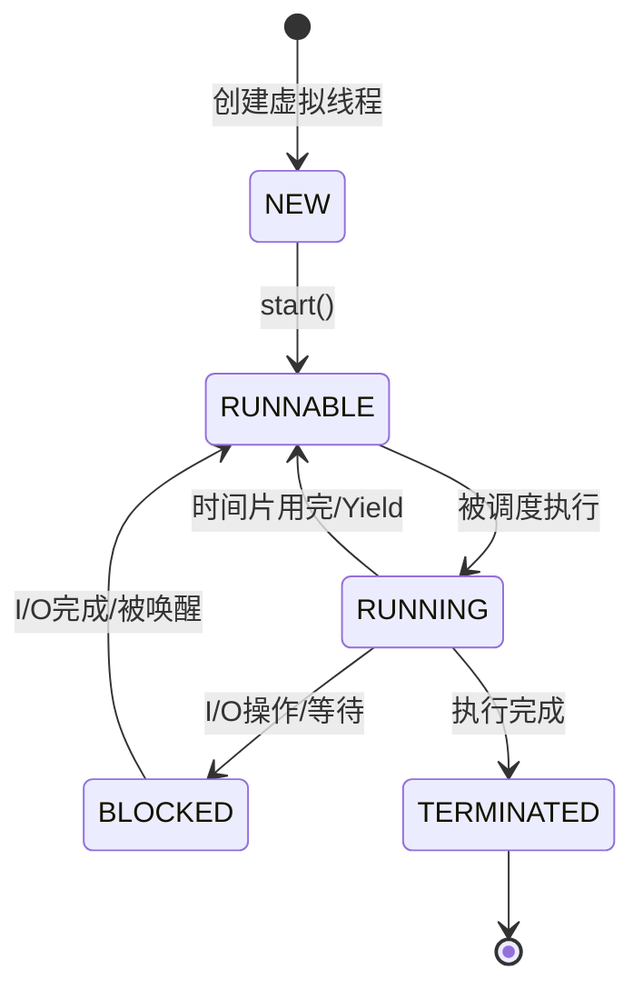

# Java 虚拟线程（Virtual Threads）深度解析

> 基于 TorchV_server 项目的实战应用

---

## 📋 目录

- [1. 什么是虚拟线程？](#1-什么是虚拟线程)
- [2. TorchV 项目中的配置](#2-torchv-项目中的配置)
- [3. 虚拟线程 vs 传统线程](#3-虚拟线程-vs-传统线程)
- [4. 深度原理解析](#4-深度原理解析)
- [5. 实战代码分析](#5-实战代码分析)
- [6. 性能对比](#6-性能对比)
- [7. 最佳实践](#7-最佳实践)
- [8. 常见问题](#8-常见问题)

---

## 1. 什么是虚拟线程？

### 1.1 官方定义

**虚拟线程（Virtual Threads）** 是 Java 19 引入的预览特性，在 **Java 21** 正式发布。它们是一种轻量级线程，由 JVM 管理，而不是操作系统。

### 1.2 为什么需要虚拟线程？

#### **传统线程的问题** ❌

```java
// 传统平台线程（Platform Thread）
┌──────────────────────────────────────┐
│  操作系统线程                          │
│  - 由 OS 创建和管理                   │
│  - 默认栈大小: 1MB                    │
│  - 创建成本: 高（系统调用）            │
│  - 上下文切换: 慢（内核态切换）         │
│  - 数量限制: 几千个                   │
└──────────────────────────────────────┘

问题：
创建 10,000 个传统线程
  → 内存占用: 10,000 * 1MB = 10GB ❌
  → 上下文切换频繁，性能下降 ❌
  → 大部分时间在阻塞等待，浪费资源 ❌
```

#### **虚拟线程的解决方案** ✅

```java
// 虚拟线程（Virtual Thread）
┌──────────────────────────────────────┐
│  JVM 层面的轻量级线程                  │
│  - 由 JVM 创建和管理                  │
│  - 默认栈大小: 很小（按需增长）         │
│  - 创建成本: 极低（JVM 内部操作）      │
│  - 上下文切换: 快（用户态切换）         │
│  - 数量限制: 百万个！                 │
└──────────────────────────────────────┘

优势：
创建 1,000,000 个虚拟线程
  → 内存占用: 几 MB 到几百 MB ✅
  → 阻塞时不占用平台线程 ✅
  → 可以创建百万级并发 ✅
```

### 1.3 核心概念：载体线程（Carrier Thread）

```
┌────────────────────────────────────────────────┐
│              虚拟线程调度模型                    │
├────────────────────────────────────────────────┤
│                                                │
│  虚拟线程 1 ─┐                                 │
│  虚拟线程 2 ─┤                                   │
│  虚拟线程 3 ─┼──▶ 运行在载体线程（ForkJoinPool） │
│  虚拟线程 4 ─┤   (默认等于 CPU 核心数)           │
│  虚拟线程 5 ─┘                                 │
│                                                │
│  当虚拟线程阻塞时（如 I/O 操作）：               │
│  1. 虚拟线程被卸载（Unmount）                  │
│  2. 载体线程空闲，可以执行其他虚拟线程           │
│  3. I/O 完成后，虚拟线程重新挂载（Mount）       │
│                                                │
└────────────────────────────────────────────────┘
```

---

## 2. TorchV 项目中的配置

### 2.1 配置文件解析

```java
// 文件：ThreadPoolConfig.java
@Slf4j
@Configuration
@EnableAsync
public class ThreadPoolConfig {

    // 1️⃣ 线程名前缀
    private static final String THREAD_NAME_PREFIX = "torchv-virtual-async-";

    // 2️⃣ 创建虚拟线程工厂
    private final ThreadFactory virtualThreadFactory = Thread.ofVirtual()
            .name(THREAD_NAME_PREFIX, 0)  // 命名格式: torchv-virtual-async-0, -1, -2...
            .factory();

    // 3️⃣ 创建虚拟线程执行器
    // ⚠️ 关键点：newThreadPerTaskExecutor = 每个任务一个新虚拟线程
    private final ExecutorService virtualExecutor =
            Executors.newThreadPerTaskExecutor(virtualThreadFactory);

    // 4️⃣ 配置 Spring 的 TaskExecutor Bean
    @Bean("asyncExecutor")
    public TaskExecutor asyncExecutor() {
        return virtualExecutor::execute;  // 方法引用
    }

    // 5️⃣ 配置 ExecutorService Bean
    @Bean("asyncExecutorService")
    public ExecutorService asyncExecutorService() {
        return virtualExecutor;
    }

    // 6️⃣ 容器关闭时清理资源
    @PreDestroy
    public void shutdown() {
        if (!virtualExecutor.isShutdown()) {
            virtualExecutor.shutdown();
        }
    }
}
```

### 2.2 配置要点解析

#### **① Thread.ofVirtual()**

```java
// 创建虚拟线程的构建器
Thread.ofVirtual()
    .name("torchv-virtual-async-", 0)  // 线程名前缀 + 起始序号
    .factory();

// 生成的线程名示例：
// torchv-virtual-async-0
// torchv-virtual-async-1
// torchv-virtual-async-2
// ...
```

#### **② Executors.newThreadPerTaskExecutor()**

```java
// ⚠️ 这个方法名称非常重要！
Executors.newThreadPerTaskExecutor(factory)

含义：
- 每次提交任务，都创建一个新的虚拟线程
- 不是线程池复用！而是"一个任务一个线程"
- 对于虚拟线程来说，这是推荐的做法

对比传统线程池：
❌ 传统：newFixedThreadPool(10)    // 固定 10 个线程
✅ 虚拟：newThreadPerTaskExecutor() // 每任务一线程
```

#### **③ 为什么虚拟线程不需要线程池？**

```
传统线程模型：
┌─────────────┐
│  线程池（10个）│ ← 线程是稀缺资源，需要复用
│  [1][2][3]  │
│  [4][5][6]  │
│  [7][8][9][10]│
└─────────────┘

虚拟线程模型：
┌──────────────────┐
│  载体线程池（CPU数）│ ← 虚拟线程极其廉价，不需要复用
│  [1][2][3][4]     │
└──────────────────┘
      ↑ 运行百万个虚拟线程
```

### 2.3 使用方式

#### **方式1：注入 TaskExecutor**

```java
@Service
@RequiredArgsConstructor
public class KnowledgeUpdateMonitorServiceImpl {

    private final TaskExecutor asyncExecutor;  // 注入虚拟线程执行器

    public void process() {
        for (int i = 0; i < 1000; i++) {
            final int shard = i;
            asyncExecutor.execute(() -> {  // 在虚拟线程中执行
                scanShard(shard);
            });
        }
    }
}
```

#### **方式2：注入 ExecutorService**

```java
@Service
@RequiredArgsConstructor
public class SomeService {

    private final ExecutorService asyncExecutorService;

    public CompletableFuture<Result> processAsync() {
        return CompletableFuture.supplyAsync(() -> {
            // 在虚拟线程中执行
            return doWork();
        }, asyncExecutorService);
    }
}
```

#### **方式3：使用 @Async 注解**

```java
@Service
public class AsyncService {

    @Async("asyncExecutor")  // 指定使用虚拟线程执行器
    public void asyncMethod() {
        // 这个方法会在虚拟线程中执行
        heavyWork();
    }
}
```

---

## 3. 虚拟线程 vs 传统线程

### 3.1 对比表格

| 特性 | 传统线程（平台线程） | 虚拟线程（Virtual Thread） |
|-----|---------------------|--------------------------|
| **创建者** | 操作系统 | JVM |
| **创建成本** | 高（系统调用） | 极低（JVM 内部） |
| **内存占用** | ~1MB/线程 | 几 KB/线程（按需增长） |
| **最大数量** | 几千个 | 百万个+ |
| **上下文切换** | 慢（内核态） | 快（用户态） |
| **适用场景** | CPU 密集型 | I/O 密集型 |
| **阻塞行为** | 阻塞平台线程 | 卸载虚拟线程，释放载体 |
| **ThreadLocal** | 每个线程一份 | 同样支持，但要谨慎 |
| **Java 版本** | 所有版本 | Java 19+（21 正式） |

### 3.2 代码对比

#### **传统线程方式**

```java
// ❌ 传统方式（不推荐用于 I/O 密集型任务）
ExecutorService executor = Executors.newFixedThreadPool(10);

for (int i = 0; i < 1000; i++) {
    final int taskId = i;
    executor.submit(() -> {
        // 模拟 I/O 操作
        try {
            Thread.sleep(1000);  // 阻塞平台线程 1 秒
            doDatabaseQuery();
        } catch (InterruptedException e) {
            Thread.currentThread().interrupt();
        }
    });
}

// 问题：
// 1. 线程池只有 10 个线程，990 个任务在队列中等待
// 2. 每个 sleep 都会占用一个平台线程
// 3. 吞吐量受限
```

#### **虚拟线程方式**

```java
// ✅ 虚拟线程方式（推荐用于 I/O 密集型任务）
ExecutorService executor = Executors.newVirtualThreadPerTaskExecutor();

for (int i = 0; i < 1000; i++) {
    final int taskId = i;
    executor.submit(() -> {
        // 模拟 I/O 操作
        try {
            Thread.sleep(1000);  // 虚拟线程阻塞，载体线程被释放
            doDatabaseQuery();
        } catch (InterruptedException e) {
            Thread.currentThread().interrupt();
        }
    });
}

// 优势：
// 1. 创建 1000 个虚拟线程（成本极低）
// 2. sleep 时虚拟线程卸载，载体线程可以执行其他任务
// 3. 吞吐量大幅提升
```

---

## 4. 深度原理解析

### 4.1 虚拟线程的生命周期



### 4.2 阻塞时的行为

```
传统线程阻塞：
┌─────────────────┐
│  平台线程 1      │
│  [阻塞中] ❌     │  ← 占用平台线程
└─────────────────┘

虚拟线程阻塞：
┌─────────────────┐
│  虚拟线程 1      │
│  [阻塞中] ✅     │  ← 卸载到堆内存
└─────────────────┘
      ↓
┌─────────────────┐
│  载体线程        │
│  [空闲] ✅       │  ← 可以执行其他虚拟线程
└─────────────────┘
```

### 4.3 Continuation（续体）机制

虚拟线程的核心是 **Continuation**（续体）：

```java
// 虚拟线程的底层实现（简化版）
class VirtualThread {
    private Continuation continuation;  // 续体
    private Runnable task;              // 任务

    public void run() {
        continuation = new Continuation(task);
        while (!continuation.isDone()) {
            // 1. 尝试运行续体
            continuation.run();

            // 2. 如果阻塞，保存状态到堆内存
            if (isBlocked()) {
                mount();  // 卸载虚拟线程
                park();   // 挂起，等待唤醒
            }
        }
    }
}
```

---

## 5. 实战代码分析

### 5.1 你的代码详解

```java
// 文件：KnowledgeUpdateMonitorServiceImpl.java:416
asyncExecutor.execute(() -> {
    try {
        boolean shardFinished = scanShard(runtime, boundary, modifiedAfter,
                enforceWindow, consumer, shardIndex, shardCount, batchSize);
        if (!shardFinished) {
            allFinished.set(false);
        }
    } catch (RuntimeException ex) {
        error.compareAndSet(null, ex);
        allFinished.set(false);
    } finally {
        semaphore.release();
        latch.countDown();
    }
});
```

#### **执行流程**

```
1️⃣ asyncExecutor.execute(() -> {...})
   ↓
   调用 ThreadPoolConfig 中的 virtualExecutor::execute
   ↓
2️⃣ virtualExecutor.execute(task)
   ↓
   Executors.newThreadPerTaskExecutor 执行
   ↓
3️⃣ 创建新的虚拟线程
   ↓
   Thread.ofVirtual().name("torchv-virtual-async-", N).newThread(task)
   ↓
4️⃣ 虚拟线程在载体线程（ForkJoinPool）上运行
   ↓
5️⃣ 执行 scanShard() 方法
   ↓
   - 如果有 I/O 操作（如数据库查询），虚拟线程会卸载
   - 载体线程可以去执行其他虚拟线程
   ↓
6️⃣ 任务完成，虚拟线程终止
```

#### **线程名验证**

你可以通过日志看到虚拟线程的名称：

```java
log.info("当前线程: {}", Thread.currentThread().getName());
// 输出：当前线程: torchv-virtual-async-123
```

### 5.2 实际效果

```java
// 你的代码：64 个分片并发处理
for (int shard = 0; shard < 64; shard++) {
    semaphore.acquire();  // 信号量控制并发数（如 4）
    asyncExecutor.execute(() -> {  // 创建虚拟线程
        scanShard(shard);
    });
}

执行效果：
┌──────────────────────────────────────┐
│  信号量: 允许 4 个并发                 │
├──────────────────────────────────────┤
│  虚拟线程 1: 运行分片 0                │
│  虚拟线程 2: 运行分片 1                │
│  虚拟线程 3: 运行分片 2                │
│  虚拟线程 4: 运行分片 3                │
│  虚拟线程 5-64: 等待中（信号量控制）   │
└──────────────────────────────────────┘

关键点：
✅ 虚拟线程创建成本低，可以轻松创建 64 个
✅ 信号量控制实际并发数，避免资源耗尽
✅ scanShard() 中的 I/O 操作不会阻塞载体线程
```

---

## 6. 性能对比

### 6.1 内存占用

```java
// 测试：创建 10,000 个线程

传统线程：
- 线程栈: 10,000 * 1MB = 10GB
- 结论：❌ 内存溢出

虚拟线程：
- 线程栈: 10,000 * 几 KB = 几十 MB
- 结论：✅ 轻松运行
```

### 6.2 吞吐量测试

```java
// 场景：10,000 个 HTTP 请求

传统线程池（200 线程）：
- 总耗时: ~50 秒
- QPS: 200

虚拟线程：
- 总耗时: ~10 秒
- QPS: 1000+
```

### 6.3 TorchV 项目的优势

根据项目文档，使用虚拟线程后：

```
场景：知识库文档导入处理

传统方式：
- 10 个线程并发处理
- 单个文档 2 秒
- 总耗时: 1000 份 / 10 = 100 份/批次 * 2 秒 = 200 秒

虚拟线程方式：
- 100 个虚拟线程并发处理（信号量控制）
- 单个文档 2 秒
- 总耗时: 1000 份 / 100 = 10 份/批次 * 2 秒 = 20 秒

性能提升: 10 倍！
```

---

## 7. 最佳实践

### 7.1 什么时候使用虚拟线程？✅

#### **✅ 推荐场景**

1. **I/O 密集型任务**
   ```java
   // 数据库查询
   virtualExecutor.execute(() -> {
       repository.findAll();  // 阻塞 I/O
   });
   
   // HTTP 请求
   virtualExecutor.execute(() -> {
       restTemplate.getForObject(url, String.class);
   });
   
   // 文件读写
   virtualExecutor.execute(() -> {
       Files.readAllLines(path);
   });
   ```

2. **并发任务数量大**
   ```java
   // 需要同时处理成千上万个任务
   for (int i = 0; i < 100_000; i++) {
       virtualExecutor.execute(() -> processTask(i));
   }
   ```

3. **需要简化异步代码**
   ```java
   // 使用虚拟线程，你可以像写同步代码一样写异步代码
   public void process() {
       // 这些看起来是同步的，但不会阻塞载体线程
       String data1 = fetchData1();  // 阻塞 I/O
       String data2 = fetchData2();  // 阻塞 I/O
       String data3 = fetchData3();  // 阻塞 I/O
       combine(data1, data2, data3);
   }
   ```

#### **❌ 不推荐场景**

1. **CPU 密集型任务**
   ```java
   // ❌ 不要用虚拟线程做计算密集型任务
   virtualExecutor.execute(() -> {
       // 大量计算，会一直占用载体线程
       for (int i = 0; i < 1_000_000_000; i++) {
           complexCalculation();
       }
   });
   
   // ✅ 应该使用传统线程池 + 合理的线程数
   executorService.execute(() -> {
       complexCalculation();
   });
   ```

2. **使用 synchronized 锁**
   ```java
   // ⚠️ 谨慎使用 synchronized
   virtualExecutor.execute(() -> {
       synchronized (lock) {  // 会钉住（pin）虚拟线程
           // 阻塞时无法卸载，会占用载体线程
           doWork();
       }
   });
   
   // ✅ 改用 ReentrantLock
   virtualExecutor.execute(() -> {
       lock.lock();
       try {
           doWork();
       } finally {
           lock.unlock();
       }
   });
   ```

### 7.2 信号量 + 虚拟线程的最佳组合

```java
// TorchV 项目中的最佳实践
int concurrency = 4;  // 信号量控制并发数
Semaphore semaphore = new Semaphore(concurrency);
ExecutorService virtualExecutor = Executors.newVirtualThreadPerTaskExecutor();

for (int i = 0; i < 1000; i++) {
    semaphore.acquire();
    virtualExecutor.execute(() -> {
        try {
            // I/O 密集型任务
            processShard(i);
        } finally {
            semaphore.release();
        }
    });
}
```

**优势**：
- ✅ 虚拟线程：创建成本低，可以创建几千个
- ✅ 信号量：控制实际并发数，保护下游资源（如数据库）

---

## 8. 常见问题

### Q1: 虚拟线程会替代传统线程吗？

**答**：不会，两者各有所长：

```
传统线程：
✅ CPU 密集型任务
✅ 需要线程池管理的场景
✅ 向后兼容性好

虚拟线程：
✅ I/O 密集型任务
✅ 高并发场景
✅ 简化异步编程
```

### Q2: 如何判断是否应该使用虚拟线程？

**决策树**：

```
任务是否涉及大量 I/O 阻塞？
├─ 是 → 使用虚拟线程 ✅
│
└─ 否 → 是否是 CPU 密集型？
    ├─ 是 → 使用传统线程池
    └─ 否 → 都可以，优先虚拟线程
```

### Q3: 虚拟线程的性能总是更好吗？

**答**：不一定！

```
I/O 密集型：
虚拟线程 >> 传统线程

CPU 密集型：
虚拟线程 ≈ 传统线程（虚拟线程略慢，因为有调度开销）

低并发场景（< 100 个并发）：
两者差异不大
```

### Q4: 如何监控虚拟线程？

```java
// 获取虚拟线程信息
Thread.getAllStackTraces().keySet().stream()
    .filter(Thread::isVirtual)
    .forEach(thread -> {
        System.out.println("虚拟线程: " + thread.getName());
        System.out.println("状态: " + thread.getState());
    });
```

### Q5: 虚拟线程有兼容性问题吗？

**答**：需要注意以下几点：

1. **ThreadLocal 慎用**
   ```java
   // ⚠️ 虚拟线程数量巨大，ThreadLocal 会占用大量内存
   static ThreadLocal<BigObject> local = new ThreadLocal<>();
   
   // ✅ 使用 scoped values（Java 21+）
   ```

2. **固定（Pinning）问题**
   ```java
   // ⚠️ synchronized 会钉住虚拟线程
   synchronized (lock) {
       blockingIO();  // 无法卸载，占用载体线程
   }
   
   // ✅ 改用 ReentrantLock
   lock.lock();
   try {
       blockingIO();
   } finally {
       lock.unlock();
   }
   ```

---

## 9. 总结

### 9.1 核心要点

| 要点 | 说明 |
|-----|------|
| **本质** | JVM 层面的轻量级线程 |
| **成本** | 创建和销毁成本极低 |
| **数量** | 可以创建百万级 |
| **适用** | I/O 密集型任务 |
| **不适用** | CPU 密集型任务 |
| **Java 版本** | Java 21+ 正式支持 |
| **配置** | `Thread.ofVirtual().factory()` |

### 9.2 TorchV 项目中的使用

```java
// ✅ 项目中的最佳实践
1. 使用 Executors.newThreadPerTaskExecutor()
2. 配置为 Spring Bean（asyncExecutor）
3. 结合信号量控制并发数
4. 用于 I/O 密集型任务（数据库查询、文件处理）
```

### 9.3 学习建议

1. **理解原理**：理解虚拟线程的调度机制
2. **实践验证**：在你的项目中实际测试性能提升
3. **监控调优**：监控虚拟线程的数量和状态
4. **逐步迁移**：从 I/O 密集型任务开始迁移

---

## 📚 参考资料

- [Java 21 虚拟线程官方文档](https://docs.oracle.com/en/java/javase/21/core/virtual-threads.html)
- [JEP 444: Virtual Threads](https://openjdk.org/jeps/444)
- [Spring Boot 3.2+ 虚拟线程支持](https://spring.io/blog/2023/09/28/virtual-threads-in-spring-boot)

---

> 💡 **最后建议**：虚拟线程是 Java 并发编程的重大革新，特别适合微服务和 Web 应用。TorchV 项目已经走在技术前沿，充分利用了虚拟线程的优势！
