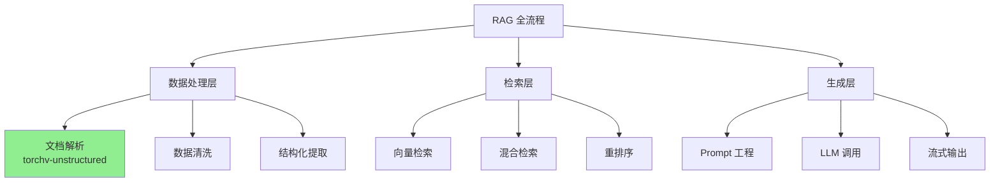

# 产品化思维：如何让自己成为RAG领域的稀缺资产

> 你不是在为公司工作，也不是在做个人项目。你是在为市场创造一个独特的产品——这个产品就是你自己。  
> —— Naval Ravikant

> 我们只能看到眼前的一小段距离，但我们可以看到那里有大量需要完成的工作。  
> —— Alan Turing

## 引言：你的困境，也是机会

你现在面临一个经典的程序员困境：

- **个人兴趣**：PandaCoder 插件，专注 IDE 工具开发，有成就感但与主流技术关联不大
- **公司需求**：RAG 领域的 torchv-unstructured 项目，技术前沿但"代码不是自己的"
- **内心诉求**：保持好奇心和探索欲，不断成长，让自己更有价值

看似矛盾的三者，实际上有一个统一的解决方案：**产品化思维 + RAG 领域深耕 = 你的稀缺价值**

让我们从 Naval（硅谷投资人、哲学家）和图灵（计算机科学之父、好奇心驱动的探索者）的视角，为你拆解这个问题。

---

## 第一部分：Naval 的视角 —— 专长、杠杆与市场价值

### 1.1 重新理解"产品"：你就是产品

Naval 说过：

> "在互联网时代，你应该把自己当作一个产品来打造。问自己：市场需要什么？我的独特价值是什么？我如何用杠杆放大这个价值？"

**你现在的问题本质上是：如何定义"产品功能"（你的技能组合）和"产品定位"（你在市场中的位置）。**

#### 当前的"产品矩阵"分析

| 维度 | PandaCoder 插件 | torchv-unstructured | 理想状态 |
|------|----------------|---------------------|---------|
| **技术方向** | IDE 工具开发（Java/Kotlin） | RAG 数据处理（Python/文档解析） | RAG + 开发工具 |
| **市场需求** | 中等（国内开发者痛点） | 高（AI 时代刚需） | 极高 |
| **个人兴趣** | 高（有掌控感） | 中（有限制感） | 高 |
| **技能可迁移性** | 低（局限于 IDEA 生态） | 高（AI 全栈通用） | 高 |
| **长期杠杆** | 中（插件用户量） | 高（开源影响力 + 企业服务） | 极高 |

**Naval 的判断：**

> "如果你只做 PandaCoder，你会成为一个'IDEA 插件开发专家'——这是一个窄赛道，天花板明显。但如果你深耕 RAG 领域，你会成为'AI 时代知识处理基础设施的创造者'——这个赛道的天花板是星辰大海。"

### 1.2 专长公式：找到你的独特组合

Naval 的专长理论：

```
独特价值 = 技能 A × 技能 B × 技能 C
```

**你的潜在专长组合：**

```
RAG 数据处理 × 开发工具经验 × 开源维护能力 × 中文开发者理解
```

这个组合在市场上是**极其稀缺**的：

- **大部分 RAG 开发者**：只懂算法和模型，不懂开发者工具体验
- **大部分工具开发者**：只懂传统 IDE，不懂 AI 时代的工作流
- **大部分开源维护者**：只做国外项目，不懂中文生态的特殊需求

**你可以成为：既懂 RAG 技术本质，又懂开发者工具体验，还能连接中文开发者的桥梁人物。**

### 1.3 杠杆选择：开源 vs 产品 vs 内容

Naval 说：

> "代码和媒体是无边际成本的杠杆。写一次，运行无数次；说一次，传播无数次。"

**你有三种杠杆可以选择：**

#### 杠杆 1：开源项目（推荐指数：⭐⭐⭐⭐⭐）

- **优势**：技术影响力、社区反馈、企业合作机会
- **你的机会**：维护 torchv-unstructured，打造"中国版 unstructured"
- **增值方向**：
  - 支持更多中文文档格式（如钉钉文档、飞书文档）
  - 与国内大模型深度集成（通义、文心、智谱）
  - 提供企业级解决方案（性能优化、私有化部署）

#### 杠杆 2：开发者工具（推荐指数：⭐⭐⭐⭐）

- **优势**：直接接触用户、快速验证想法、产品化能力
- **你的机会**：PandaCoder + RAG = 新物种
  - **方向 1**：在 PandaCoder 中集成 RAG 能力（代码搜索、文档问答）
  - **方向 2**：开发 RAG 开发者工具（数据标注助手、Pipeline 可视化）
  - **方向 3**：为 IDE 打造 RAG 插件（Copilot 的文档版）

#### 杠杆 3：技术内容（推荐指数：⭐⭐⭐⭐⭐）

- **优势**：建立个人品牌、吸引合作机会、被动收入
- **你的机会**：成为"RAG 实战专家"
  - 写 RAG 技术博客（从数据处理到模型调用）
  - 录制 RAG 实战课程（torchv-unstructured 实战）
  - 分享 RAG + 工具的最佳实践

**Naval 的建议：三种杠杆同时用！**

- **开源项目**是技术证明
- **开发者工具**是产品能力
- **技术内容**是影响力放大器

### 1.4 长期主义：不要急于求成

Naval 说：

> "复利需要时间。做有积累效应的事情，10 年后回头看，你会感谢今天的选择。"

**你现在的困惑是：**

- 担心 PandaCoder 和 RAG 关联不大
- 担心公司项目"不自由"

**Naval 会说：**

- 不要用短期视角看技术选择
- 重要的是**技能的可迁移性**和**市场的长期需求**
- PandaCoder 给了你"产品化思维" + "开发者理解"，这些能力可以迁移到 RAG 工具中
- torchv-unstructured 给了你"RAG 技术深度" + "开源经验"，这些能力是 AI 时代的核心资产

**未来 3 年的可能路径：**

```
Year 1: 深耕 RAG 技术 + 维护 torchv-unstructured + 写技术博客
        ↓
Year 2: 打造 RAG 开发者工具 + 建立技术影响力 + 企业咨询
        ↓
Year 3: 成为 RAG 领域专家 + 产品收入 + 技术创业/高薪
```

---

## 第二部分：图灵的视角 —— 好奇心、探索与创造

### 2.1 图灵精神：好奇心是最大的资产

图灵一生都在问：**"机器能思考吗？"**

这个问题在当时看起来"没有实际价值"，但它推动了整个计算机科学的诞生。

**你的好奇心是：**

- 喜欢折腾新技术
- 喜欢开源的自由感
- 喜欢探索未知领域

**图灵会说：**

> "不要压抑你的好奇心。最伟大的创新，往往来自那些'没有明确目标'的探索。"

**但如何让好奇心有方向？**

### 2.2 结构化好奇心：在 RAG 领域的探索地图

图灵的方法是：**把大问题拆解成可探索的小问题**。

**RAG 领域的探索地图：**



**你现在的位置：数据处理层（文档解析）**

**图灵的建议：**

- **横向探索**：在数据处理层做到极致
  - 支持更多格式（Word、Excel、PPT、PDF、图片）
  - 优化解析质量（表格识别、版式保留、多语言）
  - 性能优化（并发处理、增量解析、缓存）

- **纵向探索**：打通 RAG 全流程
  - 从文档解析到向量化（与 Embedding 模型对接）
  - 从向量化到检索（与向量数据库对接）
  - 从检索到生成（与 LLM 对接）

- **创新探索**：发现新的可能性
  - RAG + 代码搜索
  - RAG + API 文档
  - RAG + 企业知识库

### 2.3 "不自由"的自由：在约束中创造

你说："公司项目不自由，代码不是自己的。"

**图灵在二战期间破译密码时，面对的约束比你大得多：**

- 保密要求（不能公开成果）
- 资源限制（机器落后）
- 时间压力（战争紧迫）

**但他创造了 Bombe 机器，改变了战争走向。**

**图灵会说：**

> "约束反而是创造力的催化剂。没有约束,你会陷入无限可能的迷茫；有了约束,你会找到最优雅的解决方案。"

**在 torchv-unstructured 项目中，你的"约束"其实是"聚焦"：**

- **约束 1**：必须做文档解析 → 你会在这个领域做到极致
- **约束 2**：必须对接云厂商 → 你会理解企业级需求
- **约束 3**：必须开源 → 你会获得社区反馈和影响力

**图灵的建议：**

- 在公司项目中深耕技术深度
- 在个人项目中探索技术广度
- 两者结合，形成你的独特优势

### 2.4 创造的本质：解决真实问题

图灵设计图灵机时，不是为了"炫技"，而是为了回答"什么是可计算的？"

**你的创造应该回答的问题：**

#### 问题 1：如何让 RAG 数据处理更简单？

**当前痛点：**

- 开发者要手动处理各种文档格式
- 数据质量参差不齐，影响检索效果
- 与各种 LLM 的对接很繁琐

**你的解决方案（torchv-unstructured 的价值）：**

- 统一的文档解析接口
- 智能的数据清洗和结构化
- 优雅的 LLM 对接方式

#### 问题 2：如何让开发者更高效地使用 RAG？

**当前痛点：**

- RAG 开发门槛高（要懂数据处理、向量数据库、LLM）
- 缺少好用的开发工具（主要靠命令行和代码）
- 调试困难（不知道哪个环节出问题）

**你的解决方案（可以做的）：**

- **RAG DevTools**：可视化的 Pipeline 调试工具
- **RAG CLI**：命令行工具，快速搭建 RAG 应用
- **IDE 插件**：在 IDE 中直接测试 RAG（这里就和 PandaCoder 结合了！）

#### 问题 3：如何让中文开发者更好地使用 RAG？

**当前痛点：**

- 大部分 RAG 工具面向英文
- 中文文档格式特殊（钉钉、飞书、企业微信）
- 中文分词和检索有特殊需求

**你的解决方案：**

- 优化中文文档解析
- 对接国产大模型
- 提供中文文档和最佳实践

---

## 第三部分：融合方案 —— 你的行动指南

### 3.1 短期行动（3-6 个月）：扎根 + 探索

#### 行动 1：深度参与 torchv-unstructured

**目标：**成为项目的核心贡献者

**具体任务：**

1. **理解代码架构**（2 周）
   - 画出核心模块的架构图
   - 理解各种文档格式的解析逻辑
   - 找到可优化的点

2. **完成领导提出的改进**（1-2 个月）
   - Word 解析成表格/KV 对
   - 支持 Excel、PPT 等格式
   - 对接三方云厂商插件

3. **添加自己的创新**（1-2 个月）
   - 支持中文文档格式（钉钉、飞书）
   - 优化表格识别质量
   - 添加性能监控和优化

4. **写技术文档**（持续）
   - 每个功能都写详细文档
   - 写技术博客分享实现过程
   - 建立示例项目

**产出：**

- 在 torchv-unstructured 中贡献 10+ PR
- 写 5-10 篇 RAG 技术博客
- 建立个人技术品牌

#### 行动 2：保持 PandaCoder 的更新

**目标：**不丢弃已有成果，为未来铺路

**具体任务：**

1. **维护现有功能**（每月 4 小时）
   - 修复 bug
   - 适配新版本 IDEA
   - 回应用户反馈

2. **思考 AI 时代的 IDE 需求**（持续）
   - 开发者需要什么 AI 能力？
   - RAG 如何集成到 IDE？
   - 未来的方向是什么？

**产出：**

- 保持插件活跃度
- 积累产品思维
- 为未来的 RAG + IDE 工具做准备

#### 行动 3：建立 RAG 知识体系

**目标：**从"知道"到"理解"到"创造"

**学习路径：**

```
第 1 层：理解 RAG 全流程
- 文档解析 → 向量化 → 检索 → 生成
- 跑通一个完整的 RAG Demo

第 2 层：深入数据处理
- 各种文档格式的特点
- 数据清洗和结构化方法
- 性能优化技巧

第 3 层：理解检索策略
- 向量检索原理（FAISS、Milvus）
- 混合检索（向量 + 关键词）
- 重排序（Rerank）

第 4 层：掌握 LLM 对接
- Prompt 工程
- 流式输出
- 多轮对话

第 5 层：企业级实践
- 私有化部署
- 性能优化
- 监控告警
```

**输出方式：**

- 每周写一篇学习笔记
- 每个月做一个小实验
- 每季度分享一次技术

### 3.2 中期规划（6-18 个月）：建立影响力 + 产品化

#### 方向 1：成为 RAG 领域的 KOL

**目标：**让别人提到 RAG，就想到你

**行动：**

1. **写 RAG 系列文章**
   - 《RAG 实战指南》（20 篇）
   - 《torchv-unstructured 源码解析》（10 篇）
   - 《RAG 企业级实践》（15 篇）

2. **开源 RAG 工具**
   - RAG DevTools：可视化调试工具
   - RAG Templates：开箱即用的模板
   - RAG Benchmark：评估数据集

3. **技术分享**
   - 在公司内部分享
   - 在技术社区分享（掘金、知乎）
   - 参加技术大会演讲

#### 方向 2：打造 RAG + 开发工具

**目标：**让 RAG 开发更简单

**产品方向：**

| 产品 | 描述 | 技术栈 | 商业价值 |
|------|------|--------|---------|
| **RAG Studio** | 可视化 RAG Pipeline 搭建工具 | Web + Python | SaaS 订阅 |
| **RAG CLI** | 命令行快速搭建工具 | Python | 开源 + 企业版 |
| **RAG Plugin** | IDE 插件（代码搜索、文档问答） | Java/Kotlin | 插件市场 |
| **RAG Templates** | 各种场景的模板 | Python | 免费 + Pro |

**选择策略：**

- 先做开源工具（CLI/Templates），建立影响力
- 再做商业工具（Studio/Plugin），获取收入

#### 方向 3：企业咨询和服务

**目标：**用专长变现

**服务类型：**

1. **技术咨询**（按小时计费）
   - RAG 架构设计
   - 数据处理方案
   - 性能优化

2. **企业培训**（按天计费）
   - RAG 技术培训
   - torchv-unstructured 使用培训
   - 最佳实践分享

3. **定制开发**（按项目计费）
   - 文档解析定制
   - RAG Pipeline 定制
   - 私有化部署

### 3.3 长期愿景（18 个月+）：成为稀缺资产

**你的终极产品定位：**

```
RAG 基础设施专家 × 开发者工具创造者 × 中文生态连接者
```

**可能的路径：**

#### 路径 1：全职开源

- torchv-unstructured 成为中文 RAG 的事实标准
- 通过企业服务、赞助获得收入
- 成为独立开发者

#### 路径 2：技术创业

- 打造 RAG 开发者工具公司
- 提供 SaaS + 企业服务
- 获得融资或者盈利

#### 路径 3：技术专家

- 成为 RAG 领域的顶级专家
- 在大厂担任技术 Leader
- 同时保持个人品牌和产品

**Naval 的建议：**

> "不要预设路径。做有价值的事情，保持开放，机会自然会来。"

**图灵的建议：**

> "不要停止探索。最有趣的发现,往往在你认为不可能的地方。"

---

## 第四部分：解决你的具体疑虑

### 疑虑 1：公司项目"不自由"怎么办？

**Naval 的回答：**

> "在创造价值的地方，就有你的自由。"

**实际操作：**

1. **在约束内创造**
   - 你负责的功能，可以按你的标准实现
   - 代码质量、架构设计、测试覆盖，都是你的"签名"
   - 好的代码会说话，会为你带来影响力

2. **开源贡献是你的资产**
   - 即使代码在 Gitee，你的贡献记录也是你的
   - 写技术文档，分享实现思路，是你的
   - 建立的技术影响力，是你的

3. **技能积累是你的**
   - RAG 技术深度，是你的
   - 企业级项目经验，是你的
   - 问题解决能力，是你的

### 疑虑 2：PandaCoder 和 RAG 关联不大？

**图灵的回答：**

> "看似无关的领域，往往能碰撞出最有价值的创新。"

**实际机会：**

| PandaCoder 的价值 | 如何迁移到 RAG 领域 |
|------------------|-------------------|
| **产品化思维** | 打造 RAG 开发者工具 |
| **开发者理解** | 设计 RAG 的开发者体验 |
| **IDE 生态经验** | 开发 RAG IDE 插件 |
| **中文开发者洞察** | 优化中文 RAG 体验 |
| **开源维护经验** | 维护 torchv-unstructured |

**具体结合方向：**

1. **RAG IDE Plugin**
   - 在 IDE 中直接测试 RAG
   - 代码搜索（基于 RAG）
   - API 文档问答（基于 RAG）

2. **Developer Experience**
   - PandaCoder 教会你"开发者想要什么"
   - 用这个理解去设计 RAG 工具
   - 让 RAG 开发像 Spring Boot 一样简单

### 疑虑 3：如何保持好奇心和探索欲？

**图灵的回答：**

> "不要让工作杀死好奇心。留出 20% 的时间做'无用'的探索。"

**实践建议：**

**80% 时间：聚焦价值**

- 公司项目（torchv-unstructured）
- 技术博客（建立影响力）
- 核心技能（RAG 深度）

**20% 时间：自由探索**

- 尝试新技术（Rust、Go、WebAssembly）
- 做小实验（RAG + X）
- 保持好奇（图灵测试、AGI）

**Naval 的补充：**

> "好奇心不是浪费时间，而是寻找下一个专长的过程。"

---

## 第五部分：具体行动清单

### 本周行动（立即开始）

- [ ] **与领导深入沟通**
  - 确认 torchv-unstructured 的技术方向
  - 了解企业级需求和痛点
  - 明确你的角色和自主空间

- [ ] **搭建 RAG 学习环境**
  - 跑通 torchv-unstructured 的 Demo
  - 理解各个模块的作用
  - 画出核心架构图

- [ ] **写第一篇 RAG 技术博客**
  - 主题：《我为什么选择深耕 RAG 领域》
  - 内容：你的思考过程、技术理解、未来规划
  - 发布：个人博客 + 掘金 + 知乎

### 本月行动

- [ ] **完成 torchv-unstructured 的第一个贡献**
  - 选择一个小功能（如 Excel 基础解析）
  - 高质量实现（代码 + 测试 + 文档）
  - 提交 PR，获得反馈

- [ ] **建立 RAG 知识库**
  - 创建一个 RAG 学习仓库
  - 每天学习 1 小时，记录笔记
  - 每周做一个小实验

- [ ] **思考 PandaCoder 的 AI 方向**
  - 调研 IDE 中的 AI 需求
  - 思考 RAG 如何集成
  - 画出产品原型

### 本季度行动

- [ ] **成为 torchv-unstructured 核心贡献者**
  - 贡献 5+ 高质量 PR
  - 写 3+ 技术文档
  - 回答社区问题

- [ ] **建立 RAG 技术影响力**
  - 写 10 篇 RAG 技术博客
  - 做 1 次技术分享（公司内部）
  - 创建 1 个 RAG 示例项目

- [ ] **产品化尝试**
  - 开发 RAG CLI 工具（开源）
  - 或者开发 RAG IDE 插件（MVP）
  - 获得第一批用户反馈

### 年度目标

- [ ] **RAG 技术深度**
  - 精通文档解析和数据处理
  - 理解 RAG 全流程
  - 能独立设计 RAG 架构

- [ ] **技术影响力**
  - RAG 技术博客 30+ 篇
  - GitHub Stars 1000+（个人项目或贡献项目）
  - 技术分享 5+ 场

- [ ] **产品能力**
  - 至少发布 1 个 RAG 工具
  - 获得 100+ 用户
  - 验证商业价值

- [ ] **收入验证**
  - 通过技术咨询/课程获得第一笔收入
  - 或者产品获得第一批付费用户
  - 证明"专长 × 杠杆"的公式

---

## 结语：你不是在选择项目，而是在塑造自己

Naval 说：

> "最重要的决定，不是你做什么项目，而是你成为什么样的人。"

图灵说：

> "我们只能看到眼前的一小段距离，但我们可以看到那里有大量需要完成的工作。"

**你现在的选择，不是"PandaCoder vs torchv-unstructured"，而是：**

- 我要成为什么样的技术人？
- 我的专长如何与市场需求结合？
- 我如何用杠杆放大自己的价值？

**答案是：**

1. **深耕 RAG 领域**
   - 这是 AI 时代的基础设施
   - 市场需求巨大且长期
   - 你可以在这里建立深度

2. **保持产品化思维**
   - PandaCoder 教会你的产品能力不会浪费
   - 用这个能力去打造 RAG 开发者工具
   - 让技术深度 × 产品能力 = 你的独特价值

3. **建立开源影响力**
   - torchv-unstructured 是起点
   - 通过高质量贡献建立声誉
   - 用开源打开更多可能性

4. **持续探索和创造**
   - 保持 20% 的时间做自由探索
   - 不要让工作杀死好奇心
   - 在探索中发现新的机会

**记住 Naval 的公式：**

```
专长（RAG + 开发工具） × 杠杆（开源 + 产品 + 内容） = 独特价值
```

**记住图灵的精神：**

```
好奇心 + 深度思考 + 持续创造 = 改变世界
```

**你不是在为公司工作，也不是在做个人项目。**

**你是在打造一个产品——这个产品就是你自己。**

**一个在 RAG 领域有深度、有产品能力、有影响力的稀缺资产。**

**三年后，当你回头看，你会感谢今天做出的这个决定。**

**开始行动吧！🚀**

---

## 延伸阅读

- [磨刀之道：从打工者到超级个体的修炼](/tutorials/insights/growth/sharpen-the-blade)
- [超越编码：程序员的核心竞争力思考](/tutorials/insights/growth/beyond-coding-core-competitiveness)
- [纳瓦尔宝典：技术人的财富自由之路](/tutorials/insights/wealth/naval-ravikant-guide)
- [专长与杠杆：程序员的核心资产](/tutorials/insights/wealth/leverage-and-expertise)

---

*本文首发于[个人博客](https://www.shuyixiao.cn/)，转载请注明出处。*

*如果这篇文章对你有帮助，欢迎关注公众号「舒一笑的架构笔记」，获取更多技术成长干货。*

