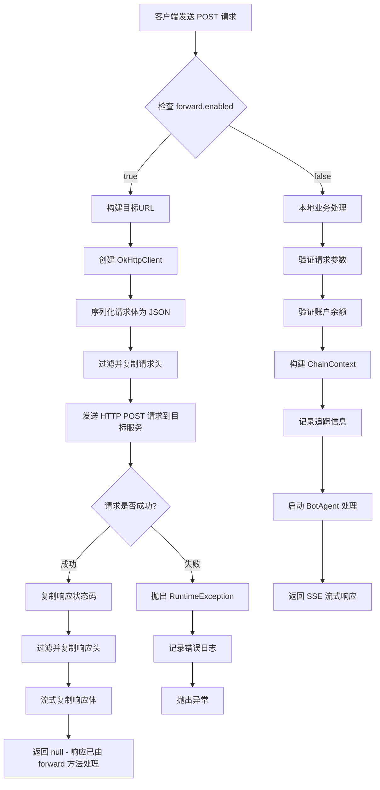
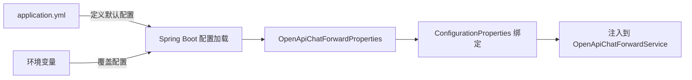

> 产品说：H5 和企业微信 Bot 的入口是测试环境，但数据要能拿到生产的结果，还不能改客户端配置。我们用一个配置开关 + 几十行代码，就把这事儿跑通了。

## 1. 故事从“环境错位”开始

最近团队接到一个奇怪的测试需求：

- 用户侧 H5 问答页面、企业微信应用 Bot 的调用入口**都指向测试环境**；
- 但这些入口背后的真实问答数据，**必须来自生产环境**；
- 而且**不改客户端代码**，最好也别动域名和 Nginx。

说白了，就是“用测试的壳儿，调生产的料儿”。

这个场景看似奇葩，但在日常开发中其实很常见：灰度验证新模型、并行对比两个版本的服务、在不改动客户端的前提下平滑迁移接口……都会用到这种**请求透明转发**的能力。

所以，我们在 `OpenChatAppController` 里塞进了一个基于 YML 配置的转发模块——OpenAPI Chat Forward，用极简的方式实现了“一面入口，背后可切”的服务路由。

## 2. 技术架构

### 2.1 组件关系图

```
┌─────────────────────────────────────────────────────────────────────────────┐
│                              Client Request                                  │
│                     POST /openapi/app/api/v1/chat/completions                │
└─────────────────────────────────────────────────────────────────────────────┘
                                      │
                                      ▼
┌─────────────────────────────────────────────────────────────────────────────┐
│                           OpenChatAppController                              │
│                                                                             │
│  ┌───────────────────────────────────────────────────────────────────────┐  │
│  │                    openApiChatForwardService.enabled()                 │  │
│  └───────────────────────────────────────────────────────────────────────┘  │
│                                      │                                      │
│                    ┌─────────────────┴─────────────────┐                    │
│                    ▼                                   ▼                    │
│            ┌──────────────┐                   ┌──────────────┐             │
│            │  enabled=true │                   │ enabled=false│             │
│            │   (转发模式)   │                   │  (本地模式)  │             │
│            └──────────────┘                   └──────────────┘             │
│                    │                                   │                    │
│                    ▼                                   ▼                    │
│  ┌──────────────────────────────┐   ┌──────────────────────────────────┐  │
│  │ OpenApiChatForwardService    │   │     本地业务处理流程              │  │
│  │         .forward()           │   │  - validationCompletion()        │  │
│  │                              │   │  - validateAvailableAmount()     │  │
│  │  ┌────────────────────────┐  │   │  - buildChainContext()           │  │
│  │  │   OkHttpClient         │  │   │  - botAgent.start()              │  │
│  │  │   HTTP/HTTPS 转发      │  │   │                                  │  │
│  │  └────────────────────────┘  │   └──────────────────────────────────┘  │
│  └──────────────────────────────┘                                          │
└─────────────────────────────────────────────────────────────────────────────┘
```

### 2.2 核心类结构

```
com.torchv.application.openapi
├── config
│   └── OpenApiChatForwardProperties.java    # 配置属性类
├── service
│   └── OpenApiChatForwardService.java       # 转发服务实现
└── web
    └── OpenChatAppController.java           # 控制器入口
```

---

## 3. 配置说明

### 3.1 配置项定义

```yaml
openapi:
  chat:
    forward:
      # 是否启用转发功能
      enabled: ${OPENAPI_CHAT_FORWARD_ENABLED:false}

      # 目标服务基础URL
      targetBaseUrl: ${OPENAPI_CHAT_FORWARD_TARGET_BASE_URL:http://10.10.0.135:10004}

      # 转发路径
      path: ${OPENAPI_CHAT_FORWARD_PATH:/openapi/app/api/v1/chat/completions}

      # 连接超时（毫秒）
      connectTimeoutMs: ${OPENAPI_CHAT_FORWARD_CONNECT_TIMEOUT_MS:3000}

      # 读取超时（毫秒）- 支持长连接SSE流式响应
      readTimeoutMs: ${OPENAPI_CHAT_FORWARD_READ_TIMEOUT_MS:600000}

      # 写入超时（毫秒）
      writeTimeoutMs: ${OPENAPI_CHAT_FORWARD_WRITE_TIMEOUT_MS:30000}

      # 请求头白名单 - 仅转发这些头部
      headerWhitelist:
        - authorization
        - content-type
        - accept
        - x-torchv-site
        - x-request-id
        - referer
        - origin
        - cookie
        - user-agent
        - accept-language
```

### 3.2 配置优先级

```
环境变量 > application.yml > 默认值
```

**环境变量命名规则**：将配置路径中的 `.` 替换为 `_`，并转换为大写。

示例：

- `openapi.chat.forward.enabled` → `OPENAPI_CHAT_FORWARD_ENABLED`
- `openapi.chat.forward.targetBaseUrl` → `OPENAPI_CHAT_FORWARD_TARGET_BASE_URL`

---

## 4. 核心实现详解

### 4.1 配置属性绑定

```java
@Data
@Component
@ConfigurationProperties(prefix = "openapi.chat.forward")
public class OpenApiChatForwardProperties {
    private boolean enabled = false;
    private String targetBaseUrl = "";
    private String path = "/openapi/app/api/v1/chat/completions";
    private Integer connectTimeoutMs = 3000;
    private Integer readTimeoutMs = 600000;
    private Integer writeTimeoutMs = 30000;
    private List<String> headerWhitelist = Arrays.asList(...);
}
```

**关键点**：

- 使用 `@ConfigurationProperties` 实现类型安全的配置绑定
- 提供合理的默认值，确保服务可启动
- 支持环境变量覆盖，便于部署配置

### 4.2 转发服务实现

#### 4.2.1 启用状态检查

```java
public boolean enabled() {
    return properties.isEnabled();
}
```

#### 4.2.2 目标URL构建

```java
private String buildTargetUrl() {
    String base = Optional.ofNullable(properties.getTargetBaseUrl()).orElse("").trim();
    String path = Optional.ofNullable(properties.getPath()).orElse("").trim();

    if (base.isEmpty() || path.isEmpty()) {
        throw new IllegalStateException("openapi.chat.forward.targetBaseUrl/path 在启用时不得为空");
    }

    // 智能处理路径拼接，避免双斜杠或缺少斜杠
    if (base.endsWith("/") && path.startsWith("/")) {
        return base.substring(0, base.length() - 1) + path;
    }
    if (!base.endsWith("/") && !path.startsWith("/")) {
        return base + "/" + path;
    }
    return base + path;
}
```

**示例**：

- `http://10.10.0.135:10004` + `/openapi/app/api/v1/chat/completions` → `http://10.10.0.135:10004/openapi/app/api/v1/chat/completions`

#### 4.2.3 HTTP客户端创建

```java
private OkHttpClient createClient() {
    return new OkHttpClient.Builder()
            .connectTimeout(properties.getConnectTimeoutMs(), TimeUnit.MILLISECONDS)
            .readTimeout(properties.getReadTimeoutMs(), TimeUnit.MILLISECONDS)
            .writeTimeout(properties.getWriteTimeoutMs(), TimeUnit.MILLISECONDS)
            .retryOnConnectionFailure(false)  // 禁用自动重试，避免重复请求
            .build();
}
```

**超时配置说明**：

| 参数               | 默认值            | 说明                                      |
| ------------------ | ----------------- | ----------------------------------------- |
| `connectTimeoutMs` | 3000ms            | 建立连接的超时时间                        |
| `readTimeoutMs`    | 600000ms (10分钟) | 读取响应的超时时间，支持长连接SSE流式响应 |
| `writeTimeoutMs`   | 30000ms           | 发送请求体的超时时间                      |

#### 4.2.4 请求头白名单过滤

```java
private void copyRequestHeaders(HttpServletRequest request, Request.Builder builder) {
    // 1. 构建白名单集合（统一转小写）
    Set<String> whiteList = new HashSet<>();
    if (CollUtil.isNotEmpty(properties.getHeaderWhitelist())) {
        for (String item : properties.getHeaderWhitelist()) {
            if (item != null) {
                whiteList.add(item.toLowerCase(Locale.ROOT));
            }
        }
    }

    // 2. 遍历原始请求头，仅转发白名单内的头部
    Enumeration<String> names = request.getHeaderNames();
    while (names != null && names.hasMoreElements()) {
        String name = names.nextElement();
        if (name == null || !whiteList.contains(name.toLowerCase(Locale.ROOT))) {
            continue;  // 跳过不在白名单中的头部
        }
        Enumeration<String> values = request.getHeaders(name);
        while (values != null && values.hasMoreElements()) {
            String value = values.nextElement();
            if (value != null) {
                builder.addHeader(name, value);
            }
        }
    }

    // 3. 默认添加Accept头（如果原始请求没有）
    if (request.getHeader("Accept") == null) {
        builder.header("Accept", "application/json,text/event-stream");
    }
}
```

**白名单的作用**：

- **安全性**：避免转发敏感的内部头部（如内部认证信息）
- **兼容性**：过滤掉可能导致问题的头部（如 `host`、`connection`）
- **可控性**：精确控制哪些头部需要传递到目标服务

#### 4.2.5 响应复制（支持SSE流式）

```java
private void copyResponse(Response upstream, HttpServletResponse response) throws IOException {
    // 1. 复制状态码
    response.setStatus(upstream.code());

    // 2. 复制响应头（过滤hop-by-hop头部）
    Headers headers = upstream.headers();
    for (String headerName : headers.names()) {
        String key = headerName.toLowerCase(Locale.ROOT);
        if (HOP_HEADERS.contains(key)) {
            continue;  // 跳过 hop-by-hop 头部
        }
        for (String value : headers.values(headerName)) {
            response.addHeader(headerName, value);
        }
    }

    // 3. 流式复制响应体
    ResponseBody body = upstream.body();
    if (body == null) {
        response.flushBuffer();
        return;
    }

    try (InputStream input = body.byteStream();
         OutputStream output = response.getOutputStream()) {
        byte[] buffer = new byte[8192];  // 8KB缓冲区
        int len;
        while ((len = input.read(buffer)) != -1) {
            output.write(buffer, 0, len);
            output.flush();  // 立即刷新，支持SSE实时推送
        }
    }
}
```

**Hop-by-hop 头部过滤**：

```java
private static final Set<String> HOP_HEADERS = new HashSet<>(Arrays.asList(
    "transfer-encoding",
    "connection",
    "content-length",
    "host"
));
```

这些头部仅在单次连接中有意义，不应该被代理转发。

### 4.3 控制器路由逻辑

```java
@PostMapping("/chat/completions")
public Object completions(@RequestBody ChatAppApiV1Completion v1Completion,
                         HttpServletRequest request,
                         HttpServletResponse response) {
    // 1. 日志记录
    log.info("chat开放接口,api:{},fromIp:{},fromHeader:{}",
             "/openapi/app/api/v1/chat/completions",
             JakartaServletUtil.getClientIP(request),
             JakartaServletUtil.getHeaderMap(request));

    // 2. 转发模式判断
    if (openApiChatForwardService.enabled()) {
        openApiChatForwardService.forward(v1Completion, request, response);
        return null;  // 转发模式下直接返回，由forward方法处理响应
    }

    // 3. 本地处理模式（原有逻辑）
    OpenAppChatValidationResult result = openAppService.validationCompletion(v1Completion);
    String tenantId = result.getAppInfo().getTenantId();
    boolean ret = billingSubscribeAccountService.validateAvailableAmount(tenantId);
    Assert.isTrue(ret, ApiException.one(ApiCodes.InsufficientAccountBalance));

    v1Completion.setUserId(openAppService.userId(request));
    ChainContext chainContext = appChatContextBuilder.build(
        openAppService.buildDebugCompletion(v1Completion, result));
    openAppService.traceMessage(result, v1Completion);
    openAPIService.contentType(true, response);

    return botAgent.start(chainContext);
}
```

### 4.4 响应返回机制详解

#### 4.4.1 核心问题：`return null` 如何返回数据给前端？

```java
if (openApiChatForwardService.enabled()) {
    openApiChatForwardService.forward(v1Completion, request, response);  // 传入 response
    return null;  // 为什么返回 null 还能给前端响应？
}
```

**关键点**：这不是通过 Spring MVC 的返回值机制返回的，而是**直接操作 `HttpServletResponse`** 将响应写入 HTTP 流。

#### 4.4.2 执行原理图解

```
┌─────────────────────────────────────────────────────────────────────────────┐
│                           请求处理流程                                       │
├─────────────────────────────────────────────────────────────────────────────┤
│                                                                             │
│  1. Controller 方法签名接收 response 参数                                   │
│     ┌─────────────────────────────────────────────────────────────────┐    │
│     │ public Object completions(..., HttpServletResponse response)    │    │
│     └─────────────────────────────────────────────────────────────────┘    │
│                              │                                             │
│                              ▼                                             │
│  2. 将 response 传递给 forward 方法                                        │
│     ┌─────────────────────────────────────────────────────────────────┐    │
│     │ openApiChatForwardService.forward(v1Completion, request, response)│   │
│     └─────────────────────────────────────────────────────────────────┘    │
│                              │                                             │
│                              ▼                                             │
│  3. forward 方法内部直接写入 response 输出流                                │
│     ┌─────────────────────────────────────────────────────────────────┐    │
│     │ OutputStream output = response.getOutputStream();               │    │
│     │ output.write(buffer, 0, len);  // 直接写字节                    │    │
│     │ output.flush();                 // 立即刷新到客户端              │    │
│     └─────────────────────────────────────────────────────────────────┘    │
│                              │                                             │
│                              ▼                                             │
│  4. 返回 null，告诉 Spring MVC 不用处理返回值                               │
│     ┌─────────────────────────────────────────────────────────────────┐    │
│     │ return null;  // 响应已经写入，Spring MVC 无需再处理             │    │
│     └─────────────────────────────────────────────────────────────────┘    │
│                                                                             │
└─────────────────────────────────────────────────────────────────────────────┘
```

#### 4.4.3 关键代码分析

**`copyResponse` 方法 - 直接操作响应流**：

```java
private void copyResponse(Response upstream, HttpServletResponse response) throws IOException {
    // 1️⃣ 设置 HTTP 状态码（如 200、404 等）
    response.setStatus(upstream.code());

    // 2️⃣ 复制响应头（Content-Type、Cache-Control 等）
    Headers headers = upstream.headers();
    for (String headerName : headers.names()) {
        response.addHeader(headerName, value);
    }

    // 3️⃣ 流式写入响应体（关键！）
    ResponseBody body = upstream.body();
    if (body == null) {
        response.flushBuffer();
        return;
    }

    try (InputStream input = body.byteStream();
         OutputStream output = response.getOutputStream()) {  // ← 获取底层 TCP 输出流
        byte[] buffer = new byte[8192];
        int len;
        while ((len = input.read(buffer)) != -1) {
            output.write(buffer, 0, len);  // ← 直接写入字节
            output.flush();                // ← 立即刷新，支持 SSE 实时推送
        }
    }
}
```

#### 4.4.4 两种返回模式对比

| 特性             | 转发模式 (return null)                | 本地模式 (return Object)      |
| ---------------- | ------------------------------------- | ----------------------------- |
| **响应写入方式** | 直接操作 `response.getOutputStream()` | Spring MVC 自动序列化返回值   |
| **返回值**       | `null`                                | `botAgent.start()` 返回的对象 |
| **响应时机**     | 在 `forward()` 方法内立即写入         | 方法返回后由 Spring MVC 处理  |
| **SSE 支持**     | 通过 `flush()` 实现实时推送           | 依赖返回对象的流式特性        |
| **控制权**       | 完全由开发者控制                      | 由 Spring MVC 框架控制        |

#### 4.4.5 时序图：数据如何流向客户端

```
┌──────────┐     ┌──────────────┐     ┌───────────────┐     ┌──────────────┐
│  Client  │     │ Controller   │     │ ForwardService│     │ TargetService│
└────┬─────┘     └──────┬───────┘     └───────┬───────┘     └──────┬───────┘
     │                  │                      │                     │
     │  POST 请求       │                      │                     │
     │─────────────────>│                      │                     │
     │                  │                      │                     │
     │                  │ forward(req, resp)   │                     │
     │                  │ 传入原始 response    │                     │
     │                  │─────────────────────>│                     │
     │                  │                      │                     │
     │                  │                      │  HTTP POST          │
     │                  │                      │────────────────────>│
     │                  │                      │                     │
     │                  │                      │  SSE 响应流         │
     │                  │                      │<────────────────────│
     │                  │                      │                     │
     │                  │                      │  response.getOutputStream().write()
     │                  │                      │  (直接写入原始响应流)
     │                  │                      │                     │
     │  SSE 数据流      │                      │                     │
     │<─────────────────────────────────────────────────────────────│
     │                  │                      │                     │
     │                  │  return null         │                     │
     │                  │<─────────────────────│                     │
     │                  │                      │                     │
     │  (连接保持，     │                      │                     │
     │   持续接收数据)  │                      │                     │
     │                  │                      │                     │
```

#### 4.4.6 关键概念总结

| 概念                             | 说明                                                  |
| -------------------------------- | ----------------------------------------------------- |
| **`HttpServletResponse`**        | 代表与客户端的 HTTP 连接，可以直接写入数据            |
| **`response.getOutputStream()`** | 获取底层的 TCP 输出流，可以直接写字节数据             |
| **`output.flush()`**             | 立即将缓冲区数据发送到客户端，不等待连接关闭          |
| **`return null`**                | 告诉 Spring MVC："响应已经由我处理，不需要你再做什么" |
| **SSE 流式响应**                 | 通过保持连接打开 + 持续 flush 实现实时数据推送        |

**核心思想**：这是一种**绕过 Spring MVC 返回值处理机制**的模式，常用于代理、转发、流式响应等需要完全控制响应的场景。

---

## 5. 时序图

### 5.1 转发模式时序

```
┌──────────┐     ┌──────────────────┐     ┌───────────────────┐     ┌──────────────┐
│  Client  │     │ OpenChatApp      │     │ OpenApiChat       │     │ Target       │
│          │     │ Controller       │     │ ForwardService    │     │ Service      │
└────┬─────┘     └────────┬─────────┘     └─────────┬─────────┘     └──────┬───────┘
     │                    │                         │                      │
     │  POST /chat/       │                         │                      │
     │  completions       │                         │                      │
     │───────────────────>│                         │                      │
     │                    │                         │                      │
     │                    │  enabled()              │                      │
     │                    │────────────────────────>│                      │
     │                    │                         │                      │
     │                    │  return true            │                      │
     │                    │<────────────────────────│                      │
     │                    │                         │                      │
     │                    │  forward(v1Completion,  │                      │
     │                    │    request, response)   │                      │
     │                    │────────────────────────>│                      │
     │                    │                         │                      │
     │                    │                         │  buildTargetUrl()    │
     │                    │                         │─────────────────────>│
     │                    │                         │                      │
     │                    │                         │  createClient()      │
     │                    │                         │─────────────────────>│
     │                    │                         │                      │
     │                    │                         │  copyRequestHeaders()│
     │                    │                         │─────────────────────>│
     │                    │                         │                      │
     │                    │                         │  HTTP POST           │
     │                    │                         │─────────────────────>│
     │                    │                         │                      │
     │                    │                         │  Response (SSE)      │
     │                    │                         │<─────────────────────│
     │                    │                         │                      │
     │                    │                         │  copyResponse()      │
     │                    │                         │─────────────────────>│
     │                    │                         │                      │
     │                    │  return null            │                      │
     │                    │<────────────────────────│                      │
     │                    │                         │                      │
     │  SSE Stream        │                         │                      │
     │<───────────────────────────────────────────────────────────────────│
     │                    │                         │                      │
```

### 5.2 本地处理模式时序

```
┌──────────┐     ┌──────────────────┐     ┌───────────────────┐     ┌──────────────┐
│  Client  │     │ OpenChatApp      │     │ OpenApp           │     │ BotAgent     │
│          │     │ Controller       │     │ Service           │     │              │
└────┬─────┘     └────────┬─────────┘     └─────────┬─────────┘     └──────┬───────┘
     │                    │                         │                      │
     │  POST /chat/       │                         │                      │
     │  completions       │                         │                      │
     │───────────────────>│                         │                      │
     │                    │                         │                      │
     │                    │  enabled() = false      │                      │
     │                    │────────────────────────>│                      │
     │                    │                         │                      │
     │                    │  validationCompletion() │                      │
     │                    │────────────────────────>│                      │
     │                    │                         │                      │
     │                    │  validateAvailableAmount│                      │
     │                    │────────────────────────>│                      │
     │                    │                         │                      │
     │                    │  buildChainContext()    │                      │
     │                    │────────────────────────>│                      │
     │                    │                         │                      │
     │                    │  traceMessage()         │                      │
     │                    │────────────────────────>│                      │
     │                    │                         │                      │
     │                    │  start(chainContext)    │                      │
     │                    │──────────────────────────────────────────────>│
     │                    │                         │                      │
     │  SSE Stream        │                         │                      │
     │<──────────────────────────────────────────────────────────────────│
     │                    │                         │                      │
```

---

## 6. 流程图

### 6.1 请求处理流程



### 6.2 配置加载流程



---

## 7. 关键设计决策

### 7.1 为什么使用 OkHttpClient 而不是 RestTemplate？

| 特性     | OkHttpClient       | RestTemplate   |
| -------- | ------------------ | -------------- |
| SSE支持  | ✅ 原生支持流式响应 | ❌ 需要额外配置 |
| 连接池   | ✅ 内置连接池管理   | ⚠️ 依赖底层实现 |
| 超时控制 | ✅ 细粒度控制       | ⚠️ 相对粗粒度   |
| 性能     | ✅ 更高性能         | ⚠️ 一般         |

**选择 OkHttpClient 的原因**：聊天接口使用 SSE（Server-Sent Events）进行流式响应，OkHttpClient 对流式响应的支持更好。

### 7.2 为什么禁用自动重试？

```java
.retryOnConnectionFailure(false)
```

**原因**：

1. **幂等性**：聊天请求可能不是幂等的，重试可能导致重复处理
2. **资源消耗**：重试会增加目标服务的负载
3. **用户体验**：重试会增加响应时间

### 7.3 为什么需要 Header 白名单？

**安全性考虑**：

- 避免转发内部认证信息（如内部服务间的认证 Token）
- 防止头部注入攻击
- 过滤可能导致问题的头部（如 `Host`、`Connection`）

**兼容性考虑**：

- 不同服务对头部的处理可能不同
- 某些头部可能在代理场景下产生问题

### 7.4 为什么使用 8KB 缓冲区？

```java
byte[] buffer = new byte[8192];
```

**权衡**：

- **太小**（如 1KB）：系统调用次数过多，性能差
- **太大**（如 64KB）：内存占用过高，延迟增加
- **8KB**：在性能和内存之间取得平衡，是常见的默认值

---

## 8. 监控与日志

### 8.1 关键日志点

```java
// 请求入口日志
log.info("chat开放接口,api:{},fromIp},{},fromHeader:{}",
         "/openapi/app/api/v1/chat/completions",
         JakartaServletUtil.getClientIP(request),
         JakartaServletUtil.getHeaderMap(request));

// 转发完成日志
log.info("chat转发完成,targetUrl:{},status:{},costMs:{}",
         targetUrl, upstream.code(), System.currentTimeMillis() - begin);

// 转发失败日志
log.error("chat转发失败,targetUrl:{}", targetUrl, e);
```

### 8.2 监控指标建议

| 指标                            | 说明             | 告警阈值    |
| ------------------------------- | ---------------- | ----------- |
| `forward_request_total`         | 转发请求总数     | -           |
| `forward_request_duration_ms`   | 转发请求耗时     | > 5000ms    |
| `forward_request_error_total`   | 转发请求失败总数 | > 10/min    |
| `forward_request_status_{code}` | 按状态码统计     | 5xx > 5/min |

---

## 9. 部署配置示例

### 9.1 开发环境

```yaml
# application-dev.yml
openapi:
  chat:
    forward:
      enabled: false  # 开发环境默认关闭
```

### 9.2 测试环境

```yaml
# application-test.yml
openapi:
  chat:
    forward:
      enabled: true
      targetBaseUrl: http://10.10.0.135:10004
      readTimeoutMs: 300000  # 测试环境缩短超时
```

### 9.3 生产环境

```yaml
# application-prod.yml
openapi:
  chat:
    forward:
      enabled: ${OPENAPI_CHAT_FORWARD_ENABLED:false}
      targetBaseUrl: ${OPENAPI_CHAT_FORWARD_TARGET_BASE_URL}
      connectTimeoutMs: 5000
      readTimeoutMs: 600000
      writeTimeoutMs: 60000
```

**环境变量配置**：

```bash
# 启用转发
export OPENAPI_CHAT_FORWARD_ENABLED=true

# 设置目标地址
export OPENAPI_CHAT_FORWARD_TARGET_BASE_URL=http://new-service:8080

# 调整超时
export OPENAPI_CHAT_FORWARD_READ_TIMEOUT_MS=300000
```

---

## 10. 故障排查

### 10.1 常见问题

| 问题             | 可能原因       | 解决方案                                        |
| ---------------- | -------------- | ----------------------------------------------- |
| 转发超时         | 目标服务响应慢 | 增加 `readTimeoutMs` 或检查目标服务             |
| 连接拒绝         | 目标服务不可用 | 检查 `targetBaseUrl` 和网络连通性               |
| 401 Unauthorized | 认证信息未传递 | 检查 `headerWhitelist` 是否包含 `authorization` |
| 响应不完整       | 流式传输中断   | 检查网络稳定性，增加缓冲区大小                  |

### 10.2 调试步骤

1. **检查配置是否生效**：

   ```bash
   # 查看当前配置
   curl http://localhost:10003/actuator/env | grep openapi.chat.forward
   ```

2. **查看日志**：

   ```bash
   # 查看转发日志
   kubectl logs -f deployment/torchv-server | grep "chat转发"
   ```

3. **测试目标服务连通性**：

   ```bash
   # 测试目标服务是否可达
   curl -v http://10.10.0.135:10004/openapi/app/api/v1/chat/completions
   ```

---

## 11. 总结

OpenAPI Chat Forward 机制通过以下设计实现了灵活、可靠的请求转发：

1. **配置驱动**：通过 YML 配置和环境变量控制，无需修改代码
2. **透明代理**：对客户端完全透明，支持 SSE 流式响应
3. **安全可控**：Header 白名单机制确保安全性
4. **性能优化**：合理的超时配置和缓冲区设计
5. **易于监控**：完善的日志记录，便于问题排查

该机制为服务迁移、灰度发布等场景提供了可靠的技术支持。