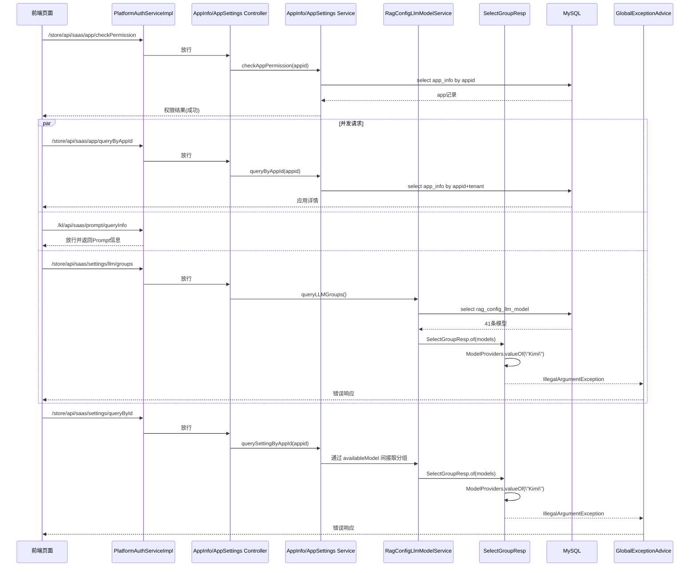

## 故事背景

> 在AI时代下如何就是对代码进行增加模块化功能。当前存在一大目前的痛点现象：不是写代码很难，也不是梳理业务需求的思路很难。难在就是如何将清晰的需求在之前代码实现上，对于即将要改动的代码是一个大致的理解，做了对应的修改之后。如何能串行流程。改动了部分功能之后，会出现一些奇怪的报错。但是通过人眼去查看。在高级编辑器中进行肉眼式搜索，会出现看了半天越看越晕。

对于上述奇怪的报错，通过肉眼的方式进行排查效率很低，所以需要借用魔法的力量，在Codex的帮助下，直接获得到了完整的调用链路。

## GLM4.7分析报错，解决问题使用CodeX

## 代码书写不顺先就是AI上实现功能，利用ai进行重构

##  使用AI的长上下文能力对于接口代码进行梳理调用链路，便于实现对于现有臃肿复杂代码功能迭代重构，查看模型梳理的代码逻辑美人鱼图还是会出现就是代码逻辑梳理不清晰，继续询问。

经过这个流程，我也发现一个规律，对于Java代码来说梳理业务逻辑其实比起关注get、set方法。更加应该关注一下if-else的逻辑。

## 代码看不清晰结合前端请求参数并配合自研https://www.strloom.com/网站进行

## AI写完代码真的需要用AI进行审核和验证，哪怕最强的模型也存在疏漏