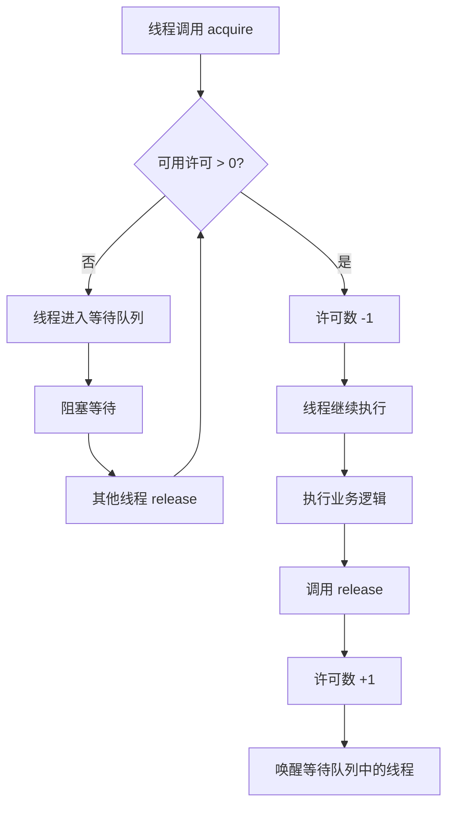

# 信号量（Semaphore）深度解析：从原理到实战

> 基于 TorchV 知识运营系统的并发控制实践

---

## 📋 目录

- [1. 什么是信号量？](#1-什么是信号量)
- [2. 信号量的核心原理](#2-信号量的核心原理)
- [3. 代码逐行解析](#3-代码逐行解析)
- [4. 为什么需要信号量？](#4-为什么需要信号量)
- [5. 信号量在其他语言的实现](#5-信号量在其他语言的实现)
- [6. 信号量 vs 其他并发工具](#6-信号量-vs-其他并发工具)
- [7. 优缺点分析](#7-优缺点分析)
- [8. 实战最佳实践](#8-实战最佳实践)

---

## 1. 什么是信号量？

### 1.1 定义

**信号量（Semaphore）** 是并发编程中用于**控制同时访问特定资源的线程数量**的同步工具。

### 1.2 形象类比

可以把信号量理解为**停车场的停车位管理**：

```
🏢 停车场场景
━━━━━━━━━━━━━━━━━━━━━━━━━━━━━━━━━
停车场总共有 10 个停车位（信号量 permits = 10）

🚗 车辆 A 进入 → semaphore.acquire()
   剩余车位: 9

🚗 车辆 B 进入 → semaphore.acquire()
   剩余车位: 8

...

🚗 车辆 X 进入 → semaphore.acquire()
   剩余车位: 0

🚗 车辆 Y 想要进入 → semaphore.acquire()
   ⚠️ 需要等待（阻塞），直到有车离开

🚗 车辆 A 离开 → semaphore.release()
   剩余车位: 1
   车辆 Y 可以进入了！
━━━━━━━━━━━━━━━━━━━━━━━━━━━━━━━━━
```


### 1.3 代码中相关示例

```java
// 创建一个允许 4 个线程同时执行的信号量
Semaphore semaphore = new Semaphore(4);

// 64 个分片任务，但同时最多只有 4 个在执行
for (int shard = 0; shard < 64; shard++) {
    semaphore.acquire();   // 🔑 获取"许可证"（如果已用完，则等待）
    asyncExecutor.execute(() -> {
        try {
            doWork();       // 实际工作
        } finally {
            semaphore.release(); // 🔓 归还"许可证"
        }
    });
}
```

**时间线可视化**：


```
时间轴 →
━━━━━━━━━━━━━━━━━━━━━━━━━━━━━━━━━━━━━━━━━━━━━━

任务1: ████████ (获取 → 执行 → 释放)
任务2:   ████████ (等待 → 获取 → 执行 → 释放)
任务3:     ████████
任务4:       ████████
任务5:         ████████
              ↑
          任务5 必须等待任务1释放信号量
━━━━━━━━━━━━━━━━━━━━━━━━━━━━━━━━━━━━━━━━━━━━━━
```

---

## 2. 信号量的核心原理

### 2.1 内部结构

```java
public class Semaphore {
    // 同步器（基于 AQS 实现）
    private final Sync sync;

    // 内部实现类
    abstract static class Sync extends AbstractQueuedSynchronizer {
        Sync(int permits) {
            setState(permits); // 设置初始许可数
        }
    }
}
```

### 2.2 核心方法

| 方法 | 作用 | 阻塞？ |
|-----|------|--------|
| `acquire()` | 获取 1 个许可 | ✅ 如果没有可用许可，会阻塞 |
| `acquire(n)` | 获取 n 个许可 | ✅ 如果没有足够许可，会阻塞 |
| `release()` | 释放 1 个许可 | ❌ 立即返回 |
| `release(n)` | 释放 n 个许可 | ❌ 立即返回 |
| `tryAcquire()` | 尝试获取 1 个许可 | ❌ 获取失败返回 false，不阻塞 |
| `availablePermits()` | 查询可用许可数 | ❌ 立即返回 |

### 2.3 工作流程图



---

## 3. 代码逐行解析

### 3.1 完整代码段

```java
// 1️⃣ 计算并发线程数
int concurrency = Math.max(1,
    ObjectUtil.defaultIfNull(backfill == null ? shardCount : backfill.getConcurrentThreads(), shardCount));
concurrency = Math.min(concurrency, shardCount);

// 2️⃣ 创建信号量（假设 concurrency = 4，shardCount = 64）
Semaphore semaphore = new Semaphore(4);

// 3️⃣ 提交所有分片任务
for (int shard = 0; shard < 64; shard++) {
    // 🔑 获取许可（核心步骤）
    semaphore.acquire(); // 如果已有 4 个线程在执行，这里会阻塞

    final int shardIndex = shard;

    // 🚀 异步执行分片扫描
    asyncExecutor.execute(() -> {
        try {
            scanShard(shardIndex); // 实际工作
        } finally {
            // 🔓 释放许可（必须执行）
            semaphore.release();
            latch.countDown();
        }
    });
}
```

### 3.2 执行时序图


### 3.3 关键点解析

#### **① 为什么 acquire() 在 for 循环内部？**

```java
for (int shard = 0; shard < 64; shard++) {
    semaphore.acquire(); // 👈 在这里控制提交速度
    asyncExecutor.execute(() -> { ... });
}
```

**原因**：防止一次性向线程池提交过多任务

❌ **错误做法**：
```java
// 一次性提交 64 个任务到线程池
for (int shard = 0; shard < 64; shard++) {
    asyncExecutor.execute(() -> {
        semaphore.acquire(); // 这里的控制太晚了
        // ... 任务已经在线程池队列中
    });
}
```

✅ **正确做法**：
```java
// 控制提交速度，同时只有 4 个任务在执行
for (int shard = 0; shard < 64; shard++) {
    semaphore.acquire(); // 先获取许可，再提交任务
    asyncExecutor.execute(() -> { ... });
}
```

#### **② 为什么 release() 在 finally 块中？**

```java
try {
    scanShard(shardIndex); // 可能抛出异常
} finally {
    semaphore.release();  // 👈 必须保证执行
}
```

**原因**：确保即使发生异常，许可也能被释放，否则会**死锁**！

❌ **没有 finally 的后果**：
```
线程1: acquire() → 执行中 → ❌ 抛出异常 → 💀 没有释放
  → 许可数永久 -1
  → 其他线程永远无法获取许可
  → 系统死锁！
```

---

## 4. 为什么需要信号量？

### 4.1 问题场景

假设你的系统需要：

- 处理 64 个数据分片（`shardCount = 64`）
- 每个分片需要**扫描 10 万条数据库记录**
- 数据库连接池最大连接数为 10

❌ **不使用信号量的后果**：

```java
// 错误代码：无限制并发
for (int shard = 0; shard < 64; shard++) {
    asyncExecutor.execute(() -> {
        scanShard(shard); // 64 个线程同时执行
    });
}

// 结果：
// 🔥 64 个线程同时访问数据库
// 🔥 数据库连接池耗尽
// 🔥 大量线程阻塞等待连接
// 🔥 系统性能急剧下降
```

✅ **使用信号量**：

```java
Semaphore semaphore = new Semaphore(4); // 最多 4 个线程并发

for (int shard = 0; shard < 64; shard++) {
    semaphore.acquire(); // 控制并发数
    asyncExecutor.execute(() -> {
        try {
            scanShard(shard);
        } finally {
            semaphore.release();
        }
    });
}

// 结果：
// ✅ 同时最多 4 个线程访问数据库
// ✅ 数据库连接池压力可控
// ✅ 系统稳定运行
```

### 4.2 性能对比

| 指标 | 无信号量（64并发） | 有信号量（4并发） |
|-----|------------------|-----------------|
| **数据库连接峰值** | 64 个（超限） | 4 个（正常） |
| **CPU 利用率** | 90%+（上下文切换频繁） | 60%（稳定） |
| **内存占用** | 高（64个线程栈） | 低（4个线程栈） |
| **总执行时间** | 120 秒（连接等待） | 180 秒（无等待） |
| **系统稳定性** | ❌ 频繁超时 | ✅ 稳定 |

---

## 5. 信号量在其他语言的实现

### 5.1 对比表

| 语言 | 信号量实现 | 用法示例 | 相似度 |
|-----|----------|---------|--------|
| **Java** | `java.util.concurrent.Semaphore` | `semaphore.acquire()` | ⭐⭐⭐⭐⭐ |
| **Python** | `threading.Semaphore` | `with semaphore:` | ⭐⭐⭐⭐ |
| **Go** | `golang.org/x/sync/semaphore` | `s.Acquire(ctx, 1)` | ⭐⭐⭐⭐ |
| **C++** | `std::counting_semaphore` (C++20) | `sem.acquire()` | ⭐⭐⭐⭐ |
| **JavaScript** | `async-sema` 库 | `await sem.acquire()` | ⭐⭐⭐ |
| **Rust** | `tokio::sync::Semaphore` | `semaphore.acquire().await` | ⭐⭐⭐⭐ |
| **Python** | `multiprocessing.Semaphore` | `sem.acquire()` | ⭐⭐⭐⭐ |

### 5.2 Python 实现

```python
import threading
import time

# 创建信号量（最多 4 个线程）
semaphore = threading.Semaphore(4)

def worker(worker_id):
    with semaphore:  # 自动获取和释放
        print(f"Worker {worker_id} 开始工作")
        time.sleep(2)
        print(f"Worker {worker_id} 完成工作")

# 启动 10 个线程
for i in range(10):
    t = threading.Thread(target=worker, args=(i,))
    t.start()
```

### 5.3 Go 实现

```go
package main

import (
    "context"
    "fmt"
    "sync"
    "time"

    "golang.org/x/sync/semaphore"
)

func main() {
    // 创建信号量（最多 4 个协程）
    sem := semaphore.NewWeighted(4)
    var wg sync.WaitGroup

    for i := 0; i < 10; i++ {
        wg.Add(1)
        go func(workerID int) {
            defer wg.Done()

            // 获取许可
            sem.Acquire(context.Background(), 1)
            defer sem.Release(1) // 释放许可

            fmt.Printf("Worker %d 开始工作\n", workerID)
            time.Sleep(2 * time.Second)
            fmt.Printf("Worker %d 完成工作\n", workerID)
        }(i)
    }

    wg.Wait()
}
```

### 5.4 C++ (C++20) 实现

```cpp
#include <iostream>
#include <thread>
#include <vector>
#include <semaphore>

using namespace std;

int main() {
    // 创建信号量（最多 4 个线程）
    counting_semaphore<4> sem(4);

    vector<thread> workers;
    for (int i = 0; i < 10; i++) {
        workers.emplace_back([&, i] {
            sem.acquire(); // 获取许可
            cout << "Worker " << i << " 开始工作" << endl;
            this_thread::sleep_for(2s);
            cout << "Worker " << i << " 完成工作" << endl;
            sem.release(); // 释放许可
        });
    }

    for (auto& t : workers) {
        t.join();
    }
}
```

---

## 6. 信号量 vs 其他并发工具

### 6.1 对比表格

| 工具 | 用途 | 许可数 | 是否可重入 | 典型场景 |
|-----|------|--------|----------|---------|
| **Semaphore** | 控制并发数 | ≥1 | ✅ | 限制数据库连接数 |
| **Mutex** | 互斥访问 | 1 | ❌ | 保护共享变量 |
| **CountDownLatch** | 等待多个线程完成 | 1次 | ❌ | 并行任务汇总 |
| **CyclicBarrier** | 线程间同步 | 多次 | ❌ | 阶段性并行计算 |
| **ReadWriteLock** | 读写分离 | 多读单写 | ❌ | 缓存系统 |

### 6.2 代码对比

#### **Semaphore（控制并发数）**

```java
Semaphore semaphore = new Semaphore(4); // 最多 4 个线程

for (int i = 0; i < 100; i++) {
    semaphore.acquire();
    executor.execute(() -> {
        try {
            accessDatabase();
        } finally {
            semaphore.release();
        }
    });
}
```

#### **Mutex（互斥锁）**

```java
Lock lock = new ReentrantLock(); // 只允许 1 个线程

for (int i = 0; i < 100; i++) {
    executor.execute(() -> {
        lock.lock();
        try {
            updateCounter(); // 保护共享变量
        } finally {
            lock.unlock();
        }
    });
}
```

#### **CountDownLatch（等待全部完成）**

```java
CountDownLatch latch = new CountDownLatch(10); // 等待 10 个任务

for (int i = 0; i < 10; i++) {
    executor.execute(() -> {
        try {
            doWork();
        } finally {
            latch.countDown(); // 完成一个
        }
    });
}

latch.await(); // 等待全部完成
println("所有任务完成");
```

---

## 7. 优缺点分析

### 7.1 优点 ✅

#### **1. 灵活的并发控制**

```java
// 可以动态调整并发数
Semaphore semaphore = new Semaphore(initialPermits);

// 运行时增加许可
semaphore.release(5); // 增加 5 个许可

// 运行时减少许可
semaphore.acquire(5); // 减少 5 个许可
```

#### **2. 支持公平性选择**

```java
// 非公平模式（默认，性能更好）
Semaphore unfairSemaphore = new Semaphore(4, false);

// 公平模式（先到先得，避免饥饿）
Semaphore fairSemaphore = new Semaphore(4, true);
```

#### **3. 可中断的等待**

```java
try {
    semaphore.acquire(); // 可被中断
} catch (InterruptedException e) {
    Thread.currentThread().interrupt(); // 恢复中断状态
    // 优雅退出
}
```

#### **4. 支持超时**

```java
// 尝试获取许可，最多等待 3 秒
if (semaphore.tryAcquire(3, TimeUnit.SECONDS)) {
    // 成功获取
    try {
        doWork();
    } finally {
        semaphore.release();
    }
} else {
    // 超时，放弃执行
    logger.warn("获取许可超时");
}
```

### 7.2 缺点 ❌

#### **1. 容易忘记释放（死锁风险）**

```java
// ❌ 危险代码
semaphore.acquire();
doWork(); // 如果这里抛异常，许可永远不会释放
semaphore.release();

// ✅ 正确做法
semaphore.acquire();
try {
    doWork();
} finally {
    semaphore.release(); // 必须在 finally 中
}
```

#### **2. 占用线程资源**

```java
// acquire() 会阻塞当前线程
semaphore.acquire(); // 线程在这里阻塞，无法做其他事
```

**解决方案**：使用 `tryAcquire()` + 轮询

```java
// 不阻塞的版本
while (!semaphore.tryAcquire()) {
    Thread.sleep(100); // 短暂休眠后重试
    // 可以在这里做其他事情
}
```

#### **3. 过度使用会降低并发性能**

```java
// ❌ 并发数设置过低
Semaphore semaphore = new Semaphore(1);
// 相当于串行执行，失去了多线程的优势

// ✅ 合理设置并发数
Semaphore semaphore = new Semaphore(
    Math.min(Runtime.getRuntime().availableProcessors() * 2, 64)
);
```

---

## 8. 实战最佳实践

### 8.1 确定合适的并发数

```java
// 1️⃣ CPU 密集型任务
int concurrency = Runtime.getRuntime().availableProcessors();

// 2️⃣ IO 密集型任务
int concurrency = Runtime.getRuntime().availableProcessors() * 2;

// 3️⃣ 数据库连接受限任务
int concurrency = Math.min(
    Runtime.getRuntime().availableProcessors() * 2,
    dataSource.getMaxPoolSize() - 2  // 预留 2 个连接
);

// 4️⃣ 配置化（最佳）
@Value("${knowledge-ops.backfill.concurrent-threads:4}")
private int configuredConcurrency;
```

### 8.2 优雅的异常处理

```java
Semaphore semaphore = new Semaphore(4);

for (int shard = 0; shard < shardCount; shard++) {
    try {
        semaphore.acquire();
    } catch (InterruptedException e) {
        // 1️⃣ 恢复中断状态
        Thread.currentThread().interrupt();

        // 2️⃣ 记录日志
        log.warn("获取信号量被中断, shard={}", shard);

        // 3️⃣ 退出循环
        break;
    }

    executor.execute(() -> {
        try {
            doWork();
        } catch (Exception e) {
            // 业务异常不应影响信号量释放
            log.error("任务执行失败", e);
        } finally {
            // 无论如何都要释放
            semaphore.release();
        }
    });
}
```

### 8.3 与 CountDownLatch 配合使用

```java
Semaphore semaphore = new Semaphore(4);      // 控制并发数
CountDownLatch latch = new CountDownLatch(64); // 等待所有任务完成

for (int shard = 0; shard < 64; shard++) {
    semaphore.acquire();
    executor.execute(() -> {
        try {
            doWork(shard);
        } finally {
            semaphore.release();   // 释放许可，让其他任务可以执行
            latch.countDown();     // 计数器减1
        }
    });
}

// 等待所有任务完成
latch.await();
log.info("所有任务执行完毕");
```

### 8.4 避免死锁的正确姿势

#### **❌ 错误示例：嵌套 acquire**

```java
Semaphore sem1 = new Semaphore(1);
Semaphore sem2 = new Semaphore(1);

// 线程1
sem1.acquire();
sem2.acquire(); // 死锁风险

// 线程2
sem2.acquire();
sem1.acquire(); // 死锁风险
```

#### **✅ 正确示例：固定顺序获取**

```java
// 所有线程都按相同顺序获取
sem1.acquire();
sem2.acquire();

try {
    doWork();
} finally {
    sem2.release();
    sem1.release();
}
```

---

## 9. 总结

### 9.1 核心要点

| 要点 | 说明 |
|-----|------|
| **本质** | 并发控制工具，限制同时访问资源的线程数 |
| **原理** | 计数器 + 等待队列 |
| **关键方法** | `acquire()` 获取许可，`release()` 释放许可 |
| **必须记住** | `release()` 必须在 `finally` 块中 |
| **适用场景** | 限制数据库连接、API 调用、文件访问等 |
| **不是 Java 特有** | 所有主流语言都有类似实现 |

### 9.2 使用决策树

```
需要控制并发数？
├─ 是 → 使用 Semaphore ✅
│
├─ 否 → 需要互斥访问？
│   ├─ 是 → 使用 ReentrantLock
│   └─ 否 → 需要等待多个线程？
│       ├─ 是 → 使用 CountDownLatch
│       └─ 否 → 不需要特殊工具
```

### 9.3 你的代码中的最佳实践总结

```java
// ✅ 做得好的地方
1. 使用信号量控制并发数（避免资源耗尽）
2. acquire() 在提交任务前（控制提交速度）
3. release() 在 finally 块中（确保释放）
4. 使用 CountDownLatch 等待所有任务完成（同步机制）
5. 配置化的并发数（灵活调整）

// ⚠️ 可以优化的地方
1. 考虑使用 tryAcquire(timeout) 避免长时间阻塞
2. 添加监控指标（信号量等待时间、队列长度等）
3. 考虑使用虚拟线程（Java 21+）提高并发效率
```

---

## 📚 参考资料

- [Java Semaphore 官方文档](https://docs.oracle.com/javase/8/docs/api/java/util/concurrent/Semaphore.html)
- [《Java并发编程实战》第5.5章](https://book.douban.com/subject/10484692/)
- [Python threading.Semaphore](https://docs.python.org/3/library/threading.html#semaphore-objects)
- [Go semaphore package](https://pkg.go.dev/golang.org/x/sync/semaphore)

---

> 💡 **最后建议**：信号量是并发编程的基础工具，掌握它对你的职业发展非常有帮助！建议你在理解原理后，在实际项目中多实践，加深理解。
