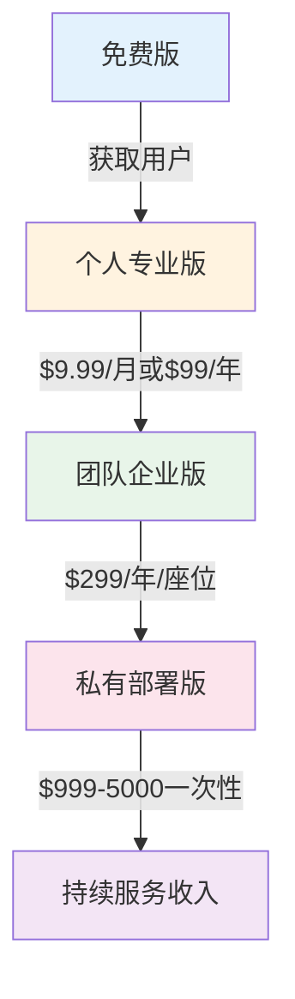
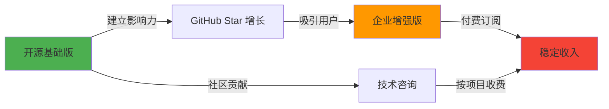
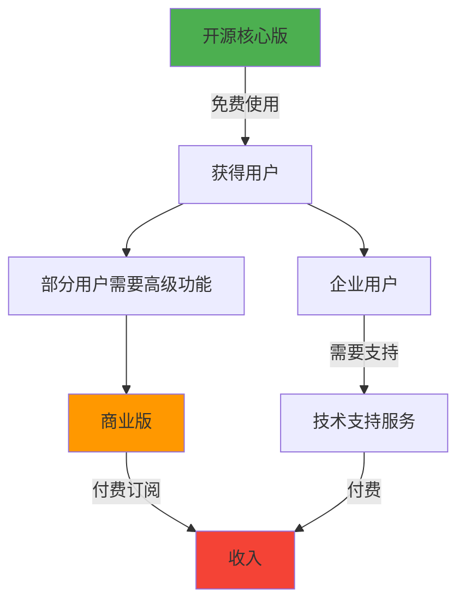
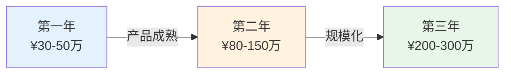

<PasswordProtect>

# 技术博客项目的营利分析：纳瓦尔思维实战

> "你不会通过出租时间致富。你必须拥有股权——拥有一部分业务，才能获得财务自由。" —— 纳瓦尔·拉维坎特

## 前言

当我们用纳瓦尔·拉维坎特的思维方式审视一个技术博客项目时，我们看到的不仅仅是一个内容平台，而是一个可以产生多重杠杆效应的资产组合。本文将从专长、杠杆、判断力三个维度，系统分析如何将技术能力转化为可持续的财富来源。

## 🎯 核心资产分析

### 已拥有的"特定知识"（Specific Knowledge）

#### 1. 技术专长

- **Java + AI 双技能栈**：掌握传统后端开发与前沿 AI 技术（RAG）的结合
- **IDEA 插件开发**：已通过 PandaCoder 验证的产品化能力
- **系统架构与性能优化**：从单体到微服务的完整实践经验
- **Spring Boot 生态**：深度理解企业级 Java 开发框架

**纳瓦尔视角**：这些不是通过一门课程就能学会的知识，而是通过真实项目打磨出来的"难以自动化"的专长。

#### 2. 内容资产

已经建立的系统化知识库：
- **算法与数据结构**：从基础到进阶的完整路径
- **系统架构实战**：包含案例、性能优化、安全设计
- **Elasticsearch 深度教程**：从基础到实战的系列文章
- **纳瓦尔思维体系**：对财富自由哲学的深刻理解

**影响力平台**：
- 阿里云博客专家
- 多技术平台活跃（CSDN、掘金、知乎等9个平台）
- 已建立个人品牌基础

#### 3. 产品能力

实际产出的代码资产：
- **PandaCoder 插件**：AI 驱动的 IDEA 编程助手
- **Spring Boot Starter 系列**：可复用的企业级组件
- **实用工具**：如头像生成器等小工具

**关键洞察**：这些产品已经证明了你具备"从想法到实现"的完整能力链条。

## 💰 七大营利路径详解

### 🚀 路径 1：代码杠杆 — 产品化你的专长（最高优先级）

> "代码和媒体是无需许可的杠杆。它们是新富阶层背后的杠杆。你可以创建软件和媒体，在你睡觉时为你工作。" —— 纳瓦尔·拉维坎特

#### 1.1 PandaCoder 插件的商业化升级

**现状分析**：
- 已有基础版本并在插件市场发布
- 具备技术可行性验证
- 缺少清晰的商业模式

**三层定价策略**：



**功能分层设计**：

| 版本 | 免费版 | 专业版 | 企业版 | 私有部署版 |
|-----|--------|--------|--------|-----------|
| **代码补全** | ✅ 基础 | ✅ 高级 | ✅ 高级 | ✅ 高级 |
| **注释生成** | ✅ 简单 | ✅ 智能 | ✅ 智能 | ✅ 智能 |
| **代码审查** | ❌ | ✅ | ✅ | ✅ |
| **测试生成** | ❌ | ✅ | ✅ | ✅ |
| **性能优化建议** | ❌ | ✅ | ✅ | ✅ |
| **自定义规则** | ❌ | ❌ | ✅ | ✅ |
| **团队协作** | ❌ | ❌ | ✅ | ✅ |
| **私有知识库** | ❌ | ❌ | ✅ | ✅ |
| **数据安全** | 云端 | 云端 | 云端加密 | 本地部署 |
| **API 调用** | 100次/天 | 1000次/天 | 无限 | 无限 |
| **技术支持** | 社区 | 邮件 | 专属 | SLA保障 |

**收益预估模型**：

假设场景：
- **个人用户**：1000 个付费用户 × $99/年 = **$99,000/年**
- **企业客户**：10 家企业 × 5 座位 × $299/年 = **$14,950/年**
- **私有部署**：5 家大客户 × $3000 = **$15,000/年**
- **第一年总收入预估**：**$128,950**（约 ¥90万）

**实施路线图**：

```plaintext
第1-2个月：开发付费版功能
    ↓
第3个月：集成支付系统（Stripe/支付宝）
    ↓
第4个月：发布 + Product Hunt 推广
    ↓
第5-6个月：迭代优化 + 用户反馈
    ↓
第7-12个月：企业版营销 + 规模化
```

#### 1.2 开发 RAG 相关的 SaaS 工具

**市场机会分析**：

你在 TorchV 积累的 RAG 经验是一座金矿！当前 RAG 应用正处于爆发期，但市场上缺少易用的产品化解决方案。

**三个产品方向**：

**方向 1：企业知识库 AI 助手**

**目标客户**：中小企业（50-500人）
**痛点**：
- 内部文档分散，查找困难
- 新员工培训成本高
- 客服团队需要标准化答案

**产品功能**：
```
文档上传（支持PDF、Word、Markdown）
    ↓
自动向量化 + 知识库构建
    ↓
智能问答接口（API + Web界面）
    ↓
权限管理 + 使用统计
```

**定价策略**：
- **基础版**：$199/月（支持 10,000 文档，10 个用户）
- **专业版**：$499/月（支持 50,000 文档，50 个用户）
- **企业版**：$999/月（无限文档，无限用户，私有部署选项）

**收益预估**：
- 第一年获取 20 个付费客户
- 平均客单价 $400/月
- 年收入：$96,000

**方向 2：开发者文档智能问答系统**

**目标客户**：开源项目、技术团队、SaaS 公司
**差异化优势**：
- 10 分钟快速集成
- 支持多语言文档
- 提供嵌入式 Widget

**定价策略**：
- **开源项目**：免费（建立影响力）
- **商业项目**：$49-299/月（按查询量阶梯定价）

**方向 3：代码库智能检索工具**

**目标客户**：技术团队、外包公司
**核心价值**：基于语义理解的代码搜索，而非简单的关键词匹配

**定价**：$99-499/月

**RAG SaaS 的长期价值**：
- 订阅制带来稳定现金流
- 客户粘性高（迁移成本大）
- 可以积累行业数据资产
- 潜在被收购价值（ARR 的 5-10 倍）

#### 1.3 Spring Boot Starter 商业化

**开源 + 商业双轨模式**：



**企业增强版功能**：
- 高级监控和告警
- 性能优化模块
- 安全加固组件
- 优先技术支持
- 定制化开发服务

**定价模型**：
- **单个 Starter 订阅**：$199/年
- **完整套件**：$999/年
- **定制化服务**：$2,000-10,000/项目

### 📝 路径 2：媒体杠杆 — 规模化内容变现

> "媒体杠杆的边际成本为零，可以无限复制传播。" —— 纳瓦尔·拉维坎特

#### 2.1 付费专栏/课程体系

你已经积累了大量高质量内容，现在是时候系统化打包变现了。

**产品矩阵设计**：

**产品 1：《Java 架构师实战手册》电子书**

**内容规划**：
```
第一部分：系统架构设计
- 微服务架构实战
- 分布式系统设计
- 高并发系统架构

第二部分：性能优化实战
- JVM 调优实战
- 数据库优化策略
- API 性能优化

第三部分：安全架构设计
- 认证鉴权体系
- 数据加密实践
- 安全审计系统

第四部分：真实案例分析
- 电商系统架构
- 支付系统设计
- 社交平台架构
```

**发布策略**：
- **平台选择**：掘金小册、GitBook、Gumroad
- **定价**：¥149（早鸟价 ¥99）
- **推广渠道**：个人博客、公众号、各技术社区
- **目标销量**：第一年 500 份

**收益预估**：500份 × ¥149 = **¥74,500**

**产品 2：《RAG 应用开发实战课》视频课程**

**为什么选择这个主题？**
- RAG 是当前 AI 应用的核心技术
- 市场上缺少系统化的中文教程
- 你有真实项目经验
- 需求量大，付费意愿强

**课程大纲**：
```
模块一：RAG 基础理论（4课时）
- RAG 的工作原理
- 向量数据库选型
- Embedding 模型对比
- 检索策略详解

模块二：实战项目开发（8课时）
- 项目架构设计
- 文档处理流程
- 检索系统实现
- LLM 集成方案

模块三：性能优化（4课时）
- 检索性能优化
- 成本控制策略
- 缓存设计
- 并发处理

模块四：生产部署（4课时）
- 容器化部署
- 监控告警
- 安全加固
- 扩展性设计

模块五：真实案例（4课时）
- 企业知识库
- 智能客服
- 代码助手
- 文档问答
```

**定价策略**：
- **早鸟价**：¥299（前 100 名）
- **正价**：¥499
- **企业团购**：¥399/人（10人起）

**平台选择**：
- **国内**：极客时间、慕课网
- **国际**：Udemy（英文版，定价 $99-199）

**收益预估**：
- 国内 200 人 × ¥499 = ¥99,800
- 国际 50 人 × $149 = $7,450
- **总计**：约 ¥150,000

**产品 3：《IDEA 插件开发实战》**

利用 PandaCoder 的开发经验，这是一个稀缺主题。

**课程特色**：
- 从零开发一个完整插件
- 包含 AI 集成实战
- 商业化思路分享
- 持续更新

**定价**：¥299-399
**目标销量**：300 人
**收益**：约 ¥100,000

**内容变现总收益预估**：¥324,500（第一年）

#### 2.2 知识星球/付费社群

**产品定位**："Java + AI 技术精英圈"

**为什么做社群？**
- 建立长期稳定的现金流
- 深度连接用户，提高粘性
- 获得真实的用户反馈和需求
- 孵化潜在合作机会

**社群提供的价值**：

**每周价值输出**：
- 周一：技术周报（精选行业动态）
- 周三：技术深度文章（独家内容）
- 周五：答疑直播（1小时）

**专属权益**：
- ✅ 所有付费课程 8 折优惠
- ✅ PandaCoder 专业版免费使用
- ✅ 独家技术资料包
- ✅ 优先获得内推机会
- ✅ 技术问题一对一答疑（限额）
- ✅ 项目合作优先权

**定价策略**：
- **年费**：¥399
- **终身会员**：¥999（限额 100 名）

**增长目标**：
- 第一季度：50 人
- 第二季度：150 人
- 第三季度：300 人
- 第四季度：500 人

**第一年收益预估**：
- 平均 300 人 × ¥399 = **¥119,700**

**运营策略**：
- 保持高质量内容输出
- 活跃社群氛围
- 定期线下聚会（大城市）
- 邀请嘉宾分享

#### 2.3 技术咨询服务

**服务类型与定价**：

**1. 技术咨询（按小时）**
- **标准咨询**：¥1,500/小时
  - 技术选型建议
  - 架构设计评审
  - 性能问题诊断
  
- **深度咨询**：¥3,000/小时
  - 系统架构设计
  - 技术难题攻坚
  - AI 应用方案设计

**2. 架构评审（按项目）**
- **小型项目**：¥10,000-20,000
  - 1-2 天现场评审
  - 详细评审报告
  - 优化建议文档

- **大型项目**：¥30,000-50,000
  - 3-5 天深度评审
  - 架构重构方案
  - 持续跟进服务

**3. 技术顾问（按月）**
- **兼职顾问**：¥5,000-10,000/月
  - 每周 1-2 次线上会议
  - 随时技术咨询
  - 重要决策建议

- **高级顾问**：¥15,000-30,000/月
  - 深度参与项目
  - 定期现场指导
  - 关键代码评审

**获取客户的渠道**：
1. 个人品牌引流（博客、社交媒体）
2. 技术社群推荐
3. 演讲后的商务洽谈
4. 老客户转介绍

**第一年收益预估**：
- 10 次小时咨询 × ¥2,000 = ¥20,000
- 3 个架构评审项目 × ¥20,000 = ¥60,000
- 2 个长期顾问合同 × ¥8,000 × 6个月 = ¥96,000
- **总计**：约 ¥176,000

### 🤝 路径 3：人力杠杆 — 接包与团队协作

#### 3.1 技术服务工作室模式

**业务类型**：

**类型 1：RAG 应用定制开发**
- **客户需求**：企业想要自己的智能问答系统
- **服务内容**：
  - 需求分析和方案设计
  - 系统开发和部署
  - 数据迁移和训练
  - 使用培训和文档
- **项目周期**：1-3 个月
- **报价范围**：¥50,000-200,000/项目
- **利润率**：40-60%

**类型 2：IDEA 插件定制开发**
- **客户需求**：企业内部开发工具
- **典型场景**：
  - 代码规范检查插件
  - 企业框架集成工具
  - 内部 API 智能提示
- **报价范围**：¥20,000-100,000/项目
- **开发周期**：2-8 周

**类型 3：系统架构设计与重构**
- **客户需求**：老系统升级、性能优化、微服务改造
- **服务内容**：
  - 现状评估
  - 架构设计
  - 核心代码实现
  - 团队培训
- **报价范围**：¥30,000-150,000/项目

**团队模式**：

初期（1-6个月）：
```
你（技术负责人 + 核心开发）
    ↓
外包 1-2 名开发者（按项目付费）
    ↓
利润率：50-60%
```

成长期（6-12个月）：
```
你（技术负责人 + 商务拓展）
    ↓
1-2 名全职开发者
    ↓
1 名项目经理/商务
    ↓
利润率：30-40%
```

**第一年收益预估**：
- 4 个 RAG 项目 × ¥80,000 = ¥320,000
- 3 个插件项目 × ¥40,000 = ¥120,000
- 2 个架构项目 × ¥60,000 = ¥120,000
- **总收入**：¥560,000
- **净利润**（按 50%）：**¥280,000**

#### 3.2 技术合伙人模式

**适合的情况**：
- 遇到有潜力的创业项目
- 创始人有商业能力但缺技术
- 你认可项目方向和团队

**合作模式**：
- **股权占比**：20-40%（根据投入决定）
- **时间投入**：兼职或全职
- **收益模式**：公司分红或退出收益

**风险控制**：
- 签订明确的合伙协议
- 约定退出机制
- 保留自己的主业
- 选择 1-2 个项目，不要贪多

**长期价值**：
- 如果项目成功，回报可能是打工的 10-100 倍
- 积累创业经验
- 扩展人脉资源

### 💼 路径 4：品牌杠杆 — 影响力变现

#### 4.1 技术演讲与企业培训

**演讲机会获取**：

**投递议题到技术大会**：
- **QCon**：全球软件开发大会
- **ArchSummit**：架构师峰会
- **GTC**：全球技术领导力峰会
- **AI 大会**：各类 AI 技术峰会
- **云厂商大会**：阿里云、腾讯云、华为云

**议题方向建议**：
- "RAG 在企业知识管理中的实践"
- "如何开发一个成功的 IDEA 插件"
- "Java + AI：传统开发者的新机遇"
- "从零到一打造 SaaS 产品的技术实战"

**演讲收益**：
- **中型会议**：¥5,000-10,000/场
- **大型会议**：¥10,000-20,000/场
- **闭门分享**：¥20,000-50,000/场

**额外价值**：
- 建立行业影响力
- 获得客户线索
- 扩展人脉圈
- 为课程/书籍引流

**企业内训**：

**培训主题**：
- Java 高级开发实战
- 微服务架构设计
- AI 应用开发入门
- 性能优化实战

**定价策略**：
- **半天培训**：¥10,000-20,000
- **全天培训**：¥20,000-40,000
- **多天培训**：¥15,000-30,000/天

**获客渠道**：
- 企业主动邀请
- 培训机构合作
- 咨询项目延伸
- 社群用户企业

**第一年收益预估**：
- 4 场技术大会演讲 × ¥10,000 = ¥40,000
- 6 次企业内训 × ¥25,000 = ¥150,000
- **总计**：约 ¥190,000

#### 4.2 自媒体矩阵优化

**当前状态分析**：
- ✅ 已布局多个平台（9个）
- ✅ 有一定粉丝基础
- ❌ 缺少视频内容
- ❌ 没有充分利用平台变现功能

**优化策略**：

**1. 视频化转型**

**平台布局**：
```
YouTube
├── 技术教程系列（英文，国际化）
├── RAG 应用实战
├── IDEA 插件开发
└── 编程思维分享

B站
├── 技术深度教程（中文）
├── 项目实战记录
├── 技术书籍解读
└── 职业发展建议

抖音/视频号
├── 60秒技术技巧
├── 编程思维短视频
├── 职场干货分享
└── 引流到长视频和社群
```

**内容策略**：
- 一个核心内容，多平台分发
- 文字 → 视频 → 音频（播客）
- 每周 2-3 个视频产出
- 保持高质量，不盲目追求数量

**2. 变现优化**

**公众号广告**：
- **门槛**：5000+ 粉丝
- **报价**：¥5,000-20,000/条（取决于阅读量）
- **目标**：第一年达到 5000 粉丝，接 2-3 条广告

**YouTube 广告分成**：
- **门槛**：1000 订阅 + 4000 小时观看
- **收益**：CPM $2-10（取决于地区和主题）
- **潜力**：技术类视频 CPM 较高

**B站创作激励**：
- 视频播放量奖励
- 充电功能
- 付费视频

**平台合作**：
- 成为平台认证作者
- 获得流量扶持
- 商业合作机会

**第一年收益预估**：
- 公众号广告：2条 × ¥8,000 = ¥16,000
- YouTube 收益：约 $1,000（¥7,000）
- B站收益：约 ¥5,000
- **总计**：约 ¥28,000

### 🎓 路径 5：知识付费平台深度合作

#### 5.1 极客时间专栏合作

**为什么选择极客时间？**
- 技术人群精准
- 平台信誉好
- 推广资源强
- 分成比例合理（50-70%）

**专栏选题建议**：

**选题 1：《RAG 应用开发实战》**
- **市场需求**：⭐⭐⭐⭐⭐
- **竞争程度**：⭐⭐
- **你的优势**：真实项目经验

**选题 2：《Java 程序员的 AI 进阶之路》**
- **市场需求**：⭐⭐⭐⭐
- **竞争程度**：⭐⭐⭐
- **你的优势**：Java + AI 双栈

**定价建议**：
- 专栏定价：¥99-199
- 预期销量：1000-3000 份
- 你的收益：¥60,000-300,000

**合作流程**：
1. 提交选题大纲
2. 平台评审
3. 签订合作协议
4. 内容创作（3-6个月）
5. 平台推广发布

#### 5.2 Udemy 国际市场

**为什么做国际市场？**
- RAG、IDEA Plugin Development 在国外需求大
- 英文内容竞争相对较小
- 美元收益
- 长期被动收入

**课程规划**：

**Course 1: "RAG Application Development with Java"**
- **定价**：$99-149
- **目标销量**：200-500 份
- **收益**：$20,000-60,000

**Course 2: "Build Your Own IntelliJ IDEA Plugin"**
- **定价**：$79-129
- **目标销量**：100-300 份
- **收益**：$8,000-30,000

**Udemy 特点**：
- 平台会经常打折（最低到 $9.99）
- 但销量会大幅提升
- 长尾效应明显（持续多年有收入）
- 分成比例：50%（平台推广）或 97%（自己推广）

**第一年收益预估**：
- 极客时间专栏：¥100,000
- Udemy 课程：$20,000（约 ¥140,000）
- **总计**：约 ¥240,000

### 💎 路径 6：开源到商业化路径

#### 6.1 GitHub Sponsors + Open Core 模式

**什么是 Open Core？**



**应用到你的项目**：

**PandaCoder 开源策略**：
```
开源基础版
├── 基础代码补全
├── 简单注释生成
└── 社区支持

商业增强版
├── 高级 AI 模型
├── 团队协作功能
├── 私有部署选项
└── 企业级支持
```

**预期效果**：
- GitHub Star 增长 → 建立影响力
- 社区贡献 → 产品迭代加速
- 企业关注 → 商业化机会
- 开发者认可 → 品牌价值

**GitHub Sponsors 策略**：

**赞助层级设计**：
- **$5/月**：支持者徽章
- **$25/月**：名字出现在 README
- **$100/月**：优先功能请求
- **$500/月**：一对一技术咨询（1小时/月）
- **$2000/月**：企业赞助（Logo展示）

**预期收益**：
- 500 Star 项目：5-10 个赞助者
- 2000 Star 项目：20-50 个赞助者
- 5000+ Star 项目：50-100+ 个赞助者

**第一年目标**：
- PandaCoder 达到 1000 Star
- 获得 15 个赞助者
- 平均赞助 $30/月
- 年收益：$5,400（约 ¥38,000）

#### 6.2 Spring Boot Starters 生态建设

**策略**：
1. **开源核心组件** → 建立影响力
2. **提供企业级增强** → 商业化
3. **建立生态** → 长期价值

**商业模式**：
- 基础版：开源免费
- 企业版：年费订阅
- 定制服务：按项目收费
- 培训服务：按天收费

### 🏆 路径 7：长期资本路径

#### 7.1 投资组合策略

**收入分配原则**：

```
总收入
├── 50% 再投资（扩大业务）
├── 30% 资本投资（股票/基金）
├── 10% 应急储备
└── 10% 个人消费
```

**股票/基金投资**：

**策略 1：指数基金定投**
- **标的**：沪深300、标普500、纳斯达克100
- **投入**：每月固定金额
- **目标**：年化收益 8-12%

**策略 2：科技股投资**
- **方向**：AI、云计算、SaaS
- **策略**：利用技术判断力选股
- **比例**：不超过投资组合的 30%

**策略 3：美元资产配置**
- **目的**：分散风险、全球化投资
- **方式**：通过 Udemy、GitHub Sponsors 等获得美元收入直接投资

#### 7.2 天使投资

**前提条件**：
- 有了一定资本积累（50万+）
- 对技术趋势有判断力
- 有行业人脉资源

**投资方向**：
- AI 应用工具
- 开发者工具
- SaaS 产品
- 技术教育

**投资策略**：
- 单个项目投入：5-20万
- 投资 3-5 个项目
- 提供技术顾问价值（不只是钱）
- 长期持有（3-5年）

**预期回报**：
- 大部分项目失败
- 1-2 个成功项目回报 10-100 倍
- 总体 IRR 目标：20%+

#### 7.3 数字资产投资

**域名投资**：
- 优质技术相关域名
- AI 相关域名
- 持有升值

**流量站点收购**：
- 技术博客
- 工具网站
- 低买高卖或长期持有收益

## 📊 综合收益预测

### 第一年收益预测（保守 vs 乐观）

| 收入来源 | 保守预估（¥） | 乐观预估（¥） | 时间投入 |
|---------|------------|------------|---------|
| **PandaCoder 订阅** | 50,000 | 200,000 | 30% |
| **RAG SaaS** | 0 | 100,000 | 20% |
| **课程/电子书** | 80,000 | 300,000 | 20% |
| **知识星球** | 40,000 | 100,000 | 10% |
| **技术咨询** | 30,000 | 150,000 | 5% |
| **接包项目** | 50,000 | 200,000 | 10% |
| **演讲/培训** | 20,000 | 100,000 | 3% |
| **平台合作** | 10,000 | 50,000 | 2% |
| **GitHub Sponsors** | 5,000 | 20,000 | - |
| **广告/赞助** | 5,000 | 30,000 | - |
| **总计** | **290,000** | **1,250,000** | 100% |

### 三年发展预测



**第一年（2025）**：
- **重点**：产品打磨、内容输出、品牌建设
- **收入**：¥30-50万
- **工作模式**：兼职（保留主业）

**第二年（2026）**：
- **重点**：产品规模化、社群运营、商业拓展
- **收入**：¥80-150万
- **工作模式**：考虑全职创业

**第三年（2027）**：
- **重点**：团队化运作、多产品线、投资布局
- **收入**：¥200-300万
- **工作模式**：创始人角色

## 🎯 90天启动计划（行动方案）

### 第一个月：产品化与内容准备（Day 1-30）

**Week 1-2：PandaCoder 商业化准备**

**Day 1-3：市场调研**
- [ ] 分析竞品（GitHub Copilot、Cursor、Tabnine）
- [ ] 调研用户付费意愿
- [ ] 确定差异化定位

**Day 4-7：功能规划**
- [ ] 设计免费版 vs 付费版功能矩阵
- [ ] 绘制技术架构图
- [ ] 评估开发工作量

**Day 8-14：支付系统调研**
- [ ] 调研支付方案（Stripe、Paddle、支付宝）
- [ ] 设计订阅系统架构
- [ ] 准备定价页面文案

**Week 3-4：内容资产整理**

**Day 15-18：电子书大纲**
- [ ] 整理现有文章（架构、性能、安全）
- [ ] 设计《Java 架构师实战手册》大纲
- [ ] 补充缺失章节内容

**Day 19-22：课程规划**
- [ ] 设计《RAG 应用开发实战课》课程大纲
- [ ] 录制 2-3 个试听课程
- [ ] 准备课程销售页面

**Day 23-26：社群准备**
- [ ] 设计知识星球运营方案
- [ ] 准备第一个月的内容日历
- [ ] 设计社群规则和权益

**Day 27-30：工具准备**
- [ ] 搭建邮件营销工具（MailChimp/ConvertKit）
- [ ] 准备分析工具（Google Analytics）
- [ ] 设计销售漏斗

### 第二个月：发布与推广（Day 31-60）

**Week 5-6：产品发布**

**Day 31-35：PandaCoder 付费版开发**
- [ ] 实现核心付费功能
- [ ] 集成支付系统
- [ ] 内部测试

**Day 36-40：发布准备**
- [ ] 准备 Product Hunt 发布资料
- [ ] 制作宣传视频
- [ ] 准备发布文案

**Day 41-44：正式发布**
- [ ] Product Hunt 发布
- [ ] 在所有平台同步宣传
- [ ] 朋友圈、社群推广
- [ ] 技术社区发帖（Reddit、HackerNews、V2EX）

**Week 7-8：课程/电子书发布**

**Day 45-49：完成初版内容**
- [ ] 完成电子书初稿
- [ ] 完成 3-5 个课程章节
- [ ] 请朋友试读/试看反馈

**Day 50-54：平台对接**
- [ ] 在掘金小册上架电子书
- [ ] 在极客时间提交课程提案
- [ ] 准备 Udemy 账号和课程页面

**Day 55-60：营销活动**
- [ ] 设计早鸟优惠活动
- [ ] 前 100 名用户特别价
- [ ] 推荐返现活动
- [ ] 公众号推文发布

### 第三个月：优化与扩展（Day 61-90）

**Week 9-10：收集反馈优化**

**Day 61-65：用户访谈**
- [ ] 访谈 10-20 个付费用户
- [ ] 收集功能改进建议
- [ ] 了解痛点和期望

**Day 66-70：产品迭代**
- [ ] 修复 Bug
- [ ] 优化用户体验
- [ ] 增加最需要的功能

**Day 71-75：内容更新**
- [ ] 根据反馈补充内容
- [ ] 更新课程章节
- [ ] 完善文档

**Week 11-12：扩展新方向**

**Day 76-80：RAG SaaS 规划**
- [ ] 完成产品 PRD
- [ ] 设计技术架构
- [ ] 开发 MVP 原型

**Day 81-85：技术咨询启动**
- [ ] 在社群宣布咨询服务
- [ ] 准备咨询服务介绍页
- [ ] 完成第一单咨询

**Day 86-90：总结与规划**
- [ ] 回顾 90 天成果
- [ ] 分析数据和收益
- [ ] 制定下一季度计划
- [ ] 庆祝里程碑 🎉

## 🌟 纳瓦尔的智慧提醒

### 1. 专注长期价值，而非短期套现

> "玩长期游戏，与长期主义的人一起玩。所有的回报——无论是财富、关系还是知识——都来自复利。" —— 纳瓦尔·拉维坎特

**实践建议**：
- 不要急于变现每一个流量
- 先建立信任，再推销产品
- 内容质量 > 更新频率
- 培养真正的粉丝，而非过客

### 2. 优先使用代码和媒体杠杆

> "代码和媒体是无需许可的杠杆。它们是新富阶层背后的杠杆。你可以创建软件和媒体，在你睡觉时为你工作。" —— 纳瓦尔·拉维坎特

**实践建议**：
- 优先开发可规模化的产品
- 一次创作，无限复制
- 减少一对一服务比例
- 让资产 24/7 为你工作

### 3. 做你热爱的事情

> "对你来说像是玩乐，但在别人看来却是工作的事情——这就是你的优势所在。" —— 纳瓦尔·拉维坎特

**实践建议**：
- 选择你真正感兴趣的技术方向
- 享受创作过程本身
- 不要只盯着收益
- 热情是长期坚持的唯一动力

### 4. 保持耐心，复利需要时间

> "复利是世界第八大奇迹。理解它的人从中获利；不理解的人为此付费。" —— 爱因斯坦

**实践建议**：
- 第一年收入可能不高，这很正常
- 每天进步 1%，一年后你会进步 37 倍
- 第三年的收益可能是第一年的 10 倍
- 坚持做正确的事，时间会给你答案

### 5. 产品化你的时间

> "你不会通过出租时间致富。你必须拥有股权——拥有一部分业务，才能获得财务自由。" —— 纳瓦尔·拉维坎特

**实践建议**：
- 优先发展产品和内容（可规模化）
- 逐步减少咨询和外包（线性增长）
- 从"卖时间"转向"卖资产"
- 建立被动收入系统

### 6. 培养判断力，而非盲目努力

> "在商业中，杠杆来自资本、人员和边际成本为零的复制产品（代码和媒体）。" —— 纳瓦尔·拉维坎特

**实践建议**：
- 用 20% 的时间做 80% 最重要的事
- 学会说"不"，拒绝不重要的机会
- 深度思考 > 盲目行动
- 战略性偷懒，自动化一切可自动化的

### 7. 管理欲望，减轻焦虑

> "欲望就是你选择的不快乐。每一个欲望都是你选择在未来某个时候不快乐，直到你满足那个欲望。" —— 纳瓦尔·拉维坎特

**实践建议**：
- 想清楚你真正需要多少财富
- 不要陷入无休止的比较
- 财务自由的目标是自由，而非炫耀
- 保持内心平静，享受当下

## 💡 关键成功因素

### 1. 执行力 > 想法

世界上不缺好想法，缺的是把想法变成现实的人。

**行动清单**：
- [ ] 今天就开始，不要等"完美时机"
- [ ] 先完成，再完美（Done is better than perfect）
- [ ] 小步快跑，快速迭代
- [ ] 每天至少推进一个任务

### 2. 专注 > 分散

不要同时启动所有项目，选择 1-2 个优先级最高的。

**优先级排序**：
1. **最高**：PandaCoder 商业化（已有基础，最快见效）
2. **次之**：课程/电子书（内容已积累，边际成本低）
3. **第三**：RAG SaaS（长期价值最大，但需要更多时间）

### 3. 品质 > 数量

一个高质量产品胜过十个平庸产品。

**质量标准**：
- 用户愿意主动推荐
- 解决真实痛点
- 体验超出预期
- 持续迭代优化

### 4. 营销 = 产品

好产品也需要让人知道。

**营销策略**：
- 内容营销（博客、视频）
- 社交媒体（Twitter、LinkedIn）
- 社群运营（微信群、知识星球）
- 口碑传播（用户推荐）
- 平台推广（Product Hunt、HackerNews）

### 5. 数据驱动

用数据指导决策，而非直觉。

**关键指标**：
- 用户增长率
- 付费转化率
- 客户留存率
- 月经常性收入（MRR）
- 客户生命周期价值（LTV）
- 获客成本（CAC）

### 6. 用户至上

用户成功 = 你的成功

**用户思维**：
- 倾听用户反馈
- 快速响应问题
- 超预期服务
- 建立社区
- 培养忠实用户

## 🚀 从今天开始

### 今天就可以做的 3 件事

1. **规划 PandaCoder 商业化**
   - 列出免费版 vs 付费版功能清单
   - 调研 3-5 个支付解决方案
   - 预估开发时间和成本

2. **整理一篇高质量内容**
   - 选择一个你擅长的主题
   - 写一篇 3000+ 字的深度文章
   - 发布到所有平台

3. **设计你的产品矩阵**
   - 列出你能做的所有产品/服务
   - 按优先级排序
   - 制定 90 天行动计划

### 本周要完成的任务

- [ ] 完成 PandaCoder 商业化方案 1.0
- [ ] 发布 3 篇高质量技术文章
- [ ] 设计电子书大纲
- [ ] 录制 1 个试听课程
- [ ] 准备知识星球内容日历

### 本月要达成的目标

- [ ] PandaCoder 付费版功能开发完成 50%
- [ ] 电子书初稿完成 30%
- [ ] 课程录制完成 5 个章节
- [ ] 获得 100 个邮件订阅
- [ ] 在一个新平台建立影响力

## 🎯 我给你的三大建议

### 🥇 第一优先级：PandaCoder 商业化（3个月内）

**为什么？**
- ✅ 已有产品基础，风险最低
- ✅ 最容易快速见效
- ✅ 可规模化，有长期价值
- ✅ 能建立技术壁垒

**行动**：
- 立即开始规划商业版功能
- 3 个月内上线付费版
- 目标：第一年 100 个付费用户

### 🥈 第二优先级：课程/电子书（6个月内）

**为什么？**
- ✅ 内容已经积累，只需整理
- ✅ 边际成本接近零
- ✅ 建立行业影响力
- ✅ 为其他业务引流

**行动**：
- 选择 1-2 个最有把握的主题
- 6 个月内完成并发布
- 目标：第一年销售 500 份

### 🥉 第三优先级：RAG SaaS 工具（1年内）

**为什么？**
- ✅ 稀缺领域，潜力巨大
- ✅ 你有真实项目经验
- ✅ 订阅制收入稳定
- ✅ 长期最大价值

**行动**：
- 先做市场验证（落地页 + 预售）
- 开发 MVP，快速迭代
- 目标：第一年 10-20 个付费客户

## 📈 长期愿景（3-5年）

### 3 年目标

- **收入**：年收入 200-300 万
- **产品**：3-5 个成熟产品线
- **团队**：5-10 人的小而美团队
- **影响力**：行业知名技术专家
- **生活**：实现时间和财务自由

### 5 年目标

- **收入**：年收入 500-1000 万
- **公司**：建立可持续的 SaaS 公司
- **投资**：成为天使投资人
- **品牌**：建立个人 IP 和企业品牌
- **生活**：选择做自己热爱的事，而非被迫工作

## 结语

真正的财富自由，不是躺在银行账户上的数字，而是拥有选择的自由。

你现在所做的每一个决定、每一行代码、每一篇文章，都是在为未来的自己铺路。

记住纳瓦尔的这句话：

> "致富不是靠运气，而是一门需要学习的技能。就像学习任何其他技能一样——你可以通过学习来提高你的运气表面积。" —— 纳瓦尔·拉维坎特

**你的专长就是你的财富**
**你的杠杆就是你的放大器**
**你的判断力就是你的导航仪**
**你的时间就是你最宝贵的资源**

现在，停止阅读，开始行动！

让我们用技术改变世界，用代码创造财富，用智慧拥抱自由。

---

**相关阅读**：
- [纳瓦尔宝典：技术人的财富自由之路](/tutorials/insights/wealth/naval-ravikant-guide)
- [专长与杠杆：程序员的核心资产](/tutorials/insights/wealth/leverage-and-expertise)
- [从打工思维到资产思维](/tutorials/insights/wealth/asset-mindset)
- [构建被动收入系统](/tutorials/insights/wealth/passive-income)

---

**作者**: 舒一笑不秃头  
**日期**: 2025-10-17  
**版权**: 本文采用 [CC BY-NC-SA 4.0](https://creativecommons.org/licenses/by-nc-sa/4.0/) 许可协议

> 如果这篇文章对你有帮助，欢迎分享给更多需要的朋友。记住，最好的投资就是投资自己。💪

</PasswordProtect>

