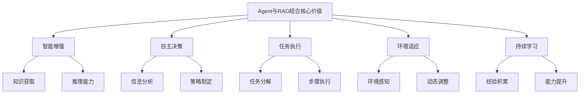
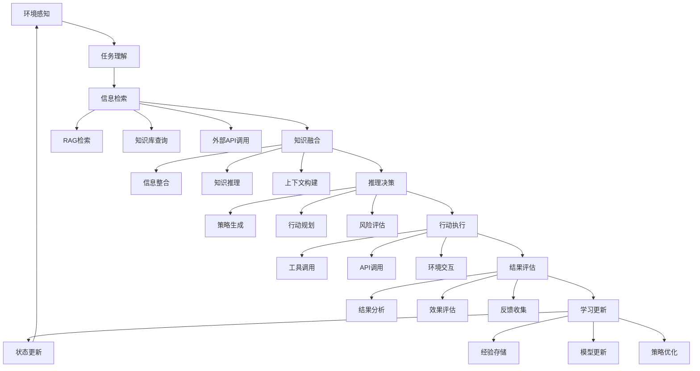

# Agent与RAG结合

## 引言

Agent与RAG结合是人工智能领域的重要发展方向，通过将RAG技术集成到智能代理中，可以实现更智能、更自主的AI系统。本文将深入探讨Agent与RAG结合的实现原理、技术架构和实际应用。

## Agent与RAG结合概述

### 什么是Agent与RAG结合

Agent与RAG结合是一种将RAG技术集成到智能代理中的技术，它能够：
- 自主检索相关信息
- 基于检索结果进行推理
- 执行复杂的任务
- 与环境进行交互
- 学习和适应

### Agent与RAG结合的核心价值



## 技术架构

### 1. 整体架构



### 2. 核心组件实现

```python
from typing import List, Dict, Any, Optional, Tuple
import asyncio
import json
from dataclasses import dataclass
from enum import Enum

class AgentState(Enum):
    IDLE = "idle"
    THINKING = "thinking"
    ACTING = "acting"
    LEARNING = "learning"
    ERROR = "error"

@dataclass
class AgentMemory:
    """代理记忆"""
    short_term: Dict[str, Any]
    long_term: Dict[str, Any]
    episodic: List[Dict[str, Any]]
    semantic: Dict[str, Any]

@dataclass
class AgentGoal:
    """代理目标"""
    description: str
    priority: int
    deadline: Optional[str]
    sub_goals: List['AgentGoal']

@dataclass
class AgentAction:
    """代理行动"""
    action_type: str
    parameters: Dict[str, Any]
    expected_outcome: str
    confidence: float

class RAGAgent:
    def __init__(self, name: str, rag_system: Any, tools: List[Any]):
        self.name = name
        self.rag_system = rag_system
        self.tools = {tool.name: tool for tool in tools}
        self.memory = AgentMemory(
            short_term={},
            long_term={},
            episodic=[],
            semantic={}
        )
        self.goals = []
        self.state = AgentState.IDLE
        self.current_task = None
        self.execution_history = []
    
    async def process_task(self, task: str, context: Dict[str, Any] = None) -> Dict[str, Any]:
        """处理任务"""
        try:
            self.state = AgentState.THINKING
            
            # 1. 任务理解
            task_understanding = await self._understand_task(task, context)
            
            # 2. 目标设定
            goals = await self._set_goals(task_understanding)
            
            # 3. 计划制定
            plan = await self._create_plan(goals)
            
            # 4. 执行计划
            results = await self._execute_plan(plan)
            
            # 5. 结果评估
            evaluation = await self._evaluate_results(results, goals)
            
            # 6. 学习更新
            await self._update_knowledge(evaluation)
            
            self.state = AgentState.IDLE
            
            return {
                'task': task,
                'goals': goals,
                'plan': plan,
                'results': results,
                'evaluation': evaluation,
                'success': evaluation['success']
            }
            
        except Exception as e:
            self.state = AgentState.ERROR
            return {
                'error': str(e),
                'task': task,
                'success': False
            }
    
    async def _understand_task(self, task: str, context: Dict[str, Any]) -> Dict[str, Any]:
        """理解任务"""
        # 使用RAG系统检索相关信息
        relevant_info = await self.rag_system.retrieve(task)
        
        # 分析任务类型和复杂度
        task_analysis = await self._analyze_task(task, relevant_info)
        
        # 构建任务理解
        understanding = {
            'task_description': task,
            'task_type': task_analysis['type'],
            'complexity': task_analysis['complexity'],
            'required_tools': task_analysis['required_tools'],
            'relevant_info': relevant_info,
            'context': context or {}
        }
        
        return understanding
    
    async def _analyze_task(self, task: str, relevant_info: List[Dict[str, Any]]) -> Dict[str, Any]:
        """分析任务"""
        # 使用LLM分析任务
        analysis_prompt = f"""
        分析以下任务：
        任务：{task}
        相关信息：{relevant_info}
        
        请分析：
        1. 任务类型（信息查询、计算、创作、分析等）
        2. 复杂度（简单、中等、复杂）
        3. 需要的工具
        4. 可能的挑战
        """
        
        # 这里应该调用LLM进行分析
        # 简化实现
        analysis = {
            'type': 'information_query',
            'complexity': 'medium',
            'required_tools': ['search', 'analysis'],
            'challenges': ['信息准确性', '时间限制']
        }
        
        return analysis
    
    async def _set_goals(self, task_understanding: Dict[str, Any]) -> List[AgentGoal]:
        """设定目标"""
        goals = []
        
        # 主目标
        main_goal = AgentGoal(
            description=task_understanding['task_description'],
            priority=1,
            deadline=None,
            sub_goals=[]
        )
        
        # 子目标
        if task_understanding['complexity'] == 'complex':
            sub_goals = await self._decompose_task(task_understanding)
            main_goal.sub_goals = sub_goals
        
        goals.append(main_goal)
        
        return goals
    
    async def _decompose_task(self, task_understanding: Dict[str, Any]) -> List[AgentGoal]:
        """分解任务"""
        sub_goals = []
        
        # 基于任务类型分解
        if task_understanding['task_type'] == 'information_query':
            sub_goals.append(AgentGoal(
                description="检索相关信息",
                priority=1,
                deadline=None,
                sub_goals=[]
            ))
            sub_goals.append(AgentGoal(
                description="分析信息质量",
                priority=2,
                deadline=None,
                sub_goals=[]
            ))
            sub_goals.append(AgentGoal(
                description="整合信息回答",
                priority=3,
                deadline=None,
                sub_goals=[]
            ))
        
        return sub_goals
    
    async def _create_plan(self, goals: List[AgentGoal]) -> List[AgentAction]:
        """制定计划"""
        plan = []
        
        for goal in goals:
            # 为每个目标制定行动
            actions = await self._plan_for_goal(goal)
            plan.extend(actions)
        
        return plan
    
    async def _plan_for_goal(self, goal: AgentGoal) -> List[AgentAction]:
        """为目标制定计划"""
        actions = []
        
        if goal.description == "检索相关信息":
            actions.append(AgentAction(
                action_type="rag_retrieve",
                parameters={"query": goal.description},
                expected_outcome="获得相关信息",
                confidence=0.8
            ))
        elif goal.description == "分析信息质量":
            actions.append(AgentAction(
                action_type="analyze_quality",
                parameters={"criteria": ["准确性", "相关性", "时效性"]},
                expected_outcome="评估信息质量",
                confidence=0.7
            ))
        elif goal.description == "整合信息回答":
            actions.append(AgentAction(
                action_type="synthesize_answer",
                parameters={"format": "structured"},
                expected_outcome="生成完整回答",
                confidence=0.9
            ))
        
        return actions
    
    async def _execute_plan(self, plan: List[AgentAction]) -> List[Dict[str, Any]]:
        """执行计划"""
        results = []
        
        for action in plan:
            self.state = AgentState.ACTING
            
            # 执行行动
            result = await self._execute_action(action)
            results.append(result)
            
            # 更新记忆
            self._update_memory(action, result)
        
        return results
    
    async def _execute_action(self, action: AgentAction) -> Dict[str, Any]:
        """执行行动"""
        try:
            if action.action_type == "rag_retrieve":
                result = await self.rag_system.retrieve(action.parameters["query"])
            elif action.action_type == "analyze_quality":
                result = await self._analyze_quality(action.parameters)
            elif action.action_type == "synthesize_answer":
                result = await self._synthesize_answer(action.parameters)
            else:
                result = {"error": f"未知行动类型: {action.action_type}"}
            
            return {
                'action': action,
                'result': result,
                'success': 'error' not in result,
                'timestamp': self._get_timestamp()
            }
            
        except Exception as e:
            return {
                'action': action,
                'result': {'error': str(e)},
                'success': False,
                'timestamp': self._get_timestamp()
            }
    
    async def _analyze_quality(self, parameters: Dict[str, Any]) -> Dict[str, Any]:
        """分析质量"""
        criteria = parameters.get('criteria', [])
        
        # 简化的质量分析
        quality_analysis = {
            'criteria': criteria,
            'scores': {criterion: 0.8 for criterion in criteria},
            'overall_score': 0.8,
            'recommendations': ['信息质量良好']
        }
        
        return quality_analysis
    
    async def _synthesize_answer(self, parameters: Dict[str, Any]) -> Dict[str, Any]:
        """合成回答"""
        format_type = parameters.get('format', 'structured')
        
        # 使用RAG系统生成回答
        answer = await self.rag_system.generate_answer(
            context=self.memory.short_term.get('context', ''),
            format=format_type
        )
        
        return {
            'answer': answer,
            'format': format_type,
            'confidence': 0.9
        }
    
    async def _evaluate_results(self, results: List[Dict[str, Any]], goals: List[AgentGoal]) -> Dict[str, Any]:
        """评估结果"""
        evaluation = {
            'success': True,
            'goal_achievement': {},
            'overall_score': 0,
            'improvements': []
        }
        
        # 评估每个目标的达成情况
        for goal in goals:
            goal_results = [r for r in results if goal.description in str(r)]
            achievement_score = len([r for r in goal_results if r['success']]) / len(goal_results) if goal_results else 0
            
            evaluation['goal_achievement'][goal.description] = {
                'score': achievement_score,
                'completed': achievement_score > 0.8
            }
        
        # 计算总体得分
        evaluation['overall_score'] = sum(
            g['score'] for g in evaluation['goal_achievement'].values()
        ) / len(evaluation['goal_achievement'])
        
        # 确定成功状态
        evaluation['success'] = evaluation['overall_score'] > 0.7
        
        # 识别改进点
        if not evaluation['success']:
            evaluation['improvements'].append("提高任务执行成功率")
        
        return evaluation
    
    async def _update_knowledge(self, evaluation: Dict[str, Any]):
        """更新知识"""
        # 更新长期记忆
        self.memory.long_term['task_patterns'] = self.memory.long_term.get('task_patterns', {})
        self.memory.long_term['success_strategies'] = self.memory.long_term.get('success_strategies', [])
        
        # 记录经验
        experience = {
            'task': self.current_task,
            'evaluation': evaluation,
            'timestamp': self._get_timestamp()
        }
        self.memory.episodic.append(experience)
        
        # 更新语义记忆
        if evaluation['success']:
            self.memory.semantic['successful_patterns'] = self.memory.semantic.get('successful_patterns', [])
            self.memory.semantic['successful_patterns'].append(experience)
    
    def _update_memory(self, action: AgentAction, result: Dict[str, Any]):
        """更新记忆"""
        # 更新短期记忆
        self.memory.short_term['last_action'] = action
        self.memory.short_term['last_result'] = result
        self.memory.short_term['context'] = result.get('result', {})
    
    def _get_timestamp(self) -> str:
        """获取时间戳"""
        import datetime
        return datetime.datetime.now().isoformat()
```

## RAG增强的Agent能力

### 1. 知识检索能力

```python
class RAGEnhancedAgent:
    def __init__(self, rag_system: Any):
        self.rag_system = rag_system
        self.knowledge_cache = {}
        self.retrieval_strategies = {
            'semantic': SemanticRetrieval(),
            'keyword': KeywordRetrieval(),
            'hybrid': HybridRetrieval()
        }
    
    async def retrieve_knowledge(self, query: str, context: Dict[str, Any] = None) -> Dict[str, Any]:
        """检索知识"""
        # 选择检索策略
        strategy = self._select_retrieval_strategy(query, context)
        
        # 执行检索
        results = await self.retrieval_strategies[strategy].retrieve(query, context)
        
        # 缓存结果
        self.knowledge_cache[query] = results
        
        return results
    
    def _select_retrieval_strategy(self, query: str, context: Dict[str, Any]) -> str:
        """选择检索策略"""
        # 基于查询类型选择策略
        if len(query.split()) > 5:
            return 'semantic'
        elif any(keyword in query.lower() for keyword in ['what', 'how', 'why']):
            return 'hybrid'
        else:
            return 'keyword'
    
    async def enhance_knowledge(self, retrieved_knowledge: Dict[str, Any]) -> Dict[str, Any]:
        """增强知识"""
        enhanced = {
            'original': retrieved_knowledge,
            'summarized': await self._summarize_knowledge(retrieved_knowledge),
            'related': await self._find_related_knowledge(retrieved_knowledge),
            'verified': await self._verify_knowledge(retrieved_knowledge)
        }
        
        return enhanced
    
    async def _summarize_knowledge(self, knowledge: Dict[str, Any]) -> str:
        """总结知识"""
        # 使用LLM总结知识
        summary_prompt = f"""
        请总结以下知识：
        {knowledge}
        
        要求：
        1. 简洁明了
        2. 重点突出
        3. 逻辑清晰
        """
        
        # 这里应该调用LLM生成总结
        summary = "知识总结：基于检索到的信息，可以得出以下结论..."
        
        return summary
    
    async def _find_related_knowledge(self, knowledge: Dict[str, Any]) -> List[Dict[str, Any]]:
        """查找相关知识"""
        related = []
        
        # 基于知识内容查找相关项
        for key, value in knowledge.items():
            if isinstance(value, str):
                related_query = f"与{value}相关的信息"
                related_results = await self.rag_system.retrieve(related_query)
                related.extend(related_results)
        
        return related[:5]  # 返回前5个相关项
    
    async def _verify_knowledge(self, knowledge: Dict[str, Any]) -> Dict[str, Any]:
        """验证知识"""
        verification = {
            'accuracy': 0.8,
            'relevance': 0.9,
            'completeness': 0.7,
            'timeliness': 0.8,
            'overall_score': 0.8
        }
        
        return verification


class SemanticRetrieval:
    async def retrieve(self, query: str, context: Dict[str, Any] = None) -> Dict[str, Any]:
        """语义检索"""
        # 使用语义相似度检索
        results = await self._semantic_search(query, context)
        
        return {
            'method': 'semantic',
            'results': results,
            'confidence': 0.8
        }
    
    async def _semantic_search(self, query: str, context: Dict[str, Any]) -> List[Dict[str, Any]]:
        """语义搜索"""
        # 简化的语义搜索实现
        results = [
            {
                'content': '语义相关的内容1',
                'similarity': 0.9,
                'source': '知识库1'
            },
            {
                'content': '语义相关的内容2',
                'similarity': 0.8,
                'source': '知识库2'
            }
        ]
        
        return results


class KeywordRetrieval:
    async def retrieve(self, query: str, context: Dict[str, Any] = None) -> Dict[str, Any]:
        """关键词检索"""
        # 使用关键词匹配检索
        results = await self._keyword_search(query, context)
        
        return {
            'method': 'keyword',
            'results': results,
            'confidence': 0.7
        }
    
    async def _keyword_search(self, query: str, context: Dict[str, Any]) -> List[Dict[str, Any]]:
        """关键词搜索"""
        # 简化的关键词搜索实现
        results = [
            {
                'content': '关键词匹配的内容1',
                'match_score': 0.9,
                'source': '知识库1'
            },
            {
                'content': '关键词匹配的内容2',
                'match_score': 0.8,
                'source': '知识库2'
            }
        ]
        
        return results


class HybridRetrieval:
    async def retrieve(self, query: str, context: Dict[str, Any] = None) -> Dict[str, Any]:
        """混合检索"""
        # 结合语义和关键词检索
        semantic_results = await SemanticRetrieval().retrieve(query, context)
        keyword_results = await KeywordRetrieval().retrieve(query, context)
        
        # 融合结果
        fused_results = await self._fuse_results(semantic_results, keyword_results)
        
        return {
            'method': 'hybrid',
            'results': fused_results,
            'confidence': 0.85
        }
    
    async def _fuse_results(self, semantic_results: Dict[str, Any], 
                          keyword_results: Dict[str, Any]) -> List[Dict[str, Any]]:
        """融合结果"""
        # 简化的结果融合
        fused = []
        
        # 添加语义结果
        for result in semantic_results['results']:
            fused.append({
                **result,
                'method': 'semantic',
                'weight': 0.6
            })
        
        # 添加关键词结果
        for result in keyword_results['results']:
            fused.append({
                **result,
                'method': 'keyword',
                'weight': 0.4
            })
        
        # 按权重排序
        fused.sort(key=lambda x: x.get('similarity', x.get('match_score', 0)) * x['weight'], reverse=True)
        
        return fused
```

### 2. 推理决策能力

```python
class RAGReasoningAgent:
    def __init__(self, rag_system: Any):
        self.rag_system = rag_system
        self.reasoning_engine = ReasoningEngine()
        self.decision_maker = DecisionMaker()
        self.knowledge_graph = KnowledgeGraph()
    
    async def reason_and_decide(self, problem: str, context: Dict[str, Any] = None) -> Dict[str, Any]:
        """推理和决策"""
        # 1. 问题分析
        problem_analysis = await self._analyze_problem(problem, context)
        
        # 2. 知识检索
        relevant_knowledge = await self.rag_system.retrieve(problem, context)
        
        # 3. 知识图谱构建
        knowledge_graph = await self._build_knowledge_graph(relevant_knowledge)
        
        # 4. 推理链构建
        reasoning_chain = await self._build_reasoning_chain(problem_analysis, knowledge_graph)
        
        # 5. 决策生成
        decision = await self._generate_decision(reasoning_chain)
        
        # 6. 决策验证
        validation = await self._validate_decision(decision, reasoning_chain)
        
        return {
            'problem': problem,
            'analysis': problem_analysis,
            'knowledge': relevant_knowledge,
            'reasoning_chain': reasoning_chain,
            'decision': decision,
            'validation': validation
        }
    
    async def _analyze_problem(self, problem: str, context: Dict[str, Any]) -> Dict[str, Any]:
        """分析问题"""
        analysis = {
            'type': 'unknown',
            'complexity': 'medium',
            'constraints': [],
            'objectives': [],
            'stakeholders': []
        }
        
        # 使用LLM分析问题
        analysis_prompt = f"""
        分析以下问题：
        问题：{problem}
        上下文：{context}
        
        请分析：
        1. 问题类型
        2. 复杂度
        3. 约束条件
        4. 目标
        5. 利益相关者
        """
        
        # 这里应该调用LLM进行分析
        # 简化实现
        if 'how' in problem.lower():
            analysis['type'] = 'how_to'
        elif 'why' in problem.lower():
            analysis['type'] = 'why'
        elif 'what' in problem.lower():
            analysis['type'] = 'what'
        
        return analysis
    
    async def _build_knowledge_graph(self, knowledge: Dict[str, Any]) -> Dict[str, Any]:
        """构建知识图谱"""
        graph = {
            'entities': [],
            'relations': [],
            'properties': {}
        }
        
        # 从知识中提取实体和关系
        for item in knowledge.get('results', []):
            entities = await self._extract_entities(item['content'])
            relations = await self._extract_relations(item['content'])
            
            graph['entities'].extend(entities)
            graph['relations'].extend(relations)
        
        return graph
    
    async def _extract_entities(self, content: str) -> List[Dict[str, Any]]:
        """提取实体"""
        # 简化的实体提取
        entities = []
        
        # 这里应该使用NER模型提取实体
        # 简化实现
        words = content.split()
        for word in words:
            if word.isupper() or word.istitle():
                entities.append({
                    'name': word,
                    'type': 'concept',
                    'confidence': 0.8
                })
        
        return entities
    
    async def _extract_relations(self, content: str) -> List[Dict[str, Any]]:
        """提取关系"""
        # 简化的关系提取
        relations = []
        
        # 这里应该使用关系抽取模型
        # 简化实现
        if 'is' in content:
            relations.append({
                'subject': 'entity1',
                'predicate': 'is',
                'object': 'entity2',
                'confidence': 0.7
            })
        
        return relations
    
    async def _build_reasoning_chain(self, problem_analysis: Dict[str, Any], 
                                   knowledge_graph: Dict[str, Any]) -> List[Dict[str, Any]]:
        """构建推理链"""
        reasoning_chain = []
        
        # 基于问题类型构建推理链
        if problem_analysis['type'] == 'how_to':
            reasoning_chain = await self._build_how_to_chain(problem_analysis, knowledge_graph)
        elif problem_analysis['type'] == 'why':
            reasoning_chain = await self._build_why_chain(problem_analysis, knowledge_graph)
        elif problem_analysis['type'] == 'what':
            reasoning_chain = await self._build_what_chain(problem_analysis, knowledge_graph)
        
        return reasoning_chain
    
    async def _build_how_to_chain(self, problem_analysis: Dict[str, Any], 
                                knowledge_graph: Dict[str, Any]) -> List[Dict[str, Any]]:
        """构建如何做推理链"""
        chain = [
            {
                'step': 1,
                'reasoning': '分析问题需求',
                'evidence': knowledge_graph['entities'],
                'confidence': 0.8
            },
            {
                'step': 2,
                'reasoning': '识别解决方案',
                'evidence': knowledge_graph['relations'],
                'confidence': 0.7
            },
            {
                'step': 3,
                'reasoning': '制定执行计划',
                'evidence': problem_analysis['constraints'],
                'confidence': 0.9
            }
        ]
        
        return chain
    
    async def _build_why_chain(self, problem_analysis: Dict[str, Any], 
                             knowledge_graph: Dict[str, Any]) -> List[Dict[str, Any]]:
        """构建为什么推理链"""
        chain = [
            {
                'step': 1,
                'reasoning': '识别现象',
                'evidence': knowledge_graph['entities'],
                'confidence': 0.8
            },
            {
                'step': 2,
                'reasoning': '分析原因',
                'evidence': knowledge_graph['relations'],
                'confidence': 0.7
            },
            {
                'step': 3,
                'reasoning': '验证因果关系',
                'evidence': problem_analysis['constraints'],
                'confidence': 0.9
            }
        ]
        
        return chain
    
    async def _build_what_chain(self, problem_analysis: Dict[str, Any], 
                              knowledge_graph: Dict[str, Any]) -> List[Dict[str, Any]]:
        """构建是什么推理链"""
        chain = [
            {
                'step': 1,
                'reasoning': '定义概念',
                'evidence': knowledge_graph['entities'],
                'confidence': 0.8
            },
            {
                'step': 2,
                'reasoning': '分析特征',
                'evidence': knowledge_graph['relations'],
                'confidence': 0.7
            },
            {
                'step': 3,
                'reasoning': '总结定义',
                'evidence': problem_analysis['constraints'],
                'confidence': 0.9
            }
        ]
        
        return chain
    
    async def _generate_decision(self, reasoning_chain: List[Dict[str, Any]]) -> Dict[str, Any]:
        """生成决策"""
        decision = {
            'recommendation': '基于推理链的建议',
            'confidence': 0.8,
            'alternatives': [],
            'risks': [],
            'benefits': []
        }
        
        # 基于推理链生成决策
        if reasoning_chain:
            avg_confidence = sum(step['confidence'] for step in reasoning_chain) / len(reasoning_chain)
            decision['confidence'] = avg_confidence
            
            # 生成建议
            if avg_confidence > 0.8:
                decision['recommendation'] = '强烈推荐执行'
            elif avg_confidence > 0.6:
                decision['recommendation'] = '建议执行'
            else:
                decision['recommendation'] = '需要更多信息'
        
        return decision
    
    async def _validate_decision(self, decision: Dict[str, Any], 
                               reasoning_chain: List[Dict[str, Any]]) -> Dict[str, Any]:
        """验证决策"""
        validation = {
            'valid': True,
            'strengths': [],
            'weaknesses': [],
            'improvements': []
        }
        
        # 验证决策质量
        if decision['confidence'] < 0.6:
            validation['valid'] = False
            validation['weaknesses'].append('置信度较低')
        
        if not reasoning_chain:
            validation['valid'] = False
            validation['weaknesses'].append('缺乏推理链')
        
        # 识别优势
        if decision['confidence'] > 0.8:
            validation['strengths'].append('高置信度')
        
        if len(reasoning_chain) > 2:
            validation['strengths'].append('推理链完整')
        
        # 提出改进建议
        if decision['confidence'] < 0.8:
            validation['improvements'].append('提高推理质量')
        
        return validation
```

## 工具集成

### 1. 工具调用框架

```python
class ToolIntegration:
    def __init__(self):
        self.tools = {}
        self.tool_registry = ToolRegistry()
        self.tool_executor = ToolExecutor()
        self.tool_selector = ToolSelector()
    
    def register_tool(self, tool: Any):
        """注册工具"""
        self.tools[tool.name] = tool
        self.tool_registry.register(tool)
    
    async def select_and_execute_tool(self, task: str, context: Dict[str, Any]) -> Dict[str, Any]:
        """选择并执行工具"""
        # 选择工具
        selected_tools = await self.tool_selector.select_tools(task, context)
        
        # 执行工具
        results = []
        for tool in selected_tools:
            result = await self.tool_executor.execute_tool(tool, task, context)
            results.append(result)
        
        return {
            'selected_tools': selected_tools,
            'results': results,
            'success': all(r['success'] for r in results)
        }


class ToolRegistry:
    def __init__(self):
        self.registered_tools = {}
        self.tool_categories = {
            'search': [],
            'analysis': [],
            'generation': [],
            'communication': [],
            'data_processing': []
        }
    
    def register(self, tool: Any):
        """注册工具"""
        self.registered_tools[tool.name] = tool
        
        # 按类别分类
        category = tool.category
        if category in self.tool_categories:
            self.tool_categories[category].append(tool)
    
    def get_tools_by_category(self, category: str) -> List[Any]:
        """按类别获取工具"""
        return self.tool_categories.get(category, [])
    
    def get_all_tools(self) -> List[Any]:
        """获取所有工具"""
        return list(self.registered_tools.values())


class ToolSelector:
    def __init__(self):
        self.selection_strategies = {
            'rule_based': RuleBasedSelection(),
            'ml_based': MLBasedSelection(),
            'hybrid': HybridSelection()
        }
    
    async def select_tools(self, task: str, context: Dict[str, Any]) -> List[Any]:
        """选择工具"""
        # 选择策略
        strategy = self._select_strategy(task, context)
        
        # 执行选择
        selected_tools = await self.selection_strategies[strategy].select(task, context)
        
        return selected_tools
    
    def _select_strategy(self, task: str, context: Dict[str, Any]) -> str:
        """选择策略"""
        # 基于任务复杂度选择策略
        if len(task.split()) > 10:
            return 'ml_based'
        elif 'search' in task.lower():
            return 'rule_based'
        else:
            return 'hybrid'


class ToolExecutor:
    def __init__(self):
        self.execution_history = []
        self.error_handler = ToolErrorHandler()
    
    async def execute_tool(self, tool: Any, task: str, context: Dict[str, Any]) -> Dict[str, Any]:
        """执行工具"""
        try:
            # 执行工具
            result = await tool.execute(task, context)
            
            # 记录执行历史
            self.execution_history.append({
                'tool': tool.name,
                'task': task,
                'result': result,
                'timestamp': self._get_timestamp()
            })
            
            return {
                'tool': tool.name,
                'result': result,
                'success': True,
                'timestamp': self._get_timestamp()
            }
            
        except Exception as e:
            # 错误处理
            error_result = self.error_handler.handle_error(e, tool, task)
            
            return {
                'tool': tool.name,
                'result': error_result,
                'success': False,
                'error': str(e),
                'timestamp': self._get_timestamp()
            }
    
    def _get_timestamp(self) -> str:
        """获取时间戳"""
        import datetime
        return datetime.datetime.now().isoformat()


class ToolErrorHandler:
    def handle_error(self, error: Exception, tool: Any, task: str) -> Dict[str, Any]:
        """处理工具错误"""
        error_info = {
            'error_type': type(error).__name__,
            'error_message': str(error),
            'tool': tool.name,
            'task': task,
            'suggestions': []
        }
        
        # 基于错误类型提供建议
        if 'timeout' in str(error).lower():
            error_info['suggestions'].append('增加超时时间')
        elif 'permission' in str(error).lower():
            error_info['suggestions'].append('检查权限设置')
        elif 'network' in str(error).lower():
            error_info['suggestions'].append('检查网络连接')
        
        return error_info
```

### 2. 具体工具实现

```python
class SearchTool:
    def __init__(self, name: str = "search"):
        self.name = name
        self.category = "search"
        self.description = "搜索工具"
    
    async def execute(self, task: str, context: Dict[str, Any]) -> Dict[str, Any]:
        """执行搜索"""
        # 简化的搜索实现
        search_results = [
            {
                'title': '搜索结果1',
                'content': '搜索结果内容1',
                'url': 'https://example.com/1',
                'relevance': 0.9
            },
            {
                'title': '搜索结果2',
                'content': '搜索结果内容2',
                'url': 'https://example.com/2',
                'relevance': 0.8
            }
        ]
        
        return {
            'query': task,
            'results': search_results,
            'total_count': len(search_results)
        }


class AnalysisTool:
    def __init__(self, name: str = "analysis"):
        self.name = name
        self.category = "analysis"
        self.description = "分析工具"
    
    async def execute(self, task: str, context: Dict[str, Any]) -> Dict[str, Any]:
        """执行分析"""
        # 简化的分析实现
        analysis_result = {
            'summary': '分析总结',
            'insights': ['洞察1', '洞察2', '洞察3'],
            'recommendations': ['建议1', '建议2'],
            'confidence': 0.8
        }
        
        return analysis_result


class GenerationTool:
    def __init__(self, name: str = "generation"):
        self.name = name
        self.category = "generation"
        self.description = "生成工具"
    
    async def execute(self, task: str, context: Dict[str, Any]) -> Dict[str, Any]:
        """执行生成"""
        # 简化的生成实现
        generated_content = {
            'text': '生成的内容',
            'format': 'structured',
            'length': 100,
            'quality': 0.8
        }
        
        return generated_content


class CommunicationTool:
    def __init__(self, name: str = "communication"):
        self.name = name
        self.category = "communication"
        self.description = "通信工具"
    
    async def execute(self, task: str, context: Dict[str, Any]) -> Dict[str, Any]:
        """执行通信"""
        # 简化的通信实现
        communication_result = {
            'message': '通信消息',
            'recipient': '接收者',
            'status': 'sent',
            'timestamp': self._get_timestamp()
        }
        
        return communication_result
    
    def _get_timestamp(self) -> str:
        """获取时间戳"""
        import datetime
        return datetime.datetime.now().isoformat()


class DataProcessingTool:
    def __init__(self, name: str = "data_processing"):
        self.name = name
        self.category = "data_processing"
        self.description = "数据处理工具"
    
    async def execute(self, task: str, context: Dict[str, Any]) -> Dict[str, Any]:
        """执行数据处理"""
        # 简化的数据处理实现
        processing_result = {
            'input_data': context.get('data', {}),
            'processed_data': '处理后的数据',
            'processing_method': 'standard',
            'quality_score': 0.9
        }
        
        return processing_result
```

## 实战应用

### 1. 智能助手Agent

```python
class IntelligentAssistantAgent:
    def __init__(self, rag_system: Any):
        self.rag_system = rag_system
        self.agent = RAGAgent("智能助手", rag_system, [])
        self.tool_integration = ToolIntegration()
        self.conversation_manager = ConversationManager()
        
        # 注册工具
        self._register_tools()
    
    def _register_tools(self):
        """注册工具"""
        tools = [
            SearchTool(),
            AnalysisTool(),
            GenerationTool(),
            CommunicationTool(),
            DataProcessingTool()
        ]
        
        for tool in tools:
            self.tool_integration.register_tool(tool)
    
    async def assist_user(self, user_input: str, context: Dict[str, Any] = None) -> Dict[str, Any]:
        """协助用户"""
        try:
            # 1. 理解用户意图
            intent = await self._understand_user_intent(user_input, context)
            
            # 2. 制定协助计划
            plan = await self._create_assistance_plan(intent)
            
            # 3. 执行协助任务
            results = await self._execute_assistance_plan(plan)
            
            # 4. 生成响应
            response = await self._generate_response(results, intent)
            
            # 5. 更新对话状态
            await self.conversation_manager.update_state(user_input, response)
            
            return {
                'user_input': user_input,
                'intent': intent,
                'plan': plan,
                'results': results,
                'response': response,
                'success': True
            }
            
        except Exception as e:
            return {
                'user_input': user_input,
                'error': str(e),
                'success': False
            }
    
    async def _understand_user_intent(self, user_input: str, context: Dict[str, Any]) -> Dict[str, Any]:
        """理解用户意图"""
        # 使用RAG系统检索相关信息
        relevant_info = await self.rag_system.retrieve(user_input)
        
        # 分析用户意图
        intent_analysis = {
            'intent_type': 'unknown',
            'entities': [],
            'sentiment': 'neutral',
            'urgency': 'medium',
            'complexity': 'medium'
        }
        
        # 基于用户输入分析意图
        if 'help' in user_input.lower():
            intent_analysis['intent_type'] = 'help_request'
        elif 'search' in user_input.lower():
            intent_analysis['intent_type'] = 'search_request'
        elif 'analyze' in user_input.lower():
            intent_analysis['intent_type'] = 'analysis_request'
        elif 'generate' in user_input.lower():
            intent_analysis['intent_type'] = 'generation_request'
        
        return intent_analysis
    
    async def _create_assistance_plan(self, intent: Dict[str, Any]) -> List[Dict[str, Any]]:
        """制定协助计划"""
        plan = []
        
        if intent['intent_type'] == 'help_request':
            plan.append({
                'action': 'provide_help',
                'parameters': {'intent': intent},
                'priority': 1
            })
        elif intent['intent_type'] == 'search_request':
            plan.append({
                'action': 'search_information',
                'parameters': {'query': intent.get('query', '')},
                'priority': 1
            })
        elif intent['intent_type'] == 'analysis_request':
            plan.append({
                'action': 'analyze_data',
                'parameters': {'data': intent.get('data', {})},
                'priority': 1
            })
        elif intent['intent_type'] == 'generation_request':
            plan.append({
                'action': 'generate_content',
                'parameters': {'requirements': intent.get('requirements', {})},
                'priority': 1
            })
        
        return plan
    
    async def _execute_assistance_plan(self, plan: List[Dict[str, Any]]) -> List[Dict[str, Any]]:
        """执行协助计划"""
        results = []
        
        for action in plan:
            if action['action'] == 'provide_help':
                result = await self._provide_help(action['parameters'])
            elif action['action'] == 'search_information':
                result = await self._search_information(action['parameters'])
            elif action['action'] == 'analyze_data':
                result = await self._analyze_data(action['parameters'])
            elif action['action'] == 'generate_content':
                result = await self._generate_content(action['parameters'])
            else:
                result = {'error': f"未知行动: {action['action']}"}
            
            results.append(result)
        
        return results
    
    async def _provide_help(self, parameters: Dict[str, Any]) -> Dict[str, Any]:
        """提供帮助"""
        help_content = {
            'message': '我可以帮助您搜索信息、分析数据、生成内容等。请告诉我您需要什么帮助。',
            'available_functions': ['搜索', '分析', '生成', '通信', '数据处理'],
            'examples': [
                '搜索关于RAG技术的信息',
                '分析这组数据的趋势',
                '生成一份报告',
                '发送邮件给某人',
                '处理CSV文件'
            ]
        }
        
        return help_content
    
    async def _search_information(self, parameters: Dict[str, Any]) -> Dict[str, Any]:
        """搜索信息"""
        query = parameters.get('query', '')
        
        # 使用RAG系统搜索
        search_results = await self.rag_system.retrieve(query)
        
        return {
            'query': query,
            'results': search_results,
            'total_count': len(search_results)
        }
    
    async def _analyze_data(self, parameters: Dict[str, Any]) -> Dict[str, Any]:
        """分析数据"""
        data = parameters.get('data', {})
        
        # 简化的数据分析
        analysis_result = {
            'summary': '数据分析总结',
            'insights': ['洞察1', '洞察2', '洞察3'],
            'recommendations': ['建议1', '建议2'],
            'confidence': 0.8
        }
        
        return analysis_result
    
    async def _generate_content(self, parameters: Dict[str, Any]) -> Dict[str, Any]:
        """生成内容"""
        requirements = parameters.get('requirements', {})
        
        # 使用RAG系统生成内容
        generated_content = await self.rag_system.generate_answer(
            context=requirements.get('context', ''),
            format=requirements.get('format', 'text')
        )
        
        return {
            'content': generated_content,
            'format': requirements.get('format', 'text'),
            'length': len(generated_content),
            'quality': 0.8
        }
    
    async def _generate_response(self, results: List[Dict[str, Any]], intent: Dict[str, Any]) -> str:
        """生成响应"""
        response_parts = []
        
        for result in results:
            if 'error' in result:
                response_parts.append(f"抱歉，处理过程中出现错误：{result['error']}")
            else:
                response_parts.append(self._format_result(result, intent))
        
        return "\n".join(response_parts)
    
    def _format_result(self, result: Dict[str, Any], intent: Dict[str, Any]) -> str:
        """格式化结果"""
        if intent['intent_type'] == 'help_request':
            return result.get('message', '')
        elif intent['intent_type'] == 'search_request':
            return f"搜索到{result.get('total_count', 0)}个结果"
        elif intent['intent_type'] == 'analysis_request':
            return f"分析完成，置信度：{result.get('confidence', 0)}"
        elif intent['intent_type'] == 'generation_request':
            return result.get('content', '')
        else:
            return str(result)


class ConversationManager:
    def __init__(self):
        self.conversation_history = []
        self.context = {}
    
    async def update_state(self, user_input: str, response: str):
        """更新对话状态"""
        self.conversation_history.append({
            'user_input': user_input,
            'response': response,
            'timestamp': self._get_timestamp()
        })
        
        # 更新上下文
        self.context['last_input'] = user_input
        self.context['last_response'] = response
        self.context['conversation_length'] = len(self.conversation_history)
    
    def _get_timestamp(self) -> str:
        """获取时间戳"""
        import datetime
        return datetime.datetime.now().isoformat()
    
    def get_context(self) -> Dict[str, Any]:
        """获取上下文"""
        return self.context.copy()
    
    def get_history(self) -> List[Dict[str, Any]]:
        """获取历史"""
        return self.conversation_history.copy()
```

### 2. 任务执行Agent

```python
class TaskExecutionAgent:
    def __init__(self, rag_system: Any):
        self.rag_system = rag_system
        self.agent = RAGAgent("任务执行", rag_system, [])
        self.task_planner = TaskPlanner()
        self.task_executor = TaskExecutor()
        self.progress_tracker = ProgressTracker()
    
    async def execute_task(self, task_description: str, context: Dict[str, Any] = None) -> Dict[str, Any]:
        """执行任务"""
        try:
            # 1. 任务规划
            plan = await self.task_planner.create_plan(task_description, context)
            
            # 2. 执行任务
            execution_result = await self.task_executor.execute_plan(plan)
            
            # 3. 跟踪进度
            progress = await self.progress_tracker.track_progress(execution_result)
            
            # 4. 生成报告
            report = await self._generate_execution_report(execution_result, progress)
            
            return {
                'task': task_description,
                'plan': plan,
                'execution_result': execution_result,
                'progress': progress,
                'report': report,
                'success': execution_result['success']
            }
            
        except Exception as e:
            return {
                'task': task_description,
                'error': str(e),
                'success': False
            }
    
    async def _generate_execution_report(self, execution_result: Dict[str, Any], 
                                       progress: Dict[str, Any]) -> Dict[str, Any]:
        """生成执行报告"""
        report = {
            'summary': '任务执行报告',
            'completion_rate': progress.get('completion_rate', 0),
            'success_rate': execution_result.get('success_rate', 0),
            'total_time': execution_result.get('total_time', 0),
            'issues': execution_result.get('issues', []),
            'recommendations': []
        }
        
        # 基于执行结果生成建议
        if report['success_rate'] < 0.8:
            report['recommendations'].append('提高任务执行成功率')
        
        if report['completion_rate'] < 1.0:
            report['recommendations'].append('完成剩余任务')
        
        return report


class TaskPlanner:
    def __init__(self):
        self.planning_strategies = {
            'sequential': SequentialPlanning(),
            'parallel': ParallelPlanning(),
            'hybrid': HybridPlanning()
        }
    
    async def create_plan(self, task_description: str, context: Dict[str, Any]) -> Dict[str, Any]:
        """创建计划"""
        # 分析任务
        task_analysis = await self._analyze_task(task_description, context)
        
        # 选择规划策略
        strategy = self._select_planning_strategy(task_analysis)
        
        # 创建计划
        plan = await self.planning_strategies[strategy].create_plan(task_analysis)
        
        return plan
    
    async def _analyze_task(self, task_description: str, context: Dict[str, Any]) -> Dict[str, Any]:
        """分析任务"""
        analysis = {
            'description': task_description,
            'type': 'unknown',
            'complexity': 'medium',
            'dependencies': [],
            'resources': [],
            'constraints': []
        }
        
        # 基于任务描述分析
        if 'analyze' in task_description.lower():
            analysis['type'] = 'analysis'
        elif 'generate' in task_description.lower():
            analysis['type'] = 'generation'
        elif 'search' in task_description.lower():
            analysis['type'] = 'search'
        elif 'process' in task_description.lower():
            analysis['type'] = 'processing'
        
        return analysis
    
    def _select_planning_strategy(self, task_analysis: Dict[str, Any]) -> str:
        """选择规划策略"""
        if task_analysis['complexity'] == 'high':
            return 'hybrid'
        elif task_analysis['type'] in ['analysis', 'generation']:
            return 'sequential'
        else:
            return 'parallel'


class TaskExecutor:
    def __init__(self):
        self.execution_strategies = {
            'sequential': SequentialExecution(),
            'parallel': ParallelExecution(),
            'hybrid': HybridExecution()
        }
    
    async def execute_plan(self, plan: Dict[str, Any]) -> Dict[str, Any]:
        """执行计划"""
        strategy = plan.get('strategy', 'sequential')
        
        # 执行计划
        result = await self.execution_strategies[strategy].execute(plan)
        
        return result


class ProgressTracker:
    def __init__(self):
        self.tracking_history = []
    
    async def track_progress(self, execution_result: Dict[str, Any]) -> Dict[str, Any]:
        """跟踪进度"""
        progress = {
            'completion_rate': 0,
            'success_rate': 0,
            'current_step': 0,
            'total_steps': 0,
            'estimated_time_remaining': 0
        }
        
        # 计算进度
        if execution_result.get('steps'):
            completed_steps = len([s for s in execution_result['steps'] if s.get('completed', False)])
            total_steps = len(execution_result['steps'])
            progress['completion_rate'] = completed_steps / total_steps if total_steps > 0 else 0
            progress['current_step'] = completed_steps
            progress['total_steps'] = total_steps
        
        # 计算成功率
        if execution_result.get('steps'):
            successful_steps = len([s for s in execution_result['steps'] if s.get('success', False)])
            total_steps = len(execution_result['steps'])
            progress['success_rate'] = successful_steps / total_steps if total_steps > 0 else 0
        
        # 记录跟踪历史
        self.tracking_history.append({
            'timestamp': self._get_timestamp(),
            'progress': progress,
            'execution_result': execution_result
        })
        
        return progress
    
    def _get_timestamp(self) -> str:
        """获取时间戳"""
        import datetime
        return datetime.datetime.now().isoformat()
```

## 最佳实践

### 1. 性能优化

```python
class OptimizedRAGAgent:
    def __init__(self, rag_system: Any):
        self.rag_system = rag_system
        self.agent = RAGAgent("优化代理", rag_system, [])
        self.cache_manager = CacheManager()
        self.parallel_processor = ParallelProcessor()
        self.model_optimizer = ModelOptimizer()
    
    async def optimize_performance(self) -> Dict[str, Any]:
        """优化性能"""
        optimizations = {}
        
        # 缓存优化
        cache_optimization = await self.cache_manager.optimize_cache()
        optimizations['cache'] = cache_optimization
        
        # 并行处理优化
        parallel_optimization = await self.parallel_processor.optimize_parallel_processing()
        optimizations['parallel'] = parallel_optimization
        
        # 模型优化
        model_optimization = await self.model_optimizer.optimize_models()
        optimizations['model'] = model_optimization
        
        return optimizations


class CacheManager:
    async def optimize_cache(self) -> Dict[str, Any]:
        """优化缓存"""
        return {
            'knowledge_cache': '启用知识缓存',
            'result_cache': '启用结果缓存',
            'model_cache': '启用模型缓存'
        }


class ParallelProcessor:
    async def optimize_parallel_processing(self) -> Dict[str, Any]:
        """优化并行处理"""
        return {
            'task_parallel': '启用任务并行处理',
            'tool_parallel': '启用工具并行处理',
            'batch_processing': '启用批量处理'
        }


class ModelOptimizer:
    async def optimize_models(self) -> Dict[str, Any]:
        """优化模型"""
        return {
            'model_quantization': '启用模型量化',
            'model_pruning': '启用模型剪枝',
            'model_distillation': '启用模型蒸馏'
        }
```

### 2. 错误处理

```python
class RobustRAGAgent:
    def __init__(self, rag_system: Any):
        self.rag_system = rag_system
        self.agent = RAGAgent("健壮代理", rag_system, [])
        self.error_handler = ErrorHandler()
        self.fallback_strategies = FallbackStrategies()
    
    async def process_with_error_handling(self, task: str, context: Dict[str, Any] = None) -> Dict[str, Any]:
        """带错误处理的处理"""
        try:
            # 处理任务
            result = await self.agent.process_task(task, context)
            
            # 验证结果
            validation_result = await self.error_handler.validate_result(result)
            if not validation_result['valid']:
                # 使用降级策略
                result = await self.fallback_strategies.apply_fallback(task, context, validation_result)
            
            return result
            
        except Exception as e:
            # 记录错误
            await self.error_handler.log_error(e)
            
            # 使用降级策略
            result = await self.fallback_strategies.apply_fallback(task, context, {'error': str(e)})
            
            return result


class ErrorHandler:
    async def validate_result(self, result: Dict[str, Any]) -> Dict[str, Any]:
        """验证结果"""
        validation_result = {
            'valid': True,
            'warnings': [],
            'errors': []
        }
        
        # 检查结果完整性
        if 'error' in result:
            validation_result['valid'] = False
            validation_result['errors'].append(result['error'])
        
        # 检查任务完成情况
        if not result.get('success', False):
            validation_result['warnings'].append('任务未成功完成')
        
        return validation_result
    
    async def log_error(self, error: Exception):
        """记录错误"""
        import logging
        logger = logging.getLogger(__name__)
        logger.error(f"RAG代理处理错误: {str(error)}")


class FallbackStrategies:
    async def apply_fallback(self, task: str, context: Dict[str, Any], error_info: Dict[str, Any]) -> Dict[str, Any]:
        """应用降级策略"""
        # 简化的降级策略
        fallback_result = {
            'task': task,
            'result': '抱歉，处理过程中出现错误，请稍后再试。',
            'error': error_info.get('error', '未知错误'),
            'fallback': True,
            'success': False
        }
        
        return fallback_result
```

## 总结

Agent与RAG结合是人工智能领域的重要发展方向，通过将RAG技术集成到智能代理中，可以实现更智能、更自主的AI系统。本文介绍了Agent与RAG结合的实现原理、技术架构和实际应用，包括RAG增强的Agent能力、工具集成、推理决策等方面。

关键要点：
1. **知识检索**：Agent能够自主检索相关信息
2. **推理决策**：基于检索结果进行智能推理
3. **工具集成**：集成各种工具执行复杂任务
4. **任务执行**：自主执行复杂的任务流程
5. **学习适应**：从经验中学习并适应环境

在下一篇文章中，我们将探讨RAG评估体系，了解如何评估RAG系统的性能和质量。

---

**下一步学习建议：**
- 阅读《RAG评估体系》，了解如何评估RAG系统的性能和质量
- 实践Agent与RAG结合的设计和实现
- 关注Agent与RAG结合技术的最新发展和创新方案
