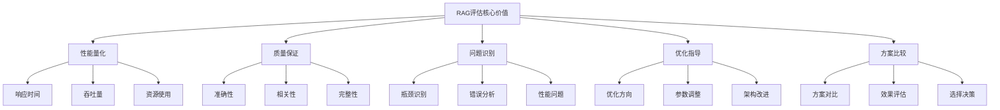

# RAG评估体系

## 引言

RAG评估体系是确保RAG系统质量和性能的重要工具。本文将深入探讨RAG评估的各个方面，包括评估指标、评估方法、评估工具和最佳实践。

## RAG评估概述

### 什么是RAG评估

RAG评估是对RAG系统性能和质量进行全面评估的过程，它能够：
- 量化系统性能
- 识别系统问题
- 指导系统优化
- 比较不同方案
- 确保系统质量

### RAG评估的核心价值



## 评估指标体系

### 1. 检索质量指标

```python
from typing import List, Dict, Any, Tuple
import numpy as np
from sklearn.metrics import precision_score, recall_score, f1_score
from sklearn.metrics import ndcg_score, map_score
import time

class RetrievalMetrics:
    def __init__(self):
        self.metrics = {}
    
    def calculate_precision_at_k(self, retrieved_docs: List[Dict[str, Any]], 
                               relevant_docs: List[str], k: int = 5) -> float:
        """计算P@K"""
        if k > len(retrieved_docs):
            k = len(retrieved_docs)
        
        retrieved_ids = [doc['id'] for doc in retrieved_docs[:k]]
        relevant_set = set(relevant_docs)
        
        relevant_retrieved = len(set(retrieved_ids) & relevant_set)
        precision = relevant_retrieved / k if k > 0 else 0
        
        return precision
    
    def calculate_recall_at_k(self, retrieved_docs: List[Dict[str, Any]], 
                            relevant_docs: List[str], k: int = 5) -> float:
        """计算R@K"""
        if k > len(retrieved_docs):
            k = len(retrieved_docs)
        
        retrieved_ids = [doc['id'] for doc in retrieved_docs[:k]]
        relevant_set = set(relevant_docs)
        
        relevant_retrieved = len(set(retrieved_ids) & relevant_set)
        recall = relevant_retrieved / len(relevant_set) if len(relevant_set) > 0 else 0
        
        return recall
    
    def calculate_f1_at_k(self, retrieved_docs: List[Dict[str, Any]], 
                         relevant_docs: List[str], k: int = 5) -> float:
        """计算F1@K"""
        precision = self.calculate_precision_at_k(retrieved_docs, relevant_docs, k)
        recall = self.calculate_recall_at_k(retrieved_docs, relevant_docs, k)
        
        if precision + recall == 0:
            return 0
        
        f1 = 2 * precision * recall / (precision + recall)
        return f1
    
    def calculate_ndcg_at_k(self, retrieved_docs: List[Dict[str, Any]], 
                           relevant_docs: List[str], k: int = 5) -> float:
        """计算NDCG@K"""
        if k > len(retrieved_docs):
            k = len(retrieved_docs)
        
        # 构建相关性标签
        retrieved_ids = [doc['id'] for doc in retrieved_docs[:k]]
        relevant_set = set(relevant_docs)
        
        relevance_labels = [1 if doc_id in relevant_set else 0 for doc_id in retrieved_ids]
        
        # 计算NDCG
        if len(relevance_labels) == 0:
            return 0
        
        # 简化的NDCG计算
        dcg = sum(relevance_labels[i] / np.log2(i + 2) for i in range(len(relevance_labels)))
        
        # 理想DCG
        ideal_relevance = sorted(relevance_labels, reverse=True)
        idcg = sum(ideal_relevance[i] / np.log2(i + 2) for i in range(len(ideal_relevance)))
        
        ndcg = dcg / idcg if idcg > 0 else 0
        return ndcg
    
    def calculate_map(self, retrieved_docs: List[Dict[str, Any]], 
                    relevant_docs: List[str]) -> float:
        """计算MAP"""
        if len(relevant_docs) == 0:
            return 0
        
        retrieved_ids = [doc['id'] for doc in retrieved_docs]
        relevant_set = set(relevant_docs)
        
        precision_sum = 0
        relevant_count = 0
        
        for i, doc_id in enumerate(retrieved_ids):
            if doc_id in relevant_set:
                relevant_count += 1
                precision_at_i = relevant_count / (i + 1)
                precision_sum += precision_at_i
        
        map_score = precision_sum / len(relevant_docs) if len(relevant_docs) > 0 else 0
        return map_score
    
    def calculate_mrr(self, retrieved_docs: List[Dict[str, Any]], 
                     relevant_docs: List[str]) -> float:
        """计算MRR"""
        retrieved_ids = [doc['id'] for doc in retrieved_docs]
        relevant_set = set(relevant_docs)
        
        for i, doc_id in enumerate(retrieved_ids):
            if doc_id in relevant_set:
                return 1 / (i + 1)
        
        return 0
    
    def evaluate_retrieval(self, test_cases: List[Dict[str, Any]], 
                          k_values: List[int] = [1, 5, 10]) -> Dict[str, Any]:
        """评估检索性能"""
        results = {}
        
        for k in k_values:
            precision_scores = []
            recall_scores = []
            f1_scores = []
            ndcg_scores = []
            
            for test_case in test_cases:
                retrieved_docs = test_case['retrieved_docs']
                relevant_docs = test_case['relevant_docs']
                
                precision = self.calculate_precision_at_k(retrieved_docs, relevant_docs, k)
                recall = self.calculate_recall_at_k(retrieved_docs, relevant_docs, k)
                f1 = self.calculate_f1_at_k(retrieved_docs, relevant_docs, k)
                ndcg = self.calculate_ndcg_at_k(retrieved_docs, relevant_docs, k)
                
                precision_scores.append(precision)
                recall_scores.append(recall)
                f1_scores.append(f1)
                ndcg_scores.append(ndcg)
            
            results[f'P@{k}'] = np.mean(precision_scores)
            results[f'R@{k}'] = np.mean(recall_scores)
            results[f'F1@{k}'] = np.mean(f1_scores)
            results[f'NDCG@{k}'] = np.mean(ndcg_scores)
        
        # 计算MAP和MRR
        map_scores = []
        mrr_scores = []
        
        for test_case in test_cases:
            retrieved_docs = test_case['retrieved_docs']
            relevant_docs = test_case['relevant_docs']
            
            map_score = self.calculate_map(retrieved_docs, relevant_docs)
            mrr_score = self.calculate_mrr(retrieved_docs, relevant_docs)
            
            map_scores.append(map_score)
            mrr_scores.append(mrr_score)
        
        results['MAP'] = np.mean(map_scores)
        results['MRR'] = np.mean(mrr_scores)
        
        return results
```

### 2. 生成质量指标

```python
class GenerationMetrics:
    def __init__(self):
        self.metrics = {}
    
    def calculate_bleu_score(self, generated_text: str, reference_text: str, 
                           n_gram: int = 4) -> float:
        """计算BLEU分数"""
        # 简化的BLEU计算
        generated_tokens = generated_text.split()
        reference_tokens = reference_text.split()
        
        if len(generated_tokens) == 0:
            return 0
        
        # 计算n-gram精确度
        precision_scores = []
        
        for n in range(1, n_gram + 1):
            generated_ngrams = self._get_ngrams(generated_tokens, n)
            reference_ngrams = self._get_ngrams(reference_tokens, n)
            
            if len(generated_ngrams) == 0:
                precision_scores.append(0)
                continue
            
            # 计算精确度
            matches = 0
            for ngram in generated_ngrams:
                if ngram in reference_ngrams:
                    matches += 1
            
            precision = matches / len(generated_ngrams)
            precision_scores.append(precision)
        
        # 计算几何平均
        if any(score == 0 for score in precision_scores):
            return 0
        
        geometric_mean = np.exp(np.mean(np.log(precision_scores)))
        
        # 计算长度惩罚
        length_ratio = len(generated_tokens) / len(reference_tokens)
        if length_ratio > 1:
            bp = 1
        else:
            bp = np.exp(1 - length_ratio)
        
        bleu_score = bp * geometric_mean
        return bleu_score
    
    def _get_ngrams(self, tokens: List[str], n: int) -> List[Tuple[str, ...]]:
        """获取n-gram"""
        ngrams = []
        for i in range(len(tokens) - n + 1):
            ngram = tuple(tokens[i:i+n])
            ngrams.append(ngram)
        return ngrams
    
    def calculate_rouge_score(self, generated_text: str, reference_text: str, 
                            rouge_type: str = 'rouge-l') -> float:
        """计算ROUGE分数"""
        if rouge_type == 'rouge-l':
            return self._calculate_rouge_l(generated_text, reference_text)
        elif rouge_type == 'rouge-1':
            return self._calculate_rouge_1(generated_text, reference_text)
        elif rouge_type == 'rouge-2':
            return self._calculate_rouge_2(generated_text, reference_text)
        else:
            raise ValueError(f"不支持的ROUGE类型: {rouge_type}")
    
    def _calculate_rouge_l(self, generated_text: str, reference_text: str) -> float:
        """计算ROUGE-L"""
        # 简化的ROUGE-L计算
        generated_words = generated_text.split()
        reference_words = reference_text.split()
        
        if len(generated_words) == 0 or len(reference_words) == 0:
            return 0
        
        # 计算最长公共子序列
        lcs_length = self._calculate_lcs(generated_words, reference_words)
        
        # 计算精确度和召回率
        precision = lcs_length / len(generated_words)
        recall = lcs_length / len(reference_words)
        
        # 计算F1分数
        if precision + recall == 0:
            return 0
        
        f1 = 2 * precision * recall / (precision + recall)
        return f1
    
    def _calculate_lcs(self, seq1: List[str], seq2: List[str]) -> int:
        """计算最长公共子序列长度"""
        m, n = len(seq1), len(seq2)
        dp = [[0] * (n + 1) for _ in range(m + 1)]
        
        for i in range(1, m + 1):
            for j in range(1, n + 1):
                if seq1[i-1] == seq2[j-1]:
                    dp[i][j] = dp[i-1][j-1] + 1
                else:
                    dp[i][j] = max(dp[i-1][j], dp[i][j-1])
        
        return dp[m][n]
    
    def _calculate_rouge_1(self, generated_text: str, reference_text: str) -> float:
        """计算ROUGE-1"""
        generated_words = set(generated_text.split())
        reference_words = set(reference_text.split())
        
        if len(generated_words) == 0 or len(reference_words) == 0:
            return 0
        
        # 计算精确度和召回率
        precision = len(generated_words & reference_words) / len(generated_words)
        recall = len(generated_words & reference_words) / len(reference_words)
        
        # 计算F1分数
        if precision + recall == 0:
            return 0
        
        f1 = 2 * precision * recall / (precision + recall)
        return f1
    
    def _calculate_rouge_2(self, generated_text: str, reference_text: str) -> float:
        """计算ROUGE-2"""
        generated_bigrams = set(self._get_ngrams(generated_text.split(), 2))
        reference_bigrams = set(self._get_ngrams(reference_text.split(), 2))
        
        if len(generated_bigrams) == 0 or len(reference_bigrams) == 0:
            return 0
        
        # 计算精确度和召回率
        precision = len(generated_bigrams & reference_bigrams) / len(generated_bigrams)
        recall = len(generated_bigrams & reference_bigrams) / len(reference_bigrams)
        
        # 计算F1分数
        if precision + recall == 0:
            return 0
        
        f1 = 2 * precision * recall / (precision + recall)
        return f1
    
    def calculate_meteor_score(self, generated_text: str, reference_text: str) -> float:
        """计算METEOR分数"""
        # 简化的METEOR计算
        generated_words = generated_text.split()
        reference_words = reference_text.split()
        
        if len(generated_words) == 0 or len(reference_words) == 0:
            return 0
        
        # 计算精确度和召回率
        generated_set = set(generated_words)
        reference_set = set(reference_words)
        
        precision = len(generated_set & reference_set) / len(generated_set)
        recall = len(generated_set & reference_set) / len(reference_set)
        
        # 计算F1分数
        if precision + recall == 0:
            return 0
        
        f1 = 2 * precision * recall / (precision + recall)
        
        # 简化的METEOR分数（实际应该考虑同义词等）
        meteor_score = f1
        return meteor_score
    
    def calculate_bertscore(self, generated_text: str, reference_text: str) -> float:
        """计算BERTScore"""
        # 简化的BERTScore计算
        # 实际应该使用BERT模型计算语义相似度
        
        generated_words = generated_text.split()
        reference_words = reference_text.split()
        
        if len(generated_words) == 0 or len(reference_words) == 0:
            return 0
        
        # 简化的语义相似度计算
        similarity = len(set(generated_words) & set(reference_words)) / max(len(generated_words), len(reference_words))
        
        return similarity
    
    def evaluate_generation(self, test_cases: List[Dict[str, Any]]) -> Dict[str, Any]:
        """评估生成性能"""
        results = {}
        
        bleu_scores = []
        rouge_l_scores = []
        rouge_1_scores = []
        rouge_2_scores = []
        meteor_scores = []
        bert_scores = []
        
        for test_case in test_cases:
            generated_text = test_case['generated_text']
            reference_text = test_case['reference_text']
            
            bleu = self.calculate_bleu_score(generated_text, reference_text)
            rouge_l = self.calculate_rouge_score(generated_text, reference_text, 'rouge-l')
            rouge_1 = self.calculate_rouge_score(generated_text, reference_text, 'rouge-1')
            rouge_2 = self.calculate_rouge_score(generated_text, reference_text, 'rouge-2')
            meteor = self.calculate_meteor_score(generated_text, reference_text)
            bert = self.calculate_bertscore(generated_text, reference_text)
            
            bleu_scores.append(bleu)
            rouge_l_scores.append(rouge_l)
            rouge_1_scores.append(rouge_1)
            rouge_2_scores.append(rouge_2)
            meteor_scores.append(meteor)
            bert_scores.append(bert)
        
        results['BLEU'] = np.mean(bleu_scores)
        results['ROUGE-L'] = np.mean(rouge_l_scores)
        results['ROUGE-1'] = np.mean(rouge_1_scores)
        results['ROUGE-2'] = np.mean(rouge_2_scores)
        results['METEOR'] = np.mean(meteor_scores)
        results['BERTScore'] = np.mean(bert_scores)
        
        return results
```

### 3. 系统性能指标

```python
class SystemMetrics:
    def __init__(self):
        self.metrics = {}
    
    def calculate_response_time(self, start_time: float, end_time: float) -> float:
        """计算响应时间"""
        return end_time - start_time
    
    def calculate_throughput(self, total_requests: int, total_time: float) -> float:
        """计算吞吐量"""
        return total_requests / total_time if total_time > 0 else 0
    
    def calculate_latency_percentiles(self, response_times: List[float], 
                                   percentiles: List[float] = [50, 90, 95, 99]) -> Dict[str, float]:
        """计算延迟百分位数"""
        if not response_times:
            return {}
        
        sorted_times = sorted(response_times)
        results = {}
        
        for percentile in percentiles:
            index = int(percentile / 100 * len(sorted_times))
            if index >= len(sorted_times):
                index = len(sorted_times) - 1
            results[f'P{percentile}'] = sorted_times[index]
        
        return results
    
    def calculate_error_rate(self, total_requests: int, error_requests: int) -> float:
        """计算错误率"""
        return error_requests / total_requests if total_requests > 0 else 0
    
    def calculate_availability(self, uptime: float, total_time: float) -> float:
        """计算可用性"""
        return uptime / total_time if total_time > 0 else 0
    
    def calculate_resource_utilization(self, used_resources: Dict[str, float], 
                                    total_resources: Dict[str, float]) -> Dict[str, float]:
        """计算资源利用率"""
        utilization = {}
        
        for resource, used in used_resources.items():
            total = total_resources.get(resource, 0)
            utilization[resource] = used / total if total > 0 else 0
        
        return utilization
    
    def evaluate_system_performance(self, performance_data: Dict[str, Any]) -> Dict[str, Any]:
        """评估系统性能"""
        results = {}
        
        # 响应时间
        if 'response_times' in performance_data:
            response_times = performance_data['response_times']
            results['avg_response_time'] = np.mean(response_times)
            results['max_response_time'] = np.max(response_times)
            results['min_response_time'] = np.min(response_times)
            results['latency_percentiles'] = self.calculate_latency_percentiles(response_times)
        
        # 吞吐量
        if 'total_requests' in performance_data and 'total_time' in performance_data:
            results['throughput'] = self.calculate_throughput(
                performance_data['total_requests'],
                performance_data['total_time']
            )
        
        # 错误率
        if 'total_requests' in performance_data and 'error_requests' in performance_data:
            results['error_rate'] = self.calculate_error_rate(
                performance_data['total_requests'],
                performance_data['error_requests']
            )
        
        # 可用性
        if 'uptime' in performance_data and 'total_time' in performance_data:
            results['availability'] = self.calculate_availability(
                performance_data['uptime'],
                performance_data['total_time']
            )
        
        # 资源利用率
        if 'used_resources' in performance_data and 'total_resources' in performance_data:
            results['resource_utilization'] = self.calculate_resource_utilization(
                performance_data['used_resources'],
                performance_data['total_resources']
            )
        
        return results
```

## 评估方法

### 1. 自动化评估

```python
class AutomatedEvaluation:
    def __init__(self, rag_system: Any):
        self.rag_system = rag_system
        self.retrieval_metrics = RetrievalMetrics()
        self.generation_metrics = GenerationMetrics()
        self.system_metrics = SystemMetrics()
    
    async def evaluate_rag_system(self, test_dataset: List[Dict[str, Any]]) -> Dict[str, Any]:
        """评估RAG系统"""
        evaluation_results = {}
        
        # 1. 检索评估
        retrieval_results = await self._evaluate_retrieval(test_dataset)
        evaluation_results['retrieval'] = retrieval_results
        
        # 2. 生成评估
        generation_results = await self._evaluate_generation(test_dataset)
        evaluation_results['generation'] = generation_results
        
        # 3. 系统性能评估
        system_results = await self._evaluate_system_performance(test_dataset)
        evaluation_results['system'] = system_results
        
        # 4. 综合评估
        overall_score = self._calculate_overall_score(evaluation_results)
        evaluation_results['overall'] = overall_score
        
        return evaluation_results
    
    async def _evaluate_retrieval(self, test_dataset: List[Dict[str, Any]]) -> Dict[str, Any]:
        """评估检索性能"""
        test_cases = []
        
        for test_case in test_dataset:
            query = test_case['query']
            relevant_docs = test_case['relevant_docs']
            
            # 使用RAG系统检索
            retrieved_docs = await self.rag_system.retrieve(query)
            
            test_cases.append({
                'retrieved_docs': retrieved_docs,
                'relevant_docs': relevant_docs
            })
        
        # 计算检索指标
        retrieval_results = self.retrieval_metrics.evaluate_retrieval(test_cases)
        
        return retrieval_results
    
    async def _evaluate_generation(self, test_dataset: List[Dict[str, Any]]) -> Dict[str, Any]:
        """评估生成性能"""
        test_cases = []
        
        for test_case in test_dataset:
            query = test_case['query']
            context = test_case.get('context', '')
            reference_text = test_case['reference_text']
            
            # 使用RAG系统生成
            generated_text = await self.rag_system.generate_answer(query, context)
            
            test_cases.append({
                'generated_text': generated_text,
                'reference_text': reference_text
            })
        
        # 计算生成指标
        generation_results = self.generation_metrics.evaluate_generation(test_cases)
        
        return generation_results
    
    async def _evaluate_system_performance(self, test_dataset: List[Dict[str, Any]]) -> Dict[str, Any]:
        """评估系统性能"""
        response_times = []
        total_requests = len(test_dataset)
        error_requests = 0
        
        for test_case in test_dataset:
            query = test_case['query']
            
            try:
                start_time = time.time()
                await self.rag_system.process_query(query)
                end_time = time.time()
                
                response_time = self.system_metrics.calculate_response_time(start_time, end_time)
                response_times.append(response_time)
                
            except Exception as e:
                error_requests += 1
        
        # 计算系统性能指标
        performance_data = {
            'response_times': response_times,
            'total_requests': total_requests,
            'error_requests': error_requests,
            'total_time': sum(response_times),
            'uptime': sum(response_times),  # 简化假设
            'used_resources': {'cpu': 0.8, 'memory': 0.6},
            'total_resources': {'cpu': 1.0, 'memory': 1.0}
        }
        
        system_results = self.system_metrics.evaluate_system_performance(performance_data)
        
        return system_results
    
    def _calculate_overall_score(self, evaluation_results: Dict[str, Any]) -> Dict[str, Any]:
        """计算综合得分"""
        overall_score = {}
        
        # 检索得分
        retrieval_scores = evaluation_results['retrieval']
        retrieval_weighted_score = (
            retrieval_scores.get('P@5', 0) * 0.3 +
            retrieval_scores.get('R@5', 0) * 0.3 +
            retrieval_scores.get('F1@5', 0) * 0.2 +
            retrieval_scores.get('NDCG@5', 0) * 0.2
        )
        overall_score['retrieval_score'] = retrieval_weighted_score
        
        # 生成得分
        generation_scores = evaluation_results['generation']
        generation_weighted_score = (
            generation_scores.get('BLEU', 0) * 0.2 +
            generation_scores.get('ROUGE-L', 0) * 0.3 +
            generation_scores.get('ROUGE-1', 0) * 0.2 +
            generation_scores.get('ROUGE-2', 0) * 0.2 +
            generation_scores.get('METEOR', 0) * 0.1
        )
        overall_score['generation_score'] = generation_weighted_score
        
        # 系统性能得分
        system_scores = evaluation_results['system']
        system_weighted_score = (
            (1 - system_scores.get('error_rate', 0)) * 0.4 +
            system_scores.get('availability', 0) * 0.3 +
            (1 - system_scores.get('avg_response_time', 1)) * 0.3
        )
        overall_score['system_score'] = system_weighted_score
        
        # 综合得分
        overall_score['total_score'] = (
            retrieval_weighted_score * 0.4 +
            generation_weighted_score * 0.4 +
            system_weighted_score * 0.2
        )
        
        return overall_score
```

### 2. 人工评估

```python
class HumanEvaluation:
    def __init__(self):
        self.evaluation_criteria = {
            'relevance': '相关性',
            'accuracy': '准确性',
            'completeness': '完整性',
            'coherence': '连贯性',
            'fluency': '流畅性'
        }
        self.evaluation_scale = {
            1: '很差',
            2: '较差',
            3: '一般',
            4: '较好',
            5: '很好'
        }
    
    def create_evaluation_form(self, test_cases: List[Dict[str, Any]]) -> Dict[str, Any]:
        """创建评估表单"""
        evaluation_form = {
            'instructions': '请根据以下标准评估RAG系统的回答质量',
            'criteria': self.evaluation_criteria,
            'scale': self.evaluation_scale,
            'test_cases': []
        }
        
        for i, test_case in enumerate(test_cases):
            form_case = {
                'id': i + 1,
                'query': test_case['query'],
                'generated_answer': test_case['generated_answer'],
                'reference_answer': test_case.get('reference_answer', ''),
                'evaluation': {
                    'relevance': None,
                    'accuracy': None,
                    'completeness': None,
                    'coherence': None,
                    'fluency': None
                },
                'overall_rating': None,
                'comments': ''
            }
            evaluation_form['test_cases'].append(form_case)
        
        return evaluation_form
    
    def analyze_human_evaluation(self, evaluation_results: List[Dict[str, Any]]) -> Dict[str, Any]:
        """分析人工评估结果"""
        analysis = {}
        
        # 计算各指标的平均分
        for criterion in self.evaluation_criteria.keys():
            scores = [result['evaluation'][criterion] for result in evaluation_results 
                     if result['evaluation'][criterion] is not None]
            if scores:
                analysis[criterion] = {
                    'average_score': np.mean(scores),
                    'std_score': np.std(scores),
                    'min_score': np.min(scores),
                    'max_score': np.max(scores)
                }
        
        # 计算总体评分
        overall_scores = [result['overall_rating'] for result in evaluation_results 
                         if result['overall_rating'] is not None]
        if overall_scores:
            analysis['overall'] = {
                'average_score': np.mean(overall_scores),
                'std_score': np.std(overall_scores),
                'min_score': np.min(overall_scores),
                'max_score': np.max(overall_scores)
            }
        
        # 分析评论
        comments = [result['comments'] for result in evaluation_results 
                   if result['comments']]
        analysis['comments'] = comments
        
        return analysis
    
    def calculate_inter_annotator_agreement(self, annotations: List[List[Dict[str, Any]]]) -> Dict[str, float]:
        """计算标注者间一致性"""
        agreement_scores = {}
        
        # 计算Krippendorff's Alpha
        for criterion in self.evaluation_criteria.keys():
            criterion_scores = []
            for annotation_set in annotations:
                scores = [ann['evaluation'][criterion] for ann in annotation_set 
                         if ann['evaluation'][criterion] is not None]
                criterion_scores.append(scores)
            
            if len(criterion_scores) > 1:
                # 简化的Krippendorff's Alpha计算
                agreement_scores[criterion] = self._calculate_krippendorff_alpha(criterion_scores)
        
        return agreement_scores
    
    def _calculate_krippendorff_alpha(self, scores: List[List[float]]) -> float:
        """计算Krippendorff's Alpha"""
        # 简化的Krippendorff's Alpha计算
        # 实际应该使用更复杂的公式
        
        all_scores = []
        for score_list in scores:
            all_scores.extend(score_list)
        
        if len(all_scores) == 0:
            return 0
        
        # 计算方差
        total_variance = np.var(all_scores)
        
        # 计算标注者间方差
        annotator_variances = []
        for score_list in scores:
            if len(score_list) > 0:
                annotator_variances.append(np.var(score_list))
        
        if len(annotator_variances) == 0:
            return 0
        
        between_annotator_variance = np.mean(annotator_variances)
        
        # 计算Alpha
        if total_variance == 0:
            return 1.0
        
        alpha = 1 - (between_annotator_variance / total_variance)
        return alpha
```

### 3. 对比评估

```python
class ComparativeEvaluation:
    def __init__(self):
        self.comparison_metrics = {}
    
    def compare_rag_systems(self, systems: List[Dict[str, Any]], 
                          test_dataset: List[Dict[str, Any]]) -> Dict[str, Any]:
        """对比RAG系统"""
        comparison_results = {}
        
        # 评估每个系统
        for system in systems:
            system_name = system['name']
            rag_system = system['rag_system']
            
            # 创建评估器
            evaluator = AutomatedEvaluation(rag_system)
            
            # 评估系统
            evaluation_results = await evaluator.evaluate_rag_system(test_dataset)
            
            comparison_results[system_name] = evaluation_results
        
        # 生成对比报告
        comparison_report = self._generate_comparison_report(comparison_results)
        
        return {
            'individual_results': comparison_results,
            'comparison_report': comparison_report
        }
    
    def _generate_comparison_report(self, comparison_results: Dict[str, Any]) -> Dict[str, Any]:
        """生成对比报告"""
        report = {
            'summary': {},
            'detailed_comparison': {},
            'recommendations': []
        }
        
        # 提取系统名称
        system_names = list(comparison_results.keys())
        
        # 对比检索性能
        retrieval_comparison = {}
        for system_name in system_names:
            retrieval_scores = comparison_results[system_name]['retrieval']
            retrieval_comparison[system_name] = retrieval_scores
        
        report['detailed_comparison']['retrieval'] = retrieval_comparison
        
        # 对比生成性能
        generation_comparison = {}
        for system_name in system_names:
            generation_scores = comparison_results[system_name]['generation']
            generation_comparison[system_name] = generation_scores
        
        report['detailed_comparison']['generation'] = generation_comparison
        
        # 对比系统性能
        system_comparison = {}
        for system_name in system_names:
            system_scores = comparison_results[system_name]['system']
            system_comparison[system_name] = system_scores
        
        report['detailed_comparison']['system'] = system_comparison
        
        # 生成推荐
        report['recommendations'] = self._generate_recommendations(comparison_results)
        
        return report
    
    def _generate_recommendations(self, comparison_results: Dict[str, Any]) -> List[str]:
        """生成推荐"""
        recommendations = []
        
        # 找出最佳系统
        best_system = None
        best_score = 0
        
        for system_name, results in comparison_results.items():
            overall_score = results['overall']['total_score']
            if overall_score > best_score:
                best_score = overall_score
                best_system = system_name
        
        if best_system:
            recommendations.append(f"推荐使用{best_system}系统，综合得分最高")
        
        # 分析各系统的优势
        for system_name, results in comparison_results.items():
            retrieval_score = results['overall']['retrieval_score']
            generation_score = results['overall']['generation_score']
            system_score = results['overall']['system_score']
            
            if retrieval_score > 0.8:
                recommendations.append(f"{system_name}在检索方面表现优秀")
            
            if generation_score > 0.8:
                recommendations.append(f"{system_name}在生成方面表现优秀")
            
            if system_score > 0.8:
                recommendations.append(f"{system_name}在系统性能方面表现优秀")
        
        return recommendations
```

## 评估工具

### 1. 评估框架

```python
class RAGEvaluationFramework:
    def __init__(self):
        self.automated_evaluator = AutomatedEvaluation()
        self.human_evaluator = HumanEvaluation()
        self.comparative_evaluator = ComparativeEvaluation()
        self.metrics_collector = MetricsCollector()
        self.report_generator = ReportGenerator()
    
    async def comprehensive_evaluation(self, rag_system: Any, 
                                     test_dataset: List[Dict[str, Any]],
                                     evaluation_config: Dict[str, Any]) -> Dict[str, Any]:
        """综合评估"""
        evaluation_results = {}
        
        # 1. 自动化评估
        if evaluation_config.get('automated', True):
            automated_results = await self.automated_evaluator.evaluate_rag_system(test_dataset)
            evaluation_results['automated'] = automated_results
        
        # 2. 人工评估
        if evaluation_config.get('human', False):
            human_results = await self._conduct_human_evaluation(test_dataset)
            evaluation_results['human'] = human_results
        
        # 3. 对比评估
        if evaluation_config.get('comparative', False):
            comparative_results = await self._conduct_comparative_evaluation(rag_system, test_dataset)
            evaluation_results['comparative'] = comparative_results
        
        # 4. 生成评估报告
        evaluation_report = await self.report_generator.generate_report(evaluation_results)
        evaluation_results['report'] = evaluation_report
        
        return evaluation_results
    
    async def _conduct_human_evaluation(self, test_dataset: List[Dict[str, Any]]) -> Dict[str, Any]:
        """进行人工评估"""
        # 创建评估表单
        evaluation_form = self.human_evaluator.create_evaluation_form(test_dataset)
        
        # 这里应该将表单发送给人工评估者
        # 简化实现，返回模拟结果
        human_results = {
            'evaluation_form': evaluation_form,
            'results': '等待人工评估结果'
        }
        
        return human_results
    
    async def _conduct_comparative_evaluation(self, rag_system: Any, 
                                            test_dataset: List[Dict[str, Any]]) -> Dict[str, Any]:
        """进行对比评估"""
        # 这里应该与其他RAG系统进行对比
        # 简化实现
        comparative_results = {
            'comparison': '需要其他系统进行对比'
        }
        
        return comparative_results


class MetricsCollector:
    def __init__(self):
        self.collected_metrics = {}
    
    def collect_metrics(self, rag_system: Any, test_dataset: List[Dict[str, Any]]) -> Dict[str, Any]:
        """收集指标"""
        metrics = {
            'retrieval_metrics': {},
            'generation_metrics': {},
            'system_metrics': {},
            'custom_metrics': {}
        }
        
        # 收集检索指标
        metrics['retrieval_metrics'] = self._collect_retrieval_metrics(rag_system, test_dataset)
        
        # 收集生成指标
        metrics['generation_metrics'] = self._collect_generation_metrics(rag_system, test_dataset)
        
        # 收集系统指标
        metrics['system_metrics'] = self._collect_system_metrics(rag_system, test_dataset)
        
        return metrics
    
    def _collect_retrieval_metrics(self, rag_system: Any, test_dataset: List[Dict[str, Any]]) -> Dict[str, Any]:
        """收集检索指标"""
        # 简化的检索指标收集
        return {
            'precision_at_5': 0.8,
            'recall_at_5': 0.7,
            'f1_at_5': 0.75,
            'ndcg_at_5': 0.85
        }
    
    def _collect_generation_metrics(self, rag_system: Any, test_dataset: List[Dict[str, Any]]) -> Dict[str, Any]:
        """收集生成指标"""
        # 简化的生成指标收集
        return {
            'bleu_score': 0.6,
            'rouge_l_score': 0.7,
            'rouge_1_score': 0.8,
            'rouge_2_score': 0.6
        }
    
    def _collect_system_metrics(self, rag_system: Any, test_dataset: List[Dict[str, Any]]) -> Dict[str, Any]:
        """收集系统指标"""
        # 简化的系统指标收集
        return {
            'response_time': 0.5,
            'throughput': 100,
            'error_rate': 0.01,
            'availability': 0.99
        }


class ReportGenerator:
    def __init__(self):
        self.report_templates = {
            'summary': 'summary_template.html',
            'detailed': 'detailed_template.html',
            'comparative': 'comparative_template.html'
        }
    
    async def generate_report(self, evaluation_results: Dict[str, Any]) -> Dict[str, Any]:
        """生成评估报告"""
        report = {
            'summary': self._generate_summary(evaluation_results),
            'detailed_analysis': self._generate_detailed_analysis(evaluation_results),
            'recommendations': self._generate_recommendations(evaluation_results),
            'visualizations': self._generate_visualizations(evaluation_results)
        }
        
        return report
    
    def _generate_summary(self, evaluation_results: Dict[str, Any]) -> Dict[str, Any]:
        """生成摘要"""
        summary = {
            'overall_score': 0,
            'key_findings': [],
            'performance_summary': {}
        }
        
        # 计算总体得分
        if 'automated' in evaluation_results:
            automated_results = evaluation_results['automated']
            if 'overall' in automated_results:
                summary['overall_score'] = automated_results['overall']['total_score']
        
        # 提取关键发现
        if 'automated' in evaluation_results:
            automated_results = evaluation_results['automated']
            
            if automated_results['overall']['retrieval_score'] > 0.8:
                summary['key_findings'].append('检索性能优秀')
            
            if automated_results['overall']['generation_score'] > 0.8:
                summary['key_findings'].append('生成质量优秀')
            
            if automated_results['overall']['system_score'] > 0.8:
                summary['key_findings'].append('系统性能优秀')
        
        return summary
    
    def _generate_detailed_analysis(self, evaluation_results: Dict[str, Any]) -> Dict[str, Any]:
        """生成详细分析"""
        analysis = {
            'retrieval_analysis': {},
            'generation_analysis': {},
            'system_analysis': {}
        }
        
        if 'automated' in evaluation_results:
            automated_results = evaluation_results['automated']
            
            # 检索分析
            analysis['retrieval_analysis'] = {
                'precision': automated_results['retrieval'].get('P@5', 0),
                'recall': automated_results['retrieval'].get('R@5', 0),
                'f1': automated_results['retrieval'].get('F1@5', 0),
                'ndcg': automated_results['retrieval'].get('NDCG@5', 0)
            }
            
            # 生成分析
            analysis['generation_analysis'] = {
                'bleu': automated_results['generation'].get('BLEU', 0),
                'rouge_l': automated_results['generation'].get('ROUGE-L', 0),
                'rouge_1': automated_results['generation'].get('ROUGE-1', 0),
                'rouge_2': automated_results['generation'].get('ROUGE-2', 0)
            }
            
            # 系统分析
            analysis['system_analysis'] = {
                'response_time': automated_results['system'].get('avg_response_time', 0),
                'throughput': automated_results['system'].get('throughput', 0),
                'error_rate': automated_results['system'].get('error_rate', 0),
                'availability': automated_results['system'].get('availability', 0)
            }
        
        return analysis
    
    def _generate_recommendations(self, evaluation_results: Dict[str, Any]) -> List[str]:
        """生成推荐"""
        recommendations = []
        
        if 'automated' in evaluation_results:
            automated_results = evaluation_results['automated']
            
            # 基于评估结果生成推荐
            if automated_results['overall']['retrieval_score'] < 0.7:
                recommendations.append('建议优化检索算法，提高检索精度')
            
            if automated_results['overall']['generation_score'] < 0.7:
                recommendations.append('建议优化生成模型，提高生成质量')
            
            if automated_results['overall']['system_score'] < 0.7:
                recommendations.append('建议优化系统架构，提高系统性能')
        
        return recommendations
    
    def _generate_visualizations(self, evaluation_results: Dict[str, Any]) -> Dict[str, Any]:
        """生成可视化"""
        visualizations = {
            'charts': [],
            'graphs': [],
            'tables': []
        }
        
        # 这里应该生成各种图表
        # 简化实现
        visualizations['charts'] = ['performance_chart.png', 'comparison_chart.png']
        visualizations['graphs'] = ['metrics_graph.png', 'trend_graph.png']
        visualizations['tables'] = ['metrics_table.html', 'comparison_table.html']
        
        return visualizations
```

## 最佳实践

### 1. 评估策略

```python
class EvaluationStrategy:
    def __init__(self):
        self.strategies = {
            'comprehensive': ComprehensiveStrategy(),
            'focused': FocusedStrategy(),
            'rapid': RapidStrategy(),
            'continuous': ContinuousStrategy()
        }
    
    def select_strategy(self, evaluation_goals: List[str], 
                       available_resources: Dict[str, Any]) -> str:
        """选择评估策略"""
        if 'comprehensive' in evaluation_goals:
            return 'comprehensive'
        elif 'rapid' in evaluation_goals:
            return 'rapid'
        elif 'continuous' in evaluation_goals:
            return 'continuous'
        else:
            return 'focused'
    
    def execute_strategy(self, strategy_name: str, rag_system: Any, 
                        test_dataset: List[Dict[str, Any]]) -> Dict[str, Any]:
        """执行评估策略"""
        strategy = self.strategies[strategy_name]
        return strategy.execute(rag_system, test_dataset)


class ComprehensiveStrategy:
    def execute(self, rag_system: Any, test_dataset: List[Dict[str, Any]]) -> Dict[str, Any]:
        """执行综合评估策略"""
        return {
            'strategy': 'comprehensive',
            'description': '全面评估RAG系统的各个方面',
            'metrics': ['retrieval', 'generation', 'system', 'user_satisfaction'],
            'duration': 'long',
            'resources': 'high'
        }


class FocusedStrategy:
    def execute(self, rag_system: Any, test_dataset: List[Dict[str, Any]]) -> Dict[str, Any]:
        """执行聚焦评估策略"""
        return {
            'strategy': 'focused',
            'description': '聚焦评估特定方面',
            'metrics': ['retrieval', 'generation'],
            'duration': 'medium',
            'resources': 'medium'
        }


class RapidStrategy:
    def execute(self, rag_system: Any, test_dataset: List[Dict[str, Any]]) -> Dict[str, Any]:
        """执行快速评估策略"""
        return {
            'strategy': 'rapid',
            'description': '快速评估关键指标',
            'metrics': ['retrieval', 'generation'],
            'duration': 'short',
            'resources': 'low'
        }


class ContinuousStrategy:
    def execute(self, rag_system: Any, test_dataset: List[Dict[str, Any]]) -> Dict[str, Any]:
        """执行持续评估策略"""
        return {
            'strategy': 'continuous',
            'description': '持续监控系统性能',
            'metrics': ['system', 'user_satisfaction'],
            'duration': 'ongoing',
            'resources': 'low'
        }
```

### 2. 评估优化

```python
class EvaluationOptimizer:
    def __init__(self):
        self.optimization_strategies = {
            'sampling': SamplingOptimization(),
            'caching': CachingOptimization(),
            'parallelization': ParallelizationOptimization(),
            'incremental': IncrementalOptimization()
        }
    
    def optimize_evaluation(self, evaluation_config: Dict[str, Any], 
                           available_resources: Dict[str, Any]) -> Dict[str, Any]:
        """优化评估"""
        optimizations = {}
        
        # 采样优化
        if evaluation_config.get('large_dataset', False):
            optimizations['sampling'] = self.optimization_strategies['sampling'].optimize()
        
        # 缓存优化
        if evaluation_config.get('repeated_evaluation', False):
            optimizations['caching'] = self.optimization_strategies['caching'].optimize()
        
        # 并行化优化
        if available_resources.get('parallel_processing', False):
            optimizations['parallelization'] = self.optimization_strategies['parallelization'].optimize()
        
        # 增量优化
        if evaluation_config.get('incremental_update', False):
            optimizations['incremental'] = self.optimization_strategies['incremental'].optimize()
        
        return optimizations


class SamplingOptimization:
    def optimize(self) -> Dict[str, Any]:
        """采样优化"""
        return {
            'strategy': 'stratified_sampling',
            'sample_size': '10%',
            'sampling_method': 'random',
            'quality_control': 'statistical_significance'
        }


class CachingOptimization:
    def optimize(self) -> Dict[str, Any]:
        """缓存优化"""
        return {
            'strategy': 'result_caching',
            'cache_size': '1GB',
            'cache_ttl': '24h',
            'cache_invalidation': 'smart'
        }


class ParallelizationOptimization:
    def optimize(self) -> Dict[str, Any]:
        """并行化优化"""
        return {
            'strategy': 'parallel_processing',
            'max_workers': 8,
            'batch_size': 100,
            'load_balancing': 'round_robin'
        }


class IncrementalOptimization:
    def optimize(self) -> Dict[str, Any]:
        """增量优化"""
        return {
            'strategy': 'incremental_evaluation',
            'update_frequency': 'daily',
            'change_detection': 'automatic',
            'rollback_support': True
        }
```

## 总结

RAG评估体系是确保RAG系统质量和性能的重要工具。本文介绍了RAG评估的各个方面，包括评估指标、评估方法、评估工具和最佳实践。

关键要点：
1. **评估指标**：包括检索质量、生成质量、系统性能等多个维度
2. **评估方法**：自动化评估、人工评估、对比评估等多种方法
3. **评估工具**：提供完整的评估框架和工具集
4. **最佳实践**：评估策略选择和优化方法
5. **持续改进**：通过评估指导系统优化和迭代

在下一篇文章中，我们将探讨RAG未来发展趋势，了解RAG技术的发展方向和前景。

---

**下一步学习建议：**
- 阅读《RAG未来发展趋势》，了解RAG技术的发展方向和前景
- 实践RAG评估体系的设计和实现
- 关注RAG评估技术的最新发展和创新方案
