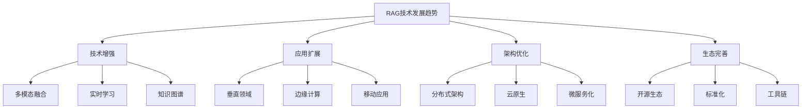

# RAG未来发展趋势

## 引言

RAG技术作为人工智能领域的重要发展方向，正在快速演进。本文将深入探讨RAG技术的未来发展趋势，包括技术发展方向、应用前景和挑战。

## RAG技术发展趋势

### 1. 技术发展方向



### 2. 核心发展趋势

#### 2.1 多模态RAG

```python
class MultimodalRAGTrends:
    def __init__(self):
        self.trends = {
            'vision_language': '视觉语言融合',
            'audio_text': '音频文本结合',
            'video_understanding': '视频理解',
            'multimodal_reasoning': '多模态推理'
        }
    
    def analyze_vision_language_trends(self) -> Dict[str, Any]:
        """分析视觉语言融合趋势"""
        return {
            'current_state': '基础融合',
            'future_direction': '深度理解',
            'key_technologies': [
                'CLIP模型',
                'DALL-E生成',
                '视觉问答',
                '图像描述生成'
            ],
            'challenges': [
                '跨模态对齐',
                '语义理解',
                '实时处理',
                '计算资源'
            ],
            'applications': [
                '智能客服',
                '教育辅助',
                '医疗诊断',
                '内容创作'
            ]
        }
    
    def analyze_audio_text_trends(self) -> Dict[str, Any]:
        """分析音频文本结合趋势"""
        return {
            'current_state': '语音识别',
            'future_direction': '语音理解',
            'key_technologies': [
                '语音合成',
                '语音识别',
                '语音情感分析',
                '语音搜索'
            ],
            'challenges': [
                '噪声处理',
                '多语言支持',
                '实时性要求',
                '隐私保护'
            ],
            'applications': [
                '语音助手',
                '会议记录',
                '语言学习',
                '无障碍服务'
            ]
        }
    
    def analyze_video_understanding_trends(self) -> Dict[str, Any]:
        """分析视频理解趋势"""
        return {
            'current_state': '视频分析',
            'future_direction': '视频理解',
            'key_technologies': [
                '视频分割',
                '动作识别',
                '场景理解',
                '视频生成'
            ],
            'challenges': [
                '计算复杂度',
                '实时处理',
                '长视频理解',
                '多视角融合'
            ],
            'applications': [
                '视频搜索',
                '内容审核',
                '智能监控',
                '视频编辑'
            ]
        }
```

#### 2.2 实时学习与适应

```python
class RealTimeLearningTrends:
    def __init__(self):
        self.trends = {
            'online_learning': '在线学习',
            'few_shot_learning': '少样本学习',
            'continual_learning': '持续学习',
            'meta_learning': '元学习'
        }
    
    def analyze_online_learning_trends(self) -> Dict[str, Any]:
        """分析在线学习趋势"""
        return {
            'current_state': '批量学习',
            'future_direction': '流式学习',
            'key_technologies': [
                '增量学习',
                '在线优化',
                '模型更新',
                '知识蒸馏'
            ],
            'challenges': [
                '灾难性遗忘',
                '学习稳定性',
                '计算效率',
                '数据质量'
            ],
            'applications': [
                '个性化推荐',
                '实时搜索',
                '动态问答',
                '自适应系统'
            ]
        }
    
    def analyze_few_shot_learning_trends(self) -> Dict[str, Any]:
        """分析少样本学习趋势"""
        return {
            'current_state': '大量数据训练',
            'future_direction': '少量数据学习',
            'key_technologies': [
                '原型网络',
                '匹配网络',
                '关系网络',
                '元学习'
            ],
            'challenges': [
                '泛化能力',
                '学习效率',
                '任务适应',
                '知识迁移'
            ],
            'applications': [
                '新领域适应',
                '快速部署',
                '个性化服务',
                '边缘计算'
            ]
        }
    
    def analyze_continual_learning_trends(self) -> Dict[str, Any]:
        """分析持续学习趋势"""
        return {
            'current_state': '静态模型',
            'future_direction': '动态适应',
            'key_technologies': [
                '弹性权重巩固',
                '渐进式网络',
                '知识回放',
                '参数隔离'
            ],
            'challenges': [
                '遗忘问题',
                '知识冲突',
                '计算开销',
                '评估指标'
            ],
            'applications': [
                '长期服务',
                '知识积累',
                '系统演进',
                '智能升级'
            ]
        }
```

#### 2.3 知识图谱增强

```python
class KnowledgeGraphTrends:
    def __init__(self):
        self.trends = {
            'graph_neural_networks': '图神经网络',
            'knowledge_fusion': '知识融合',
            'reasoning_enhancement': '推理增强',
            'dynamic_graphs': '动态图谱'
        }
    
    def analyze_graph_neural_networks_trends(self) -> Dict[str, Any]:
        """分析图神经网络趋势"""
        return {
            'current_state': '基础GNN',
            'future_direction': '深度图学习',
            'key_technologies': [
                'GraphSAGE',
                'GAT',
                'GraphTransformer',
                '异构图学习'
            ],
            'challenges': [
                '图规模',
                '计算效率',
                '表示学习',
                '可解释性'
            ],
            'applications': [
                '知识推理',
                '关系预测',
                '实体链接',
                '图生成'
            ]
        }
    
    def analyze_knowledge_fusion_trends(self) -> Dict[str, Any]:
        """分析知识融合趋势"""
        return {
            'current_state': '单一知识源',
            'future_direction': '多源融合',
            'key_technologies': [
                '知识对齐',
                '冲突解决',
                '质量评估',
                '融合策略'
            ],
            'challenges': [
                '知识冲突',
                '质量差异',
                '融合策略',
                '一致性保证'
            ],
            'applications': [
                '多源问答',
                '知识补全',
                '智能推荐',
                '决策支持'
            ]
        }
    
    def analyze_reasoning_enhancement_trends(self) -> Dict[str, Any]:
        """分析推理增强趋势"""
        return {
            'current_state': '基础推理',
            'future_direction': '深度推理',
            'key_technologies': [
                '符号推理',
                '神经推理',
                '混合推理',
                '因果推理'
            ],
            'challenges': [
                '推理复杂度',
                '可解释性',
                '推理效率',
                '知识表示'
            ],
            'applications': [
                '复杂问答',
                '逻辑推理',
                '因果分析',
                '决策支持'
            ]
        }
```

## 应用领域扩展

### 1. 垂直领域应用

```python
class VerticalDomainTrends:
    def __init__(self):
        self.domains = {
            'healthcare': '医疗健康',
            'finance': '金融服务',
            'education': '教育培训',
            'legal': '法律服务',
            'manufacturing': '制造业',
            'retail': '零售电商'
        }
    
    def analyze_healthcare_trends(self) -> Dict[str, Any]:
        """分析医疗健康趋势"""
        return {
            'current_applications': [
                '医疗问答',
                '病历分析',
                '药物推荐',
                '诊断辅助'
            ],
            'future_directions': [
                '个性化治疗',
                '精准医疗',
                '远程诊断',
                '健康监测'
            ],
            'key_technologies': [
                '医学知识图谱',
                '多模态医疗数据',
                '隐私保护计算',
                '联邦学习'
            ],
            'challenges': [
                '数据隐私',
                '监管合规',
                '准确性要求',
                '伦理问题'
            ],
            'market_potential': 'high'
        }
    
    def analyze_finance_trends(self) -> Dict[str, Any]:
        """分析金融服务趋势"""
        return {
            'current_applications': [
                '智能客服',
                '风险评估',
                '投资建议',
                '合规检查'
            ],
            'future_directions': [
                '个性化理财',
                '智能投顾',
                '风险预测',
                '反欺诈'
            ],
            'key_technologies': [
                '金融知识图谱',
                '实时数据处理',
                '风险模型',
                '合规引擎'
            ],
            'challenges': [
                '数据安全',
                '监管要求',
                '风险控制',
                '实时性'
            ],
            'market_potential': 'high'
        }
    
    def analyze_education_trends(self) -> Dict[str, Any]:
        """分析教育培训趋势"""
        return {
            'current_applications': [
                '智能答疑',
                '个性化学习',
                '作业批改',
                '学习推荐'
            ],
            'future_directions': [
                '自适应学习',
                '虚拟导师',
                '知识图谱学习',
                '多模态教学'
            ],
            'key_technologies': [
                '教育知识图谱',
                '学习分析',
                '个性化推荐',
                '多模态交互'
            ],
            'challenges': [
                '个性化程度',
                '学习效果评估',
                '内容质量',
                '技术普及'
            ],
            'market_potential': 'medium'
        }
    
    def analyze_legal_trends(self) -> Dict[str, Any]:
        """分析法律服务趋势"""
        return {
            'current_applications': [
                '法律问答',
                '合同分析',
                '案例检索',
                '合规检查'
            ],
            'future_directions': [
                '智能法律顾问',
                '自动化合同',
                '法律预测',
                '智能诉讼'
            ],
            'key_technologies': [
                '法律知识图谱',
                '自然语言处理',
                '法律推理',
                '案例匹配'
            ],
            'challenges': [
                '法律复杂性',
                '准确性要求',
                '伦理问题',
                '监管合规'
            ],
            'market_potential': 'medium'
        }
```

### 2. 边缘计算与移动应用

```python
class EdgeComputingTrends:
    def __init__(self):
        self.trends = {
            'edge_rag': '边缘RAG',
            'mobile_rag': '移动RAG',
            'iot_rag': '物联网RAG',
            'distributed_rag': '分布式RAG'
        }
    
    def analyze_edge_rag_trends(self) -> Dict[str, Any]:
        """分析边缘RAG趋势"""
        return {
            'current_state': '云端处理',
            'future_direction': '边缘智能',
            'key_technologies': [
                '模型压缩',
                '量化技术',
                '知识蒸馏',
                '边缘推理'
            ],
            'challenges': [
                '计算资源限制',
                '模型精度',
                '实时性要求',
                '资源管理'
            ],
            'applications': [
                '智能设备',
                '实时推荐',
                '本地搜索',
                '隐私保护'
            ],
            'benefits': [
                '低延迟',
                '隐私保护',
                '离线工作',
                '成本降低'
            ]
        }
    
    def analyze_mobile_rag_trends(self) -> Dict[str, Any]:
        """分析移动RAG趋势"""
        return {
            'current_state': '云端依赖',
            'future_direction': '本地智能',
            'key_technologies': [
                '移动优化',
                '轻量级模型',
                '本地存储',
                '混合架构'
            ],
            'challenges': [
                '存储限制',
                '电池消耗',
                '网络依赖',
                '性能优化'
            ],
            'applications': [
                '移动搜索',
                '个人助手',
                '离线问答',
                '智能推荐'
            ],
            'benefits': [
                '即时响应',
                '隐私保护',
                '离线可用',
                '个性化'
            ]
        }
    
    def analyze_iot_rag_trends(self) -> Dict[str, Any]:
        """分析物联网RAG趋势"""
        return {
            'current_state': '数据收集',
            'future_direction': '智能分析',
            'key_technologies': [
                '传感器融合',
                '实时处理',
                '边缘计算',
                '数据压缩'
            ],
            'challenges': [
                '数据质量',
                '实时处理',
                '资源限制',
                '网络延迟'
            ],
            'applications': [
                '智能家居',
                '工业监控',
                '环境监测',
                '健康监测'
            ],
            'benefits': [
                '实时响应',
                '本地处理',
                '数据隐私',
                '成本效益'
            ]
        }
```

## 技术挑战与解决方案

### 1. 技术挑战

```python
class TechnicalChallenges:
    def __init__(self):
        self.challenges = {
            'scalability': '可扩展性',
            'real_time': '实时性',
            'accuracy': '准确性',
            'privacy': '隐私保护',
            'interpretability': '可解释性',
            'efficiency': '效率优化'
        }
    
    def analyze_scalability_challenges(self) -> Dict[str, Any]:
        """分析可扩展性挑战"""
        return {
            'challenge': '大规模数据处理',
            'current_limitations': [
                '存储容量限制',
                '计算资源不足',
                '网络带宽瓶颈',
                '查询响应延迟'
            ],
            'solutions': [
                '分布式架构',
                '数据分片',
                '缓存优化',
                '负载均衡'
            ],
            'future_directions': [
                '云原生架构',
                '边缘计算',
                '联邦学习',
                '量子计算'
            ]
        }
    
    def analyze_real_time_challenges(self) -> Dict[str, Any]:
        """分析实时性挑战"""
        return {
            'challenge': '实时响应要求',
            'current_limitations': [
                '处理延迟',
                '网络延迟',
                '模型推理时间',
                '数据更新延迟'
            ],
            'solutions': [
                '流式处理',
                '预计算',
                '模型优化',
                '边缘部署'
            ],
            'future_directions': [
                '实时学习',
                '增量更新',
                '预测缓存',
                '硬件加速'
            ]
        }
    
    def analyze_accuracy_challenges(self) -> Dict[str, Any]:
        """分析准确性挑战"""
        return {
            'challenge': '高精度要求',
            'current_limitations': [
                '知识不完整',
                '数据质量',
                '模型偏差',
                '评估困难'
            ],
            'solutions': [
                '知识图谱',
                '数据清洗',
                '模型集成',
                '持续评估'
            ],
            'future_directions': [
                '多模态融合',
                '因果推理',
                '不确定性量化',
                '自适应学习'
            ]
        }
    
    def analyze_privacy_challenges(self) -> Dict[str, Any]:
        """分析隐私保护挑战"""
        return {
            'challenge': '隐私保护要求',
            'current_limitations': [
                '数据泄露风险',
                '隐私计算开销',
                '合规要求',
                '用户信任'
            ],
            'solutions': [
                '联邦学习',
                '差分隐私',
                '同态加密',
                '安全多方计算'
            ],
            'future_directions': [
                '隐私保护RAG',
                '本地化处理',
                '隐私增强技术',
                '可信计算'
            ]
        }
    
    def analyze_interpretability_challenges(self) -> Dict[str, Any]:
        """分析可解释性挑战"""
        return {
            'challenge': '可解释性要求',
            'current_limitations': [
                '黑盒模型',
                '推理过程不透明',
                '决策依据不明',
                '用户理解困难'
            ],
            'solutions': [
                '注意力机制',
                '知识图谱',
                '因果分析',
                '可视化工具'
            ],
            'future_directions': [
                '可解释AI',
                '因果推理',
                '知识驱动',
                '人机协作'
            ]
        }
    
    def analyze_efficiency_challenges(self) -> Dict[str, Any]:
        """分析效率优化挑战"""
        return {
            'challenge': '效率优化需求',
            'current_limitations': [
                '计算资源消耗',
                '存储空间需求',
                '网络带宽占用',
                '能耗问题'
            ],
            'solutions': [
                '模型压缩',
                '量化技术',
                '知识蒸馏',
                '硬件优化'
            ],
            'future_directions': [
                '神经架构搜索',
                '自动化优化',
                '硬件协同设计',
                '绿色计算'
            ]
        }
```

### 2. 解决方案

```python
class SolutionStrategies:
    def __init__(self):
        self.strategies = {
            'architectural': '架构优化',
            'algorithmic': '算法改进',
            'hardware': '硬件加速',
            'software': '软件优化'
        }
    
    def analyze_architectural_solutions(self) -> Dict[str, Any]:
        """分析架构解决方案"""
        return {
            'distributed_architecture': {
                'description': '分布式架构',
                'benefits': ['可扩展性', '容错性', '负载均衡'],
                'challenges': ['一致性', '网络延迟', '管理复杂度'],
                'applications': ['大规模系统', '高并发场景']
            },
            'microservices_architecture': {
                'description': '微服务架构',
                'benefits': ['模块化', '独立部署', '技术多样性'],
                'challenges': ['服务治理', '数据一致性', '网络开销'],
                'applications': ['复杂系统', '快速迭代']
            },
            'edge_cloud_architecture': {
                'description': '边缘云架构',
                'benefits': ['低延迟', '隐私保护', '离线工作'],
                'challenges': ['资源管理', '数据同步', '一致性'],
                'applications': ['实时应用', '移动应用']
            }
        }
    
    def analyze_algorithmic_solutions(self) -> Dict[str, Any]:
        """分析算法解决方案"""
        return {
            'efficient_retrieval': {
                'description': '高效检索算法',
                'techniques': ['近似最近邻', '哈希索引', '倒排索引'],
                'benefits': ['快速检索', '内存效率', '可扩展性'],
                'applications': ['大规模搜索', '实时推荐']
            },
            'model_compression': {
                'description': '模型压缩技术',
                'techniques': ['剪枝', '量化', '知识蒸馏'],
                'benefits': ['模型大小', '推理速度', '部署成本'],
                'applications': ['移动部署', '边缘计算']
            },
            'incremental_learning': {
                'description': '增量学习算法',
                'techniques': ['在线学习', '持续学习', '元学习'],
                'benefits': ['实时更新', '知识积累', '适应能力'],
                'applications': ['动态系统', '个性化服务']
            }
        }
    
    def analyze_hardware_solutions(self) -> Dict[str, Any]:
        """分析硬件解决方案"""
        return {
            'gpu_acceleration': {
                'description': 'GPU加速',
                'benefits': ['并行计算', '高吞吐量', '深度学习'],
                'challenges': ['功耗', '成本', '编程复杂度'],
                'applications': ['模型训练', '推理加速']
            },
            'tpu_optimization': {
                'description': 'TPU优化',
                'benefits': ['专用计算', '高效能', '低延迟'],
                'challenges': ['通用性', '成本', '生态'],
                'applications': ['云端推理', '大规模训练']
            },
            'edge_hardware': {
                'description': '边缘硬件',
                'benefits': ['本地计算', '低延迟', '隐私保护'],
                'challenges': ['计算能力', '功耗', '成本'],
                'applications': ['移动设备', '物联网']
            }
        }
    
    def analyze_software_solutions(self) -> Dict[str, Any]:
        """分析软件解决方案"""
        return {
            'optimization_frameworks': {
                'description': '优化框架',
                'techniques': ['自动调优', '性能分析', '资源管理'],
                'benefits': ['性能提升', '开发效率', '维护性'],
                'applications': ['系统优化', '性能调优']
            },
            'caching_strategies': {
                'description': '缓存策略',
                'techniques': ['多级缓存', '智能预取', '缓存更新'],
                'benefits': ['响应速度', '资源利用', '用户体验'],
                'applications': ['高频查询', '实时服务']
            },
            'monitoring_systems': {
                'description': '监控系统',
                'techniques': ['性能监控', '异常检测', '自动告警'],
                'benefits': ['系统稳定', '问题发现', '性能优化'],
                'applications': ['生产环境', '运维管理']
            }
        }
```

## 未来展望

### 1. 技术发展路线图

```python
class TechnologyRoadmap:
    def __init__(self):
        self.timeline = {
            'short_term': '1-2年',
            'medium_term': '3-5年',
            'long_term': '5-10年'
        }
    
    def analyze_short_term_roadmap(self) -> Dict[str, Any]:
        """分析短期发展路线"""
        return {
            'timeline': '1-2年',
            'key_developments': [
                '多模态RAG成熟',
                '实时学习技术',
                '边缘计算部署',
                '知识图谱增强'
            ],
            'technical_focus': [
                '性能优化',
                '准确性提升',
                '可扩展性',
                '易用性'
            ],
            'market_trends': [
                '企业级应用',
                '垂直领域',
                '移动应用',
                '云服务'
            ],
            'challenges': [
                '技术成熟度',
                '成本控制',
                '人才短缺',
                '标准化'
            ]
        }
    
    def analyze_medium_term_roadmap(self) -> Dict[str, Any]:
        """分析中期发展路线"""
        return {
            'timeline': '3-5年',
            'key_developments': [
                '通用人工智能',
                '自主学习系统',
                '量子计算应用',
                '脑机接口'
            ],
            'technical_focus': [
                '智能化程度',
                '自主性',
                '适应性',
                '创造性'
            ],
            'market_trends': [
                '普及应用',
                '个性化服务',
                '智能助手',
                '人机协作'
            ],
            'challenges': [
                '技术突破',
                '伦理问题',
                '监管政策',
                '社会接受'
            ]
        }
    
    def analyze_long_term_roadmap(self) -> Dict[str, Any]:
        """分析长期发展路线"""
        return {
            'timeline': '5-10年',
            'key_developments': [
                '强人工智能',
                '意识计算',
                '量子AI',
                '生物计算'
            ],
            'technical_focus': [
                '通用智能',
                '创造性',
                '情感理解',
                '意识模拟'
            ],
            'market_trends': [
                '智能社会',
                '人机融合',
                '虚拟现实',
                '太空探索'
            ],
            'challenges': [
                '技术极限',
                '伦理边界',
                '社会影响',
                '人类未来'
            ]
        }
```

### 2. 市场前景分析

```python
class MarketProspects:
    def __init__(self):
        self.market_segments = {
            'enterprise': '企业市场',
            'consumer': '消费市场',
            'government': '政府市场',
            'education': '教育市场'
        }
    
    def analyze_enterprise_market(self) -> Dict[str, Any]:
        """分析企业市场前景"""
        return {
            'market_size': 'large',
            'growth_rate': 'high',
            'key_drivers': [
                '数字化转型',
                '效率提升需求',
                '成本降低',
                '竞争优势'
            ],
            'application_areas': [
                '智能客服',
                '知识管理',
                '决策支持',
                '自动化'
            ],
            'challenges': [
                '技术门槛',
                '投资成本',
                '人才需求',
                '数据安全'
            ],
            'opportunities': [
                '垂直解决方案',
                'SaaS服务',
                '咨询服务',
                '培训服务'
            ]
        }
    
    def analyze_consumer_market(self) -> Dict[str, Any]:
        """分析消费市场前景"""
        return {
            'market_size': 'very_large',
            'growth_rate': 'very_high',
            'key_drivers': [
                '用户体验',
                '个性化需求',
                '移动互联网',
                '智能设备'
            ],
            'application_areas': [
                '智能助手',
                '内容推荐',
                '搜索服务',
                '社交应用'
            ],
            'challenges': [
                '用户接受度',
                '隐私保护',
                '技术普及',
                '成本控制'
            ],
            'opportunities': [
                '移动应用',
                '智能家居',
                '娱乐服务',
                '生活服务'
            ]
        }
    
    def analyze_government_market(self) -> Dict[str, Any]:
        """分析政府市场前景"""
        return {
            'market_size': 'medium',
            'growth_rate': 'medium',
            'key_drivers': [
                '智慧城市',
                '公共服务',
                '政策支持',
                '国家安全'
            ],
            'application_areas': [
                '政务服务',
                '城市管理',
                '公共安全',
                '政策制定'
            ],
            'challenges': [
                '政策法规',
                '数据安全',
                '技术标准',
                '采购流程'
            ],
            'opportunities': [
                '智慧城市',
                '数字政府',
                '公共安全',
                '社会治理'
            ]
        }
    
    def analyze_education_market(self) -> Dict[str, Any]:
        """分析教育市场前景"""
        return {
            'market_size': 'large',
            'growth_rate': 'high',
            'key_drivers': [
                '教育信息化',
                '个性化学习',
                '在线教育',
                '教育公平'
            ],
            'application_areas': [
                '智能教学',
                '学习辅助',
                '内容推荐',
                '评估系统'
            ],
            'challenges': [
                '教育理念',
                '技术普及',
                '内容质量',
                '效果评估'
            ],
            'opportunities': [
                '在线教育',
                '智能教学',
                '个性化学习',
                '教育工具'
            ]
        }
```

### 3. 投资机会分析

```python
class InvestmentOpportunities:
    def __init__(self):
        self.investment_areas = {
            'technology': '技术投资',
            'application': '应用投资',
            'infrastructure': '基础设施投资',
            'ecosystem': '生态投资'
        }
    
    def analyze_technology_investment(self) -> Dict[str, Any]:
        """分析技术投资机会"""
        return {
            'high_potential': [
                '多模态RAG',
                '实时学习',
                '知识图谱',
                '边缘计算'
            ],
            'medium_potential': [
                '模型压缩',
                '隐私保护',
                '可解释性',
                '自动化'
            ],
            'investment_focus': [
                '核心技术',
                '算法优化',
                '硬件加速',
                '软件框架'
            ],
            'risk_factors': [
                '技术风险',
                '市场风险',
                '竞争风险',
                '人才风险'
            ],
            'return_expectations': [
                '高回报',
                '长期投资',
                '技术壁垒',
                '市场领先'
            ]
        }
    
    def analyze_application_investment(self) -> Dict[str, Any]:
        """分析应用投资机会"""
        return {
            'high_potential': [
                '医疗健康',
                '金融服务',
                '教育培训',
                '智能客服'
            ],
            'medium_potential': [
                '法律服务',
                '制造业',
                '零售电商',
                '内容创作'
            ],
            'investment_focus': [
                '垂直解决方案',
                '行业应用',
                '用户体验',
                '商业模式'
            ],
            'risk_factors': [
                '市场风险',
                '竞争风险',
                '技术风险',
                '监管风险'
            ],
            'return_expectations': [
                '稳定回报',
                '市场扩张',
                '用户增长',
                '收入增长'
            ]
        }
    
    def analyze_infrastructure_investment(self) -> Dict[str, Any]:
        """分析基础设施投资机会"""
        return {
            'high_potential': [
                '云计算平台',
                '边缘计算',
                '数据存储',
                '网络基础设施'
            ],
            'medium_potential': [
                '硬件设备',
                '安全系统',
                '监控系统',
                '运维工具'
            ],
            'investment_focus': [
                '基础设施',
                '平台服务',
                '工具链',
                '运维支持'
            ],
            'risk_factors': [
                '资本密集',
                '技术风险',
                '市场风险',
                '运营风险'
            ],
            'return_expectations': [
                '稳定回报',
                '规模效应',
                '平台价值',
                '生态建设'
            ]
        }
    
    def analyze_ecosystem_investment(self) -> Dict[str, Any]:
        """分析生态投资机会"""
        return {
            'high_potential': [
                '开源项目',
                '开发者工具',
                '社区建设',
                '标准制定'
            ],
            'medium_potential': [
                '培训教育',
                '咨询服务',
                '技术支持',
                '合作伙伴'
            ],
            'investment_focus': [
                '生态建设',
                '社区发展',
                '标准制定',
                '人才培养'
            ],
            'risk_factors': [
                '长期投资',
                '生态风险',
                '竞争风险',
                '政策风险'
            ],
            'return_expectations': [
                '长期价值',
                '生态价值',
                '网络效应',
                '品牌价值'
            ]
        }
```

## 总结

RAG技术作为人工智能领域的重要发展方向，正在快速演进。本文深入探讨了RAG技术的未来发展趋势，包括技术发展方向、应用领域扩展、技术挑战与解决方案、未来展望等方面。

关键要点：
1. **技术发展**：多模态融合、实时学习、知识图谱增强等方向
2. **应用扩展**：垂直领域、边缘计算、移动应用等场景
3. **技术挑战**：可扩展性、实时性、准确性、隐私保护等问题
4. **解决方案**：架构优化、算法改进、硬件加速、软件优化等策略
5. **未来展望**：技术路线图、市场前景、投资机会等分析

RAG技术的未来发展将更加智能化、个性化、实时化，为人类社会带来更大的价值和便利。同时，也需要关注技术发展中的挑战和风险，确保技术的健康发展和可持续应用。

---

**下一步学习建议：**
- 关注RAG技术的最新发展和研究动态
- 实践RAG技术的应用和创新
- 参与RAG技术社区和开源项目
- 持续学习相关技术和理论知识
