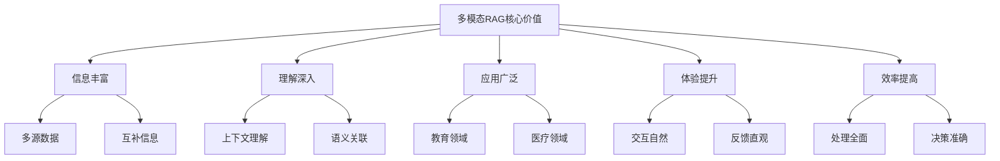
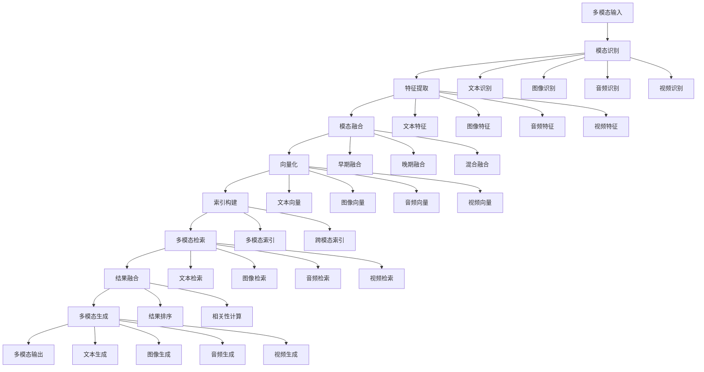

# 多模态RAG

## 引言

多模态RAG是RAG技术的重要发展方向，能够处理文本、图像、音频、视频等多种模态的数据。本文将深入探讨多模态RAG的实现原理、技术架构和实际应用。

## 多模态RAG概述

### 什么是多模态RAG

多模态RAG是一种能够处理多种模态数据的RAG系统，它能够：
- 理解文本、图像、音频、视频等多种模态
- 建立跨模态的语义关联
- 提供多模态的检索和生成
- 支持多模态的问答和交互

### 多模态RAG的核心价值



## 技术架构

### 1. 整体架构



### 2. 核心组件实现

```python
from typing import List, Dict, Any, Union
import torch
import torch.nn as nn
from transformers import AutoTokenizer, AutoModel
from PIL import Image
import librosa
import cv2

class MultimodalRAG:
    def __init__(self):
        self.modality_detectors = {
            'text': TextDetector(),
            'image': ImageDetector(),
            'audio': AudioDetector(),
            'video': VideoDetector()
        }
        self.feature_extractors = {
            'text': TextFeatureExtractor(),
            'image': ImageFeatureExtractor(),
            'audio': AudioFeatureExtractor(),
            'video': VideoFeatureExtractor()
        }
        self.fusion_module = MultimodalFusion()
        self.vectorizer = MultimodalVectorizer()
        self.index_builder = MultimodalIndexBuilder()
        self.retriever = MultimodalRetriever()
        self.generator = MultimodalGenerator()
    
    def process_multimodal_input(self, input_data: Dict[str, Any]) -> Dict[str, Any]:
        """处理多模态输入"""
        try:
            # 1. 模态识别
            modalities = self._detect_modalities(input_data)
            
            # 2. 特征提取
            features = self._extract_features(input_data, modalities)
            
            # 3. 模态融合
            fused_features = self.fusion_module.fuse(features)
            
            # 4. 向量化
            vectors = self.vectorizer.vectorize(fused_features)
            
            # 5. 索引构建
            index = self.index_builder.build(vectors, modalities)
            
            return {
                'modalities': modalities,
                'features': features,
                'fused_features': fused_features,
                'vectors': vectors,
                'index': index
            }
            
        except Exception as e:
            return {'error': f'处理多模态输入失败: {str(e)}'}
    
    def _detect_modalities(self, input_data: Dict[str, Any]) -> List[str]:
        """检测模态"""
        modalities = []
        
        for modality, detector in self.modality_detectors.items():
            if detector.detect(input_data):
                modalities.append(modality)
        
        return modalities
    
    def _extract_features(self, input_data: Dict[str, Any], modalities: List[str]) -> Dict[str, Any]:
        """提取特征"""
        features = {}
        
        for modality in modalities:
            extractor = self.feature_extractors[modality]
            features[modality] = extractor.extract(input_data)
        
        return features


class ModalityDetector:
    def detect(self, input_data: Dict[str, Any]) -> bool:
        """检测模态"""
        raise NotImplementedError


class TextDetector(ModalityDetector):
    def detect(self, input_data: Dict[str, Any]) -> bool:
        """检测文本模态"""
        return 'text' in input_data and isinstance(input_data['text'], str)


class ImageDetector(ModalityDetector):
    def detect(self, input_data: Dict[str, Any]) -> bool:
        """检测图像模态"""
        return 'image' in input_data and isinstance(input_data['image'], (str, Image.Image))


class AudioDetector(ModalityDetector):
    def detect(self, input_data: Dict[str, Any]) -> bool:
        """检测音频模态"""
        return 'audio' in input_data and isinstance(input_data['audio'], (str, np.ndarray))


class VideoDetector(ModalityDetector):
    def detect(self, input_data: Dict[str, Any]) -> bool:
        """检测视频模态"""
        return 'video' in input_data and isinstance(input_data['video'], (str, np.ndarray))


class FeatureExtractor:
    def extract(self, input_data: Dict[str, Any]) -> torch.Tensor:
        """提取特征"""
        raise NotImplementedError


class TextFeatureExtractor(FeatureExtractor):
    def __init__(self):
        self.tokenizer = AutoTokenizer.from_pretrained('bert-base-uncased')
        self.model = AutoModel.from_pretrained('bert-base-uncased')
    
    def extract(self, input_data: Dict[str, Any]) -> torch.Tensor:
        """提取文本特征"""
        text = input_data['text']
        
        # 分词
        tokens = self.tokenizer(text, return_tensors='pt', padding=True, truncation=True)
        
        # 特征提取
        with torch.no_grad():
            outputs = self.model(**tokens)
            features = outputs.last_hidden_state.mean(dim=1)  # 平均池化
        
        return features


class ImageFeatureExtractor(FeatureExtractor):
    def __init__(self):
        self.model = AutoModel.from_pretrained('openai/clip-vit-base-patch32')
        self.processor = AutoProcessor.from_pretrained('openai/clip-vit-base-patch32')
    
    def extract(self, input_data: Dict[str, Any]) -> torch.Tensor:
        """提取图像特征"""
        image = input_data['image']
        
        if isinstance(image, str):
            image = Image.open(image)
        
        # 预处理
        inputs = self.processor(images=image, return_tensors="pt")
        
        # 特征提取
        with torch.no_grad():
            outputs = self.model(**inputs)
            features = outputs.image_embeds
        
        return features


class AudioFeatureExtractor(FeatureExtractor):
    def __init__(self):
        self.model = AutoModel.from_pretrained('facebook/wav2vec2-base')
        self.feature_extractor = AutoFeatureExtractor.from_pretrained('facebook/wav2vec2-base')
    
    def extract(self, input_data: Dict[str, Any]) -> torch.Tensor:
        """提取音频特征"""
        audio = input_data['audio']
        
        if isinstance(audio, str):
            audio, sr = librosa.load(audio, sr=16000)
        
        # 预处理
        inputs = self.feature_extractor(audio, sampling_rate=16000, return_tensors="pt")
        
        # 特征提取
        with torch.no_grad():
            outputs = self.model(**inputs)
            features = outputs.last_hidden_state.mean(dim=1)  # 平均池化
        
        return features


class VideoFeatureExtractor(FeatureExtractor):
    def __init__(self):
        self.model = AutoModel.from_pretrained('microsoft/xclip-base-patch32')
        self.processor = AutoProcessor.from_pretrained('microsoft/xclip-base-patch32')
    
    def extract(self, input_data: Dict[str, Any]) -> torch.Tensor:
        """提取视频特征"""
        video = input_data['video']
        
        if isinstance(video, str):
            cap = cv2.VideoCapture(video)
            frames = []
            while True:
                ret, frame = cap.read()
                if not ret:
                    break
                frames.append(frame)
            cap.release()
        else:
            frames = video
        
        # 预处理
        inputs = self.processor(videos=frames, return_tensors="pt")
        
        # 特征提取
        with torch.no_grad():
            outputs = self.model(**inputs)
            features = outputs.video_embeds
        
        return features


class MultimodalFusion:
    def __init__(self):
        self.fusion_strategies = {
            'early': EarlyFusion(),
            'late': LateFusion(),
            'hybrid': HybridFusion()
        }
    
    def fuse(self, features: Dict[str, torch.Tensor]) -> torch.Tensor:
        """融合多模态特征"""
        if len(features) == 1:
            return list(features.values())[0]
        
        # 选择融合策略
        strategy = self._select_fusion_strategy(features)
        
        # 执行融合
        fused_features = self.fusion_strategies[strategy].fuse(features)
        
        return fused_features
    
    def _select_fusion_strategy(self, features: Dict[str, torch.Tensor]) -> str:
        """选择融合策略"""
        # 基于模态数量和特征维度选择策略
        if len(features) == 2:
            return 'early'
        elif len(features) > 2:
            return 'hybrid'
        else:
            return 'late'


class EarlyFusion:
    def fuse(self, features: Dict[str, torch.Tensor]) -> torch.Tensor:
        """早期融合"""
        # 将不同模态的特征拼接
        fused_features = torch.cat(list(features.values()), dim=1)
        
        # 降维
        if fused_features.size(1) > 768:
            linear = nn.Linear(fused_features.size(1), 768)
            fused_features = linear(fused_features)
        
        return fused_features


class LateFusion:
    def fuse(self, features: Dict[str, torch.Tensor]) -> torch.Tensor:
        """晚期融合"""
        # 对每个模态的特征进行独立处理
        processed_features = []
        
        for modality, feature in features.items():
            # 模态特定的处理
            if modality == 'text':
                processed_feature = self._process_text_feature(feature)
            elif modality == 'image':
                processed_feature = self._process_image_feature(feature)
            elif modality == 'audio':
                processed_feature = self._process_audio_feature(feature)
            elif modality == 'video':
                processed_feature = self._process_video_feature(feature)
            else:
                processed_feature = feature
            
            processed_features.append(processed_feature)
        
        # 加权融合
        weights = torch.softmax(torch.randn(len(processed_features)), dim=0)
        fused_features = sum(w * f for w, f in zip(weights, processed_features))
        
        return fused_features
    
    def _process_text_feature(self, feature: torch.Tensor) -> torch.Tensor:
        """处理文本特征"""
        return feature
    
    def _process_image_feature(self, feature: torch.Tensor) -> torch.Tensor:
        """处理图像特征"""
        return feature
    
    def _process_audio_feature(self, feature: torch.Tensor) -> torch.Tensor:
        """处理音频特征"""
        return feature
    
    def _process_video_feature(self, feature: torch.Tensor) -> torch.Tensor:
        """处理视频特征"""
        return feature


class HybridFusion:
    def fuse(self, features: Dict[str, torch.Tensor]) -> torch.Tensor:
        """混合融合"""
        # 结合早期融合和晚期融合
        early_fused = EarlyFusion().fuse(features)
        late_fused = LateFusion().fuse(features)
        
        # 加权组合
        alpha = 0.5  # 可调参数
        fused_features = alpha * early_fused + (1 - alpha) * late_fused
        
        return fused_features


class MultimodalVectorizer:
    def __init__(self):
        self.vectorizers = {
            'text': TextVectorizer(),
            'image': ImageVectorizer(),
            'audio': AudioVectorizer(),
            'video': VideoVectorizer()
        }
    
    def vectorize(self, features: torch.Tensor) -> torch.Tensor:
        """向量化特征"""
        # 使用统一的向量化方法
        vectorizer = nn.Linear(features.size(1), 768)
        vectors = vectorizer(features)
        
        return vectors


class MultimodalIndexBuilder:
    def __init__(self):
        self.index_stores = {
            'text': TextIndexStore(),
            'image': ImageIndexStore(),
            'audio': AudioIndexStore(),
            'video': VideoIndexStore()
        }
    
    def build(self, vectors: torch.Tensor, modalities: List[str]) -> Dict[str, Any]:
        """构建多模态索引"""
        index = {}
        
        for modality in modalities:
            store = self.index_stores[modality]
            index[modality] = store.build(vectors)
        
        return index


class MultimodalRetriever:
    def __init__(self):
        self.retrievers = {
            'text': TextRetriever(),
            'image': ImageRetriever(),
            'audio': AudioRetriever(),
            'video': VideoRetriever()
        }
        self.fusion_strategies = {
            'weighted': WeightedFusion(),
            'voting': VotingFusion(),
            'hybrid': HybridFusion()
        }
    
    def retrieve(self, query: Dict[str, Any], index: Dict[str, Any], top_k: int = 5) -> List[Dict[str, Any]]:
        """多模态检索"""
        results = {}
        
        # 对每个模态进行检索
        for modality, retriever in self.retrievers.items():
            if modality in query and modality in index:
                results[modality] = retriever.retrieve(
                    query[modality], 
                    index[modality], 
                    top_k
                )
        
        # 融合检索结果
        fused_results = self._fuse_results(results)
        
        return fused_results[:top_k]
    
    def _fuse_results(self, results: Dict[str, List[Dict[str, Any]]]) -> List[Dict[str, Any]]:
        """融合检索结果"""
        # 选择融合策略
        strategy = self._select_fusion_strategy(results)
        
        # 执行融合
        fused_results = self.fusion_strategies[strategy].fuse(results)
        
        return fused_results
    
    def _select_fusion_strategy(self, results: Dict[str, List[Dict[str, Any]]]) -> str:
        """选择融合策略"""
        if len(results) == 1:
            return 'weighted'
        elif len(results) == 2:
            return 'voting'
        else:
            return 'hybrid'


class MultimodalGenerator:
    def __init__(self):
        self.generators = {
            'text': TextGenerator(),
            'image': ImageGenerator(),
            'audio': AudioGenerator(),
            'video': VideoGenerator()
        }
        self.fusion_module = MultimodalFusion()
    
    def generate(self, query: Dict[str, Any], context: List[Dict[str, Any]], 
                output_modalities: List[str]) -> Dict[str, Any]:
        """多模态生成"""
        # 融合上下文
        fused_context = self.fusion_module.fuse_context(context)
        
        # 生成不同模态的内容
        generated_content = {}
        
        for modality in output_modalities:
            generator = self.generators[modality]
            generated_content[modality] = generator.generate(query, fused_context)
        
        return generated_content
```

## 多模态检索技术

### 1. 跨模态检索

```python
class CrossModalRetriever:
    def __init__(self):
        self.text_encoder = TextEncoder()
        self.image_encoder = ImageEncoder()
        self.audio_encoder = AudioEncoder()
        self.video_encoder = VideoEncoder()
        self.cross_modal_mapper = CrossModalMapper()
    
    def text_to_image_retrieval(self, text_query: str, image_database: List[Image]) -> List[Image]:
        """文本到图像检索"""
        # 编码文本查询
        text_vector = self.text_encoder.encode(text_query)
        
        # 编码图像数据库
        image_vectors = [self.image_encoder.encode(img) for img in image_database]
        
        # 跨模态映射
        mapped_text_vector = self.cross_modal_mapper.map_text_to_image(text_vector)
        
        # 计算相似度
        similarities = [self._compute_similarity(mapped_text_vector, img_vec) 
                       for img_vec in image_vectors]
        
        # 排序并返回
        sorted_indices = sorted(range(len(similarities)), 
                              key=lambda i: similarities[i], reverse=True)
        
        return [image_database[i] for i in sorted_indices]
    
    def image_to_text_retrieval(self, image_query: Image, text_database: List[str]) -> List[str]:
        """图像到文本检索"""
        # 编码图像查询
        image_vector = self.image_encoder.encode(image_query)
        
        # 编码文本数据库
        text_vectors = [self.text_encoder.encode(text) for text in text_database]
        
        # 跨模态映射
        mapped_image_vector = self.cross_modal_mapper.map_image_to_text(image_vector)
        
        # 计算相似度
        similarities = [self._compute_similarity(mapped_image_vector, text_vec) 
                       for text_vec in text_vectors]
        
        # 排序并返回
        sorted_indices = sorted(range(len(similarities)), 
                              key=lambda i: similarities[i], reverse=True)
        
        return [text_database[i] for i in sorted_indices]
    
    def audio_to_text_retrieval(self, audio_query: np.ndarray, text_database: List[str]) -> List[str]:
        """音频到文本检索"""
        # 编码音频查询
        audio_vector = self.audio_encoder.encode(audio_query)
        
        # 编码文本数据库
        text_vectors = [self.text_encoder.encode(text) for text in text_database]
        
        # 跨模态映射
        mapped_audio_vector = self.cross_modal_mapper.map_audio_to_text(audio_vector)
        
        # 计算相似度
        similarities = [self._compute_similarity(mapped_audio_vector, text_vec) 
                       for text_vec in text_vectors]
        
        # 排序并返回
        sorted_indices = sorted(range(len(similarities)), 
                              key=lambda i: similarities[i], reverse=True)
        
        return [text_database[i] for i in sorted_indices]
    
    def video_to_text_retrieval(self, video_query: np.ndarray, text_database: List[str]) -> List[str]:
        """视频到文本检索"""
        # 编码视频查询
        video_vector = self.video_encoder.encode(video_query)
        
        # 编码文本数据库
        text_vectors = [self.text_encoder.encode(text) for text in text_database]
        
        # 跨模态映射
        mapped_video_vector = self.cross_modal_mapper.map_video_to_text(video_vector)
        
        # 计算相似度
        similarities = [self._compute_similarity(mapped_video_vector, text_vec) 
                       for text_vec in text_vectors]
        
        # 排序并返回
        sorted_indices = sorted(range(len(similarities)), 
                              key=lambda i: similarities[i], reverse=True)
        
        return [text_database[i] for i in sorted_indices]
    
    def _compute_similarity(self, vector1: torch.Tensor, vector2: torch.Tensor) -> float:
        """计算相似度"""
        # 余弦相似度
        similarity = torch.cosine_similarity(vector1, vector2, dim=0)
        return similarity.item()


class CrossModalMapper:
    def __init__(self):
        self.text_to_image_mapper = nn.Linear(768, 512)
        self.image_to_text_mapper = nn.Linear(512, 768)
        self.audio_to_text_mapper = nn.Linear(1024, 768)
        self.video_to_text_mapper = nn.Linear(1024, 768)
    
    def map_text_to_image(self, text_vector: torch.Tensor) -> torch.Tensor:
        """文本到图像映射"""
        return self.text_to_image_mapper(text_vector)
    
    def map_image_to_text(self, image_vector: torch.Tensor) -> torch.Tensor:
        """图像到文本映射"""
        return self.image_to_text_mapper(image_vector)
    
    def map_audio_to_text(self, audio_vector: torch.Tensor) -> torch.Tensor:
        """音频到文本映射"""
        return self.audio_to_text_mapper(audio_vector)
    
    def map_video_to_text(self, video_vector: torch.Tensor) -> torch.Tensor:
        """视频到文本映射"""
        return self.video_to_text_mapper(video_vector)
```

### 2. 多模态相似度计算

```python
class MultimodalSimilarityCalculator:
    def __init__(self):
        self.similarity_functions = {
            'cosine': self._cosine_similarity,
            'euclidean': self._euclidean_similarity,
            'manhattan': self._manhattan_similarity,
            'pearson': self._pearson_similarity
        }
    
    def calculate_similarity(self, vector1: torch.Tensor, vector2: torch.Tensor, 
                           method: str = 'cosine') -> float:
        """计算相似度"""
        if method not in self.similarity_functions:
            raise ValueError(f"不支持的相似度计算方法: {method}")
        
        return self.similarity_functions[method](vector1, vector2)
    
    def _cosine_similarity(self, vector1: torch.Tensor, vector2: torch.Tensor) -> float:
        """余弦相似度"""
        similarity = torch.cosine_similarity(vector1, vector2, dim=0)
        return similarity.item()
    
    def _euclidean_similarity(self, vector1: torch.Tensor, vector2: torch.Tensor) -> float:
        """欧几里得相似度"""
        distance = torch.norm(vector1 - vector2, p=2)
        similarity = 1 / (1 + distance.item())
        return similarity
    
    def _manhattan_similarity(self, vector1: torch.Tensor, vector2: torch.Tensor) -> float:
        """曼哈顿相似度"""
        distance = torch.norm(vector1 - vector2, p=1)
        similarity = 1 / (1 + distance.item())
        return similarity
    
    def _pearson_similarity(self, vector1: torch.Tensor, vector2: torch.Tensor) -> float:
        """皮尔逊相似度"""
        # 计算皮尔逊相关系数
        mean1 = torch.mean(vector1)
        mean2 = torch.mean(vector2)
        
        numerator = torch.sum((vector1 - mean1) * (vector2 - mean2))
        denominator = torch.sqrt(torch.sum((vector1 - mean1) ** 2) * torch.sum((vector2 - mean2) ** 2))
        
        if denominator == 0:
            return 0
        
        correlation = numerator / denominator
        return correlation.item()
    
    def calculate_multimodal_similarity(self, query_features: Dict[str, torch.Tensor], 
                                     document_features: Dict[str, torch.Tensor], 
                                     weights: Dict[str, float] = None) -> float:
        """计算多模态相似度"""
        if weights is None:
            weights = {modality: 1.0 / len(query_features) for modality in query_features}
        
        total_similarity = 0
        total_weight = 0
        
        for modality in query_features:
            if modality in document_features:
                similarity = self.calculate_similarity(
                    query_features[modality], 
                    document_features[modality]
                )
                weight = weights.get(modality, 1.0)
                total_similarity += similarity * weight
                total_weight += weight
        
        if total_weight == 0:
            return 0
        
        return total_similarity / total_weight
```

## 多模态生成技术

### 1. 多模态内容生成

```python
class MultimodalContentGenerator:
    def __init__(self):
        self.text_generator = TextGenerator()
        self.image_generator = ImageGenerator()
        self.audio_generator = AudioGenerator()
        self.video_generator = VideoGenerator()
        self.fusion_module = MultimodalFusion()
    
    def generate_multimodal_content(self, query: Dict[str, Any], 
                                  context: List[Dict[str, Any]], 
                                  output_modalities: List[str]) -> Dict[str, Any]:
        """生成多模态内容"""
        # 融合上下文
        fused_context = self.fusion_module.fuse_context(context)
        
        # 生成不同模态的内容
        generated_content = {}
        
        for modality in output_modalities:
            if modality == 'text':
                generated_content[modality] = self._generate_text(query, fused_context)
            elif modality == 'image':
                generated_content[modality] = self._generate_image(query, fused_context)
            elif modality == 'audio':
                generated_content[modality] = self._generate_audio(query, fused_context)
            elif modality == 'video':
                generated_content[modality] = self._generate_video(query, fused_context)
        
        return generated_content
    
    def _generate_text(self, query: Dict[str, Any], context: torch.Tensor) -> str:
        """生成文本"""
        # 构建提示
        prompt = self._build_text_prompt(query, context)
        
        # 生成文本
        generated_text = self.text_generator.generate(prompt)
        
        return generated_text
    
    def _generate_image(self, query: Dict[str, Any], context: torch.Tensor) -> Image.Image:
        """生成图像"""
        # 构建提示
        prompt = self._build_image_prompt(query, context)
        
        # 生成图像
        generated_image = self.image_generator.generate(prompt)
        
        return generated_image
    
    def _generate_audio(self, query: Dict[str, Any], context: torch.Tensor) -> np.ndarray:
        """生成音频"""
        # 构建提示
        prompt = self._build_audio_prompt(query, context)
        
        # 生成音频
        generated_audio = self.audio_generator.generate(prompt)
        
        return generated_audio
    
    def _generate_video(self, query: Dict[str, Any], context: torch.Tensor) -> np.ndarray:
        """生成视频"""
        # 构建提示
        prompt = self._build_video_prompt(query, context)
        
        # 生成视频
        generated_video = self.video_generator.generate(prompt)
        
        return generated_video
    
    def _build_text_prompt(self, query: Dict[str, Any], context: torch.Tensor) -> str:
        """构建文本提示"""
        prompt_parts = []
        
        # 添加上下文信息
        if 'text' in query:
            prompt_parts.append(f"基于以下信息回答问题：{query['text']}")
        
        # 添加多模态上下文
        prompt_parts.append("多模态上下文信息已融合到生成过程中。")
        
        # 添加生成要求
        prompt_parts.append("请生成准确、详细的文本回答。")
        
        return "\n".join(prompt_parts)
    
    def _build_image_prompt(self, query: Dict[str, Any], context: torch.Tensor) -> str:
        """构建图像提示"""
        prompt_parts = []
        
        # 添加查询信息
        if 'text' in query:
            prompt_parts.append(f"根据以下描述生成图像：{query['text']}")
        
        # 添加多模态上下文
        prompt_parts.append("多模态上下文信息已融合到生成过程中。")
        
        # 添加生成要求
        prompt_parts.append("请生成高质量、相关的图像。")
        
        return "\n".join(prompt_parts)
    
    def _build_audio_prompt(self, query: Dict[str, Any], context: torch.Tensor) -> str:
        """构建音频提示"""
        prompt_parts = []
        
        # 添加查询信息
        if 'text' in query:
            prompt_parts.append(f"根据以下描述生成音频：{query['text']}")
        
        # 添加多模态上下文
        prompt_parts.append("多模态上下文信息已融合到生成过程中。")
        
        # 添加生成要求
        prompt_parts.append("请生成清晰、相关的音频。")
        
        return "\n".join(prompt_parts)
    
    def _build_video_prompt(self, query: Dict[str, Any], context: torch.Tensor) -> str:
        """构建视频提示"""
        prompt_parts = []
        
        # 添加查询信息
        if 'text' in query:
            prompt_parts.append(f"根据以下描述生成视频：{query['text']}")
        
        # 添加多模态上下文
        prompt_parts.append("多模态上下文信息已融合到生成过程中。")
        
        # 添加生成要求
        prompt_parts.append("请生成高质量、相关的视频。")
        
        return "\n".join(prompt_parts)
```

### 2. 多模态问答

```python
class MultimodalQA:
    def __init__(self):
        self.multimodal_rag = MultimodalRAG()
        self.content_generator = MultimodalContentGenerator()
        self.similarity_calculator = MultimodalSimilarityCalculator()
    
    def answer_multimodal_question(self, question: Dict[str, Any], 
                                 knowledge_base: Dict[str, Any]) -> Dict[str, Any]:
        """回答多模态问题"""
        try:
            # 1. 处理问题
            question_features = self.multimodal_rag.process_multimodal_input(question)
            
            # 2. 检索相关知识
            relevant_docs = self._retrieve_relevant_documents(question_features, knowledge_base)
            
            # 3. 生成回答
            answer = self._generate_answer(question, relevant_docs)
            
            return {
                'answer': answer,
                'relevant_documents': relevant_docs,
                'confidence': self._calculate_confidence(question_features, relevant_docs)
            }
            
        except Exception as e:
            return {'error': f'回答多模态问题失败: {str(e)}'}
    
    def _retrieve_relevant_documents(self, question_features: Dict[str, Any], 
                                   knowledge_base: Dict[str, Any]) -> List[Dict[str, Any]]:
        """检索相关文档"""
        relevant_docs = []
        
        # 对每个模态进行检索
        for modality in question_features['modalities']:
            if modality in knowledge_base:
                docs = self._retrieve_by_modality(
                    question_features['features'][modality],
                    knowledge_base[modality]
                )
                relevant_docs.extend(docs)
        
        # 去重和排序
        relevant_docs = self._deduplicate_and_rank(relevant_docs)
        
        return relevant_docs[:10]  # 返回前10个相关文档
    
    def _retrieve_by_modality(self, query_features: torch.Tensor, 
                            modality_knowledge_base: List[Dict[str, Any]]) -> List[Dict[str, Any]]:
        """按模态检索"""
        similarities = []
        
        for doc in modality_knowledge_base:
            similarity = self.similarity_calculator.calculate_similarity(
                query_features, doc['features']
            )
            similarities.append({
                'document': doc,
                'similarity': similarity
            })
        
        # 按相似度排序
        similarities.sort(key=lambda x: x['similarity'], reverse=True)
        
        return similarities[:5]  # 返回前5个相关文档
    
    def _deduplicate_and_rank(self, documents: List[Dict[str, Any]]) -> List[Dict[str, Any]]:
        """去重和排序"""
        # 去重
        unique_docs = {}
        for doc in documents:
            doc_id = doc['document']['id']
            if doc_id not in unique_docs or doc['similarity'] > unique_docs[doc_id]['similarity']:
                unique_docs[doc_id] = doc
        
        # 排序
        sorted_docs = sorted(unique_docs.values(), key=lambda x: x['similarity'], reverse=True)
        
        return sorted_docs
    
    def _generate_answer(self, question: Dict[str, Any], 
                        relevant_docs: List[Dict[str, Any]]) -> Dict[str, Any]:
        """生成回答"""
        # 构建上下文
        context = self._build_context(relevant_docs)
        
        # 确定输出模态
        output_modalities = self._determine_output_modalities(question)
        
        # 生成多模态回答
        answer = self.content_generator.generate_multimodal_content(
            question, context, output_modalities
        )
        
        return answer
    
    def _build_context(self, relevant_docs: List[Dict[str, Any]]) -> List[Dict[str, Any]]:
        """构建上下文"""
        context = []
        
        for doc in relevant_docs:
            context.append({
                'content': doc['document']['content'],
                'modality': doc['document']['modality'],
                'similarity': doc['similarity']
            })
        
        return context
    
    def _determine_output_modalities(self, question: Dict[str, Any]) -> List[str]:
        """确定输出模态"""
        output_modalities = ['text']  # 默认输出文本
        
        # 基于问题类型确定输出模态
        if 'image' in question:
            output_modalities.append('image')
        if 'audio' in question:
            output_modalities.append('audio')
        if 'video' in question:
            output_modalities.append('video')
        
        return output_modalities
    
    def _calculate_confidence(self, question_features: Dict[str, Any], 
                            relevant_docs: List[Dict[str, Any]]) -> float:
        """计算置信度"""
        if not relevant_docs:
            return 0.0
        
        # 基于相关文档的相似度计算置信度
        similarities = [doc['similarity'] for doc in relevant_docs]
        avg_similarity = sum(similarities) / len(similarities)
        
        # 考虑相关文档数量
        doc_count_factor = min(len(relevant_docs) / 5, 1.0)
        
        confidence = avg_similarity * doc_count_factor
        
        return confidence
```

## 实战应用

### 1. 教育领域应用

```python
class EducationalMultimodalRAG:
    def __init__(self):
        self.multimodal_qa = MultimodalQA()
        self.knowledge_base = {
            'text': [],
            'image': [],
            'audio': [],
            'video': []
        }
    
    def setup_educational_kb(self, educational_materials: List[Dict[str, Any]]):
        """设置教育知识库"""
        for material in educational_materials:
            modality = material['modality']
            if modality in self.knowledge_base:
                # 处理教育材料
                processed_material = self._process_educational_material(material)
                self.knowledge_base[modality].append(processed_material)
    
    def _process_educational_material(self, material: Dict[str, Any]) -> Dict[str, Any]:
        """处理教育材料"""
        processed = {
            'id': material['id'],
            'content': material['content'],
            'modality': material['modality'],
            'subject': material.get('subject', ''),
            'grade_level': material.get('grade_level', ''),
            'difficulty': material.get('difficulty', 'medium'),
            'features': None  # 将在后续处理中填充
        }
        
        return processed
    
    def answer_student_question(self, question: Dict[str, Any]) -> Dict[str, Any]:
        """回答学生问题"""
        # 回答多模态问题
        answer = self.multimodal_qa.answer_multimodal_question(question, self.knowledge_base)
        
        # 添加教育特定的后处理
        answer = self._add_educational_context(answer, question)
        
        return answer
    
    def _add_educational_context(self, answer: Dict[str, Any], question: Dict[str, Any]) -> Dict[str, Any]:
        """添加教育上下文"""
        # 添加学习建议
        answer['learning_suggestions'] = self._generate_learning_suggestions(answer, question)
        
        # 添加相关资源
        answer['related_resources'] = self._find_related_resources(answer, question)
        
        # 添加难度评估
        answer['difficulty_assessment'] = self._assess_difficulty(answer, question)
        
        return answer
    
    def _generate_learning_suggestions(self, answer: Dict[str, Any], question: Dict[str, Any]) -> List[str]:
        """生成学习建议"""
        suggestions = []
        
        # 基于回答内容生成建议
        if answer['confidence'] < 0.7:
            suggestions.append("建议查阅更多相关资料")
        
        if 'text' in answer['answer']:
            suggestions.append("建议做笔记总结")
        
        if 'image' in answer['answer']:
            suggestions.append("建议仔细观察图像细节")
        
        if 'audio' in answer['answer']:
            suggestions.append("建议多次听取音频内容")
        
        if 'video' in answer['answer']:
            suggestions.append("建议反复观看视频内容")
        
        return suggestions
    
    def _find_related_resources(self, answer: Dict[str, Any], question: Dict[str, Any]) -> List[Dict[str, Any]]:
        """查找相关资源"""
        related_resources = []
        
        # 基于问题主题查找相关资源
        for modality in self.knowledge_base:
            for resource in self.knowledge_base[modality]:
                if self._is_related_resource(resource, question):
                    related_resources.append(resource)
        
        return related_resources[:5]  # 返回前5个相关资源
    
    def _is_related_resource(self, resource: Dict[str, Any], question: Dict[str, Any]) -> bool:
        """判断是否为相关资源"""
        # 简化的相关性判断
        if 'text' in question:
            question_text = question['text'].lower()
            if resource.get('subject', '').lower() in question_text:
                return True
        
        return False
    
    def _assess_difficulty(self, answer: Dict[str, Any], question: Dict[str, Any]) -> str:
        """评估难度"""
        # 基于回答复杂度和相关文档难度评估
        if answer['confidence'] > 0.8:
            return 'easy'
        elif answer['confidence'] > 0.6:
            return 'medium'
        else:
            return 'hard'

# 使用示例
educational_rag = EducationalMultimodalRAG()

# 设置教育材料
educational_materials = [
    {
        'id': 'math_001',
        'content': '数学基础概念',
        'modality': 'text',
        'subject': '数学',
        'grade_level': '小学',
        'difficulty': 'easy'
    },
    {
        'id': 'math_002',
        'content': '几何图形示例',
        'modality': 'image',
        'subject': '数学',
        'grade_level': '小学',
        'difficulty': 'easy'
    }
]

educational_rag.setup_educational_kb(educational_materials)

# 回答学生问题
question = {
    'text': '什么是三角形？',
    'image': None
}

answer = educational_rag.answer_student_question(question)
print(f"回答: {answer['answer']}")
print(f"学习建议: {answer['learning_suggestions']}")
```

### 2. 医疗领域应用

```python
class MedicalMultimodalRAG:
    def __init__(self):
        self.multimodal_qa = MultimodalQA()
        self.knowledge_base = {
            'text': [],
            'image': [],
            'audio': [],
            'video': []
        }
        self.medical_validator = MedicalValidator()
    
    def setup_medical_kb(self, medical_materials: List[Dict[str, Any]]):
        """设置医疗知识库"""
        for material in medical_materials:
            modality = material['modality']
            if modality in self.knowledge_base:
                # 处理医疗材料
                processed_material = self._process_medical_material(material)
                self.knowledge_base[modality].append(processed_material)
    
    def _process_medical_material(self, material: Dict[str, Any]) -> Dict[str, Any]:
        """处理医疗材料"""
        processed = {
            'id': material['id'],
            'content': material['content'],
            'modality': material['modality'],
            'medical_specialty': material.get('medical_specialty', ''),
            'disease_category': material.get('disease_category', ''),
            'severity_level': material.get('severity_level', ''),
            'features': None  # 将在后续处理中填充
        }
        
        return processed
    
    def answer_medical_question(self, question: Dict[str, Any]) -> Dict[str, Any]:
        """回答医疗问题"""
        # 验证问题
        validation_result = self.medical_validator.validate_question(question)
        if not validation_result['valid']:
            return {
                'error': '问题验证失败',
                'validation_result': validation_result
            }
        
        # 回答多模态问题
        answer = self.multimodal_qa.answer_multimodal_question(question, self.knowledge_base)
        
        # 添加医疗特定的后处理
        answer = self._add_medical_context(answer, question)
        
        return answer
    
    def _add_medical_context(self, answer: Dict[str, Any], question: Dict[str, Any]) -> Dict[str, Any]:
        """添加医疗上下文"""
        # 添加医疗建议
        answer['medical_advice'] = self._generate_medical_advice(answer, question)
        
        # 添加相关症状
        answer['related_symptoms'] = self._find_related_symptoms(answer, question)
        
        # 添加治疗建议
        answer['treatment_suggestions'] = self._generate_treatment_suggestions(answer, question)
        
        # 添加注意事项
        answer['precautions'] = self._generate_precautions(answer, question)
        
        return answer
    
    def _generate_medical_advice(self, answer: Dict[str, Any], question: Dict[str, Any]) -> List[str]:
        """生成医疗建议"""
        advice = []
        
        # 基于回答内容生成建议
        if answer['confidence'] < 0.7:
            advice.append("建议咨询专业医生")
        
        if 'text' in answer['answer']:
            advice.append("建议详细记录症状")
        
        if 'image' in answer['answer']:
            advice.append("建议仔细观察图像特征")
        
        if 'audio' in answer['answer']:
            advice.append("建议仔细听取音频内容")
        
        if 'video' in answer['answer']:
            advice.append("建议反复观看视频内容")
        
        return advice
    
    def _find_related_symptoms(self, answer: Dict[str, Any], question: Dict[str, Any]) -> List[str]:
        """查找相关症状"""
        related_symptoms = []
        
        # 基于问题内容查找相关症状
        for modality in self.knowledge_base:
            for resource in self.knowledge_base[modality]:
                if self._is_related_symptom(resource, question):
                    related_symptoms.append(resource.get('content', ''))
        
        return related_symptoms[:5]  # 返回前5个相关症状
    
    def _is_related_symptom(self, resource: Dict[str, Any], question: Dict[str, Any]) -> bool:
        """判断是否为相关症状"""
        # 简化的相关性判断
        if 'text' in question:
            question_text = question['text'].lower()
            if resource.get('disease_category', '').lower() in question_text:
                return True
        
        return False
    
    def _generate_treatment_suggestions(self, answer: Dict[str, Any], question: Dict[str, Any]) -> List[str]:
        """生成治疗建议"""
        suggestions = []
        
        # 基于回答内容生成治疗建议
        if answer['confidence'] > 0.8:
            suggestions.append("建议按照标准治疗方案")
        else:
            suggestions.append("建议进一步检查")
        
        return suggestions
    
    def _generate_precautions(self, answer: Dict[str, Any], question: Dict[str, Any]) -> List[str]:
        """生成注意事项"""
        precautions = []
        
        # 基于回答内容生成注意事项
        precautions.append("请勿自行诊断")
        precautions.append("如有疑问请咨询专业医生")
        
        return precautions


class MedicalValidator:
    def validate_question(self, question: Dict[str, Any]) -> Dict[str, Any]:
        """验证医疗问题"""
        validation_result = {
            'valid': True,
            'warnings': [],
            'errors': []
        }
        
        # 检查问题内容
        if 'text' in question:
            question_text = question['text']
            
            # 检查是否包含敏感词汇
            sensitive_words = ['诊断', '治疗', '药物']
            for word in sensitive_words:
                if word in question_text:
                    validation_result['warnings'].append(f"问题包含敏感词汇: {word}")
        
        # 检查问题长度
        if 'text' in question and len(question['text']) < 10:
            validation_result['errors'].append("问题描述过短")
        
        # 检查是否有错误
        if validation_result['errors']:
            validation_result['valid'] = False
        
        return validation_result

# 使用示例
medical_rag = MedicalMultimodalRAG()

# 设置医疗材料
medical_materials = [
    {
        'id': 'medical_001',
        'content': '感冒症状描述',
        'modality': 'text',
        'medical_specialty': '内科',
        'disease_category': '感冒',
        'severity_level': 'mild'
    },
    {
        'id': 'medical_002',
        'content': '感冒症状图像',
        'modality': 'image',
        'medical_specialty': '内科',
        'disease_category': '感冒',
        'severity_level': 'mild'
    }
]

medical_rag.setup_medical_kb(medical_materials)

# 回答医疗问题
question = {
    'text': '感冒有什么症状？',
    'image': None
}

answer = medical_rag.answer_medical_question(question)
print(f"回答: {answer['answer']}")
print(f"医疗建议: {answer['medical_advice']}")
print(f"注意事项: {answer['precautions']}")
```

## 最佳实践

### 1. 性能优化

```python
class OptimizedMultimodalRAG:
    def __init__(self):
        self.multimodal_rag = MultimodalRAG()
        self.cache_manager = CacheManager()
        self.parallel_processor = ParallelProcessor()
        self.model_optimizer = ModelOptimizer()
    
    def optimize_performance(self) -> Dict[str, Any]:
        """优化性能"""
        optimizations = {}
        
        # 缓存优化
        cache_optimization = self.cache_manager.optimize_cache()
        optimizations['cache'] = cache_optimization
        
        # 并行处理优化
        parallel_optimization = self.parallel_processor.optimize_parallel_processing()
        optimizations['parallel'] = parallel_optimization
        
        # 模型优化
        model_optimization = self.model_optimizer.optimize_models()
        optimizations['model'] = model_optimization
        
        return optimizations


class CacheManager:
    def optimize_cache(self) -> Dict[str, Any]:
        """优化缓存"""
        return {
            'feature_cache': '启用特征缓存',
            'vector_cache': '启用向量缓存',
            'result_cache': '启用结果缓存'
        }


class ParallelProcessor:
    def optimize_parallel_processing(self) -> Dict[str, Any]:
        """优化并行处理"""
        return {
            'modality_parallel': '启用模态并行处理',
            'batch_processing': '启用批量处理',
            'async_processing': '启用异步处理'
        }


class ModelOptimizer:
    def optimize_models(self) -> Dict[str, Any]:
        """优化模型"""
        return {
            'model_quantization': '启用模型量化',
            'model_pruning': '启用模型剪枝',
            'model_distillation': '启用模型蒸馏'
        }
```

### 2. 错误处理

```python
class RobustMultimodalRAG:
    def __init__(self):
        self.multimodal_rag = MultimodalRAG()
        self.error_handler = ErrorHandler()
        self.fallback_strategies = FallbackStrategies()
    
    def process_with_error_handling(self, input_data: Dict[str, Any]) -> Dict[str, Any]:
        """带错误处理的处理"""
        try:
            # 处理多模态输入
            result = self.multimodal_rag.process_multimodal_input(input_data)
            
            # 验证结果
            validation_result = self.error_handler.validate_result(result)
            if not validation_result['valid']:
                # 使用降级策略
                result = self.fallback_strategies.apply_fallback(input_data, validation_result)
            
            return result
            
        except Exception as e:
            # 记录错误
            self.error_handler.log_error(e)
            
            # 使用降级策略
            result = self.fallback_strategies.apply_fallback(input_data, {'error': str(e)})
            
            return result


class ErrorHandler:
    def validate_result(self, result: Dict[str, Any]) -> Dict[str, Any]:
        """验证结果"""
        validation_result = {
            'valid': True,
            'warnings': [],
            'errors': []
        }
        
        # 检查结果完整性
        if 'error' in result:
            validation_result['valid'] = False
            validation_result['errors'].append(result['error'])
        
        # 检查特征质量
        if 'features' in result:
            for modality, features in result['features'].items():
                if features is None or features.size(0) == 0:
                    validation_result['warnings'].append(f"{modality}特征为空")
        
        return validation_result
    
    def log_error(self, error: Exception):
        """记录错误"""
        import logging
        logger = logging.getLogger(__name__)
        logger.error(f"多模态RAG处理错误: {str(error)}")


class FallbackStrategies:
    def apply_fallback(self, input_data: Dict[str, Any], error_info: Dict[str, Any]) -> Dict[str, Any]:
        """应用降级策略"""
        # 简化的降级策略
        if 'text' in input_data:
            return {
                'answer': '抱歉，处理过程中出现错误，请稍后再试。',
                'error': error_info.get('error', '未知错误'),
                'fallback': True
            }
        else:
            return {
                'answer': '抱歉，无法处理您的请求，请稍后再试。',
                'error': error_info.get('error', '未知错误'),
                'fallback': True
            }
```

## 总结

多模态RAG是RAG技术的重要发展方向，能够处理文本、图像、音频、视频等多种模态的数据。本文介绍了多模态RAG的实现原理、技术架构和实际应用，包括模态检测、特征提取、模态融合、多模态检索和生成等方面。

关键要点：
1. **模态检测**：自动识别输入数据的模态类型
2. **特征提取**：为不同模态提取高质量特征
3. **模态融合**：将多模态特征融合为统一表示
4. **多模态检索**：支持跨模态和同模态检索
5. **多模态生成**：生成多种模态的内容

在下一篇文章中，我们将探讨Agent与RAG结合，了解如何将RAG技术与智能代理结合。

---

**下一步学习建议：**
- 阅读《Agent与RAG结合》，了解如何将RAG技术与智能代理结合
- 实践多模态RAG的设计和实现
- 关注多模态RAG技术的最新发展和创新方案
