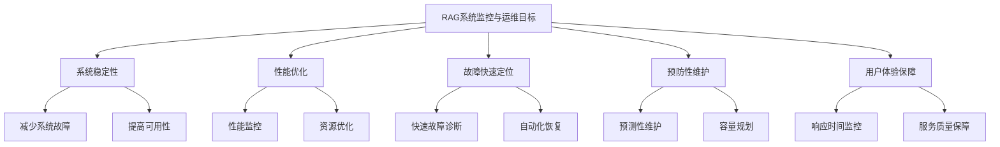
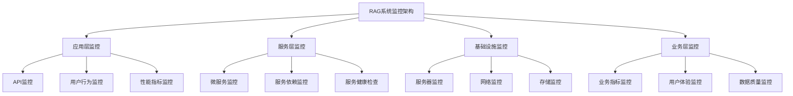

# 监控与运维

## 引言

RAG系统的监控与运维是确保系统稳定运行、快速定位问题和持续优化性能的关键。随着RAG系统复杂度的增加，建立完善的监控和运维体系变得越来越重要。本文将深入探讨RAG系统的监控策略、运维实践、故障处理和性能调优等方面。

## 监控与运维概述

### 什么是RAG系统监控与运维

RAG系统监控与运维是指通过技术手段对RAG系统进行实时监控、性能分析、故障诊断和系统维护，确保系统稳定、高效运行的过程。

### 监控与运维的目标



### 监控与运维的挑战

1. **系统复杂性**：多组件、多服务的监控
2. **数据量庞大**：大量日志和指标数据
3. **实时性要求**：需要实时监控和告警
4. **故障多样性**：各种类型的故障和异常
5. **运维自动化**：减少人工干预，提高效率

## 监控体系设计

### 1. 监控架构

#### 监控层次



#### 实现示例

```python
class RAGMonitoringSystem:
    def __init__(self):
        self.metrics_collector = MetricsCollector()
        self.log_collector = LogCollector()
        self.alert_manager = AlertManager()
        self.dashboard = Dashboard()
        self.health_checker = HealthChecker()
        
        # 监控组件
        self.monitors = {
            'application': ApplicationMonitor(),
            'service': ServiceMonitor(),
            'infrastructure': InfrastructureMonitor(),
            'business': BusinessMonitor()
        }
    
    def start_monitoring(self):
        """启动监控"""
        # 启动各个监控组件
        for monitor_name, monitor in self.monitors.items():
            monitor.start()
        
        # 启动指标收集
        self.metrics_collector.start()
        
        # 启动日志收集
        self.log_collector.start()
        
        # 启动健康检查
        self.health_checker.start()
        
        # 启动告警管理
        self.alert_manager.start()
    
    def stop_monitoring(self):
        """停止监控"""
        # 停止各个监控组件
        for monitor_name, monitor in self.monitors.items():
            monitor.stop()
        
        # 停止指标收集
        self.metrics_collector.stop()
        
        # 停止日志收集
        self.log_collector.stop()
        
        # 停止健康检查
        self.health_checker.stop()
        
        # 停止告警管理
        self.alert_manager.stop()


class MetricsCollector:
    def __init__(self):
        self.metrics_store = MetricsStore()
        self.collectors = {
            'system': SystemMetricsCollector(),
            'application': ApplicationMetricsCollector(),
            'business': BusinessMetricsCollector()
        }
        self.collection_interval = 30  # 30秒收集一次
        self.running = False
    
    def start(self):
        """启动指标收集"""
        self.running = True
        threading.Thread(target=self._collection_loop, daemon=True).start()
    
    def stop(self):
        """停止指标收集"""
        self.running = False
    
    def _collection_loop(self):
        """指标收集循环"""
        while self.running:
            try:
                # 收集各类指标
                for collector_name, collector in self.collectors.items():
                    metrics = collector.collect_metrics()
                    self.metrics_store.store_metrics(collector_name, metrics)
                
                time.sleep(self.collection_interval)
            except Exception as e:
                print(f"指标收集失败: {e}")
                time.sleep(5)
    
    def get_metrics(self, metric_type: str, time_range: str = '1h') -> Dict[str, any]:
        """获取指标"""
        return self.metrics_store.get_metrics(metric_type, time_range)


class SystemMetricsCollector:
    def __init__(self):
        self.psutil = __import__('psutil')
    
    def collect_metrics(self) -> Dict[str, any]:
        """收集系统指标"""
        return {
            'cpu_usage': self.psutil.cpu_percent(),
            'memory_usage': self.psutil.virtual_memory().percent,
            'disk_usage': self.psutil.disk_usage('/').percent,
            'network_io': self.psutil.net_io_counters()._asdict(),
            'process_count': len(self.psutil.pids()),
            'load_average': self.psutil.getloadavg() if hasattr(self.psutil, 'getloadavg') else [0, 0, 0]
        }


class ApplicationMetricsCollector:
    def __init__(self):
        self.request_count = 0
        self.error_count = 0
        self.response_times = []
        self.active_connections = 0
    
    def collect_metrics(self) -> Dict[str, any]:
        """收集应用指标"""
        avg_response_time = sum(self.response_times) / len(self.response_times) if self.response_times else 0
        
        return {
            'request_count': self.request_count,
            'error_count': self.error_count,
            'error_rate': self.error_count / max(self.request_count, 1),
            'avg_response_time': avg_response_time,
            'active_connections': self.active_connections,
            'throughput': self.request_count / 60  # 每分钟请求数
        }
    
    def record_request(self, response_time: float, is_error: bool = False):
        """记录请求"""
        self.request_count += 1
        if is_error:
            self.error_count += 1
        
        self.response_times.append(response_time)
        if len(self.response_times) > 1000:  # 保持最近1000个请求的响应时间
            self.response_times.pop(0)


class BusinessMetricsCollector:
    def __init__(self):
        self.query_count = 0
        self.successful_queries = 0
        self.user_count = 0
        self.document_count = 0
    
    def collect_metrics(self) -> Dict[str, any]:
        """收集业务指标"""
        return {
            'query_count': self.query_count,
            'successful_queries': self.successful_queries,
            'query_success_rate': self.successful_queries / max(self.query_count, 1),
            'user_count': self.user_count,
            'document_count': self.document_count,
            'avg_queries_per_user': self.query_count / max(self.user_count, 1)
        }
    
    def record_query(self, user_id: str, success: bool):
        """记录查询"""
        self.query_count += 1
        if success:
            self.successful_queries += 1


class LogCollector:
    def __init__(self):
        self.log_store = LogStore()
        self.log_processors = {
            'error': ErrorLogProcessor(),
            'access': AccessLogProcessor(),
            'performance': PerformanceLogProcessor()
        }
        self.collection_interval = 10  # 10秒收集一次
        self.running = False
    
    def start(self):
        """启动日志收集"""
        self.running = True
        threading.Thread(target=self._collection_loop, daemon=True).start()
    
    def stop(self):
        """停止日志收集"""
        self.running = False
    
    def _collection_loop(self):
        """日志收集循环"""
        while self.running:
            try:
                # 收集各类日志
                for log_type, processor in self.log_processors.items():
                    logs = processor.collect_logs()
                    self.log_store.store_logs(log_type, logs)
                
                time.sleep(self.collection_interval)
            except Exception as e:
                print(f"日志收集失败: {e}")
                time.sleep(5)
    
    def get_logs(self, log_type: str, time_range: str = '1h') -> List[Dict[str, any]]:
        """获取日志"""
        return self.log_store.get_logs(log_type, time_range)


class ErrorLogProcessor:
    def __init__(self):
        self.error_logs = []
    
    def collect_logs(self) -> List[Dict[str, any]]:
        """收集错误日志"""
        logs = self.error_logs.copy()
        self.error_logs.clear()
        return logs
    
    def log_error(self, error: str, context: Dict[str, any] = None):
        """记录错误日志"""
        log_entry = {
            'timestamp': time.time(),
            'level': 'ERROR',
            'message': error,
            'context': context or {}
        }
        self.error_logs.append(log_entry)


class AccessLogProcessor:
    def __init__(self):
        self.access_logs = []
    
    def collect_logs(self) -> List[Dict[str, any]]:
        """收集访问日志"""
        logs = self.access_logs.copy()
        self.access_logs.clear()
        return logs
    
    def log_access(self, request: Dict[str, any], response: Dict[str, any]):
        """记录访问日志"""
        log_entry = {
            'timestamp': time.time(),
            'method': request.get('method', 'GET'),
            'url': request.get('url', ''),
            'status_code': response.get('status_code', 200),
            'response_time': response.get('response_time', 0),
            'user_id': request.get('user_id', ''),
            'ip_address': request.get('ip_address', '')
        }
        self.access_logs.append(log_entry)


class PerformanceLogProcessor:
    def __init__(self):
        self.performance_logs = []
    
    def collect_logs(self) -> List[Dict[str, any]]:
        """收集性能日志"""
        logs = self.performance_logs.copy()
        self.performance_logs.clear()
        return logs
    
    def log_performance(self, operation: str, duration: float, details: Dict[str, any] = None):
        """记录性能日志"""
        log_entry = {
            'timestamp': time.time(),
            'operation': operation,
            'duration': duration,
            'details': details or {}
        }
        self.performance_logs.append(log_entry)
```

### 2. 指标监控

#### 关键指标

```python
class KeyMetricsMonitor:
    def __init__(self):
        self.metrics_definitions = {
            'availability': {
                'name': '系统可用性',
                'description': '系统正常运行时间百分比',
                'calculation': 'uptime / total_time',
                'threshold': 0.99,
                'unit': 'percentage'
            },
            'response_time': {
                'name': '响应时间',
                'description': '平均响应时间',
                'calculation': 'sum(response_times) / count',
                'threshold': 2.0,
                'unit': 'seconds'
            },
            'throughput': {
                'name': '吞吐量',
                'description': '每秒处理的请求数',
                'calculation': 'requests / time_interval',
                'threshold': 100,
                'unit': 'requests_per_second'
            },
            'error_rate': {
                'name': '错误率',
                'description': '错误请求占总请求的百分比',
                'calculation': 'error_requests / total_requests',
                'threshold': 0.01,
                'unit': 'percentage'
            },
            'cpu_usage': {
                'name': 'CPU使用率',
                'description': 'CPU使用百分比',
                'calculation': 'cpu_time / total_time',
                'threshold': 0.8,
                'unit': 'percentage'
            },
            'memory_usage': {
                'name': '内存使用率',
                'description': '内存使用百分比',
                'calculation': 'used_memory / total_memory',
                'threshold': 0.85,
                'unit': 'percentage'
            },
            'disk_usage': {
                'name': '磁盘使用率',
                'description': '磁盘使用百分比',
                'calculation': 'used_disk / total_disk',
                'threshold': 0.9,
                'unit': 'percentage'
            }
        }
        
        self.metrics_collectors = {
            'availability': AvailabilityCollector(),
            'response_time': ResponseTimeCollector(),
            'throughput': ThroughputCollector(),
            'error_rate': ErrorRateCollector(),
            'cpu_usage': CPUUsageCollector(),
            'memory_usage': MemoryUsageCollector(),
            'disk_usage': DiskUsageCollector()
        }
    
    def collect_all_metrics(self) -> Dict[str, any]:
        """收集所有指标"""
        metrics = {}
        
        for metric_name, collector in self.metrics_collectors.items():
            try:
                value = collector.collect()
                metrics[metric_name] = {
                    'value': value,
                    'definition': self.metrics_definitions[metric_name],
                    'status': self._evaluate_status(metric_name, value)
                }
            except Exception as e:
                print(f"收集指标 {metric_name} 失败: {e}")
                metrics[metric_name] = {
                    'value': None,
                    'definition': self.metrics_definitions[metric_name],
                    'status': 'error'
                }
        
        return metrics
    
    def _evaluate_status(self, metric_name: str, value: float) -> str:
        """评估指标状态"""
        if value is None:
            return 'unknown'
        
        threshold = self.metrics_definitions[metric_name]['threshold']
        
        if value <= threshold:
            return 'healthy'
        elif value <= threshold * 1.2:
            return 'warning'
        else:
            return 'critical'


class AvailabilityCollector:
    def __init__(self):
        self.start_time = time.time()
        self.downtime = 0
        self.last_check_time = time.time()
    
    def collect(self) -> float:
        """收集可用性指标"""
        current_time = time.time()
        total_time = current_time - self.start_time
        uptime = total_time - self.downtime
        
        return uptime / total_time if total_time > 0 else 1.0
    
    def record_downtime(self, duration: float):
        """记录停机时间"""
        self.downtime += duration


class ResponseTimeCollector:
    def __init__(self):
        self.response_times = []
        self.max_samples = 1000
    
    def collect(self) -> float:
        """收集响应时间指标"""
        if not self.response_times:
            return 0.0
        
        return sum(self.response_times) / len(self.response_times)
    
    def record_response_time(self, response_time: float):
        """记录响应时间"""
        self.response_times.append(response_time)
        
        if len(self.response_times) > self.max_samples:
            self.response_times.pop(0)


class ThroughputCollector:
    def __init__(self):
        self.request_count = 0
        self.start_time = time.time()
        self.last_reset_time = time.time()
    
    def collect(self) -> float:
        """收集吞吐量指标"""
        current_time = time.time()
        time_interval = current_time - self.last_reset_time
        
        if time_interval > 0:
            throughput = self.request_count / time_interval
            self.request_count = 0
            self.last_reset_time = current_time
            return throughput
        
        return 0.0
    
    def record_request(self):
        """记录请求"""
        self.request_count += 1


class ErrorRateCollector:
    def __init__(self):
        self.total_requests = 0
        self.error_requests = 0
        self.last_reset_time = time.time()
    
    def collect(self) -> float:
        """收集错误率指标"""
        if self.total_requests > 0:
            error_rate = self.error_requests / self.total_requests
            self.total_requests = 0
            self.error_requests = 0
            return error_rate
        
        return 0.0
    
    def record_request(self, is_error: bool = False):
        """记录请求"""
        self.total_requests += 1
        if is_error:
            self.error_requests += 1


class CPUUsageCollector:
    def __init__(self):
        self.psutil = __import__('psutil')
    
    def collect(self) -> float:
        """收集CPU使用率"""
        return self.psutil.cpu_percent() / 100.0


class MemoryUsageCollector:
    def __init__(self):
        self.psutil = __import__('psutil')
    
    def collect(self) -> float:
        """收集内存使用率"""
        return self.psutil.virtual_memory().percent / 100.0


class DiskUsageCollector:
    def __init__(self):
        self.psutil = __import__('psutil')
    
    def collect(self) -> float:
        """收集磁盘使用率"""
        return self.psutil.disk_usage('/').percent / 100.0
```

### 3. 告警系统

#### 告警管理

```python
class AlertManager:
    def __init__(self):
        self.alert_rules = {}
        self.alert_channels = {}
        self.alert_history = []
        self.alert_cooldown = {}  # 告警冷却时间
        self.running = False
    
    def start(self):
        """启动告警管理"""
        self.running = True
        threading.Thread(target=self._monitoring_loop, daemon=True).start()
    
    def stop(self):
        """停止告警管理"""
        self.running = False
    
    def add_alert_rule(self, rule_name: str, rule: Dict[str, any]):
        """添加告警规则"""
        self.alert_rules[rule_name] = rule
    
    def add_alert_channel(self, channel_name: str, channel):
        """添加告警渠道"""
        self.alert_channels[channel_name] = channel
    
    def _monitoring_loop(self):
        """监控循环"""
        while self.running:
            try:
                # 检查所有告警规则
                for rule_name, rule in self.alert_rules.items():
                    if self._check_alert_rule(rule_name, rule):
                        self._trigger_alert(rule_name, rule)
                
                time.sleep(30)  # 30秒检查一次
            except Exception as e:
                print(f"告警监控失败: {e}")
                time.sleep(5)
    
    def _check_alert_rule(self, rule_name: str, rule: Dict[str, any]) -> bool:
        """检查告警规则"""
        try:
            # 获取指标值
            metric_value = self._get_metric_value(rule['metric'])
            
            # 检查条件
            condition = rule['condition']
            threshold = rule['threshold']
            
            if condition == 'greater_than':
                return metric_value > threshold
            elif condition == 'less_than':
                return metric_value < threshold
            elif condition == 'equals':
                return metric_value == threshold
            elif condition == 'not_equals':
                return metric_value != threshold
            else:
                return False
                
        except Exception as e:
            print(f"检查告警规则 {rule_name} 失败: {e}")
            return False
    
    def _get_metric_value(self, metric_name: str) -> float:
        """获取指标值"""
        # 这里应该从指标收集器获取实际值
        # 简化实现，返回模拟值
        return 0.0
    
    def _trigger_alert(self, rule_name: str, rule: Dict[str, any]):
        """触发告警"""
        # 检查冷却时间
        if rule_name in self.alert_cooldown:
            if time.time() - self.alert_cooldown[rule_name] < rule.get('cooldown', 300):
                return
        
        # 创建告警
        alert = {
            'rule_name': rule_name,
            'message': rule['message'],
            'severity': rule.get('severity', 'warning'),
            'timestamp': time.time(),
            'metric_value': self._get_metric_value(rule['metric'])
        }
        
        # 发送告警
        self._send_alert(alert)
        
        # 记录告警历史
        self.alert_history.append(alert)
        
        # 设置冷却时间
        self.alert_cooldown[rule_name] = time.time()
    
    def _send_alert(self, alert: Dict[str, any]):
        """发送告警"""
        for channel_name, channel in self.alert_channels.items():
            try:
                channel.send_alert(alert)
            except Exception as e:
                print(f"发送告警到 {channel_name} 失败: {e}")
    
    def get_alert_history(self, time_range: str = '24h') -> List[Dict[str, any]]:
        """获取告警历史"""
        current_time = time.time()
        time_range_seconds = self._parse_time_range(time_range)
        
        return [alert for alert in self.alert_history 
                if current_time - alert['timestamp'] <= time_range_seconds]
    
    def _parse_time_range(self, time_range: str) -> int:
        """解析时间范围"""
        if time_range.endswith('h'):
            return int(time_range[:-1]) * 3600
        elif time_range.endswith('d'):
            return int(time_range[:-1]) * 86400
        else:
            return 3600  # 默认1小时


class EmailAlertChannel:
    def __init__(self, smtp_server: str, smtp_port: int, username: str, password: str):
        self.smtp_server = smtp_server
        self.smtp_port = smtp_port
        self.username = username
        self.password = password
        self.recipients = []
    
    def add_recipient(self, email: str):
        """添加收件人"""
        self.recipients.append(email)
    
    def send_alert(self, alert: Dict[str, any]):
        """发送邮件告警"""
        import smtplib
        from email.mime.text import MIMEText
        from email.mime.multipart import MIMEMultipart
        
        try:
            # 创建邮件
            msg = MIMEMultipart()
            msg['From'] = self.username
            msg['To'] = ', '.join(self.recipients)
            msg['Subject'] = f"RAG系统告警 - {alert['severity'].upper()}"
            
            # 邮件内容
            body = f"""
            告警规则: {alert['rule_name']}
            告警级别: {alert['severity']}
            告警时间: {time.strftime('%Y-%m-%d %H:%M:%S', time.localtime(alert['timestamp']))}
            告警信息: {alert['message']}
            指标值: {alert['metric_value']}
            """
            
            msg.attach(MIMEText(body, 'plain'))
            
            # 发送邮件
            server = smtplib.SMTP(self.smtp_server, self.smtp_port)
            server.starttls()
            server.login(self.username, self.password)
            server.send_message(msg)
            server.quit()
            
        except Exception as e:
            print(f"发送邮件告警失败: {e}")


class SlackAlertChannel:
    def __init__(self, webhook_url: str):
        self.webhook_url = webhook_url
    
    def send_alert(self, alert: Dict[str, any]):
        """发送Slack告警"""
        import requests
        
        try:
            # 构建消息
            message = {
                'text': f"RAG系统告警 - {alert['severity'].upper()}",
                'attachments': [
                    {
                        'color': self._get_color(alert['severity']),
                        'fields': [
                            {'title': '告警规则', 'value': alert['rule_name'], 'short': True},
                            {'title': '告警级别', 'value': alert['severity'], 'short': True},
                            {'title': '告警时间', 'value': time.strftime('%Y-%m-%d %H:%M:%S', time.localtime(alert['timestamp'])), 'short': True},
                            {'title': '告警信息', 'value': alert['message'], 'short': False},
                            {'title': '指标值', 'value': str(alert['metric_value']), 'short': True}
                        ]
                    }
                ]
            }
            
            # 发送消息
            response = requests.post(self.webhook_url, json=message)
            response.raise_for_status()
            
        except Exception as e:
            print(f"发送Slack告警失败: {e}")
    
    def _get_color(self, severity: str) -> str:
        """获取颜色"""
        colors = {
            'critical': 'danger',
            'warning': 'warning',
            'info': 'good'
        }
        return colors.get(severity, 'good')


class WebhookAlertChannel:
    def __init__(self, webhook_url: str):
        self.webhook_url = webhook_url
    
    def send_alert(self, alert: Dict[str, any]):
        """发送Webhook告警"""
        import requests
        
        try:
            # 发送告警数据
            response = requests.post(self.webhook_url, json=alert)
            response.raise_for_status()
            
        except Exception as e:
            print(f"发送Webhook告警失败: {e}")
```

## 健康检查

### 1. 服务健康检查

#### 健康检查实现

```python
class HealthChecker:
    def __init__(self):
        self.health_checks = {
            'database': DatabaseHealthCheck(),
            'redis': RedisHealthCheck(),
            'vector_db': VectorDBHealthCheck(),
            'llm_service': LLMServiceHealthCheck(),
            'document_service': DocumentServiceHealthCheck(),
            'retrieval_service': RetrievalServiceHealthCheck(),
            'generation_service': GenerationServiceHealthCheck()
        }
        self.check_interval = 60  # 60秒检查一次
        self.running = False
    
    def start(self):
        """启动健康检查"""
        self.running = True
        threading.Thread(target=self._check_loop, daemon=True).start()
    
    def stop(self):
        """停止健康检查"""
        self.running = False
    
    def _check_loop(self):
        """健康检查循环"""
        while self.running:
            try:
                # 执行所有健康检查
                for check_name, check in self.health_checks.items():
                    try:
                        result = check.check()
                        self._handle_health_result(check_name, result)
                    except Exception as e:
                        print(f"健康检查 {check_name} 失败: {e}")
                        self._handle_health_result(check_name, {
                            'status': 'unhealthy',
                            'error': str(e)
                        })
                
                time.sleep(self.check_interval)
            except Exception as e:
                print(f"健康检查循环失败: {e}")
                time.sleep(5)
    
    def _handle_health_result(self, check_name: str, result: Dict[str, any]):
        """处理健康检查结果"""
        # 记录健康状态
        self._record_health_status(check_name, result)
        
        # 如果状态不健康，触发告警
        if result['status'] == 'unhealthy':
            self._trigger_health_alert(check_name, result)
    
    def _record_health_status(self, check_name: str, result: Dict[str, any]):
        """记录健康状态"""
        # 这里应该将健康状态存储到数据库或缓存中
        pass
    
    def _trigger_health_alert(self, check_name: str, result: Dict[str, any]):
        """触发健康告警"""
        # 这里应该触发告警
        pass
    
    def get_health_status(self) -> Dict[str, any]:
        """获取健康状态"""
        status = {}
        
        for check_name, check in self.health_checks.items():
            try:
                result = check.check()
                status[check_name] = result
            except Exception as e:
                status[check_name] = {
                    'status': 'unhealthy',
                    'error': str(e)
                }
        
        return status
    
    def get_overall_health(self) -> str:
        """获取整体健康状态"""
        status = self.get_health_status()
        
        unhealthy_count = sum(1 for s in status.values() if s['status'] == 'unhealthy')
        total_count = len(status)
        
        if unhealthy_count == 0:
            return 'healthy'
        elif unhealthy_count <= total_count // 2:
            return 'degraded'
        else:
            return 'unhealthy'


class DatabaseHealthCheck:
    def __init__(self):
        self.db_client = DatabaseClient()
    
    def check(self) -> Dict[str, any]:
        """检查数据库健康状态"""
        try:
            # 执行简单查询
            start_time = time.time()
            result = self.db_client.execute_query("SELECT 1")
            response_time = time.time() - start_time
            
            if result:
                return {
                    'status': 'healthy',
                    'response_time': response_time,
                    'details': 'Database connection successful'
                }
            else:
                return {
                    'status': 'unhealthy',
                    'error': 'Database query failed'
                }
                
        except Exception as e:
            return {
                'status': 'unhealthy',
                'error': str(e)
            }


class RedisHealthCheck:
    def __init__(self):
        self.redis_client = RedisClient()
    
    def check(self) -> Dict[str, any]:
        """检查Redis健康状态"""
        try:
            # 执行ping命令
            start_time = time.time()
            result = self.redis_client.ping()
            response_time = time.time() - start_time
            
            if result:
                return {
                    'status': 'healthy',
                    'response_time': response_time,
                    'details': 'Redis connection successful'
                }
            else:
                return {
                    'status': 'unhealthy',
                    'error': 'Redis ping failed'
                }
                
        except Exception as e:
            return {
                'status': 'unhealthy',
                'error': str(e)
            }


class VectorDBHealthCheck:
    def __init__(self):
        self.vector_db_client = VectorDBClient()
    
    def check(self) -> Dict[str, any]:
        """检查向量数据库健康状态"""
        try:
            # 执行健康检查查询
            start_time = time.time()
            result = self.vector_db_client.health_check()
            response_time = time.time() - start_time
            
            if result['status'] == 'ok':
                return {
                    'status': 'healthy',
                    'response_time': response_time,
                    'details': 'Vector database connection successful'
                }
            else:
                return {
                    'status': 'unhealthy',
                    'error': result.get('error', 'Vector database health check failed')
                }
                
        except Exception as e:
            return {
                'status': 'unhealthy',
                'error': str(e)
            }


class LLMServiceHealthCheck:
    def __init__(self):
        self.llm_client = LLMClient()
    
    def check(self) -> Dict[str, any]:
        """检查LLM服务健康状态"""
        try:
            # 执行简单生成测试
            start_time = time.time()
            result = self.llm_client.generate("Hello", max_tokens=10)
            response_time = time.time() - start_time
            
            if result and result.get('text'):
                return {
                    'status': 'healthy',
                    'response_time': response_time,
                    'details': 'LLM service connection successful'
                }
            else:
                return {
                    'status': 'unhealthy',
                    'error': 'LLM service generation failed'
                }
                
        except Exception as e:
            return {
                'status': 'unhealthy',
                'error': str(e)
            }


class DocumentServiceHealthCheck:
    def __init__(self):
        self.document_client = DocumentServiceClient()
    
    def check(self) -> Dict[str, any]:
        """检查文档服务健康状态"""
        try:
            # 执行健康检查
            start_time = time.time()
            result = self.document_client.health_check()
            response_time = time.time() - start_time
            
            if result['status'] == 'healthy':
                return {
                    'status': 'healthy',
                    'response_time': response_time,
                    'details': 'Document service connection successful'
                }
            else:
                return {
                    'status': 'unhealthy',
                    'error': result.get('error', 'Document service health check failed')
                }
                
        except Exception as e:
            return {
                'status': 'unhealthy',
                'error': str(e)
            }


class RetrievalServiceHealthCheck:
    def __init__(self):
        self.retrieval_client = RetrievalServiceClient()
    
    def check(self) -> Dict[str, any]:
        """检查检索服务健康状态"""
        try:
            # 执行健康检查
            start_time = time.time()
            result = self.retrieval_client.health_check()
            response_time = time.time() - start_time
            
            if result['status'] == 'healthy':
                return {
                    'status': 'healthy',
                    'response_time': response_time,
                    'details': 'Retrieval service connection successful'
                }
            else:
                return {
                    'status': 'unhealthy',
                    'error': result.get('error', 'Retrieval service health check failed')
                }
                
        except Exception as e:
            return {
                'status': 'unhealthy',
                'error': str(e)
            }


class GenerationServiceHealthCheck:
    def __init__(self):
        self.generation_client = GenerationServiceClient()
    
    def check(self) -> Dict[str, any]:
        """检查生成服务健康状态"""
        try:
            # 执行健康检查
            start_time = time.time()
            result = self.generation_client.health_check()
            response_time = time.time() - start_time
            
            if result['status'] == 'healthy':
                return {
                    'status': 'healthy',
                    'response_time': response_time,
                    'details': 'Generation service connection successful'
                }
            else:
                return {
                    'status': 'unhealthy',
                    'error': result.get('error', 'Generation service health check failed')
                }
                
        except Exception as e:
            return {
                'status': 'unhealthy',
                'error': str(e)
            }
```

### 2. 依赖检查

#### 依赖监控

```python
class DependencyMonitor:
    def __init__(self):
        self.dependencies = {
            'database': DatabaseDependency(),
            'redis': RedisDependency(),
            'vector_db': VectorDBDependency(),
            'llm_service': LLMServiceDependency(),
            'external_apis': ExternalAPIsDependency()
        }
        self.dependency_graph = self._build_dependency_graph()
    
    def _build_dependency_graph(self) -> Dict[str, List[str]]:
        """构建依赖图"""
        return {
            'document_service': ['database', 'redis'],
            'vector_service': ['vector_db', 'redis'],
            'retrieval_service': ['vector_service', 'document_service'],
            'generation_service': ['llm_service', 'retrieval_service'],
            'api_gateway': ['generation_service', 'retrieval_service']
        }
    
    def check_dependencies(self, service_name: str) -> Dict[str, any]:
        """检查服务依赖"""
        dependencies = self.dependency_graph.get(service_name, [])
        results = {}
        
        for dep_name in dependencies:
            if dep_name in self.dependencies:
                dep = self.dependencies[dep_name]
                try:
                    result = dep.check()
                    results[dep_name] = result
                except Exception as e:
                    results[dep_name] = {
                        'status': 'unhealthy',
                        'error': str(e)
                    }
        
        return results
    
    def get_dependency_status(self, service_name: str) -> str:
        """获取依赖状态"""
        results = self.check_dependencies(service_name)
        
        if not results:
            return 'no_dependencies'
        
        unhealthy_count = sum(1 for r in results.values() if r['status'] == 'unhealthy')
        
        if unhealthy_count == 0:
            return 'healthy'
        elif unhealthy_count < len(results):
            return 'degraded'
        else:
            return 'unhealthy'


class DatabaseDependency:
    def __init__(self):
        self.db_client = DatabaseClient()
    
    def check(self) -> Dict[str, any]:
        """检查数据库依赖"""
        try:
            start_time = time.time()
            result = self.db_client.execute_query("SELECT 1")
            response_time = time.time() - start_time
            
            return {
                'status': 'healthy',
                'response_time': response_time,
                'details': 'Database connection successful'
            }
        except Exception as e:
            return {
                'status': 'unhealthy',
                'error': str(e)
            }


class RedisDependency:
    def __init__(self):
        self.redis_client = RedisClient()
    
    def check(self) -> Dict[str, any]:
        """检查Redis依赖"""
        try:
            start_time = time.time()
            result = self.redis_client.ping()
            response_time = time.time() - start_time
            
            return {
                'status': 'healthy',
                'response_time': response_time,
                'details': 'Redis connection successful'
            }
        except Exception as e:
            return {
                'status': 'unhealthy',
                'error': str(e)
            }


class VectorDBDependency:
    def __init__(self):
        self.vector_db_client = VectorDBClient()
    
    def check(self) -> Dict[str, any]:
        """检查向量数据库依赖"""
        try:
            start_time = time.time()
            result = self.vector_db_client.health_check()
            response_time = time.time() - start_time
            
            return {
                'status': 'healthy',
                'response_time': response_time,
                'details': 'Vector database connection successful'
            }
        except Exception as e:
            return {
                'status': 'unhealthy',
                'error': str(e)
            }


class LLMServiceDependency:
    def __init__(self):
        self.llm_client = LLMClient()
    
    def check(self) -> Dict[str, any]:
        """检查LLM服务依赖"""
        try:
            start_time = time.time()
            result = self.llm_client.health_check()
            response_time = time.time() - start_time
            
            return {
                'status': 'healthy',
                'response_time': response_time,
                'details': 'LLM service connection successful'
            }
        except Exception as e:
            return {
                'status': 'unhealthy',
                'error': str(e)
            }


class ExternalAPIsDependency:
    def __init__(self):
        self.api_clients = {
            'embedding_api': EmbeddingAPIClient(),
            'translation_api': TranslationAPIClient(),
            'summarization_api': SummarizationAPIClient()
        }
    
    def check(self) -> Dict[str, any]:
        """检查外部API依赖"""
        results = {}
        
        for api_name, client in self.api_clients.items():
            try:
                start_time = time.time()
                result = client.health_check()
                response_time = time.time() - start_time
                
                results[api_name] = {
                    'status': 'healthy',
                    'response_time': response_time,
                    'details': f'{api_name} connection successful'
                }
            except Exception as e:
                results[api_name] = {
                    'status': 'unhealthy',
                    'error': str(e)
                }
        
        # 计算整体状态
        unhealthy_count = sum(1 for r in results.values() if r['status'] == 'unhealthy')
        total_count = len(results)
        
        if unhealthy_count == 0:
            overall_status = 'healthy'
        elif unhealthy_count < total_count:
            overall_status = 'degraded'
        else:
            overall_status = 'unhealthy'
        
        return {
            'status': overall_status,
            'details': results
        }
```

## 故障处理

### 1. 故障诊断

#### 故障分析

```python
class FaultDiagnosticSystem:
    def __init__(self):
        self.diagnostic_rules = {
            'high_response_time': HighResponseTimeRule(),
            'high_error_rate': HighErrorRateRule(),
            'memory_leak': MemoryLeakRule(),
            'database_connection': DatabaseConnectionRule(),
            'service_unavailable': ServiceUnavailableRule()
        }
        self.fault_history = []
        self.diagnostic_cache = {}
    
    def diagnose_fault(self, symptoms: Dict[str, any]) -> Dict[str, any]:
        """诊断故障"""
        # 检查缓存
        cache_key = self._generate_cache_key(symptoms)
        if cache_key in self.diagnostic_cache:
            return self.diagnostic_cache[cache_key]
        
        # 执行诊断
        diagnosis = self._perform_diagnosis(symptoms)
        
        # 缓存结果
        self.diagnostic_cache[cache_key] = diagnosis
        
        # 记录诊断历史
        self.fault_history.append({
            'timestamp': time.time(),
            'symptoms': symptoms,
            'diagnosis': diagnosis
        })
        
        return diagnosis
    
    def _perform_diagnosis(self, symptoms: Dict[str, any]) -> Dict[str, any]:
        """执行诊断"""
        possible_causes = []
        confidence_scores = {}
        
        # 应用诊断规则
        for rule_name, rule in self.diagnostic_rules.items():
            try:
                result = rule.analyze(symptoms)
                if result['matches']:
                    possible_causes.append(result['cause'])
                    confidence_scores[result['cause']] = result['confidence']
            except Exception as e:
                print(f"诊断规则 {rule_name} 执行失败: {e}")
        
        # 排序可能原因
        sorted_causes = sorted(possible_causes, 
                              key=lambda x: confidence_scores.get(x, 0), 
                              reverse=True)
        
        # 生成诊断结果
        diagnosis = {
            'primary_cause': sorted_causes[0] if sorted_causes else 'unknown',
            'possible_causes': sorted_causes,
            'confidence_scores': confidence_scores,
            'recommended_actions': self._get_recommended_actions(sorted_causes),
            'diagnosis_time': time.time()
        }
        
        return diagnosis
    
    def _generate_cache_key(self, symptoms: Dict[str, any]) -> str:
        """生成缓存键"""
        import hashlib
        content = json.dumps(symptoms, sort_keys=True)
        return hashlib.md5(content.encode()).hexdigest()
    
    def _get_recommended_actions(self, causes: List[str]) -> List[str]:
        """获取推荐操作"""
        actions = []
        
        for cause in causes:
            if cause == 'high_response_time':
                actions.extend([
                    '检查系统负载',
                    '优化数据库查询',
                    '增加缓存',
                    '检查网络延迟'
                ])
            elif cause == 'high_error_rate':
                actions.extend([
                    '检查错误日志',
                    '验证输入数据',
                    '检查服务依赖',
                    '重启相关服务'
                ])
            elif cause == 'memory_leak':
                actions.extend([
                    '检查内存使用情况',
                    '重启应用程序',
                    '检查代码中的内存泄漏',
                    '增加内存限制'
                ])
            elif cause == 'database_connection':
                actions.extend([
                    '检查数据库连接池',
                    '验证数据库服务状态',
                    '检查网络连接',
                    '重启数据库服务'
                ])
            elif cause == 'service_unavailable':
                actions.extend([
                    '检查服务状态',
                    '重启服务',
                    '检查服务配置',
                    '检查依赖服务'
                ])
        
        return list(set(actions))  # 去重
    
    def get_fault_history(self, time_range: str = '24h') -> List[Dict[str, any]]:
        """获取故障历史"""
        current_time = time.time()
        time_range_seconds = self._parse_time_range(time_range)
        
        return [fault for fault in self.fault_history 
                if current_time - fault['timestamp'] <= time_range_seconds]
    
    def _parse_time_range(self, time_range: str) -> int:
        """解析时间范围"""
        if time_range.endswith('h'):
            return int(time_range[:-1]) * 3600
        elif time_range.endswith('d'):
            return int(time_range[:-1]) * 86400
        else:
            return 3600  # 默认1小时


class HighResponseTimeRule:
    def analyze(self, symptoms: Dict[str, any]) -> Dict[str, any]:
        """分析高响应时间"""
        response_time = symptoms.get('response_time', 0)
        
        if response_time > 5.0:
            return {
                'matches': True,
                'cause': 'high_response_time',
                'confidence': min(response_time / 10.0, 1.0)
            }
        
        return {'matches': False}


class HighErrorRateRule:
    def analyze(self, symptoms: Dict[str, any]) -> Dict[str, any]:
        """分析高错误率"""
        error_rate = symptoms.get('error_rate', 0)
        
        if error_rate > 0.05:  # 5%错误率
            return {
                'matches': True,
                'cause': 'high_error_rate',
                'confidence': min(error_rate * 10, 1.0)
            }
        
        return {'matches': False}


class MemoryLeakRule:
    def analyze(self, symptoms: Dict[str, any]) -> Dict[str, any]:
        """分析内存泄漏"""
        memory_usage = symptoms.get('memory_usage', 0)
        memory_trend = symptoms.get('memory_trend', 0)
        
        if memory_usage > 0.9 and memory_trend > 0.1:  # 内存使用率90%且持续增长
            return {
                'matches': True,
                'cause': 'memory_leak',
                'confidence': min(memory_usage + memory_trend, 1.0)
            }
        
        return {'matches': False}


class DatabaseConnectionRule:
    def analyze(self, symptoms: Dict[str, any]) -> Dict[str, any]:
        """分析数据库连接问题"""
        db_errors = symptoms.get('database_errors', 0)
        connection_pool = symptoms.get('connection_pool_usage', 0)
        
        if db_errors > 10 or connection_pool > 0.95:
            return {
                'matches': True,
                'cause': 'database_connection',
                'confidence': min(max(db_errors / 100, connection_pool), 1.0)
            }
        
        return {'matches': False}


class ServiceUnavailableRule:
    def analyze(self, symptoms: Dict[str, any]) -> Dict[str, any]:
        """分析服务不可用"""
        service_status = symptoms.get('service_status', {})
        
        unavailable_services = sum(1 for status in service_status.values() 
                                 if status == 'unhealthy')
        
        if unavailable_services > 0:
            return {
                'matches': True,
                'cause': 'service_unavailable',
                'confidence': min(unavailable_services / len(service_status), 1.0)
            }
        
        return {'matches': False}
```

### 2. 自动恢复

#### 恢复策略

```python
class AutoRecoverySystem:
    def __init__(self):
        self.recovery_strategies = {
            'restart_service': RestartServiceStrategy(),
            'clear_cache': ClearCacheStrategy(),
            'scale_up': ScaleUpStrategy(),
            'failover': FailoverStrategy(),
            'rollback': RollbackStrategy()
        }
        self.recovery_history = []
        self.recovery_cooldown = {}
    
    def attempt_recovery(self, fault_diagnosis: Dict[str, any]) -> Dict[str, any]:
        """尝试自动恢复"""
        primary_cause = fault_diagnosis['primary_cause']
        recommended_actions = fault_diagnosis['recommended_actions']
        
        # 选择恢复策略
        strategy = self._select_recovery_strategy(primary_cause, recommended_actions)
        
        if not strategy:
            return {
                'success': False,
                'message': 'No suitable recovery strategy found'
            }
        
        # 检查冷却时间
        if self._is_in_cooldown(strategy):
            return {
                'success': False,
                'message': f'Recovery strategy {strategy} is in cooldown'
            }
        
        # 执行恢复
        try:
            result = self._execute_recovery(strategy, fault_diagnosis)
            
            # 记录恢复历史
            self.recovery_history.append({
                'timestamp': time.time(),
                'strategy': strategy,
                'fault_cause': primary_cause,
                'success': result['success'],
                'message': result['message']
            })
            
            # 设置冷却时间
            if result['success']:
                self._set_cooldown(strategy, 300)  # 5分钟冷却
            else:
                self._set_cooldown(strategy, 60)   # 1分钟冷却
            
            return result
            
        except Exception as e:
            return {
                'success': False,
                'message': f'Recovery execution failed: {str(e)}'
            }
    
    def _select_recovery_strategy(self, cause: str, actions: List[str]) -> str:
        """选择恢复策略"""
        strategy_mapping = {
            'high_response_time': 'clear_cache',
            'high_error_rate': 'restart_service',
            'memory_leak': 'restart_service',
            'database_connection': 'restart_service',
            'service_unavailable': 'failover'
        }
        
        return strategy_mapping.get(cause)
    
    def _is_in_cooldown(self, strategy: str) -> bool:
        """检查是否在冷却时间"""
        if strategy in self.recovery_cooldown:
            return time.time() - self.recovery_cooldown[strategy] < 300  # 5分钟冷却
        return False
    
    def _set_cooldown(self, strategy: str, duration: int):
        """设置冷却时间"""
        self.recovery_cooldown[strategy] = time.time() + duration
    
    def _execute_recovery(self, strategy: str, fault_diagnosis: Dict[str, any]) -> Dict[str, any]:
        """执行恢复"""
        if strategy in self.recovery_strategies:
            recovery_strategy = self.recovery_strategies[strategy]
            return recovery_strategy.execute(fault_diagnosis)
        else:
            return {
                'success': False,
                'message': f'Unknown recovery strategy: {strategy}'
            }
    
    def get_recovery_history(self, time_range: str = '24h') -> List[Dict[str, any]]:
        """获取恢复历史"""
        current_time = time.time()
        time_range_seconds = self._parse_time_range(time_range)
        
        return [recovery for recovery in self.recovery_history 
                if current_time - recovery['timestamp'] <= time_range_seconds]
    
    def _parse_time_range(self, time_range: str) -> int:
        """解析时间范围"""
        if time_range.endswith('h'):
            return int(time_range[:-1]) * 3600
        elif time_range.endswith('d'):
            return int(time_range[:-1]) * 86400
        else:
            return 3600  # 默认1小时


class RestartServiceStrategy:
    def execute(self, fault_diagnosis: Dict[str, any]) -> Dict[str, any]:
        """执行服务重启策略"""
        try:
            # 识别需要重启的服务
            services_to_restart = self._identify_services_to_restart(fault_diagnosis)
            
            # 重启服务
            for service in services_to_restart:
                self._restart_service(service)
            
            return {
                'success': True,
                'message': f'Successfully restarted services: {services_to_restart}'
            }
            
        except Exception as e:
            return {
                'success': False,
                'message': f'Service restart failed: {str(e)}'
            }
    
    def _identify_services_to_restart(self, fault_diagnosis: Dict[str, any]) -> List[str]:
        """识别需要重启的服务"""
        cause = fault_diagnosis['primary_cause']
        
        if cause == 'high_error_rate':
            return ['api_gateway', 'generation_service']
        elif cause == 'memory_leak':
            return ['generation_service', 'retrieval_service']
        elif cause == 'database_connection':
            return ['document_service', 'user_service']
        else:
            return ['api_gateway']
    
    def _restart_service(self, service_name: str):
        """重启服务"""
        # 这里应该实现实际的服务重启逻辑
        print(f"Restarting service: {service_name}")


class ClearCacheStrategy:
    def execute(self, fault_diagnosis: Dict[str, any]) -> Dict[str, any]:
        """执行清理缓存策略"""
        try:
            # 清理各种缓存
            self._clear_redis_cache()
            self._clear_memory_cache()
            self._clear_application_cache()
            
            return {
                'success': True,
                'message': 'Successfully cleared all caches'
            }
            
        except Exception as e:
            return {
                'success': False,
                'message': f'Cache clearing failed: {str(e)}'
            }
    
    def _clear_redis_cache(self):
        """清理Redis缓存"""
        # 实现Redis缓存清理
        pass
    
    def _clear_memory_cache(self):
        """清理内存缓存"""
        # 实现内存缓存清理
        pass
    
    def _clear_application_cache(self):
        """清理应用缓存"""
        # 实现应用缓存清理
        pass


class ScaleUpStrategy:
    def execute(self, fault_diagnosis: Dict[str, any]) -> Dict[str, any]:
        """执行扩容策略"""
        try:
            # 识别需要扩容的服务
            services_to_scale = self._identify_services_to_scale(fault_diagnosis)
            
            # 扩容服务
            for service in services_to_scale:
                self._scale_up_service(service)
            
            return {
                'success': True,
                'message': f'Successfully scaled up services: {services_to_scale}'
            }
            
        except Exception as e:
            return {
                'success': False,
                'message': f'Service scaling failed: {str(e)}'
            }
    
    def _identify_services_to_scale(self, fault_diagnosis: Dict[str, any]) -> List[str]:
        """识别需要扩容的服务"""
        cause = fault_diagnosis['primary_cause']
        
        if cause == 'high_response_time':
            return ['generation_service', 'retrieval_service']
        else:
            return ['api_gateway']
    
    def _scale_up_service(self, service_name: str):
        """扩容服务"""
        # 这里应该实现实际的服务扩容逻辑
        print(f"Scaling up service: {service_name}")


class FailoverStrategy:
    def execute(self, fault_diagnosis: Dict[str, any]) -> Dict[str, any]:
        """执行故障转移策略"""
        try:
            # 识别需要故障转移的服务
            services_to_failover = self._identify_services_to_failover(fault_diagnosis)
            
            # 执行故障转移
            for service in services_to_failover:
                self._failover_service(service)
            
            return {
                'success': True,
                'message': f'Successfully failed over services: {services_to_failover}'
            }
            
        except Exception as e:
            return {
                'success': False,
                'message': f'Service failover failed: {str(e)}'
            }
    
    def _identify_services_to_failover(self, fault_diagnosis: Dict[str, any]) -> List[str]:
        """识别需要故障转移的服务"""
        cause = fault_diagnosis['primary_cause']
        
        if cause == 'service_unavailable':
            return ['generation_service', 'retrieval_service']
        else:
            return []
    
    def _failover_service(self, service_name: str):
        """故障转移服务"""
        # 这里应该实现实际的服务故障转移逻辑
        print(f"Failing over service: {service_name}")


class RollbackStrategy:
    def execute(self, fault_diagnosis: Dict[str, any]) -> Dict[str, any]:
        """执行回滚策略"""
        try:
            # 识别需要回滚的服务
            services_to_rollback = self._identify_services_to_rollback(fault_diagnosis)
            
            # 执行回滚
            for service in services_to_rollback:
                self._rollback_service(service)
            
            return {
                'success': True,
                'message': f'Successfully rolled back services: {services_to_rollback}'
            }
            
        except Exception as e:
            return {
                'success': False,
                'message': f'Service rollback failed: {str(e)}'
            }
    
    def _identify_services_to_rollback(self, fault_diagnosis: Dict[str, any]) -> List[str]:
        """识别需要回滚的服务"""
        # 根据故障类型确定需要回滚的服务
        return ['api_gateway', 'generation_service']
    
    def _rollback_service(self, service_name: str):
        """回滚服务"""
        # 这里应该实现实际的服务回滚逻辑
        print(f"Rolling back service: {service_name}")
```

## 运维自动化

### 1. 部署自动化

#### CI/CD流水线

```python
class CICDPipeline:
    def __init__(self):
        self.stages = {
            'build': BuildStage(),
            'test': TestStage(),
            'security': SecurityStage(),
            'deploy': DeployStage(),
            'monitor': MonitorStage()
        }
        self.pipeline_config = PipelineConfig()
    
    def execute_pipeline(self, code_changes: Dict[str, any]) -> Dict[str, any]:
        """执行CI/CD流水线"""
        pipeline_result = {
            'success': True,
            'stages': {},
            'start_time': time.time(),
            'end_time': None
        }
        
        try:
            # 执行各个阶段
            for stage_name, stage in self.stages.items():
                print(f"Executing stage: {stage_name}")
                
                stage_result = stage.execute(code_changes)
                pipeline_result['stages'][stage_name] = stage_result
                
                if not stage_result['success']:
                    pipeline_result['success'] = False
                    pipeline_result['failed_stage'] = stage_name
                    break
            
            pipeline_result['end_time'] = time.time()
            pipeline_result['duration'] = pipeline_result['end_time'] - pipeline_result['start_time']
            
        except Exception as e:
            pipeline_result['success'] = False
            pipeline_result['error'] = str(e)
            pipeline_result['end_time'] = time.time()
        
        return pipeline_result


class BuildStage:
    def execute(self, code_changes: Dict[str, any]) -> Dict[str, any]:
        """执行构建阶段"""
        try:
            # 构建Docker镜像
            build_result = self._build_docker_image(code_changes)
            
            # 推送镜像到仓库
            push_result = self._push_image_to_registry(build_result['image_id'])
            
            return {
                'success': True,
                'image_id': build_result['image_id'],
                'registry_url': push_result['registry_url'],
                'build_time': build_result['build_time']
            }
            
        except Exception as e:
            return {
                'success': False,
                'error': str(e)
            }
    
    def _build_docker_image(self, code_changes: Dict[str, any]) -> Dict[str, any]:
        """构建Docker镜像"""
        # 实现Docker镜像构建逻辑
        return {
            'image_id': 'rag-system:latest',
            'build_time': 120
        }
    
    def _push_image_to_registry(self, image_id: str) -> Dict[str, any]:
        """推送镜像到仓库"""
        # 实现镜像推送逻辑
        return {
            'registry_url': 'registry.example.com/rag-system:latest'
        }


class TestStage:
    def execute(self, code_changes: Dict[str, any]) -> Dict[str, any]:
        """执行测试阶段"""
        try:
            # 运行单元测试
            unit_test_result = self._run_unit_tests()
            
            # 运行集成测试
            integration_test_result = self._run_integration_tests()
            
            # 运行性能测试
            performance_test_result = self._run_performance_tests()
            
            return {
                'success': unit_test_result['success'] and 
                          integration_test_result['success'] and 
                          performance_test_result['success'],
                'unit_tests': unit_test_result,
                'integration_tests': integration_test_result,
                'performance_tests': performance_test_result
            }
            
        except Exception as e:
            return {
                'success': False,
                'error': str(e)
            }
    
    def _run_unit_tests(self) -> Dict[str, any]:
        """运行单元测试"""
        # 实现单元测试逻辑
        return {
            'success': True,
            'test_count': 100,
            'passed': 98,
            'failed': 2
        }
    
    def _run_integration_tests(self) -> Dict[str, any]:
        """运行集成测试"""
        # 实现集成测试逻辑
        return {
            'success': True,
            'test_count': 20,
            'passed': 20,
            'failed': 0
        }
    
    def _run_performance_tests(self) -> Dict[str, any]:
        """运行性能测试"""
        # 实现性能测试逻辑
        return {
            'success': True,
            'response_time': 1.5,
            'throughput': 1000,
            'memory_usage': 0.7
        }


class SecurityStage:
    def execute(self, code_changes: Dict[str, any]) -> Dict[str, any]:
        """执行安全扫描阶段"""
        try:
            # 代码安全扫描
            code_scan_result = self._scan_code_security(code_changes)
            
            # 依赖安全扫描
            dependency_scan_result = self._scan_dependency_security()
            
            # 镜像安全扫描
            image_scan_result = self._scan_image_security()
            
            return {
                'success': code_scan_result['success'] and 
                          dependency_scan_result['success'] and 
                          image_scan_result['success'],
                'code_scan': code_scan_result,
                'dependency_scan': dependency_scan_result,
                'image_scan': image_scan_result
            }
            
        except Exception as e:
            return {
                'success': False,
                'error': str(e)
            }
    
    def _scan_code_security(self, code_changes: Dict[str, any]) -> Dict[str, any]:
        """代码安全扫描"""
        # 实现代码安全扫描逻辑
        return {
            'success': True,
            'vulnerabilities': 0,
            'warnings': 2
        }
    
    def _scan_dependency_security(self) -> Dict[str, any]:
        """依赖安全扫描"""
        # 实现依赖安全扫描逻辑
        return {
            'success': True,
            'vulnerabilities': 0,
            'outdated_packages': 3
        }
    
    def _scan_image_security(self) -> Dict[str, any]:
        """镜像安全扫描"""
        # 实现镜像安全扫描逻辑
        return {
            'success': True,
            'vulnerabilities': 0,
            'base_image_issues': 1
        }


class DeployStage:
    def execute(self, code_changes: Dict[str, any]) -> Dict[str, any]:
        """执行部署阶段"""
        try:
            # 蓝绿部署
            deployment_result = self._blue_green_deploy(code_changes)
            
            # 健康检查
            health_check_result = self._health_check_after_deploy()
            
            return {
                'success': deployment_result['success'] and health_check_result['success'],
                'deployment': deployment_result,
                'health_check': health_check_result
            }
            
        except Exception as e:
            return {
                'success': False,
                'error': str(e)
            }
    
    def _blue_green_deploy(self, code_changes: Dict[str, any]) -> Dict[str, any]:
        """蓝绿部署"""
        # 实现蓝绿部署逻辑
        return {
            'success': True,
            'deployment_id': 'deploy-123',
            'environment': 'production'
        }
    
    def _health_check_after_deploy(self) -> Dict[str, any]:
        """部署后健康检查"""
        # 实现健康检查逻辑
        return {
            'success': True,
            'health_score': 0.95
        }


class MonitorStage:
    def execute(self, code_changes: Dict[str, any]) -> Dict[str, any]:
        """执行监控阶段"""
        try:
            # 设置监控
            monitoring_result = self._setup_monitoring()
            
            # 配置告警
            alerting_result = self._setup_alerting()
            
            return {
                'success': monitoring_result['success'] and alerting_result['success'],
                'monitoring': monitoring_result,
                'alerting': alerting_result
            }
            
        except Exception as e:
            return {
                'success': False,
                'error': str(e)
            }
    
    def _setup_monitoring(self) -> Dict[str, any]:
        """设置监控"""
        # 实现监控设置逻辑
        return {
            'success': True,
            'monitoring_endpoints': ['/health', '/metrics']
        }
    
    def _setup_alerting(self) -> Dict[str, any]:
        """设置告警"""
        # 实现告警设置逻辑
        return {
            'success': True,
            'alert_rules': 10
        }
```

### 2. 配置管理

#### 配置自动化

```python
class ConfigurationManager:
    def __init__(self):
        self.config_store = ConfigStore()
        self.config_validator = ConfigValidator()
        self.config_templates = ConfigTemplates()
        self.config_deployer = ConfigDeployer()
    
    def deploy_configuration(self, environment: str, config_changes: Dict[str, any]) -> Dict[str, any]:
        """部署配置"""
        try:
            # 验证配置
            validation_result = self.config_validator.validate(config_changes)
            if not validation_result['valid']:
                return {
                    'success': False,
                    'error': f"Configuration validation failed: {validation_result['errors']}"
                }
            
            # 生成配置
            config_result = self._generate_configuration(environment, config_changes)
            
            # 部署配置
            deployment_result = self.config_deployer.deploy(environment, config_result)
            
            return {
                'success': True,
                'config_id': config_result['config_id'],
                'deployment_id': deployment_result['deployment_id']
            }
            
        except Exception as e:
            return {
                'success': False,
                'error': str(e)
            }
    
    def _generate_configuration(self, environment: str, config_changes: Dict[str, any]) -> Dict[str, any]:
        """生成配置"""
        # 获取基础配置模板
        base_config = self.config_templates.get_base_config(environment)
        
        # 应用配置变更
        updated_config = self._apply_config_changes(base_config, config_changes)
        
        # 生成配置ID
        config_id = self._generate_config_id(updated_config)
        
        return {
            'config_id': config_id,
            'environment': environment,
            'config': updated_config,
            'timestamp': time.time()
        }
    
    def _apply_config_changes(self, base_config: Dict[str, any], 
                            config_changes: Dict[str, any]) -> Dict[str, any]:
        """应用配置变更"""
        # 深度合并配置
        updated_config = base_config.copy()
        
        for key, value in config_changes.items():
            if isinstance(value, dict) and key in updated_config:
                updated_config[key] = self._apply_config_changes(updated_config[key], value)
            else:
                updated_config[key] = value
        
        return updated_config
    
    def _generate_config_id(self, config: Dict[str, any]) -> str:
        """生成配置ID"""
        import hashlib
        content = json.dumps(config, sort_keys=True)
        return hashlib.md5(content.encode()).hexdigest()[:8]


class ConfigValidator:
    def __init__(self):
        self.validation_rules = {
            'database_url': self._validate_database_url,
            'redis_url': self._validate_redis_url,
            'api_timeout': self._validate_api_timeout,
            'max_connections': self._validate_max_connections
        }
    
    def validate(self, config: Dict[str, any]) -> Dict[str, any]:
        """验证配置"""
        errors = []
        
        for key, value in config.items():
            if key in self.validation_rules:
                try:
                    self.validation_rules[key](value)
                except Exception as e:
                    errors.append(f"{key}: {str(e)}")
        
        return {
            'valid': len(errors) == 0,
            'errors': errors
        }
    
    def _validate_database_url(self, url: str):
        """验证数据库URL"""
        if not url.startswith(('postgresql://', 'mysql://', 'sqlite://')):
            raise ValueError("Invalid database URL format")
    
    def _validate_redis_url(self, url: str):
        """验证Redis URL"""
        if not url.startswith(('redis://', 'rediss://')):
            raise ValueError("Invalid Redis URL format")
    
    def _validate_api_timeout(self, timeout: int):
        """验证API超时"""
        if not isinstance(timeout, int) or timeout <= 0:
            raise ValueError("API timeout must be a positive integer")
    
    def _validate_max_connections(self, max_conn: int):
        """验证最大连接数"""
        if not isinstance(max_conn, int) or max_conn <= 0:
            raise ValueError("Max connections must be a positive integer")


class ConfigTemplates:
    def __init__(self):
        self.templates = {
            'development': self._get_development_template(),
            'staging': self._get_staging_template(),
            'production': self._get_production_template()
        }
    
    def get_base_config(self, environment: str) -> Dict[str, any]:
        """获取基础配置模板"""
        return self.templates.get(environment, self.templates['development'])
    
    def _get_development_template(self) -> Dict[str, any]:
        """开发环境配置模板"""
        return {
            'database': {
                'url': 'postgresql://localhost:5432/rag_dev',
                'pool_size': 5,
                'timeout': 30
            },
            'redis': {
                'url': 'redis://localhost:6379',
                'timeout': 10
            },
            'api': {
                'timeout': 30,
                'max_connections': 100
            },
            'logging': {
                'level': 'DEBUG',
                'format': '%(asctime)s - %(name)s - %(levelname)s - %(message)s'
            }
        }
    
    def _get_staging_template(self) -> Dict[str, any]:
        """预发布环境配置模板"""
        return {
            'database': {
                'url': 'postgresql://staging-db:5432/rag_staging',
                'pool_size': 10,
                'timeout': 30
            },
            'redis': {
                'url': 'redis://staging-redis:6379',
                'timeout': 10
            },
            'api': {
                'timeout': 30,
                'max_connections': 200
            },
            'logging': {
                'level': 'INFO',
                'format': '%(asctime)s - %(name)s - %(levelname)s - %(message)s'
            }
        }
    
    def _get_production_template(self) -> Dict[str, any]:
        """生产环境配置模板"""
        return {
            'database': {
                'url': 'postgresql://prod-db:5432/rag_prod',
                'pool_size': 20,
                'timeout': 30
            },
            'redis': {
                'url': 'redis://prod-redis:6379',
                'timeout': 10
            },
            'api': {
                'timeout': 30,
                'max_connections': 500
            },
            'logging': {
                'level': 'WARNING',
                'format': '%(asctime)s - %(name)s - %(levelname)s - %(message)s'
            }
        }


class ConfigDeployer:
    def __init__(self):
        self.deployment_strategies = {
            'rolling': RollingDeploymentStrategy(),
            'blue_green': BlueGreenDeploymentStrategy(),
            'canary': CanaryDeploymentStrategy()
        }
    
    def deploy(self, environment: str, config: Dict[str, any]) -> Dict[str, any]:
        """部署配置"""
        try:
            # 选择部署策略
            strategy = self._select_deployment_strategy(environment)
            
            # 执行部署
            deployment_result = strategy.deploy(config)
            
            return {
                'success': True,
                'deployment_id': deployment_result['deployment_id'],
                'strategy': strategy.__class__.__name__
            }
            
        except Exception as e:
            return {
                'success': False,
                'error': str(e)
            }
    
    def _select_deployment_strategy(self, environment: str) -> any:
        """选择部署策略"""
        if environment == 'production':
            return self.deployment_strategies['blue_green']
        elif environment == 'staging':
            return self.deployment_strategies['canary']
        else:
            return self.deployment_strategies['rolling']


class RollingDeploymentStrategy:
    def deploy(self, config: Dict[str, any]) -> Dict[str, any]:
        """滚动部署"""
        # 实现滚动部署逻辑
        return {
            'deployment_id': 'rolling-deploy-123',
            'status': 'completed'
        }


class BlueGreenDeploymentStrategy:
    def deploy(self, config: Dict[str, any]) -> Dict[str, any]:
        """蓝绿部署"""
        # 实现蓝绿部署逻辑
        return {
            'deployment_id': 'blue-green-deploy-123',
            'status': 'completed'
        }


class CanaryDeploymentStrategy:
    def deploy(self, config: Dict[str, any]) -> Dict[str, any]:
        """金丝雀部署"""
        # 实现金丝雀部署逻辑
        return {
            'deployment_id': 'canary-deploy-123',
            'status': 'completed'
        }
```

## 最佳实践

### 1. 监控策略

```python
def select_monitoring_strategy(requirements: dict) -> List[str]:
    """选择监控策略"""
    strategies = []
    
    if requirements['real_time']:
        strategies.append('real_time_monitoring')
    
    if requirements['predictive']:
        strategies.append('predictive_monitoring')
    
    if requirements['distributed']:
        strategies.append('distributed_monitoring')
    
    if requirements['cost_effective']:
        strategies.append('cost_effective_monitoring')
    
    return strategies
```

### 2. 运维建议

```python
class OperationsAdvisor:
    def __init__(self):
        self.operation_patterns = {}
    
    def get_operation_recommendations(self, system_metrics: Dict[str, float]) -> List[str]:
        """获取运维建议"""
        recommendations = []
        
        # 基于系统指标提供建议
        if system_metrics.get('availability', 0) < 0.99:
            recommendations.append("提高系统可用性，检查故障恢复机制")
        
        if system_metrics.get('response_time', 0) > 2.0:
            recommendations.append("优化响应时间，检查性能瓶颈")
        
        if system_metrics.get('error_rate', 0) > 0.01:
            recommendations.append("降低错误率，检查错误处理机制")
        
        if system_metrics.get('resource_usage', 0) > 0.8:
            recommendations.append("优化资源使用，考虑扩容或优化")
        
        return recommendations
```

## 总结

RAG系统的监控与运维是确保系统稳定运行的关键技术。本文介绍了监控与运维的核心概念、方法和最佳实践，包括监控体系设计、指标监控、告警系统、健康检查、故障处理、自动恢复和运维自动化等方面。

关键要点：
1. **全面监控**：建立多层次的监控体系
2. **智能告警**：实现智能化的告警管理
3. **健康检查**：建立完善的服务健康检查机制
4. **自动恢复**：实现故障的自动诊断和恢复
5. **运维自动化**：通过CI/CD和配置管理实现运维自动化

在下一篇文章中，我们将探讨实战案例，了解RAG系统在实际应用中的实现。

---

**下一步学习建议：**
- 阅读《企业知识库问答》，了解RAG系统在企业中的应用
- 实践监控和运维技术，建立完善的监控体系
- 关注RAG系统监控与运维技术的最新发展和创新方案
