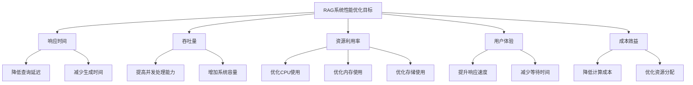

# 性能优化策略

## 引言

RAG系统的性能优化是确保系统高效运行的关键。随着数据量的增长和用户需求的提升，性能优化变得越来越重要。本文将深入探讨RAG系统的性能优化策略，包括检索优化、生成优化、缓存策略、并发处理和系统调优等方面。

## 性能优化概述

### 什么是RAG系统性能优化

RAG系统性能优化是指通过技术手段提升系统的响应速度、吞吐量和资源利用率，确保系统能够高效处理用户查询和生成回答。

### 性能优化的目标



### 性能优化的挑战

1. **检索性能**：大规模向量检索的延迟
2. **生成性能**：LLM调用的延迟和成本
3. **并发处理**：多用户同时查询的处理
4. **资源限制**：CPU、内存、存储的限制
5. **数据增长**：随着数据量增长的性能下降

## 检索性能优化

### 1. 向量索引优化

#### 索引结构优化

```python
class VectorIndexOptimizer:
    def __init__(self):
        self.index_types = {
            'flat': FlatIndex(),
            'ivf': IVFIndex(),
            'hnsw': HNSWIndex(),
            'pq': PQIndex()
        }
        self.current_index = None
    
    def optimize_index(self, vectors: List[List[float]], 
                      query_pattern: str = 'random') -> str:
        """优化向量索引"""
        # 根据数据特征选择最佳索引类型
        if len(vectors) < 1000:
            # 小数据集使用Flat索引
            index_type = 'flat'
        elif query_pattern == 'random':
            # 随机查询使用IVF索引
            index_type = 'ivf'
        elif query_pattern == 'similar':
            # 相似查询使用HNSW索引
            index_type = 'hnsw'
        else:
            # 默认使用PQ索引
            index_type = 'pq'
        
        # 创建优化索引
        self.current_index = self.index_types[index_type]
        self.current_index.build(vectors)
        
        return index_type
    
    def search_optimized(self, query_vector: List[float], 
                        top_k: int = 5) -> List[Dict[str, any]]:
        """优化搜索"""
        if self.current_index is None:
            raise Exception('索引未初始化')
        
        # 使用优化索引搜索
        results = self.current_index.search(query_vector, top_k)
        
        return results


class FlatIndex:
    def __init__(self):
        self.vectors = []
        self.ids = []
    
    def build(self, vectors: List[List[float]]):
        """构建Flat索引"""
        self.vectors = vectors
        self.ids = list(range(len(vectors)))
    
    def search(self, query_vector: List[float], top_k: int) -> List[Dict[str, any]]:
        """Flat搜索"""
        similarities = []
        
        for i, vector in enumerate(self.vectors):
            similarity = self._calculate_similarity(query_vector, vector)
            similarities.append((i, similarity))
        
        # 排序并返回top_k
        similarities.sort(key=lambda x: x[1], reverse=True)
        
        results = []
        for i, (idx, similarity) in enumerate(similarities[:top_k]):
            results.append({
                'id': self.ids[idx],
                'similarity': similarity,
                'rank': i + 1
            })
        
        return results
    
    def _calculate_similarity(self, vec1: List[float], vec2: List[float]) -> float:
        """计算相似度"""
        import numpy as np
        vec1_np = np.array(vec1)
        vec2_np = np.array(vec2)
        
        # 计算余弦相似度
        dot_product = np.dot(vec1_np, vec2_np)
        norm1 = np.linalg.norm(vec1_np)
        norm2 = np.linalg.norm(vec2_np)
        
        if norm1 == 0 or norm2 == 0:
            return 0.0
        
        return dot_product / (norm1 * norm2)


class IVFIndex:
    def __init__(self, n_clusters: int = 100):
        self.n_clusters = n_clusters
        self.clusters = []
        self.cluster_centers = []
        self.vectors = []
        self.ids = []
    
    def build(self, vectors: List[List[float]]):
        """构建IVF索引"""
        self.vectors = vectors
        self.ids = list(range(len(vectors)))
        
        # 使用K-means聚类
        self._cluster_vectors(vectors)
    
    def _cluster_vectors(self, vectors: List[List[float]]):
        """聚类向量"""
        import numpy as np
        from sklearn.cluster import KMeans
        
        vectors_np = np.array(vectors)
        
        # 执行K-means聚类
        kmeans = KMeans(n_clusters=self.n_clusters, random_state=42)
        cluster_labels = kmeans.fit_predict(vectors_np)
        
        # 存储聚类中心和向量分配
        self.cluster_centers = kmeans.cluster_centers_
        self.clusters = [[] for _ in range(self.n_clusters)]
        
        for i, label in enumerate(cluster_labels):
            self.clusters[label].append(i)
    
    def search(self, query_vector: List[float], top_k: int) -> List[Dict[str, any]]:
        """IVF搜索"""
        import numpy as np
        
        query_np = np.array(query_vector)
        
        # 找到最相关的聚类
        cluster_similarities = []
        for i, center in enumerate(self.cluster_centers):
            similarity = self._calculate_similarity(query_vector, center.tolist())
            cluster_similarities.append((i, similarity))
        
        # 排序聚类
        cluster_similarities.sort(key=lambda x: x[1], reverse=True)
        
        # 在相关聚类中搜索
        candidates = []
        for cluster_idx, _ in cluster_similarities[:5]:  # 搜索前5个聚类
            for vector_idx in self.clusters[cluster_idx]:
                vector = self.vectors[vector_idx]
                similarity = self._calculate_similarity(query_vector, vector)
                candidates.append((vector_idx, similarity))
        
        # 排序并返回top_k
        candidates.sort(key=lambda x: x[1], reverse=True)
        
        results = []
        for i, (idx, similarity) in enumerate(candidates[:top_k]):
            results.append({
                'id': self.ids[idx],
                'similarity': similarity,
                'rank': i + 1
            })
        
        return results
    
    def _calculate_similarity(self, vec1: List[float], vec2: List[float]) -> float:
        """计算相似度"""
        import numpy as np
        vec1_np = np.array(vec1)
        vec2_np = np.array(vec2)
        
        dot_product = np.dot(vec1_np, vec2_np)
        norm1 = np.linalg.norm(vec1_np)
        norm2 = np.linalg.norm(vec2_np)
        
        if norm1 == 0 or norm2 == 0:
            return 0.0
        
        return dot_product / (norm1 * norm2)


class HNSWIndex:
    def __init__(self, m: int = 16, ef_construction: int = 200):
        self.m = m
        self.ef_construction = ef_construction
        self.ef_search = 50
        self.vectors = []
        self.ids = []
        self.graph = {}
    
    def build(self, vectors: List[List[float]]):
        """构建HNSW索引"""
        self.vectors = vectors
        self.ids = list(range(len(vectors)))
        
        # 构建HNSW图
        self._build_hnsw_graph(vectors)
    
    def _build_hnsw_graph(self, vectors: List[List[float]]):
        """构建HNSW图"""
        # 简化的HNSW实现
        # 实际应用中可以使用专业的HNSW库
        self.graph = {}
        
        for i, vector in enumerate(vectors):
            self.graph[i] = []
            
            # 找到最近的邻居
            neighbors = self._find_nearest_neighbors(vector, vectors, self.m)
            
            for neighbor_idx in neighbors:
                if neighbor_idx != i:
                    self.graph[i].append(neighbor_idx)
                    if neighbor_idx not in self.graph:
                        self.graph[neighbor_idx] = []
                    self.graph[neighbor_idx].append(i)
    
    def _find_nearest_neighbors(self, query_vector: List[float], 
                              vectors: List[List[float]], k: int) -> List[int]:
        """找到最近的邻居"""
        similarities = []
        
        for i, vector in enumerate(vectors):
            similarity = self._calculate_similarity(query_vector, vector)
            similarities.append((i, similarity))
        
        similarities.sort(key=lambda x: x[1], reverse=True)
        return [idx for idx, _ in similarities[:k]]
    
    def search(self, query_vector: List[float], top_k: int) -> List[Dict[str, any]]:
        """HNSW搜索"""
        # 简化的HNSW搜索
        # 实际应用中可以使用专业的HNSW库
        
        # 从随机节点开始搜索
        import random
        start_node = random.randint(0, len(self.vectors) - 1)
        
        # 使用贪心搜索
        current_node = start_node
        visited = set()
        candidates = []
        
        while current_node not in visited and len(candidates) < self.ef_search:
            visited.add(current_node)
            
            # 计算当前节点的相似度
            similarity = self._calculate_similarity(
                query_vector, self.vectors[current_node]
            )
            candidates.append((current_node, similarity))
            
            # 移动到最相似的邻居
            best_neighbor = None
            best_similarity = -1
            
            for neighbor in self.graph.get(current_node, []):
                if neighbor not in visited:
                    neighbor_similarity = self._calculate_similarity(
                        query_vector, self.vectors[neighbor]
                    )
                    if neighbor_similarity > best_similarity:
                        best_similarity = neighbor_similarity
                        best_neighbor = neighbor
            
            if best_neighbor is not None:
                current_node = best_neighbor
            else:
                break
        
        # 排序并返回top_k
        candidates.sort(key=lambda x: x[1], reverse=True)
        
        results = []
        for i, (idx, similarity) in enumerate(candidates[:top_k]):
            results.append({
                'id': self.ids[idx],
                'similarity': similarity,
                'rank': i + 1
            })
        
        return results
    
    def _calculate_similarity(self, vec1: List[float], vec2: List[float]) -> float:
        """计算相似度"""
        import numpy as np
        vec1_np = np.array(vec1)
        vec2_np = np.array(vec2)
        
        dot_product = np.dot(vec1_np, vec2_np)
        norm1 = np.linalg.norm(vec1_np)
        norm2 = np.linalg.norm(vec2_np)
        
        if norm1 == 0 or norm2 == 0:
            return 0.0
        
        return dot_product / (norm1 * norm2)


class PQIndex:
    def __init__(self, n_subvectors: int = 8):
        self.n_subvectors = n_subvectors
        self.codebooks = []
        self.codes = []
        self.vectors = []
        self.ids = []
    
    def build(self, vectors: List[List[float]]):
        """构建PQ索引"""
        self.vectors = vectors
        self.ids = list(range(len(vectors)))
        
        # 训练PQ码本
        self._train_codebooks(vectors)
        
        # 编码向量
        self._encode_vectors(vectors)
    
    def _train_codebooks(self, vectors: List[List[float]]):
        """训练PQ码本"""
        import numpy as np
        from sklearn.cluster import KMeans
        
        vectors_np = np.array(vectors)
        vector_dim = vectors_np.shape[1]
        subvector_dim = vector_dim // self.n_subvectors
        
        self.codebooks = []
        
        for i in range(self.n_subvectors):
            start_idx = i * subvector_dim
            end_idx = start_idx + subvector_dim
            
            # 提取子向量
            subvectors = vectors_np[:, start_idx:end_idx]
            
            # 训练码本
            kmeans = KMeans(n_clusters=256, random_state=42)
            kmeans.fit(subvectors)
            
            self.codebooks.append(kmeans.cluster_centers_)
    
    def _encode_vectors(self, vectors: List[List[float]]):
        """编码向量"""
        import numpy as np
        
        vectors_np = np.array(vectors)
        vector_dim = vectors_np.shape[1]
        subvector_dim = vector_dim // self.n_subvectors
        
        self.codes = []
        
        for vector in vectors_np:
            code = []
            
            for i in range(self.n_subvectors):
                start_idx = i * subvector_dim
                end_idx = start_idx + subvector_dim
                
                subvector = vector[start_idx:end_idx]
                
                # 找到最近的码本中心
                distances = np.linalg.norm(
                    self.codebooks[i] - subvector, axis=1
                )
                closest_center = np.argmin(distances)
                
                code.append(closest_center)
            
            self.codes.append(code)
    
    def search(self, query_vector: List[float], top_k: int) -> List[Dict[str, any]]:
        """PQ搜索"""
        import numpy as np
        
        # 编码查询向量
        query_code = self._encode_query(query_vector)
        
        # 计算距离
        distances = []
        for i, code in enumerate(self.codes):
            distance = self._calculate_pq_distance(query_code, code)
            distances.append((i, distance))
        
        # 排序并返回top_k
        distances.sort(key=lambda x: x[1])
        
        results = []
        for i, (idx, distance) in enumerate(distances[:top_k]):
            results.append({
                'id': self.ids[idx],
                'similarity': 1.0 / (1.0 + distance),  # 转换为相似度
                'rank': i + 1
            })
        
        return results
    
    def _encode_query(self, query_vector: List[float]) -> List[int]:
        """编码查询向量"""
        import numpy as np
        
        query_np = np.array(query_vector)
        vector_dim = query_np.shape[0]
        subvector_dim = vector_dim // self.n_subvectors
        
        code = []
        
        for i in range(self.n_subvectors):
            start_idx = i * subvector_dim
            end_idx = start_idx + subvector_dim
            
            subvector = query_np[start_idx:end_idx]
            
            # 找到最近的码本中心
            distances = np.linalg.norm(
                self.codebooks[i] - subvector, axis=1
            )
            closest_center = np.argmin(distances)
            
            code.append(closest_center)
        
        return code
    
    def _calculate_pq_distance(self, query_code: List[int], 
                             vector_code: List[int]) -> float:
        """计算PQ距离"""
        distance = 0.0
        
        for i in range(len(query_code)):
            # 计算子向量距离
            subvector_distance = np.linalg.norm(
                self.codebooks[i][query_code[i]] - 
                self.codebooks[i][vector_code[i]]
            )
            distance += subvector_distance ** 2
        
        return np.sqrt(distance)
```

### 2. 检索策略优化

#### 多阶段检索

```python
class MultiStageRetrievalOptimizer:
    def __init__(self):
        self.stages = [
            CoarseRetrievalStage(),
            FineRetrievalStage(),
            RerankingStage()
        ]
        self.cache = RetrievalCache()
    
    def optimize_retrieval(self, query: str, top_k: int = 5) -> List[Dict[str, any]]:
        """多阶段检索优化"""
        # 检查缓存
        cached_result = self.cache.get(query, top_k)
        if cached_result:
            return cached_result
        
        # 执行多阶段检索
        candidates = []
        
        # 第一阶段：粗检索
        coarse_results = self.stages[0].retrieve(query, top_k * 10)
        candidates.extend(coarse_results)
        
        # 第二阶段：精检索
        fine_results = self.stages[1].retrieve(query, candidates, top_k * 3)
        candidates = fine_results
        
        # 第三阶段：重排序
        final_results = self.stages[2].rerank(query, candidates, top_k)
        
        # 缓存结果
        self.cache.set(query, top_k, final_results)
        
        return final_results


class CoarseRetrievalStage:
    def __init__(self):
        self.index = None
        self.vectorizer = Vectorizer()
    
    def retrieve(self, query: str, top_k: int) -> List[Dict[str, any]]:
        """粗检索"""
        # 向量化查询
        query_vector = self.vectorizer.vectorize_query(query)
        
        # 使用快速索引检索
        results = self.index.search(query_vector, top_k)
        
        return results


class FineRetrievalStage:
    def __init__(self):
        self.vectorizer = Vectorizer()
        self.similarity_calculator = SimilarityCalculator()
    
    def retrieve(self, query: str, candidates: List[Dict[str, any]], 
                top_k: int) -> List[Dict[str, any]]:
        """精检索"""
        # 向量化查询
        query_vector = self.vectorizer.vectorize_query(query)
        
        # 重新计算相似度
        refined_results = []
        for candidate in candidates:
            # 获取文档向量
            doc_vector = self.vectorizer.vectorize_document(candidate['document'])
            
            # 计算精确相似度
            similarity = self.similarity_calculator.calculate(
                query_vector, doc_vector
            )
            
            refined_results.append({
                'document': candidate['document'],
                'similarity': similarity,
                'doc_id': candidate['doc_id']
            })
        
        # 排序并返回top_k
        refined_results.sort(key=lambda x: x['similarity'], reverse=True)
        return refined_results[:top_k]


class RerankingStage:
    def __init__(self):
        self.reranker = CrossEncoderReranker()
        self.feature_extractor = FeatureExtractor()
    
    def rerank(self, query: str, candidates: List[Dict[str, any]], 
              top_k: int) -> List[Dict[str, any]]:
        """重排序"""
        # 提取特征
        features = []
        for candidate in candidates:
            feature = self.feature_extractor.extract_features(
                query, candidate['document']
            )
            features.append(feature)
        
        # 重排序
        reranked_results = self.reranker.rerank(query, candidates, features)
        
        return reranked_results[:top_k]


class RetrievalCache:
    def __init__(self, max_size: int = 1000):
        self.cache = {}
        self.max_size = max_size
        self.access_times = {}
    
    def get(self, query: str, top_k: int) -> List[Dict[str, any]]:
        """获取缓存结果"""
        key = f"{query}_{top_k}"
        
        if key in self.cache:
            # 更新访问时间
            self.access_times[key] = time.time()
            return self.cache[key]
        
        return None
    
    def set(self, query: str, top_k: int, results: List[Dict[str, any]]):
        """设置缓存结果"""
        key = f"{query}_{top_k}"
        
        # 检查缓存大小
        if len(self.cache) >= self.max_size:
            self._evict_oldest()
        
        # 存储结果
        self.cache[key] = results
        self.access_times[key] = time.time()
    
    def _evict_oldest(self):
        """驱逐最旧的缓存项"""
        oldest_key = min(self.access_times.keys(), key=lambda k: self.access_times[k])
        del self.cache[oldest_key]
        del self.access_times[oldest_key]
```

### 3. 并行检索优化

#### 并行处理

```python
import asyncio
import concurrent.futures
from typing import List, Dict, Any

class ParallelRetrievalOptimizer:
    def __init__(self, max_workers: int = 4):
        self.max_workers = max_workers
        self.executor = concurrent.futures.ThreadPoolExecutor(max_workers=max_workers)
    
    def parallel_retrieve(self, queries: List[str], top_k: int = 5) -> List[List[Dict[str, any]]]:
        """并行检索多个查询"""
        # 提交所有任务
        futures = []
        for query in queries:
            future = self.executor.submit(self._retrieve_single, query, top_k)
            futures.append(future)
        
        # 收集结果
        results = []
        for future in concurrent.futures.as_completed(futures):
            try:
                result = future.result()
                results.append(result)
            except Exception as e:
                print(f"检索失败: {e}")
                results.append([])
        
        return results
    
    def _retrieve_single(self, query: str, top_k: int) -> List[Dict[str, any]]:
        """检索单个查询"""
        # 实现单个查询的检索逻辑
        pass
    
    async def async_parallel_retrieve(self, queries: List[str], 
                                    top_k: int = 5) -> List[List[Dict[str, any]]]:
        """异步并行检索"""
        # 创建异步任务
        tasks = []
        for query in queries:
            task = asyncio.create_task(self._async_retrieve_single(query, top_k))
            tasks.append(task)
        
        # 等待所有任务完成
        results = await asyncio.gather(*tasks, return_exceptions=True)
        
        # 处理异常
        processed_results = []
        for result in results:
            if isinstance(result, Exception):
                print(f"异步检索失败: {result}")
                processed_results.append([])
            else:
                processed_results.append(result)
        
        return processed_results
    
    async def _async_retrieve_single(self, query: str, top_k: int) -> List[Dict[str, any]]:
        """异步检索单个查询"""
        # 实现异步单个查询的检索逻辑
        pass


class DistributedRetrievalOptimizer:
    def __init__(self, nodes: List[str]):
        self.nodes = nodes
        self.load_balancer = LoadBalancer()
        self.client = DistributedClient()
    
    def distributed_retrieve(self, query: str, top_k: int = 5) -> List[Dict[str, any]]:
        """分布式检索"""
        # 选择节点
        selected_nodes = self.load_balancer.select_nodes(self.nodes, 3)
        
        # 并行检索
        futures = []
        for node in selected_nodes:
            future = self.client.retrieve_async(node, query, top_k)
            futures.append(future)
        
        # 收集结果
        results = []
        for future in futures:
            try:
                result = future.result()
                results.extend(result)
            except Exception as e:
                print(f"分布式检索失败: {e}")
        
        # 合并和排序结果
        merged_results = self._merge_results(results, top_k)
        
        return merged_results
    
    def _merge_results(self, results: List[List[Dict[str, any]]], 
                      top_k: int) -> List[Dict[str, any]]:
        """合并结果"""
        # 合并所有结果
        all_results = []
        for result_list in results:
            all_results.extend(result_list)
        
        # 去重
        unique_results = {}
        for result in all_results:
            doc_id = result['doc_id']
            if doc_id not in unique_results or result['similarity'] > unique_results[doc_id]['similarity']:
                unique_results[doc_id] = result
        
        # 排序并返回top_k
        sorted_results = sorted(unique_results.values(), 
                               key=lambda x: x['similarity'], reverse=True)
        
        return sorted_results[:top_k]


class LoadBalancer:
    def __init__(self):
        self.node_weights = {}
        self.node_loads = {}
    
    def select_nodes(self, nodes: List[str], count: int) -> List[str]:
        """选择节点"""
        # 根据负载选择节点
        sorted_nodes = sorted(nodes, key=lambda x: self.node_loads.get(x, 0))
        return sorted_nodes[:count]
    
    def update_load(self, node: str, load: float):
        """更新节点负载"""
        self.node_loads[node] = load


class DistributedClient:
    def __init__(self):
        self.http_client = HttpClient()
    
    def retrieve_async(self, node: str, query: str, top_k: int):
        """异步检索"""
        # 实现异步HTTP请求
        pass
```

## 生成性能优化

### 1. LLM调用优化

#### 批量处理

```python
class LLMCallOptimizer:
    def __init__(self):
        self.batch_size = 8
        self.request_queue = asyncio.Queue()
        self.response_cache = ResponseCache()
    
    async def batch_generate(self, requests: List[Dict[str, any]]) -> List[Dict[str, any]]:
        """批量生成"""
        # 检查缓存
        cached_responses = []
        uncached_requests = []
        
        for request in requests:
            cached_response = self.response_cache.get(request)
            if cached_response:
                cached_responses.append(cached_response)
            else:
                uncached_requests.append(request)
        
        # 批量处理未缓存的请求
        if uncached_requests:
            batch_responses = await self._process_batch(uncached_requests)
            
            # 缓存响应
            for request, response in zip(uncached_requests, batch_responses):
                self.response_cache.set(request, response)
            
            # 合并结果
            all_responses = cached_responses + batch_responses
        else:
            all_responses = cached_responses
        
        return all_responses
    
    async def _process_batch(self, requests: List[Dict[str, any]]) -> List[Dict[str, any]]:
        """处理批量请求"""
        # 分批处理
        batches = [requests[i:i + self.batch_size] 
                  for i in range(0, len(requests), self.batch_size)]
        
        all_responses = []
        for batch in batches:
            batch_response = await self._call_llm_batch(batch)
            all_responses.extend(batch_response)
        
        return all_responses
    
    async def _call_llm_batch(self, batch: List[Dict[str, any]]) -> List[Dict[str, any]]:
        """调用LLM批量处理"""
        # 实现LLM批量调用
        pass


class ResponseCache:
    def __init__(self, max_size: int = 1000):
        self.cache = {}
        self.max_size = max_size
        self.access_times = {}
    
    def get(self, request: Dict[str, any]) -> Dict[str, any]:
        """获取缓存响应"""
        key = self._generate_key(request)
        
        if key in self.cache:
            self.access_times[key] = time.time()
            return self.cache[key]
        
        return None
    
    def set(self, request: Dict[str, any], response: Dict[str, any]):
        """设置缓存响应"""
        key = self._generate_key(request)
        
        if len(self.cache) >= self.max_size:
            self._evict_oldest()
        
        self.cache[key] = response
        self.access_times[key] = time.time()
    
    def _generate_key(self, request: Dict[str, any]) -> str:
        """生成缓存键"""
        # 基于请求内容生成键
        import hashlib
        content = json.dumps(request, sort_keys=True)
        return hashlib.md5(content.encode()).hexdigest()
    
    def _evict_oldest(self):
        """驱逐最旧的缓存项"""
        oldest_key = min(self.access_times.keys(), key=lambda k: self.access_times[k])
        del self.cache[oldest_key]
        del self.access_times[oldest_key]
```

#### 流式生成

```python
class StreamingGenerationOptimizer:
    def __init__(self):
        self.streaming_client = StreamingClient()
        self.buffer_size = 1024
    
    async def stream_generate(self, query: str, context: str) -> AsyncGenerator[str, None]:
        """流式生成"""
        # 构建提示
        prompt = self._build_prompt(query, context)
        
        # 流式调用LLM
        async for chunk in self.streaming_client.stream_generate(prompt):
            yield chunk
    
    def _build_prompt(self, query: str, context: str) -> str:
        """构建提示"""
        return f"""
        基于以下上下文回答问题：
        
        上下文：
        {context}
        
        问题：
        {query}
        
        回答：
        """


class StreamingClient:
    def __init__(self):
        self.http_client = HttpClient()
    
    async def stream_generate(self, prompt: str) -> AsyncGenerator[str, None]:
        """流式生成"""
        # 实现流式HTTP请求
        pass
```

### 2. 提示优化

#### 提示模板优化

```python
class PromptTemplateOptimizer:
    def __init__(self):
        self.templates = {
            'qa': QATemplate(),
            'summarization': SummarizationTemplate(),
            'translation': TranslationTemplate(),
            'code_generation': CodeGenerationTemplate()
        }
        self.optimizer = TemplateOptimizer()
    
    def optimize_prompt(self, query: str, context: str, 
                       template_type: str = 'qa') -> str:
        """优化提示"""
        # 选择模板
        template = self.templates.get(template_type, self.templates['qa'])
        
        # 优化模板
        optimized_template = self.optimizer.optimize_template(template, query, context)
        
        # 生成提示
        prompt = optimized_template.generate(query, context)
        
        return prompt


class QATemplate:
    def __init__(self):
        self.base_template = """
        基于以下上下文回答问题：
        
        上下文：
        {context}
        
        问题：
        {query}
        
        回答：
        """
    
    def generate(self, query: str, context: str) -> str:
        """生成提示"""
        return self.base_template.format(context=context, query=query)


class SummarizationTemplate:
    def __init__(self):
        self.base_template = """
        请总结以下内容：
        
        内容：
        {context}
        
        总结：
        """
    
    def generate(self, query: str, context: str) -> str:
        """生成提示"""
        return self.base_template.format(context=context)


class TranslationTemplate:
    def __init__(self):
        self.base_template = """
        请将以下内容翻译成{target_language}：
        
        原文：
        {context}
        
        译文：
        """
    
    def generate(self, query: str, context: str) -> str:
        """生成提示"""
        # 从查询中提取目标语言
        target_language = self._extract_target_language(query)
        return self.base_template.format(
            context=context, 
            target_language=target_language
        )
    
    def _extract_target_language(self, query: str) -> str:
        """提取目标语言"""
        # 简单的语言提取逻辑
        if '英文' in query or 'English' in query:
            return '英文'
        elif '中文' in query or 'Chinese' in query:
            return '中文'
        else:
            return '英文'


class CodeGenerationTemplate:
    def __init__(self):
        self.base_template = """
        请根据以下需求生成代码：
        
        需求：
        {query}
        
        代码：
        """
    
    def generate(self, query: str, context: str) -> str:
        """生成提示"""
        return self.base_template.format(query=query)


class TemplateOptimizer:
    def __init__(self):
        self.optimization_rules = [
            self._optimize_length,
            self._optimize_clarity,
            self._optimize_structure
        ]
    
    def optimize_template(self, template, query: str, context: str):
        """优化模板"""
        optimized_template = template
        
        for rule in self.optimization_rules:
            optimized_template = rule(optimized_template, query, context)
        
        return optimized_template
    
    def _optimize_length(self, template, query: str, context: str):
        """优化长度"""
        # 根据查询和上下文长度调整模板
        if len(query) > 100:
            # 长查询使用简化模板
            template.base_template = template.base_template.replace(
                '基于以下上下文回答问题：', '请回答：'
            )
        
        return template
    
    def _optimize_clarity(self, template, query: str, context: str):
        """优化清晰度"""
        # 添加清晰度指示
        template.base_template = template.base_template.replace(
            '回答：', '请提供清晰、准确的回答：'
        )
        
        return template
    
    def _optimize_structure(self, template, query: str, context: str):
        """优化结构"""
        # 添加结构指示
        template.base_template = template.base_template.replace(
            '回答：', '请按以下结构回答：\n1. 主要观点\n2. 详细说明\n3. 总结\n\n回答：'
        )
        
        return template
```

## 缓存策略

### 1. 多级缓存

#### 缓存层次

```python
class MultiLevelCache:
    def __init__(self):
        self.l1_cache = L1Cache()  # 内存缓存
        self.l2_cache = L2Cache()  # Redis缓存
        self.l3_cache = L3Cache()  # 数据库缓存
    
    def get(self, key: str) -> any:
        """获取缓存"""
        # L1缓存
        value = self.l1_cache.get(key)
        if value is not None:
            return value
        
        # L2缓存
        value = self.l2_cache.get(key)
        if value is not None:
            # 回填L1缓存
            self.l1_cache.set(key, value)
            return value
        
        # L3缓存
        value = self.l3_cache.get(key)
        if value is not None:
            # 回填L1和L2缓存
            self.l1_cache.set(key, value)
            self.l2_cache.set(key, value)
            return value
        
        return None
    
    def set(self, key: str, value: any, ttl: int = 3600):
        """设置缓存"""
        # 设置所有级别的缓存
        self.l1_cache.set(key, value, ttl)
        self.l2_cache.set(key, value, ttl)
        self.l3_cache.set(key, value, ttl)


class L1Cache:
    def __init__(self, max_size: int = 1000):
        self.cache = {}
        self.max_size = max_size
        self.access_times = {}
        self.ttl = {}
    
    def get(self, key: str) -> any:
        """获取缓存"""
        if key in self.cache:
            # 检查TTL
            if time.time() > self.ttl.get(key, 0):
                del self.cache[key]
                del self.access_times[key]
                del self.ttl[key]
                return None
            
            # 更新访问时间
            self.access_times[key] = time.time()
            return self.cache[key]
        
        return None
    
    def set(self, key: str, value: any, ttl: int = 3600):
        """设置缓存"""
        # 检查缓存大小
        if len(self.cache) >= self.max_size:
            self._evict_oldest()
        
        # 设置缓存
        self.cache[key] = value
        self.access_times[key] = time.time()
        self.ttl[key] = time.time() + ttl
    
    def _evict_oldest(self):
        """驱逐最旧的缓存项"""
        oldest_key = min(self.access_times.keys(), key=lambda k: self.access_times[k])
        del self.cache[oldest_key]
        del self.access_times[oldest_key]
        del self.ttl[oldest_key]


class L2Cache:
    def __init__(self):
        self.redis_client = RedisClient()
    
    def get(self, key: str) -> any:
        """获取缓存"""
        return self.redis_client.get(key)
    
    def set(self, key: str, value: any, ttl: int = 3600):
        """设置缓存"""
        self.redis_client.set(key, value, ttl)


class L3Cache:
    def __init__(self):
        self.db_client = DatabaseClient()
    
    def get(self, key: str) -> any:
        """获取缓存"""
        return self.db_client.get_cache(key)
    
    def set(self, key: str, value: any, ttl: int = 3600):
        """设置缓存"""
        self.db_client.set_cache(key, value, ttl)
```

### 2. 智能缓存

#### 缓存策略

```python
class IntelligentCache:
    def __init__(self):
        self.cache_policies = {
            'frequent': FrequentAccessPolicy(),
            'recent': RecentAccessPolicy(),
            'predictive': PredictiveAccessPolicy()
        }
        self.current_policy = 'frequent'
        self.access_patterns = AccessPatternAnalyzer()
    
    def get(self, key: str) -> any:
        """获取缓存"""
        # 分析访问模式
        self.access_patterns.record_access(key)
        
        # 根据策略获取缓存
        policy = self.cache_policies[self.current_policy]
        return policy.get(key)
    
    def set(self, key: str, value: any, ttl: int = 3600):
        """设置缓存"""
        # 根据策略设置缓存
        policy = self.cache_policies[self.current_policy]
        policy.set(key, value, ttl)
    
    def adapt_policy(self):
        """自适应策略"""
        # 分析访问模式
        patterns = self.access_patterns.analyze_patterns()
        
        # 选择最佳策略
        if patterns['frequency'] > 0.8:
            self.current_policy = 'frequent'
        elif patterns['recency'] > 0.8:
            self.current_policy = 'recent'
        else:
            self.current_policy = 'predictive'


class FrequentAccessPolicy:
    def __init__(self):
        self.cache = {}
        self.access_counts = {}
        self.max_size = 1000
    
    def get(self, key: str) -> any:
        """获取缓存"""
        if key in self.cache:
            self.access_counts[key] = self.access_counts.get(key, 0) + 1
            return self.cache[key]
        return None
    
    def set(self, key: str, value: any, ttl: int = 3600):
        """设置缓存"""
        if len(self.cache) >= self.max_size:
            self._evict_least_frequent()
        
        self.cache[key] = value
        self.access_counts[key] = 1
    
    def _evict_least_frequent(self):
        """驱逐最少访问的缓存项"""
        least_frequent_key = min(self.access_counts.keys(), 
                                key=lambda k: self.access_counts[k])
        del self.cache[least_frequent_key]
        del self.access_counts[least_frequent_key]


class RecentAccessPolicy:
    def __init__(self):
        self.cache = {}
        self.access_times = {}
        self.max_size = 1000
    
    def get(self, key: str) -> any:
        """获取缓存"""
        if key in self.cache:
            self.access_times[key] = time.time()
            return self.cache[key]
        return None
    
    def set(self, key: str, value: any, ttl: int = 3600):
        """设置缓存"""
        if len(self.cache) >= self.max_size:
            self._evict_oldest()
        
        self.cache[key] = value
        self.access_times[key] = time.time()
    
    def _evict_oldest(self):
        """驱逐最旧的缓存项"""
        oldest_key = min(self.access_times.keys(), key=lambda k: self.access_times[k])
        del self.cache[oldest_key]
        del self.access_times[oldest_key]


class PredictiveAccessPolicy:
    def __init__(self):
        self.cache = {}
        self.predictor = AccessPredictor()
        self.max_size = 1000
    
    def get(self, key: str) -> any:
        """获取缓存"""
        if key in self.cache:
            # 更新预测模型
            self.predictor.update_model(key, True)
            return self.cache[key]
        else:
            # 更新预测模型
            self.predictor.update_model(key, False)
            return None
    
    def set(self, key: str, value: any, ttl: int = 3600):
        """设置缓存"""
        if len(self.cache) >= self.max_size:
            self._evict_least_likely()
        
        self.cache[key] = value
    
    def _evict_least_likely(self):
        """驱逐最不可能访问的缓存项"""
        least_likely_key = min(self.cache.keys(), 
                              key=lambda k: self.predictor.predict_probability(k))
        del self.cache[least_likely_key]


class AccessPatternAnalyzer:
    def __init__(self):
        self.access_history = []
        self.patterns = {}
    
    def record_access(self, key: str):
        """记录访问"""
        self.access_history.append({
            'key': key,
            'timestamp': time.time()
        })
    
    def analyze_patterns(self) -> Dict[str, float]:
        """分析访问模式"""
        if not self.access_history:
            return {'frequency': 0.0, 'recency': 0.0}
        
        # 分析频率模式
        frequency_score = self._analyze_frequency()
        
        # 分析时间模式
        recency_score = self._analyze_recency()
        
        return {
            'frequency': frequency_score,
            'recency': recency_score
        }
    
    def _analyze_frequency(self) -> float:
        """分析频率模式"""
        # 计算访问频率
        access_counts = {}
        for access in self.access_history:
            key = access['key']
            access_counts[key] = access_counts.get(key, 0) + 1
        
        # 计算频率分数
        if access_counts:
            max_count = max(access_counts.values())
            avg_count = sum(access_counts.values()) / len(access_counts)
            return avg_count / max_count
        
        return 0.0
    
    def _analyze_recency(self) -> float:
        """分析时间模式"""
        # 计算最近访问时间
        recent_accesses = [access for access in self.access_history 
                          if time.time() - access['timestamp'] < 3600]
        
        return len(recent_accesses) / len(self.access_history) if self.access_history else 0.0


class AccessPredictor:
    def __init__(self):
        self.model = None
        self.features = {}
        self.labels = {}
    
    def update_model(self, key: str, accessed: bool):
        """更新预测模型"""
        # 提取特征
        features = self._extract_features(key)
        
        # 存储特征和标签
        self.features[key] = features
        self.labels[key] = accessed
        
        # 训练模型
        self._train_model()
    
    def predict_probability(self, key: str) -> float:
        """预测访问概率"""
        if key not in self.features:
            return 0.0
        
        features = self.features[key]
        
        # 使用模型预测
        if self.model:
            return self.model.predict_proba([features])[0][1]
        else:
            return 0.5
    
    def _extract_features(self, key: str) -> List[float]:
        """提取特征"""
        # 简单的特征提取
        features = [
            len(key),
            hash(key) % 100,
            time.time() % 1000
        ]
        
        return features
    
    def _train_model(self):
        """训练预测模型"""
        if len(self.features) < 10:
            return
        
        # 准备训练数据
        X = list(self.features.values())
        y = list(self.labels.values())
        
        # 训练模型
        from sklearn.ensemble import RandomForestClassifier
        self.model = RandomForestClassifier(n_estimators=10, random_state=42)
        self.model.fit(X, y)
```

## 并发处理优化

### 1. 异步处理

#### 异步架构

```python
import asyncio
from typing import List, Dict, Any, AsyncGenerator

class AsyncRAGSystem:
    def __init__(self):
        self.document_processor = AsyncDocumentProcessor()
        self.vectorizer = AsyncVectorizer()
        self.retriever = AsyncRetriever()
        self.generator = AsyncGenerator()
        self.cache = AsyncCache()
    
    async def process_query_async(self, query: str, user_id: str) -> Dict[str, any]:
        """异步处理查询"""
        try:
            # 并行执行检索和用户信息获取
            retrieval_task = asyncio.create_task(
                self.retriever.retrieve_async(query)
            )
            user_task = asyncio.create_task(
                self.get_user_info_async(user_id)
            )
            
            # 等待任务完成
            retrieval_result, user_info = await asyncio.gather(
                retrieval_task, user_task
            )
            
            # 生成回答
            generation_result = await self.generator.generate_async(
                query, retrieval_result['documents']
            )
            
            # 并行执行记录历史和发送通知
            history_task = asyncio.create_task(
                self.record_query_history_async(user_id, query, generation_result['response'])
            )
            notification_task = asyncio.create_task(
                self.send_notification_async(user_id, generation_result['response'])
            )
            
            # 等待任务完成
            await asyncio.gather(history_task, notification_task)
            
            return {
                'response': generation_result['response'],
                'relevant_docs': retrieval_result['documents'],
                'timestamp': time.time()
            }
            
        except Exception as e:
            return {'error': f'处理查询失败: {str(e)}'}
    
    async def get_user_info_async(self, user_id: str) -> Dict[str, any]:
        """异步获取用户信息"""
        # 实现异步用户信息获取
        pass
    
    async def record_query_history_async(self, user_id: str, query: str, response: str):
        """异步记录查询历史"""
        # 实现异步历史记录
        pass
    
    async def send_notification_async(self, user_id: str, response: str):
        """异步发送通知"""
        # 实现异步通知发送
        pass


class AsyncDocumentProcessor:
    def __init__(self):
        self.processors = {
            'pdf': AsyncPDFProcessor(),
            'docx': AsyncDocxProcessor(),
            'txt': AsyncTextProcessor(),
            'html': AsyncHTMLProcessor()
        }
    
    async def process_document_async(self, document: Dict[str, any]) -> Dict[str, any]:
        """异步处理文档"""
        doc_type = document.get('type', 'txt')
        processor = self.processors.get(doc_type, self.processors['txt'])
        
        return await processor.process_async(document)
    
    async def process_documents_async(self, documents: List[Dict[str, any]]) -> List[Dict[str, any]]:
        """异步批量处理文档"""
        tasks = []
        for document in documents:
            task = asyncio.create_task(self.process_document_async(document))
            tasks.append(task)
        
        results = await asyncio.gather(*tasks)
        return results


class AsyncVectorizer:
    def __init__(self):
        self.embedding_model = AsyncEmbeddingModel()
        self.batch_size = 32
    
    async def vectorize_document_async(self, document: Dict[str, any]) -> List[float]:
        """异步向量化文档"""
        text = document['content']
        return await self.embedding_model.encode_async(text)
    
    async def vectorize_documents_async(self, documents: List[Dict[str, any]]) -> List[List[float]]:
        """异步批量向量化文档"""
        # 分批处理
        batches = [documents[i:i + self.batch_size] 
                  for i in range(0, len(documents), self.batch_size)]
        
        all_vectors = []
        for batch in batches:
            batch_vectors = await self._vectorize_batch_async(batch)
            all_vectors.extend(batch_vectors)
        
        return all_vectors
    
    async def _vectorize_batch_async(self, batch: List[Dict[str, any]]) -> List[List[float]]:
        """异步批量向量化"""
        texts = [doc['content'] for doc in batch]
        vectors = await self.embedding_model.encode_batch_async(texts)
        return vectors


class AsyncRetriever:
    def __init__(self):
        self.vectorizer = AsyncVectorizer()
        self.index = AsyncVectorIndex()
        self.similarity_calculator = AsyncSimilarityCalculator()
    
    async def retrieve_async(self, query: str, top_k: int = 5) -> Dict[str, any]:
        """异步检索"""
        # 向量化查询
        query_vector = await self.vectorizer.vectorize_query_async(query)
        
        # 搜索相似文档
        similar_docs = await self.index.search_async(query_vector, top_k)
        
        return {
            'documents': similar_docs,
            'query_vector': query_vector
        }
    
    async def hybrid_retrieve_async(self, query: str, filters: Dict[str, any] = None) -> Dict[str, any]:
        """异步混合检索"""
        # 并行执行语义检索和关键词检索
        semantic_task = asyncio.create_task(
            self.semantic_retrieve_async(query)
        )
        keyword_task = asyncio.create_task(
            self.keyword_retrieve_async(query, filters)
        )
        
        semantic_result, keyword_result = await asyncio.gather(
            semantic_task, keyword_task
        )
        
        # 合并结果
        merged_result = self._merge_results(semantic_result, keyword_result)
        
        return merged_result
    
    async def semantic_retrieve_async(self, query: str) -> List[Dict[str, any]]:
        """异步语义检索"""
        # 实现异步语义检索
        pass
    
    async def keyword_retrieve_async(self, query: str, filters: Dict[str, any] = None) -> List[Dict[str, any]]:
        """异步关键词检索"""
        # 实现异步关键词检索
        pass
    
    def _merge_results(self, semantic_result: List[Dict[str, any]], 
                      keyword_result: List[Dict[str, any]]) -> List[Dict[str, any]]:
        """合并结果"""
        # 实现结果合并逻辑
        pass


class AsyncGenerator:
    def __init__(self):
        self.llm = AsyncLLM()
        self.prompt_builder = AsyncPromptBuilder()
    
    async def generate_async(self, query: str, relevant_docs: List[Dict[str, any]]) -> Dict[str, any]:
        """异步生成回答"""
        # 构建提示
        prompt = await self.prompt_builder.build_prompt_async(query, relevant_docs)
        
        # 生成回答
        response = await self.llm.generate_async(prompt)
        
        return {
            'response': response,
            'prompt': prompt
        }
    
    async def stream_generate_async(self, query: str, relevant_docs: List[Dict[str, any]]) -> AsyncGenerator[str, None]:
        """异步流式生成"""
        # 构建提示
        prompt = await self.prompt_builder.build_prompt_async(query, relevant_docs)
        
        # 流式生成
        async for chunk in self.llm.stream_generate_async(prompt):
            yield chunk


class AsyncCache:
    def __init__(self):
        self.redis_client = AsyncRedisClient()
        self.memory_cache = {}
    
    async def get_async(self, key: str) -> any:
        """异步获取缓存"""
        # 先检查内存缓存
        if key in self.memory_cache:
            return self.memory_cache[key]
        
        # 检查Redis缓存
        value = await self.redis_client.get_async(key)
        if value:
            # 回填内存缓存
            self.memory_cache[key] = value
        
        return value
    
    async def set_async(self, key: str, value: any, ttl: int = 3600):
        """异步设置缓存"""
        # 设置内存缓存
        self.memory_cache[key] = value
        
        # 设置Redis缓存
        await self.redis_client.set_async(key, value, ttl)
    
    async def invalidate_async(self, key: str):
        """异步失效缓存"""
        # 删除内存缓存
        if key in self.memory_cache:
            del self.memory_cache[key]
        
        # 删除Redis缓存
        await self.redis_client.delete_async(key)
```

### 2. 线程池优化

#### 线程池管理

```python
import threading
from concurrent.futures import ThreadPoolExecutor, ProcessPoolExecutor
from typing import List, Dict, Any

class ThreadPoolOptimizer:
    def __init__(self, max_workers: int = 4):
        self.max_workers = max_workers
        self.thread_pool = ThreadPoolExecutor(max_workers=max_workers)
        self.process_pool = ProcessPoolExecutor(max_workers=max_workers)
        self.task_queue = asyncio.Queue()
        self.result_cache = {}
    
    def submit_task(self, func, *args, **kwargs):
        """提交任务"""
        future = self.thread_pool.submit(func, *args, **kwargs)
        return future
    
    def submit_cpu_intensive_task(self, func, *args, **kwargs):
        """提交CPU密集型任务"""
        future = self.process_pool.submit(func, *args, **kwargs)
        return future
    
    def batch_submit_tasks(self, tasks: List[Dict[str, any]]) -> List[any]:
        """批量提交任务"""
        futures = []
        for task in tasks:
            func = task['func']
            args = task.get('args', [])
            kwargs = task.get('kwargs', {})
            
            if task.get('cpu_intensive', False):
                future = self.submit_cpu_intensive_task(func, *args, **kwargs)
            else:
                future = self.submit_task(func, *args, **kwargs)
            
            futures.append(future)
        
        # 等待所有任务完成
        results = []
        for future in futures:
            try:
                result = future.result()
                results.append(result)
            except Exception as e:
                print(f"任务执行失败: {e}")
                results.append(None)
        
        return results
    
    def optimize_thread_pool(self):
        """优化线程池"""
        # 根据系统负载调整线程池大小
        cpu_count = os.cpu_count()
        current_load = self._get_system_load()
        
        if current_load > 0.8:
            # 高负载时减少线程数
            optimal_workers = max(1, cpu_count // 2)
        elif current_load < 0.3:
            # 低负载时增加线程数
            optimal_workers = min(cpu_count * 2, 16)
        else:
            # 中等负载时保持当前线程数
            optimal_workers = cpu_count
        
        if optimal_workers != self.max_workers:
            self._resize_thread_pool(optimal_workers)
    
    def _get_system_load(self) -> float:
        """获取系统负载"""
        import psutil
        return psutil.cpu_percent() / 100.0
    
    def _resize_thread_pool(self, new_size: int):
        """调整线程池大小"""
        # 关闭当前线程池
        self.thread_pool.shutdown(wait=True)
        
        # 创建新的线程池
        self.thread_pool = ThreadPoolExecutor(max_workers=new_size)
        self.max_workers = new_size


class ConcurrentRAGSystem:
    def __init__(self):
        self.thread_pool_optimizer = ThreadPoolOptimizer()
        self.document_processor = DocumentProcessor()
        self.vectorizer = Vectorizer()
        self.retriever = Retriever()
        self.generator = Generator()
    
    def process_query_concurrent(self, query: str, user_id: str) -> Dict[str, any]:
        """并发处理查询"""
        try:
            # 并行执行检索和用户信息获取
            retrieval_future = self.thread_pool_optimizer.submit_task(
                self.retriever.retrieve, query
            )
            user_future = self.thread_pool_optimizer.submit_task(
                self.get_user_info, user_id
            )
            
            # 等待任务完成
            retrieval_result = retrieval_future.result()
            user_info = user_future.result()
            
            # 生成回答
            generation_result = self.generator.generate(
                query, retrieval_result['documents']
            )
            
            # 并行执行记录历史和发送通知
            history_future = self.thread_pool_optimizer.submit_task(
                self.record_query_history, user_id, query, generation_result['response']
            )
            notification_future = self.thread_pool_optimizer.submit_task(
                self.send_notification, user_id, generation_result['response']
            )
            
            # 等待任务完成
            history_future.result()
            notification_future.result()
            
            return {
                'response': generation_result['response'],
                'relevant_docs': retrieval_result['documents'],
                'timestamp': time.time()
            }
            
        except Exception as e:
            return {'error': f'处理查询失败: {str(e)}'}
    
    def process_documents_concurrent(self, documents: List[Dict[str, any]]) -> List[Dict[str, any]]:
        """并发处理文档"""
        # 创建任务列表
        tasks = []
        for document in documents:
            task = {
                'func': self.document_processor.process_document,
                'args': [document],
                'cpu_intensive': True
            }
            tasks.append(task)
        
        # 批量提交任务
        results = self.thread_pool_optimizer.batch_submit_tasks(tasks)
        
        return results
    
    def vectorize_documents_concurrent(self, documents: List[Dict[str, any]]) -> List[List[float]]:
        """并发向量化文档"""
        # 创建任务列表
        tasks = []
        for document in documents:
            task = {
                'func': self.vectorizer.vectorize_document,
                'args': [document],
                'cpu_intensive': True
            }
            tasks.append(task)
        
        # 批量提交任务
        results = self.thread_pool_optimizer.batch_submit_tasks(tasks)
        
        return results
    
    def get_user_info(self, user_id: str) -> Dict[str, any]:
        """获取用户信息"""
        # 实现用户信息获取
        pass
    
    def record_query_history(self, user_id: str, query: str, response: str):
        """记录查询历史"""
        # 实现历史记录
        pass
    
    def send_notification(self, user_id: str, response: str):
        """发送通知"""
        # 实现通知发送
        pass
```

## 系统调优

### 1. 资源优化

#### 内存优化

```python
class MemoryOptimizer:
    def __init__(self):
        self.memory_monitor = MemoryMonitor()
        self.garbage_collector = GarbageCollector()
        self.object_pool = ObjectPool()
    
    def optimize_memory(self):
        """优化内存使用"""
        # 监控内存使用
        memory_usage = self.memory_monitor.get_memory_usage()
        
        if memory_usage > 0.8:
            # 高内存使用率时进行优化
            self._perform_memory_optimization()
    
    def _perform_memory_optimization(self):
        """执行内存优化"""
        # 清理缓存
        self._clear_caches()
        
        # 垃圾回收
        self.garbage_collector.collect()
        
        # 压缩对象池
        self.object_pool.compress()
    
    def _clear_caches(self):
        """清理缓存"""
        # 清理各种缓存
        pass


class MemoryMonitor:
    def __init__(self):
        self.memory_threshold = 0.8
        self.monitoring_interval = 30
    
    def get_memory_usage(self) -> float:
        """获取内存使用率"""
        import psutil
        return psutil.virtual_memory().percent / 100.0
    
    def start_monitoring(self):
        """开始监控"""
        while True:
            memory_usage = self.get_memory_usage()
            
            if memory_usage > self.memory_threshold:
                self._trigger_optimization()
            
            time.sleep(self.monitoring_interval)
    
    def _trigger_optimization(self):
        """触发优化"""
        # 触发内存优化
        pass


class GarbageCollector:
    def __init__(self):
        self.collection_threshold = 1000
        self.object_count = 0
    
    def collect(self):
        """垃圾回收"""
        import gc
        gc.collect()
    
    def track_object(self, obj):
        """跟踪对象"""
        self.object_count += 1
        
        if self.object_count > self.collection_threshold:
            self.collect()
            self.object_count = 0


class ObjectPool:
    def __init__(self):
        self.pools = {}
        self.max_pool_size = 100
    
    def get_object(self, obj_type: str):
        """获取对象"""
        if obj_type in self.pools and self.pools[obj_type]:
            return self.pools[obj_type].pop()
        else:
            return self._create_object(obj_type)
    
    def return_object(self, obj_type: str, obj):
        """返回对象"""
        if obj_type not in self.pools:
            self.pools[obj_type] = []
        
        if len(self.pools[obj_type]) < self.max_pool_size:
            self.pools[obj_type].append(obj)
    
    def _create_object(self, obj_type: str):
        """创建对象"""
        # 根据类型创建对象
        pass
    
    def compress(self):
        """压缩对象池"""
        for obj_type in self.pools:
            if len(self.pools[obj_type]) > self.max_pool_size:
                self.pools[obj_type] = self.pools[obj_type][:self.max_pool_size]
```

#### CPU优化

```python
class CPUOptimizer:
    def __init__(self):
        self.cpu_monitor = CPUMonitor()
        self.task_scheduler = TaskScheduler()
        self.process_optimizer = ProcessOptimizer()
    
    def optimize_cpu(self):
        """优化CPU使用"""
        # 监控CPU使用
        cpu_usage = self.cpu_monitor.get_cpu_usage()
        
        if cpu_usage > 0.8:
            # 高CPU使用率时进行优化
            self._perform_cpu_optimization()
    
    def _perform_cpu_optimization(self):
        """执行CPU优化"""
        # 调整任务调度
        self.task_scheduler.optimize_scheduling()
        
        # 优化进程
        self.process_optimizer.optimize_processes()
    
    def set_cpu_affinity(self, process_id: int, cpu_cores: List[int]):
        """设置CPU亲和性"""
        import psutil
        process = psutil.Process(process_id)
        process.cpu_affinity(cpu_cores)


class CPUMonitor:
    def __init__(self):
        self.cpu_threshold = 0.8
        self.monitoring_interval = 30
    
    def get_cpu_usage(self) -> float:
        """获取CPU使用率"""
        import psutil
        return psutil.cpu_percent() / 100.0
    
    def get_cpu_cores(self) -> int:
        """获取CPU核心数"""
        import psutil
        return psutil.cpu_count()
    
    def start_monitoring(self):
        """开始监控"""
        while True:
            cpu_usage = self.get_cpu_usage()
            
            if cpu_usage > self.cpu_threshold:
                self._trigger_optimization()
            
            time.sleep(self.monitoring_interval)
    
    def _trigger_optimization(self):
        """触发优化"""
        # 触发CPU优化
        pass


class TaskScheduler:
    def __init__(self):
        self.task_queue = asyncio.Queue()
        self.priority_queue = PriorityQueue()
    
    def optimize_scheduling(self):
        """优化任务调度"""
        # 调整任务优先级
        self._adjust_task_priorities()
        
        # 重新调度任务
        self._reschedule_tasks()
    
    def _adjust_task_priorities(self):
        """调整任务优先级"""
        # 根据系统负载调整任务优先级
        pass
    
    def _reschedule_tasks(self):
        """重新调度任务"""
        # 重新调度任务
        pass


class ProcessOptimizer:
    def __init__(self):
        self.process_monitor = ProcessMonitor()
        self.process_manager = ProcessManager()
    
    def optimize_processes(self):
        """优化进程"""
        # 监控进程
        processes = self.process_monitor.get_processes()
        
        # 优化进程
        for process in processes:
            self._optimize_process(process)
    
    def _optimize_process(self, process):
        """优化单个进程"""
        # 设置进程优先级
        self._set_process_priority(process)
        
        # 设置CPU亲和性
        self._set_cpu_affinity(process)
    
    def _set_process_priority(self, process):
        """设置进程优先级"""
        # 设置进程优先级
        pass
    
    def _set_cpu_affinity(self, process):
        """设置CPU亲和性"""
        # 设置CPU亲和性
        pass
```

### 2. 网络优化

#### 连接池优化

```python
class ConnectionPoolOptimizer:
    def __init__(self):
        self.connection_pools = {}
        self.pool_monitor = PoolMonitor()
        self.pool_manager = PoolManager()
    
    def optimize_connection_pools(self):
        """优化连接池"""
        # 监控连接池
        pool_stats = self.pool_monitor.get_pool_stats()
        
        # 优化连接池
        for pool_name, stats in pool_stats.items():
            self._optimize_pool(pool_name, stats)
    
    def _optimize_pool(self, pool_name: str, stats: Dict[str, any]):
        """优化单个连接池"""
        # 调整池大小
        self._adjust_pool_size(pool_name, stats)
        
        # 调整超时设置
        self._adjust_timeout(pool_name, stats)
        
        # 清理空闲连接
        self._cleanup_idle_connections(pool_name, stats)
    
    def _adjust_pool_size(self, pool_name: str, stats: Dict[str, any]):
        """调整池大小"""
        # 根据使用率调整池大小
        usage_rate = stats['active_connections'] / stats['max_connections']
        
        if usage_rate > 0.8:
            # 高使用率时增加池大小
            new_size = min(stats['max_connections'] * 2, 100)
            self.pool_manager.resize_pool(pool_name, new_size)
        elif usage_rate < 0.3:
            # 低使用率时减少池大小
            new_size = max(stats['max_connections'] // 2, 5)
            self.pool_manager.resize_pool(pool_name, new_size)
    
    def _adjust_timeout(self, pool_name: str, stats: Dict[str, any]):
        """调整超时设置"""
        # 根据响应时间调整超时
        avg_response_time = stats['avg_response_time']
        
        if avg_response_time > 5.0:
            # 响应时间长时增加超时
            new_timeout = min(stats['timeout'] * 2, 60)
            self.pool_manager.set_timeout(pool_name, new_timeout)
        elif avg_response_time < 1.0:
            # 响应时间短时减少超时
            new_timeout = max(stats['timeout'] // 2, 5)
            self.pool_manager.set_timeout(pool_name, new_timeout)
    
    def _cleanup_idle_connections(self, pool_name: str, stats: Dict[str, any]):
        """清理空闲连接"""
        # 清理长时间空闲的连接
        idle_connections = stats['idle_connections']
        
        if idle_connections > stats['max_connections'] * 0.5:
            self.pool_manager.cleanup_idle_connections(pool_name)


class PoolMonitor:
    def __init__(self):
        self.pool_stats = {}
    
    def get_pool_stats(self) -> Dict[str, Dict[str, any]]:
        """获取连接池统计信息"""
        return self.pool_stats
    
    def update_pool_stats(self, pool_name: str, stats: Dict[str, any]):
        """更新连接池统计信息"""
        self.pool_stats[pool_name] = stats


class PoolManager:
    def __init__(self):
        self.pools = {}
    
    def resize_pool(self, pool_name: str, new_size: int):
        """调整池大小"""
        if pool_name in self.pools:
            self.pools[pool_name].resize(new_size)
    
    def set_timeout(self, pool_name: str, timeout: int):
        """设置超时"""
        if pool_name in self.pools:
            self.pools[pool_name].set_timeout(timeout)
    
    def cleanup_idle_connections(self, pool_name: str):
        """清理空闲连接"""
        if pool_name in self.pools:
            self.pools[pool_name].cleanup_idle_connections()
```

## 最佳实践

### 1. 性能优化策略

```python
def select_performance_optimization_strategy(requirements: dict) -> List[str]:
    """选择性能优化策略"""
    strategies = []
    
    if requirements['response_time'] < 1.0:
        strategies.append('implement_caching')
        strategies.append('optimize_indexing')
    
    if requirements['throughput'] > 1000:
        strategies.append('implement_parallel_processing')
        strategies.append('optimize_concurrent_handling')
    
    if requirements['memory_usage'] > 0.8:
        strategies.append('implement_memory_optimization')
        strategies.append('optimize_object_pooling')
    
    if requirements['cpu_usage'] > 0.8:
        strategies.append('implement_cpu_optimization')
        strategies.append('optimize_task_scheduling')
    
    return strategies
```

### 2. 性能监控建议

```python
class PerformanceMonitoringAdvisor:
    def __init__(self):
        self.monitoring_metrics = {}
    
    def get_monitoring_recommendations(self, performance_metrics: Dict[str, float]) -> List[str]:
        """获取监控建议"""
        recommendations = []
        
        # 基于性能指标提供建议
        if performance_metrics.get('response_time', 0) > 5.0:
            recommendations.append("监控响应时间，优化检索和生成过程")
        
        if performance_metrics.get('throughput', 0) < 100:
            recommendations.append("监控吞吐量，优化并发处理能力")
        
        if performance_metrics.get('memory_usage', 0) > 0.8:
            recommendations.append("监控内存使用，优化内存管理")
        
        if performance_metrics.get('cpu_usage', 0) > 0.8:
            recommendations.append("监控CPU使用，优化任务调度")
        
        return recommendations
```

## 总结

RAG系统性能优化是确保系统高效运行的关键技术。本文介绍了性能优化的核心概念、方法和最佳实践，包括检索优化、生成优化、缓存策略、并发处理和系统调优等方面。

关键要点：
1. **多层次优化**：从索引、检索到生成的全面优化
2. **缓存策略**：使用多级缓存和智能缓存提升性能
3. **并发处理**：通过异步和线程池优化提升并发能力
4. **系统调优**：优化内存、CPU和网络资源使用

在下一篇文章中，我们将探讨监控与运维，了解如何建立完善的RAG系统监控和运维体系。

---

**下一步学习建议：**
- 阅读《监控与运维》，了解RAG系统的监控和运维方法
- 实践不同的性能优化技术，比较它们的效果
- 关注RAG系统性能优化技术的最新发展和创新方案
