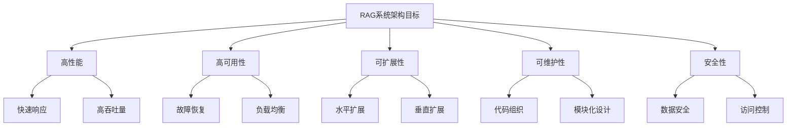
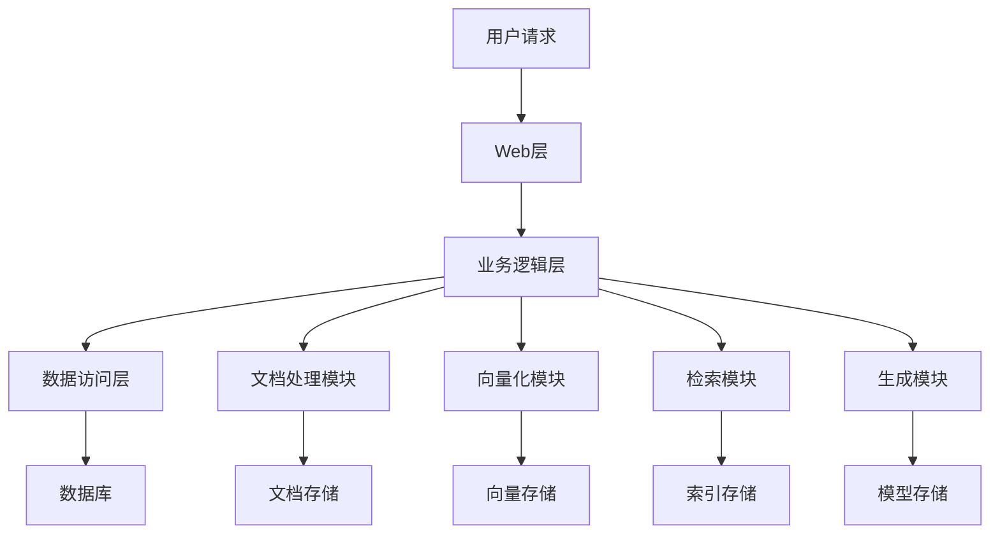
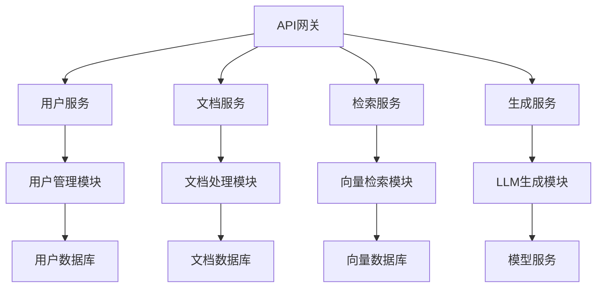
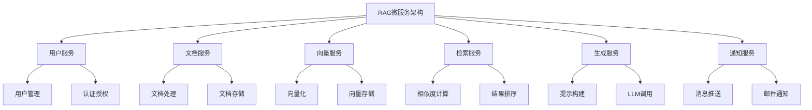
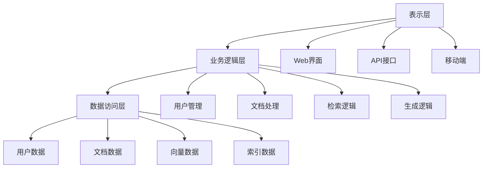
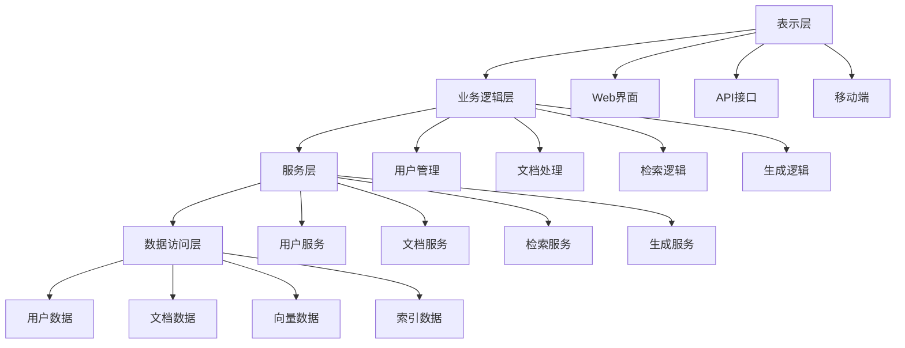
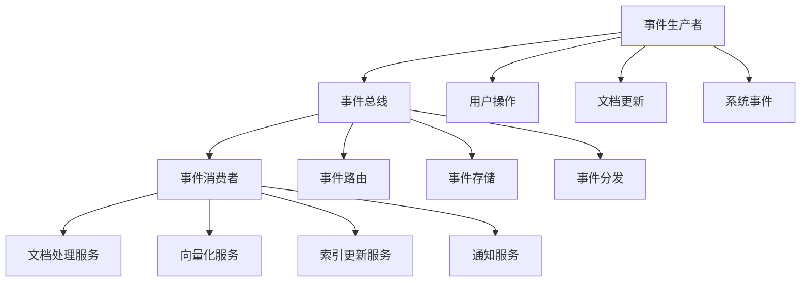

# RAG系统架构模式

## 引言

RAG系统的架构设计是确保系统高效、可扩展和可维护的关键。不同的架构模式适用于不同的应用场景和需求。本文将深入探讨RAG系统的各种架构模式，包括单体架构、微服务架构、分层架构和事件驱动架构等，帮助开发者选择最适合的架构模式。

## RAG系统架构概述

### 什么是RAG系统架构

RAG系统架构是指RAG系统各个组件之间的组织方式、交互模式和部署结构。它决定了系统的性能、可扩展性、可维护性和可靠性。

### 架构设计的目标



### 架构设计的原则

1. **单一职责原则**：每个组件只负责一个功能
2. **开闭原则**：对扩展开放，对修改关闭
3. **依赖倒置原则**：依赖抽象而不是具体实现
4. **接口隔离原则**：使用多个专门的接口
5. **最小知识原则**：组件之间只了解必要的信息

## 单体架构模式

### 1. 传统单体架构

#### 架构特点



#### 实现示例

```python
# 单体RAG系统架构
class MonolithicRAGSystem:
    def __init__(self):
        # 初始化所有模块
        self.document_processor = DocumentProcessor()
        self.vectorizer = Vectorizer()
        self.retriever = Retriever()
        self.generator = Generator()
        self.database = Database()
        
    def process_query(self, query: str) -> str:
        """处理查询"""
        # 1. 文档处理
        processed_docs = self.document_processor.process_documents()
        
        # 2. 向量化
        vectors = self.vectorizer.vectorize(processed_docs)
        
        # 3. 检索
        relevant_docs = self.retriever.retrieve(query, vectors)
        
        # 4. 生成
        response = self.generator.generate(query, relevant_docs)
        
        return response
    
    def add_document(self, document: str) -> bool:
        """添加文档"""
        try:
            # 处理文档
            processed_doc = self.document_processor.process_document(document)
            
            # 向量化
            vector = self.vectorizer.vectorize_document(processed_doc)
            
            # 存储
            self.database.store_document(processed_doc, vector)
            
            return True
        except Exception as e:
            print(f"添加文档失败: {e}")
            return False
    
    def update_document(self, doc_id: str, document: str) -> bool:
        """更新文档"""
        try:
            # 删除旧文档
            self.database.delete_document(doc_id)
            
            # 添加新文档
            return self.add_document(document)
        except Exception as e:
            print(f"更新文档失败: {e}")
            return False
    
    def delete_document(self, doc_id: str) -> bool:
        """删除文档"""
        try:
            self.database.delete_document(doc_id)
            return True
        except Exception as e:
            print(f"删除文档失败: {e}")
            return False


class DocumentProcessor:
    def __init__(self):
        self.parsers = {
            'pdf': PDFParser(),
            'docx': DocxParser(),
            'txt': TextParser(),
            'html': HTMLParser()
        }
    
    def process_document(self, document: str, doc_type: str = 'txt') -> Dict[str, any]:
        """处理文档"""
        parser = self.parsers.get(doc_type, self.parsers['txt'])
        return parser.parse(document)
    
    def process_documents(self) -> List[Dict[str, any]]:
        """批量处理文档"""
        documents = []
        # 从数据库获取所有文档
        raw_docs = self.database.get_all_documents()
        
        for doc in raw_docs:
            processed_doc = self.process_document(doc['content'], doc['type'])
            documents.append(processed_doc)
        
        return documents


class Vectorizer:
    def __init__(self):
        self.embedding_model = EmbeddingModel()
    
    def vectorize_document(self, document: Dict[str, any]) -> List[float]:
        """向量化文档"""
        text = document['content']
        return self.embedding_model.encode(text)
    
    def vectorize(self, documents: List[Dict[str, any]]) -> List[List[float]]:
        """批量向量化"""
        vectors = []
        for doc in documents:
            vector = self.vectorize_document(doc)
            vectors.append(vector)
        return vectors


class Retriever:
    def __init__(self):
        self.similarity_calculator = SimilarityCalculator()
    
    def retrieve(self, query: str, vectors: List[List[float]], 
                top_k: int = 5) -> List[Dict[str, any]]:
        """检索相关文档"""
        # 向量化查询
        query_vector = self.vectorizer.vectorize_document({'content': query})
        
        # 计算相似度
        similarities = []
        for i, vector in enumerate(vectors):
            similarity = self.similarity_calculator.calculate(query_vector, vector)
            similarities.append((i, similarity))
        
        # 排序并返回top_k
        similarities.sort(key=lambda x: x[1], reverse=True)
        top_indices = [idx for idx, _ in similarities[:top_k]]
        
        return [self.database.get_document(idx) for idx in top_indices]


class Generator:
    def __init__(self):
        self.llm = LargeLanguageModel()
    
    def generate(self, query: str, relevant_docs: List[Dict[str, any]]) -> str:
        """生成回答"""
        # 构建上下文
        context = self._build_context(relevant_docs)
        
        # 构建提示
        prompt = self._build_prompt(query, context)
        
        # 生成回答
        response = self.llm.generate(prompt)
        
        return response
    
    def _build_context(self, docs: List[Dict[str, any]]) -> str:
        """构建上下文"""
        context_parts = []
        for doc in docs:
            context_parts.append(doc['content'])
        return '\n\n'.join(context_parts)
    
    def _build_prompt(self, query: str, context: str) -> str:
        """构建提示"""
        return f"""
        基于以下上下文回答问题：
        
        上下文：
        {context}
        
        问题：
        {query}
        
        回答：
        """


class Database:
    def __init__(self):
        self.connection = self._create_connection()
    
    def _create_connection(self):
        """创建数据库连接"""
        # 实际应用中连接到真实数据库
        return None
    
    def store_document(self, document: Dict[str, any], vector: List[float]) -> str:
        """存储文档"""
        doc_id = self._generate_id()
        # 存储文档和向量
        return doc_id
    
    def get_document(self, doc_id: str) -> Dict[str, any]:
        """获取文档"""
        # 从数据库获取文档
        return {'id': doc_id, 'content': '示例文档内容'}
    
    def get_all_documents(self) -> List[Dict[str, any]]:
        """获取所有文档"""
        # 从数据库获取所有文档
        return []
    
    def delete_document(self, doc_id: str) -> bool:
        """删除文档"""
        # 从数据库删除文档
        return True
    
    def _generate_id(self) -> str:
        """生成ID"""
        import uuid
        return str(uuid.uuid4())
```

### 2. 模块化单体架构

#### 架构特点



#### 实现示例

```python
# 模块化单体RAG系统
class ModularRAGSystem:
    def __init__(self):
        # 初始化各个服务模块
        self.user_service = UserService()
        self.document_service = DocumentService()
        self.retrieval_service = RetrievalService()
        self.generation_service = GenerationService()
        self.api_gateway = APIGateway()
        
        # 注册服务
        self._register_services()
    
    def _register_services(self):
        """注册服务"""
        self.api_gateway.register_service('user', self.user_service)
        self.api_gateway.register_service('document', self.document_service)
        self.api_gateway.register_service('retrieval', self.retrieval_service)
        self.api_gateway.register_service('generation', self.generation_service)
    
    def process_query(self, query: str, user_id: str) -> Dict[str, any]:
        """处理查询"""
        # 1. 用户认证
        if not self.user_service.authenticate(user_id):
            return {'error': '用户认证失败'}
        
        # 2. 检索相关文档
        relevant_docs = self.retrieval_service.retrieve(query)
        
        # 3. 生成回答
        response = self.generation_service.generate(query, relevant_docs)
        
        # 4. 记录查询历史
        self.user_service.record_query_history(user_id, query, response)
        
        return {
            'response': response,
            'relevant_docs': relevant_docs,
            'timestamp': time.time()
        }


class APIGateway:
    def __init__(self):
        self.services = {}
        self.middleware = []
    
    def register_service(self, name: str, service):
        """注册服务"""
        self.services[name] = service
    
    def add_middleware(self, middleware):
        """添加中间件"""
        self.middleware.append(middleware)
    
    def handle_request(self, request: Dict[str, any]) -> Dict[str, any]:
        """处理请求"""
        # 应用中间件
        for middleware in self.middleware:
            request = middleware.process_request(request)
        
        # 路由到相应服务
        service_name = request.get('service')
        if service_name in self.services:
            service = self.services[service_name]
            response = service.handle_request(request)
        else:
            response = {'error': f'服务 {service_name} 不存在'}
        
        # 应用响应中间件
        for middleware in reversed(self.middleware):
            response = middleware.process_response(response)
        
        return response


class UserService:
    def __init__(self):
        self.user_db = UserDatabase()
        self.auth_manager = AuthManager()
    
    def authenticate(self, user_id: str) -> bool:
        """用户认证"""
        return self.auth_manager.authenticate(user_id)
    
    def record_query_history(self, user_id: str, query: str, response: str):
        """记录查询历史"""
        self.user_db.add_query_history(user_id, query, response)
    
    def handle_request(self, request: Dict[str, any]) -> Dict[str, any]:
        """处理请求"""
        action = request.get('action')
        
        if action == 'authenticate':
            user_id = request.get('user_id')
            return {'authenticated': self.authenticate(user_id)}
        elif action == 'get_history':
            user_id = request.get('user_id')
            history = self.user_db.get_query_history(user_id)
            return {'history': history}
        else:
            return {'error': '未知操作'}


class DocumentService:
    def __init__(self):
        self.document_db = DocumentDatabase()
        self.processor = DocumentProcessor()
    
    def add_document(self, document: Dict[str, any]) -> str:
        """添加文档"""
        # 处理文档
        processed_doc = self.processor.process_document(document)
        
        # 存储文档
        doc_id = self.document_db.store_document(processed_doc)
        
        return doc_id
    
    def handle_request(self, request: Dict[str, any]) -> Dict[str, any]:
        """处理请求"""
        action = request.get('action')
        
        if action == 'add_document':
            document = request.get('document')
            doc_id = self.add_document(document)
            return {'doc_id': doc_id}
        elif action == 'get_document':
            doc_id = request.get('doc_id')
            document = self.document_db.get_document(doc_id)
            return {'document': document}
        else:
            return {'error': '未知操作'}


class RetrievalService:
    def __init__(self):
        self.vector_db = VectorDatabase()
        self.retriever = Retriever()
    
    def retrieve(self, query: str, top_k: int = 5) -> List[Dict[str, any]]:
        """检索相关文档"""
        # 向量化查询
        query_vector = self.retriever.vectorize_query(query)
        
        # 检索相似文档
        similar_docs = self.vector_db.search(query_vector, top_k)
        
        return similar_docs
    
    def handle_request(self, request: Dict[str, any]) -> Dict[str, any]:
        """处理请求"""
        action = request.get('action')
        
        if action == 'retrieve':
            query = request.get('query')
            top_k = request.get('top_k', 5)
            docs = self.retrieve(query, top_k)
            return {'documents': docs}
        else:
            return {'error': '未知操作'}


class GenerationService:
    def __init__(self):
        self.llm = LargeLanguageModel()
        self.prompt_builder = PromptBuilder()
    
    def generate(self, query: str, relevant_docs: List[Dict[str, any]]) -> str:
        """生成回答"""
        # 构建提示
        prompt = self.prompt_builder.build_prompt(query, relevant_docs)
        
        # 生成回答
        response = self.llm.generate(prompt)
        
        return response
    
    def handle_request(self, request: Dict[str, any]) -> Dict[str, any]:
        """处理请求"""
        action = request.get('action')
        
        if action == 'generate':
            query = request.get('query')
            relevant_docs = request.get('relevant_docs', [])
            response = self.generate(query, relevant_docs)
            return {'response': response}
        else:
            return {'error': '未知操作'}
```

## 微服务架构模式

### 1. 服务拆分策略

#### 服务划分原则



#### 实现示例

```python
# 微服务RAG系统架构
class MicroserviceRAGSystem:
    def __init__(self):
        # 服务发现
        self.service_registry = ServiceRegistry()
        
        # 初始化服务客户端
        self.user_client = UserServiceClient()
        self.document_client = DocumentServiceClient()
        self.vector_client = VectorServiceClient()
        self.retrieval_client = RetrievalServiceClient()
        self.generation_client = GenerationServiceClient()
        self.notification_client = NotificationServiceClient()
        
        # 注册服务
        self._register_services()
    
    def _register_services(self):
        """注册服务"""
        services = [
            ('user-service', self.user_client),
            ('document-service', self.document_client),
            ('vector-service', self.vector_client),
            ('retrieval-service', self.retrieval_client),
            ('generation-service', self.generation_client),
            ('notification-service', self.notification_client)
        ]
        
        for service_name, service_client in services:
            self.service_registry.register(service_name, service_client)
    
    def process_query(self, query: str, user_id: str) -> Dict[str, any]:
        """处理查询"""
        try:
            # 1. 用户认证
            auth_result = self.user_client.authenticate(user_id)
            if not auth_result['authenticated']:
                return {'error': '用户认证失败'}
            
            # 2. 检索相关文档
            retrieval_result = self.retrieval_client.retrieve(query)
            relevant_docs = retrieval_result['documents']
            
            # 3. 生成回答
            generation_result = self.generation_client.generate(query, relevant_docs)
            response = generation_result['response']
            
            # 4. 记录查询历史
            self.user_client.record_query_history(user_id, query, response)
            
            # 5. 发送通知（如果需要）
            if self._should_send_notification(user_id):
                self.notification_client.send_notification(user_id, response)
            
            return {
                'response': response,
                'relevant_docs': relevant_docs,
                'timestamp': time.time()
            }
            
        except Exception as e:
            # 错误处理
            return {'error': f'处理查询失败: {str(e)}'}
    
    def _should_send_notification(self, user_id: str) -> bool:
        """判断是否需要发送通知"""
        # 根据用户偏好和查询类型判断
        return False


class ServiceRegistry:
    def __init__(self):
        self.services = {}
        self.health_checker = HealthChecker()
    
    def register(self, service_name: str, service_client):
        """注册服务"""
        self.services[service_name] = {
            'client': service_client,
            'status': 'healthy',
            'last_check': time.time()
        }
    
    def get_service(self, service_name: str):
        """获取服务"""
        if service_name in self.services:
            service_info = self.services[service_name]
            if self.health_checker.is_healthy(service_info['client']):
                return service_info['client']
            else:
                # 服务不健康，尝试故障转移
                return self._failover_service(service_name)
        else:
            raise Exception(f'服务 {service_name} 不存在')
    
    def _failover_service(self, service_name: str):
        """故障转移"""
        # 实现故障转移逻辑
        pass


class UserServiceClient:
    def __init__(self):
        self.service_url = "http://user-service:8001"
        self.http_client = HttpClient()
    
    def authenticate(self, user_id: str) -> Dict[str, any]:
        """用户认证"""
        response = self.http_client.post(f"{self.service_url}/authenticate", {
            'user_id': user_id
        })
        return response.json()
    
    def record_query_history(self, user_id: str, query: str, response: str):
        """记录查询历史"""
        self.http_client.post(f"{self.service_url}/history", {
            'user_id': user_id,
            'query': query,
            'response': response
        })
    
    def get_user_preferences(self, user_id: str) -> Dict[str, any]:
        """获取用户偏好"""
        response = self.http_client.get(f"{self.service_url}/preferences/{user_id}")
        return response.json()


class DocumentServiceClient:
    def __init__(self):
        self.service_url = "http://document-service:8002"
        self.http_client = HttpClient()
    
    def add_document(self, document: Dict[str, any]) -> str:
        """添加文档"""
        response = self.http_client.post(f"{self.service_url}/documents", document)
        return response.json()['doc_id']
    
    def get_document(self, doc_id: str) -> Dict[str, any]:
        """获取文档"""
        response = self.http_client.get(f"{self.service_url}/documents/{doc_id}")
        return response.json()
    
    def update_document(self, doc_id: str, document: Dict[str, any]) -> bool:
        """更新文档"""
        response = self.http_client.put(f"{self.service_url}/documents/{doc_id}", document)
        return response.status_code == 200
    
    def delete_document(self, doc_id: str) -> bool:
        """删除文档"""
        response = self.http_client.delete(f"{self.service_url}/documents/{doc_id}")
        return response.status_code == 200


class VectorServiceClient:
    def __init__(self):
        self.service_url = "http://vector-service:8003"
        self.http_client = HttpClient()
    
    def vectorize_document(self, document: Dict[str, any]) -> List[float]:
        """向量化文档"""
        response = self.http_client.post(f"{self.service_url}/vectorize", document)
        return response.json()['vector']
    
    def vectorize_query(self, query: str) -> List[float]:
        """向量化查询"""
        response = self.http_client.post(f"{self.service_url}/vectorize-query", {
            'query': query
        })
        return response.json()['vector']


class RetrievalServiceClient:
    def __init__(self):
        self.service_url = "http://retrieval-service:8004"
        self.http_client = HttpClient()
    
    def retrieve(self, query: str, top_k: int = 5) -> Dict[str, any]:
        """检索相关文档"""
        response = self.http_client.post(f"{self.service_url}/retrieve", {
            'query': query,
            'top_k': top_k
        })
        return response.json()


class GenerationServiceClient:
    def __init__(self):
        self.service_url = "http://generation-service:8005"
        self.http_client = HttpClient()
    
    def generate(self, query: str, relevant_docs: List[Dict[str, any]]) -> Dict[str, any]:
        """生成回答"""
        response = self.http_client.post(f"{self.service_url}/generate", {
            'query': query,
            'relevant_docs': relevant_docs
        })
        return response.json()


class NotificationServiceClient:
    def __init__(self):
        self.service_url = "http://notification-service:8006"
        self.http_client = HttpClient()
    
    def send_notification(self, user_id: str, message: str):
        """发送通知"""
        self.http_client.post(f"{self.service_url}/notify", {
            'user_id': user_id,
            'message': message
        })


class HttpClient:
    def __init__(self):
        self.session = requests.Session()
        self.timeout = 30
    
    def get(self, url: str, params: Dict = None) -> requests.Response:
        """GET请求"""
        return self.session.get(url, params=params, timeout=self.timeout)
    
    def post(self, url: str, data: Dict = None) -> requests.Response:
        """POST请求"""
        return self.session.post(url, json=data, timeout=self.timeout)
    
    def put(self, url: str, data: Dict = None) -> requests.Response:
        """PUT请求"""
        return self.session.put(url, json=data, timeout=self.timeout)
    
    def delete(self, url: str) -> requests.Response:
        """DELETE请求"""
        return self.session.delete(url, timeout=self.timeout)
```

### 2. 服务间通信

#### 同步通信

```python
class SynchronousCommunication:
    def __init__(self):
        self.http_client = HttpClient()
        self.circuit_breaker = CircuitBreaker()
    
    def call_service(self, service_name: str, endpoint: str, 
                    data: Dict[str, any]) -> Dict[str, any]:
        """调用服务"""
        try:
            # 检查熔断器状态
            if not self.circuit_breaker.can_execute(service_name):
                return {'error': '服务熔断'}
            
            # 调用服务
            response = self.http_client.post(f"{service_name}{endpoint}", data)
            
            # 记录成功
            self.circuit_breaker.record_success(service_name)
            
            return response.json()
            
        except Exception as e:
            # 记录失败
            self.circuit_breaker.record_failure(service_name)
            
            return {'error': f'调用服务失败: {str(e)}'}
    
    def call_service_with_retry(self, service_name: str, endpoint: str, 
                               data: Dict[str, any], max_retries: int = 3) -> Dict[str, any]:
        """带重试的服务调用"""
        for attempt in range(max_retries):
            result = self.call_service(service_name, endpoint, data)
            
            if 'error' not in result:
                return result
            
            if attempt < max_retries - 1:
                time.sleep(2 ** attempt)  # 指数退避
        
        return result


class CircuitBreaker:
    def __init__(self):
        self.service_states = {}
        self.failure_threshold = 5
        self.timeout = 60
    
    def can_execute(self, service_name: str) -> bool:
        """检查是否可以执行"""
        if service_name not in self.service_states:
            self.service_states[service_name] = {
                'state': 'closed',
                'failure_count': 0,
                'last_failure_time': 0
            }
        
        state = self.service_states[service_name]
        
        if state['state'] == 'open':
            # 检查是否应该尝试恢复
            if time.time() - state['last_failure_time'] > self.timeout:
                state['state'] = 'half-open'
                return True
            return False
        
        return True
    
    def record_success(self, service_name: str):
        """记录成功"""
        if service_name in self.service_states:
            state = self.service_states[service_name]
            state['state'] = 'closed'
            state['failure_count'] = 0
    
    def record_failure(self, service_name: str):
        """记录失败"""
        if service_name not in self.service_states:
            self.service_states[service_name] = {
                'state': 'closed',
                'failure_count': 0,
                'last_failure_time': 0
            }
        
        state = self.service_states[service_name]
        state['failure_count'] += 1
        state['last_failure_time'] = time.time()
        
        if state['failure_count'] >= self.failure_threshold:
            state['state'] = 'open'
```

#### 异步通信

```python
import asyncio
import aiohttp
from typing import Dict, Any, Callable

class AsynchronousCommunication:
    def __init__(self):
        self.session = None
        self.message_queue = asyncio.Queue()
        self.event_handlers = {}
    
    async def initialize(self):
        """初始化异步通信"""
        self.session = aiohttp.ClientSession()
        # 启动消息处理循环
        asyncio.create_task(self._message_loop())
    
    async def call_service_async(self, service_name: str, endpoint: str, 
                                data: Dict[str, any]) -> Dict[str, any]:
        """异步调用服务"""
        try:
            url = f"{service_name}{endpoint}"
            async with self.session.post(url, json=data) as response:
                result = await response.json()
                return result
        except Exception as e:
            return {'error': f'异步调用服务失败: {str(e)}'}
    
    async def publish_event(self, event_type: str, data: Dict[str, any]):
        """发布事件"""
        event = {
            'type': event_type,
            'data': data,
            'timestamp': time.time()
        }
        await self.message_queue.put(event)
    
    async def subscribe_event(self, event_type: str, handler: Callable):
        """订阅事件"""
        if event_type not in self.event_handlers:
            self.event_handlers[event_type] = []
        self.event_handlers[event_type].append(handler)
    
    async def _message_loop(self):
        """消息处理循环"""
        while True:
            try:
                event = await self.message_queue.get()
                await self._handle_event(event)
            except Exception as e:
                print(f"处理事件失败: {e}")
    
    async def _handle_event(self, event: Dict[str, any]):
        """处理事件"""
        event_type = event['type']
        if event_type in self.event_handlers:
            for handler in self.event_handlers[event_type]:
                try:
                    await handler(event['data'])
                except Exception as e:
                    print(f"事件处理器执行失败: {e}")
    
    async def close(self):
        """关闭异步通信"""
        if self.session:
            await self.session.close()
```

## 分层架构模式

### 1. 三层架构

#### 架构特点



#### 实现示例

```python
# 三层架构RAG系统
class ThreeTierRAGSystem:
    def __init__(self):
        # 表示层
        self.presentation_layer = PresentationLayer()
        
        # 业务逻辑层
        self.business_logic_layer = BusinessLogicLayer()
        
        # 数据访问层
        self.data_access_layer = DataAccessLayer()
        
        # 连接各层
        self._connect_layers()
    
    def _connect_layers(self):
        """连接各层"""
        self.presentation_layer.set_business_logic(self.business_logic_layer)
        self.business_logic_layer.set_data_access(self.data_access_layer)
    
    def start(self):
        """启动系统"""
        self.presentation_layer.start()


class PresentationLayer:
    def __init__(self):
        self.business_logic = None
        self.web_server = None
    
    def set_business_logic(self, business_logic):
        """设置业务逻辑层"""
        self.business_logic = business_logic
    
    def start(self):
        """启动表示层"""
        # 启动Web服务器
        self.web_server = WebServer()
        self.web_server.set_presentation_layer(self)
        self.web_server.start()
    
    def handle_request(self, request: Dict[str, any]) -> Dict[str, any]:
        """处理请求"""
        # 验证请求
        if not self._validate_request(request):
            return {'error': '请求验证失败'}
        
        # 调用业务逻辑层
        result = self.business_logic.process_request(request)
        
        # 格式化响应
        return self._format_response(result)
    
    def _validate_request(self, request: Dict[str, any]) -> bool:
        """验证请求"""
        required_fields = ['action', 'data']
        return all(field in request for field in required_fields)
    
    def _format_response(self, result: Dict[str, any]) -> Dict[str, any]:
        """格式化响应"""
        return {
            'status': 'success' if 'error' not in result else 'error',
            'data': result,
            'timestamp': time.time()
        }


class BusinessLogicLayer:
    def __init__(self):
        self.data_access = None
        self.user_manager = UserManager()
        self.document_manager = DocumentManager()
        self.retrieval_manager = RetrievalManager()
        self.generation_manager = GenerationManager()
    
    def set_data_access(self, data_access):
        """设置数据访问层"""
        self.data_access = data_access
    
    def process_request(self, request: Dict[str, any]) -> Dict[str, any]:
        """处理请求"""
        action = request['action']
        data = request['data']
        
        if action == 'query':
            return self._process_query(data)
        elif action == 'add_document':
            return self._process_add_document(data)
        elif action == 'update_document':
            return self._process_update_document(data)
        elif action == 'delete_document':
            return self._process_delete_document(data)
        else:
            return {'error': '未知操作'}
    
    def _process_query(self, data: Dict[str, any]) -> Dict[str, any]:
        """处理查询"""
        query = data['query']
        user_id = data['user_id']
        
        # 1. 用户认证
        if not self.user_manager.authenticate(user_id):
            return {'error': '用户认证失败'}
        
        # 2. 检索相关文档
        relevant_docs = self.retrieval_manager.retrieve(query)
        
        # 3. 生成回答
        response = self.generation_manager.generate(query, relevant_docs)
        
        # 4. 记录查询历史
        self.user_manager.record_query_history(user_id, query, response)
        
        return {
            'response': response,
            'relevant_docs': relevant_docs
        }
    
    def _process_add_document(self, data: Dict[str, any]) -> Dict[str, any]:
        """处理添加文档"""
        document = data['document']
        
        # 处理文档
        processed_doc = self.document_manager.process_document(document)
        
        # 存储文档
        doc_id = self.data_access.store_document(processed_doc)
        
        return {'doc_id': doc_id}
    
    def _process_update_document(self, data: Dict[str, any]) -> Dict[str, any]:
        """处理更新文档"""
        doc_id = data['doc_id']
        document = data['document']
        
        # 更新文档
        success = self.data_access.update_document(doc_id, document)
        
        return {'success': success}
    
    def _process_delete_document(self, data: Dict[str, any]) -> Dict[str, any]:
        """处理删除文档"""
        doc_id = data['doc_id']
        
        # 删除文档
        success = self.data_access.delete_document(doc_id)
        
        return {'success': success}


class DataAccessLayer:
    def __init__(self):
        self.user_db = UserDatabase()
        self.document_db = DocumentDatabase()
        self.vector_db = VectorDatabase()
        self.index_db = IndexDatabase()
    
    def store_document(self, document: Dict[str, any]) -> str:
        """存储文档"""
        # 存储到文档数据库
        doc_id = self.document_db.store(document)
        
        # 存储到向量数据库
        vector = document['vector']
        self.vector_db.store(doc_id, vector)
        
        # 更新索引
        self.index_db.update_index(doc_id, document)
        
        return doc_id
    
    def get_document(self, doc_id: str) -> Dict[str, any]:
        """获取文档"""
        return self.document_db.get(doc_id)
    
    def update_document(self, doc_id: str, document: Dict[str, any]) -> bool:
        """更新文档"""
        # 更新文档数据库
        success = self.document_db.update(doc_id, document)
        
        if success:
            # 更新向量数据库
            vector = document['vector']
            self.vector_db.update(doc_id, vector)
            
            # 更新索引
            self.index_db.update_index(doc_id, document)
        
        return success
    
    def delete_document(self, doc_id: str) -> bool:
        """删除文档"""
        # 从文档数据库删除
        success = self.document_db.delete(doc_id)
        
        if success:
            # 从向量数据库删除
            self.vector_db.delete(doc_id)
            
            # 从索引删除
            self.index_db.delete_index(doc_id)
        
        return success
    
    def search_documents(self, query_vector: List[float], top_k: int = 5) -> List[Dict[str, any]]:
        """搜索文档"""
        # 从向量数据库搜索
        similar_vectors = self.vector_db.search(query_vector, top_k)
        
        # 获取文档详情
        documents = []
        for vector_info in similar_vectors:
            doc_id = vector_info['doc_id']
            document = self.document_db.get(doc_id)
            if document:
                documents.append(document)
        
        return documents
```

### 2. 四层架构

#### 架构特点



#### 实现示例

```python
# 四层架构RAG系统
class FourTierRAGSystem:
    def __init__(self):
        # 表示层
        self.presentation_layer = PresentationLayer()
        
        # 业务逻辑层
        self.business_logic_layer = BusinessLogicLayer()
        
        # 服务层
        self.service_layer = ServiceLayer()
        
        # 数据访问层
        self.data_access_layer = DataAccessLayer()
        
        # 连接各层
        self._connect_layers()
    
    def _connect_layers(self):
        """连接各层"""
        self.presentation_layer.set_business_logic(self.business_logic_layer)
        self.business_logic_layer.set_service_layer(self.service_layer)
        self.service_layer.set_data_access(self.data_access_layer)
    
    def start(self):
        """启动系统"""
        self.presentation_layer.start()


class ServiceLayer:
    def __init__(self):
        self.data_access = None
        self.user_service = UserService()
        self.document_service = DocumentService()
        self.retrieval_service = RetrievalService()
        self.generation_service = GenerationService()
    
    def set_data_access(self, data_access):
        """设置数据访问层"""
        self.data_access = data_access
    
    def process_request(self, request: Dict[str, any]) -> Dict[str, any]:
        """处理请求"""
        service_type = request['service_type']
        action = request['action']
        data = request['data']
        
        if service_type == 'user':
            return self.user_service.process_action(action, data)
        elif service_type == 'document':
            return self.document_service.process_action(action, data)
        elif service_type == 'retrieval':
            return self.retrieval_service.process_action(action, data)
        elif service_type == 'generation':
            return self.generation_service.process_action(action, data)
        else:
            return {'error': '未知服务类型'}
    
    def get_service(self, service_type: str):
        """获取服务"""
        services = {
            'user': self.user_service,
            'document': self.document_service,
            'retrieval': self.retrieval_service,
            'generation': self.generation_service
        }
        return services.get(service_type)


class UserService:
    def __init__(self):
        self.data_access = None
    
    def set_data_access(self, data_access):
        """设置数据访问层"""
        self.data_access = data_access
    
    def process_action(self, action: str, data: Dict[str, any]) -> Dict[str, any]:
        """处理动作"""
        if action == 'authenticate':
            return self.authenticate(data['user_id'])
        elif action == 'get_profile':
            return self.get_profile(data['user_id'])
        elif action == 'update_profile':
            return self.update_profile(data['user_id'], data['profile'])
        elif action == 'get_history':
            return self.get_query_history(data['user_id'])
        else:
            return {'error': '未知动作'}
    
    def authenticate(self, user_id: str) -> Dict[str, any]:
        """用户认证"""
        user = self.data_access.get_user(user_id)
        if user:
            return {'authenticated': True, 'user': user}
        else:
            return {'authenticated': False}
    
    def get_profile(self, user_id: str) -> Dict[str, any]:
        """获取用户档案"""
        profile = self.data_access.get_user_profile(user_id)
        return {'profile': profile}
    
    def update_profile(self, user_id: str, profile: Dict[str, any]) -> Dict[str, any]:
        """更新用户档案"""
        success = self.data_access.update_user_profile(user_id, profile)
        return {'success': success}
    
    def get_query_history(self, user_id: str) -> Dict[str, any]:
        """获取查询历史"""
        history = self.data_access.get_user_query_history(user_id)
        return {'history': history}


class DocumentService:
    def __init__(self):
        self.data_access = None
        self.processor = DocumentProcessor()
    
    def set_data_access(self, data_access):
        """设置数据访问层"""
        self.data_access = data_access
    
    def process_action(self, action: str, data: Dict[str, any]) -> Dict[str, any]:
        """处理动作"""
        if action == 'add_document':
            return self.add_document(data['document'])
        elif action == 'get_document':
            return self.get_document(data['doc_id'])
        elif action == 'update_document':
            return self.update_document(data['doc_id'], data['document'])
        elif action == 'delete_document':
            return self.delete_document(data['doc_id'])
        elif action == 'search_documents':
            return self.search_documents(data['query'])
        else:
            return {'error': '未知动作'}
    
    def add_document(self, document: Dict[str, any]) -> Dict[str, any]:
        """添加文档"""
        # 处理文档
        processed_doc = self.processor.process_document(document)
        
        # 存储文档
        doc_id = self.data_access.store_document(processed_doc)
        
        return {'doc_id': doc_id}
    
    def get_document(self, doc_id: str) -> Dict[str, any]:
        """获取文档"""
        document = self.data_access.get_document(doc_id)
        return {'document': document}
    
    def update_document(self, doc_id: str, document: Dict[str, any]) -> Dict[str, any]:
        """更新文档"""
        # 处理文档
        processed_doc = self.processor.process_document(document)
        
        # 更新文档
        success = self.data_access.update_document(doc_id, processed_doc)
        
        return {'success': success}
    
    def delete_document(self, doc_id: str) -> Dict[str, any]:
        """删除文档"""
        success = self.data_access.delete_document(doc_id)
        return {'success': success}
    
    def search_documents(self, query: str) -> Dict[str, any]:
        """搜索文档"""
        documents = self.data_access.search_documents(query)
        return {'documents': documents}


class RetrievalService:
    def __init__(self):
        self.data_access = None
        self.vectorizer = Vectorizer()
        self.similarity_calculator = SimilarityCalculator()
    
    def set_data_access(self, data_access):
        """设置数据访问层"""
        self.data_access = data_access
    
    def process_action(self, action: str, data: Dict[str, any]) -> Dict[str, any]:
        """处理动作"""
        if action == 'retrieve':
            return self.retrieve(data['query'], data.get('top_k', 5))
        elif action == 'vectorize_query':
            return self.vectorize_query(data['query'])
        elif action == 'calculate_similarity':
            return self.calculate_similarity(data['vector1'], data['vector2'])
        else:
            return {'error': '未知动作'}
    
    def retrieve(self, query: str, top_k: int = 5) -> Dict[str, any]:
        """检索相关文档"""
        # 向量化查询
        query_vector = self.vectorizer.vectorize_query(query)
        
        # 搜索相似文档
        similar_docs = self.data_access.search_documents(query_vector, top_k)
        
        return {'documents': similar_docs}
    
    def vectorize_query(self, query: str) -> Dict[str, any]:
        """向量化查询"""
        vector = self.vectorizer.vectorize_query(query)
        return {'vector': vector}
    
    def calculate_similarity(self, vector1: List[float], vector2: List[float]) -> Dict[str, any]:
        """计算相似度"""
        similarity = self.similarity_calculator.calculate(vector1, vector2)
        return {'similarity': similarity}


class GenerationService:
    def __init__(self):
        self.data_access = None
        self.llm = LargeLanguageModel()
        self.prompt_builder = PromptBuilder()
    
    def set_data_access(self, data_access):
        """设置数据访问层"""
        self.data_access = data_access
    
    def process_action(self, action: str, data: Dict[str, any]) -> Dict[str, any]:
        """处理动作"""
        if action == 'generate':
            return self.generate(data['query'], data['relevant_docs'])
        elif action == 'build_prompt':
            return self.build_prompt(data['query'], data['context'])
        else:
            return {'error': '未知动作'}
    
    def generate(self, query: str, relevant_docs: List[Dict[str, any]]) -> Dict[str, any]:
        """生成回答"""
        # 构建提示
        prompt = self.prompt_builder.build_prompt(query, relevant_docs)
        
        # 生成回答
        response = self.llm.generate(prompt)
        
        return {'response': response}
    
    def build_prompt(self, query: str, context: str) -> Dict[str, any]:
        """构建提示"""
        prompt = self.prompt_builder.build_prompt(query, context)
        return {'prompt': prompt}
```

## 事件驱动架构模式

### 1. 事件驱动架构

#### 架构特点



#### 实现示例

```python
# 事件驱动RAG系统架构
class EventDrivenRAGSystem:
    def __init__(self):
        # 事件总线
        self.event_bus = EventBus()
        
        # 事件生产者
        self.event_producers = {
            'user': UserEventProducer(),
            'document': DocumentEventProducer(),
            'system': SystemEventProducer()
        }
        
        # 事件消费者
        self.event_consumers = {
            'document_processing': DocumentProcessingConsumer(),
            'vectorization': VectorizationConsumer(),
            'indexing': IndexingConsumer(),
            'notification': NotificationConsumer()
        }
        
        # 注册事件
        self._register_events()
    
    def _register_events(self):
        """注册事件"""
        # 注册事件生产者
        for producer_name, producer in self.event_producers.items():
            producer.set_event_bus(self.event_bus)
        
        # 注册事件消费者
        for consumer_name, consumer in self.event_consumers.items():
            consumer.set_event_bus(self.event_bus)
            self.event_bus.subscribe(consumer_name, consumer)
    
    def start(self):
        """启动系统"""
        # 启动事件总线
        self.event_bus.start()
        
        # 启动事件消费者
        for consumer in self.event_consumers.values():
            consumer.start()
    
    def process_query(self, query: str, user_id: str) -> Dict[str, any]:
        """处理查询"""
        # 发布查询事件
        query_event = {
            'type': 'query',
            'data': {
                'query': query,
                'user_id': user_id,
                'timestamp': time.time()
            }
        }
        
        self.event_bus.publish('query', query_event)
        
        # 等待处理结果
        result = self._wait_for_result(query_event['data']['timestamp'])
        
        return result
    
    def _wait_for_result(self, timestamp: float) -> Dict[str, any]:
        """等待处理结果"""
        # 实际应用中实现结果等待逻辑
        return {'response': '示例回答'}


class EventBus:
    def __init__(self):
        self.subscribers = {}
        self.event_queue = asyncio.Queue()
        self.event_store = EventStore()
        self.running = False
    
    def subscribe(self, event_type: str, consumer):
        """订阅事件"""
        if event_type not in self.subscribers:
            self.subscribers[event_type] = []
        self.subscribers[event_type].append(consumer)
    
    def publish(self, event_type: str, event: Dict[str, any]):
        """发布事件"""
        # 存储事件
        self.event_store.store_event(event)
        
        # 添加到事件队列
        asyncio.create_task(self.event_queue.put(event))
    
    async def start(self):
        """启动事件总线"""
        self.running = True
        asyncio.create_task(self._event_loop())
    
    async def _event_loop(self):
        """事件处理循环"""
        while self.running:
            try:
                event = await self.event_queue.get()
                await self._process_event(event)
            except Exception as e:
                print(f"处理事件失败: {e}")
    
    async def _process_event(self, event: Dict[str, any]):
        """处理事件"""
        event_type = event['type']
        
        if event_type in self.subscribers:
            for consumer in self.subscribers[event_type]:
                try:
                    await consumer.handle_event(event)
                except Exception as e:
                    print(f"消费者处理事件失败: {e}")
    
    def stop(self):
        """停止事件总线"""
        self.running = False


class EventStore:
    def __init__(self):
        self.events = []
    
    def store_event(self, event: Dict[str, any]):
        """存储事件"""
        event['id'] = self._generate_event_id()
        event['stored_at'] = time.time()
        self.events.append(event)
    
    def get_events(self, event_type: str = None, limit: int = 100) -> List[Dict[str, any]]:
        """获取事件"""
        events = self.events
        
        if event_type:
            events = [e for e in events if e['type'] == event_type]
        
        return events[-limit:]
    
    def _generate_event_id(self) -> str:
        """生成事件ID"""
        import uuid
        return str(uuid.uuid4())


class UserEventProducer:
    def __init__(self):
        self.event_bus = None
    
    def set_event_bus(self, event_bus):
        """设置事件总线"""
        self.event_bus = event_bus
    
    def publish_user_login(self, user_id: str):
        """发布用户登录事件"""
        event = {
            'type': 'user_login',
            'data': {
                'user_id': user_id,
                'timestamp': time.time()
            }
        }
        self.event_bus.publish('user_login', event)
    
    def publish_user_query(self, user_id: str, query: str):
        """发布用户查询事件"""
        event = {
            'type': 'user_query',
            'data': {
                'user_id': user_id,
                'query': query,
                'timestamp': time.time()
            }
        }
        self.event_bus.publish('user_query', event)


class DocumentEventProducer:
    def __init__(self):
        self.event_bus = None
    
    def set_event_bus(self, event_bus):
        """设置事件总线"""
        self.event_bus = event_bus
    
    def publish_document_added(self, doc_id: str, document: Dict[str, any]):
        """发布文档添加事件"""
        event = {
            'type': 'document_added',
            'data': {
                'doc_id': doc_id,
                'document': document,
                'timestamp': time.time()
            }
        }
        self.event_bus.publish('document_added', event)
    
    def publish_document_updated(self, doc_id: str, document: Dict[str, any]):
        """发布文档更新事件"""
        event = {
            'type': 'document_updated',
            'data': {
                'doc_id': doc_id,
                'document': document,
                'timestamp': time.time()
            }
        }
        self.event_bus.publish('document_updated', event)
    
    def publish_document_deleted(self, doc_id: str):
        """发布文档删除事件"""
        event = {
            'type': 'document_deleted',
            'data': {
                'doc_id': doc_id,
                'timestamp': time.time()
            }
        }
        self.event_bus.publish('document_deleted', event)


class SystemEventProducer:
    def __init__(self):
        self.event_bus = None
    
    def set_event_bus(self, event_bus):
        """设置事件总线"""
        self.event_bus = event_bus
    
    def publish_system_error(self, error: str, component: str):
        """发布系统错误事件"""
        event = {
            'type': 'system_error',
            'data': {
                'error': error,
                'component': component,
                'timestamp': time.time()
            }
        }
        self.event_bus.publish('system_error', event)
    
    def publish_system_health(self, health_status: Dict[str, any]):
        """发布系统健康状态事件"""
        event = {
            'type': 'system_health',
            'data': {
                'health_status': health_status,
                'timestamp': time.time()
            }
        }
        self.event_bus.publish('system_health', event)


class DocumentProcessingConsumer:
    def __init__(self):
        self.event_bus = None
        self.processor = DocumentProcessor()
    
    def set_event_bus(self, event_bus):
        """设置事件总线"""
        self.event_bus = event_bus
    
    async def handle_event(self, event: Dict[str, any]):
        """处理事件"""
        event_type = event['type']
        
        if event_type == 'document_added':
            await self._handle_document_added(event['data'])
        elif event_type == 'document_updated':
            await self._handle_document_updated(event['data'])
        elif event_type == 'document_deleted':
            await self._handle_document_deleted(event['data'])
    
    async def _handle_document_added(self, data: Dict[str, any]):
        """处理文档添加事件"""
        doc_id = data['doc_id']
        document = data['document']
        
        # 处理文档
        processed_doc = self.processor.process_document(document)
        
        # 发布文档处理完成事件
        processed_event = {
            'type': 'document_processed',
            'data': {
                'doc_id': doc_id,
                'processed_document': processed_doc,
                'timestamp': time.time()
            }
        }
        self.event_bus.publish('document_processed', processed_event)
    
    async def _handle_document_updated(self, data: Dict[str, any]):
        """处理文档更新事件"""
        # 类似文档添加的处理逻辑
        pass
    
    async def _handle_document_deleted(self, data: Dict[str, any]):
        """处理文档删除事件"""
        doc_id = data['doc_id']
        
        # 发布文档删除完成事件
        deleted_event = {
            'type': 'document_deleted',
            'data': {
                'doc_id': doc_id,
                'timestamp': time.time()
            }
        }
        self.event_bus.publish('document_deleted', deleted_event)
    
    def start(self):
        """启动消费者"""
        # 启动消费者逻辑
        pass


class VectorizationConsumer:
    def __init__(self):
        self.event_bus = None
        self.vectorizer = Vectorizer()
    
    def set_event_bus(self, event_bus):
        """设置事件总线"""
        self.event_bus = event_bus
    
    async def handle_event(self, event: Dict[str, any]):
        """处理事件"""
        event_type = event['type']
        
        if event_type == 'document_processed':
            await self._handle_document_processed(event['data'])
    
    async def _handle_document_processed(self, data: Dict[str, any]):
        """处理文档处理完成事件"""
        doc_id = data['doc_id']
        processed_doc = data['processed_document']
        
        # 向量化文档
        vector = self.vectorizer.vectorize_document(processed_doc)
        
        # 发布向量化完成事件
        vectorized_event = {
            'type': 'document_vectorized',
            'data': {
                'doc_id': doc_id,
                'vector': vector,
                'timestamp': time.time()
            }
        }
        self.event_bus.publish('document_vectorized', vectorized_event)
    
    def start(self):
        """启动消费者"""
        pass


class IndexingConsumer:
    def __init__(self):
        self.event_bus = None
        self.indexer = Indexer()
    
    def set_event_bus(self, event_bus):
        """设置事件总线"""
        self.event_bus = event_bus
    
    async def handle_event(self, event: Dict[str, any]):
        """处理事件"""
        event_type = event['type']
        
        if event_type == 'document_vectorized':
            await self._handle_document_vectorized(event['data'])
        elif event_type == 'document_deleted':
            await self._handle_document_deleted(event['data'])
    
    async def _handle_document_vectorized(self, data: Dict[str, any]):
        """处理文档向量化完成事件"""
        doc_id = data['doc_id']
        vector = data['vector']
        
        # 更新索引
        self.indexer.update_index(doc_id, vector)
        
        # 发布索引更新完成事件
        indexed_event = {
            'type': 'document_indexed',
            'data': {
                'doc_id': doc_id,
                'timestamp': time.time()
            }
        }
        self.event_bus.publish('document_indexed', indexed_event)
    
    async def _handle_document_deleted(self, data: Dict[str, any]):
        """处理文档删除事件"""
        doc_id = data['doc_id']
        
        # 从索引删除
        self.indexer.delete_index(doc_id)
    
    def start(self):
        """启动消费者"""
        pass


class NotificationConsumer:
    def __init__(self):
        self.event_bus = None
        self.notifier = Notifier()
    
    def set_event_bus(self, event_bus):
        """设置事件总线"""
        self.event_bus = event_bus
    
    async def handle_event(self, event: Dict[str, any]):
        """处理事件"""
        event_type = event['type']
        
        if event_type == 'user_query':
            await self._handle_user_query(event['data'])
        elif event_type == 'system_error':
            await self._handle_system_error(event['data'])
    
    async def _handle_user_query(self, data: Dict[str, any]):
        """处理用户查询事件"""
        user_id = data['user_id']
        query = data['query']
        
        # 发送查询通知
        self.notifier.send_query_notification(user_id, query)
    
    async def _handle_system_error(self, data: Dict[str, any]):
        """处理系统错误事件"""
        error = data['error']
        component = data['component']
        
        # 发送错误通知
        self.notifier.send_error_notification(error, component)
    
    def start(self):
        """启动消费者"""
        pass
```

## 最佳实践

### 1. 架构选择策略

```python
def select_architecture_pattern(requirements: dict) -> str:
    """选择架构模式"""
    if requirements['scale'] == 'small' and requirements['complexity'] == 'low':
        return 'monolithic_architecture'
    elif requirements['scale'] == 'large' and requirements['complexity'] == 'high':
        return 'microservice_architecture'
    elif requirements['maintainability'] == 'high':
        return 'layered_architecture'
    elif requirements['real_time'] == True:
        return 'event_driven_architecture'
    else:
        return 'hybrid_architecture'
```

### 2. 架构设计建议

```python
class ArchitectureDesignAdvisor:
    def __init__(self):
        self.design_principles = {}
    
    def get_design_recommendations(self, requirements: Dict[str, any]) -> List[str]:
        """获取设计建议"""
        recommendations = []
        
        # 基于需求提供建议
        if requirements.get('performance', 0) > 0.8:
            recommendations.append("使用缓存和CDN提升性能")
        
        if requirements.get('scalability', 0) > 0.8:
            recommendations.append("采用微服务架构支持水平扩展")
        
        if requirements.get('maintainability', 0) > 0.8:
            recommendations.append("使用分层架构提高可维护性")
        
        if requirements.get('real_time', False):
            recommendations.append("采用事件驱动架构支持实时处理")
        
        return recommendations
```

## 总结

RAG系统架构模式的选择对系统的性能、可扩展性和可维护性具有重要影响。本文介绍了单体架构、微服务架构、分层架构和事件驱动架构等主要模式，以及它们的特点、实现方式和适用场景。

关键要点：
1. **架构选择**：根据系统规模和复杂度选择合适的架构模式
2. **服务拆分**：合理拆分服务，确保单一职责
3. **通信机制**：选择合适的服务间通信方式
4. **事件驱动**：使用事件驱动架构提高系统的响应性和可扩展性

在下一篇文章中，我们将探讨微服务RAG架构，了解如何设计和实现微服务化的RAG系统。

---

**下一步学习建议：**
- 阅读《微服务RAG架构》，了解微服务化的RAG系统设计
- 实践不同的架构模式，比较它们的特点
- 关注RAG系统架构设计的最新发展和创新方案
