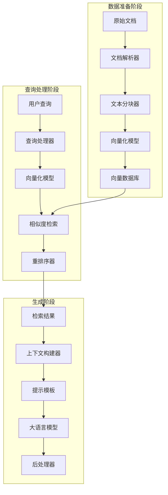
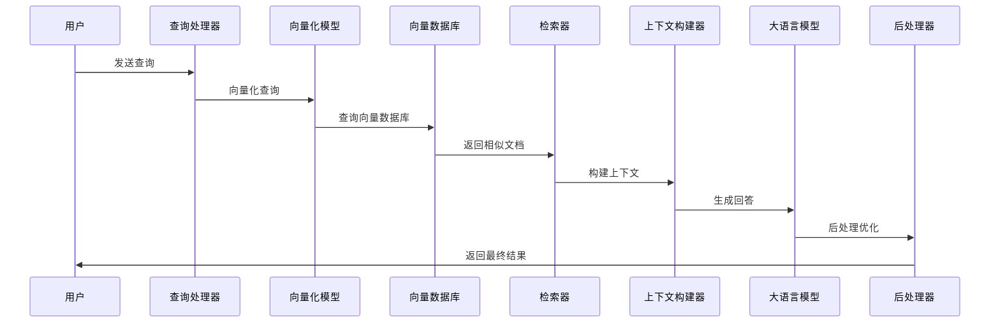

# RAG的核心组件

## 引言

RAG系统虽然概念简单，但其实现涉及多个复杂的组件。理解这些核心组件及其相互关系，是构建高质量RAG系统的关键。本文将详细介绍RAG系统的各个核心组件。

## RAG系统架构概览



## 核心组件详解

### 1. 文档解析器（Document Parser）

文档解析器负责将各种格式的文档转换为可处理的文本格式。

#### 支持的文档格式
- **PDF文档**：使用PyPDF2、pdfplumber等库
- **Word文档**：使用python-docx库
- **HTML网页**：使用BeautifulSoup、lxml等
- **Markdown文件**：使用markdown库
- **纯文本文件**：直接读取
- **结构化数据**：JSON、XML、CSV等

#### 实现示例

```python
from pdfplumber import PDF
import docx
from bs4 import BeautifulSoup

class DocumentParser:
    def parse_pdf(self, file_path):
        """解析PDF文档"""
        text = ""
        with PDF(file_path) as pdf:
            for page in pdf.pages:
                text += page.extract_text()
        return text
    
    def parse_docx(self, file_path):
        """解析Word文档"""
        doc = docx.Document(file_path)
        text = ""
        for paragraph in doc.paragraphs:
            text += paragraph.text + "\n"
        return text
    
    def parse_html(self, html_content):
        """解析HTML内容"""
        soup = BeautifulSoup(html_content, 'html.parser')
        return soup.get_text()
```

### 2. 文本分块器（Text Chunker）

文本分块器将长文档切分成合适大小的文本块，这是RAG系统的关键步骤。

#### 分块策略

**1. 固定长度分块**
```python
def fixed_length_chunking(text, chunk_size=1000, overlap=200):
    """固定长度分块"""
    chunks = []
    start = 0
    while start < len(text):
        end = start + chunk_size
        chunk = text[start:end]
        chunks.append(chunk)
        start = end - overlap
    return chunks
```

**2. 语义分块**
```python
def semantic_chunking(text, sentences_per_chunk=5):
    """基于语义的分块"""
    sentences = text.split('。')
    chunks = []
    for i in range(0, len(sentences), sentences_per_chunk):
        chunk = '。'.join(sentences[i:i+sentences_per_chunk])
        chunks.append(chunk)
    return chunks
```

**3. 递归分块**
```python
def recursive_chunking(text, max_size=1000):
    """递归分块，保持语义完整性"""
    if len(text) <= max_size:
        return [text]
    
    # 尝试按段落分割
    paragraphs = text.split('\n\n')
    if len(paragraphs) > 1:
        chunks = []
        for para in paragraphs:
            chunks.extend(recursive_chunking(para, max_size))
        return chunks
    
    # 尝试按句子分割
    sentences = text.split('。')
    if len(sentences) > 1:
        chunks = []
        current_chunk = ""
        for sentence in sentences:
            if len(current_chunk + sentence) <= max_size:
                current_chunk += sentence + "。"
            else:
                if current_chunk:
                    chunks.append(current_chunk)
                current_chunk = sentence + "。"
        if current_chunk:
            chunks.append(current_chunk)
        return chunks
    
    # 最后按字符分割
    return [text[i:i+max_size] for i in range(0, len(text), max_size)]
```

### 3. 向量化模型（Embedding Model）

向量化模型将文本转换为高维向量表示，用于相似度计算。

#### 主流向量化模型

**1. OpenAI Embeddings**
```python
import openai

def get_openai_embedding(text):
    response = openai.Embedding.create(
        input=text,
        model="text-embedding-ada-002"
    )
    return response['data'][0]['embedding']
```

**2. Sentence Transformers**
```python
from sentence_transformers import SentenceTransformer

model = SentenceTransformer('all-MiniLM-L6-v2')

def get_sentence_embedding(text):
    return model.encode(text)
```

**3. 中文向量化模型**
```python
# 使用中文优化的模型
model = SentenceTransformer('paraphrase-multilingual-MiniLM-L12-v2')

def get_chinese_embedding(text):
    return model.encode(text)
```

### 4. 向量数据库（Vector Database）

向量数据库专门用于存储和检索高维向量数据。

#### 主流向量数据库对比

| 数据库 | 特点 | 适用场景 |
|--------|------|----------|
| **Pinecone** | 云服务，易用 | 快速原型开发 |
| **Weaviate** | 开源，功能丰富 | 企业级应用 |
| **Chroma** | 轻量级，易部署 | 小到中型项目 |
| **Qdrant** | 高性能，Rust实现 | 大规模应用 |
| **Milvus** | 分布式，高可用 | 超大规模应用 |

#### Chroma使用示例

```python
import chromadb
from chromadb.config import Settings

# 初始化Chroma客户端
client = chromadb.Client(Settings(
    chroma_db_impl="duckdb+parquet",
    persist_directory="./chroma_db"
))

# 创建集合
collection = client.create_collection(
    name="documents",
    metadata={"hnsw:space": "cosine"}
)

# 添加文档
collection.add(
    documents=["文档内容1", "文档内容2"],
    metadatas=[{"source": "doc1"}, {"source": "doc2"}],
    ids=["id1", "id2"]
)

# 查询相似文档
results = collection.query(
    query_texts=["查询文本"],
    n_results=5
)
```

### 5. 检索器（Retriever）

检索器负责根据查询找到最相关的文档片段。

#### 检索策略

**1. 相似度检索**
```python
def similarity_search(query_vector, collection, top_k=5):
    """基于余弦相似度的检索"""
    results = collection.query(
        query_embeddings=[query_vector],
        n_results=top_k
    )
    return results
```

**2. 混合检索**
```python
def hybrid_search(query, collection, alpha=0.7):
    """结合语义检索和关键词检索"""
    # 语义检索
    semantic_results = semantic_search(query, collection)
    
    # 关键词检索
    keyword_results = keyword_search(query, collection)
    
    # 合并结果
    combined_results = combine_results(
        semantic_results, 
        keyword_results, 
        alpha
    )
    return combined_results
```

**3. 重排序检索**
```python
def rerank_search(query, initial_results, reranker):
    """使用重排序模型优化检索结果"""
    reranked_results = reranker.rerank(
        query=query,
        documents=initial_results
    )
    return reranked_results
```

### 6. 上下文构建器（Context Builder）

上下文构建器将检索到的文档片段组织成适合LLM的上下文格式。

#### 上下文构建策略

**1. 简单拼接**
```python
def simple_context_builder(query, retrieved_docs):
    """简单的上下文构建"""
    context = ""
    for i, doc in enumerate(retrieved_docs):
        context += f"文档{i+1}: {doc}\n\n"
    
    prompt = f"""
    基于以下文档内容回答用户问题：
    
    文档内容：
    {context}
    
    用户问题：{query}
    
    请基于上述文档内容提供准确的回答：
    """
    return prompt
```

**2. 结构化上下文**
```python
def structured_context_builder(query, retrieved_docs):
    """结构化的上下文构建"""
    context_parts = []
    for i, doc in enumerate(retrieved_docs):
        context_parts.append(f"[文档{i+1}]\n{doc}\n")
    
    context = "\n".join(context_parts)
    
    prompt = f"""
    你是一个专业的问答助手。请基于以下相关文档内容回答用户问题。
    
    相关文档：
    {context}
    
    用户问题：{query}
    
    回答要求：
    1. 基于提供的文档内容回答
    2. 如果文档中没有相关信息，请明确说明
    3. 引用具体的文档来源
    4. 保持回答的准确性和客观性
    
    回答：
    """
    return prompt
```

### 7. 大语言模型（Large Language Model）

大语言模型是RAG系统的核心生成组件。

#### 主流LLM选择

**1. OpenAI GPT系列**
```python
import openai

def generate_with_gpt(prompt):
    response = openai.ChatCompletion.create(
        model="gpt-3.5-turbo",
        messages=[{"role": "user", "content": prompt}],
        temperature=0.7,
        max_tokens=1000
    )
    return response.choices[0].message.content
```

**2. 开源模型**
```python
from transformers import AutoTokenizer, AutoModelForCausalLM

def generate_with_open_source(prompt, model_name="microsoft/DialoGPT-medium"):
    tokenizer = AutoTokenizer.from_pretrained(model_name)
    model = AutoModelForCausalLM.from_pretrained(model_name)
    
    inputs = tokenizer.encode(prompt, return_tensors="pt")
    outputs = model.generate(inputs, max_length=1000, temperature=0.7)
    
    return tokenizer.decode(outputs[0], skip_special_tokens=True)
```

### 8. 后处理器（Post-processor）

后处理器对LLM生成的结果进行优化和格式化。

#### 后处理功能

**1. 内容过滤**
```python
def filter_content(response):
    """过滤不当内容"""
    # 移除重复内容
    sentences = response.split('。')
    unique_sentences = list(dict.fromkeys(sentences))
    
    # 移除过短或过长的句子
    filtered_sentences = [
        s for s in unique_sentences 
        if 10 < len(s) < 200
    ]
    
    return '。'.join(filtered_sentences)
```

**2. 格式优化**
```python
def format_response(response):
    """优化回答格式"""
    # 添加适当的换行
    formatted = response.replace('。', '。\n\n')
    
    # 添加引用标记
    if '根据' in response or '基于' in response:
        formatted += "\n\n*以上回答基于检索到的相关文档内容*"
    
    return formatted
```

## 组件间的协作流程



## 组件选择建议

### 1. 根据项目规模选择
- **小型项目**：Chroma + Sentence Transformers + GPT-3.5
- **中型项目**：Weaviate + OpenAI Embeddings + GPT-4
- **大型项目**：Milvus + 自定义模型 + 多模型集成

### 2. 根据领域特点选择
- **中文应用**：选择支持中文的embedding模型
- **技术文档**：使用代码感知的分块策略
- **多模态内容**：选择支持多模态的向量化模型

### 3. 根据性能要求选择
- **低延迟**：使用本地部署的模型和数据库
- **高准确率**：使用重排序和混合检索
- **高并发**：使用分布式架构和缓存

## 总结

RAG系统的核心组件相互协作，形成了一个完整的知识问答系统。每个组件都有其特定的功能和优化空间，理解这些组件的工作原理和相互关系，是构建高质量RAG系统的关键。

在接下来的文章中，我们将深入探讨每个组件的实现细节和优化技巧，帮助你构建更加高效和准确的RAG应用。

---

**下一步学习建议：**
- 阅读《RAG vs 传统搜索》，了解RAG与传统搜索的区别
- 实践搭建一个简单的RAG系统，体验各组件协作
- 关注各组件的最新技术发展和优化方案
