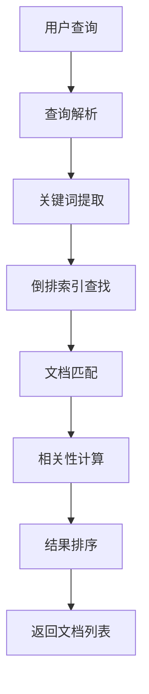

# RAG vs 传统搜索

## 引言

在信息检索领域，传统搜索技术已经发展了几十年，而RAG作为新兴技术，正在重新定义我们获取和处理信息的方式。本文将深入对比RAG与传统搜索的差异，帮助你理解何时选择哪种技术方案。

## 传统搜索技术概览

### 传统搜索的核心原理

传统搜索主要基于以下技术：

1. **关键词匹配**：使用TF-IDF、BM25等算法
2. **倒排索引**：建立词项到文档的映射
3. **布尔查询**：支持AND、OR、NOT等逻辑操作
4. **相关性排序**：基于词频、位置等因素排序

### 传统搜索的典型流程



## RAG vs 传统搜索对比

### 1. 技术原理对比

| 维度 | 传统搜索 | RAG |
|------|----------|-----|
| **核心算法** | TF-IDF, BM25 | 向量相似度 |
| **索引方式** | 倒排索引 | 向量索引 |
| **匹配方式** | 关键词匹配 | 语义匹配 |
| **结果形式** | 文档列表 | 自然语言回答 |
| **理解能力** | 词汇层面 | 语义层面 |

### 2. 查询理解能力

#### 传统搜索的局限性

**示例1：同义词问题**
```
查询："汽车维修"
传统搜索：只能匹配包含"汽车"和"维修"的文档
问题：无法理解"车辆保养"、"auto repair"等同义表达
```

**示例2：语义理解**
```
查询："如何解决电脑运行缓慢的问题"
传统搜索：查找包含"电脑"、"运行"、"缓慢"的文档
问题：无法理解"性能优化"、"系统加速"等相关概念
```

#### RAG的语义理解

**示例1：同义词处理**
```python
# RAG能够理解语义相似的概念
query = "汽车维修"
# 可以匹配到包含以下内容的文档：
# - "车辆保养指南"
# - "auto repair tips" 
# - "汽车故障排除"
# - "vehicle maintenance"
```

**示例2：上下文理解**
```python
# RAG能够理解查询的完整语义
query = "如何解决电脑运行缓慢的问题"
# 能够匹配到：
# - "系统性能优化方法"
# - "电脑加速技巧"
# - "Windows系统清理指南"
# - "硬件升级建议"
```

### 3. 结果呈现方式

#### 传统搜索结果

```
搜索结果：
1. 《电脑性能优化完全指南》- 相关度: 0.85
2. 《Windows系统加速技巧》- 相关度: 0.82
3. 《硬件升级指南》- 相关度: 0.78
4. 《系统清理工具推荐》- 相关度: 0.75
```

#### RAG结果

```
回答：
根据相关文档，解决电脑运行缓慢的问题可以从以下几个方面入手：

1. **系统清理**：定期清理临时文件、卸载不需要的程序
2. **硬件升级**：增加内存、更换SSD硬盘
3. **软件优化**：关闭不必要的启动项、更新驱动程序
4. **系统维护**：定期进行磁盘碎片整理、病毒扫描

具体操作步骤请参考《电脑性能优化完全指南》第3章。
```

### 4. 用户体验对比

#### 传统搜索的用户体验

**优点：**
- 结果透明，用户可以看到所有相关文档
- 支持精确的关键词搜索
- 可以快速浏览多个结果
- 支持复杂的布尔查询

**缺点：**
- 需要用户自己筛选和整合信息
- 对查询表达能力要求较高
- 无法直接获得答案
- 需要阅读多个文档才能获得完整信息

#### RAG的用户体验

**优点：**
- 直接获得自然语言回答
- 支持自然语言查询
- 答案经过整合和总结
- 提供可追溯的信息来源

**缺点：**
- 无法看到所有相关文档
- 对复杂查询的支持有限
- 可能存在信息丢失
- 黑盒性质，难以调试

## 技术实现对比

### 传统搜索实现示例

```python
from whoosh import index
from whoosh.fields import Schema, TEXT, ID
from whoosh.qparser import QueryParser

# 创建索引
schema = Schema(title=TEXT(stored=True), content=TEXT)
ix = index.create_in("indexdir", schema)

# 添加文档
writer = ix.writer()
writer.add_document(title="文档1", content="这是文档内容...")
writer.commit()

# 搜索
with ix.searcher() as searcher:
    query = QueryParser("content", ix.schema).parse("关键词")
    results = searcher.search(query)
    for result in results:
        print(result["title"])
```

### RAG实现示例

```python
import openai
from sentence_transformers import SentenceTransformer
import chromadb

# 初始化组件
model = SentenceTransformer('all-MiniLM-L6-v2')
client = chromadb.Client()

# 文档向量化
documents = ["文档内容1", "文档内容2"]
embeddings = model.encode(documents)

# 存储到向量数据库
collection = client.create_collection("docs")
collection.add(
    documents=documents,
    embeddings=embeddings.tolist(),
    ids=["doc1", "doc2"]
)

# 查询和生成
def rag_query(user_query):
    # 向量化查询
    query_embedding = model.encode([user_query])
    
    # 检索相关文档
    results = collection.query(
        query_embeddings=query_embedding.tolist(),
        n_results=3
    )
    
    # 构建上下文
    context = "\n".join(results['documents'][0])
    
    # 生成回答
    response = openai.ChatCompletion.create(
        model="gpt-3.5-turbo",
        messages=[{
            "role": "user", 
            "content": f"基于以下信息回答问题：\n{context}\n\n问题：{user_query}"
        }]
    )
    
    return response.choices[0].message.content
```

## 性能对比分析

### 1. 响应时间

| 技术 | 平均响应时间 | 影响因素 |
|------|-------------|----------|
| **传统搜索** | 50-200ms | 索引大小、查询复杂度 |
| **RAG** | 1-5s | 向量计算、LLM生成时间 |

### 2. 资源消耗

| 资源类型 | 传统搜索 | RAG |
|----------|----------|-----|
| **存储空间** | 低（文本索引） | 高（向量存储） |
| **计算资源** | 低 | 高（GPU/CPU） |
| **内存使用** | 低 | 中等 |
| **网络带宽** | 低 | 高（API调用） |

### 3. 准确性对比

#### 传统搜索的准确性

**优势场景：**
- 精确的关键词匹配
- 结构化数据查询
- 已知文档内容的查找

**劣势场景：**
- 语义相似但用词不同的查询
- 需要推理和整合的复杂问题
- 多语言查询

#### RAG的准确性

**优势场景：**
- 自然语言理解
- 复杂语义查询
- 需要整合多个信息源的问题

**劣势场景：**
- 需要精确匹配的场景
- 对时效性要求极高的查询
- 需要看到所有相关结果的场景

## 适用场景分析

### 传统搜索适用场景

1. **企业内部门户**
   - 员工查找公司政策文档
   - 技术文档的精确查找
   - 历史记录的检索

2. **电商平台**
   - 商品名称的精确搜索
   - 价格、规格等结构化查询
   - 用户评价的筛选

3. **学术研究**
   - 文献的精确引用查找
   - 特定术语的搜索
   - 数据库查询

### RAG适用场景

1. **智能客服**
   - 自然语言问题解答
   - 复杂问题的处理
   - 多轮对话支持

2. **教育平台**
   - 学习问题的智能回答
   - 个性化学习指导
   - 知识点的整合解释

3. **医疗咨询**
   - 症状的智能分析
   - 医疗知识的整合
   - 个性化建议提供

## 混合方案：最佳实践

在实际应用中，往往需要结合两种技术的优势：

### 1. 分层检索策略

```python
def hybrid_search(query, documents):
    # 第一层：传统关键词搜索
    keyword_results = traditional_search(query, documents)
    
    # 第二层：RAG语义搜索
    rag_results = rag_search(query, documents)
    
    # 第三层：结果融合
    combined_results = merge_results(keyword_results, rag_results)
    
    return combined_results
```

### 2. 场景自适应选择

```python
def adaptive_search(query, context):
    # 分析查询类型
    query_type = analyze_query_type(query)
    
    if query_type == "exact_match":
        return traditional_search(query, context)
    elif query_type == "semantic_search":
        return rag_search(query, context)
    else:
        return hybrid_search(query, context)
```

### 3. 结果质量评估

```python
def evaluate_search_quality(results, query):
    # 评估传统搜索结果
    traditional_score = evaluate_traditional_results(results['traditional'])
    
    # 评估RAG结果
    rag_score = evaluate_rag_results(results['rag'])
    
    # 选择最佳结果
    if traditional_score > rag_score:
        return results['traditional']
    else:
        return results['rag']
```

## 技术发展趋势

### 传统搜索的演进

1. **语义增强**：集成embedding技术
2. **个性化**：基于用户行为的优化
3. **多模态**：支持图像、音频等媒体搜索
4. **实时性**：流式搜索和实时更新

### RAG技术的发展

1. **效率优化**：更快的向量计算和检索
2. **准确性提升**：更好的重排序和融合算法
3. **多模态支持**：文本、图像、音频的统一处理
4. **实时更新**：动态知识库更新机制

## 选择建议

### 选择传统搜索的情况

- 需要精确的关键词匹配
- 对响应时间要求极高
- 资源有限的小型项目
- 需要透明的结果展示
- 处理结构化数据查询

### 选择RAG的情况

- 需要自然语言理解
- 用户查询复杂多样
- 需要整合多个信息源
- 追求更好的用户体验
- 有足够的计算资源

### 选择混合方案的情况

- 大型企业级应用
- 需要兼顾精确性和智能性
- 有充足的开发资源
- 对用户体验要求极高

## 总结

RAG和传统搜索各有优势，适用于不同的场景和需求。传统搜索在精确匹配和快速响应方面表现优异，而RAG在语义理解和用户体验方面具有明显优势。

在实际应用中，最佳策略是根据具体需求选择合适的技术方案，或者采用混合方案来兼顾两种技术的优势。随着技术的发展，两种技术也在相互融合，未来的搜索系统将更加智能和高效。

---

**下一步学习建议：**
- 阅读《RAG的应用场景》，了解RAG在不同领域的实际应用
- 实践搭建传统搜索和RAG系统，体验两者的差异
- 关注搜索技术的最新发展趋势和融合方案
