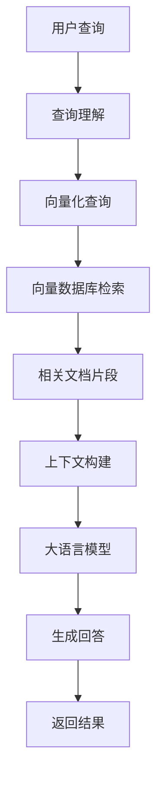

# 什么是RAG

## 引言

在人工智能快速发展的今天，RAG（Retrieval-Augmented Generation，检索增强生成）技术正在成为连接大语言模型与现实世界知识的重要桥梁。本文将深入探讨RAG的核心概念、工作原理以及为什么它如此重要。

## RAG的定义

RAG是一种结合了**检索（Retrieval）**和**生成（Generation）**的AI技术架构。它通过以下方式工作：

1. **检索阶段**：根据用户查询，从外部知识库中检索相关的文档片段
2. **增强阶段**：将检索到的信息作为上下文提供给大语言模型
3. **生成阶段**：基于检索到的信息和用户查询，生成准确、相关的回答

## RAG的核心思想

### 传统大语言模型的局限性

传统的大语言模型虽然具有强大的语言理解和生成能力，但也存在一些根本性限制：

- **知识截止时间**：模型训练时的知识是固定的，无法获取最新信息
- **幻觉问题**：模型可能生成看似合理但实际错误的信息
- **领域知识不足**：对于特定领域的专业知识可能不够深入
- **无法引用来源**：生成的内容缺乏可追溯的信息来源

### RAG的解决方案

RAG通过以下方式解决这些问题：



## RAG的工作原理

### 1. 文档预处理阶段

```
原始文档 → 文档解析 → 文本分块 → 向量化 → 存储到向量数据库
```

**关键步骤：**
- **文档解析**：处理PDF、Word、HTML等各种格式
- **文本分块**：将长文档切分成合适大小的片段
- **向量化**：使用embedding模型将文本转换为向量
- **索引存储**：将向量存储到向量数据库中

### 2. 查询处理阶段

```
用户查询 → 查询向量化 → 相似度检索 → 相关文档片段
```

**关键步骤：**
- **查询理解**：分析用户查询的意图和关键词
- **向量化查询**：将查询转换为向量表示
- **相似度计算**：在向量空间中计算查询与文档的相似度
- **结果排序**：按相关性对检索结果进行排序

### 3. 生成回答阶段

```
检索结果 + 用户查询 → 上下文构建 → LLM生成 → 最终回答
```

**关键步骤：**
- **上下文构建**：将检索到的文档片段组织成合适的上下文
- **提示工程**：设计有效的提示模板
- **生成控制**：控制生成过程，确保回答质量
- **结果优化**：对生成结果进行后处理和优化

## RAG的技术优势

### 1. 知识实时性
- 可以访问最新的外部信息
- 支持动态更新知识库
- 实时获取网络信息

### 2. 准确性提升
- 基于真实文档生成回答
- 减少幻觉和错误信息
- 提供可追溯的信息来源

### 3. 领域适应性
- 可以针对特定领域构建知识库
- 支持多语言和多模态内容
- 灵活的知识管理

### 4. 成本效益
- 相比重新训练模型，成本更低
- 可以复用现有的预训练模型
- 支持增量更新

## RAG的应用场景

### 1. 企业知识管理
- **内部文档问答**：员工可以快速查询公司政策、流程等
- **技术文档助手**：帮助开发者快速找到API文档和代码示例
- **客户服务**：基于产品手册回答客户问题

### 2. 教育领域
- **智能教学助手**：基于教材内容回答学生问题
- **个性化学习**：根据学习材料提供定制化指导
- **学术研究**：帮助研究人员快速查找相关文献

### 3. 医疗健康
- **医学知识问答**：基于医学文献提供专业建议
- **诊断辅助**：帮助医生查找相关病例和治疗方法
- **健康咨询**：基于权威医学资料回答健康问题

### 4. 法律咨询
- **法律条文查询**：快速查找相关法律条款
- **案例分析**：基于历史案例提供法律建议
- **合同审查**：帮助分析合同条款和风险

## RAG vs 其他技术方案

### RAG vs 微调（Fine-tuning）

| 特性 | RAG | 微调 |
|------|-----|------|
| 知识更新 | 实时 | 需要重新训练 |
| 成本 | 低 | 高 |
| 灵活性 | 高 | 低 |
| 可解释性 | 高 | 低 |
| 实施难度 | 中等 | 高 |

### RAG vs 传统搜索

| 特性 | RAG | 传统搜索 |
|------|-----|----------|
| 回答形式 | 自然语言 | 文档列表 |
| 理解能力 | 语义理解 | 关键词匹配 |
| 个性化 | 支持 | 有限 |
| 交互方式 | 对话式 | 查询式 |

## RAG的挑战与限制

### 1. 技术挑战
- **检索质量**：如何确保检索到最相关的文档
- **上下文长度**：LLM的上下文窗口限制
- **延迟问题**：检索和生成的时间开销
- **成本控制**：API调用和存储成本

### 2. 数据质量
- **文档质量**：知识库中文档的准确性和完整性
- **数据更新**：如何保持知识库的时效性
- **多语言支持**：跨语言文档的处理

### 3. 系统复杂性
- **架构设计**：需要设计复杂的系统架构
- **性能优化**：检索和生成的性能调优
- **监控运维**：系统的监控和维护

## 总结

RAG技术通过巧妙地结合检索和生成，为大语言模型提供了访问外部知识的能力。它不仅解决了传统LLM的知识局限问题，还提供了更高的准确性、可解释性和灵活性。

虽然RAG技术还面临一些挑战，但随着技术的不断发展和优化，它正在成为构建智能应用的重要技术选择。在接下来的文章中，我们将深入探讨RAG的各个组件和实现细节，帮助你全面掌握这项技术。

---

**下一步学习建议：**
- 阅读《RAG的核心组件》，了解RAG系统的各个组成部分
- 实践简单的RAG应用，加深对概念的理解
- 关注RAG技术的最新发展和应用案例
