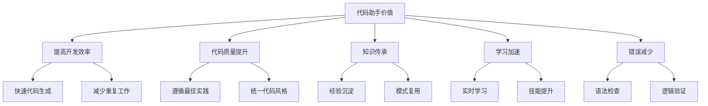
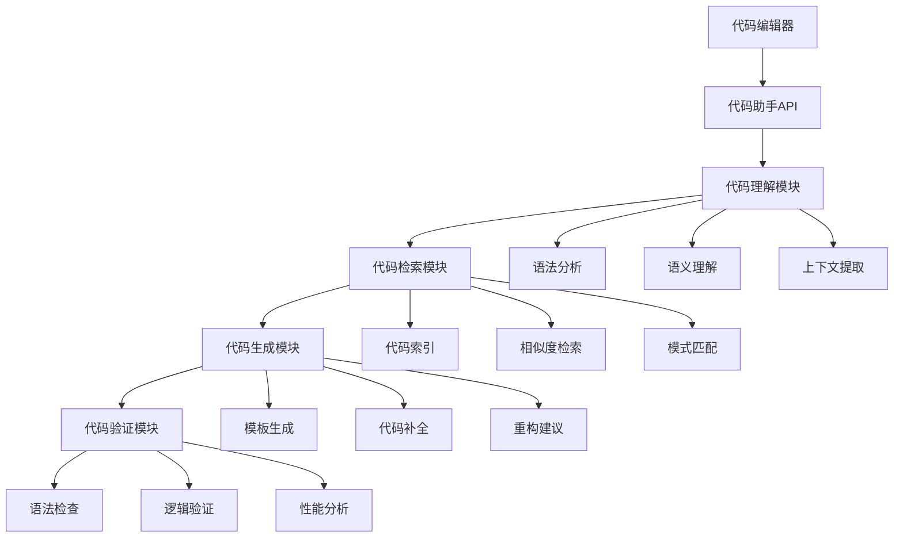

# 代码助手实现

## 引言

代码助手是基于RAG技术构建的智能编程辅助工具，能够理解开发者的编程需求，从代码库、文档和最佳实践中检索相关信息，生成高质量的代码建议和解决方案。本文将深入探讨代码助手的实现原理、技术架构和实际应用。

## 代码助手概述

### 什么是代码助手

代码助手是一种基于RAG技术的智能编程工具，它能够：
- 理解开发者的编程意图和需求
- 从代码库中检索相关的代码示例和模式
- 生成符合项目规范的代码建议
- 提供实时的编程指导和最佳实践

### 代码助手的价值



## 系统架构设计

### 1. 整体架构



### 2. 核心组件实现

```python
class CodeAssistant:
    def __init__(self):
        self.code_analyzer = CodeAnalyzer()
        self.code_retriever = CodeRetriever()
        self.code_generator = CodeGenerator()
        self.code_validator = CodeValidator()
        self.context_manager = ContextManager()
    
    def process_code_request(self, request: Dict[str, any]) -> Dict[str, any]:
        """处理代码请求"""
        try:
            # 1. 分析代码上下文
            context = self.context_manager.extract_context(request)
            
            # 2. 理解用户意图
            intent = self.code_analyzer.analyze_intent(request, context)
            
            # 3. 检索相关代码
            relevant_code = self.code_retriever.retrieve_code(intent, context)
            
            # 4. 生成代码建议
            suggestions = self.code_generator.generate_suggestions(
                intent, relevant_code, context
            )
            
            # 5. 验证代码质量
            validated_suggestions = self.code_validator.validate_suggestions(suggestions)
            
            return {
                'suggestions': validated_suggestions,
                'context': context,
                'intent': intent,
                'confidence': self._calculate_confidence(validated_suggestions)
            }
            
        except Exception as e:
            return {'error': f'处理代码请求失败: {str(e)}'}


class CodeAnalyzer:
    def __init__(self):
        self.parser = CodeParser()
        self.semantic_analyzer = SemanticAnalyzer()
        self.intent_classifier = IntentClassifier()
    
    def analyze_intent(self, request: Dict[str, any], context: Dict[str, any]) -> Dict[str, any]:
        """分析用户意图"""
        # 解析代码
        parsed_code = self.parser.parse(request['code'])
        
        # 语义分析
        semantic_info = self.semantic_analyzer.analyze(parsed_code)
        
        # 意图分类
        intent = self.intent_classifier.classify(request, semantic_info)
        
        return {
            'intent_type': intent['type'],
            'parameters': intent['parameters'],
            'semantic_info': semantic_info,
            'parsed_code': parsed_code
        }


class CodeRetriever:
    def __init__(self):
        self.code_index = CodeIndex()
        self.similarity_calculator = SimilarityCalculator()
        self.pattern_matcher = PatternMatcher()
    
    def retrieve_code(self, intent: Dict[str, any], context: Dict[str, any]) -> List[Dict[str, any]]:
        """检索相关代码"""
        # 基于意图检索
        intent_results = self._retrieve_by_intent(intent)
        
        # 基于相似度检索
        similarity_results = self._retrieve_by_similarity(context)
        
        # 基于模式匹配检索
        pattern_results = self._retrieve_by_pattern(intent, context)
        
        # 合并和排序结果
        all_results = intent_results + similarity_results + pattern_results
        ranked_results = self._rank_results(all_results, intent, context)
        
        return ranked_results[:10]  # 返回前10个结果
    
    def _retrieve_by_intent(self, intent: Dict[str, any]) -> List[Dict[str, any]]:
        """基于意图检索"""
        intent_type = intent['intent_type']
        return self.code_index.search_by_intent(intent_type)
    
    def _retrieve_by_similarity(self, context: Dict[str, any]) -> List[Dict[str, any]]:
        """基于相似度检索"""
        context_vector = self.similarity_calculator.vectorize_context(context)
        return self.code_index.search_by_similarity(context_vector)
    
    def _retrieve_by_pattern(self, intent: Dict[str, any], context: Dict[str, any]) -> List[Dict[str, any]]:
        """基于模式匹配检索"""
        patterns = self.pattern_matcher.extract_patterns(intent, context)
        return self.code_index.search_by_patterns(patterns)
    
    def _rank_results(self, results: List[Dict[str, any]], 
                     intent: Dict[str, any], context: Dict[str, any]) -> List[Dict[str, any]]:
        """排序结果"""
        # 计算每个结果的得分
        scored_results = []
        for result in results:
            score = self._calculate_relevance_score(result, intent, context)
            scored_results.append({**result, 'score': score})
        
        # 按得分排序
        scored_results.sort(key=lambda x: x['score'], reverse=True)
        return scored_results
    
    def _calculate_relevance_score(self, result: Dict[str, any], 
                                 intent: Dict[str, any], context: Dict[str, any]) -> float:
        """计算相关性得分"""
        score = 0.0
        
        # 意图匹配得分
        if result.get('intent_type') == intent['intent_type']:
            score += 0.4
        
        # 相似度得分
        similarity = result.get('similarity', 0)
        score += similarity * 0.3
        
        # 模式匹配得分
        pattern_match = result.get('pattern_match', 0)
        score += pattern_match * 0.3
        
        return score


class CodeGenerator:
    def __init__(self):
        self.template_engine = TemplateEngine()
        self.code_completer = CodeCompleter()
        self.refactoring_engine = RefactoringEngine()
        self.llm_client = LLMClient()
    
    def generate_suggestions(self, intent: Dict[str, any], 
                           relevant_code: List[Dict[str, any]], 
                           context: Dict[str, any]) -> List[Dict[str, any]]:
        """生成代码建议"""
        suggestions = []
        
        # 基于模板生成
        template_suggestions = self._generate_from_templates(intent, relevant_code, context)
        suggestions.extend(template_suggestions)
        
        # 基于LLM生成
        llm_suggestions = self._generate_from_llm(intent, relevant_code, context)
        suggestions.extend(llm_suggestions)
        
        # 代码补全建议
        completion_suggestions = self._generate_completions(intent, context)
        suggestions.extend(completion_suggestions)
        
        # 重构建议
        refactoring_suggestions = self._generate_refactoring_suggestions(intent, context)
        suggestions.extend(refactoring_suggestions)
        
        return suggestions
    
    def _generate_from_templates(self, intent: Dict[str, any], 
                                 relevant_code: List[Dict[str, any]], 
                                 context: Dict[str, any]) -> List[Dict[str, any]]:
        """基于模板生成"""
        intent_type = intent['intent_type']
        templates = self.template_engine.get_templates(intent_type)
        
        suggestions = []
        for template in templates:
            suggestion = self.template_engine.generate_from_template(
                template, intent['parameters'], context
            )
            suggestions.append({
                'type': 'template',
                'code': suggestion,
                'confidence': 0.8,
                'source': 'template'
            })
        
        return suggestions
    
    def _generate_from_llm(self, intent: Dict[str, any], 
                          relevant_code: List[Dict[str, any]], 
                          context: Dict[str, any]) -> List[Dict[str, any]]:
        """基于LLM生成"""
        prompt = self._build_prompt(intent, relevant_code, context)
        
        try:
            response = self.llm_client.generate_code(prompt)
            return [{
                'type': 'llm_generated',
                'code': response['code'],
                'confidence': response['confidence'],
                'source': 'llm'
            }]
        except Exception as e:
            print(f"LLM生成失败: {e}")
            return []
    
    def _generate_completions(self, intent: Dict[str, any], context: Dict[str, any]) -> List[Dict[str, any]]:
        """生成代码补全建议"""
        completions = self.code_completer.get_completions(context)
        
        suggestions = []
        for completion in completions:
            suggestions.append({
                'type': 'completion',
                'code': completion['code'],
                'confidence': completion['confidence'],
                'source': 'completion'
            })
        
        return suggestions
    
    def _generate_refactoring_suggestions(self, intent: Dict[str, any], 
                                        context: Dict[str, any]) -> List[Dict[str, any]]:
        """生成重构建议"""
        if intent['intent_type'] != 'refactor':
            return []
        
        suggestions = self.refactoring_engine.suggest_refactoring(context)
        
        refactoring_suggestions = []
        for suggestion in suggestions:
            refactoring_suggestions.append({
                'type': 'refactoring',
                'code': suggestion['code'],
                'confidence': suggestion['confidence'],
                'source': 'refactoring'
            })
        
        return refactoring_suggestions
    
    def _build_prompt(self, intent: Dict[str, any], 
                     relevant_code: List[Dict[str, any]], 
                     context: Dict[str, any]) -> str:
        """构建提示"""
        prompt_parts = []
        
        # 添加上下文信息
        prompt_parts.append(f"代码上下文: {context.get('file_path', '')}")
        prompt_parts.append(f"当前代码: {context.get('current_code', '')}")
        
        # 添加意图信息
        prompt_parts.append(f"用户意图: {intent['intent_type']}")
        prompt_parts.append(f"参数: {intent['parameters']}")
        
        # 添加相关代码示例
        if relevant_code:
            prompt_parts.append("相关代码示例:")
            for code in relevant_code[:3]:  # 只使用前3个示例
                prompt_parts.append(f"```\n{code['code']}\n```")
        
        # 添加生成要求
        prompt_parts.append("请生成符合项目规范的代码建议。")
        
        return "\n".join(prompt_parts)


class CodeValidator:
    def __init__(self):
        self.syntax_checker = SyntaxChecker()
        self.logic_validator = LogicValidator()
        self.performance_analyzer = PerformanceAnalyzer()
        self.security_scanner = SecurityScanner()
    
    def validate_suggestions(self, suggestions: List[Dict[str, any]]) -> List[Dict[str, any]]:
        """验证代码建议"""
        validated_suggestions = []
        
        for suggestion in suggestions:
            validation_result = self._validate_suggestion(suggestion)
            
            if validation_result['valid']:
                validated_suggestions.append({
                    **suggestion,
                    'validation': validation_result
                })
        
        return validated_suggestions
    
    def _validate_suggestion(self, suggestion: Dict[str, any]) -> Dict[str, any]:
        """验证单个建议"""
        code = suggestion['code']
        validation_result = {
            'valid': True,
            'issues': [],
            'warnings': []
        }
        
        # 语法检查
        syntax_result = self.syntax_checker.check(code)
        if not syntax_result['valid']:
            validation_result['valid'] = False
            validation_result['issues'].extend(syntax_result['errors'])
        
        # 逻辑验证
        logic_result = self.logic_validator.validate(code)
        if not logic_result['valid']:
            validation_result['valid'] = False
            validation_result['issues'].extend(logic_result['errors'])
        
        # 性能分析
        performance_result = self.performance_analyzer.analyze(code)
        if performance_result['warnings']:
            validation_result['warnings'].extend(performance_result['warnings'])
        
        # 安全检查
        security_result = self.security_scanner.scan(code)
        if security_result['issues']:
            validation_result['issues'].extend(security_result['issues'])
        
        return validation_result


class ContextManager:
    def __init__(self):
        self.file_analyzer = FileAnalyzer()
        self.project_analyzer = ProjectAnalyzer()
        self.dependency_analyzer = DependencyAnalyzer()
    
    def extract_context(self, request: Dict[str, any]) -> Dict[str, any]:
        """提取代码上下文"""
        context = {
            'file_path': request.get('file_path', ''),
            'current_code': request.get('code', ''),
            'cursor_position': request.get('cursor_position', 0),
            'project_info': {},
            'dependencies': {},
            'file_context': {}
        }
        
        # 分析文件上下文
        if context['file_path']:
            context['file_context'] = self.file_analyzer.analyze(context['file_path'])
        
        # 分析项目信息
        context['project_info'] = self.project_analyzer.analyze(context['file_path'])
        
        # 分析依赖关系
        context['dependencies'] = self.dependency_analyzer.analyze(context['file_path'])
        
        return context
```

## 代码理解技术

### 1. 语法分析

```python
class CodeParser:
    def __init__(self):
        self.parsers = {
            'python': PythonParser(),
            'javascript': JavaScriptParser(),
            'java': JavaParser(),
            'typescript': TypeScriptParser()
        }
    
    def parse(self, code: str, language: str = 'python') -> Dict[str, any]:
        """解析代码"""
        parser = self.parsers.get(language)
        if not parser:
            raise ValueError(f"不支持的语言: {language}")
        
        return parser.parse(code)


class PythonParser:
    def parse(self, code: str) -> Dict[str, any]:
        """解析Python代码"""
        import ast
        
        try:
            tree = ast.parse(code)
            return self._analyze_ast(tree)
        except SyntaxError as e:
            return {
                'valid': False,
                'error': str(e),
                'ast': None
            }
    
    def _analyze_ast(self, tree) -> Dict[str, any]:
        """分析AST"""
        analysis = {
            'valid': True,
            'functions': [],
            'classes': [],
            'imports': [],
            'variables': [],
            'ast': tree
        }
        
        for node in ast.walk(tree):
            if isinstance(node, ast.FunctionDef):
                analysis['functions'].append({
                    'name': node.name,
                    'args': [arg.arg for arg in node.args.args],
                    'line_number': node.lineno
                })
            elif isinstance(node, ast.ClassDef):
                analysis['classes'].append({
                    'name': node.name,
                    'bases': [base.id for base in node.bases if isinstance(base, ast.Name)],
                    'line_number': node.lineno
                })
            elif isinstance(node, ast.Import):
                for alias in node.names:
                    analysis['imports'].append({
                        'module': alias.name,
                        'alias': alias.asname,
                        'line_number': node.lineno
                    })
            elif isinstance(node, ast.ImportFrom):
                for alias in node.names:
                    analysis['imports'].append({
                        'module': node.module,
                        'name': alias.name,
                        'alias': alias.asname,
                        'line_number': node.lineno
                    })
        
        return analysis


class JavaScriptParser:
    def parse(self, code: str) -> Dict[str, any]:
        """解析JavaScript代码"""
        # 这里应该使用JavaScript解析器，如esprima
        # 简化实现
        return {
            'valid': True,
            'functions': [],
            'classes': [],
            'imports': [],
            'variables': []
        }


class JavaParser:
    def parse(self, code: str) -> Dict[str, any]:
        """解析Java代码"""
        # 这里应该使用Java解析器
        # 简化实现
        return {
            'valid': True,
            'methods': [],
            'classes': [],
            'imports': [],
            'variables': []
        }


class TypeScriptParser:
    def parse(self, code: str) -> Dict[str, any]:
        """解析TypeScript代码"""
        # 这里应该使用TypeScript解析器
        # 简化实现
        return {
            'valid': True,
            'functions': [],
            'classes': [],
            'imports': [],
            'interfaces': []
        }
```

### 2. 语义理解

```python
class SemanticAnalyzer:
    def __init__(self):
        self.semantic_extractors = {
            'python': PythonSemanticExtractor(),
            'javascript': JavaScriptSemanticExtractor(),
            'java': JavaSemanticExtractor()
        }
    
    def analyze(self, parsed_code: Dict[str, any]) -> Dict[str, any]:
        """语义分析"""
        if not parsed_code['valid']:
            return {'error': '代码解析失败'}
        
        # 提取语义信息
        semantic_info = {
            'entities': [],
            'relationships': [],
            'patterns': [],
            'intentions': []
        }
        
        # 分析实体
        semantic_info['entities'] = self._extract_entities(parsed_code)
        
        # 分析关系
        semantic_info['relationships'] = self._extract_relationships(parsed_code)
        
        # 分析模式
        semantic_info['patterns'] = self._extract_patterns(parsed_code)
        
        # 分析意图
        semantic_info['intentions'] = self._extract_intentions(parsed_code)
        
        return semantic_info
    
    def _extract_entities(self, parsed_code: Dict[str, any]) -> List[Dict[str, any]]:
        """提取实体"""
        entities = []
        
        # 提取函数实体
        for func in parsed_code.get('functions', []):
            entities.append({
                'type': 'function',
                'name': func['name'],
                'line_number': func['line_number'],
                'parameters': func.get('args', [])
            })
        
        # 提取类实体
        for cls in parsed_code.get('classes', []):
            entities.append({
                'type': 'class',
                'name': cls['name'],
                'line_number': cls['line_number'],
                'bases': cls.get('bases', [])
            })
        
        return entities
    
    def _extract_relationships(self, parsed_code: Dict[str, any]) -> List[Dict[str, any]]:
        """提取关系"""
        relationships = []
        
        # 分析继承关系
        for cls in parsed_code.get('classes', []):
            for base in cls.get('bases', []):
                relationships.append({
                    'type': 'inheritance',
                    'from': cls['name'],
                    'to': base,
                    'line_number': cls['line_number']
                })
        
        return relationships
    
    def _extract_patterns(self, parsed_code: Dict[str, any]) -> List[Dict[str, any]]:
        """提取模式"""
        patterns = []
        
        # 分析设计模式
        # 这里可以添加各种设计模式的识别逻辑
        
        return patterns
    
    def _extract_intentions(self, parsed_code: Dict[str, any]) -> List[Dict[str, any]]:
        """提取意图"""
        intentions = []
        
        # 基于代码结构推断意图
        if parsed_code.get('functions'):
            intentions.append({
                'type': 'function_definition',
                'confidence': 0.8
            })
        
        if parsed_code.get('classes'):
            intentions.append({
                'type': 'class_definition',
                'confidence': 0.8
            })
        
        return intentions


class PythonSemanticExtractor:
    def extract_semantics(self, ast_tree) -> Dict[str, any]:
        """提取Python语义信息"""
        # 实现Python语义提取
        pass


class JavaScriptSemanticExtractor:
    def extract_semantics(self, ast_tree) -> Dict[str, any]:
        """提取JavaScript语义信息"""
        # 实现JavaScript语义提取
        pass


class JavaSemanticExtractor:
    def extract_semantics(self, ast_tree) -> Dict[str, any]:
        """提取Java语义信息"""
        # 实现Java语义提取
        pass
```

## 代码检索技术

### 1. 代码索引

```python
class CodeIndex:
    def __init__(self):
        self.vector_db = VectorDatabase()
        self.text_index = TextIndex()
        self.structural_index = StructuralIndex()
        self.semantic_index = SemanticIndex()
    
    def index_code(self, code_snippet: Dict[str, any]):
        """索引代码片段"""
        # 向量化代码
        vector = self._vectorize_code(code_snippet)
        
        # 存储到向量数据库
        self.vector_db.store(code_snippet['id'], vector, code_snippet)
        
        # 建立文本索引
        self.text_index.index(code_snippet['id'], code_snippet['code'])
        
        # 建立结构索引
        self.structural_index.index(code_snippet['id'], code_snippet['structure'])
        
        # 建立语义索引
        self.semantic_index.index(code_snippet['id'], code_snippet['semantics'])
    
    def search_by_intent(self, intent_type: str) -> List[Dict[str, any]]:
        """基于意图搜索"""
        return self.semantic_index.search_by_intent(intent_type)
    
    def search_by_similarity(self, query_vector: List[float]) -> List[Dict[str, any]]:
        """基于相似度搜索"""
        return self.vector_db.search(query_vector, top_k=10)
    
    def search_by_patterns(self, patterns: List[str]) -> List[Dict[str, any]]:
        """基于模式搜索"""
        return self.structural_index.search_by_patterns(patterns)
    
    def _vectorize_code(self, code_snippet: Dict[str, any]) -> List[float]:
        """向量化代码"""
        # 使用代码向量化模型
        # 这里可以使用CodeBERT、GraphCodeBERT等模型
        pass


class VectorDatabase:
    def __init__(self):
        self.vectors = {}
        self.similarity_calculator = SimilarityCalculator()
    
    def store(self, code_id: str, vector: List[float], metadata: Dict[str, any]):
        """存储向量"""
        self.vectors[code_id] = {
            'vector': vector,
            'metadata': metadata
        }
    
    def search(self, query_vector: List[float], top_k: int = 10) -> List[Dict[str, any]]:
        """搜索相似向量"""
        similarities = []
        
        for code_id, data in self.vectors.items():
            similarity = self.similarity_calculator.calculate(
                query_vector, data['vector']
            )
            similarities.append({
                'code_id': code_id,
                'similarity': similarity,
                'metadata': data['metadata']
            })
        
        # 排序并返回top_k
        similarities.sort(key=lambda x: x['similarity'], reverse=True)
        return similarities[:top_k]


class TextIndex:
    def __init__(self):
        self.index = {}
    
    def index(self, code_id: str, code_text: str):
        """建立文本索引"""
        # 分词
        tokens = self._tokenize(code_text)
        
        # 建立倒排索引
        for token in tokens:
            if token not in self.index:
                self.index[token] = []
            self.index[token].append(code_id)
    
    def search(self, query: str) -> List[str]:
        """搜索文本"""
        query_tokens = self._tokenize(query)
        result_ids = set()
        
        for token in query_tokens:
            if token in self.index:
                result_ids.update(self.index[token])
        
        return list(result_ids)
    
    def _tokenize(self, text: str) -> List[str]:
        """分词"""
        # 简单的分词实现
        import re
        return re.findall(r'\w+', text.lower())


class StructuralIndex:
    def __init__(self):
        self.pattern_index = {}
    
    def index(self, code_id: str, structure: Dict[str, any]):
        """建立结构索引"""
        # 提取结构模式
        patterns = self._extract_patterns(structure)
        
        for pattern in patterns:
            if pattern not in self.pattern_index:
                self.pattern_index[pattern] = []
            self.pattern_index[pattern].append(code_id)
    
    def search_by_patterns(self, patterns: List[str]) -> List[Dict[str, any]]:
        """基于模式搜索"""
        result_ids = set()
        
        for pattern in patterns:
            if pattern in self.pattern_index:
                result_ids.update(self.pattern_index[pattern])
        
        return list(result_ids)
    
    def _extract_patterns(self, structure: Dict[str, any]) -> List[str]:
        """提取结构模式"""
        patterns = []
        
        # 提取函数模式
        if structure.get('functions'):
            patterns.append('function_definition')
        
        # 提取类模式
        if structure.get('classes'):
            patterns.append('class_definition')
        
        # 提取循环模式
        if structure.get('loops'):
            patterns.append('loop_pattern')
        
        return patterns


class SemanticIndex:
    def __init__(self):
        self.intent_index = {}
    
    def index(self, code_id: str, semantics: Dict[str, any]):
        """建立语义索引"""
        # 提取意图
        intentions = semantics.get('intentions', [])
        
        for intention in intentions:
            intent_type = intention['type']
            if intent_type not in self.intent_index:
                self.intent_index[intent_type] = []
            self.intent_index[intent_type].append({
                'code_id': code_id,
                'confidence': intention['confidence']
            })
    
    def search_by_intent(self, intent_type: str) -> List[Dict[str, any]]:
        """基于意图搜索"""
        if intent_type in self.intent_index:
            return self.intent_index[intent_type]
        return []
```

## 代码生成技术

### 1. 模板引擎

```python
class TemplateEngine:
    def __init__(self):
        self.templates = {
            'function_definition': FunctionTemplate(),
            'class_definition': ClassTemplate(),
            'loop_pattern': LoopTemplate(),
            'error_handling': ErrorHandlingTemplate(),
            'data_processing': DataProcessingTemplate()
        }
    
    def get_templates(self, intent_type: str) -> List[Dict[str, any]]:
        """获取模板"""
        template = self.templates.get(intent_type)
        if template:
            return template.get_templates()
        return []
    
    def generate_from_template(self, template: Dict[str, any], 
                              parameters: Dict[str, any], 
                              context: Dict[str, any]) -> str:
        """从模板生成代码"""
        template_class = self.templates.get(template['type'])
        if template_class:
            return template_class.generate(template, parameters, context)
        return ""


class FunctionTemplate:
    def get_templates(self) -> List[Dict[str, any]]:
        """获取函数模板"""
        return [
            {
                'type': 'function_definition',
                'name': 'basic_function',
                'template': '''def {function_name}({parameters}):
    """
    {description}
    
    Args:
        {args_doc}
    
    Returns:
        {return_doc}
    """
    {body}
    return {return_value}''',
                'parameters': ['function_name', 'parameters', 'description', 'args_doc', 'return_doc', 'body', 'return_value']
            },
            {
                'type': 'function_definition',
                'name': 'async_function',
                'template': '''async def {function_name}({parameters}):
    """
    {description}
    
    Args:
        {args_doc}
    
    Returns:
        {return_doc}
    """
    {body}
    return {return_value}''',
                'parameters': ['function_name', 'parameters', 'description', 'args_doc', 'return_doc', 'body', 'return_value']
            }
        ]
    
    def generate(self, template: Dict[str, any], 
                parameters: Dict[str, any], 
                context: Dict[str, any]) -> str:
        """生成函数代码"""
        template_str = template['template']
        
        # 填充参数
        for param in template['parameters']:
            value = parameters.get(param, f'{{{param}}}')
            template_str = template_str.replace(f'{{{param}}}', str(value))
        
        return template_str


class ClassTemplate:
    def get_templates(self) -> List[Dict[str, any]]:
        """获取类模板"""
        return [
            {
                'type': 'class_definition',
                'name': 'basic_class',
                'template': '''class {class_name}:
    """
    {description}
    """
    
    def __init__(self{init_parameters}):
        {init_body}
    
    def {method_name}(self{method_parameters}):
        {method_body}''',
                'parameters': ['class_name', 'description', 'init_parameters', 'init_body', 'method_name', 'method_parameters', 'method_body']
            }
        ]
    
    def generate(self, template: Dict[str, any], 
                parameters: Dict[str, any], 
                context: Dict[str, any]) -> str:
        """生成类代码"""
        template_str = template['template']
        
        # 填充参数
        for param in template['parameters']:
            value = parameters.get(param, f'{{{param}}}')
            template_str = template_str.replace(f'{{{param}}}', str(value))
        
        return template_str


class LoopTemplate:
    def get_templates(self) -> List[Dict[str, any]]:
        """获取循环模板"""
        return [
            {
                'type': 'loop_pattern',
                'name': 'for_loop',
                'template': '''for {item} in {iterable}:
    {body}''',
                'parameters': ['item', 'iterable', 'body']
            },
            {
                'type': 'loop_pattern',
                'name': 'while_loop',
                'template': '''while {condition}:
    {body}''',
                'parameters': ['condition', 'body']
            }
        ]
    
    def generate(self, template: Dict[str, any], 
                parameters: Dict[str, any], 
                context: Dict[str, any]) -> str:
        """生成循环代码"""
        template_str = template['template']
        
        # 填充参数
        for param in template['parameters']:
            value = parameters.get(param, f'{{{param}}}')
            template_str = template_str.replace(f'{{{param}}}', str(value))
        
        return template_str


class ErrorHandlingTemplate:
    def get_templates(self) -> List[Dict[str, any]]:
        """获取错误处理模板"""
        return [
            {
                'type': 'error_handling',
                'name': 'try_except',
                'template': '''try:
    {try_body}
except {exception_type} as {exception_name}:
    {except_body}''',
                'parameters': ['try_body', 'exception_type', 'exception_name', 'except_body']
            }
        ]
    
    def generate(self, template: Dict[str, any], 
                parameters: Dict[str, any], 
                context: Dict[str, any]) -> str:
        """生成错误处理代码"""
        template_str = template['template']
        
        # 填充参数
        for param in template['parameters']:
            value = parameters.get(param, f'{{{param}}}')
            template_str = template_str.replace(f'{{{param}}}', str(value))
        
        return template_str


class DataProcessingTemplate:
    def get_templates(self) -> List[Dict[str, any]]:
        """获取数据处理模板"""
        return [
            {
                'type': 'data_processing',
                'name': 'list_comprehension',
                'template': '''{result} = [{expression} for {item} in {iterable} if {condition}]''',
                'parameters': ['result', 'expression', 'item', 'iterable', 'condition']
            },
            {
                'type': 'data_processing',
                'name': 'filter_map',
                'template': '''{result} = list(map({function}, filter({predicate}, {data})))''',
                'parameters': ['result', 'function', 'predicate', 'data']
            }
        ]
    
    def generate(self, template: Dict[str, any], 
                parameters: Dict[str, any], 
                context: Dict[str, any]) -> str:
        """生成数据处理代码"""
        template_str = template['template']
        
        # 填充参数
        for param in template['parameters']:
            value = parameters.get(param, f'{{{param}}}')
            template_str = template_str.replace(f'{{{param}}}', str(value))
        
        return template_str
```

### 2. 代码补全

```python
class CodeCompleter:
    def __init__(self):
        self.completion_engines = {
            'syntax': SyntaxCompletionEngine(),
            'semantic': SemanticCompletionEngine(),
            'context': ContextCompletionEngine()
        }
    
    def get_completions(self, context: Dict[str, any]) -> List[Dict[str, any]]:
        """获取代码补全建议"""
        completions = []
        
        # 语法补全
        syntax_completions = self.completion_engines['syntax'].get_completions(context)
        completions.extend(syntax_completions)
        
        # 语义补全
        semantic_completions = self.completion_engines['semantic'].get_completions(context)
        completions.extend(semantic_completions)
        
        # 上下文补全
        context_completions = self.completion_engines['context'].get_completions(context)
        completions.extend(context_completions)
        
        # 排序和去重
        completions = self._deduplicate_and_rank(completions)
        
        return completions[:10]  # 返回前10个建议
    
    def _deduplicate_and_rank(self, completions: List[Dict[str, any]]) -> List[Dict[str, any]]:
        """去重和排序"""
        # 去重
        unique_completions = {}
        for completion in completions:
            key = completion['code']
            if key not in unique_completions or completion['confidence'] > unique_completions[key]['confidence']:
                unique_completions[key] = completion
        
        # 排序
        sorted_completions = sorted(unique_completions.values(), 
                                  key=lambda x: x['confidence'], reverse=True)
        
        return sorted_completions


class SyntaxCompletionEngine:
    def get_completions(self, context: Dict[str, any]) -> List[Dict[str, any]]:
        """获取语法补全建议"""
        completions = []
        current_code = context.get('current_code', '')
        cursor_position = context.get('cursor_position', 0)
        
        # 分析当前代码的语法状态
        syntax_state = self._analyze_syntax_state(current_code, cursor_position)
        
        # 基于语法状态提供补全建议
        if syntax_state['needs_colon']:
            completions.append({
                'code': ':',
                'confidence': 0.9,
                'type': 'syntax'
            })
        
        if syntax_state['needs_indentation']:
            completions.append({
                'code': '    ',
                'confidence': 0.8,
                'type': 'syntax'
            })
        
        if syntax_state['needs_parenthesis']:
            completions.append({
                'code': '()',
                'confidence': 0.7,
                'type': 'syntax'
            })
        
        return completions
    
    def _analyze_syntax_state(self, code: str, cursor_position: int) -> Dict[str, any]:
        """分析语法状态"""
        # 简化的语法状态分析
        return {
            'needs_colon': code.endswith('if') or code.endswith('for') or code.endswith('while'),
            'needs_indentation': cursor_position > 0 and code[cursor_position-1] == ':',
            'needs_parenthesis': code.endswith('def') or code.endswith('class')
        }


class SemanticCompletionEngine:
    def get_completions(self, context: Dict[str, any]) -> List[Dict[str, any]]:
        """获取语义补全建议"""
        completions = []
        
        # 分析当前上下文
        current_code = context.get('current_code', '')
        
        # 提取变量和函数名
        variables = self._extract_variables(current_code)
        functions = self._extract_functions(current_code)
        
        # 提供变量补全
        for var in variables:
            completions.append({
                'code': var,
                'confidence': 0.8,
                'type': 'variable'
            })
        
        # 提供函数补全
        for func in functions:
            completions.append({
                'code': func,
                'confidence': 0.7,
                'type': 'function'
            })
        
        return completions
    
    def _extract_variables(self, code: str) -> List[str]:
        """提取变量名"""
        import re
        # 简单的变量提取
        variables = re.findall(r'\b[a-zA-Z_][a-zA-Z0-9_]*\s*=', code)
        return [var.split('=')[0].strip() for var in variables]
    
    def _extract_functions(self, code: str) -> List[str]:
        """提取函数名"""
        import re
        # 简单的函数提取
        functions = re.findall(r'def\s+([a-zA-Z_][a-zA-Z0-9_]*)', code)
        return functions


class ContextCompletionEngine:
    def get_completions(self, context: Dict[str, any]) -> List[Dict[str, any]]:
        """获取上下文补全建议"""
        completions = []
        
        # 分析项目上下文
        project_info = context.get('project_info', {})
        
        # 提供项目相关的补全建议
        if project_info.get('framework') == 'django':
            completions.extend(self._get_django_completions())
        elif project_info.get('framework') == 'flask':
            completions.extend(self._get_flask_completions())
        
        return completions
    
    def _get_django_completions(self) -> List[Dict[str, any]]:
        """获取Django相关补全"""
        return [
            {
                'code': 'from django.shortcuts import render',
                'confidence': 0.9,
                'type': 'import'
            },
            {
                'code': 'from django.http import HttpResponse',
                'confidence': 0.8,
                'type': 'import'
            }
        ]
    
    def _get_flask_completions(self) -> List[Dict[str, any]]:
        """获取Flask相关补全"""
        return [
            {
                'code': 'from flask import Flask',
                'confidence': 0.9,
                'type': 'import'
            },
            {
                'code': 'from flask import render_template',
                'confidence': 0.8,
                'type': 'import'
            }
        ]
```

## 最佳实践

### 1. 实现建议

```python
def get_code_assistant_recommendations(project_context: dict) -> List[str]:
    """获取代码助手实现建议"""
    recommendations = []
    
    # 基于项目类型提供建议
    if project_context.get('type') == 'web':
        recommendations.extend([
            '重点关注API和前端代码生成',
            '集成Web框架的最佳实践',
            '提供安全相关的代码建议'
        ])
    elif project_context.get('type') == 'data':
        recommendations.extend([
            '重点关注数据处理和机器学习代码',
            '集成数据科学库的最佳实践',
            '提供性能优化建议'
        ])
    elif project_context.get('type') == 'mobile':
        recommendations.extend([
            '重点关注移动端开发模式',
            '集成移动端框架的最佳实践',
            '提供用户体验优化建议'
        ])
    
    # 基于团队规模提供建议
    if project_context.get('team_size') == 'large':
        recommendations.extend([
            '建立统一的代码规范和模板',
            '实施代码审查和质量控制',
            '提供团队协作相关的代码建议'
        ])
    else:
        recommendations.extend([
            '重点关注个人开发效率',
            '提供快速原型开发支持',
            '简化配置和部署流程'
        ])
    
    return recommendations
```

### 2. 性能优化

```python
class CodeAssistantOptimizer:
    def __init__(self):
        self.cache_manager = CacheManager()
        self.index_optimizer = IndexOptimizer()
        self.model_optimizer = ModelOptimizer()
    
    def optimize_performance(self, assistant: CodeAssistant) -> Dict[str, any]:
        """优化代码助手性能"""
        optimizations = {}
        
        # 缓存优化
        cache_optimization = self.cache_manager.optimize_cache(assistant)
        optimizations['cache'] = cache_optimization
        
        # 索引优化
        index_optimization = self.index_optimizer.optimize_index(assistant.code_retriever.code_index)
        optimizations['index'] = index_optimization
        
        # 模型优化
        model_optimization = self.model_optimizer.optimize_model(assistant.code_generator.llm_client)
        optimizations['model'] = model_optimization
        
        return optimizations


class CacheManager:
    def optimize_cache(self, assistant: CodeAssistant) -> Dict[str, any]:
        """优化缓存"""
        return {
            'suggestion_cache': '启用代码建议缓存',
            'context_cache': '启用上下文缓存',
            'model_cache': '启用模型推理缓存'
        }


class IndexOptimizer:
    def optimize_index(self, code_index: CodeIndex) -> Dict[str, any]:
        """优化索引"""
        return {
            'vector_index': '优化向量索引结构',
            'text_index': '优化文本索引性能',
            'semantic_index': '优化语义索引查询'
        }


class ModelOptimizer:
    def optimize_model(self, llm_client: LLMClient) -> Dict[str, any]:
        """优化模型"""
        return {
            'batch_processing': '启用批量处理',
            'model_quantization': '启用模型量化',
            'caching': '启用模型缓存'
        }
```

## 总结

代码助手是RAG技术在编程领域的重要应用。本文介绍了代码助手的实现原理、技术架构和核心组件，包括代码理解、代码检索、代码生成和代码验证等方面。

关键要点：
1. **代码理解**：通过语法分析和语义理解准确理解代码意图
2. **代码检索**：建立多维度索引，快速检索相关代码
3. **代码生成**：结合模板和LLM生成高质量的代码建议
4. **代码验证**：确保生成的代码符合语法和逻辑要求
5. **性能优化**：通过缓存和索引优化提升响应速度

在下一篇文章中，我们将探讨客服机器人实现，了解RAG技术在客服领域的应用。

---

**下一步学习建议：**
- 阅读《客服机器人》，了解RAG技术在客服领域的应用
- 实践代码助手的设计和实现
- 关注代码助手技术的最新发展和创新方案
