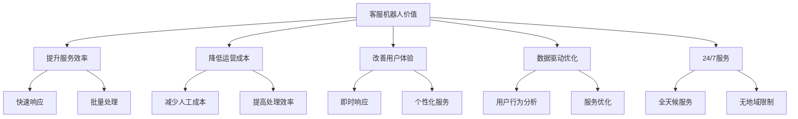
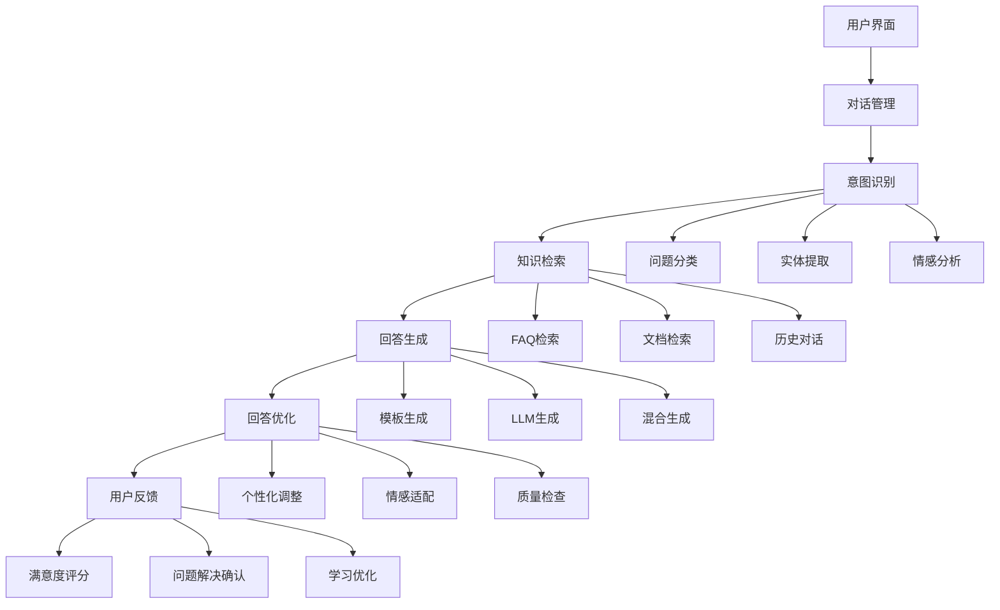

# 客服机器人

## 引言

客服机器人是基于RAG技术构建的智能客服系统，能够理解用户问题，从知识库中检索相关信息，生成准确、友好的回答。本文将深入探讨客服机器人的实现原理、技术架构和实际应用。

## 客服机器人概述

### 什么是客服机器人

客服机器人是一种基于RAG技术的智能客服系统，它能够：
- 理解用户的自然语言问题
- 从知识库中检索相关信息
- 生成准确、友好的回答
- 处理多轮对话和上下文理解
- 提供个性化服务

### 客服机器人的价值



## 系统架构设计

### 1. 整体架构



### 2. 核心组件实现

```python
class CustomerServiceBot:
    def __init__(self):
        self.dialog_manager = DialogManager()
        self.intent_classifier = IntentClassifier()
        self.knowledge_retriever = KnowledgeRetriever()
        self.response_generator = ResponseGenerator()
        self.response_optimizer = ResponseOptimizer()
        self.feedback_collector = FeedbackCollector()
    
    def process_user_message(self, message: str, user_context: Dict[str, any]) -> Dict[str, any]:
        """处理用户消息"""
        try:
            # 1. 对话管理
            dialog_context = self.dialog_manager.update_context(message, user_context)
            
            # 2. 意图识别
            intent_result = self.intent_classifier.classify_intent(message, dialog_context)
            
            # 3. 知识检索
            knowledge_result = self.knowledge_retriever.retrieve_knowledge(intent_result, dialog_context)
            
            # 4. 回答生成
            response = self.response_generator.generate_response(intent_result, knowledge_result, dialog_context)
            
            # 5. 回答优化
            optimized_response = self.response_optimizer.optimize_response(response, user_context)
            
            # 6. 更新对话上下文
            self.dialog_manager.update_dialog_state(optimized_response, dialog_context)
            
            return {
                'response': optimized_response,
                'intent': intent_result,
                'knowledge_used': knowledge_result,
                'dialog_context': dialog_context
            }
            
        except Exception as e:
            return {'error': f'处理用户消息失败: {str(e)}'}


class DialogManager:
    def __init__(self):
        self.context_store = ContextStore()
        self.session_manager = SessionManager()
        self.turn_tracker = TurnTracker()
    
    def update_context(self, message: str, user_context: Dict[str, any]) -> Dict[str, any]:
        """更新对话上下文"""
        session_id = user_context.get('session_id')
        
        # 获取或创建会话
        session = self.session_manager.get_or_create_session(session_id)
        
        # 更新对话轮次
        self.turn_tracker.add_turn(session_id, message)
        
        # 构建对话上下文
        dialog_context = {
            'session_id': session_id,
            'user_id': user_context.get('user_id'),
            'current_message': message,
            'conversation_history': self.turn_tracker.get_history(session_id),
            'user_profile': self.context_store.get_user_profile(user_context.get('user_id')),
            'session_state': session.get_state()
        }
        
        return dialog_context
    
    def update_dialog_state(self, response: Dict[str, any], dialog_context: Dict[str, any]):
        """更新对话状态"""
        session_id = dialog_context['session_id']
        
        # 更新会话状态
        self.session_manager.update_session_state(session_id, {
            'last_response': response,
            'last_intent': response.get('intent'),
            'timestamp': time.time()
        })
        
        # 更新用户画像
        if response.get('intent'):
            self.context_store.update_user_profile(
                dialog_context['user_id'], 
                {'last_intent': response['intent']}
            )


class IntentClassifier:
    def __init__(self):
        self.intent_model = IntentModel()
        self.entity_extractor = EntityExtractor()
        self.sentiment_analyzer = SentimentAnalyzer()
        self.context_analyzer = ContextAnalyzer()
    
    def classify_intent(self, message: str, dialog_context: Dict[str, any]) -> Dict[str, any]:
        """分类用户意图"""
        # 基础意图分类
        base_intent = self.intent_model.predict(message)
        
        # 实体提取
        entities = self.entity_extractor.extract(message)
        
        # 情感分析
        sentiment = self.sentiment_analyzer.analyze(message)
        
        # 上下文分析
        context_intent = self.context_analyzer.analyze_context(dialog_context)
        
        # 综合意图判断
        final_intent = self._combine_intents(base_intent, context_intent, entities, sentiment)
        
        return {
            'intent': final_intent['intent'],
            'confidence': final_intent['confidence'],
            'entities': entities,
            'sentiment': sentiment,
            'context_factors': context_intent
        }
    
    def _combine_intents(self, base_intent: Dict[str, any], 
                        context_intent: Dict[str, any], 
                        entities: List[Dict[str, any]], 
                        sentiment: Dict[str, any]) -> Dict[str, any]:
        """综合意图判断"""
        # 基础意图权重
        base_weight = 0.6
        
        # 上下文意图权重
        context_weight = 0.3
        
        # 实体和情感权重
        entity_weight = 0.1
        
        # 计算综合得分
        final_score = (base_intent['confidence'] * base_weight + 
                      context_intent['confidence'] * context_weight + 
                      self._calculate_entity_score(entities) * entity_weight)
        
        return {
            'intent': base_intent['intent'],
            'confidence': final_score
        }
    
    def _calculate_entity_score(self, entities: List[Dict[str, any]]) -> float:
        """计算实体得分"""
        if not entities:
            return 0.5
        
        # 基于实体数量和类型计算得分
        entity_types = set(entity['type'] for entity in entities)
        return min(1.0, len(entity_types) * 0.2)


class KnowledgeRetriever:
    def __init__(self):
        self.faq_retriever = FAQRetriever()
        self.document_retriever = DocumentRetriever()
        self.history_retriever = HistoryRetriever()
        self.knowledge_fusion = KnowledgeFusion()
    
    def retrieve_knowledge(self, intent_result: Dict[str, any], 
                          dialog_context: Dict[str, any]) -> Dict[str, any]:
        """检索相关知识"""
        intent = intent_result['intent']
        entities = intent_result['entities']
        
        # FAQ检索
        faq_results = self.faq_retriever.retrieve(intent, entities)
        
        # 文档检索
        doc_results = self.document_retriever.retrieve(intent, entities)
        
        # 历史对话检索
        history_results = self.history_retriever.retrieve(intent, dialog_context)
        
        # 知识融合
        fused_knowledge = self.knowledge_fusion.fuse(faq_results, doc_results, history_results)
        
        return {
            'faq_results': faq_results,
            'document_results': doc_results,
            'history_results': history_results,
            'fused_knowledge': fused_knowledge
        }


class ResponseGenerator:
    def __init__(self):
        self.template_generator = TemplateGenerator()
        self.llm_generator = LLMGenerator()
        self.hybrid_generator = HybridGenerator()
        self.response_validator = ResponseValidator()
    
    def generate_response(self, intent_result: Dict[str, any], 
                         knowledge_result: Dict[str, any], 
                         dialog_context: Dict[str, any]) -> Dict[str, any]:
        """生成回答"""
        intent = intent_result['intent']
        knowledge = knowledge_result['fused_knowledge']
        
        # 选择生成策略
        generation_strategy = self._select_generation_strategy(intent, knowledge)
        
        if generation_strategy == 'template':
            response = self.template_generator.generate(intent, knowledge, dialog_context)
        elif generation_strategy == 'llm':
            response = self.llm_generator.generate(intent, knowledge, dialog_context)
        else:
            response = self.hybrid_generator.generate(intent, knowledge, dialog_context)
        
        # 验证回答质量
        validated_response = self.response_validator.validate(response, intent, knowledge)
        
        return validated_response
    
    def _select_generation_strategy(self, intent: str, knowledge: Dict[str, any]) -> str:
        """选择生成策略"""
        # 基于意图和知识质量选择策略
        if intent in ['greeting', 'farewell', 'thanks']:
            return 'template'
        elif knowledge.get('confidence', 0) > 0.8:
            return 'template'
        elif knowledge.get('complexity', 'low') == 'high':
            return 'llm'
        else:
            return 'hybrid'


class ResponseOptimizer:
    def __init__(self):
        self.personalization_engine = PersonalizationEngine()
        self.sentiment_adapter = SentimentAdapter()
        self.quality_checker = QualityChecker()
        self.tone_adjuster = ToneAdjuster()
    
    def optimize_response(self, response: Dict[str, any], 
                        user_context: Dict[str, any]) -> Dict[str, any]:
        """优化回答"""
        # 个性化调整
        personalized_response = self.personalization_engine.personalize(response, user_context)
        
        # 情感适配
        sentiment_adapted_response = self.sentiment_adapter.adapt(personalized_response, user_context)
        
        # 语调调整
        tone_adjusted_response = self.tone_adjuster.adjust(sentiment_adapted_response, user_context)
        
        # 质量检查
        final_response = self.quality_checker.check(tone_adjusted_response)
        
        return final_response


class FeedbackCollector:
    def __init__(self):
        self.feedback_store = FeedbackStore()
        self.satisfaction_analyzer = SatisfactionAnalyzer()
        self.improvement_engine = ImprovementEngine()
    
    def collect_feedback(self, response: Dict[str, any], 
                        user_feedback: Dict[str, any]) -> Dict[str, any]:
        """收集用户反馈"""
        # 存储反馈
        feedback_id = self.feedback_store.store(response, user_feedback)
        
        # 分析满意度
        satisfaction_score = self.satisfaction_analyzer.analyze(user_feedback)
        
        # 生成改进建议
        improvement_suggestions = self.improvement_engine.generate_suggestions(
            response, user_feedback, satisfaction_score
        )
        
        return {
            'feedback_id': feedback_id,
            'satisfaction_score': satisfaction_score,
            'improvement_suggestions': improvement_suggestions
        }
```

## 意图识别技术

### 1. 多维度意图分类

```python
class IntentModel:
    def __init__(self):
        self.intent_classifier = IntentClassifier()
        self.confidence_calculator = ConfidenceCalculator()
        self.intent_hierarchy = IntentHierarchy()
    
    def predict(self, message: str) -> Dict[str, any]:
        """预测用户意图"""
        # 基础分类
        base_prediction = self.intent_classifier.predict(message)
        
        # 计算置信度
        confidence = self.confidence_calculator.calculate(base_prediction, message)
        
        # 层次化意图
        hierarchical_intent = self.intent_hierarchy.get_hierarchical_intent(base_prediction)
        
        return {
            'intent': base_prediction['intent'],
            'confidence': confidence,
            'hierarchical_intent': hierarchical_intent,
            'sub_intents': base_prediction.get('sub_intents', [])
        }


class IntentClassifier:
    def __init__(self):
        self.intent_patterns = {
            'greeting': ['你好', 'hello', 'hi', '早上好', '下午好'],
            'farewell': ['再见', 'bye', 'goodbye', '拜拜'],
            'thanks': ['谢谢', 'thank you', 'thanks', '感谢'],
            'complaint': ['投诉', '不满', '问题', '错误', 'bug'],
            'inquiry': ['询问', '咨询', '问题', '怎么', '如何'],
            'order': ['订单', '购买', '下单', '支付'],
            'refund': ['退款', '退货', '取消', '撤销'],
            'technical': ['技术', '故障', '错误', '无法', '不能'],
            'account': ['账户', '登录', '密码', '注册', '个人信息']
        }
        self.intent_model = self._load_intent_model()
    
    def predict(self, message: str) -> Dict[str, any]:
        """预测意图"""
        # 基于规则的快速匹配
        rule_based_intent = self._rule_based_classification(message)
        
        # 基于模型的分类
        model_based_intent = self._model_based_classification(message)
        
        # 综合判断
        final_intent = self._combine_classifications(rule_based_intent, model_based_intent)
        
        return final_intent
    
    def _rule_based_classification(self, message: str) -> Dict[str, any]:
        """基于规则的分类"""
        message_lower = message.lower()
        
        for intent, patterns in self.intent_patterns.items():
            for pattern in patterns:
                if pattern in message_lower:
                    return {
                        'intent': intent,
                        'confidence': 0.8,
                        'method': 'rule_based'
                    }
        
        return {
            'intent': 'unknown',
            'confidence': 0.3,
            'method': 'rule_based'
        }
    
    def _model_based_classification(self, message: str) -> Dict[str, any]:
        """基于模型的分类"""
        # 这里应该使用训练好的意图分类模型
        # 简化实现
        return {
            'intent': 'inquiry',
            'confidence': 0.7,
            'method': 'model_based'
        }
    
    def _combine_classifications(self, rule_result: Dict[str, any], 
                                model_result: Dict[str, any]) -> Dict[str, any]:
        """综合分类结果"""
        # 规则结果权重
        rule_weight = 0.6
        
        # 模型结果权重
        model_weight = 0.4
        
        # 选择置信度更高的结果
        if rule_result['confidence'] > model_result['confidence']:
            return rule_result
        else:
            return model_result
    
    def _load_intent_model(self):
        """加载意图分类模型"""
        # 这里应该加载训练好的模型
        # 简化实现
        return None


class EntityExtractor:
    def __init__(self):
        self.entity_patterns = {
            'product': ['产品', '商品', 'item', 'product'],
            'order_id': [r'\d{10,}', r'订单号\s*[:：]\s*\d+'],
            'phone': [r'1[3-9]\d{9}', r'\d{3,4}-\d{7,8}'],
            'email': [r'[a-zA-Z0-9._%+-]+@[a-zA-Z0-9.-]+\.[a-zA-Z]{2,}'],
            'date': [r'\d{4}[-/]\d{1,2}[-/]\d{1,2}', r'今天', r'昨天', r'明天'],
            'amount': [r'\d+\.?\d*元', r'\d+\.?\d*块', r'\d+\.?\d*']
        }
    
    def extract(self, message: str) -> List[Dict[str, any]]:
        """提取实体"""
        entities = []
        
        for entity_type, patterns in self.entity_patterns.items():
            for pattern in patterns:
                matches = re.findall(pattern, message)
                for match in matches:
                    entities.append({
                        'type': entity_type,
                        'value': match,
                        'start': message.find(match),
                        'end': message.find(match) + len(match)
                    })
        
        return entities


class SentimentAnalyzer:
    def __init__(self):
        self.sentiment_model = self._load_sentiment_model()
        self.sentiment_keywords = {
            'positive': ['好', '棒', '满意', '喜欢', '推荐', '优秀'],
            'negative': ['差', '坏', '不满', '讨厌', '问题', '错误'],
            'neutral': ['一般', '还行', '普通', '正常']
        }
    
    def analyze(self, message: str) -> Dict[str, any]:
        """分析情感"""
        # 基于关键词的情感分析
        keyword_sentiment = self._keyword_based_analysis(message)
        
        # 基于模型的情感分析
        model_sentiment = self._model_based_analysis(message)
        
        # 综合情感判断
        final_sentiment = self._combine_sentiments(keyword_sentiment, model_sentiment)
        
        return final_sentiment
    
    def _keyword_based_analysis(self, message: str) -> Dict[str, any]:
        """基于关键词的情感分析"""
        message_lower = message.lower()
        
        positive_count = sum(1 for word in self.sentiment_keywords['positive'] if word in message_lower)
        negative_count = sum(1 for word in self.sentiment_keywords['negative'] if word in message_lower)
        
        if positive_count > negative_count:
            return {'sentiment': 'positive', 'confidence': 0.7}
        elif negative_count > positive_count:
            return {'sentiment': 'negative', 'confidence': 0.7}
        else:
            return {'sentiment': 'neutral', 'confidence': 0.5}
    
    def _model_based_analysis(self, message: str) -> Dict[str, any]:
        """基于模型的情感分析"""
        # 这里应该使用训练好的情感分析模型
        # 简化实现
        return {'sentiment': 'neutral', 'confidence': 0.6}
    
    def _combine_sentiments(self, keyword_result: Dict[str, any], 
                           model_result: Dict[str, any]) -> Dict[str, any]:
        """综合情感判断"""
        # 关键词权重
        keyword_weight = 0.6
        
        # 模型权重
        model_weight = 0.4
        
        # 选择置信度更高的结果
        if keyword_result['confidence'] > model_result['confidence']:
            return keyword_result
        else:
            return model_result
    
    def _load_sentiment_model(self):
        """加载情感分析模型"""
        # 这里应该加载训练好的模型
        # 简化实现
        return None


class ContextAnalyzer:
    def __init__(self):
        self.context_extractor = ContextExtractor()
        self.history_analyzer = HistoryAnalyzer()
        self.session_analyzer = SessionAnalyzer()
    
    def analyze_context(self, dialog_context: Dict[str, any]) -> Dict[str, any]:
        """分析对话上下文"""
        # 提取上下文特征
        context_features = self.context_extractor.extract_features(dialog_context)
        
        # 分析历史对话
        history_analysis = self.history_analyzer.analyze(dialog_context.get('conversation_history', []))
        
        # 分析会话状态
        session_analysis = self.session_analyzer.analyze(dialog_context.get('session_state', {}))
        
        # 综合上下文分析
        context_intent = self._combine_context_analysis(context_features, history_analysis, session_analysis)
        
        return context_intent
    
    def _combine_context_analysis(self, context_features: Dict[str, any], 
                                history_analysis: Dict[str, any], 
                                session_analysis: Dict[str, any]) -> Dict[str, any]:
        """综合上下文分析"""
        # 基于历史对话的意图推断
        if history_analysis.get('last_intent') == 'inquiry':
            return {
                'intent': 'follow_up',
                'confidence': 0.8,
                'context_factors': ['history_intent']
            }
        
        # 基于会话状态的意图推断
        if session_analysis.get('user_state') == 'frustrated':
            return {
                'intent': 'complaint',
                'confidence': 0.7,
                'context_factors': ['user_state']
            }
        
        return {
            'intent': 'unknown',
            'confidence': 0.5,
            'context_factors': []
        }
```

## 知识检索技术

### 1. FAQ检索

```python
class FAQRetriever:
    def __init__(self):
        self.faq_index = FAQIndex()
        self.similarity_calculator = SimilarityCalculator()
        self.faq_ranker = FAQRanker()
    
    def retrieve(self, intent: str, entities: List[Dict[str, any]]) -> List[Dict[str, any]]:
        """检索FAQ"""
        # 基于意图检索
        intent_results = self.faq_index.search_by_intent(intent)
        
        # 基于实体检索
        entity_results = self.faq_index.search_by_entities(entities)
        
        # 基于相似度检索
        similarity_results = self.faq_index.search_by_similarity(intent)
        
        # 合并结果
        all_results = intent_results + entity_results + similarity_results
        
        # 排序
        ranked_results = self.faq_ranker.rank(all_results, intent, entities)
        
        return ranked_results[:5]  # 返回前5个结果


class FAQIndex:
    def __init__(self):
        self.intent_index = {}
        self.entity_index = {}
        self.vector_index = VectorIndex()
        self.faq_database = FAQDatabase()
    
    def search_by_intent(self, intent: str) -> List[Dict[str, any]]:
        """基于意图搜索"""
        if intent in self.intent_index:
            return self.intent_index[intent]
        return []
    
    def search_by_entities(self, entities: List[Dict[str, any]]) -> List[Dict[str, any]]:
        """基于实体搜索"""
        results = []
        for entity in entities:
            entity_type = entity['type']
            if entity_type in self.entity_index:
                results.extend(self.entity_index[entity_type])
        return results
    
    def search_by_similarity(self, query: str) -> List[Dict[str, any]]:
        """基于相似度搜索"""
        query_vector = self.vector_index.vectorize(query)
        return self.vector_index.search(query_vector, top_k=5)
    
    def add_faq(self, faq: Dict[str, any]):
        """添加FAQ"""
        # 建立意图索引
        intent = faq['intent']
        if intent not in self.intent_index:
            self.intent_index[intent] = []
        self.intent_index[intent].append(faq)
        
        # 建立实体索引
        for entity in faq.get('entities', []):
            entity_type = entity['type']
            if entity_type not in self.entity_index:
                self.entity_index[entity_type] = []
            self.entity_index[entity_type].append(faq)
        
        # 建立向量索引
        self.vector_index.add(faq['id'], faq['question'], faq)


class DocumentRetriever:
    def __init__(self):
        self.document_index = DocumentIndex()
        self.document_ranker = DocumentRanker()
        self.document_filter = DocumentFilter()
    
    def retrieve(self, intent: str, entities: List[Dict[str, any]]) -> List[Dict[str, any]]:
        """检索文档"""
        # 基于意图检索
        intent_results = self.document_index.search_by_intent(intent)
        
        # 基于实体检索
        entity_results = self.document_index.search_by_entities(entities)
        
        # 过滤结果
        filtered_results = self.document_filter.filter(intent_results + entity_results, intent)
        
        # 排序
        ranked_results = self.document_ranker.rank(filtered_results, intent, entities)
        
        return ranked_results[:3]  # 返回前3个结果


class HistoryRetriever:
    def __init__(self):
        self.history_index = HistoryIndex()
        self.history_ranker = HistoryRanker()
    
    def retrieve(self, intent: str, dialog_context: Dict[str, any]) -> List[Dict[str, any]]:
        """检索历史对话"""
        user_id = dialog_context.get('user_id')
        session_id = dialog_context.get('session_id')
        
        # 检索用户历史对话
        user_history = self.history_index.get_user_history(user_id, intent)
        
        # 检索相似会话
        similar_sessions = self.history_index.get_similar_sessions(session_id, intent)
        
        # 合并结果
        all_results = user_history + similar_sessions
        
        # 排序
        ranked_results = self.history_ranker.rank(all_results, intent, dialog_context)
        
        return ranked_results[:2]  # 返回前2个结果


class KnowledgeFusion:
    def __init__(self):
        self.fusion_strategies = {
            'weighted': WeightedFusion(),
            'voting': VotingFusion(),
            'hybrid': HybridFusion()
        }
    
    def fuse(self, faq_results: List[Dict[str, any]], 
             doc_results: List[Dict[str, any]], 
             history_results: List[Dict[str, any]]) -> Dict[str, any]:
        """融合知识"""
        # 选择融合策略
        fusion_strategy = self._select_fusion_strategy(faq_results, doc_results, history_results)
        
        # 执行融合
        fused_knowledge = self.fusion_strategies[fusion_strategy].fuse(
            faq_results, doc_results, history_results
        )
        
        return fused_knowledge
    
    def _select_fusion_strategy(self, faq_results: List[Dict[str, any]], 
                               doc_results: List[Dict[str, any]], 
                               history_results: List[Dict[str, any]]) -> str:
        """选择融合策略"""
        # 基于结果质量选择策略
        if len(faq_results) > 0 and faq_results[0].get('confidence', 0) > 0.8:
            return 'weighted'
        elif len(doc_results) > 0 and doc_results[0].get('confidence', 0) > 0.7:
            return 'voting'
        else:
            return 'hybrid'


class WeightedFusion:
    def fuse(self, faq_results: List[Dict[str, any]], 
             doc_results: List[Dict[str, any]], 
             history_results: List[Dict[str, any]]) -> Dict[str, any]:
        """加权融合"""
        # FAQ权重
        faq_weight = 0.5
        
        # 文档权重
        doc_weight = 0.3
        
        # 历史权重
        history_weight = 0.2
        
        # 计算加权得分
        weighted_score = 0
        if faq_results:
            weighted_score += faq_results[0]['confidence'] * faq_weight
        if doc_results:
            weighted_score += doc_results[0]['confidence'] * doc_weight
        if history_results:
            weighted_score += history_results[0]['confidence'] * history_weight
        
        return {
            'confidence': weighted_score,
            'source': 'weighted_fusion',
            'faq_results': faq_results,
            'doc_results': doc_results,
            'history_results': history_results
        }


class VotingFusion:
    def fuse(self, faq_results: List[Dict[str, any]], 
             doc_results: List[Dict[str, any]], 
             history_results: List[Dict[str, any]]) -> Dict[str, any]:
        """投票融合"""
        # 统计各来源的投票
        votes = {}
        
        if faq_results:
            votes['faq'] = faq_results[0]['confidence']
        if doc_results:
            votes['doc'] = doc_results[0]['confidence']
        if history_results:
            votes['history'] = history_results[0]['confidence']
        
        # 选择得票最高的来源
        best_source = max(votes, key=votes.get) if votes else 'unknown'
        
        return {
            'confidence': votes.get(best_source, 0),
            'source': best_source,
            'faq_results': faq_results,
            'doc_results': doc_results,
            'history_results': history_results
        }


class HybridFusion:
    def fuse(self, faq_results: List[Dict[str, any]], 
             doc_results: List[Dict[str, any]], 
             history_results: List[Dict[str, any]]) -> Dict[str, any]:
        """混合融合"""
        # 综合考虑所有来源
        all_results = faq_results + doc_results + history_results
        
        # 计算平均置信度
        avg_confidence = sum(result.get('confidence', 0) for result in all_results) / len(all_results) if all_results else 0
        
        return {
            'confidence': avg_confidence,
            'source': 'hybrid_fusion',
            'faq_results': faq_results,
            'doc_results': doc_results,
            'history_results': history_results
        }
```

## 回答生成技术

### 1. 模板生成

```python
class TemplateGenerator:
    def __init__(self):
        self.template_store = TemplateStore()
        self.template_engine = TemplateEngine()
        self.template_matcher = TemplateMatcher()
    
    def generate(self, intent: str, knowledge: Dict[str, any], 
                dialog_context: Dict[str, any]) -> Dict[str, any]:
        """生成模板回答"""
        # 选择模板
        template = self.template_matcher.match_template(intent, knowledge, dialog_context)
        
        if not template:
            return self._generate_fallback_response(intent, knowledge)
        
        # 填充模板
        filled_template = self.template_engine.fill_template(template, knowledge, dialog_context)
        
        return {
            'response': filled_template,
            'confidence': template.get('confidence', 0.8),
            'source': 'template',
            'template_id': template.get('id')
        }
    
    def _generate_fallback_response(self, intent: str, knowledge: Dict[str, any]) -> Dict[str, any]:
        """生成备用回答"""
        fallback_responses = {
            'greeting': '您好！我是客服助手，很高兴为您服务！',
            'farewell': '感谢您的咨询，祝您生活愉快！',
            'thanks': '不客气，很高兴能帮助到您！',
            'unknown': '抱歉，我没有完全理解您的问题，请稍等，我为您转接人工客服。'
        }
        
        response = fallback_responses.get(intent, fallback_responses['unknown'])
        
        return {
            'response': response,
            'confidence': 0.5,
            'source': 'fallback'
        }


class TemplateStore:
    def __init__(self):
        self.templates = {
            'greeting': [
                {
                    'id': 'greeting_1',
                    'template': '您好！我是{assistant_name}，很高兴为您服务！有什么可以帮助您的吗？',
                    'confidence': 0.9,
                    'conditions': ['first_interaction']
                }
            ],
            'inquiry': [
                {
                    'id': 'inquiry_1',
                    'template': '关于您的问题"{question}"，我的回答是：{answer}',
                    'confidence': 0.8,
                    'conditions': ['has_answer']
                }
            ],
            'complaint': [
                {
                    'id': 'complaint_1',
                    'template': '非常抱歉给您带来了不便。关于您反映的问题，我们会认真处理。{solution}',
                    'confidence': 0.7,
                    'conditions': ['has_solution']
                }
            ]
        }
    
    def get_templates(self, intent: str) -> List[Dict[str, any]]:
        """获取模板"""
        return self.templates.get(intent, [])


class TemplateEngine:
    def fill_template(self, template: Dict[str, any], 
                     knowledge: Dict[str, any], 
                     dialog_context: Dict[str, any]) -> str:
        """填充模板"""
        template_str = template['template']
        
        # 替换占位符
        replacements = {
            '{assistant_name}': '智能客服',
            '{question}': dialog_context.get('current_message', ''),
            '{answer}': knowledge.get('answer', ''),
            '{solution}': knowledge.get('solution', '')
        }
        
        for placeholder, value in replacements.items():
            template_str = template_str.replace(placeholder, str(value))
        
        return template_str


class TemplateMatcher:
    def match_template(self, intent: str, knowledge: Dict[str, any], 
                      dialog_context: Dict[str, any]) -> Dict[str, any]:
        """匹配模板"""
        template_store = TemplateStore()
        templates = template_store.get_templates(intent)
        
        if not templates:
            return None
        
        # 选择最佳模板
        best_template = None
        best_score = 0
        
        for template in templates:
            score = self._calculate_template_score(template, knowledge, dialog_context)
            if score > best_score:
                best_score = score
                best_template = template
        
        return best_template
    
    def _calculate_template_score(self, template: Dict[str, any], 
                                 knowledge: Dict[str, any], 
                                 dialog_context: Dict[str, any]) -> float:
        """计算模板得分"""
        score = template.get('confidence', 0)
        
        # 检查条件
        conditions = template.get('conditions', [])
        for condition in conditions:
            if self._check_condition(condition, knowledge, dialog_context):
                score += 0.1
        
        return score
    
    def _check_condition(self, condition: str, knowledge: Dict[str, any], 
                        dialog_context: Dict[str, any]) -> bool:
        """检查条件"""
        if condition == 'first_interaction':
            return len(dialog_context.get('conversation_history', [])) == 0
        elif condition == 'has_answer':
            return knowledge.get('answer') is not None
        elif condition == 'has_solution':
            return knowledge.get('solution') is not None
        
        return False
```

### 2. LLM生成

```python
class LLMGenerator:
    def __init__(self):
        self.llm_client = LLMClient()
        self.prompt_builder = PromptBuilder()
        self.response_processor = ResponseProcessor()
    
    def generate(self, intent: str, knowledge: Dict[str, any], 
                dialog_context: Dict[str, any]) -> Dict[str, any]:
        """生成LLM回答"""
        # 构建提示
        prompt = self.prompt_builder.build_prompt(intent, knowledge, dialog_context)
        
        # 调用LLM
        llm_response = self.llm_client.generate(prompt)
        
        # 处理回答
        processed_response = self.response_processor.process(llm_response, intent, knowledge)
        
        return {
            'response': processed_response,
            'confidence': llm_response.get('confidence', 0.7),
            'source': 'llm',
            'raw_response': llm_response.get('text', '')
        }


class PromptBuilder:
    def build_prompt(self, intent: str, knowledge: Dict[str, any], 
                    dialog_context: Dict[str, any]) -> str:
        """构建提示"""
        prompt_parts = []
        
        # 添加角色定义
        prompt_parts.append("你是一个专业的客服助手，请根据用户的问题提供准确、友好的回答。")
        
        # 添加上下文信息
        prompt_parts.append(f"用户问题: {dialog_context.get('current_message', '')}")
        
        # 添加知识信息
        if knowledge.get('faq_results'):
            prompt_parts.append("相关FAQ:")
            for faq in knowledge['faq_results'][:2]:
                prompt_parts.append(f"Q: {faq['question']}")
                prompt_parts.append(f"A: {faq['answer']}")
        
        if knowledge.get('document_results'):
            prompt_parts.append("相关文档:")
            for doc in knowledge['document_results'][:2]:
                prompt_parts.append(f"内容: {doc['content']}")
        
        # 添加回答要求
        prompt_parts.append("请基于以上信息生成一个准确、友好的回答。")
        
        return "\n".join(prompt_parts)


class ResponseProcessor:
    def process(self, llm_response: Dict[str, any], intent: str, 
               knowledge: Dict[str, any]) -> str:
        """处理LLM回答"""
        raw_text = llm_response.get('text', '')
        
        # 清理回答
        cleaned_text = self._clean_response(raw_text)
        
        # 验证回答质量
        if self._validate_response(cleaned_text, intent, knowledge):
            return cleaned_text
        else:
            return self._generate_fallback_response(intent, knowledge)
    
    def _clean_response(self, text: str) -> str:
        """清理回答"""
        # 移除多余的空白
        cleaned = ' '.join(text.split())
        
        # 移除不合适的表达
        inappropriate_expressions = ['抱歉，我无法', '我不能', '我不确定']
        for expr in inappropriate_expressions:
            if expr in cleaned:
                cleaned = cleaned.replace(expr, '让我为您查询一下')
        
        return cleaned
    
    def _validate_response(self, response: str, intent: str, 
                          knowledge: Dict[str, any]) -> bool:
        """验证回答质量"""
        # 检查回答长度
        if len(response) < 10 or len(response) > 500:
            return False
        
        # 检查回答相关性
        if not self._check_relevance(response, intent, knowledge):
            return False
        
        return True
    
    def _check_relevance(self, response: str, intent: str, 
                        knowledge: Dict[str, any]) -> bool:
        """检查回答相关性"""
        # 简化的相关性检查
        if intent == 'inquiry' and knowledge.get('answer'):
            return knowledge['answer'] in response
        
        return True
    
    def _generate_fallback_response(self, intent: str, knowledge: Dict[str, any]) -> str:
        """生成备用回答"""
        fallback_responses = {
            'inquiry': '让我为您查询相关信息，请稍等。',
            'complaint': '非常抱歉给您带来了不便，我们会认真处理您的问题。',
            'unknown': '抱歉，我没有完全理解您的问题，请稍等，我为您转接人工客服。'
        }
        
        return fallback_responses.get(intent, fallback_responses['unknown'])
```

## 最佳实践

### 1. 实现建议

```python
def get_customer_service_bot_recommendations(domain_context: dict) -> List[str]:
    """获取客服机器人实现建议"""
    recommendations = []
    
    # 基于行业领域提供建议
    if domain_context.get('industry') == 'ecommerce':
        recommendations.extend([
            '重点关注订单、支付、物流相关问题',
            '集成电商平台API',
            '提供商品推荐功能'
        ])
    elif domain_context.get('industry') == 'finance':
        recommendations.extend([
            '重点关注账户、交易、风控相关问题',
            '加强安全验证',
            '提供投资建议功能'
        ])
    elif domain_context.get('industry') == 'education':
        recommendations.extend([
            '重点关注课程、学习、考试相关问题',
            '提供个性化学习建议',
            '集成学习管理系统'
        ])
    
    # 基于用户规模提供建议
    if domain_context.get('user_scale') == 'large':
        recommendations.extend([
            '实施多级客服体系',
            '建立知识库管理系统',
            '提供多语言支持'
        ])
    else:
        recommendations.extend([
            '重点关注核心问题处理',
            '简化配置和维护',
            '提供快速部署方案'
        ])
    
    return recommendations
```

### 2. 性能优化

```python
class CustomerServiceBotOptimizer:
    def __init__(self):
        self.cache_optimizer = CacheOptimizer()
        self.model_optimizer = ModelOptimizer()
        self.knowledge_optimizer = KnowledgeOptimizer()
    
    def optimize_performance(self, bot: CustomerServiceBot) -> Dict[str, any]:
        """优化客服机器人性能"""
        optimizations = {}
        
        # 缓存优化
        cache_optimization = self.cache_optimizer.optimize_cache(bot)
        optimizations['cache'] = cache_optimization
        
        # 模型优化
        model_optimization = self.model_optimizer.optimize_model(bot.intent_classifier.intent_model)
        optimizations['model'] = model_optimization
        
        # 知识库优化
        knowledge_optimization = self.knowledge_optimizer.optimize_knowledge(bot.knowledge_retriever)
        optimizations['knowledge'] = knowledge_optimization
        
        return optimizations


class CacheOptimizer:
    def optimize_cache(self, bot: CustomerServiceBot) -> Dict[str, any]:
        """优化缓存"""
        return {
            'intent_cache': '启用意图识别缓存',
            'knowledge_cache': '启用知识检索缓存',
            'response_cache': '启用回答生成缓存'
        }


class ModelOptimizer:
    def optimize_model(self, intent_model) -> Dict[str, any]:
        """优化模型"""
        return {
            'model_quantization': '启用模型量化',
            'batch_processing': '启用批量处理',
            'model_caching': '启用模型缓存'
        }


class KnowledgeOptimizer:
    def optimize_knowledge(self, knowledge_retriever: KnowledgeRetriever) -> Dict[str, any]:
        """优化知识库"""
        return {
            'index_optimization': '优化知识索引',
            'retrieval_optimization': '优化检索算法',
            'knowledge_compression': '压缩知识表示'
        }
```

## 总结

客服机器人是RAG技术在客服领域的重要应用。本文介绍了客服机器人的实现原理、技术架构和核心组件，包括意图识别、知识检索、回答生成和回答优化等方面。

关键要点：
1. **意图识别**：通过多维度分析准确理解用户意图
2. **知识检索**：建立多源知识库，快速检索相关信息
3. **回答生成**：结合模板和LLM生成高质量回答
4. **回答优化**：通过个性化和情感适配提升用户体验
5. **性能优化**：通过缓存和模型优化提升响应速度

在下一篇文章中，我们将探讨文档智能分析，了解RAG技术在文档处理领域的应用。

---

**下一步学习建议：**
- 阅读《文档智能分析》，了解RAG技术在文档处理领域的应用
- 实践客服机器人的设计和实现
- 关注客服机器人技术的最新发展和创新方案
