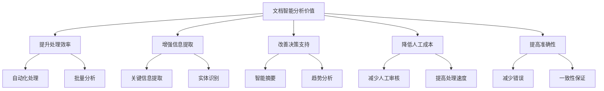
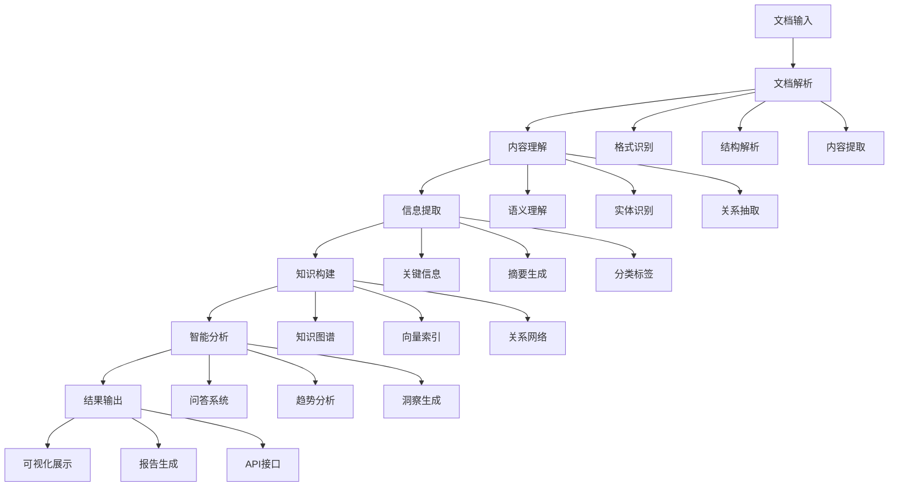

# 文档智能分析

## 引言

文档智能分析是基于RAG技术构建的智能文档处理系统，能够理解文档内容，提取关键信息，生成摘要和洞察。本文将深入探讨文档智能分析的实现原理、技术架构和实际应用。

## 文档智能分析概述

### 什么是文档智能分析

文档智能分析是一种基于RAG技术的智能文档处理系统，它能够：
- 理解文档的结构和内容
- 提取关键信息和实体
- 生成文档摘要和洞察
- 进行文档分类和标签化
- 提供智能问答和检索

### 文档智能分析的价值



## 系统架构设计

### 1. 整体架构



### 2. 核心组件实现

```python
class DocumentIntelligenceAnalyzer:
    def __init__(self):
        self.document_parser = DocumentParser()
        self.content_analyzer = ContentAnalyzer()
        self.information_extractor = InformationExtractor()
        self.knowledge_builder = KnowledgeBuilder()
        self.intelligence_analyzer = IntelligenceAnalyzer()
        self.result_generator = ResultGenerator()
    
    def analyze_document(self, document: Dict[str, any]) -> Dict[str, any]:
        """分析文档"""
        try:
            # 1. 文档解析
            parsed_document = self.document_parser.parse(document)
            
            # 2. 内容理解
            content_analysis = self.content_analyzer.analyze(parsed_document)
            
            # 3. 信息提取
            extracted_info = self.information_extractor.extract(content_analysis)
            
            # 4. 知识构建
            knowledge_graph = self.knowledge_builder.build(extracted_info)
            
            # 5. 智能分析
            intelligence_results = self.intelligence_analyzer.analyze(knowledge_graph, extracted_info)
            
            # 6. 结果生成
            final_results = self.result_generator.generate(intelligence_results, extracted_info)
            
            return {
                'analysis_results': final_results,
                'knowledge_graph': knowledge_graph,
                'extracted_info': extracted_info,
                'content_analysis': content_analysis
            }
            
        except Exception as e:
            return {'error': f'文档分析失败: {str(e)}'}


class DocumentParser:
    def __init__(self):
        self.format_detectors = {
            'pdf': PDFDetector(),
            'docx': DOCXDetector(),
            'html': HTMLDetector(),
            'txt': TXTDetector(),
            'markdown': MarkdownDetector()
        }
        self.structure_parsers = {
            'pdf': PDFStructureParser(),
            'docx': DOCXStructureParser(),
            'html': HTMLStructureParser(),
            'txt': TXTStructureParser(),
            'markdown': MarkdownStructureParser()
        }
        self.content_extractors = {
            'pdf': PDFContentExtractor(),
            'docx': DOCXContentExtractor(),
            'html': HTMLContentExtractor(),
            'txt': TXTContentExtractor(),
            'markdown': MarkdownContentExtractor()
        }
    
    def parse(self, document: Dict[str, any]) -> Dict[str, any]:
        """解析文档"""
        # 检测文档格式
        document_format = self._detect_format(document)
        
        # 解析文档结构
        structure = self._parse_structure(document, document_format)
        
        # 提取文档内容
        content = self._extract_content(document, document_format)
        
        return {
            'format': document_format,
            'structure': structure,
            'content': content,
            'metadata': document.get('metadata', {})
        }
    
    def _detect_format(self, document: Dict[str, any]) -> str:
        """检测文档格式"""
        file_path = document.get('file_path', '')
        file_extension = file_path.split('.')[-1].lower() if '.' in file_path else ''
        
        # 基于文件扩展名检测
        if file_extension in ['pdf']:
            return 'pdf'
        elif file_extension in ['docx', 'doc']:
            return 'docx'
        elif file_extension in ['html', 'htm']:
            return 'html'
        elif file_extension in ['txt']:
            return 'txt'
        elif file_extension in ['md', 'markdown']:
            return 'markdown'
        else:
            # 基于内容检测
            content = document.get('content', '')
            if content.startswith('%PDF'):
                return 'pdf'
            elif content.startswith('<html'):
                return 'html'
            elif content.startswith('#'):
                return 'markdown'
            else:
                return 'txt'
    
    def _parse_structure(self, document: Dict[str, any], format_type: str) -> Dict[str, any]:
        """解析文档结构"""
        parser = self.structure_parsers.get(format_type)
        if parser:
            return parser.parse(document)
        return {}
    
    def _extract_content(self, document: Dict[str, any], format_type: str) -> Dict[str, any]:
        """提取文档内容"""
        extractor = self.content_extractors.get(format_type)
        if extractor:
            return extractor.extract(document)
        return {}


class ContentAnalyzer:
    def __init__(self):
        self.semantic_analyzer = SemanticAnalyzer()
        self.entity_recognizer = EntityRecognizer()
        self.relation_extractor = RelationExtractor()
        self.topic_analyzer = TopicAnalyzer()
        self.sentiment_analyzer = SentimentAnalyzer()
    
    def analyze(self, parsed_document: Dict[str, any]) -> Dict[str, any]:
        """分析文档内容"""
        content = parsed_document.get('content', {})
        text_content = content.get('text', '')
        
        # 语义分析
        semantic_analysis = self.semantic_analyzer.analyze(text_content)
        
        # 实体识别
        entities = self.entity_recognizer.recognize(text_content)
        
        # 关系抽取
        relations = self.relation_extractor.extract(text_content, entities)
        
        # 主题分析
        topics = self.topic_analyzer.analyze(text_content)
        
        # 情感分析
        sentiment = self.sentiment_analyzer.analyze(text_content)
        
        return {
            'semantic_analysis': semantic_analysis,
            'entities': entities,
            'relations': relations,
            'topics': topics,
            'sentiment': sentiment,
            'text_content': text_content
        }


class InformationExtractor:
    def __init__(self):
        self.key_info_extractor = KeyInfoExtractor()
        self.summary_generator = SummaryGenerator()
        self.classifier = DocumentClassifier()
        self.tagger = DocumentTagger()
        self.insight_generator = InsightGenerator()
    
    def extract(self, content_analysis: Dict[str, any]) -> Dict[str, any]:
        """提取信息"""
        text_content = content_analysis.get('text_content', '')
        entities = content_analysis.get('entities', [])
        topics = content_analysis.get('topics', [])
        
        # 关键信息提取
        key_info = self.key_info_extractor.extract(text_content, entities)
        
        # 摘要生成
        summary = self.summary_generator.generate(text_content, topics)
        
        # 文档分类
        classification = self.classifier.classify(text_content, topics)
        
        # 标签生成
        tags = self.tagger.generate_tags(text_content, entities, topics)
        
        # 洞察生成
        insights = self.insight_generator.generate(key_info, entities, topics)
        
        return {
            'key_info': key_info,
            'summary': summary,
            'classification': classification,
            'tags': tags,
            'insights': insights
        }


class KnowledgeBuilder:
    def __init__(self):
        self.graph_builder = GraphBuilder()
        self.vector_indexer = VectorIndexer()
        self.relation_network = RelationNetwork()
        self.knowledge_fusion = KnowledgeFusion()
    
    def build(self, extracted_info: Dict[str, any]) -> Dict[str, any]:
        """构建知识图谱"""
        entities = extracted_info.get('entities', [])
        relations = extracted_info.get('relations', [])
        key_info = extracted_info.get('key_info', {})
        
        # 构建知识图谱
        knowledge_graph = self.graph_builder.build_graph(entities, relations)
        
        # 建立向量索引
        vector_index = self.vector_indexer.build_index(extracted_info)
        
        # 构建关系网络
        relation_network = self.relation_network.build_network(entities, relations)
        
        # 知识融合
        fused_knowledge = self.knowledge_fusion.fuse(knowledge_graph, vector_index, relation_network)
        
        return {
            'knowledge_graph': knowledge_graph,
            'vector_index': vector_index,
            'relation_network': relation_network,
            'fused_knowledge': fused_knowledge
        }


class IntelligenceAnalyzer:
    def __init__(self):
        self.qa_system = QASystem()
        self.trend_analyzer = TrendAnalyzer()
        self.insight_generator = InsightGenerator()
        self.pattern_detector = PatternDetector()
        self.anomaly_detector = AnomalyDetector()
    
    def analyze(self, knowledge_graph: Dict[str, any], 
               extracted_info: Dict[str, any]) -> Dict[str, any]:
        """智能分析"""
        # 问答系统
        qa_capabilities = self.qa_system.analyze_capabilities(knowledge_graph, extracted_info)
        
        # 趋势分析
        trends = self.trend_analyzer.analyze_trends(extracted_info)
        
        # 洞察生成
        insights = self.insight_generator.generate_insights(knowledge_graph, extracted_info)
        
        # 模式检测
        patterns = self.pattern_detector.detect_patterns(extracted_info)
        
        # 异常检测
        anomalies = self.anomaly_detector.detect_anomalies(extracted_info)
        
        return {
            'qa_capabilities': qa_capabilities,
            'trends': trends,
            'insights': insights,
            'patterns': patterns,
            'anomalies': anomalies
        }


class ResultGenerator:
    def __init__(self):
        self.visualization_generator = VisualizationGenerator()
        self.report_generator = ReportGenerator()
        self.api_generator = APIGenerator()
        self.export_generator = ExportGenerator()
    
    def generate(self, intelligence_results: Dict[str, any], 
                extracted_info: Dict[str, any]) -> Dict[str, any]:
        """生成结果"""
        # 可视化生成
        visualizations = self.visualization_generator.generate(intelligence_results, extracted_info)
        
        # 报告生成
        report = self.report_generator.generate(intelligence_results, extracted_info)
        
        # API生成
        api_endpoints = self.api_generator.generate(intelligence_results, extracted_info)
        
        # 导出生成
        exports = self.export_generator.generate(intelligence_results, extracted_info)
        
        return {
            'visualizations': visualizations,
            'report': report,
            'api_endpoints': api_endpoints,
            'exports': exports
        }
```

## 文档解析技术

### 1. 多格式文档解析

```python
class PDFDetector:
    def detect(self, document: Dict[str, any]) -> bool:
        """检测PDF格式"""
        content = document.get('content', '')
        return content.startswith('%PDF')


class PDFStructureParser:
    def parse(self, document: Dict[str, any]) -> Dict[str, any]:
        """解析PDF结构"""
        # 这里应该使用PDF解析库，如PyPDF2、pdfplumber等
        # 简化实现
        return {
            'pages': [],
            'sections': [],
            'tables': [],
            'images': []
        }


class PDFContentExtractor:
    def extract(self, document: Dict[str, any]) -> Dict[str, any]:
        """提取PDF内容"""
        # 这里应该使用PDF解析库提取文本内容
        # 简化实现
        return {
            'text': document.get('content', ''),
            'metadata': {},
            'structure': {}
        }


class DOCXDetector:
    def detect(self, document: Dict[str, any]) -> bool:
        """检测DOCX格式"""
        file_path = document.get('file_path', '')
        return file_path.endswith('.docx') or file_path.endswith('.doc')


class DOCXStructureParser:
    def parse(self, document: Dict[str, any]) -> Dict[str, any]:
        """解析DOCX结构"""
        # 这里应该使用python-docx库
        # 简化实现
        return {
            'paragraphs': [],
            'tables': [],
            'images': [],
            'headers': []
        }


class DOCXContentExtractor:
    def extract(self, document: Dict[str, any]) -> Dict[str, any]:
        """提取DOCX内容"""
        # 这里应该使用python-docx库提取内容
        # 简化实现
        return {
            'text': document.get('content', ''),
            'metadata': {},
            'structure': {}
        }


class HTMLDetector:
    def detect(self, document: Dict[str, any]) -> bool:
        """检测HTML格式"""
        content = document.get('content', '')
        return content.startswith('<html') or content.startswith('<!DOCTYPE html')


class HTMLStructureParser:
    def parse(self, document: Dict[str, any]) -> Dict[str, any]:
        """解析HTML结构"""
        # 这里应该使用BeautifulSoup库
        # 简化实现
        return {
            'head': {},
            'body': {},
            'sections': [],
            'links': []
        }


class HTMLContentExtractor:
    def extract(self, document: Dict[str, any]) -> Dict[str, any]:
        """提取HTML内容"""
        # 这里应该使用BeautifulSoup库提取内容
        # 简化实现
        return {
            'text': document.get('content', ''),
            'metadata': {},
            'structure': {}
        }


class TXTDetector:
    def detect(self, document: Dict[str, any]) -> bool:
        """检测TXT格式"""
        file_path = document.get('file_path', '')
        return file_path.endswith('.txt')


class TXTStructureParser:
    def parse(self, document: Dict[str, any]) -> Dict[str, any]:
        """解析TXT结构"""
        # 简化实现
        return {
            'lines': [],
            'paragraphs': []
        }


class TXTContentExtractor:
    def extract(self, document: Dict[str, any]) -> Dict[str, any]:
        """提取TXT内容"""
        return {
            'text': document.get('content', ''),
            'metadata': {},
            'structure': {}
        }


class MarkdownDetector:
    def detect(self, document: Dict[str, any]) -> bool:
        """检测Markdown格式"""
        content = document.get('content', '')
        return content.startswith('#') or 'markdown' in document.get('file_path', '').lower()


class MarkdownStructureParser:
    def parse(self, document: Dict[str, any]) -> Dict[str, any]:
        """解析Markdown结构"""
        # 这里应该使用markdown库
        # 简化实现
        return {
            'headers': [],
            'paragraphs': [],
            'lists': [],
            'code_blocks': []
        }


class MarkdownContentExtractor:
    def extract(self, document: Dict[str, any]) -> Dict[str, any]:
        """提取Markdown内容"""
        # 这里应该使用markdown库提取内容
        # 简化实现
        return {
            'text': document.get('content', ''),
            'metadata': {},
            'structure': {}
        }
```

### 2. 内容理解技术

```python
class SemanticAnalyzer:
    def __init__(self):
        self.semantic_model = SemanticModel()
        self.context_analyzer = ContextAnalyzer()
        self.coherence_analyzer = CoherenceAnalyzer()
    
    def analyze(self, text: str) -> Dict[str, any]:
        """语义分析"""
        # 语义理解
        semantic_understanding = self.semantic_model.understand(text)
        
        # 上下文分析
        context_analysis = self.context_analyzer.analyze(text)
        
        # 连贯性分析
        coherence_analysis = self.coherence_analyzer.analyze(text)
        
        return {
            'semantic_understanding': semantic_understanding,
            'context_analysis': context_analysis,
            'coherence_analysis': coherence_analysis
        }


class EntityRecognizer:
    def __init__(self):
        self.ner_model = NERModel()
        self.entity_types = {
            'PERSON': '人物',
            'ORG': '组织',
            'LOC': '地点',
            'DATE': '日期',
            'MONEY': '金额',
            'PERCENT': '百分比'
        }
    
    def recognize(self, text: str) -> List[Dict[str, any]]:
        """识别实体"""
        # 使用NER模型识别实体
        entities = self.ner_model.extract(text)
        
        # 后处理实体
        processed_entities = []
        for entity in entities:
            processed_entities.append({
                'text': entity['text'],
                'type': entity['type'],
                'start': entity['start'],
                'end': entity['end'],
                'confidence': entity['confidence']
            })
        
        return processed_entities


class RelationExtractor:
    def __init__(self):
        self.relation_model = RelationModel()
        self.relation_types = {
            'WORK_FOR': '工作于',
            'LOCATED_IN': '位于',
            'PART_OF': '属于',
            'CAUSED_BY': '由...引起',
            'RELATED_TO': '与...相关'
        }
    
    def extract(self, text: str, entities: List[Dict[str, any]]) -> List[Dict[str, any]]:
        """提取关系"""
        # 使用关系抽取模型
        relations = self.relation_model.extract(text, entities)
        
        # 后处理关系
        processed_relations = []
        for relation in relations:
            processed_relations.append({
                'head': relation['head'],
                'tail': relation['tail'],
                'relation': relation['relation'],
                'confidence': relation['confidence']
            })
        
        return processed_relations


class TopicAnalyzer:
    def __init__(self):
        self.topic_model = TopicModel()
        self.topic_extractor = TopicExtractor()
    
    def analyze(self, text: str) -> List[Dict[str, any]]:
        """分析主题"""
        # 主题建模
        topics = self.topic_model.extract_topics(text)
        
        # 主题提取
        extracted_topics = self.topic_extractor.extract(text)
        
        # 合并主题
        merged_topics = self._merge_topics(topics, extracted_topics)
        
        return merged_topics
    
    def _merge_topics(self, topics: List[Dict[str, any]], 
                     extracted_topics: List[Dict[str, any]]) -> List[Dict[str, any]]:
        """合并主题"""
        merged = []
        
        # 添加主题建模结果
        for topic in topics:
            merged.append({
                'topic': topic['topic'],
                'weight': topic['weight'],
                'keywords': topic['keywords'],
                'source': 'topic_modeling'
            })
        
        # 添加主题提取结果
        for topic in extracted_topics:
            merged.append({
                'topic': topic['topic'],
                'weight': topic['weight'],
                'keywords': topic['keywords'],
                'source': 'topic_extraction'
            })
        
        return merged


class SentimentAnalyzer:
    def __init__(self):
        self.sentiment_model = SentimentModel()
        self.emotion_analyzer = EmotionAnalyzer()
    
    def analyze(self, text: str) -> Dict[str, any]:
        """情感分析"""
        # 情感分析
        sentiment = self.sentiment_model.analyze(text)
        
        # 情感分析
        emotions = self.emotion_analyzer.analyze(text)
        
        return {
            'sentiment': sentiment,
            'emotions': emotions
        }
```

## 信息提取技术

### 1. 关键信息提取

```python
class KeyInfoExtractor:
    def __init__(self):
        self.keyword_extractor = KeywordExtractor()
        self.phrase_extractor = PhraseExtractor()
        self.concept_extractor = ConceptExtractor()
        self.fact_extractor = FactExtractor()
    
    def extract(self, text: str, entities: List[Dict[str, any]]) -> Dict[str, any]:
        """提取关键信息"""
        # 关键词提取
        keywords = self.keyword_extractor.extract(text)
        
        # 短语提取
        phrases = self.phrase_extractor.extract(text)
        
        # 概念提取
        concepts = self.concept_extractor.extract(text)
        
        # 事实提取
        facts = self.fact_extractor.extract(text, entities)
        
        return {
            'keywords': keywords,
            'phrases': phrases,
            'concepts': concepts,
            'facts': facts
        }


class KeywordExtractor:
    def __init__(self):
        self.tfidf_extractor = TFIDFExtractor()
        self.textrank_extractor = TextRankExtractor()
        self.yake_extractor = YAKExtractor()
    
    def extract(self, text: str) -> List[Dict[str, any]]:
        """提取关键词"""
        # TF-IDF提取
        tfidf_keywords = self.tfidf_extractor.extract(text)
        
        # TextRank提取
        textrank_keywords = self.textrank_extractor.extract(text)
        
        # YAKE提取
        yake_keywords = self.yake_extractor.extract(text)
        
        # 合并关键词
        merged_keywords = self._merge_keywords(tfidf_keywords, textrank_keywords, yake_keywords)
        
        return merged_keywords
    
    def _merge_keywords(self, tfidf_keywords: List[Dict[str, any]], 
                       textrank_keywords: List[Dict[str, any]], 
                       yake_keywords: List[Dict[str, any]]) -> List[Dict[str, any]]:
        """合并关键词"""
        keyword_scores = {}
        
        # 合并TF-IDF关键词
        for keyword in tfidf_keywords:
            word = keyword['word']
            if word not in keyword_scores:
                keyword_scores[word] = {'word': word, 'score': 0, 'sources': []}
            keyword_scores[word]['score'] += keyword['score'] * 0.4
            keyword_scores[word]['sources'].append('tfidf')
        
        # 合并TextRank关键词
        for keyword in textrank_keywords:
            word = keyword['word']
            if word not in keyword_scores:
                keyword_scores[word] = {'word': word, 'score': 0, 'sources': []}
            keyword_scores[word]['score'] += keyword['score'] * 0.3
            keyword_scores[word]['sources'].append('textrank')
        
        # 合并YAKE关键词
        for keyword in yake_keywords:
            word = keyword['word']
            if word not in keyword_scores:
                keyword_scores[word] = {'word': word, 'score': 0, 'sources': []}
            keyword_scores[word]['score'] += keyword['score'] * 0.3
            keyword_scores[word]['sources'].append('yake')
        
        # 排序并返回
        sorted_keywords = sorted(keyword_scores.values(), key=lambda x: x['score'], reverse=True)
        return sorted_keywords[:20]  # 返回前20个关键词


class SummaryGenerator:
    def __init__(self):
        self.extractive_summarizer = ExtractiveSummarizer()
        self.abstractive_summarizer = AbstractiveSummarizer()
        self.hybrid_summarizer = HybridSummarizer()
    
    def generate(self, text: str, topics: List[Dict[str, any]]) -> Dict[str, any]:
        """生成摘要"""
        # 提取式摘要
        extractive_summary = self.extractive_summarizer.summarize(text)
        
        # 生成式摘要
        abstractive_summary = self.abstractive_summarizer.summarize(text, topics)
        
        # 混合摘要
        hybrid_summary = self.hybrid_summarizer.summarize(text, topics)
        
        return {
            'extractive_summary': extractive_summary,
            'abstractive_summary': abstractive_summary,
            'hybrid_summary': hybrid_summary,
            'recommended_summary': self._select_best_summary(extractive_summary, abstractive_summary, hybrid_summary)
        }
    
    def _select_best_summary(self, extractive_summary: str, 
                           abstractive_summary: str, 
                           hybrid_summary: str) -> str:
        """选择最佳摘要"""
        # 基于长度和质量的简单选择策略
        summaries = [
            ('extractive', extractive_summary),
            ('abstractive', abstractive_summary),
            ('hybrid', hybrid_summary)
        ]
        
        # 选择长度适中的摘要
        best_summary = None
        best_score = 0
        
        for summary_type, summary in summaries:
            if summary:
                length_score = 1.0 - abs(len(summary) - 200) / 200  # 理想长度200字符
                quality_score = 0.8 if summary_type == 'hybrid' else 0.7
                total_score = length_score * 0.6 + quality_score * 0.4
                
                if total_score > best_score:
                    best_score = total_score
                    best_summary = summary
        
        return best_summary or extractive_summary


class DocumentClassifier:
    def __init__(self):
        self.classifier_model = ClassifierModel()
        self.category_definitions = {
            'technical': '技术文档',
            'business': '商业文档',
            'legal': '法律文档',
            'academic': '学术文档',
            'news': '新闻文档',
            'personal': '个人文档'
        }
    
    def classify(self, text: str, topics: List[Dict[str, any]]) -> Dict[str, any]:
        """文档分类"""
        # 基于文本分类
        text_classification = self.classifier_model.classify(text)
        
        # 基于主题分类
        topic_classification = self._classify_by_topics(topics)
        
        # 综合分类
        final_classification = self._combine_classifications(text_classification, topic_classification)
        
        return final_classification
    
    def _classify_by_topics(self, topics: List[Dict[str, any]]) -> Dict[str, any]:
        """基于主题分类"""
        topic_keywords = {
            'technical': ['技术', '开发', '编程', '代码', '算法'],
            'business': ['商业', '市场', '销售', '客户', '收入'],
            'legal': ['法律', '合同', '条款', '法规', '权利'],
            'academic': ['研究', '学术', '论文', '理论', '实验'],
            'news': ['新闻', '事件', '报道', '消息', '更新'],
            'personal': ['个人', '日记', '笔记', '想法', '感受']
        }
        
        category_scores = {}
        for category, keywords in topic_keywords.items():
            score = 0
            for topic in topics:
                for keyword in keywords:
                    if keyword in topic.get('topic', ''):
                        score += topic.get('weight', 0)
            category_scores[category] = score
        
        best_category = max(category_scores, key=category_scores.get) if category_scores else 'unknown'
        
        return {
            'category': best_category,
            'confidence': category_scores.get(best_category, 0),
            'category_scores': category_scores
        }
    
    def _combine_classifications(self, text_classification: Dict[str, any], 
                               topic_classification: Dict[str, any]) -> Dict[str, any]:
        """综合分类"""
        # 文本分类权重
        text_weight = 0.6
        
        # 主题分类权重
        topic_weight = 0.4
        
        # 选择置信度更高的分类
        if text_classification['confidence'] > topic_classification['confidence']:
            return text_classification
        else:
            return topic_classification


class DocumentTagger:
    def __init__(self):
        self.tag_generator = TagGenerator()
        self.tag_ranker = TagRanker()
        self.tag_filter = TagFilter()
    
    def generate_tags(self, text: str, entities: List[Dict[str, any]], 
                     topics: List[Dict[str, any]]) -> List[Dict[str, any]]:
        """生成标签"""
        # 基于文本生成标签
        text_tags = self.tag_generator.generate_from_text(text)
        
        # 基于实体生成标签
        entity_tags = self.tag_generator.generate_from_entities(entities)
        
        # 基于主题生成标签
        topic_tags = self.tag_generator.generate_from_topics(topics)
        
        # 合并标签
        all_tags = text_tags + entity_tags + topic_tags
        
        # 排序标签
        ranked_tags = self.tag_ranker.rank(all_tags)
        
        # 过滤标签
        filtered_tags = self.tag_filter.filter(ranked_tags)
        
        return filtered_tags[:10]  # 返回前10个标签


class InsightGenerator:
    def __init__(self):
        self.pattern_analyzer = PatternAnalyzer()
        self.trend_analyzer = TrendAnalyzer()
        self.anomaly_detector = AnomalyDetector()
        self.correlation_analyzer = CorrelationAnalyzer()
    
    def generate(self, key_info: Dict[str, any], entities: List[Dict[str, any]], 
                topics: List[Dict[str, any]]) -> List[Dict[str, any]]:
        """生成洞察"""
        insights = []
        
        # 模式分析
        patterns = self.pattern_analyzer.analyze(key_info, entities, topics)
        insights.extend(patterns)
        
        # 趋势分析
        trends = self.trend_analyzer.analyze(key_info, entities, topics)
        insights.extend(trends)
        
        # 异常检测
        anomalies = self.anomaly_detector.detect(key_info, entities, topics)
        insights.extend(anomalies)
        
        # 相关性分析
        correlations = self.correlation_analyzer.analyze(key_info, entities, topics)
        insights.extend(correlations)
        
        return insights
```

## 最佳实践

### 1. 实现建议

```python
def get_document_intelligence_recommendations(domain_context: dict) -> List[str]:
    """获取文档智能分析实现建议"""
    recommendations = []
    
    # 基于文档类型提供建议
    if domain_context.get('document_type') == 'legal':
        recommendations.extend([
            '重点关注法律条款和合同分析',
            '加强实体识别和关系抽取',
            '提供合规性检查功能'
        ])
    elif domain_context.get('document_type') == 'financial':
        recommendations.extend([
            '重点关注财务数据和风险分析',
            '加强数值实体识别',
            '提供风险评估功能'
        ])
    elif domain_context.get('document_type') == 'medical':
        recommendations.extend([
            '重点关注医疗实体和症状分析',
            '加强医学术语识别',
            '提供诊断辅助功能'
        ])
    
    # 基于处理规模提供建议
    if domain_context.get('scale') == 'large':
        recommendations.extend([
            '实施分布式处理架构',
            '建立文档索引系统',
            '提供批量处理功能'
        ])
    else:
        recommendations.extend([
            '重点关注处理质量',
            '简化配置和维护',
            '提供快速部署方案'
        ])
    
    return recommendations
```

### 2. 性能优化

```python
class DocumentIntelligenceOptimizer:
    def __init__(self):
        self.parser_optimizer = ParserOptimizer()
        self.model_optimizer = ModelOptimizer()
        self.index_optimizer = IndexOptimizer()
    
    def optimize_performance(self, analyzer: DocumentIntelligenceAnalyzer) -> Dict[str, any]:
        """优化文档智能分析性能"""
        optimizations = {}
        
        # 解析器优化
        parser_optimization = self.parser_optimizer.optimize_parser(analyzer.document_parser)
        optimizations['parser'] = parser_optimization
        
        # 模型优化
        model_optimization = self.model_optimizer.optimize_models(analyzer.content_analyzer)
        optimizations['models'] = model_optimization
        
        # 索引优化
        index_optimization = self.index_optimizer.optimize_index(analyzer.knowledge_builder)
        optimizations['index'] = index_optimization
        
        return optimizations


class ParserOptimizer:
    def optimize_parser(self, parser: DocumentParser) -> Dict[str, any]:
        """优化解析器"""
        return {
            'parallel_parsing': '启用并行解析',
            'caching': '启用解析缓存',
            'streaming': '启用流式解析'
        }


class ModelOptimizer:
    def optimize_models(self, analyzer: ContentAnalyzer) -> Dict[str, any]:
        """优化模型"""
        return {
            'model_quantization': '启用模型量化',
            'batch_processing': '启用批量处理',
            'model_caching': '启用模型缓存'
        }


class IndexOptimizer:
    def optimize_index(self, builder: KnowledgeBuilder) -> Dict[str, any]:
        """优化索引"""
        return {
            'index_compression': '启用索引压缩',
            'distributed_indexing': '启用分布式索引',
            'index_caching': '启用索引缓存'
        }
```

## 总结

文档智能分析是RAG技术在文档处理领域的重要应用。本文介绍了文档智能分析的实现原理、技术架构和核心组件，包括文档解析、内容理解、信息提取和智能分析等方面。

关键要点：
1. **文档解析**：支持多种格式的文档解析和内容提取
2. **内容理解**：通过语义分析和实体识别理解文档内容
3. **信息提取**：提取关键信息、生成摘要和分类标签
4. **智能分析**：构建知识图谱，提供问答和洞察功能
5. **性能优化**：通过并行处理和缓存优化提升处理效率

在下一篇文章中，我们将探讨LangChain实战，了解如何使用LangChain框架构建RAG应用。

---

**下一步学习建议：**
- 阅读《LangChain实战》，了解如何使用LangChain框架构建RAG应用
- 实践文档智能分析的设计和实现
- 关注文档智能分析技术的最新发展和创新方案
