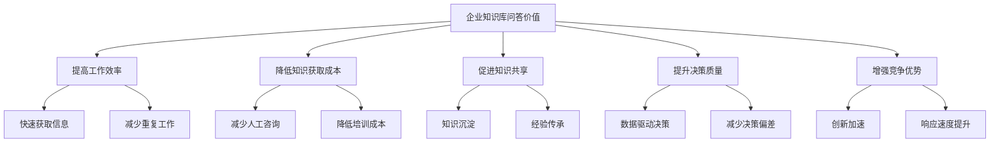
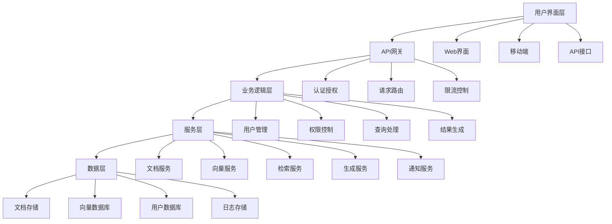

# 企业知识库问答

## 引言

企业知识库问答是RAG技术在企业中的典型应用场景。通过构建智能化的企业知识库问答系统，企业可以快速获取内部知识、提高员工工作效率、降低知识获取成本。本文将深入探讨企业知识库问答系统的设计、实现和优化，包括系统架构、技术选型、实施策略和最佳实践。

## 企业知识库问答概述

### 什么是企业知识库问答

企业知识库问答是指基于RAG技术构建的智能问答系统，能够理解员工的问题并从企业内部的文档、资料、流程等知识源中检索相关信息，生成准确、相关的回答。

### 企业知识库问答的价值



### 企业知识库问答的挑战

1. **数据多样性**：文档格式多样，内容结构复杂
2. **知识更新**：企业知识不断更新，需要实时同步
3. **权限控制**：不同部门、角色的访问权限管理
4. **准确性要求**：企业决策对准确性要求极高
5. **用户体验**：需要简单易用的交互界面

## 系统架构设计

### 1. 整体架构

#### 架构图



#### 实现示例

```python
class EnterpriseKnowledgeBaseSystem:
    def __init__(self):
        # 系统组件
        self.api_gateway = APIGateway()
        self.user_manager = UserManager()
        self.permission_manager = PermissionManager()
        self.document_service = DocumentService()
        self.vector_service = VectorService()
        self.retrieval_service = RetrievalService()
        self.generation_service = GenerationService()
        self.notification_service = NotificationService()
        
        # 初始化系统
        self._initialize_system()
    
    def _initialize_system(self):
        """初始化系统"""
        # 注册服务
        self.api_gateway.register_service('user', self.user_manager)
        self.api_gateway.register_service('document', self.document_service)
        self.api_gateway.register_service('vector', self.vector_service)
        self.api_gateway.register_service('retrieval', self.retrieval_service)
        self.api_gateway.register_service('generation', self.generation_service)
        self.api_gateway.register_service('notification', self.notification_service)
    
    def process_query(self, query: str, user_id: str, context: Dict[str, any] = None) -> Dict[str, any]:
        """处理查询"""
        try:
            # 1. 用户认证和权限检查
            auth_result = self.user_manager.authenticate_user(user_id)
            if not auth_result['authenticated']:
                return {'error': '用户认证失败'}
            
            # 2. 权限检查
            permission_result = self.permission_manager.check_query_permission(
                user_id, query, context
            )
            if not permission_result['allowed']:
                return {'error': '权限不足'}
            
            # 3. 检索相关文档
            retrieval_result = self.retrieval_service.retrieve_documents(
                query, user_id, context
            )
            
            # 4. 生成回答
            generation_result = self.generation_service.generate_answer(
                query, retrieval_result['documents'], user_id
            )
            
            # 5. 记录查询历史
            self.user_manager.record_query_history(user_id, query, generation_result['answer'])
            
            # 6. 发送通知（如果需要）
            if context and context.get('send_notification', False):
                self.notification_service.send_query_notification(
                    user_id, query, generation_result['answer']
                )
            
            return {
                'answer': generation_result['answer'],
                'relevant_documents': retrieval_result['documents'],
                'confidence': generation_result['confidence'],
                'sources': generation_result['sources'],
                'timestamp': time.time()
            }
            
        except Exception as e:
            return {'error': f'处理查询失败: {str(e)}'}
    
    def add_document(self, document: Dict[str, any], user_id: str) -> Dict[str, any]:
        """添加文档"""
        try:
            # 1. 权限检查
            permission_result = self.permission_manager.check_document_permission(
                user_id, 'add', document
            )
            if not permission_result['allowed']:
                return {'error': '权限不足'}
            
            # 2. 处理文档
            processed_doc = self.document_service.process_document(document)
            
            # 3. 向量化文档
            vector = self.vector_service.vectorize_document(processed_doc)
            
            # 4. 存储文档和向量
            doc_id = self.document_service.store_document(processed_doc)
            self.vector_service.store_vector(doc_id, vector)
            
            # 5. 更新索引
            self.retrieval_service.update_index(doc_id, vector)
            
            return {'doc_id': doc_id, 'status': 'success'}
            
        except Exception as e:
            return {'error': f'添加文档失败: {str(e)}'}
    
    def update_document(self, doc_id: str, document: Dict[str, any], user_id: str) -> Dict[str, any]:
        """更新文档"""
        try:
            # 1. 权限检查
            permission_result = self.permission_manager.check_document_permission(
                user_id, 'update', {'doc_id': doc_id, **document}
            )
            if not permission_result['allowed']:
                return {'error': '权限不足'}
            
            # 2. 处理文档
            processed_doc = self.document_service.process_document(document)
            
            # 3. 向量化文档
            vector = self.vector_service.vectorize_document(processed_doc)
            
            # 4. 更新文档和向量
            self.document_service.update_document(doc_id, processed_doc)
            self.vector_service.update_vector(doc_id, vector)
            
            # 5. 更新索引
            self.retrieval_service.update_index(doc_id, vector)
            
            return {'status': 'success'}
            
        except Exception as e:
            return {'error': f'更新文档失败: {str(e)}'}
    
    def delete_document(self, doc_id: str, user_id: str) -> Dict[str, any]:
        """删除文档"""
        try:
            # 1. 权限检查
            permission_result = self.permission_manager.check_document_permission(
                user_id, 'delete', {'doc_id': doc_id}
            )
            if not permission_result['allowed']:
                return {'error': '权限不足'}
            
            # 2. 删除文档和向量
            self.document_service.delete_document(doc_id)
            self.vector_service.delete_vector(doc_id)
            
            # 3. 更新索引
            self.retrieval_service.delete_from_index(doc_id)
            
            return {'status': 'success'}
            
        except Exception as e:
            return {'error': f'删除文档失败: {str(e)}'}


class APIGateway:
    def __init__(self):
        self.services = {}
        self.middleware = []
        self.rate_limiter = RateLimiter()
    
    def register_service(self, name: str, service):
        """注册服务"""
        self.services[name] = service
    
    def add_middleware(self, middleware):
        """添加中间件"""
        self.middleware.append(middleware)
    
    def handle_request(self, request: Dict[str, any]) -> Dict[str, any]:
        """处理请求"""
        try:
            # 应用中间件
            for middleware in self.middleware:
                request = middleware.process_request(request)
            
            # 限流检查
            if not self.rate_limiter.allow_request(request):
                return {'error': '请求频率过高'}
            
            # 路由到相应服务
            service_name = request.get('service')
            if service_name in self.services:
                service = self.services[service_name]
                response = service.handle_request(request)
            else:
                response = {'error': f'服务 {service_name} 不存在'}
            
            # 应用响应中间件
            for middleware in reversed(self.middleware):
                response = middleware.process_response(response)
            
            return response
            
        except Exception as e:
            return {'error': f'处理请求失败: {str(e)}'}


class UserManager:
    def __init__(self):
        self.user_db = UserDatabase()
        self.auth_service = AuthService()
        self.session_manager = SessionManager()
    
    def authenticate_user(self, user_id: str) -> Dict[str, any]:
        """用户认证"""
        try:
            # 检查用户是否存在
            user = self.user_db.get_user(user_id)
            if not user:
                return {'authenticated': False, 'error': '用户不存在'}
            
            # 检查用户状态
            if user['status'] != 'active':
                return {'authenticated': False, 'error': '用户状态异常'}
            
            # 验证会话
            session_valid = self.session_manager.validate_session(user_id)
            if not session_valid:
                return {'authenticated': False, 'error': '会话无效'}
            
            return {
                'authenticated': True,
                'user': user,
                'permissions': user.get('permissions', [])
            }
            
        except Exception as e:
            return {'authenticated': False, 'error': str(e)}
    
    def record_query_history(self, user_id: str, query: str, answer: str):
        """记录查询历史"""
        try:
            history_entry = {
                'user_id': user_id,
                'query': query,
                'answer': answer,
                'timestamp': time.time()
            }
            self.user_db.add_query_history(history_entry)
        except Exception as e:
            print(f"记录查询历史失败: {e}")
    
    def get_user_profile(self, user_id: str) -> Dict[str, any]:
        """获取用户档案"""
        try:
            user = self.user_db.get_user(user_id)
            if user:
                return {
                    'user_id': user['user_id'],
                    'name': user['name'],
                    'department': user['department'],
                    'role': user['role'],
                    'permissions': user.get('permissions', []),
                    'query_count': user.get('query_count', 0),
                    'last_login': user.get('last_login')
                }
            else:
                return {'error': '用户不存在'}
        except Exception as e:
            return {'error': str(e)}
    
    def handle_request(self, request: Dict[str, any]) -> Dict[str, any]:
        """处理请求"""
        action = request.get('action')
        
        if action == 'authenticate':
            user_id = request.get('user_id')
            return self.authenticate_user(user_id)
        elif action == 'get_profile':
            user_id = request.get('user_id')
            return self.get_user_profile(user_id)
        elif action == 'get_history':
            user_id = request.get('user_id')
            history = self.user_db.get_query_history(user_id)
            return {'history': history}
        else:
            return {'error': '未知操作'}


class PermissionManager:
    def __init__(self):
        self.permission_db = PermissionDatabase()
        self.role_manager = RoleManager()
    
    def check_query_permission(self, user_id: str, query: str, context: Dict[str, any] = None) -> Dict[str, any]:
        """检查查询权限"""
        try:
            # 获取用户角色和权限
            user_permissions = self.permission_db.get_user_permissions(user_id)
            
            # 检查基本查询权限
            if 'query' not in user_permissions:
                return {'allowed': False, 'reason': '无查询权限'}
            
            # 检查特定内容权限
            if context and 'department' in context:
                if context['department'] not in user_permissions.get('departments', []):
                    return {'allowed': False, 'reason': '无该部门内容访问权限'}
            
            # 检查敏感信息权限
            if self._contains_sensitive_info(query):
                if 'sensitive' not in user_permissions:
                    return {'allowed': False, 'reason': '无敏感信息访问权限'}
            
            return {'allowed': True}
            
        except Exception as e:
            return {'allowed': False, 'reason': str(e)}
    
    def check_document_permission(self, user_id: str, action: str, document: Dict[str, any]) -> Dict[str, any]:
        """检查文档权限"""
        try:
            # 获取用户权限
            user_permissions = self.permission_db.get_user_permissions(user_id)
            
            # 检查操作权限
            if action not in user_permissions:
                return {'allowed': False, 'reason': f'无{action}权限'}
            
            # 检查文档部门权限
            doc_department = document.get('department')
            if doc_department and doc_department not in user_permissions.get('departments', []):
                return {'allowed': False, 'reason': '无该部门文档操作权限'}
            
            # 检查文档级别权限
            doc_level = document.get('level', 'public')
            if doc_level == 'confidential' and 'confidential' not in user_permissions:
                return {'allowed': False, 'reason': '无机密文档操作权限'}
            
            return {'allowed': True}
            
        except Exception as e:
            return {'allowed': False, 'reason': str(e)}
    
    def _contains_sensitive_info(self, query: str) -> bool:
        """检查查询是否包含敏感信息"""
        sensitive_keywords = ['薪资', '工资', '人事', '财务', '机密', '内部']
        return any(keyword in query for keyword in sensitive_keywords)
    
    def handle_request(self, request: Dict[str, any]) -> Dict[str, any]:
        """处理请求"""
        action = request.get('action')
        
        if action == 'check_query_permission':
            user_id = request.get('user_id')
            query = request.get('query')
            context = request.get('context')
            return self.check_query_permission(user_id, query, context)
        elif action == 'check_document_permission':
            user_id = request.get('user_id')
            action_type = request.get('action_type')
            document = request.get('document')
            return self.check_document_permission(user_id, action_type, document)
        else:
            return {'error': '未知操作'}
```

### 2. 数据层设计

#### 数据模型

```python
class DocumentService:
    def __init__(self):
        self.document_db = DocumentDatabase()
        self.processor = DocumentProcessor()
        self.metadata_extractor = MetadataExtractor()
    
    def process_document(self, document: Dict[str, any]) -> Dict[str, any]:
        """处理文档"""
        try:
            # 提取元数据
            metadata = self.metadata_extractor.extract(document)
            
            # 处理文档内容
            processed_content = self.processor.process(document['content'], document['type'])
            
            # 生成文档ID
            doc_id = self._generate_document_id(document)
            
            return {
                'doc_id': doc_id,
                'title': document.get('title', ''),
                'content': processed_content,
                'type': document['type'],
                'department': document.get('department', ''),
                'level': document.get('level', 'public'),
                'metadata': metadata,
                'created_by': document.get('created_by', ''),
                'created_at': time.time(),
                'updated_at': time.time()
            }
            
        except Exception as e:
            raise Exception(f"文档处理失败: {str(e)}")
    
    def store_document(self, processed_doc: Dict[str, any]) -> str:
        """存储文档"""
        try:
            doc_id = self.document_db.store_document(processed_doc)
            return doc_id
        except Exception as e:
            raise Exception(f"文档存储失败: {str(e)}")
    
    def update_document(self, doc_id: str, processed_doc: Dict[str, any]):
        """更新文档"""
        try:
            processed_doc['updated_at'] = time.time()
            self.document_db.update_document(doc_id, processed_doc)
        except Exception as e:
            raise Exception(f"文档更新失败: {str(e)}")
    
    def delete_document(self, doc_id: str):
        """删除文档"""
        try:
            self.document_db.delete_document(doc_id)
        except Exception as e:
            raise Exception(f"文档删除失败: {str(e)}")
    
    def get_document(self, doc_id: str) -> Dict[str, any]:
        """获取文档"""
        try:
            return self.document_db.get_document(doc_id)
        except Exception as e:
            raise Exception(f"文档获取失败: {str(e)}")
    
    def search_documents(self, query: str, filters: Dict[str, any] = None) -> List[Dict[str, any]]:
        """搜索文档"""
        try:
            return self.document_db.search_documents(query, filters)
        except Exception as e:
            raise Exception(f"文档搜索失败: {str(e)}")
    
    def _generate_document_id(self, document: Dict[str, any]) -> str:
        """生成文档ID"""
        import hashlib
        content = f"{document['title']}_{document['content'][:100]}_{time.time()}"
        return hashlib.md5(content.encode()).hexdigest()


class DocumentProcessor:
    def __init__(self):
        self.processors = {
            'pdf': PDFProcessor(),
            'docx': DocxProcessor(),
            'txt': TextProcessor(),
            'html': HTMLProcessor(),
            'markdown': MarkdownProcessor()
        }
    
    def process(self, content: str, doc_type: str) -> str:
        """处理文档内容"""
        processor = self.processors.get(doc_type, self.processors['txt'])
        return processor.process(content)
    
    def extract_text(self, content: str, doc_type: str) -> str:
        """提取文本"""
        processor = self.processors.get(doc_type, self.processors['txt'])
        return processor.extract_text(content)
    
    def chunk_text(self, text: str, chunk_size: int = 1000, overlap: int = 200) -> List[str]:
        """分块文本"""
        chunks = []
        start = 0
        
        while start < len(text):
            end = start + chunk_size
            chunk = text[start:end]
            chunks.append(chunk)
            start = end - overlap
        
        return chunks


class PDFProcessor:
    def process(self, content: str) -> str:
        """处理PDF内容"""
        # 这里应该使用PDF解析库，如PyPDF2或pdfplumber
        # 简化实现，直接返回内容
        return content
    
    def extract_text(self, content: str) -> str:
        """提取PDF文本"""
        # 实现PDF文本提取
        return content


class DocxProcessor:
    def process(self, content: str) -> str:
        """处理DOCX内容"""
        # 这里应该使用python-docx库
        # 简化实现，直接返回内容
        return content
    
    def extract_text(self, content: str) -> str:
        """提取DOCX文本"""
        # 实现DOCX文本提取
        return content


class TextProcessor:
    def process(self, content: str) -> str:
        """处理文本内容"""
        # 清理文本
        cleaned_content = self._clean_text(content)
        return cleaned_content
    
    def extract_text(self, content: str) -> str:
        """提取文本"""
        return content
    
    def _clean_text(self, text: str) -> str:
        """清理文本"""
        # 移除多余的空格和换行
        import re
        cleaned = re.sub(r'\s+', ' ', text)
        return cleaned.strip()


class HTMLProcessor:
    def process(self, content: str) -> str:
        """处理HTML内容"""
        # 这里应该使用BeautifulSoup库
        # 简化实现，直接返回内容
        return content
    
    def extract_text(self, content: str) -> str:
        """提取HTML文本"""
        # 实现HTML文本提取
        return content


class MarkdownProcessor:
    def process(self, content: str) -> str:
        """处理Markdown内容"""
        # 这里应该使用markdown库
        # 简化实现，直接返回内容
        return content
    
    def extract_text(self, content: str) -> str:
        """提取Markdown文本"""
        # 实现Markdown文本提取
        return content


class MetadataExtractor:
    def __init__(self):
        self.extractors = {
            'pdf': PDFMetadataExtractor(),
            'docx': DocxMetadataExtractor(),
            'html': HTMLMetadataExtractor()
        }
    
    def extract(self, document: Dict[str, any]) -> Dict[str, any]:
        """提取元数据"""
        doc_type = document.get('type', 'txt')
        extractor = self.extractors.get(doc_type)
        
        if extractor:
            return extractor.extract(document)
        else:
            return self._extract_basic_metadata(document)
    
    def _extract_basic_metadata(self, document: Dict[str, any]) -> Dict[str, any]:
        """提取基本元数据"""
        return {
            'file_size': len(document.get('content', '')),
            'word_count': len(document.get('content', '').split()),
            'language': 'zh-CN',
            'created_at': time.time(),
            'updated_at': time.time()
        }


class PDFMetadataExtractor:
    def extract(self, document: Dict[str, any]) -> Dict[str, any]:
        """提取PDF元数据"""
        # 实现PDF元数据提取
        return {
            'file_size': len(document.get('content', '')),
            'word_count': len(document.get('content', '').split()),
            'language': 'zh-CN',
            'created_at': time.time(),
            'updated_at': time.time()
        }


class DocxMetadataExtractor:
    def extract(self, document: Dict[str, any]) -> Dict[str, any]:
        """提取DOCX元数据"""
        # 实现DOCX元数据提取
        return {
            'file_size': len(document.get('content', '')),
            'word_count': len(document.get('content', '').split()),
            'language': 'zh-CN',
            'created_at': time.time(),
            'updated_at': time.time()
        }


class HTMLMetadataExtractor:
    def extract(self, document: Dict[str, any]) -> Dict[str, any]:
        """提取HTML元数据"""
        # 实现HTML元数据提取
        return {
            'file_size': len(document.get('content', '')),
            'word_count': len(document.get('content', '').split()),
            'language': 'zh-CN',
            'created_at': time.time(),
            'updated_at': time.time()
        }
```

## 技术选型

### 1. 向量数据库选型

#### 选型对比

```python
class VectorDatabaseSelector:
    def __init__(self):
        self.databases = {
            'qdrant': QdrantDatabase(),
            'pinecone': PineconeDatabase(),
            'weaviate': WeaviateDatabase(),
            'chroma': ChromaDatabase(),
            'milvus': MilvusDatabase()
        }
    
    def select_database(self, requirements: Dict[str, any]) -> str:
        """选择向量数据库"""
        scores = {}
        
        for db_name, db in self.databases.items():
            score = self._calculate_score(db, requirements)
            scores[db_name] = score
        
        # 选择得分最高的数据库
        best_db = max(scores.items(), key=lambda x: x[1])
        return best_db[0]
    
    def _calculate_score(self, database, requirements: Dict[str, any]) -> float:
        """计算数据库得分"""
        score = 0.0
        
        # 性能要求
        if requirements.get('performance', 'medium') == 'high':
            score += database.get_performance_score() * 0.3
        else:
            score += database.get_performance_score() * 0.2
        
        # 可扩展性要求
        if requirements.get('scalability', 'medium') == 'high':
            score += database.get_scalability_score() * 0.25
        else:
            score += database.get_scalability_score() * 0.15
        
        # 成本要求
        if requirements.get('cost', 'medium') == 'low':
            score += database.get_cost_score() * 0.2
        else:
            score += database.get_cost_score() * 0.1
        
        # 易用性要求
        if requirements.get('ease_of_use', 'medium') == 'high':
            score += database.get_ease_of_use_score() * 0.15
        else:
            score += database.get_ease_of_use_score() * 0.1
        
        # 功能要求
        if requirements.get('features', 'basic') == 'advanced':
            score += database.get_features_score() * 0.1
        else:
            score += database.get_features_score() * 0.05
        
        return score


class QdrantDatabase:
    def get_performance_score(self) -> float:
        """获取性能得分"""
        return 0.9  # 高性能
    
    def get_scalability_score(self) -> float:
        """获取可扩展性得分"""
        return 0.8  # 良好的可扩展性
    
    def get_cost_score(self) -> float:
        """获取成本得分"""
        return 0.7  # 中等成本
    
    def get_ease_of_use_score(self) -> float:
        """获取易用性得分"""
        return 0.8  # 易于使用
    
    def get_features_score(self) -> float:
        """获取功能得分"""
        return 0.9  # 功能丰富


class PineconeDatabase:
    def get_performance_score(self) -> float:
        """获取性能得分"""
        return 0.95  # 极高性能
    
    def get_scalability_score(self) -> float:
        """获取可扩展性得分"""
        return 0.9  # 优秀的可扩展性
    
    def get_cost_score(self) -> float:
        """获取成本得分"""
        return 0.5  # 较高成本
    
    def get_ease_of_use_score(self) -> float:
        """获取易用性得分"""
        return 0.95  # 非常易于使用
    
    def get_features_score(self) -> float:
        """获取功能得分"""
        return 0.85  # 功能丰富


class WeaviateDatabase:
    def get_performance_score(self) -> float:
        """获取性能得分"""
        return 0.85  # 良好性能
    
    def get_scalability_score(self) -> float:
        """获取可扩展性得分"""
        return 0.9  # 优秀的可扩展性
    
    def get_cost_score(self) -> float:
        """获取成本得分"""
        return 0.8  # 较低成本
    
    def get_ease_of_use_score(self) -> float:
        """获取易用性得分"""
        return 0.7  # 中等易用性
    
    def get_features_score(self) -> float:
        """获取功能得分"""
        return 0.95  # 功能非常丰富


class ChromaDatabase:
    def get_performance_score(self) -> float:
        """获取性能得分"""
        return 0.7  # 中等性能
    
    def get_scalability_score(self) -> float:
        """获取可扩展性得分"""
        return 0.6  # 有限的可扩展性
    
    def get_cost_score(self) -> float:
        """获取成本得分"""
        return 0.9  # 低成本
    
    def get_ease_of_use_score(self) -> float:
        """获取易用性得分"""
        return 0.95  # 非常易于使用
    
    def get_features_score(self) -> float:
        """获取功能得分"""
        return 0.6  # 基本功能


class MilvusDatabase:
    def get_performance_score(self) -> float:
        """获取性能得分"""
        return 0.9  # 高性能
    
    def get_scalability_score(self) -> float:
        """获取可扩展性得分"""
        return 0.95  # 优秀的可扩展性
    
    def get_cost_score(self) -> float:
        """获取成本得分"""
        return 0.8  # 较低成本
    
    def get_ease_of_use_score(self) -> float:
        """获取易用性得分"""
        return 0.6  # 中等易用性
    
    def get_features_score(self) -> float:
        """获取功能得分"""
        return 0.9  # 功能丰富
```

### 2. LLM选型

#### LLM选择策略

```python
class LLMSelector:
    def __init__(self):
        self.llms = {
            'gpt-4': GPT4LLM(),
            'gpt-3.5-turbo': GPT35TurboLLM(),
            'claude-3': Claude3LLM(),
            'gemini-pro': GeminiProLLM(),
            'llama-2': Llama2LLM(),
            'chatglm': ChatGLMLLM()
        }
    
    def select_llm(self, requirements: Dict[str, any]) -> str:
        """选择LLM"""
        scores = {}
        
        for llm_name, llm in self.llms.items():
            score = self._calculate_score(llm, requirements)
            scores[llm_name] = score
        
        # 选择得分最高的LLM
        best_llm = max(scores.items(), key=lambda x: x[1])
        return best_llm[0]
    
    def _calculate_score(self, llm, requirements: Dict[str, any]) -> float:
        """计算LLM得分"""
        score = 0.0
        
        # 准确性要求
        if requirements.get('accuracy', 'medium') == 'high':
            score += llm.get_accuracy_score() * 0.3
        else:
            score += llm.get_accuracy_score() * 0.2
        
        # 速度要求
        if requirements.get('speed', 'medium') == 'high':
            score += llm.get_speed_score() * 0.25
        else:
            score += llm.get_speed_score() * 0.15
        
        # 成本要求
        if requirements.get('cost', 'medium') == 'low':
            score += llm.get_cost_score() * 0.2
        else:
            score += llm.get_cost_score() * 0.1
        
        # 中文支持要求
        if requirements.get('chinese_support', False):
            score += llm.get_chinese_support_score() * 0.15
        else:
            score += llm.get_chinese_support_score() * 0.05
        
        # 企业级要求
        if requirements.get('enterprise', False):
            score += llm.get_enterprise_score() * 0.1
        else:
            score += llm.get_enterprise_score() * 0.05
        
        return score


class GPT4LLM:
    def get_accuracy_score(self) -> float:
        """获取准确性得分"""
        return 0.95  # 极高准确性
    
    def get_speed_score(self) -> float:
        """获取速度得分"""
        return 0.7  # 中等速度
    
    def get_cost_score(self) -> float:
        """获取成本得分"""
        return 0.4  # 较高成本
    
    def get_chinese_support_score(self) -> float:
        """获取中文支持得分"""
        return 0.9  # 良好的中文支持
    
    def get_enterprise_score(self) -> float:
        """获取企业级得分"""
        return 0.95  # 优秀的企业级支持


class GPT35TurboLLM:
    def get_accuracy_score(self) -> float:
        """获取准确性得分"""
        return 0.85  # 良好准确性
    
    def get_speed_score(self) -> float:
        """获取速度得分"""
        return 0.9  # 高速度
    
    def get_cost_score(self) -> float:
        """获取成本得分"""
        return 0.7  # 中等成本
    
    def get_chinese_support_score(self) -> float:
        """获取中文支持得分"""
        return 0.8  # 良好的中文支持
    
    def get_enterprise_score(self) -> float:
        """获取企业级得分"""
        return 0.8  # 良好的企业级支持


class Claude3LLM:
    def get_accuracy_score(self) -> float:
        """获取准确性得分"""
        return 0.9  # 高准确性
    
    def get_speed_score(self) -> float:
        """获取速度得分"""
        return 0.8  # 良好速度
    
    def get_cost_score(self) -> float:
        """获取成本得分"""
        return 0.6  # 中等成本
    
    def get_chinese_support_score(self) -> float:
        """获取中文支持得分"""
        return 0.7  # 中等中文支持
    
    def get_enterprise_score(self) -> float:
        """获取企业级得分"""
        return 0.85  # 良好的企业级支持


class GeminiProLLM:
    def get_accuracy_score(self) -> float:
        """获取准确性得分"""
        return 0.85  # 良好准确性
    
    def get_speed_score(self) -> float:
        """获取速度得分"""
        return 0.85  # 良好速度
    
    def get_cost_score(self) -> float:
        """获取成本得分"""
        return 0.8  # 较低成本
    
    def get_chinese_support_score(self) -> float:
        """获取中文支持得分"""
        return 0.6  # 中等中文支持
    
    def get_enterprise_score(self) -> float:
        """获取企业级得分"""
        return 0.7  # 中等企业级支持


class Llama2LLM:
    def get_accuracy_score(self) -> float:
        """获取准确性得分"""
        return 0.8  # 良好准确性
    
    def get_speed_score(self) -> float:
        """获取速度得分"""
        return 0.7  # 中等速度
    
    def get_cost_score(self) -> float:
        """获取成本得分"""
        return 0.9  # 低成本
    
    def get_chinese_support_score(self) -> float:
        """获取中文支持得分"""
        return 0.5  # 有限的中文支持
    
    def get_enterprise_score(self) -> float:
        """获取企业级得分"""
        return 0.6  # 有限的企业级支持


class ChatGLMLLM:
    def get_accuracy_score(self) -> float:
        """获取准确性得分"""
        return 0.85  # 良好准确性
    
    def get_speed_score(self) -> float:
        """获取速度得分"""
        return 0.8  # 良好速度
    
    def get_cost_score(self) -> float:
        """获取成本得分"""
        return 0.9  # 低成本
    
    def get_chinese_support_score(self) -> float:
        """获取中文支持得分"""
        return 0.95  # 优秀的中文支持
    
    def get_enterprise_score(self) -> float:
        """获取企业级得分"""
        return 0.7  # 中等企业级支持
```

## 实施策略

### 1. 分阶段实施

#### 实施计划

```python
class ImplementationPlan:
    def __init__(self):
        self.phases = {
            'phase1': Phase1Implementation(),
            'phase2': Phase2Implementation(),
            'phase3': Phase3Implementation(),
            'phase4': Phase4Implementation()
        }
        self.current_phase = 'phase1'
        self.progress_tracker = ProgressTracker()
    
    def execute_implementation(self) -> Dict[str, any]:
        """执行实施计划"""
        results = {}
        
        for phase_name, phase in self.phases.items():
            print(f"执行阶段: {phase_name}")
            
            try:
                phase_result = phase.execute()
                results[phase_name] = phase_result
                
                if not phase_result['success']:
                    print(f"阶段 {phase_name} 执行失败: {phase_result['error']}")
                    break
                
                # 更新进度
                self.progress_tracker.update_progress(phase_name, phase_result)
                
            except Exception as e:
                print(f"阶段 {phase_name} 执行异常: {str(e)}")
                results[phase_name] = {'success': False, 'error': str(e)}
                break
        
        return results
    
    def get_implementation_status(self) -> Dict[str, any]:
        """获取实施状态"""
        return {
            'current_phase': self.current_phase,
            'progress': self.progress_tracker.get_progress(),
            'completed_phases': self.progress_tracker.get_completed_phases(),
            'remaining_phases': self.progress_tracker.get_remaining_phases()
        }


class Phase1Implementation:
    def __init__(self):
        self.tasks = [
            '需求分析',
            '技术选型',
            '系统设计',
            '环境搭建',
            '基础功能开发'
        ]
        self.duration = 30  # 30天
        self.resources = ['项目经理', '架构师', '开发工程师', '测试工程师']
    
    def execute(self) -> Dict[str, any]:
        """执行第一阶段"""
        try:
            results = {}
            
            for task in self.tasks:
                print(f"执行任务: {task}")
                task_result = self._execute_task(task)
                results[task] = task_result
                
                if not task_result['success']:
                    return {'success': False, 'error': f'任务 {task} 执行失败'}
            
            return {
                'success': True,
                'completed_tasks': self.tasks,
                'duration': self.duration,
                'resources': self.resources
            }
            
        except Exception as e:
            return {'success': False, 'error': str(e)}
    
    def _execute_task(self, task: str) -> Dict[str, any]:
        """执行任务"""
        # 模拟任务执行
        time.sleep(0.1)  # 模拟执行时间
        
        return {
            'success': True,
            'task': task,
            'completed_at': time.time()
        }


class Phase2Implementation:
    def __init__(self):
        self.tasks = [
            '文档处理模块开发',
            '向量化模块开发',
            '检索模块开发',
            '基础问答功能开发',
            '用户管理模块开发'
        ]
        self.duration = 45  # 45天
        self.resources = ['开发工程师', '测试工程师', 'UI/UX设计师']
    
    def execute(self) -> Dict[str, any]:
        """执行第二阶段"""
        try:
            results = {}
            
            for task in self.tasks:
                print(f"执行任务: {task}")
                task_result = self._execute_task(task)
                results[task] = task_result
                
                if not task_result['success']:
                    return {'success': False, 'error': f'任务 {task} 执行失败'}
            
            return {
                'success': True,
                'completed_tasks': self.tasks,
                'duration': self.duration,
                'resources': self.resources
            }
            
        except Exception as e:
            return {'success': False, 'error': str(e)}
    
    def _execute_task(self, task: str) -> Dict[str, any]:
        """执行任务"""
        # 模拟任务执行
        time.sleep(0.1)  # 模拟执行时间
        
        return {
            'success': True,
            'task': task,
            'completed_at': time.time()
        }


class Phase3Implementation:
    def __init__(self):
        self.tasks = [
            '权限管理模块开发',
            '高级检索功能开发',
            '生成优化模块开发',
            '监控告警模块开发',
            '系统集成测试'
        ]
        self.duration = 30  # 30天
        self.resources = ['开发工程师', '测试工程师', '运维工程师']
    
    def execute(self) -> Dict[str, any]:
        """执行第三阶段"""
        try:
            results = {}
            
            for task in self.tasks:
                print(f"执行任务: {task}")
                task_result = self._execute_task(task)
                results[task] = task_result
                
                if not task_result['success']:
                    return {'success': False, 'error': f'任务 {task} 执行失败'}
            
            return {
                'success': True,
                'completed_tasks': self.tasks,
                'duration': self.duration,
                'resources': self.resources
            }
            
        except Exception as e:
            return {'success': False, 'error': str(e)}
    
    def _execute_task(self, task: str) -> Dict[str, any]:
        """执行任务"""
        # 模拟任务执行
        time.sleep(0.1)  # 模拟执行时间
        
        return {
            'success': True,
            'task': task,
            'completed_at': time.time()
        }


class Phase4Implementation:
    def __init__(self):
        self.tasks = [
            '性能优化',
            '安全加固',
            '用户培训',
            '生产环境部署',
            '运维支持'
        ]
        self.duration = 20  # 20天
        self.resources = ['开发工程师', '测试工程师', '运维工程师', '培训师']
    
    def execute(self) -> Dict[str, any]:
        """执行第四阶段"""
        try:
            results = {}
            
            for task in self.tasks:
                print(f"执行任务: {task}")
                task_result = self._execute_task(task)
                results[task] = task_result
                
                if not task_result['success']:
                    return {'success': False, 'error': f'任务 {task} 执行失败'}
            
            return {
                'success': True,
                'completed_tasks': self.tasks,
                'duration': self.duration,
                'resources': self.resources
            }
            
        except Exception as e:
            return {'success': False, 'error': str(e)}
    
    def _execute_task(self, task: str) -> Dict[str, any]:
        """执行任务"""
        # 模拟任务执行
        time.sleep(0.1)  # 模拟执行时间
        
        return {
            'success': True,
            'task': task,
            'completed_at': time.time()
        }


class ProgressTracker:
    def __init__(self):
        self.progress = {}
        self.completed_phases = []
    
    def update_progress(self, phase_name: str, result: Dict[str, any]):
        """更新进度"""
        self.progress[phase_name] = {
            'status': 'completed' if result['success'] else 'failed',
            'completed_at': time.time(),
            'result': result
        }
        
        if result['success']:
            self.completed_phases.append(phase_name)
    
    def get_progress(self) -> Dict[str, any]:
        """获取进度"""
        return self.progress
    
    def get_completed_phases(self) -> List[str]:
        """获取已完成的阶段"""
        return self.completed_phases
    
    def get_remaining_phases(self) -> List[str]:
        """获取剩余阶段"""
        all_phases = ['phase1', 'phase2', 'phase3', 'phase4']
        return [phase for phase in all_phases if phase not in self.completed_phases]
```

### 2. 风险控制

#### 风险管理

```python
class RiskManager:
    def __init__(self):
        self.risks = {
            'technical': TechnicalRisk(),
            'business': BusinessRisk(),
            'operational': OperationalRisk(),
            'security': SecurityRisk()
        }
        self.risk_mitigation = RiskMitigation()
        self.risk_monitor = RiskMonitor()
    
    def identify_risks(self, project_context: Dict[str, any]) -> List[Dict[str, any]]:
        """识别风险"""
        identified_risks = []
        
        for risk_type, risk_handler in self.risks.items():
            risks = risk_handler.identify_risks(project_context)
            identified_risks.extend(risks)
        
        return identified_risks
    
    def assess_risks(self, risks: List[Dict[str, any]]) -> List[Dict[str, any]]:
        """评估风险"""
        assessed_risks = []
        
        for risk in risks:
            assessment = self._assess_risk(risk)
            assessed_risks.append(assessment)
        
        return assessed_risks
    
    def _assess_risk(self, risk: Dict[str, any]) -> Dict[str, any]:
        """评估单个风险"""
        # 计算风险概率和影响
        probability = risk.get('probability', 0.5)
        impact = risk.get('impact', 0.5)
        
        # 计算风险等级
        risk_level = probability * impact
        
        # 确定风险等级
        if risk_level >= 0.8:
            level = 'high'
        elif risk_level >= 0.5:
            level = 'medium'
        else:
            level = 'low'
        
        return {
            **risk,
            'probability': probability,
            'impact': impact,
            'risk_level': level,
            'risk_score': risk_level
        }
    
    def mitigate_risks(self, risks: List[Dict[str, any]]) -> List[Dict[str, any]]:
        """缓解风险"""
        mitigated_risks = []
        
        for risk in risks:
            mitigation = self.risk_mitigation.mitigate_risk(risk)
            mitigated_risks.append(mitigation)
        
        return mitigated_risks
    
    def monitor_risks(self, risks: List[Dict[str, any]]):
        """监控风险"""
        self.risk_monitor.start_monitoring(risks)


class TechnicalRisk:
    def identify_risks(self, project_context: Dict[str, any]) -> List[Dict[str, any]]:
        """识别技术风险"""
        risks = [
            {
                'id': 'tech_001',
                'type': 'technical',
                'name': '技术选型风险',
                'description': '选择的技术栈可能不适合项目需求',
                'probability': 0.3,
                'impact': 0.8
            },
            {
                'id': 'tech_002',
                'type': 'technical',
                'name': '性能风险',
                'description': '系统性能可能无法满足业务需求',
                'probability': 0.4,
                'impact': 0.7
            },
            {
                'id': 'tech_003',
                'type': 'technical',
                'name': '集成风险',
                'description': '与现有系统的集成可能遇到问题',
                'probability': 0.5,
                'impact': 0.6
            },
            {
                'id': 'tech_004',
                'type': 'technical',
                'name': '数据质量风险',
                'description': '企业数据质量可能影响系统效果',
                'probability': 0.6,
                'impact': 0.7
            }
        ]
        
        return risks


class BusinessRisk:
    def identify_risks(self, project_context: Dict[str, any]) -> List[Dict[str, any]]:
        """识别业务风险"""
        risks = [
            {
                'id': 'biz_001',
                'type': 'business',
                'name': '需求变更风险',
                'description': '业务需求可能频繁变更',
                'probability': 0.7,
                'impact': 0.6
            },
            {
                'id': 'biz_002',
                'type': 'business',
                'name': '用户接受度风险',
                'description': '用户可能不接受新系统',
                'probability': 0.4,
                'impact': 0.8
            },
            {
                'id': 'biz_003',
                'type': 'business',
                'name': 'ROI风险',
                'description': '投资回报率可能不达预期',
                'probability': 0.3,
                'impact': 0.9
            }
        ]
        
        return risks


class OperationalRisk:
    def identify_risks(self, project_context: Dict[str, any]) -> List[Dict[str, any]]:
        """识别运营风险"""
        risks = [
            {
                'id': 'ops_001',
                'type': 'operational',
                'name': '人员风险',
                'description': '关键人员离职可能影响项目进度',
                'probability': 0.4,
                'impact': 0.7
            },
            {
                'id': 'ops_002',
                'type': 'operational',
                'name': '时间风险',
                'description': '项目可能延期交付',
                'probability': 0.5,
                'impact': 0.6
            },
            {
                'id': 'ops_003',
                'type': 'operational',
                'name': '成本风险',
                'description': '项目成本可能超预算',
                'probability': 0.4,
                'impact': 0.7
            }
        ]
        
        return risks


class SecurityRisk:
    def identify_risks(self, project_context: Dict[str, any]) -> List[Dict[str, any]]:
        """识别安全风险"""
        risks = [
            {
                'id': 'sec_001',
                'type': 'security',
                'name': '数据泄露风险',
                'description': '企业敏感数据可能泄露',
                'probability': 0.2,
                'impact': 0.9
            },
            {
                'id': 'sec_002',
                'type': 'security',
                'name': '权限控制风险',
                'description': '权限控制可能不够严格',
                'probability': 0.3,
                'impact': 0.8
            },
            {
                'id': 'sec_003',
                'type': 'security',
                'name': 'API安全风险',
                'description': 'API接口可能存在安全漏洞',
                'probability': 0.4,
                'impact': 0.7
            }
        ]
        
        return risks


class RiskMitigation:
    def mitigate_risk(self, risk: Dict[str, any]) -> Dict[str, any]:
        """缓解风险"""
        risk_id = risk['id']
        risk_type = risk['type']
        
        mitigation_strategies = {
            'tech_001': '进行充分的技术调研和原型验证',
            'tech_002': '进行性能测试和优化',
            'tech_003': '制定详细的集成计划和测试方案',
            'tech_004': '进行数据质量评估和清洗',
            'biz_001': '建立需求变更管理流程',
            'biz_002': '进行用户培训和推广',
            'biz_003': '制定详细的ROI评估指标',
            'ops_001': '建立人员备份和知识传承机制',
            'ops_002': '制定详细的项目计划和里程碑',
            'ops_003': '建立成本控制和监控机制',
            'sec_001': '实施数据加密和访问控制',
            'sec_002': '建立严格的权限管理机制',
            'sec_003': '进行安全测试和代码审查'
        }
        
        mitigation_strategy = mitigation_strategies.get(risk_id, '制定相应的缓解措施')
        
        return {
            **risk,
            'mitigation_strategy': mitigation_strategy,
            'mitigation_status': 'planned'
        }


class RiskMonitor:
    def __init__(self):
        self.monitoring_risks = []
        self.risk_alerts = []
    
    def start_monitoring(self, risks: List[Dict[str, any]]):
        """开始监控风险"""
        self.monitoring_risks = risks
        print("风险监控已启动")
    
    def check_risk_status(self, risk_id: str) -> Dict[str, any]:
        """检查风险状态"""
        for risk in self.monitoring_risks:
            if risk['id'] == risk_id:
                return {
                    'risk_id': risk_id,
                    'status': 'monitoring',
                    'last_check': time.time()
                }
        
        return {'risk_id': risk_id, 'status': 'not_found'}
    
    def generate_risk_report(self) -> Dict[str, any]:
        """生成风险报告"""
        high_risks = [r for r in self.monitoring_risks if r.get('risk_level') == 'high']
        medium_risks = [r for r in self.monitoring_risks if r.get('risk_level') == 'medium']
        low_risks = [r for r in self.monitoring_risks if r.get('risk_level') == 'low']
        
        return {
            'total_risks': len(self.monitoring_risks),
            'high_risks': len(high_risks),
            'medium_risks': len(medium_risks),
            'low_risks': len(low_risks),
            'risk_summary': {
                'high': high_risks,
                'medium': medium_risks,
                'low': low_risks
            }
        }
```

## 最佳实践

### 1. 实施建议

```python
def get_implementation_recommendations(enterprise_context: dict) -> List[str]:
    """获取实施建议"""
    recommendations = []
    
    # 基于企业规模提供建议
    if enterprise_context.get('size') == 'large':
        recommendations.extend([
            '采用微服务架构，支持水平扩展',
            '建立完善的安全和权限管理体系',
            '实施分阶段部署，降低风险'
        ])
    elif enterprise_context.get('size') == 'medium':
        recommendations.extend([
            '采用模块化架构，便于维护',
            '建立基本的权限控制机制',
            '重点关注用户体验和易用性'
        ])
    else:
        recommendations.extend([
            '采用简单架构，快速部署',
            '使用现成的解决方案',
            '重点关注核心功能实现'
        ])
    
    # 基于行业特点提供建议
    if enterprise_context.get('industry') == 'finance':
        recommendations.extend([
            '加强数据安全和隐私保护',
            '建立严格的审计和合规机制',
            '实施高可用性架构'
        ])
    elif enterprise_context.get('industry') == 'healthcare':
        recommendations.extend([
            '确保数据隐私和HIPAA合规',
            '建立严格的访问控制',
            '实施数据备份和恢复机制'
        ])
    elif enterprise_context.get('industry') == 'manufacturing':
        recommendations.extend([
            '集成现有ERP和MES系统',
            '建立设备维护知识库',
            '实施实时监控和告警'
        ])
    
    return recommendations
```

### 2. 成功因素

```python
class SuccessFactors:
    def __init__(self):
        self.factors = {
            'technical': TechnicalSuccessFactors(),
            'business': BusinessSuccessFactors(),
            'organizational': OrganizationalSuccessFactors(),
            'user': UserSuccessFactors()
        }
    
    def get_success_factors(self, project_context: Dict[str, any]) -> Dict[str, List[str]]:
        """获取成功因素"""
        success_factors = {}
        
        for factor_type, factor_handler in self.factors.items():
            factors = factor_handler.get_factors(project_context)
            success_factors[factor_type] = factors
        
        return success_factors
    
    def evaluate_success_probability(self, project_context: Dict[str, any]) -> float:
        """评估成功概率"""
        success_factors = self.get_success_factors(project_context)
        
        # 计算各类型成功因素的得分
        scores = {}
        for factor_type, factors in success_factors.items():
            score = len(factors) / 10.0  # 假设每个类型最多10个因素
            scores[factor_type] = min(score, 1.0)
        
        # 计算加权平均分
        weights = {
            'technical': 0.3,
            'business': 0.25,
            'organizational': 0.25,
            'user': 0.2
        }
        
        weighted_score = sum(scores[factor_type] * weights[factor_type] 
                           for factor_type in scores)
        
        return weighted_score


class TechnicalSuccessFactors:
    def get_factors(self, project_context: Dict[str, any]) -> List[str]:
        """获取技术成功因素"""
        factors = [
            '选择合适的技术栈',
            '建立完善的架构设计',
            '实施代码质量管控',
            '建立自动化测试体系',
            '实施持续集成和部署',
            '建立监控和告警机制',
            '实施性能优化',
            '建立安全防护机制'
        ]
        
        return factors


class BusinessSuccessFactors:
    def get_factors(self, project_context: Dict[str, any]) -> List[str]:
        """获取业务成功因素"""
        factors = [
            '明确业务需求和目标',
            '建立项目管理和控制机制',
            '制定合理的实施计划',
            '建立变更管理流程',
            '实施风险管控',
            '建立质量保证体系',
            '制定培训和支持计划',
            '建立用户反馈机制'
        ]
        
        return factors


class OrganizationalSuccessFactors:
    def get_factors(self, project_context: Dict[str, any]) -> List[str]:
        """获取组织成功因素"""
        factors = [
            '获得高层管理支持',
            '建立跨部门协作机制',
            '配备合适的项目团队',
            '建立沟通协调机制',
            '实施变革管理',
            '建立知识管理体系',
            '建立持续改进机制',
            '建立激励机制'
        ]
        
        return factors


class UserSuccessFactors:
    def get_factors(self, project_context: Dict[str, any]) -> List[str]:
        """获取用户成功因素"""
        factors = [
            '提供用户友好的界面',
            '实施用户培训和支持',
            '建立用户反馈渠道',
            '持续优化用户体验',
            '建立用户社区',
            '提供个性化服务',
            '建立用户成功案例',
            '建立用户满意度评估'
        ]
        
        return factors
```

## 总结

企业知识库问答是RAG技术在企业中的重要应用场景。本文介绍了企业知识库问答系统的设计、实现和优化，包括系统架构、技术选型、实施策略和最佳实践等方面。

关键要点：
1. **系统架构**：设计可扩展、可维护的系统架构
2. **技术选型**：根据企业需求选择合适的技术栈
3. **实施策略**：采用分阶段实施，控制风险
4. **权限管理**：建立完善的安全和权限控制机制
5. **用户体验**：提供简单易用的交互界面

在下一篇文章中，我们将探讨代码助手实现，了解如何构建智能化的代码助手。

---

**下一步学习建议：**
- 阅读《代码助手实现》，了解RAG技术在代码开发中的应用
- 实践企业知识库问答系统的设计和实现
- 关注企业知识库问答技术的最新发展和创新方案
