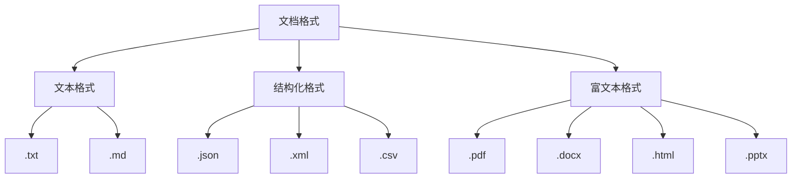

# 文档解析技术

## 引言

文档解析是RAG系统的第一步，也是至关重要的一步。不同的文档格式需要不同的解析策略，解析质量直接影响后续的向量化和检索效果。本文将深入探讨各种文档格式的解析技术，帮助你构建高质量的文档处理管道。

## 文档解析概述

### 文档解析的重要性

文档解析的质量直接影响RAG系统的整体性能：

1. **信息完整性**：确保重要信息不被丢失
2. **结构保持**：维护文档的逻辑结构
3. **格式处理**：正确处理各种格式和样式
4. **元数据提取**：提取文档的元信息

### 常见文档格式



## PDF文档解析

### PDF解析的挑战

PDF文档解析面临以下挑战：
- **布局复杂**：包含表格、图片、多栏布局
- **字体嵌入**：需要处理各种字体和编码
- **扫描文档**：需要OCR技术
- **权限限制**：加密或受保护的文档

### 主流PDF解析库对比

| 库名 | 特点 | 适用场景 | 优缺点 |
|------|------|----------|--------|
| **PyPDF2** | 轻量级 | 简单PDF | 快但功能有限 |
| **pdfplumber** | 功能丰富 | 复杂布局 | 功能强但较慢 |
| **pymupdf** | 高性能 | 大批量处理 | 快但API复杂 |
| **pdfminer** | 底层控制 | 定制需求 | 灵活但复杂 |

### PDF解析实现

#### 1. 使用pdfplumber解析

```python
import pdfplumber
import re
from typing import List, Dict

class PDFParser:
    def __init__(self):
        self.text_cleanup_patterns = [
            (r'\s+', ' '),  # 多个空格合并为一个
            (r'\n\s*\n', '\n\n'),  # 多个换行合并
        ]
    
    def parse_pdf(self, file_path: str) -> Dict:
        """解析PDF文档"""
        result = {
            'text': '',
            'pages': [],
            'tables': [],
            'metadata': {}
        }
        
        with pdfplumber.open(file_path) as pdf:
            # 提取元数据
            result['metadata'] = pdf.metadata
            
            # 逐页解析
            for page_num, page in enumerate(pdf.pages):
                page_data = self._parse_page(page, page_num)
                result['pages'].append(page_data)
                result['text'] += page_data['text'] + '\n\n'
                
                # 提取表格
                tables = page.extract_tables()
                for table in tables:
                    result['tables'].append({
                        'page': page_num,
                        'table': table
                    })
        
        # 清理文本
        result['text'] = self._clean_text(result['text'])
        return result
    
    def _parse_page(self, page, page_num: int) -> Dict:
        """解析单页内容"""
        # 提取文本
        text = page.extract_text()
        
        # 提取图片信息
        images = []
        for img in page.images:
            images.append({
                'bbox': img['bbox'],
                'name': img.get('name', f'image_{len(images)}')
            })
        
        return {
            'page_number': page_num,
            'text': text or '',
            'images': images,
            'width': page.width,
            'height': page.height
        }
    
    def _clean_text(self, text: str) -> str:
        """清理文本"""
        for pattern, replacement in self.text_cleanup_patterns:
            text = re.sub(pattern, replacement, text)
        return text.strip()
```

#### 2. 处理扫描PDF（OCR）

```python
import pytesseract
from PIL import Image
import fitz  # PyMuPDF

class OCRPDFParser:
    def __init__(self, language='chi_sim+eng'):
        self.language = language
        pytesseract.pytesseract.tesseract_cmd = r'/usr/bin/tesseract'
    
    def parse_scanned_pdf(self, file_path: str) -> Dict:
        """解析扫描PDF文档"""
        result = {
            'text': '',
            'pages': [],
            'confidence_scores': []
        }
        
        doc = fitz.open(file_path)
        
        for page_num in range(len(doc)):
            page = doc[page_num]
            
            # 将页面转换为图片
            pix = page.get_pixmap()
            img_data = pix.tobytes("png")
            
            # OCR识别
            ocr_result = self._ocr_image(img_data)
            
            page_data = {
                'page_number': page_num,
                'text': ocr_result['text'],
                'confidence': ocr_result['confidence']
            }
            
            result['pages'].append(page_data)
            result['text'] += ocr_result['text'] + '\n\n'
            result['confidence_scores'].append(ocr_result['confidence'])
        
        doc.close()
        return result
    
    def _ocr_image(self, img_data: bytes) -> Dict:
        """对图片进行OCR识别"""
        # 转换为PIL Image
        image = Image.open(io.BytesIO(img_data))
        
        # OCR识别
        text = pytesseract.image_to_string(image, lang=self.language)
        
        # 获取置信度
        data = pytesseract.image_to_data(image, output_type=pytesseract.Output.DICT)
        confidences = [int(conf) for conf in data['conf'] if int(conf) > 0]
        avg_confidence = sum(confidences) / len(confidences) if confidences else 0
        
        return {
            'text': text,
            'confidence': avg_confidence
        }
```

## Word文档解析

### DOCX解析实现

```python
from docx import Document
from docx.document import Document as DocumentType
from docx.text.paragraph import Paragraph
from docx.table import Table
import xml.etree.ElementTree as ET

class DOCXParser:
    def __init__(self):
        self.supported_formats = ['.docx']
    
    def parse_docx(self, file_path: str) -> Dict:
        """解析DOCX文档"""
        doc = Document(file_path)
        
        result = {
            'text': '',
            'paragraphs': [],
            'tables': [],
            'styles': [],
            'metadata': self._extract_metadata(doc)
        }
        
        # 解析段落
        for para in doc.paragraphs:
            if para.text.strip():
                para_data = self._parse_paragraph(para)
                result['paragraphs'].append(para_data)
                result['text'] += para.text + '\n\n'
        
        # 解析表格
        for table in doc.tables:
            table_data = self._parse_table(table)
            result['tables'].append(table_data)
        
        return result
    
    def _parse_paragraph(self, paragraph: Paragraph) -> Dict:
        """解析段落"""
        return {
            'text': paragraph.text,
            'style': paragraph.style.name if paragraph.style else 'Normal',
            'runs': [run.text for run in paragraph.runs],
            'alignment': str(paragraph.alignment) if paragraph.alignment else None
        }
    
    def _parse_table(self, table: Table) -> Dict:
        """解析表格"""
        table_data = {
            'rows': [],
            'columns': len(table.columns)
        }
        
        for row in table.rows:
            row_data = []
            for cell in row.cells:
                row_data.append(cell.text)
            table_data['rows'].append(row_data)
        
        return table_data
    
    def _extract_metadata(self, doc: DocumentType) -> Dict:
        """提取文档元数据"""
        core_props = doc.core_properties
        
        return {
            'title': core_props.title,
            'author': core_props.author,
            'subject': core_props.subject,
            'created': core_props.created,
            'modified': core_props.modified,
            'last_modified_by': core_props.last_modified_by,
            'revision': core_props.revision
        }
```

## HTML文档解析

### HTML解析实现

```python
from bs4 import BeautifulSoup
import requests
from urllib.parse import urljoin, urlparse
import re

class HTMLParser:
    def __init__(self):
        self.soup = None
        self.base_url = None
    
    def parse_html(self, html_content: str, base_url: str = None) -> Dict:
        """解析HTML内容"""
        self.base_url = base_url
        self.soup = BeautifulSoup(html_content, 'html.parser')
        
        result = {
            'text': '',
            'title': '',
            'headings': [],
            'links': [],
            'images': [],
            'tables': [],
            'metadata': {}
        }
        
        # 提取标题
        result['title'] = self._extract_title()
        
        # 提取文本内容
        result['text'] = self._extract_text()
        
        # 提取结构化内容
        result['headings'] = self._extract_headings()
        result['links'] = self._extract_links()
        result['images'] = self._extract_images()
        result['tables'] = self._extract_tables()
        
        # 提取元数据
        result['metadata'] = self._extract_metadata()
        
        return result
    
    def _extract_title(self) -> str:
        """提取页面标题"""
        title_tag = self.soup.find('title')
        return title_tag.get_text().strip() if title_tag else ''
    
    def _extract_text(self) -> str:
        """提取主要文本内容"""
        # 移除脚本和样式标签
        for script in self.soup(["script", "style", "nav", "footer", "header"]):
            script.decompose()
        
        # 提取文本
        text = self.soup.get_text()
        
        # 清理文本
        lines = (line.strip() for line in text.splitlines())
        chunks = (phrase.strip() for line in lines for phrase in line.split("  "))
        text = ' '.join(chunk for chunk in chunks if chunk)
        
        return text
    
    def _extract_headings(self) -> List[Dict]:
        """提取标题结构"""
        headings = []
        for i in range(1, 7):  # h1到h6
            for heading in self.soup.find_all(f'h{i}'):
                headings.append({
                    'level': i,
                    'text': heading.get_text().strip(),
                    'id': heading.get('id', '')
                })
        return headings
    
    def _extract_links(self) -> List[Dict]:
        """提取链接"""
        links = []
        for link in self.soup.find_all('a', href=True):
            href = link['href']
            text = link.get_text().strip()
            
            # 处理相对URL
            if self.base_url and not href.startswith(('http://', 'https://')):
                href = urljoin(self.base_url, href)
            
            links.append({
                'url': href,
                'text': text,
                'title': link.get('title', '')
            })
        return links
    
    def _extract_images(self) -> List[Dict]:
        """提取图片信息"""
        images = []
        for img in self.soup.find_all('img'):
            src = img.get('src', '')
            alt = img.get('alt', '')
            
            # 处理相对URL
            if self.base_url and not src.startswith(('http://', 'https://')):
                src = urljoin(self.base_url, src)
            
            images.append({
                'src': src,
                'alt': alt,
                'title': img.get('title', ''),
                'width': img.get('width'),
                'height': img.get('height')
            })
        return images
    
    def _extract_tables(self) -> List[Dict]:
        """提取表格"""
        tables = []
        for table in self.soup.find_all('table'):
            table_data = {
                'rows': [],
                'headers': []
            }
            
            # 提取表头
            header_row = table.find('thead')
            if header_row:
                headers = []
                for th in header_row.find_all(['th', 'td']):
                    headers.append(th.get_text().strip())
                table_data['headers'] = headers
            
            # 提取表格内容
            tbody = table.find('tbody') or table
            for row in tbody.find_all('tr'):
                if row.find('th'):  # 跳过表头行
                    continue
                
                row_data = []
                for cell in row.find_all(['td', 'th']):
                    row_data.append(cell.get_text().strip())
                
                if row_data:  # 只添加非空行
                    table_data['rows'].append(row_data)
            
            if table_data['rows']:  # 只添加有内容的表格
                tables.append(table_data)
        
        return tables
    
    def _extract_metadata(self) -> Dict:
        """提取元数据"""
        metadata = {}
        
        # 提取meta标签
        for meta in self.soup.find_all('meta'):
            name = meta.get('name') or meta.get('property')
            content = meta.get('content')
            
            if name and content:
                metadata[name] = content
        
        return metadata
```

## Markdown文档解析

### Markdown解析实现

```python
import markdown
from markdown.extensions import toc, tables, codehilite
import re

class MarkdownParser:
    def __init__(self):
        self.md = markdown.Markdown(
            extensions=[
                'toc',
                'tables',
                'codehilite',
                'fenced_code',
                'attr_list'
            ]
        )
    
    def parse_markdown(self, markdown_content: str) -> Dict:
        """解析Markdown文档"""
        result = {
            'text': '',
            'html': '',
            'headings': [],
            'code_blocks': [],
            'links': [],
            'images': [],
            'tables': [],
            'metadata': {}
        }
        
        # 提取前置元数据
        metadata, content = self._extract_frontmatter(markdown_content)
        result['metadata'] = metadata
        
        # 转换为HTML
        html_content = self.md.convert(content)
        result['html'] = html_content
        
        # 提取纯文本
        result['text'] = self._extract_text_from_html(html_content)
        
        # 提取结构化内容
        result['headings'] = self._extract_headings_from_markdown(content)
        result['code_blocks'] = self._extract_code_blocks(content)
        result['links'] = self._extract_links_from_markdown(content)
        result['images'] = self._extract_images_from_markdown(content)
        result['tables'] = self._extract_tables_from_markdown(content)
        
        return result
    
    def _extract_frontmatter(self, content: str) -> tuple:
        """提取前置元数据"""
        if content.startswith('---'):
            parts = content.split('---', 2)
            if len(parts) >= 3:
                try:
                    import yaml
                    metadata = yaml.safe_load(parts[1])
                    return metadata or {}, parts[2]
                except:
                    return {}, content
        
        return {}, content
    
    def _extract_text_from_html(self, html_content: str) -> str:
        """从HTML中提取纯文本"""
        soup = BeautifulSoup(html_content, 'html.parser')
        
        # 移除代码块
        for code in soup.find_all(['code', 'pre']):
            code.decompose()
        
        text = soup.get_text()
        
        # 清理文本
        lines = (line.strip() for line in text.splitlines())
        chunks = (phrase.strip() for line in lines for phrase in line.split("  "))
        text = ' '.join(chunk for chunk in chunks if chunk)
        
        return text
    
    def _extract_headings_from_markdown(self, content: str) -> List[Dict]:
        """从Markdown中提取标题"""
        headings = []
        pattern = r'^(#{1,6})\s+(.+)$'
        
        for line in content.split('\n'):
            match = re.match(pattern, line)
            if match:
                level = len(match.group(1))
                text = match.group(2).strip()
                headings.append({
                    'level': level,
                    'text': text
                })
        
        return headings
    
    def _extract_code_blocks(self, content: str) -> List[Dict]:
        """提取代码块"""
        code_blocks = []
        pattern = r'```(\w+)?\n(.*?)```'
        
        for match in re.finditer(pattern, content, re.DOTALL):
            language = match.group(1) or 'text'
            code = match.group(2).strip()
            
            code_blocks.append({
                'language': language,
                'code': code
            })
        
        return code_blocks
    
    def _extract_links_from_markdown(self, content: str) -> List[Dict]:
        """从Markdown中提取链接"""
        links = []
        
        # 内联链接 [text](url)
        pattern = r'\[([^\]]+)\]\(([^)]+)\)'
        for match in re.finditer(pattern, content):
            text = match.group(1)
            url = match.group(2)
            links.append({
                'text': text,
                'url': url,
                'type': 'inline'
            })
        
        # 引用链接 [text][ref]
        ref_pattern = r'\[([^\]]+)\]\[([^\]]*)\]'
        ref_links = {}
        
        # 提取引用定义
        ref_def_pattern = r'^\s*\[([^\]]*)\]:\s*(.+)$'
        for line in content.split('\n'):
            match = re.match(ref_def_pattern, line)
            if match:
                ref = match.group(1) or match.group(1)
                url = match.group(2).strip()
                ref_links[ref] = url
        
        # 处理引用链接
        for match in re.finditer(ref_pattern, content):
            text = match.group(1)
            ref = match.group(2) or text
            if ref in ref_links:
                links.append({
                    'text': text,
                    'url': ref_links[ref],
                    'type': 'reference'
                })
        
        return links
    
    def _extract_images_from_markdown(self, content: str) -> List[Dict]:
        """从Markdown中提取图片"""
        images = []
        
        # 内联图片 
        pattern = r'!\[([^\]]*)\]\(([^)]+)\)'
        for match in re.finditer(pattern, content):
            alt = match.group(1)
            url = match.group(2)
            images.append({
                'alt': alt,
                'url': url,
                'type': 'inline'
            })
        
        return images
    
    def _extract_tables_from_markdown(self, content: str) -> List[Dict]:
        """从Markdown中提取表格"""
        tables = []
        lines = content.split('\n')
        
        i = 0
        while i < len(lines):
            line = lines[i].strip()
            
            # 检查是否是表格行
            if '|' in line and not line.startswith('|---'):
                table_data = {'rows': []}
                
                # 提取表头
                headers = [cell.strip() for cell in line.split('|')[1:-1]]
                table_data['headers'] = headers
                
                i += 1
                
                # 跳过分隔行
                if i < len(lines) and '|---' in lines[i]:
                    i += 1
                
                # 提取表格内容
                while i < len(lines):
                    line = lines[i].strip()
                    if '|' in line and not line.startswith('|---'):
                        row = [cell.strip() for cell in line.split('|')[1:-1]]
                        table_data['rows'].append(row)
                        i += 1
                    else:
                        break
                
                if table_data['rows']:
                    tables.append(table_data)
            else:
                i += 1
        
        return tables
```

## 结构化数据解析

### JSON文档解析

```python
import json
from typing import Any, Dict, List

class JSONParser:
    def __init__(self):
        self.supported_formats = ['.json']
    
    def parse_json(self, file_path: str) -> Dict:
        """解析JSON文档"""
        with open(file_path, 'r', encoding='utf-8') as f:
            data = json.load(f)
        
        result = {
            'data': data,
            'text': '',
            'structure': {},
            'metadata': {}
        }
        
        # 提取文本内容
        result['text'] = self._extract_text_from_json(data)
        
        # 分析结构
        result['structure'] = self._analyze_structure(data)
        
        return result
    
    def _extract_text_from_json(self, data: Any) -> str:
        """从JSON数据中提取文本"""
        text_parts = []
        
        if isinstance(data, dict):
            for key, value in data.items():
                if isinstance(value, str):
                    text_parts.append(f"{key}: {value}")
                elif isinstance(value, (dict, list)):
                    text_parts.append(self._extract_text_from_json(value))
        elif isinstance(data, list):
            for item in data:
                text_parts.append(self._extract_text_from_json(item))
        elif isinstance(data, str):
            text_parts.append(data)
        
        return '\n'.join(text_parts)
    
    def _analyze_structure(self, data: Any) -> Dict:
        """分析JSON结构"""
        structure = {
            'type': type(data).__name__,
            'size': 0,
            'keys': [],
            'nested_structures': []
        }
        
        if isinstance(data, dict):
            structure['keys'] = list(data.keys())
            structure['size'] = len(data)
            
            for key, value in data.items():
                if isinstance(value, (dict, list)):
                    structure['nested_structures'].append({
                        'key': key,
                        'structure': self._analyze_structure(value)
                    })
        
        elif isinstance(data, list):
            structure['size'] = len(data)
            if data:
                structure['item_type'] = type(data[0]).__name__
        
        return structure
```

### XML文档解析

```python
import xml.etree.ElementTree as ET
from typing import Dict, List

class XMLParser:
    def __init__(self):
        self.supported_formats = ['.xml']
    
    def parse_xml(self, file_path: str) -> Dict:
        """解析XML文档"""
        tree = ET.parse(file_path)
        root = tree.getroot()
        
        result = {
            'text': '',
            'structure': {},
            'elements': [],
            'attributes': {},
            'metadata': {}
        }
        
        # 提取文本内容
        result['text'] = self._extract_text_from_xml(root)
        
        # 分析结构
        result['structure'] = self._analyze_xml_structure(root)
        
        # 提取元素
        result['elements'] = self._extract_elements(root)
        
        return result
    
    def _extract_text_from_xml(self, element: ET.Element) -> str:
        """从XML元素中提取文本"""
        text_parts = []
        
        # 提取元素文本
        if element.text and element.text.strip():
            text_parts.append(element.text.strip())
        
        # 递归处理子元素
        for child in element:
            child_text = self._extract_text_from_xml(child)
            if child_text:
                text_parts.append(child_text)
        
        return '\n'.join(text_parts)
    
    def _analyze_xml_structure(self, element: ET.Element) -> Dict:
        """分析XML结构"""
        structure = {
            'tag': element.tag,
            'attributes': element.attrib,
            'children': [],
            'text_content': element.text.strip() if element.text else ''
        }
        
        for child in element:
            child_structure = self._analyze_xml_structure(child)
            structure['children'].append(child_structure)
        
        return structure
    
    def _extract_elements(self, element: ET.Element) -> List[Dict]:
        """提取XML元素"""
        elements = []
        
        element_data = {
            'tag': element.tag,
            'attributes': element.attrib,
            'text': element.text.strip() if element.text else '',
            'children': []
        }
        
        for child in element:
            child_elements = self._extract_elements(child)
            element_data['children'].extend(child_elements)
        
        elements.append(element_data)
        return elements
```

## 文档解析管道

### 统一解析接口

```python
from pathlib import Path
from typing import Dict, Any
import mimetypes

class DocumentParserPipeline:
    def __init__(self):
        self.parsers = {
            '.pdf': PDFParser(),
            '.docx': DOCXParser(),
            '.html': HTMLParser(),
            '.md': MarkdownParser(),
            '.json': JSONParser(),
            '.xml': XMLParser(),
            '.txt': self._parse_text_file
        }
    
    def parse_document(self, file_path: str) -> Dict[str, Any]:
        """统一文档解析接口"""
        file_path = Path(file_path)
        
        if not file_path.exists():
            raise FileNotFoundError(f"文件不存在: {file_path}")
        
        # 获取文件扩展名
        extension = file_path.suffix.lower()
        
        # 选择对应的解析器
        if extension in self.parsers:
            parser = self.parsers[extension]
            return parser(file_path)
        else:
            # 尝试按MIME类型解析
            mime_type, _ = mimetypes.guess_type(str(file_path))
            return self._parse_by_mime_type(file_path, mime_type)
    
    def _parse_text_file(self, file_path: Path) -> Dict[str, Any]:
        """解析纯文本文件"""
        with open(file_path, 'r', encoding='utf-8') as f:
            content = f.read()
        
        return {
            'text': content,
            'metadata': {
                'file_name': file_path.name,
                'file_size': file_path.stat().st_size,
                'encoding': 'utf-8'
            }
        }
    
    def _parse_by_mime_type(self, file_path: Path, mime_type: str) -> Dict[str, Any]:
        """根据MIME类型解析"""
        if mime_type == 'text/html':
            return HTMLParser().parse_html(file_path.read_text())
        elif mime_type == 'text/plain':
            return self._parse_text_file(file_path)
        else:
            raise ValueError(f"不支持的文件类型: {mime_type}")
    
    def batch_parse(self, file_paths: List[str]) -> Dict[str, Dict[str, Any]]:
        """批量解析文档"""
        results = {}
        
        for file_path in file_paths:
            try:
                result = self.parse_document(file_path)
                results[file_path] = result
            except Exception as e:
                results[file_path] = {
                    'error': str(e),
                    'text': '',
                    'metadata': {}
                }
        
        return results
```

## 解析质量评估

### 质量评估指标

```python
class DocumentParseQualityAssessment:
    def __init__(self):
        self.metrics = {}
    
    def assess_quality(self, parsed_doc: Dict[str, Any]) -> Dict[str, float]:
        """评估解析质量"""
        metrics = {}
        
        # 文本完整性
        metrics['text_completeness'] = self._assess_text_completeness(parsed_doc)
        
        # 结构保持度
        metrics['structure_preservation'] = self._assess_structure_preservation(parsed_doc)
        
        # 格式准确性
        metrics['format_accuracy'] = self._assess_format_accuracy(parsed_doc)
        
        # 元数据完整性
        metrics['metadata_completeness'] = self._assess_metadata_completeness(parsed_doc)
        
        return metrics
    
    def _assess_text_completeness(self, parsed_doc: Dict[str, Any]) -> float:
        """评估文本完整性"""
        text = parsed_doc.get('text', '')
        
        # 检查是否有文本内容
        if not text.strip():
            return 0.0
        
        # 检查文本长度合理性
        text_length = len(text)
        if text_length < 10:
            return 0.3
        elif text_length < 100:
            return 0.6
        else:
            return 1.0
    
    def _assess_structure_preservation(self, parsed_doc: Dict[str, Any]) -> float:
        """评估结构保持度"""
        score = 0.0
        
        # 检查是否有标题结构
        if 'headings' in parsed_doc and parsed_doc['headings']:
            score += 0.3
        
        # 检查是否有段落结构
        if 'paragraphs' in parsed_doc and parsed_doc['paragraphs']:
            score += 0.3
        
        # 检查是否有表格结构
        if 'tables' in parsed_doc and parsed_doc['tables']:
            score += 0.2
        
        # 检查是否有链接结构
        if 'links' in parsed_doc and parsed_doc['links']:
            score += 0.2
        
        return min(score, 1.0)
    
    def _assess_format_accuracy(self, parsed_doc: Dict[str, Any]) -> float:
        """评估格式准确性"""
        # 这里可以根据具体需求实现格式检查逻辑
        return 0.8  # 默认分数
    
    def _assess_metadata_completeness(self, parsed_doc: Dict[str, Any]) -> float:
        """评估元数据完整性"""
        metadata = parsed_doc.get('metadata', {})
        
        if not metadata:
            return 0.0
        
        # 检查关键元数据字段
        required_fields = ['title', 'author', 'created']
        present_fields = sum(1 for field in required_fields if field in metadata)
        
        return present_fields / len(required_fields)
```

## 最佳实践

### 1. 解析策略选择

```python
def choose_parsing_strategy(file_path: str) -> str:
    """根据文件特点选择解析策略"""
    file_path = Path(file_path)
    extension = file_path.suffix.lower()
    
    # 根据文件大小选择策略
    file_size = file_path.stat().st_size
    
    if file_size > 100 * 1024 * 1024:  # 大于100MB
        return "streaming"  # 流式解析
    elif file_size > 10 * 1024 * 1024:  # 大于10MB
        return "chunked"    # 分块解析
    else:
        return "full"       # 完整解析
```

### 2. 错误处理

```python
def robust_parse(file_path: str) -> Dict[str, Any]:
    """健壮的文档解析"""
    try:
        return DocumentParserPipeline().parse_document(file_path)
    except Exception as e:
        # 记录错误
        logger.error(f"解析文档失败: {file_path}, 错误: {str(e)}")
        
        # 返回基础信息
        return {
            'text': '',
            'error': str(e),
            'metadata': {
                'file_name': Path(file_path).name,
                'parse_status': 'failed'
            }
        }
```

### 3. 性能优化

```python
import concurrent.futures
from typing import List

def parallel_parse(file_paths: List[str], max_workers: int = 4) -> Dict[str, Dict[str, Any]]:
    """并行解析多个文档"""
    results = {}
    
    with concurrent.futures.ThreadPoolExecutor(max_workers=max_workers) as executor:
        future_to_path = {
            executor.submit(robust_parse, path): path 
            for path in file_paths
        }
        
        for future in concurrent.futures.as_completed(future_to_path):
            path = future_to_path[future]
            try:
                results[path] = future.result()
            except Exception as e:
                results[path] = {
                    'text': '',
                    'error': str(e),
                    'metadata': {}
                }
    
    return results
```

## 总结

文档解析是RAG系统的基础环节，选择合适的解析技术和策略对系统性能至关重要。本文介绍了主流文档格式的解析方法，包括PDF、Word、HTML、Markdown等格式的处理技术。

关键要点：
1. **格式适配**：不同格式需要不同的解析策略
2. **质量保证**：建立解析质量评估机制
3. **错误处理**：实现健壮的解析管道
4. **性能优化**：支持批量处理和并行解析

在下一篇文章中，我们将探讨文本分块策略，这是文档解析后的重要处理步骤。

---

**下一步学习建议：**
- 阅读《文本分块策略》，了解如何将长文档切分成合适的块
- 实践搭建文档解析管道，处理不同类型的文档
- 关注文档解析技术的最新发展和优化方案
