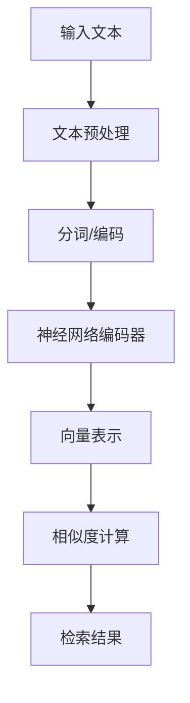

# 向量化模型选择

## 引言

向量化模型是RAG系统的核心组件，负责将文本转换为高维向量表示。选择合适的向量化模型对RAG系统的性能至关重要。本文将深入探讨各种向量化模型的特点、选择标准和使用方法。

## 向量化模型概述

### 什么是向量化模型

向量化模型（Embedding Model）是一种将文本转换为数值向量的技术，使得计算机能够理解和处理文本的语义信息。

### 向量化模型的工作原理



### 向量化模型的关键特性

1. **语义理解**：能够理解文本的语义含义
2. **相似度计算**：支持向量间的相似度计算
3. **多语言支持**：支持不同语言的文本处理
4. **领域适应性**：可以针对特定领域进行优化

## 主流向量化模型对比

### 1. OpenAI Embeddings

#### 特点
- **模型**：text-embedding-ada-002
- **维度**：1536维
- **语言支持**：多语言
- **API调用**：需要网络请求

#### 使用示例

```python
import openai
from typing import List
import numpy as np

class OpenAIEmbedding:
    def __init__(self, api_key: str):
        openai.api_key = api_key
        self.model = "text-embedding-ada-002"
    
    def embed_text(self, text: str) -> List[float]:
        """生成单个文本的向量"""
        response = openai.Embedding.create(
            input=text,
            model=self.model
        )
        return response['data'][0]['embedding']
    
    def embed_batch(self, texts: List[str]) -> List[List[float]]:
        """批量生成向量"""
        response = openai.Embedding.create(
            input=texts,
            model=self.model
        )
        return [item['embedding'] for item in response['data']]
    
    def calculate_similarity(self, text1: str, text2: str) -> float:
        """计算两个文本的相似度"""
        emb1 = self.embed_text(text1)
        emb2 = self.embed_text(text2)
        
        # 计算余弦相似度
        dot_product = np.dot(emb1, emb2)
        norm1 = np.linalg.norm(emb1)
        norm2 = np.linalg.norm(emb2)
        
        return dot_product / (norm1 * norm2)
```

#### 优缺点分析

**优点：**
- 性能优秀，语义理解能力强
- 支持多语言
- 使用简单，API稳定
- 持续更新优化

**缺点：**
- 需要网络连接
- 有API调用限制
- 成本较高
- 数据隐私问题

### 2. Sentence Transformers

#### 特点
- **开源模型**：多种预训练模型可选
- **本地部署**：无需网络连接
- **高性能**：GPU加速支持
- **灵活配置**：支持自定义训练

#### 使用示例

```python
from sentence_transformers import SentenceTransformer
import torch
from typing import List, Union

class SentenceTransformerEmbedding:
    def __init__(self, model_name: str = 'all-MiniLM-L6-v2', device: str = 'auto'):
        self.model = SentenceTransformer(model_name)
        
        # 自动选择设备
        if device == 'auto':
            self.device = 'cuda' if torch.cuda.is_available() else 'cpu'
        else:
            self.device = device
        
        self.model.to(self.device)
    
    def embed_text(self, text: str) -> List[float]:
        """生成单个文本的向量"""
        embedding = self.model.encode(text, convert_to_tensor=True)
        return embedding.cpu().numpy().tolist()
    
    def embed_batch(self, texts: List[str], batch_size: int = 32) -> List[List[float]]:
        """批量生成向量"""
        embeddings = self.model.encode(
            texts,
            batch_size=batch_size,
            show_progress_bar=True,
            convert_to_tensor=True
        )
        return embeddings.cpu().numpy().tolist()
    
    def embed_with_metadata(self, texts: List[str]) -> List[dict]:
        """生成带元数据的向量"""
        embeddings = self.model.encode(texts, return_tensors=True)
        
        results = []
        for i, (text, embedding) in enumerate(zip(texts, embeddings)):
            results.append({
                'id': i,
                'text': text,
                'embedding': embedding.cpu().numpy().tolist(),
                'model': self.model.get_sentence_embedding_dimension()
            })
        
        return results
    
    def calculate_similarity(self, text1: str, text2: str) -> float:
        """计算两个文本的相似度"""
        embeddings = self.model.encode([text1, text2])
        similarity = self.model.similarity(embeddings[0], embeddings[1])
        return float(similarity)
```

#### 主流模型对比

| 模型名称 | 维度 | 语言 | 特点 | 适用场景 |
|----------|------|------|------|----------|
| **all-MiniLM-L6-v2** | 384 | 多语言 | 轻量级，速度快 | 通用场景 |
| **all-mpnet-base-v2** | 768 | 多语言 | 性能优秀 | 高质量要求 |
| **paraphrase-multilingual-MiniLM-L12-v2** | 384 | 多语言 | 多语言优化 | 跨语言应用 |
| **distilbert-base-nli-mean-tokens** | 768 | 英文 | 英文优化 | 英文应用 |
| **chinese-roberta-wwm-ext** | 768 | 中文 | 中文优化 | 中文应用 |

### 3. 中文优化模型

#### 使用示例

```python
class ChineseEmbedding:
    def __init__(self, model_name: str = 'paraphrase-multilingual-MiniLM-L12-v2'):
        self.model = SentenceTransformer(model_name)
    
    def embed_chinese_text(self, text: str) -> List[float]:
        """生成中文文本的向量"""
        # 中文文本预处理
        processed_text = self._preprocess_chinese_text(text)
        
        # 生成向量
        embedding = self.model.encode(processed_text)
        return embedding.tolist()
    
    def _preprocess_chinese_text(self, text: str) -> str:
        """中文文本预处理"""
        import re
        
        # 移除多余空格
        text = re.sub(r'\s+', ' ', text)
        
        # 移除特殊字符
        text = re.sub(r'[^\u4e00-\u9fff\w\s]', '', text)
        
        return text.strip()
    
    def batch_embed_chinese(self, texts: List[str]) -> List[List[float]]:
        """批量处理中文文本"""
        processed_texts = [self._preprocess_chinese_text(text) for text in texts]
        embeddings = self.model.encode(processed_texts)
        return embeddings.tolist()
```

### 4. 领域特定模型

#### 代码向量化模型

```python
class CodeEmbedding:
    def __init__(self, model_name: str = 'microsoft/codebert-base'):
        from transformers import AutoTokenizer, AutoModel
        self.tokenizer = AutoTokenizer.from_pretrained(model_name)
        self.model = AutoModel.from_pretrained(model_name)
    
    def embed_code(self, code: str, language: str = 'python') -> List[float]:
        """生成代码的向量表示"""
        # 添加语言标识
        code_with_lang = f"<{language}>\n{code}"
        
        # 编码
        inputs = self.tokenizer(
            code_with_lang,
            return_tensors='pt',
            truncation=True,
            max_length=512
        )
        
        # 生成向量
        with torch.no_grad():
            outputs = self.model(**inputs)
            embedding = outputs.last_hidden_state.mean(dim=1)
        
        return embedding.squeeze().numpy().tolist()
```

#### 医学领域模型

```python
class MedicalEmbedding:
    def __init__(self, model_name: str = 'dmis-lab/biobert-base-cased-v1.1'):
        from transformers import AutoTokenizer, AutoModel
        self.tokenizer = AutoTokenizer.from_pretrained(model_name)
        self.model = AutoModel.from_pretrained(model_name)
    
    def embed_medical_text(self, text: str) -> List[float]:
        """生成医学文本的向量"""
        inputs = self.tokenizer(
            text,
            return_tensors='pt',
            truncation=True,
            max_length=512
        )
        
        with torch.no_grad():
            outputs = self.model(**inputs)
            embedding = outputs.last_hidden_state.mean(dim=1)
        
        return embedding.squeeze().numpy().tolist()
```

## 向量化模型选择指南

### 1. 根据应用场景选择

#### 通用应用场景

```python
def choose_general_model(requirements: dict) -> str:
    """选择通用向量化模型"""
    if requirements['language'] == 'chinese':
        if requirements['performance'] == 'high':
            return 'paraphrase-multilingual-MiniLM-L12-v2'
        else:
            return 'all-MiniLM-L6-v2'
    elif requirements['language'] == 'english':
        if requirements['performance'] == 'high':
            return 'all-mpnet-base-v2'
        else:
            return 'all-MiniLM-L6-v2'
    else:
        return 'paraphrase-multilingual-MiniLM-L12-v2'
```

#### 领域特定应用

```python
def choose_domain_model(domain: str) -> str:
    """选择领域特定模型"""
    domain_models = {
        'code': 'microsoft/codebert-base',
        'medical': 'dmis-lab/biobert-base-cased-v1.1',
        'legal': 'nlpaueb/legal-bert-base-uncased',
        'finance': 'yiyanghkust/finbert-tone',
        'news': 'distilbert-base-uncased'
    }
    
    return domain_models.get(domain, 'all-MiniLM-L6-v2')
```

### 2. 性能对比测试

```python
class ModelPerformanceTest:
    def __init__(self):
        self.test_texts = [
            "人工智能正在改变世界",
            "机器学习是AI的重要分支",
            "深度学习推动了AI的发展",
            "自然语言处理技术不断进步",
            "计算机视觉应用越来越广泛"
        ]
    
    def test_model_performance(self, model_name: str) -> dict:
        """测试模型性能"""
        import time
        
        # 初始化模型
        model = SentenceTransformer(model_name)
        
        # 测试单次推理时间
        start_time = time.time()
        embedding = model.encode(self.test_texts[0])
        single_time = time.time() - start_time
        
        # 测试批量推理时间
        start_time = time.time()
        embeddings = model.encode(self.test_texts)
        batch_time = time.time() - start_time
        
        # 测试相似度计算
        similarity_scores = []
        for i in range(len(self.test_texts) - 1):
            sim = model.similarity(
                model.encode(self.test_texts[i]),
                model.encode(self.test_texts[i + 1])
            )
            similarity_scores.append(float(sim))
        
        return {
            'model_name': model_name,
            'dimension': model.get_sentence_embedding_dimension(),
            'single_inference_time': single_time,
            'batch_inference_time': batch_time,
            'average_similarity': sum(similarity_scores) / len(similarity_scores),
            'memory_usage': self._get_memory_usage()
        }
    
    def _get_memory_usage(self) -> float:
        """获取内存使用量"""
        import psutil
        process = psutil.Process()
        return process.memory_info().rss / 1024 / 1024  # MB
```

### 3. 模型评估指标

```python
class ModelEvaluation:
    def __init__(self):
        self.evaluation_data = self._load_evaluation_data()
    
    def evaluate_model(self, model: SentenceTransformer) -> dict:
        """评估模型性能"""
        metrics = {}
        
        # 语义相似度测试
        metrics['semantic_similarity'] = self._test_semantic_similarity(model)
        
        # 语义搜索测试
        metrics['semantic_search'] = self._test_semantic_search(model)
        
        # 多语言测试
        metrics['multilingual'] = self._test_multilingual(model)
        
        # 领域适应性测试
        metrics['domain_adaptation'] = self._test_domain_adaptation(model)
        
        return metrics
    
    def _test_semantic_similarity(self, model: SentenceTransformer) -> float:
        """测试语义相似度"""
        # 使用标准数据集测试
        # 这里简化实现
        test_pairs = [
            ("猫", "猫咪"),
            ("汽车", "车辆"),
            ("学习", "教育")
        ]
        
        similarities = []
        for text1, text2 in test_pairs:
            sim = model.similarity(
                model.encode(text1),
                model.encode(text2)
            )
            similarities.append(float(sim))
        
        return sum(similarities) / len(similarities)
    
    def _test_semantic_search(self, model: SentenceTransformer) -> float:
        """测试语义搜索"""
        # 实现语义搜索测试
        pass
    
    def _test_multilingual(self, model: SentenceTransformer) -> float:
        """测试多语言支持"""
        # 实现多语言测试
        pass
    
    def _test_domain_adaptation(self, model: SentenceTransformer) -> float:
        """测试领域适应性"""
        # 实现领域适应性测试
        pass
```

## 向量化模型优化

### 1. 模型微调

```python
class ModelFineTuning:
    def __init__(self, base_model: str = 'all-MiniLM-L6-v2'):
        self.base_model = SentenceTransformer(base_model)
    
    def fine_tune_model(self, training_data: List[dict], epochs: int = 3):
        """微调模型"""
        from sentence_transformers import InputExample, losses
        
        # 准备训练数据
        train_examples = []
        for item in training_data:
            train_examples.append(InputExample(
                texts=[item['text1'], item['text2']],
                label=item['similarity']
            ))
        
        # 定义损失函数
        train_loss = losses.CosineSimilarityLoss(self.base_model)
        
        # 微调模型
        self.base_model.fit(
            train_objectives=[(train_examples, train_loss)],
            epochs=epochs,
            warmup_steps=100,
            output_path='./fine_tuned_model'
        )
    
    def evaluate_fine_tuned_model(self, test_data: List[dict]) -> float:
        """评估微调后的模型"""
        # 加载微调后的模型
        fine_tuned_model = SentenceTransformer('./fine_tuned_model')
        
        # 在测试数据上评估
        similarities = []
        for item in test_data:
            pred_sim = fine_tuned_model.similarity(
                fine_tuned_model.encode(item['text1']),
                fine_tuned_model.encode(item['text2'])
            )
            similarities.append(float(pred_sim))
        
        # 计算与真实标签的相关性
        true_similarities = [item['similarity'] for item in test_data]
        correlation = np.corrcoef(similarities, true_similarities)[0, 1]
        
        return correlation
```

### 2. 模型压缩

```python
class ModelCompression:
    def __init__(self, model: SentenceTransformer):
        self.model = model
    
    def compress_model(self, compression_ratio: float = 0.5):
        """压缩模型"""
        # 使用PCA降维
        from sklearn.decomposition import PCA
        
        # 收集训练数据
        training_embeddings = self._collect_training_embeddings()
        
        # 训练PCA
        pca = PCA(n_components=int(len(training_embeddings[0]) * compression_ratio))
        pca.fit(training_embeddings)
        
        # 保存PCA模型
        import joblib
        joblib.dump(pca, 'pca_model.pkl')
        
        return pca
    
    def apply_compression(self, embeddings: np.ndarray, pca_model) -> np.ndarray:
        """应用压缩"""
        return pca_model.transform(embeddings)
    
    def _collect_training_embeddings(self) -> np.ndarray:
        """收集训练数据"""
        # 这里需要收集大量的文本数据进行PCA训练
        # 简化实现
        sample_texts = [
            "这是一个示例文本",
            "另一个示例文本",
            "更多的示例文本"
        ]
        
        embeddings = self.model.encode(sample_texts)
        return embeddings
```

### 3. 模型缓存

```python
class EmbeddingCache:
    def __init__(self, cache_size: int = 10000):
        self.cache = {}
        self.cache_size = cache_size
        self.access_count = {}
    
    def get_embedding(self, text: str, model: SentenceTransformer) -> List[float]:
        """获取向量，支持缓存"""
        text_hash = hash(text)
        
        if text_hash in self.cache:
            self.access_count[text_hash] = self.access_count.get(text_hash, 0) + 1
            return self.cache[text_hash]
        
        # 生成新向量
        embedding = model.encode(text).tolist()
        
        # 添加到缓存
        self._add_to_cache(text_hash, embedding)
        
        return embedding
    
    def _add_to_cache(self, text_hash: int, embedding: List[float]):
        """添加到缓存"""
        if len(self.cache) >= self.cache_size:
            # 移除最少使用的项
            least_used = min(self.access_count.items(), key=lambda x: x[1])
            del self.cache[least_used[0]]
            del self.access_count[least_used[0]]
        
        self.cache[text_hash] = embedding
        self.access_count[text_hash] = 1
```

## 向量化模型部署

### 1. 本地部署

```python
class LocalEmbeddingService:
    def __init__(self, model_name: str = 'all-MiniLM-L6-v2'):
        self.model = SentenceTransformer(model_name)
        self.cache = EmbeddingCache()
    
    def start_service(self, port: int = 8000):
        """启动本地服务"""
        from flask import Flask, request, jsonify
        
        app = Flask(__name__)
        
        @app.route('/embed', methods=['POST'])
        def embed_text():
            data = request.json
            text = data.get('text')
            
            if not text:
                return jsonify({'error': 'No text provided'}), 400
            
            embedding = self.cache.get_embedding(text, self.model)
            
            return jsonify({
                'embedding': embedding,
                'dimension': len(embedding)
            })
        
        @app.route('/embed_batch', methods=['POST'])
        def embed_batch():
            data = request.json
            texts = data.get('texts', [])
            
            if not texts:
                return jsonify({'error': 'No texts provided'}), 400
            
            embeddings = []
            for text in texts:
                embedding = self.cache.get_embedding(text, self.model)
                embeddings.append(embedding)
            
            return jsonify({
                'embeddings': embeddings,
                'count': len(embeddings)
            })
        
        app.run(host='0.0.0.0', port=port)
```

### 2. 分布式部署

```python
class DistributedEmbeddingService:
    def __init__(self, model_name: str = 'all-MiniLM-L6-v2'):
        self.model = SentenceTransformer(model_name)
        self.redis_client = self._init_redis()
    
    def _init_redis(self):
        """初始化Redis客户端"""
        import redis
        return redis.Redis(host='localhost', port=6379, db=0)
    
    def embed_with_redis_cache(self, text: str) -> List[float]:
        """使用Redis缓存的向量化"""
        text_hash = str(hash(text))
        
        # 检查Redis缓存
        cached_embedding = self.redis_client.get(f"embedding:{text_hash}")
        if cached_embedding:
            import pickle
            return pickle.loads(cached_embedding)
        
        # 生成新向量
        embedding = self.model.encode(text).tolist()
        
        # 存储到Redis
        import pickle
        self.redis_client.setex(
            f"embedding:{text_hash}",
            3600,  # 1小时过期
            pickle.dumps(embedding)
        )
        
        return embedding
```

## 最佳实践

### 1. 模型选择策略

```python
def select_optimal_model(requirements: dict) -> str:
    """选择最优模型"""
    # 根据需求选择模型
    if requirements['language'] == 'chinese':
        if requirements['domain'] == 'general':
            return 'paraphrase-multilingual-MiniLM-L12-v2'
        elif requirements['domain'] == 'code':
            return 'microsoft/codebert-base'
        else:
            return 'all-MiniLM-L6-v2'
    
    elif requirements['language'] == 'english':
        if requirements['performance'] == 'high':
            return 'all-mpnet-base-v2'
        else:
            return 'all-MiniLM-L6-v2'
    
    else:
        return 'paraphrase-multilingual-MiniLM-L12-v2'
```

### 2. 性能优化建议

```python
class EmbeddingOptimizer:
    def __init__(self, model: SentenceTransformer):
        self.model = model
    
    def optimize_for_production(self):
        """生产环境优化"""
        # 1. 启用GPU加速
        if torch.cuda.is_available():
            self.model = self.model.cuda()
        
        # 2. 设置批处理大小
        self.batch_size = 32
        
        # 3. 启用混合精度
        self.model.half()
        
        # 4. 预热模型
        self._warmup_model()
    
    def _warmup_model(self):
        """预热模型"""
        dummy_texts = ["warmup text"] * 10
        self.model.encode(dummy_texts)
```

### 3. 监控和维护

```python
class EmbeddingMonitor:
    def __init__(self, model: SentenceTransformer):
        self.model = model
        self.metrics = {}
    
    def monitor_performance(self):
        """监控性能"""
        import time
        
        # 监控推理时间
        start_time = time.time()
        embedding = self.model.encode("test text")
        inference_time = time.time() - start_time
        
        # 监控内存使用
        import psutil
        memory_usage = psutil.Process().memory_info().rss / 1024 / 1024
        
        # 记录指标
        self.metrics['inference_time'] = inference_time
        self.metrics['memory_usage'] = memory_usage
        
        return self.metrics
```

## 总结

向量化模型是RAG系统的核心组件，选择合适的模型对系统性能至关重要。本文介绍了主流向量化模型的特点、选择标准和使用方法。

关键要点：
1. **模型选择**：根据语言、领域、性能要求选择合适模型
2. **性能优化**：通过缓存、压缩、微调等方式优化性能
3. **部署策略**：支持本地和分布式部署
4. **监控维护**：建立性能监控和维护机制

在下一篇文章中，我们将探讨向量数据库的选型和使用，这是存储和检索向量的关键组件。

---

**下一步学习建议：**
- 阅读《向量数据库选型》，了解如何选择合适的向量数据库
- 实践不同的向量化模型，比较它们的效果
- 关注向量化技术的最新发展和优化方案
