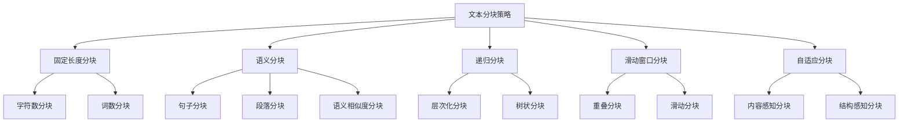

# 文本分块策略

## 引言

文本分块是RAG系统中的关键步骤，直接影响检索的准确性和生成质量。合理的分块策略能够保持语义完整性，提高检索效果。本文将深入探讨各种文本分块策略，帮助你选择最适合的分块方法。

## 文本分块概述

### 为什么需要文本分块

1. **上下文长度限制**：大语言模型有上下文窗口限制
2. **检索精度**：小块文本能提供更精确的匹配
3. **计算效率**：减少向量化计算量
4. **语义完整性**：保持文本的语义连贯性

### 分块策略分类



## 固定长度分块

### 字符数分块

```python
class FixedLengthChunker:
    def __init__(self, chunk_size: int = 1000, overlap: int = 200):
        self.chunk_size = chunk_size
        self.overlap = overlap
    
    def chunk_by_characters(self, text: str) -> List[str]:
        """按字符数分块"""
        chunks = []
        start = 0
        
        while start < len(text):
            end = start + self.chunk_size
            chunk = text[start:end]
            
            # 尝试在句号处截断
            if end < len(text):
                last_period = chunk.rfind('。')
                if last_period > self.chunk_size * 0.7:  # 如果句号位置合理
                    chunk = chunk[:last_period + 1]
                    end = start + last_period + 1
            
            chunks.append(chunk.strip())
            start = end - self.overlap
        
        return chunks
```

### 词数分块

```python
import jieba
from typing import List

class WordCountChunker:
    def __init__(self, max_words: int = 200, overlap_words: int = 50):
        self.max_words = max_words
        self.overlap_words = overlap_words
    
    def chunk_by_words(self, text: str) -> List[str]:
        """按词数分块"""
        # 分词
        words = list(jieba.cut(text))
        
        chunks = []
        start = 0
        
        while start < len(words):
            end = start + self.max_words
            
            # 获取当前块的词
            chunk_words = words[start:end]
            
            # 尝试在句子边界处截断
            if end < len(words):
                chunk_text = ''.join(chunk_words)
                last_sentence_end = self._find_last_sentence_end(chunk_text)
                
                if last_sentence_end > len(chunk_text) * 0.7:
                    chunk_text = chunk_text[:last_sentence_end]
                    # 重新计算end位置
                    actual_words = len(jieba.cut(chunk_text))
                    end = start + actual_words
            
            chunk_text = ''.join(words[start:end])
            chunks.append(chunk_text.strip())
            
            start = end - self.overlap_words
        
        return chunks
    
    def _find_last_sentence_end(self, text: str) -> int:
        """找到最后一个句子的结束位置"""
        sentence_endings = ['。', '！', '？', '.', '!', '?']
        
        for i in range(len(text) - 1, -1, -1):
            if text[i] in sentence_endings:
                return i + 1
        
        return len(text)
```

## 语义分块

### 句子分块

```python
import re
from typing import List, Tuple

class SentenceChunker:
    def __init__(self, sentences_per_chunk: int = 5, overlap_sentences: int = 1):
        self.sentences_per_chunk = sentences_per_chunk
        self.overlap_sentences = overlap_sentences
    
    def chunk_by_sentences(self, text: str) -> List[str]:
        """按句子分块"""
        sentences = self._split_sentences(text)
        chunks = []
        
        start = 0
        while start < len(sentences):
            end = start + self.sentences_per_chunk
            chunk_sentences = sentences[start:end]
            
            chunk_text = '。'.join(chunk_sentences)
            if chunk_text and not chunk_text.endswith('。'):
                chunk_text += '。'
            
            chunks.append(chunk_text)
            start = end - self.overlap_sentences
        
        return chunks
    
    def _split_sentences(self, text: str) -> List[str]:
        """分割句子"""
        # 中文句子分割模式
        sentence_pattern = r'[。！？]'
        sentences = re.split(sentence_pattern, text)
        
        # 清理空句子
        sentences = [s.strip() for s in sentences if s.strip()]
        
        return sentences
```

### 段落分块

```python
class ParagraphChunker:
    def __init__(self, paragraphs_per_chunk: int = 3, overlap_paragraphs: int = 1):
        self.paragraphs_per_chunk = paragraphs_per_chunk
        self.overlap_paragraphs = overlap_paragraphs
    
    def chunk_by_paragraphs(self, text: str) -> List[str]:
        """按段落分块"""
        paragraphs = self._split_paragraphs(text)
        chunks = []
        
        start = 0
        while start < len(paragraphs):
            end = start + self.paragraphs_per_chunk
            chunk_paragraphs = paragraphs[start:end]
            
            chunk_text = '\n\n'.join(chunk_paragraphs)
            chunks.append(chunk_text)
            
            start = end - self.overlap_paragraphs
        
        return chunks
    
    def _split_paragraphs(self, text: str) -> List[str]:
        """分割段落"""
        # 按双换行符分割段落
        paragraphs = text.split('\n\n')
        
        # 清理空段落
        paragraphs = [p.strip() for p in paragraphs if p.strip()]
        
        return paragraphs
```

### 语义相似度分块

```python
from sentence_transformers import SentenceTransformer
import numpy as np
from sklearn.metrics.pairwise import cosine_similarity

class SemanticChunker:
    def __init__(self, model_name: str = 'all-MiniLM-L6-v2', similarity_threshold: float = 0.7):
        self.model = SentenceTransformer(model_name)
        self.similarity_threshold = similarity_threshold
    
    def chunk_by_semantic_similarity(self, text: str) -> List[str]:
        """基于语义相似度分块"""
        sentences = self._split_sentences(text)
        
        if len(sentences) <= 1:
            return [text]
        
        # 计算句子嵌入
        embeddings = self.model.encode(sentences)
        
        # 计算相似度矩阵
        similarity_matrix = cosine_similarity(embeddings)
        
        # 找到分块点
        chunk_boundaries = self._find_chunk_boundaries(similarity_matrix)
        
        # 根据边界创建块
        chunks = []
        start = 0
        
        for boundary in chunk_boundaries:
            chunk_sentences = sentences[start:boundary]
            chunk_text = '。'.join(chunk_sentences)
            if chunk_text and not chunk_text.endswith('。'):
                chunk_text += '。'
            chunks.append(chunk_text)
            start = boundary
        
        # 添加最后一个块
        if start < len(sentences):
            chunk_sentences = sentences[start:]
            chunk_text = '。'.join(chunk_sentences)
            if chunk_text and not chunk_text.endswith('。'):
                chunk_text += '。'
            chunks.append(chunk_text)
        
        return chunks
    
    def _find_chunk_boundaries(self, similarity_matrix: np.ndarray) -> List[int]:
        """找到分块边界"""
        boundaries = []
        
        for i in range(len(similarity_matrix) - 1):
            # 计算当前句子与下一个句子的相似度
            similarity = similarity_matrix[i, i + 1]
            
            # 如果相似度低于阈值，则在此处分块
            if similarity < self.similarity_threshold:
                boundaries.append(i + 1)
        
        return boundaries
```

## 递归分块

### 层次化分块

```python
class HierarchicalChunker:
    def __init__(self, max_chunk_size: int = 1000):
        self.max_chunk_size = max_chunk_size
    
    def recursive_chunk(self, text: str) -> List[str]:
        """递归分块"""
        if len(text) <= self.max_chunk_size:
            return [text]
        
        # 尝试按段落分割
        paragraphs = text.split('\n\n')
        if len(paragraphs) > 1:
            chunks = []
            for para in paragraphs:
                chunks.extend(self.recursive_chunk(para))
            return chunks
        
        # 尝试按句子分割
        sentences = self._split_sentences(text)
        if len(sentences) > 1:
            chunks = []
            current_chunk = ""
            
            for sentence in sentences:
                if len(current_chunk + sentence) <= self.max_chunk_size:
                    current_chunk += sentence + "。"
                else:
                    if current_chunk:
                        chunks.append(current_chunk)
                    current_chunk = sentence + "。"
            
            if current_chunk:
                chunks.append(current_chunk)
            
            return chunks
        
        # 最后按字符分割
        return self._split_by_characters(text)
    
    def _split_by_characters(self, text: str) -> List[str]:
        """按字符分割"""
        chunks = []
        for i in range(0, len(text), self.max_chunk_size):
            chunk = text[i:i + self.max_chunk_size]
            chunks.append(chunk)
        return chunks
```

### 树状分块

```python
from typing import Dict, Any

class TreeChunker:
    def __init__(self, max_chunk_size: int = 1000):
        self.max_chunk_size = max_chunk_size
    
    def create_chunk_tree(self, text: str) -> Dict[str, Any]:
        """创建分块树"""
        if len(text) <= self.max_chunk_size:
            return {
                'type': 'leaf',
                'content': text,
                'size': len(text)
            }
        
        # 尝试不同的分割策略
        strategies = [
            self._split_by_paragraphs,
            self._split_by_sentences,
            self._split_by_characters
        ]
        
        for strategy in strategies:
            parts = strategy(text)
            if len(parts) > 1:
                children = []
                for part in parts:
                    child_tree = self.create_chunk_tree(part)
                    children.append(child_tree)
                
                return {
                    'type': 'node',
                    'children': children,
                    'size': len(text),
                    'strategy': strategy.__name__
                }
        
        # 如果所有策略都失败，返回叶子节点
        return {
            'type': 'leaf',
            'content': text,
            'size': len(text)
        }
    
    def extract_chunks_from_tree(self, tree: Dict[str, Any]) -> List[str]:
        """从树中提取所有叶子节点作为块"""
        chunks = []
        
        if tree['type'] == 'leaf':
            chunks.append(tree['content'])
        else:
            for child in tree['children']:
                chunks.extend(self.extract_chunks_from_tree(child))
        
        return chunks
```

## 滑动窗口分块

### 重叠分块

```python
class OverlappingChunker:
    def __init__(self, chunk_size: int = 1000, overlap_ratio: float = 0.2):
        self.chunk_size = chunk_size
        self.overlap_size = int(chunk_size * overlap_ratio)
    
    def create_overlapping_chunks(self, text: str) -> List[str]:
        """创建重叠分块"""
        chunks = []
        start = 0
        
        while start < len(text):
            end = start + self.chunk_size
            
            # 获取当前块
            chunk = text[start:end]
            
            # 尝试在句子边界处截断
            if end < len(text):
                chunk = self._truncate_at_sentence_boundary(chunk)
            
            chunks.append(chunk.strip())
            
            # 计算下一个块的起始位置
            start = end - self.overlap_size
        
        return chunks
    
    def _truncate_at_sentence_boundary(self, chunk: str) -> str:
        """在句子边界处截断"""
        sentence_endings = ['。', '！', '？', '.', '!', '?']
        
        for i in range(len(chunk) - 1, -1, -1):
            if chunk[i] in sentence_endings:
                return chunk[:i + 1]
        
        return chunk
```

### 滑动窗口分块

```python
class SlidingWindowChunker:
    def __init__(self, window_size: int = 1000, step_size: int = 500):
        self.window_size = window_size
        self.step_size = step_size
    
    def create_sliding_chunks(self, text: str) -> List[str]:
        """创建滑动窗口分块"""
        chunks = []
        start = 0
        
        while start < len(text):
            end = start + self.window_size
            chunk = text[start:end]
            
            # 尝试在句子边界处截断
            if end < len(text):
                chunk = self._truncate_at_sentence_boundary(chunk)
            
            chunks.append(chunk.strip())
            start += self.step_size
        
        return chunks
```

## 自适应分块

### 内容感知分块

```python
class ContentAwareChunker:
    def __init__(self, base_chunk_size: int = 1000):
        self.base_chunk_size = base_chunk_size
    
    def adaptive_chunk(self, text: str) -> List[str]:
        """自适应分块"""
        # 分析文本特征
        text_features = self._analyze_text_features(text)
        
        # 根据特征调整分块策略
        if text_features['is_code']:
            return self._chunk_code(text)
        elif text_features['is_structured']:
            return self._chunk_structured(text)
        elif text_features['is_narrative']:
            return self._chunk_narrative(text)
        else:
            return self._chunk_general(text)
    
    def _analyze_text_features(self, text: str) -> Dict[str, bool]:
        """分析文本特征"""
        features = {
            'is_code': False,
            'is_structured': False,
            'is_narrative': False
        }
        
        # 检测代码特征
        code_indicators = ['def ', 'class ', 'import ', 'function', 'var ', 'let ', 'const ']
        if any(indicator in text for indicator in code_indicators):
            features['is_code'] = True
        
        # 检测结构化特征
        structure_indicators = ['1.', '2.', '•', '-', '*', '##', '###']
        if any(indicator in text for indicator in structure_indicators):
            features['is_structured'] = True
        
        # 检测叙述性特征
        narrative_indicators = ['。', '！', '？', '，', '；']
        if sum(text.count(indicator) for indicator in narrative_indicators) > len(text) * 0.05:
            features['is_narrative'] = True
        
        return features
    
    def _chunk_code(self, text: str) -> List[str]:
        """代码分块"""
        # 按函数或类分块
        lines = text.split('\n')
        chunks = []
        current_chunk = []
        
        for line in lines:
            if line.strip().startswith(('def ', 'class ', 'function ')):
                if current_chunk:
                    chunks.append('\n'.join(current_chunk))
                current_chunk = [line]
            else:
                current_chunk.append(line)
        
        if current_chunk:
            chunks.append('\n'.join(current_chunk))
        
        return chunks
    
    def _chunk_structured(self, text: str) -> List[str]:
        """结构化文本分块"""
        # 按列表项或章节分块
        paragraphs = text.split('\n\n')
        chunks = []
        
        for para in paragraphs:
            if len(para) > self.base_chunk_size:
                # 如果段落太长，进一步分割
                sub_chunks = self._split_long_paragraph(para)
                chunks.extend(sub_chunks)
            else:
                chunks.append(para)
        
        return chunks
    
    def _chunk_narrative(self, text: str) -> List[str]:
        """叙述性文本分块"""
        # 按句子分块
        sentences = self._split_sentences(text)
        chunks = []
        current_chunk = ""
        
        for sentence in sentences:
            if len(current_chunk + sentence) <= self.base_chunk_size:
                current_chunk += sentence + "。"
            else:
                if current_chunk:
                    chunks.append(current_chunk)
                current_chunk = sentence + "。"
        
        if current_chunk:
            chunks.append(current_chunk)
        
        return chunks
    
    def _chunk_general(self, text: str) -> List[str]:
        """通用分块"""
        # 使用递归分块
        return HierarchicalChunker(self.base_chunk_size).recursive_chunk(text)
```

### 结构感知分块

```python
class StructureAwareChunker:
    def __init__(self, max_chunk_size: int = 1000):
        self.max_chunk_size = max_chunk_size
    
    def chunk_by_structure(self, text: str) -> List[str]:
        """基于结构分块"""
        # 识别文档结构
        structure = self._identify_document_structure(text)
        
        chunks = []
        for section in structure['sections']:
            if len(section['content']) <= self.max_chunk_size:
                chunks.append(section['content'])
            else:
                # 对长段落进行进一步分割
                sub_chunks = self._split_long_section(section['content'])
                chunks.extend(sub_chunks)
        
        return chunks
    
    def _identify_document_structure(self, text: str) -> Dict[str, Any]:
        """识别文档结构"""
        structure = {
            'sections': [],
            'headings': [],
            'lists': []
        }
        
        lines = text.split('\n')
        current_section = {'content': '', 'level': 0}
        
        for line in lines:
            line = line.strip()
            if not line:
                continue
            
            # 检测标题
            if self._is_heading(line):
                if current_section['content']:
                    structure['sections'].append(current_section)
                
                level = self._get_heading_level(line)
                structure['headings'].append({
                    'text': line,
                    'level': level
                })
                
                current_section = {
                    'content': line + '\n',
                    'level': level
                }
            else:
                current_section['content'] += line + '\n'
        
        if current_section['content']:
            structure['sections'].append(current_section)
        
        return structure
    
    def _is_heading(self, line: str) -> bool:
        """判断是否为标题"""
        # 检测Markdown标题
        if line.startswith('#'):
            return True
        
        # 检测数字标题
        if re.match(r'^\d+\.', line):
            return True
        
        # 检测大写标题
        if line.isupper() and len(line) < 50:
            return True
        
        return False
    
    def _get_heading_level(self, line: str) -> int:
        """获取标题级别"""
        if line.startswith('#'):
            return line.count('#')
        elif re.match(r'^\d+\.', line):
            return 1
        else:
            return 1
```

## 分块质量评估

### 质量评估指标

```python
class ChunkQualityAssessment:
    def __init__(self):
        self.metrics = {}
    
    def assess_chunk_quality(self, chunks: List[str]) -> Dict[str, float]:
        """评估分块质量"""
        metrics = {}
        
        # 长度分布
        metrics['length_distribution'] = self._assess_length_distribution(chunks)
        
        # 语义完整性
        metrics['semantic_integrity'] = self._assess_semantic_integrity(chunks)
        
        # 重叠度
        metrics['overlap_ratio'] = self._assess_overlap_ratio(chunks)
        
        # 边界质量
        metrics['boundary_quality'] = self._assess_boundary_quality(chunks)
        
        return metrics
    
    def _assess_length_distribution(self, chunks: List[str]) -> float:
        """评估长度分布"""
        lengths = [len(chunk) for chunk in chunks]
        
        if not lengths:
            return 0.0
        
        # 计算变异系数
        mean_length = sum(lengths) / len(lengths)
        variance = sum((x - mean_length) ** 2 for x in lengths) / len(lengths)
        std_dev = variance ** 0.5
        
        cv = std_dev / mean_length if mean_length > 0 else 0
        
        # 变异系数越小，分布越均匀
        return max(0, 1 - cv)
    
    def _assess_semantic_integrity(self, chunks: List[str]) -> float:
        """评估语义完整性"""
        # 这里可以使用更复杂的语义分析
        # 简单实现：检查句子完整性
        complete_sentences = 0
        total_sentences = 0
        
        for chunk in chunks:
            sentences = self._split_sentences(chunk)
            total_sentences += len(sentences)
            
            for sentence in sentences:
                if sentence.endswith(('。', '！', '？', '.', '!', '?')):
                    complete_sentences += 1
        
        return complete_sentences / total_sentences if total_sentences > 0 else 0
    
    def _assess_overlap_ratio(self, chunks: List[str]) -> float:
        """评估重叠度"""
        if len(chunks) <= 1:
            return 0.0
        
        total_overlap = 0
        total_length = 0
        
        for i in range(len(chunks) - 1):
            chunk1 = chunks[i]
            chunk2 = chunks[i + 1]
            
            # 计算重叠长度
            overlap = self._calculate_overlap(chunk1, chunk2)
            total_overlap += overlap
            total_length += len(chunk1)
        
        return total_overlap / total_length if total_length > 0 else 0
    
    def _assess_boundary_quality(self, chunks: List[str]) -> float:
        """评估边界质量"""
        good_boundaries = 0
        total_boundaries = len(chunks) - 1
        
        for i in range(len(chunks) - 1):
            chunk1 = chunks[i]
            chunk2 = chunks[i + 1]
            
            if self._is_good_boundary(chunk1, chunk2):
                good_boundaries += 1
        
        return good_boundaries / total_boundaries if total_boundaries > 0 else 1.0
    
    def _is_good_boundary(self, chunk1: str, chunk2: str) -> bool:
        """判断是否为好的边界"""
        # 检查是否在句子边界处分割
        if chunk1.endswith(('。', '！', '？', '.', '!', '?')):
            return True
        
        # 检查是否在段落边界处分割
        if chunk1.endswith('\n\n'):
            return True
        
        return False
```

## 分块策略选择指南

### 根据文档类型选择

| 文档类型 | 推荐策略 | 原因 |
|----------|----------|------|
| **技术文档** | 结构感知分块 | 保持代码和说明的完整性 |
| **学术论文** | 段落分块 | 保持论证的完整性 |
| **新闻文章** | 句子分块 | 保持信息的完整性 |
| **法律文档** | 条款分块 | 保持法律条文的完整性 |
| **用户手册** | 章节分块 | 保持操作步骤的完整性 |

### 根据应用场景选择

| 应用场景 | 推荐策略 | 原因 |
|----------|----------|------|
| **问答系统** | 语义分块 | 提高答案的准确性 |
| **文档检索** | 固定长度分块 | 平衡检索效率和准确性 |
| **知识图谱** | 实体分块 | 保持实体关系的完整性 |
| **摘要生成** | 段落分块 | 保持内容的连贯性 |

## 最佳实践

### 1. 分块参数调优

```python
def optimize_chunk_parameters(text: str, target_chunk_size: int = 1000) -> Dict[str, Any]:
    """优化分块参数"""
    best_config = None
    best_score = 0
    
    # 测试不同的参数组合
    chunk_sizes = [500, 1000, 1500, 2000]
    overlap_ratios = [0.1, 0.2, 0.3]
    
    for chunk_size in chunk_sizes:
        for overlap_ratio in overlap_ratios:
            chunker = OverlappingChunker(chunk_size, overlap_ratio)
            chunks = chunker.create_overlapping_chunks(text)
            
            # 评估分块质量
            assessor = ChunkQualityAssessment()
            metrics = assessor.assess_chunk_quality(chunks)
            
            # 计算综合得分
            score = sum(metrics.values()) / len(metrics)
            
            if score > best_score:
                best_score = score
                best_config = {
                    'chunk_size': chunk_size,
                    'overlap_ratio': overlap_ratio,
                    'score': score,
                    'chunks': chunks
                }
    
    return best_config
```

### 2. 混合分块策略

```python
class HybridChunker:
    def __init__(self):
        self.chunkers = {
            'fixed': FixedLengthChunker(),
            'semantic': SemanticChunker(),
            'hierarchical': HierarchicalChunker(),
            'adaptive': ContentAwareChunker()
        }
    
    def hybrid_chunk(self, text: str) -> List[str]:
        """混合分块策略"""
        # 使用多种策略分块
        all_chunks = []
        
        for name, chunker in self.chunkers.items():
            try:
                chunks = chunker.chunk(text)
                all_chunks.extend([(chunk, name) for chunk in chunks])
            except Exception as e:
                print(f"分块器 {name} 失败: {e}")
        
        # 去重和合并
        unique_chunks = self._deduplicate_chunks(all_chunks)
        
        return unique_chunks
    
    def _deduplicate_chunks(self, chunks_with_strategy: List[Tuple[str, str]]) -> List[str]:
        """去重分块"""
        seen_chunks = set()
        unique_chunks = []
        
        for chunk, strategy in chunks_with_strategy:
            chunk_hash = hash(chunk.strip())
            if chunk_hash not in seen_chunks:
                seen_chunks.add(chunk_hash)
                unique_chunks.append(chunk)
        
        return unique_chunks
```

## 总结

文本分块是RAG系统中的关键环节，选择合适的分块策略对系统性能至关重要。本文介绍了多种分块策略，包括固定长度分块、语义分块、递归分块、滑动窗口分块和自适应分块。

关键要点：
1. **策略选择**：根据文档类型和应用场景选择合适的分块策略
2. **参数调优**：通过实验找到最佳的分块参数
3. **质量评估**：建立分块质量评估机制
4. **混合策略**：结合多种策略的优势

在下一篇文章中，我们将探讨向量化模型的选择和使用，这是将文本转换为向量表示的关键步骤。

---

**下一步学习建议：**
- 阅读《向量化模型选择》，了解如何选择合适的embedding模型
- 实践不同的分块策略，比较它们的效果
- 关注文本分块技术的最新发展和优化方案
