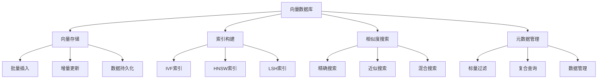

# 向量数据库选型

## 引言

向量数据库是RAG系统中存储和检索向量数据的关键组件。选择合适的向量数据库对系统性能、可扩展性和成本效益至关重要。本文将深入探讨主流向量数据库的特点、选型标准和使用方法。

## 向量数据库概述

### 什么是向量数据库

向量数据库是专门用于存储、索引和检索高维向量数据的数据库系统。它支持高效的相似度搜索，是RAG系统的重要组成部分。

### 向量数据库的核心功能



### 向量数据库的关键特性

1. **高性能搜索**：支持毫秒级的向量相似度搜索
2. **可扩展性**：支持大规模向量数据的存储和检索
3. **索引优化**：提供多种索引算法优化搜索性能
4. **元数据支持**：支持向量与元数据的联合查询

## 主流向量数据库对比

### 1. Pinecone

#### 特点
- **云服务**：完全托管的向量数据库服务
- **易用性**：简单的API接口
- **高性能**：优化的搜索性能
- **可扩展性**：自动扩缩容

#### 使用示例

```python
import pinecone
from typing import List, Dict, Any

class PineconeVectorDB:
    def __init__(self, api_key: str, environment: str):
        pinecone.init(api_key=api_key, environment=environment)
        self.index = None
    
    def create_index(self, index_name: str, dimension: int, metric: str = 'cosine'):
        """创建索引"""
        if index_name not in pinecone.list_indexes():
            pinecone.create_index(
                name=index_name,
                dimension=dimension,
                metric=metric
            )
        
        self.index = pinecone.Index(index_name)
    
    def upsert_vectors(self, vectors: List[Dict[str, Any]]):
        """插入或更新向量"""
        if not self.index:
            raise ValueError("Index not initialized")
        
        self.index.upsert(vectors)
    
    def search_vectors(self, query_vector: List[float], top_k: int = 10, 
                      filter_dict: Dict = None) -> List[Dict]:
        """搜索向量"""
        if not self.index:
            raise ValueError("Index not initialized")
        
        results = self.index.query(
            vector=query_vector,
            top_k=top_k,
            filter=filter_dict,
            include_metadata=True
        )
        
        return results['matches']
    
    def delete_vectors(self, ids: List[str]):
        """删除向量"""
        if not self.index:
            raise ValueError("Index not initialized")
        
        self.index.delete(ids)
    
    def get_stats(self) -> Dict[str, Any]:
        """获取索引统计信息"""
        if not self.index:
            raise ValueError("Index not initialized")
        
        return self.index.describe_index_stats()
```

#### 优缺点分析

**优点：**
- 使用简单，无需维护基础设施
- 高性能，优化的搜索算法
- 自动扩缩容
- 丰富的API功能

**缺点：**
- 成本较高
- 依赖网络连接
- 定制化程度有限
- 数据隐私问题

### 2. Weaviate

#### 特点
- **开源**：完全开源，可自部署
- **功能丰富**：支持多种数据类型和查询方式
- **GraphQL**：使用GraphQL进行查询
- **模块化**：支持多种向量化模型

#### 使用示例

```python
import weaviate
from typing import List, Dict, Any

class WeaviateVectorDB:
    def __init__(self, url: str = "http://localhost:8080"):
        self.client = weaviate.Client(url)
    
    def create_schema(self, class_name: str, properties: List[Dict]):
        """创建数据模式"""
        schema = {
            "class": class_name,
            "description": f"Class for {class_name}",
            "properties": properties,
            "vectorizer": "text2vec-openai"
        }
        
        self.client.schema.create_class(schema)
    
    def add_documents(self, class_name: str, documents: List[Dict]):
        """添加文档"""
        for doc in documents:
            self.client.data_object.create(
                data_object=doc,
                class_name=class_name
            )
    
    def search_documents(self, class_name: str, query: str, 
                        limit: int = 10) -> List[Dict]:
        """搜索文档"""
        result = (
            self.client.query
            .get(class_name, ["content", "title", "metadata"])
            .with_near_text({"concepts": [query]})
            .with_limit(limit)
            .do()
        )
        
        return result["data"]["Get"][class_name]
    
    def hybrid_search(self, class_name: str, query: str, 
                     alpha: float = 0.7, limit: int = 10) -> List[Dict]:
        """混合搜索"""
        result = (
            self.client.query
            .get(class_name, ["content", "title", "metadata"])
            .with_hybrid(
                query=query,
                alpha=alpha
            )
            .with_limit(limit)
            .do()
        )
        
        return result["data"]["Get"][class_name]
    
    def get_schema(self) -> Dict:
        """获取数据模式"""
        return self.client.schema.get()
```

#### 优缺点分析

**优点：**
- 开源免费
- 功能丰富，支持多种查询方式
- 支持GraphQL查询
- 可自部署，数据隐私好

**缺点：**
- 配置复杂
- 需要自己维护
- 学习曲线陡峭
- 性能调优需要专业知识

### 3. Chroma

#### 特点
- **轻量级**：简单易用的向量数据库
- **Python原生**：专为Python应用设计
- **本地部署**：支持本地和云部署
- **简单API**：直观的API接口

#### 使用示例

```python
import chromadb
from chromadb.config import Settings
from typing import List, Dict, Any

class ChromaVectorDB:
    def __init__(self, persist_directory: str = "./chroma_db"):
        self.client = chromadb.Client(Settings(
            chroma_db_impl="duckdb+parquet",
            persist_directory=persist_directory
        ))
        self.collection = None
    
    def create_collection(self, name: str, metadata: Dict = None):
        """创建集合"""
        self.collection = self.client.create_collection(
            name=name,
            metadata=metadata or {"hnsw:space": "cosine"}
        )
    
    def add_documents(self, documents: List[str], metadatas: List[Dict] = None, 
                     ids: List[str] = None):
        """添加文档"""
        if not self.collection:
            raise ValueError("Collection not initialized")
        
        self.collection.add(
            documents=documents,
            metadatas=metadatas,
            ids=ids
        )
    
    def add_embeddings(self, embeddings: List[List[float]], 
                      documents: List[str], metadatas: List[Dict] = None,
                      ids: List[str] = None):
        """添加预计算的向量"""
        if not self.collection:
            raise ValueError("Collection not initialized")
        
        self.collection.add(
            embeddings=embeddings,
            documents=documents,
            metadatas=metadatas,
            ids=ids
        )
    
    def search_documents(self, query_texts: List[str], n_results: int = 10,
                        where: Dict = None) -> Dict:
        """搜索文档"""
        if not self.collection:
            raise ValueError("Collection not initialized")
        
        results = self.collection.query(
            query_texts=query_texts,
            n_results=n_results,
            where=where
        )
        
        return results
    
    def search_embeddings(self, query_embeddings: List[List[float]], 
                         n_results: int = 10, where: Dict = None) -> Dict:
        """搜索预计算的向量"""
        if not self.collection:
            raise ValueError("Collection not initialized")
        
        results = self.collection.query(
            query_embeddings=query_embeddings,
            n_results=n_results,
            where=where
        )
        
        return results
    
    def update_documents(self, ids: List[str], documents: List[str] = None,
                        metadatas: List[Dict] = None):
        """更新文档"""
        if not self.collection:
            raise ValueError("Collection not initialized")
        
        self.collection.update(
            ids=ids,
            documents=documents,
            metadatas=metadatas
        )
    
    def delete_documents(self, ids: List[str]):
        """删除文档"""
        if not self.collection:
            raise ValueError("Collection not initialized")
        
        self.collection.delete(ids)
    
    def get_collection_info(self) -> Dict:
        """获取集合信息"""
        if not self.collection:
            raise ValueError("Collection not initialized")
        
        return self.collection.get()
```

#### 优缺点分析

**优点：**
- 轻量级，易于使用
- Python原生支持
- 支持本地部署
- 简单的API接口

**缺点：**
- 功能相对简单
- 不适合大规模应用
- 社区支持有限
- 性能优化选项少

### 4. Qdrant

#### 特点
- **高性能**：Rust实现，性能优秀
- **可扩展性**：支持分布式部署
- **丰富功能**：支持多种索引和查询方式
- **REST API**：提供RESTful API接口

#### 使用示例

```python
from qdrant_client import QdrantClient
from qdrant_client.models import Distance, VectorParams, PointStruct
from typing import List, Dict, Any

class QdrantVectorDB:
    def __init__(self, url: str = "http://localhost:6333"):
        self.client = QdrantClient(url=url)
        self.collection_name = None
    
    def create_collection(self, collection_name: str, vector_size: int, 
                        distance: Distance = Distance.COSINE):
        """创建集合"""
        self.collection_name = collection_name
        
        self.client.create_collection(
            collection_name=collection_name,
            vectors_config=VectorParams(
                size=vector_size,
                distance=distance
            )
        )
    
    def upsert_points(self, points: List[PointStruct]):
        """插入或更新点"""
        if not self.collection_name:
            raise ValueError("Collection not initialized")
        
        self.client.upsert(
            collection_name=self.collection_name,
            points=points
        )
    
    def search_points(self, query_vector: List[float], limit: int = 10,
                     filter_conditions: Dict = None) -> List[Dict]:
        """搜索点"""
        if not self.collection_name:
            raise ValueError("Collection not initialized")
        
        results = self.client.search(
            collection_name=self.collection_name,
            query_vector=query_vector,
            limit=limit,
            query_filter=filter_conditions
        )
        
        return results
    
    def scroll_points(self, limit: int = 10, offset: str = None) -> Dict:
        """滚动获取点"""
        if not self.collection_name:
            raise ValueError("Collection not initialized")
        
        results = self.client.scroll(
            collection_name=self.collection_name,
            limit=limit,
            offset=offset
        )
        
        return results
    
    def delete_points(self, points_ids: List[str]):
        """删除点"""
        if not self.collection_name:
            raise ValueError("Collection not initialized")
        
        self.client.delete(
            collection_name=self.collection_name,
            points_selector=points_ids
        )
    
    def get_collection_info(self) -> Dict:
        """获取集合信息"""
        if not self.collection_name:
            raise ValueError("Collection not initialized")
        
        return self.client.get_collection(self.collection_name)
```

#### 优缺点分析

**优点：**
- 高性能，Rust实现
- 支持分布式部署
- 丰富的查询功能
- 良好的扩展性

**缺点：**
- 配置相对复杂
- 需要自己维护
- 学习曲线较陡
- 社区支持有限

### 5. Milvus

#### 特点
- **分布式**：支持大规模分布式部署
- **高性能**：优化的向量搜索性能
- **可扩展性**：支持PB级数据存储
- **企业级**：提供企业级功能

#### 使用示例

```python
from pymilvus import connections, Collection, FieldSchema, CollectionSchema, DataType
from typing import List, Dict, Any

class MilvusVectorDB:
    def __init__(self, host: str = "localhost", port: str = "19530"):
        self.host = host
        self.port = port
        self.collection = None
    
    def connect(self):
        """连接数据库"""
        connections.connect("default", host=self.host, port=self.port)
    
    def create_collection(self, collection_name: str, vector_dim: int):
        """创建集合"""
        # 定义字段
        fields = [
            FieldSchema(name="id", dtype=DataType.INT64, is_primary=True, auto_id=True),
            FieldSchema(name="text", dtype=DataType.VARCHAR, max_length=65535),
            FieldSchema(name="vector", dtype=DataType.FLOAT_VECTOR, dim=vector_dim)
        ]
        
        # 创建集合模式
        schema = CollectionSchema(fields, f"Collection for {collection_name}")
        
        # 创建集合
        self.collection = Collection(collection_name, schema)
        
        # 创建索引
        index_params = {
            "metric_type": "COSINE",
            "index_type": "IVF_FLAT",
            "params": {"nlist": 1024}
        }
        
        self.collection.create_index("vector", index_params)
    
    def insert_data(self, texts: List[str], vectors: List[List[float]]):
        """插入数据"""
        if not self.collection:
            raise ValueError("Collection not initialized")
        
        data = [texts, vectors]
        self.collection.insert(data)
        self.collection.flush()
    
    def search_vectors(self, query_vectors: List[List[float]], 
                      top_k: int = 10) -> List[Dict]:
        """搜索向量"""
        if not self.collection:
            raise ValueError("Collection not initialized")
        
        # 加载集合
        self.collection.load()
        
        # 搜索参数
        search_params = {
            "metric_type": "COSINE",
            "params": {"nprobe": 10}
        }
        
        # 执行搜索
        results = self.collection.search(
            data=query_vectors,
            anns_field="vector",
            param=search_params,
            limit=top_k,
            output_fields=["text"]
        )
        
        return results
    
    def get_collection_stats(self) -> Dict:
        """获取集合统计信息"""
        if not self.collection:
            raise ValueError("Collection not initialized")
        
        return self.collection.get_stats()
```

#### 优缺点分析

**优点：**
- 支持大规模分布式部署
- 高性能向量搜索
- 企业级功能
- 良好的扩展性

**缺点：**
- 配置复杂
- 资源消耗大
- 学习曲线陡峭
- 维护成本高

## 向量数据库选型指南

### 1. 根据应用规模选择

#### 小型应用（< 100万向量）

```python
def choose_small_scale_db(requirements: dict) -> str:
    """选择小型应用数据库"""
    if requirements['ease_of_use']:
        return 'Chroma'
    elif requirements['features']:
        return 'Weaviate'
    else:
        return 'Qdrant'
```

#### 中型应用（100万 - 1000万向量）

```python
def choose_medium_scale_db(requirements: dict) -> str:
    """选择中型应用数据库"""
    if requirements['cloud_service']:
        return 'Pinecone'
    elif requirements['performance']:
        return 'Qdrant'
    else:
        return 'Weaviate'
```

#### 大型应用（> 1000万向量）

```python
def choose_large_scale_db(requirements: dict) -> str:
    """选择大型应用数据库"""
    if requirements['distributed']:
        return 'Milvus'
    elif requirements['cloud_service']:
        return 'Pinecone'
    else:
        return 'Qdrant'
```

### 2. 根据技术栈选择

#### Python应用

```python
def choose_python_db(requirements: dict) -> str:
    """选择Python应用数据库"""
    if requirements['simplicity']:
        return 'Chroma'
    elif requirements['features']:
        return 'Weaviate'
    else:
        return 'Qdrant'
```

#### 微服务架构

```python
def choose_microservice_db(requirements: dict) -> str:
    """选择微服务架构数据库"""
    if requirements['api_friendly']:
        return 'Qdrant'
    elif requirements['graphql']:
        return 'Weaviate'
    else:
        return 'Milvus'
```

### 3. 根据部署方式选择

#### 云服务部署

```python
def choose_cloud_db(requirements: dict) -> str:
    """选择云服务数据库"""
    if requirements['managed_service']:
        return 'Pinecone'
    elif requirements['self_hosted']:
        return 'Weaviate'
    else:
        return 'Qdrant'
```

#### 本地部署

```python
def choose_local_db(requirements: dict) -> str:
    """选择本地部署数据库"""
    if requirements['simplicity']:
        return 'Chroma'
    elif requirements['performance']:
        return 'Qdrant'
    else:
        return 'Weaviate'
```

## 性能对比测试

### 1. 搜索性能测试

```python
class VectorDBPerformanceTest:
    def __init__(self):
        self.test_vectors = self._generate_test_vectors()
        self.test_queries = self._generate_test_queries()
    
    def test_search_performance(self, db_class, db_config: dict) -> dict:
        """测试搜索性能"""
        import time
        
        # 初始化数据库
        db = db_class(**db_config)
        
        # 插入测试数据
        start_time = time.time()
        db.insert_vectors(self.test_vectors)
        insert_time = time.time() - start_time
        
        # 测试搜索性能
        search_times = []
        for query in self.test_queries:
            start_time = time.time()
            results = db.search_vectors(query, top_k=10)
            search_time = time.time() - start_time
            search_times.append(search_time)
        
        return {
            'insert_time': insert_time,
            'avg_search_time': sum(search_times) / len(search_times),
            'max_search_time': max(search_times),
            'min_search_time': min(search_times)
        }
    
    def _generate_test_vectors(self, count: int = 10000, dim: int = 384) -> list:
        """生成测试向量"""
        import numpy as np
        return np.random.rand(count, dim).tolist()
    
    def _generate_test_queries(self, count: int = 100, dim: int = 384) -> list:
        """生成测试查询"""
        import numpy as np
        return np.random.rand(count, dim).tolist()
```

### 2. 内存使用测试

```python
class MemoryUsageTest:
    def __init__(self):
        self.memory_usage = {}
    
    def test_memory_usage(self, db_class, db_config: dict) -> dict:
        """测试内存使用"""
        import psutil
        import time
        
        # 记录初始内存
        initial_memory = psutil.Process().memory_info().rss / 1024 / 1024
        
        # 初始化数据库
        db = db_class(**db_config)
        
        # 记录初始化后内存
        init_memory = psutil.Process().memory_info().rss / 1024 / 1024
        
        # 插入数据
        test_vectors = self._generate_test_vectors(10000)
        db.insert_vectors(test_vectors)
        
        # 记录插入后内存
        insert_memory = psutil.Process().memory_info().rss / 1024 / 1024
        
        return {
            'initial_memory': initial_memory,
            'init_memory': init_memory,
            'insert_memory': insert_memory,
            'memory_overhead': insert_memory - initial_memory
        }
    
    def _generate_test_vectors(self, count: int, dim: int = 384) -> list:
        """生成测试向量"""
        import numpy as np
        return np.random.rand(count, dim).tolist()
```

## 向量数据库优化

### 1. 索引优化

```python
class IndexOptimizer:
    def __init__(self, db):
        self.db = db
    
    def optimize_index(self, collection_name: str, vector_count: int):
        """优化索引"""
        if vector_count < 10000:
            # 小规模数据使用精确搜索
            return self._create_exact_index(collection_name)
        elif vector_count < 1000000:
            # 中等规模数据使用IVF索引
            return self._create_ivf_index(collection_name)
        else:
            # 大规模数据使用HNSW索引
            return self._create_hnsw_index(collection_name)
    
    def _create_exact_index(self, collection_name: str):
        """创建精确索引"""
        pass
    
    def _create_ivf_index(self, collection_name: str):
        """创建IVF索引"""
        pass
    
    def _create_hnsw_index(self, collection_name: str):
        """创建HNSW索引"""
        pass
```

### 2. 查询优化

```python
class QueryOptimizer:
    def __init__(self, db):
        self.db = db
    
    def optimize_query(self, query_vector: list, top_k: int = 10) -> dict:
        """优化查询"""
        # 根据查询向量调整搜索参数
        if self._is_simple_query(query_vector):
            return self._simple_search(query_vector, top_k)
        else:
            return self._complex_search(query_vector, top_k)
    
    def _is_simple_query(self, query_vector: list) -> bool:
        """判断是否为简单查询"""
        # 检查向量是否稀疏
        non_zero_count = sum(1 for x in query_vector if x != 0)
        return non_zero_count < len(query_vector) * 0.1
    
    def _simple_search(self, query_vector: list, top_k: int) -> dict:
        """简单搜索"""
        pass
    
    def _complex_search(self, query_vector: list, top_k: int) -> dict:
        """复杂搜索"""
        pass
```

### 3. 缓存优化

```python
class VectorDBCache:
    def __init__(self, db, cache_size: int = 1000):
        self.db = db
        self.cache = {}
        self.cache_size = cache_size
        self.access_count = {}
    
    def search_with_cache(self, query_vector: list, top_k: int = 10) -> list:
        """带缓存的搜索"""
        query_hash = hash(tuple(query_vector))
        
        if query_hash in self.cache:
            self.access_count[query_hash] = self.access_count.get(query_hash, 0) + 1
            return self.cache[query_hash]
        
        # 执行搜索
        results = self.db.search_vectors(query_vector, top_k)
        
        # 添加到缓存
        self._add_to_cache(query_hash, results)
        
        return results
    
    def _add_to_cache(self, query_hash: int, results: list):
        """添加到缓存"""
        if len(self.cache) >= self.cache_size:
            # 移除最少使用的项
            least_used = min(self.access_count.items(), key=lambda x: x[1])
            del self.cache[least_used[0]]
            del self.access_count[least_used[0]]
        
        self.cache[query_hash] = results
        self.access_count[query_hash] = 1
```

## 最佳实践

### 1. 数据库选择策略

```python
def select_vector_db(requirements: dict) -> str:
    """选择向量数据库"""
    # 根据数据规模选择
    if requirements['data_size'] < 1000000:
        if requirements['ease_of_use']:
            return 'Chroma'
        else:
            return 'Weaviate'
    
    elif requirements['data_size'] < 10000000:
        if requirements['cloud_service']:
            return 'Pinecone'
        else:
            return 'Qdrant'
    
    else:
        if requirements['distributed']:
            return 'Milvus'
        else:
            return 'Qdrant'
```

### 2. 性能优化建议

```python
class VectorDBBestPractices:
    def __init__(self, db):
        self.db = db
    
    def apply_best_practices(self):
        """应用最佳实践"""
        # 1. 批量插入
        self._batch_insert()
        
        # 2. 索引优化
        self._optimize_index()
        
        # 3. 查询优化
        self._optimize_queries()
        
        # 4. 缓存策略
        self._implement_caching()
    
    def _batch_insert(self):
        """批量插入"""
        pass
    
    def _optimize_index(self):
        """优化索引"""
        pass
    
    def _optimize_queries(self):
        """优化查询"""
        pass
    
    def _implement_caching(self):
        """实现缓存"""
        pass
```

### 3. 监控和维护

```python
class VectorDBMonitor:
    def __init__(self, db):
        self.db = db
        self.metrics = {}
    
    def monitor_performance(self):
        """监控性能"""
        # 监控搜索延迟
        search_latency = self._measure_search_latency()
        
        # 监控内存使用
        memory_usage = self._measure_memory_usage()
        
        # 监控索引状态
        index_status = self._check_index_status()
        
        self.metrics.update({
            'search_latency': search_latency,
            'memory_usage': memory_usage,
            'index_status': index_status
        })
        
        return self.metrics
    
    def _measure_search_latency(self) -> float:
        """测量搜索延迟"""
        pass
    
    def _measure_memory_usage(self) -> float:
        """测量内存使用"""
        pass
    
    def _check_index_status(self) -> dict:
        """检查索引状态"""
        pass
```

## 总结

向量数据库是RAG系统的关键组件，选择合适的数据库对系统性能至关重要。本文介绍了主流向量数据库的特点、选型标准和使用方法。

关键要点：
1. **数据库选择**：根据应用规模、技术栈、部署方式选择合适数据库
2. **性能优化**：通过索引优化、查询优化、缓存优化提升性能
3. **最佳实践**：遵循最佳实践确保系统稳定运行
4. **监控维护**：建立监控机制确保系统健康运行

在下一篇文章中，我们将探讨检索技术进阶，包括相似度检索算法、混合检索策略等高级技术。

---

**下一步学习建议：**
- 阅读《相似度检索算法》，了解各种检索算法的原理和应用
- 实践不同的向量数据库，比较它们的效果
- 关注向量数据库技术的最新发展和优化方案
