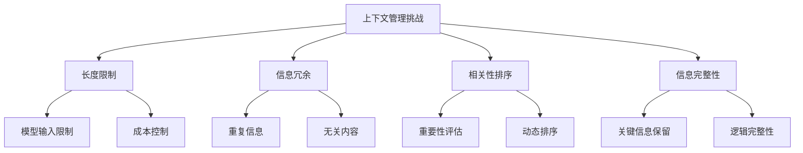

# 上下文管理

## 引言

上下文管理是RAG系统中的关键技术，直接影响生成质量和系统性能。有效的上下文管理能够在有限的输入长度内最大化信息价值，确保模型获得最相关的信息来生成准确回答。本文将深入探讨上下文管理的策略、技术和最佳实践。

## 上下文管理概述

### 什么是上下文管理

上下文管理是指在RAG系统中，对检索到的文档信息进行组织、筛选、排序和优化的过程。它确保传递给大语言模型的上下文信息既相关又完整，同时不超过模型的输入长度限制。

### 上下文管理的挑战



### 上下文管理的目标

1. **最大化相关性**：确保上下文与查询高度相关
2. **优化信息密度**：在有限空间内提供最大价值
3. **保持逻辑完整性**：维护信息的逻辑结构
4. **控制成本**：在质量和成本之间找到平衡

## 基础上下文管理

### 1. 简单截断策略

#### 实现示例

```python
class SimpleTruncationManager:
    def __init__(self, max_length: int = 4000):
        self.max_length = max_length
    
    def manage_context(self, documents: List[str], query: str) -> str:
        """简单的上下文管理"""
        # 合并所有文档
        combined_context = "\n\n".join(documents)
        
        # 如果超过长度限制，进行截断
        if len(combined_context) > self.max_length:
            combined_context = combined_context[:self.max_length]
            # 尝试在句子边界截断
            combined_context = self._truncate_at_sentence_boundary(combined_context)
        
        return combined_context
    
    def _truncate_at_sentence_boundary(self, text: str) -> str:
        """在句子边界截断"""
        sentence_endings = ['。', '！', '？', '.', '!', '?']
        
        for i in range(len(text) - 1, -1, -1):
            if text[i] in sentence_endings:
                return text[:i + 1]
        
        return text
```

### 2. 基于长度的上下文管理

#### 实现示例

```python
class LengthBasedContextManager:
    def __init__(self, max_length: int = 4000, overlap_ratio: float = 0.1):
        self.max_length = max_length
        self.overlap_ratio = overlap_ratio
    
    def manage_context(self, documents: List[str], query: str) -> str:
        """基于长度的上下文管理"""
        # 计算每个文档的重要性分数
        doc_scores = self._calculate_document_scores(documents, query)
        
        # 按重要性排序
        sorted_docs = sorted(zip(documents, doc_scores), key=lambda x: x[1], reverse=True)
        
        # 选择文档直到达到长度限制
        selected_docs = []
        current_length = 0
        
        for doc, score in sorted_docs:
            doc_length = len(doc)
            
            if current_length + doc_length <= self.max_length:
                selected_docs.append(doc)
                current_length += doc_length
            else:
                # 如果添加完整文档会超出限制，尝试截断
                remaining_length = self.max_length - current_length
                if remaining_length > 100:  # 至少保留100个字符
                    truncated_doc = self._smart_truncate(doc, remaining_length)
                    selected_docs.append(truncated_doc)
                break
        
        return "\n\n".join(selected_docs)
    
    def _calculate_document_scores(self, documents: List[str], query: str) -> List[float]:
        """计算文档重要性分数"""
        query_words = set(query.lower().split())
        scores = []
        
        for doc in documents:
            doc_words = set(doc.lower().split())
            
            # 计算词汇重叠
            overlap = len(query_words.intersection(doc_words))
            total_words = len(query_words.union(doc_words))
            
            if total_words > 0:
                jaccard_score = overlap / total_words
            else:
                jaccard_score = 0
            
            # 考虑文档长度
            length_score = min(len(doc.split()) / 200, 1.0)
            
            # 综合分数
            combined_score = 0.7 * jaccard_score + 0.3 * length_score
            scores.append(combined_score)
        
        return scores
    
    def _smart_truncate(self, document: str, max_length: int) -> str:
        """智能截断文档"""
        if len(document) <= max_length:
            return document
        
        # 尝试在段落边界截断
        paragraphs = document.split('\n\n')
        truncated_paragraphs = []
        current_length = 0
        
        for para in paragraphs:
            if current_length + len(para) <= max_length:
                truncated_paragraphs.append(para)
                current_length += len(para)
            else:
                # 如果段落太长，在句子边界截断
                remaining_length = max_length - current_length
                if remaining_length > 50:
                    truncated_para = self._truncate_at_sentence_boundary(para, remaining_length)
                    truncated_paragraphs.append(truncated_para)
                break
        
        return '\n\n'.join(truncated_paragraphs)
    
    def _truncate_at_sentence_boundary(self, text: str, max_length: int) -> str:
        """在句子边界截断"""
        if len(text) <= max_length:
            return text
        
        sentence_endings = ['。', '！', '？', '.', '!', '?']
        
        for i in range(max_length - 1, -1, -1):
            if text[i] in sentence_endings:
                return text[:i + 1]
        
        return text[:max_length]
```

## 高级上下文管理

### 1. 语义感知的上下文管理

#### 实现示例

```python
from sentence_transformers import SentenceTransformer
import numpy as np
from sklearn.metrics.pairwise import cosine_similarity

class SemanticContextManager:
    def __init__(self, model_name: str = 'all-MiniLM-L6-v2', max_length: int = 4000):
        self.model = SentenceTransformer(model_name)
        self.max_length = max_length
    
    def manage_context(self, documents: List[str], query: str) -> str:
        """语义感知的上下文管理"""
        # 计算查询和文档的语义相似度
        similarities = self._calculate_semantic_similarities(documents, query)
        
        # 按相似度排序
        sorted_docs = sorted(zip(documents, similarities), key=lambda x: x[1], reverse=True)
        
        # 选择最相关的文档片段
        selected_chunks = self._select_relevant_chunks(sorted_docs, query)
        
        # 组织上下文
        organized_context = self._organize_context(selected_chunks, query)
        
        return organized_context
    
    def _calculate_semantic_similarities(self, documents: List[str], query: str) -> List[float]:
        """计算语义相似度"""
        query_embedding = self.model.encode([query])
        doc_embeddings = self.model.encode(documents)
        
        similarities = cosine_similarity(query_embedding, doc_embeddings)[0]
        return similarities.tolist()
    
    def _select_relevant_chunks(self, sorted_docs: List[Tuple[str, float]], 
                              query: str) -> List[Tuple[str, float]]:
        """选择相关文档片段"""
        selected_chunks = []
        current_length = 0
        
        for doc, similarity in sorted_docs:
            if similarity < 0.3:  # 相似度阈值
                break
            
            # 将长文档分块
            chunks = self._split_document_into_chunks(doc)
            
            # 计算每个块与查询的相似度
            chunk_similarities = self._calculate_chunk_similarities(chunks, query)
            
            # 选择最相关的块
            for chunk, chunk_sim in zip(chunks, chunk_similarities):
                if current_length + len(chunk) <= self.max_length:
                    selected_chunks.append((chunk, chunk_sim))
                    current_length += len(chunk)
                else:
                    break
            
            if current_length >= self.max_length:
                break
        
        return selected_chunks
    
    def _split_document_into_chunks(self, document: str, chunk_size: int = 500) -> List[str]:
        """将文档分割成块"""
        words = document.split()
        chunks = []
        
        for i in range(0, len(words), chunk_size):
            chunk = ' '.join(words[i:i + chunk_size])
            chunks.append(chunk)
        
        return chunks
    
    def _calculate_chunk_similarities(self, chunks: List[str], query: str) -> List[float]:
        """计算块相似度"""
        if not chunks:
            return []
        
        query_embedding = self.model.encode([query])
        chunk_embeddings = self.model.encode(chunks)
        
        similarities = cosine_similarity(query_embedding, chunk_embeddings)[0]
        return similarities.tolist()
    
    def _organize_context(self, chunks: List[Tuple[str, float]], query: str) -> str:
        """组织上下文"""
        # 按相似度排序
        sorted_chunks = sorted(chunks, key=lambda x: x[1], reverse=True)
        
        # 添加查询相关的上下文
        context_parts = [f"查询: {query}\n"]
        
        # 添加相关文档片段
        for i, (chunk, similarity) in enumerate(sorted_chunks):
            context_parts.append(f"相关文档 {i+1} (相似度: {similarity:.3f}):\n{chunk}")
        
        return "\n\n".join(context_parts)
```

### 2. 动态上下文管理

#### 实现示例

```python
class DynamicContextManager:
    def __init__(self, max_length: int = 4000):
        self.max_length = max_length
        self.context_history = []
    
    def manage_context(self, documents: List[str], query: str, 
                      conversation_history: List[Dict] = None) -> str:
        """动态上下文管理"""
        # 分析查询类型
        query_type = self._analyze_query_type(query)
        
        # 根据查询类型调整策略
        if query_type == 'follow_up':
            context = self._handle_follow_up_query(documents, query, conversation_history)
        elif query_type == 'clarification':
            context = self._handle_clarification_query(documents, query)
        elif query_type == 'comparison':
            context = self._handle_comparison_query(documents, query)
        else:
            context = self._handle_general_query(documents, query)
        
        # 记录上下文历史
        self._record_context_history(query, context)
        
        return context
    
    def _analyze_query_type(self, query: str) -> str:
        """分析查询类型"""
        query_lower = query.lower()
        
        # 后续问题
        if any(word in query_lower for word in ['还有', '另外', '其他', '继续']):
            return 'follow_up'
        
        # 澄清问题
        elif any(word in query_lower for word in ['具体', '详细', '解释', '说明']):
            return 'clarification'
        
        # 比较问题
        elif any(word in query_lower for word in ['比较', '对比', '区别', '差异']):
            return 'comparison'
        
        else:
            return 'general'
    
    def _handle_follow_up_query(self, documents: List[str], query: str, 
                               conversation_history: List[Dict]) -> str:
        """处理后续问题"""
        # 结合历史上下文
        historical_context = self._extract_historical_context(conversation_history)
        
        # 选择与历史相关的文档
        relevant_docs = self._select_historically_relevant_docs(documents, historical_context)
        
        # 组织上下文
        context_parts = []
        if historical_context:
            context_parts.append(f"之前的讨论: {historical_context}")
        
        context_parts.append(f"当前问题: {query}")
        context_parts.append(f"相关信息: {' '.join(relevant_docs)}")
        
        return "\n\n".join(context_parts)
    
    def _handle_clarification_query(self, documents: List[str], query: str) -> str:
        """处理澄清问题"""
        # 选择最相关的文档片段
        relevant_chunks = self._select_most_relevant_chunks(documents, query)
        
        # 组织上下文，突出关键信息
        context_parts = [f"问题: {query}"]
        
        for i, chunk in enumerate(relevant_chunks):
            context_parts.append(f"关键信息 {i+1}: {chunk}")
        
        return "\n\n".join(context_parts)
    
    def _handle_comparison_query(self, documents: List[str], query: str) -> str:
        """处理比较问题"""
        # 识别比较对象
        comparison_objects = self._identify_comparison_objects(query)
        
        # 为每个比较对象选择相关文档
        object_docs = {}
        for obj in comparison_objects:
            object_docs[obj] = self._select_object_related_docs(documents, obj)
        
        # 组织比较上下文
        context_parts = [f"比较问题: {query}"]
        
        for obj, docs in object_docs.items():
            context_parts.append(f"{obj}相关信息: {' '.join(docs)}")
        
        return "\n\n".join(context_parts)
    
    def _handle_general_query(self, documents: List[str], query: str) -> str:
        """处理一般问题"""
        # 使用标准上下文管理
        return "\n\n".join(documents)
    
    def _extract_historical_context(self, conversation_history: List[Dict]) -> str:
        """提取历史上下文"""
        if not conversation_history:
            return ""
        
        # 提取最近的几个对话
        recent_history = conversation_history[-3:]  # 最近3轮对话
        
        context_parts = []
        for turn in recent_history:
            if 'query' in turn:
                context_parts.append(f"问题: {turn['query']}")
            if 'response' in turn:
                context_parts.append(f"回答: {turn['response'][:200]}...")  # 截断回答
        
        return "\n".join(context_parts)
    
    def _select_historically_relevant_docs(self, documents: List[str], 
                                         historical_context: str) -> List[str]:
        """选择与历史相关的文档"""
        if not historical_context:
            return documents
        
        # 计算文档与历史上下文的相似度
        historical_words = set(historical_context.lower().split())
        doc_scores = []
        
        for doc in documents:
            doc_words = set(doc.lower().split())
            overlap = len(historical_words.intersection(doc_words))
            score = overlap / len(historical_words.union(doc_words)) if historical_words.union(doc_words) else 0
            doc_scores.append(score)
        
        # 选择最相关的文档
        sorted_docs = sorted(zip(documents, doc_scores), key=lambda x: x[1], reverse=True)
        return [doc for doc, score in sorted_docs[:3]]  # 返回前3个最相关的文档
    
    def _select_most_relevant_chunks(self, documents: List[str], query: str) -> List[str]:
        """选择最相关的文档片段"""
        query_words = set(query.lower().split())
        chunk_scores = []
        
        for doc in documents:
            # 将文档分块
            chunks = self._split_document_into_chunks(doc)
            
            for chunk in chunks:
                chunk_words = set(chunk.lower().split())
                overlap = len(query_words.intersection(chunk_words))
                score = overlap / len(query_words.union(chunk_words)) if query_words.union(chunk_words) else 0
                chunk_scores.append((chunk, score))
        
        # 选择得分最高的块
        sorted_chunks = sorted(chunk_scores, key=lambda x: x[1], reverse=True)
        return [chunk for chunk, score in sorted_chunks[:5]]  # 返回前5个最相关的块
    
    def _identify_comparison_objects(self, query: str) -> List[str]:
        """识别比较对象"""
        # 简单的比较对象识别
        comparison_keywords = ['和', '与', 'vs', '对比', '比较']
        objects = []
        
        for keyword in comparison_keywords:
            if keyword in query:
                parts = query.split(keyword)
                objects.extend([part.strip() for part in parts])
        
        return [obj for obj in objects if len(obj) > 1]
    
    def _select_object_related_docs(self, documents: List[str], obj: str) -> List[str]:
        """选择与对象相关的文档"""
        obj_words = set(obj.lower().split())
        doc_scores = []
        
        for doc in documents:
            doc_words = set(doc.lower().split())
            overlap = len(obj_words.intersection(doc_words))
            score = overlap / len(obj_words.union(doc_words)) if obj_words.union(doc_words) else 0
            doc_scores.append((doc, score))
        
        # 选择最相关的文档
        sorted_docs = sorted(doc_scores, key=lambda x: x[1], reverse=True)
        return [doc for doc, score in sorted_docs[:2]]  # 返回前2个最相关的文档
    
    def _split_document_into_chunks(self, document: str, chunk_size: int = 300) -> List[str]:
        """将文档分割成块"""
        sentences = document.split('。')
        chunks = []
        current_chunk = ""
        
        for sentence in sentences:
            if len(current_chunk) + len(sentence) <= chunk_size:
                current_chunk += sentence + "。"
            else:
                if current_chunk:
                    chunks.append(current_chunk)
                current_chunk = sentence + "。"
        
        if current_chunk:
            chunks.append(current_chunk)
        
        return chunks
    
    def _record_context_history(self, query: str, context: str):
        """记录上下文历史"""
        self.context_history.append({
            'query': query,
            'context': context,
            'timestamp': time.time()
        })
        
        # 只保留最近的历史
        if len(self.context_history) > 10:
            self.context_history = self.context_history[-10:]
```

## 上下文优化策略

### 1. 信息去重

#### 实现示例

```python
class ContextDeduplicator:
    def __init__(self, similarity_threshold: float = 0.8):
        self.similarity_threshold = similarity_threshold
    
    def deduplicate_context(self, documents: List[str]) -> List[str]:
        """去重上下文"""
        if not documents:
            return []
        
        # 计算文档间的相似度
        similarity_matrix = self._calculate_similarity_matrix(documents)
        
        # 找到重复的文档
        duplicates = self._find_duplicates(similarity_matrix)
        
        # 移除重复文档
        unique_documents = self._remove_duplicates(documents, duplicates)
        
        return unique_documents
    
    def _calculate_similarity_matrix(self, documents: List[str]) -> np.ndarray:
        """计算相似度矩阵"""
        n = len(documents)
        similarity_matrix = np.zeros((n, n))
        
        for i in range(n):
            for j in range(i + 1, n):
                similarity = self._calculate_similarity(documents[i], documents[j])
                similarity_matrix[i][j] = similarity
                similarity_matrix[j][i] = similarity
        
        return similarity_matrix
    
    def _calculate_similarity(self, doc1: str, doc2: str) -> float:
        """计算文档相似度"""
        words1 = set(doc1.lower().split())
        words2 = set(doc2.lower().split())
        
        intersection = words1.intersection(words2)
        union = words1.union(words2)
        
        if len(union) == 0:
            return 0.0
        
        return len(intersection) / len(union)
    
    def _find_duplicates(self, similarity_matrix: np.ndarray) -> List[Tuple[int, int]]:
        """找到重复文档"""
        duplicates = []
        n = similarity_matrix.shape[0]
        
        for i in range(n):
            for j in range(i + 1, n):
                if similarity_matrix[i][j] >= self.similarity_threshold:
                    duplicates.append((i, j))
        
        return duplicates
    
    def _remove_duplicates(self, documents: List[str], 
                          duplicates: List[Tuple[int, int]]) -> List[str]:
        """移除重复文档"""
        to_remove = set()
        
        for i, j in duplicates:
            # 保留较长的文档
            if len(documents[i]) >= len(documents[j]):
                to_remove.add(j)
            else:
                to_remove.add(i)
        
        # 返回未标记为删除的文档
        unique_documents = [doc for i, doc in enumerate(documents) if i not in to_remove]
        
        return unique_documents
```

### 2. 信息压缩

#### 实现示例

```python
class ContextCompressor:
    def __init__(self, compression_ratio: float = 0.7):
        self.compression_ratio = compression_ratio
    
    def compress_context(self, documents: List[str], query: str) -> str:
        """压缩上下文"""
        # 提取关键信息
        key_information = self._extract_key_information(documents, query)
        
        # 压缩冗余信息
        compressed_info = self._compress_redundant_information(key_information)
        
        # 组织压缩后的上下文
        organized_context = self._organize_compressed_context(compressed_info, query)
        
        return organized_context
    
    def _extract_key_information(self, documents: List[str], query: str) -> List[str]:
        """提取关键信息"""
        query_words = set(query.lower().split())
        key_sentences = []
        
        for doc in documents:
            sentences = doc.split('。')
            
            for sentence in sentences:
                if sentence.strip():
                    sentence_words = set(sentence.lower().split())
                    overlap = len(query_words.intersection(sentence_words))
                    
                    if overlap > 0:
                        relevance_score = overlap / len(query_words.union(sentence_words))
                        key_sentences.append((sentence, relevance_score))
        
        # 按相关性排序
        key_sentences.sort(key=lambda x: x[1], reverse=True)
        
        return [sentence for sentence, score in key_sentences]
    
    def _compress_redundant_information(self, key_sentences: List[str]) -> List[str]:
        """压缩冗余信息"""
        compressed_sentences = []
        seen_concepts = set()
        
        for sentence in key_sentences:
            # 提取句子中的关键概念
            concepts = self._extract_concepts(sentence)
            
            # 检查是否有新概念
            new_concepts = concepts - seen_concepts
            
            if new_concepts:
                compressed_sentences.append(sentence)
                seen_concepts.update(concepts)
        
        return compressed_sentences
    
    def _extract_concepts(self, sentence: str) -> set:
        """提取句子中的关键概念"""
        # 简单的概念提取
        words = sentence.split()
        concepts = set()
        
        for word in words:
            if len(word) > 3:  # 过滤短词
                concepts.add(word.lower())
        
        return concepts
    
    def _organize_compressed_context(self, compressed_info: List[str], query: str) -> str:
        """组织压缩后的上下文"""
        context_parts = [f"查询: {query}"]
        
        # 添加关键信息
        for i, info in enumerate(compressed_info[:10]):  # 最多10条信息
            context_parts.append(f"关键信息 {i+1}: {info}")
        
        return "\n\n".join(context_parts)
```

## 上下文质量评估

### 1. 上下文相关性评估

#### 实现示例

```python
class ContextRelevanceEvaluator:
    def __init__(self):
        self.evaluation_metrics = {}
    
    def evaluate_context_relevance(self, context: str, query: str) -> Dict[str, float]:
        """评估上下文相关性"""
        metrics = {}
        
        # 词汇重叠度
        metrics['lexical_overlap'] = self._calculate_lexical_overlap(context, query)
        
        # 语义相关性
        metrics['semantic_relevance'] = self._calculate_semantic_relevance(context, query)
        
        # 信息密度
        metrics['information_density'] = self._calculate_information_density(context)
        
        # 结构完整性
        metrics['structural_completeness'] = self._calculate_structural_completeness(context)
        
        return metrics
    
    def _calculate_lexical_overlap(self, context: str, query: str) -> float:
        """计算词汇重叠度"""
        query_words = set(query.lower().split())
        context_words = set(context.lower().split())
        
        intersection = query_words.intersection(context_words)
        union = query_words.union(context_words)
        
        if len(union) == 0:
            return 0.0
        
        return len(intersection) / len(union)
    
    def _calculate_semantic_relevance(self, context: str, query: str) -> float:
        """计算语义相关性"""
        # 使用简单的语义相关性计算
        # 实际应用中可以使用更复杂的语义模型
        
        query_concepts = self._extract_concepts(query)
        context_concepts = self._extract_concepts(context)
        
        intersection = query_concepts.intersection(context_concepts)
        union = query_concepts.union(context_concepts)
        
        if len(union) == 0:
            return 0.0
        
        return len(intersection) / len(union)
    
    def _extract_concepts(self, text: str) -> set:
        """提取概念"""
        # 简单的概念提取
        words = text.lower().split()
        concepts = set()
        
        for word in words:
            if len(word) > 3:  # 过滤短词
                concepts.add(word)
        
        return concepts
    
    def _calculate_information_density(self, context: str) -> float:
        """计算信息密度"""
        # 基于词汇多样性和句子结构计算信息密度
        words = context.split()
        unique_words = set(words)
        
        if len(words) == 0:
            return 0.0
        
        # 词汇多样性
        lexical_diversity = len(unique_words) / len(words)
        
        # 句子复杂度
        sentences = context.split('。')
        avg_sentence_length = sum(len(s.split()) for s in sentences) / len(sentences) if sentences else 0
        
        # 综合信息密度
        information_density = 0.6 * lexical_diversity + 0.4 * min(avg_sentence_length / 20, 1.0)
        
        return information_density
    
    def _calculate_structural_completeness(self, context: str) -> float:
        """计算结构完整性"""
        # 检查是否有完整的句子结构
        sentences = context.split('。')
        complete_sentences = 0
        
        for sentence in sentences:
            if sentence.strip() and len(sentence.split()) > 3:
                complete_sentences += 1
        
        if len(sentences) == 0:
            return 0.0
        
        return complete_sentences / len(sentences)
    
    def get_overall_relevance_score(self, context: str, query: str) -> float:
        """获取整体相关性分数"""
        metrics = self.evaluate_context_relevance(context, query)
        
        # 加权平均
        weights = {
            'lexical_overlap': 0.3,
            'semantic_relevance': 0.4,
            'information_density': 0.2,
            'structural_completeness': 0.1
        }
        
        overall_score = sum(metrics[key] * weights[key] for key in weights)
        
        return overall_score
```

### 2. 上下文效果监控

#### 实现示例

```python
class ContextEffectivenessMonitor:
    def __init__(self):
        self.metrics_history = []
        self.performance_data = {}
    
    def monitor_context_effectiveness(self, context: str, query: str, 
                                     response: str, expected_response: str = None) -> Dict[str, float]:
        """监控上下文效果"""
        metrics = {}
        
        # 上下文质量指标
        relevance_evaluator = ContextRelevanceEvaluator()
        context_metrics = relevance_evaluator.evaluate_context_relevance(context, query)
        metrics.update(context_metrics)
        
        # 响应质量指标
        response_metrics = self._evaluate_response_quality(response, query, context)
        metrics.update(response_metrics)
        
        # 准确性指标（如果有期望响应）
        if expected_response:
            accuracy_metrics = self._evaluate_accuracy(response, expected_response)
            metrics.update(accuracy_metrics)
        
        # 记录指标
        self.metrics_history.append(metrics)
        
        return metrics
    
    def _evaluate_response_quality(self, response: str, query: str, context: str) -> Dict[str, float]:
        """评估响应质量"""
        metrics = {}
        
        # 响应长度
        metrics['response_length'] = len(response)
        
        # 响应与查询的相关性
        metrics['response_query_relevance'] = self._calculate_relevance(response, query)
        
        # 响应与上下文的一致性
        metrics['response_context_consistency'] = self._calculate_consistency(response, context)
        
        return metrics
    
    def _calculate_relevance(self, response: str, query: str) -> float:
        """计算相关性"""
        query_words = set(query.lower().split())
        response_words = set(response.lower().split())
        
        intersection = query_words.intersection(response_words)
        union = query_words.union(response_words)
        
        if len(union) == 0:
            return 0.0
        
        return len(intersection) / len(union)
    
    def _calculate_consistency(self, response: str, context: str) -> float:
        """计算一致性"""
        context_concepts = self._extract_concepts(context)
        response_concepts = self._extract_concepts(response)
        
        intersection = context_concepts.intersection(response_concepts)
        union = context_concepts.union(response_concepts)
        
        if len(union) == 0:
            return 0.0
        
        return len(intersection) / len(union)
    
    def _extract_concepts(self, text: str) -> set:
        """提取概念"""
        words = text.lower().split()
        concepts = set()
        
        for word in words:
            if len(word) > 3:
                concepts.add(word)
        
        return concepts
    
    def _evaluate_accuracy(self, response: str, expected: str) -> Dict[str, float]:
        """评估准确性"""
        from difflib import SequenceMatcher
        
        metrics = {}
        
        # 文本相似度
        similarity = SequenceMatcher(None, response, expected).ratio()
        metrics['text_similarity'] = similarity
        
        # 概念重叠度
        response_concepts = self._extract_concepts(response)
        expected_concepts = self._extract_concepts(expected)
        
        intersection = response_concepts.intersection(expected_concepts)
        union = response_concepts.union(expected_concepts)
        
        if len(union) == 0:
            metrics['concept_overlap'] = 0.0
        else:
            metrics['concept_overlap'] = len(intersection) / len(union)
        
        return metrics
    
    def get_effectiveness_summary(self) -> Dict[str, float]:
        """获取效果摘要"""
        if not self.metrics_history:
            return {}
        
        summary = {}
        
        # 计算每个指标的平均值
        for metric_name in self.metrics_history[0].keys():
            values = [metrics[metric_name] for metrics in self.metrics_history]
            summary[f'{metric_name}_avg'] = sum(values) / len(values)
            summary[f'{metric_name}_max'] = max(values)
            summary[f'{metric_name}_min'] = min(values)
        
        return summary
    
    def detect_context_issues(self) -> List[str]:
        """检测上下文问题"""
        issues = []
        
        if not self.metrics_history:
            return issues
        
        # 分析最近的指标
        recent_metrics = self.metrics_history[-10:]  # 最近10次
        
        # 检查相关性趋势
        relevance_scores = [m.get('lexical_overlap', 0) for m in recent_metrics]
        if len(relevance_scores) > 1:
            avg_relevance = sum(relevance_scores) / len(relevance_scores)
            if avg_relevance < 0.3:
                issues.append("上下文相关性较低")
        
        # 检查信息密度
        density_scores = [m.get('information_density', 0) for m in recent_metrics]
        if len(density_scores) > 1:
            avg_density = sum(density_scores) / len(density_scores)
            if avg_density < 0.5:
                issues.append("上下文信息密度不足")
        
        return issues
```

## 最佳实践

### 1. 上下文管理策略选择

```python
def select_context_management_strategy(requirements: dict) -> str:
    """选择上下文管理策略"""
    if requirements['accuracy'] == 'high' and requirements['latency'] == 'low':
        return 'semantic_context_manager'
    elif requirements['simplicity'] == 'high':
        return 'simple_truncation_manager'
    elif requirements['dynamism'] == 'high':
        return 'dynamic_context_manager'
    else:
        return 'length_based_context_manager'
```

### 2. 上下文优化建议

```python
class ContextOptimizationAdvisor:
    def __init__(self):
        self.optimization_rules = {}
    
    def get_optimization_suggestions(self, context_metrics: Dict[str, float]) -> List[str]:
        """获取优化建议"""
        suggestions = []
        
        # 基于指标提供建议
        if context_metrics.get('lexical_overlap', 0) < 0.3:
            suggestions.append("考虑使用更相关的文档或改进检索策略")
        
        if context_metrics.get('information_density', 0) < 0.5:
            suggestions.append("尝试压缩冗余信息，提高信息密度")
        
        if context_metrics.get('structural_completeness', 0) < 0.7:
            suggestions.append("确保上下文包含完整的句子结构")
        
        return suggestions
```

## 总结

上下文管理是RAG系统成功的关键技术之一。本文介绍了上下文管理的核心概念、策略和最佳实践，包括基础管理方法、高级技术、优化策略和质量评估等方面。

关键要点：
1. **策略选择**：根据应用需求选择合适的上下文管理策略
2. **质量优化**：通过去重、压缩等技术优化上下文质量
3. **动态调整**：根据查询类型和对话历史动态调整上下文
4. **效果监控**：建立完善的评估和监控机制

在下一篇文章中，我们将探讨生成质量控制技术，了解如何确保RAG系统生成高质量的回答。

---

**下一步学习建议：**
- 阅读《生成质量控制》，了解如何提升生成质量
- 实践不同的上下文管理策略，比较它们的效果
- 关注上下文管理技术的最新发展和创新方案
