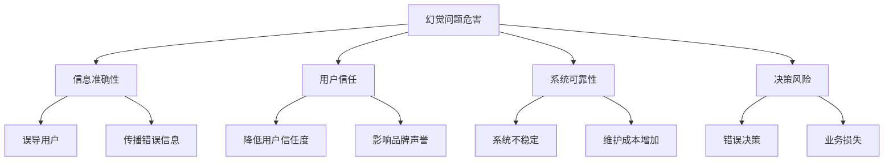

# 幻觉问题解决

## 引言

幻觉问题是RAG系统面临的重要挑战之一。当AI模型生成看似合理但实际错误的信息时，就会产生幻觉。在RAG系统中，幻觉问题可能导致用户获得不准确的信息，影响系统的可信度和实用性。本文将深入探讨幻觉问题的成因、检测方法和解决方案。

## 幻觉问题概述

### 什么是幻觉问题

幻觉问题（Hallucination Problem）是指AI模型生成看似合理但实际错误或不存在信息的问题。在RAG系统中，幻觉问题主要表现为：

1. **事实性幻觉**：生成与源文档不符的事实信息
2. **逻辑性幻觉**：生成逻辑上不一致的内容
3. **引用性幻觉**：错误引用或编造不存在的来源
4. **数值性幻觉**：生成错误的数值或统计数据

### 幻觉问题的危害



### 幻觉问题的成因

1. **模型训练数据**：训练数据中的错误或偏见
2. **上下文限制**：上下文窗口限制导致信息丢失
3. **检索质量**：检索到的文档质量不高或相关性差
4. **生成过程**：生成过程中的随机性和不确定性
5. **提示工程**：提示设计不当导致模型误解

## 幻觉检测技术

### 1. 基于规则的事实检查

#### 实现示例

```python
class FactualConsistencyChecker:
    def __init__(self):
        self.fact_checkers = [
            self._check_numerical_consistency,
            self._check_temporal_consistency,
            self._check_logical_consistency,
            self._check_source_consistency
        ]
    
    def detect_hallucination(self, response: str, context: str, query: str) -> Dict[str, any]:
        """检测幻觉问题"""
        hallucination_report = {
            'response': response,
            'hallucination_score': 0.0,
            'detected_issues': [],
            'confidence_level': 'unknown'
        }
        
        # 应用各种检查器
        for checker in self.fact_checkers:
            check_result = checker(response, context, query)
            hallucination_report['hallucination_score'] += check_result['score']
            
            if check_result['issues']:
                hallucination_report['detected_issues'].extend(check_result['issues'])
        
        # 计算总体幻觉分数
        hallucination_report['hallucination_score'] /= len(self.fact_checkers)
        
        # 确定置信度
        hallucination_report['confidence_level'] = self._determine_confidence_level(
            hallucination_report['hallucination_score']
        )
        
        return hallucination_report
    
    def _check_numerical_consistency(self, response: str, context: str, query: str) -> Dict[str, any]:
        """检查数值一致性"""
        result = {'score': 0.0, 'issues': []}
        
        # 提取响应中的数值
        response_numbers = self._extract_numbers(response)
        context_numbers = self._extract_numbers(context)
        
        # 检查数值是否在上下文中存在
        inconsistent_numbers = []
        for num in response_numbers:
            if num not in context_numbers:
                inconsistent_numbers.append(num)
        
        if inconsistent_numbers:
            result['issues'].append(f"发现不一致的数值: {inconsistent_numbers}")
            result['score'] = 0.3
        else:
            result['score'] = 1.0
        
        return result
    
    def _check_temporal_consistency(self, response: str, context: str, query: str) -> Dict[str, any]:
        """检查时间一致性"""
        result = {'score': 0.0, 'issues': []}
        
        # 提取时间信息
        response_dates = self._extract_dates(response)
        context_dates = self._extract_dates(context)
        
        # 检查时间逻辑
        temporal_issues = []
        for date in response_dates:
            if date not in context_dates:
                temporal_issues.append(date)
        
        if temporal_issues:
            result['issues'].append(f"发现不一致的时间信息: {temporal_issues}")
            result['score'] = 0.4
        else:
            result['score'] = 1.0
        
        return result
    
    def _check_logical_consistency(self, response: str, context: str, query: str) -> Dict[str, any]:
        """检查逻辑一致性"""
        result = {'score': 0.0, 'issues': []}
        
        # 检查逻辑连接词
        logical_indicators = ['因为', '所以', '因此', '但是', '然而', '虽然', '尽管']
        
        logical_inconsistencies = []
        for indicator in logical_indicators:
            if indicator in response:
                # 检查逻辑关系是否合理
                if not self._validate_logical_relation(response, indicator):
                    logical_inconsistencies.append(indicator)
        
        if logical_inconsistencies:
            result['issues'].append(f"发现逻辑不一致: {logical_inconsistencies}")
            result['score'] = 0.5
        else:
            result['score'] = 1.0
        
        return result
    
    def _check_source_consistency(self, response: str, context: str, query: str) -> Dict[str, any]:
        """检查来源一致性"""
        result = {'score': 0.0, 'issues': []}
        
        # 检查是否引用了不存在的来源
        source_indicators = ['根据', '基于', '来源', '引用', '参考']
        
        source_issues = []
        for indicator in source_indicators:
            if indicator in response:
                # 检查引用的来源是否在上下文中
                if not self._validate_source_reference(response, context, indicator):
                    source_issues.append(indicator)
        
        if source_issues:
            result['issues'].append(f"发现来源不一致: {source_issues}")
            result['score'] = 0.3
        else:
            result['score'] = 1.0
        
        return result
    
    def _extract_numbers(self, text: str) -> List[str]:
        """提取数值"""
        import re
        numbers = re.findall(r'\d+\.?\d*', text)
        return numbers
    
    def _extract_dates(self, text: str) -> List[str]:
        """提取日期"""
        import re
        date_patterns = [
            r'\d{4}年\d{1,2}月\d{1,2}日',
            r'\d{4}-\d{1,2}-\d{1,2}',
            r'\d{1,2}/\d{1,2}/\d{4}'
        ]
        
        dates = []
        for pattern in date_patterns:
            dates.extend(re.findall(pattern, text))
        
        return dates
    
    def _validate_logical_relation(self, text: str, indicator: str) -> bool:
        """验证逻辑关系"""
        # 简单的逻辑关系验证
        # 实际应用中可以使用更复杂的逻辑分析
        return True
    
    def _validate_source_reference(self, response: str, context: str, indicator: str) -> bool:
        """验证来源引用"""
        # 检查引用的来源是否在上下文中
        response_words = set(response.lower().split())
        context_words = set(context.lower().split())
        
        # 计算重叠度
        overlap = len(response_words.intersection(context_words))
        return overlap > len(response_words) * 0.3
    
    def _determine_confidence_level(self, hallucination_score: float) -> str:
        """确定置信度"""
        if hallucination_score > 0.8:
            return 'high'
        elif hallucination_score > 0.5:
            return 'medium'
        else:
            return 'low'
```

### 2. 基于模型的一致性检查

#### 实现示例

```python
import torch
import torch.nn as nn
from transformers import AutoTokenizer, AutoModel
from typing import List, Dict, Tuple

class ModelBasedConsistencyChecker:
    def __init__(self, model_name: str = "bert-base-chinese"):
        self.tokenizer = AutoTokenizer.from_pretrained(model_name)
        self.model = AutoModel.from_pretrained(model_name)
        self.device = torch.device("cuda" if torch.cuda.is_available() else "cpu")
        self.model.to(self.device)
        self.model.eval()
        
        # 一致性分类器
        self.consistency_classifier = ConsistencyClassifier(self.model.config.hidden_size)
        self.consistency_classifier.to(self.device)
    
    def check_consistency(self, response: str, context: str, query: str) -> Dict[str, any]:
        """检查一致性"""
        # 准备输入
        input_text = f"{query} [SEP] {context} [SEP] {response}"
        
        # 编码输入
        inputs = self.tokenizer(
            input_text,
            return_tensors="pt",
            truncation=True,
            max_length=512,
            padding=True
        )
        
        inputs = {k: v.to(self.device) for k, v in inputs.items()}
        
        # 获取一致性分数
        with torch.no_grad():
            outputs = self.model(**inputs)
            consistency_scores = self.consistency_classifier(outputs.last_hidden_state)
        
        # 解析一致性分数
        consistency_metrics = self._parse_consistency_scores(consistency_scores)
        
        # 生成一致性报告
        consistency_report = self._generate_consistency_report(
            response, consistency_metrics
        )
        
        return consistency_report
    
    def _parse_consistency_scores(self, consistency_scores: torch.Tensor) -> Dict[str, float]:
        """解析一致性分数"""
        scores = consistency_scores.cpu().numpy()[0]
        
        return {
            'factual_consistency': float(scores[0]),
            'logical_consistency': float(scores[1]),
            'temporal_consistency': float(scores[2]),
            'source_consistency': float(scores[3])
        }
    
    def _generate_consistency_report(self, response: str, 
                                   consistency_metrics: Dict[str, float]) -> Dict[str, any]:
        """生成一致性报告"""
        overall_consistency = sum(consistency_metrics.values()) / len(consistency_metrics)
        
        issues = []
        suggestions = []
        
        # 分析各个一致性指标
        for metric, score in consistency_metrics.items():
            if score < 0.6:
                issues.append(f"{metric}分数较低: {score:.2f}")
                suggestions.append(self._get_consistency_improvement_suggestion(metric))
        
        return {
            'response': response,
            'consistency_metrics': consistency_metrics,
            'overall_consistency': overall_consistency,
            'issues': issues,
            'suggestions': suggestions
        }
    
    def _get_consistency_improvement_suggestion(self, metric: str) -> str:
        """获取一致性改进建议"""
        suggestions = {
            'factual_consistency': "检查事实准确性，确保与源文档一致",
            'logical_consistency': "检查逻辑关系，确保推理正确",
            'temporal_consistency': "检查时间信息，确保时间逻辑正确",
            'source_consistency': "检查来源引用，确保引用准确"
        }
        
        return suggestions.get(metric, "改进一致性")
    
    def train_consistency_classifier(self, training_data: List[Dict]):
        """训练一致性分类器"""
        # 准备训练数据
        train_inputs = []
        train_labels = []
        
        for data in training_data:
            input_text = f"{data['query']} [SEP] {data['context']} [SEP] {data['response']}"
            inputs = self.tokenizer(
                input_text,
                return_tensors="pt",
                truncation=True,
                max_length=512,
                padding=True
            )
            
            train_inputs.append(inputs)
            train_labels.append(data['consistency_labels'])
        
        # 训练模型
        optimizer = torch.optim.Adam(self.consistency_classifier.parameters(), lr=1e-5)
        criterion = nn.MSELoss()
        
        for epoch in range(10):  # 训练10个epoch
            for inputs, labels in zip(train_inputs, train_labels):
                inputs = {k: v.to(self.device) for k, v in inputs.items()}
                labels = torch.tensor(labels).to(self.device)
                
                with torch.no_grad():
                    outputs = self.model(**inputs)
                
                consistency_scores = self.consistency_classifier(outputs.last_hidden_state)
                loss = criterion(consistency_scores, labels)
                
                optimizer.zero_grad()
                loss.backward()
                optimizer.step()


class ConsistencyClassifier(nn.Module):
    def __init__(self, hidden_size: int, num_consistency_metrics: int = 4):
        super().__init__()
        self.classifier = nn.Sequential(
            nn.Linear(hidden_size, hidden_size // 2),
            nn.ReLU(),
            nn.Dropout(0.1),
            nn.Linear(hidden_size // 2, num_consistency_metrics),
            nn.Sigmoid()
        )
    
    def forward(self, hidden_states: torch.Tensor) -> torch.Tensor:
        # 使用[CLS]标记的表示
        cls_output = hidden_states[:, 0, :]
        return self.classifier(cls_output)
```

### 3. 多模态一致性检查

#### 实现示例

```python
class MultiModalConsistencyChecker:
    def __init__(self):
        self.checkers = {
            'text': TextConsistencyChecker(),
            'image': ImageConsistencyChecker(),
            'audio': AudioConsistencyChecker()
        }
    
    def check_multimodal_consistency(self, response: Dict[str, any], 
                                  context: Dict[str, any]) -> Dict[str, any]:
        """检查多模态一致性"""
        consistency_report = {
            'overall_consistency': 0.0,
            'modal_consistency': {},
            'cross_modal_consistency': {},
            'issues': [],
            'suggestions': []
        }
        
        # 检查各模态内部一致性
        for modality, checker in self.checkers.items():
            if modality in response and modality in context:
                modal_result = checker.check_consistency(
                    response[modality], context[modality]
                )
                consistency_report['modal_consistency'][modality] = modal_result
        
        # 检查跨模态一致性
        cross_modal_result = self._check_cross_modal_consistency(response, context)
        consistency_report['cross_modal_consistency'] = cross_modal_result
        
        # 计算总体一致性
        consistency_report['overall_consistency'] = self._calculate_overall_consistency(
            consistency_report['modal_consistency'],
            consistency_report['cross_modal_consistency']
        )
        
        return consistency_report
    
    def _check_cross_modal_consistency(self, response: Dict[str, any], 
                                     context: Dict[str, any]) -> Dict[str, any]:
        """检查跨模态一致性"""
        cross_modal_issues = []
        
        # 检查文本与图像的一致性
        if 'text' in response and 'image' in response:
            text_image_consistency = self._check_text_image_consistency(
                response['text'], response['image']
            )
            if not text_image_consistency:
                cross_modal_issues.append("文本与图像不一致")
        
        # 检查文本与音频的一致性
        if 'text' in response and 'audio' in response:
            text_audio_consistency = self._check_text_audio_consistency(
                response['text'], response['audio']
            )
            if not text_audio_consistency:
                cross_modal_issues.append("文本与音频不一致")
        
        return {
            'issues': cross_modal_issues,
            'consistency_score': 1.0 - len(cross_modal_issues) * 0.3
        }
    
    def _check_text_image_consistency(self, text: str, image: any) -> bool:
        """检查文本与图像的一致性"""
        # 简单的文本图像一致性检查
        # 实际应用中可以使用图像理解模型
        return True
    
    def _check_text_audio_consistency(self, text: str, audio: any) -> bool:
        """检查文本与音频的一致性"""
        # 简单的文本音频一致性检查
        # 实际应用中可以使用语音识别模型
        return True
    
    def _calculate_overall_consistency(self, modal_consistency: Dict[str, any], 
                                    cross_modal_consistency: Dict[str, any]) -> float:
        """计算总体一致性"""
        if not modal_consistency:
            return 0.5
        
        # 计算模态一致性平均分
        modal_scores = [result['consistency_score'] for result in modal_consistency.values()]
        modal_avg = sum(modal_scores) / len(modal_scores)
        
        # 计算跨模态一致性分数
        cross_modal_score = cross_modal_consistency.get('consistency_score', 0.5)
        
        # 综合计算
        overall_score = (modal_avg + cross_modal_score) / 2
        
        return overall_score


class TextConsistencyChecker:
    def check_consistency(self, response_text: str, context_text: str) -> Dict[str, any]:
        """检查文本一致性"""
        # 使用之前实现的事实一致性检查器
        checker = FactualConsistencyChecker()
        return checker.detect_hallucination(response_text, context_text, "")


class ImageConsistencyChecker:
    def check_consistency(self, response_image: any, context_image: any) -> Dict[str, any]:
        """检查图像一致性"""
        # 图像一致性检查的实现
        return {
            'consistency_score': 0.8,
            'issues': [],
            'suggestions': []
        }


class AudioConsistencyChecker:
    def check_consistency(self, response_audio: any, context_audio: any) -> Dict[str, any]:
        """检查音频一致性"""
        # 音频一致性检查的实现
        return {
            'consistency_score': 0.8,
            'issues': [],
            'suggestions': []
        }
```

## 幻觉预防策略

### 1. 检索质量优化

#### 实现示例

```python
class RetrievalQualityOptimizer:
    def __init__(self):
        self.quality_metrics = [
            'relevance_score',
            'diversity_score',
            'coverage_score',
            'freshness_score'
        ]
    
    def optimize_retrieval(self, query: str, documents: List[str], 
                          top_k: int = 5) -> List[str]:
        """优化检索质量"""
        # 计算文档质量分数
        document_scores = []
        for doc in documents:
            score = self._calculate_document_quality(doc, query)
            document_scores.append((doc, score))
        
        # 按质量分数排序
        document_scores.sort(key=lambda x: x[1], reverse=True)
        
        # 选择高质量的文档
        high_quality_docs = [doc for doc, score in document_scores[:top_k]]
        
        return high_quality_docs
    
    def _calculate_document_quality(self, document: str, query: str) -> float:
        """计算文档质量分数"""
        quality_score = 0.0
        
        # 相关性分数
        relevance_score = self._calculate_relevance_score(document, query)
        quality_score += relevance_score * 0.4
        
        # 多样性分数
        diversity_score = self._calculate_diversity_score(document)
        quality_score += diversity_score * 0.2
        
        # 覆盖度分数
        coverage_score = self._calculate_coverage_score(document, query)
        quality_score += coverage_score * 0.3
        
        # 新鲜度分数
        freshness_score = self._calculate_freshness_score(document)
        quality_score += freshness_score * 0.1
        
        return quality_score
    
    def _calculate_relevance_score(self, document: str, query: str) -> float:
        """计算相关性分数"""
        query_words = set(query.lower().split())
        doc_words = set(document.lower().split())
        
        intersection = query_words.intersection(doc_words)
        union = query_words.union(doc_words)
        
        if len(union) == 0:
            return 0.0
        
        return len(intersection) / len(union)
    
    def _calculate_diversity_score(self, document: str) -> float:
        """计算多样性分数"""
        words = document.split()
        unique_words = set(words)
        
        if len(words) == 0:
            return 0.0
        
        return len(unique_words) / len(words)
    
    def _calculate_coverage_score(self, document: str, query: str) -> float:
        """计算覆盖度分数"""
        # 检查文档是否覆盖了查询的各个方面
        query_aspects = self._extract_query_aspects(query)
        doc_aspects = self._extract_document_aspects(document)
        
        covered_aspects = query_aspects.intersection(doc_aspects)
        
        if len(query_aspects) == 0:
            return 0.0
        
        return len(covered_aspects) / len(query_aspects)
    
    def _calculate_freshness_score(self, document: str) -> float:
        """计算新鲜度分数"""
        # 检查文档的新鲜度
        # 实际应用中可以使用文档的时间戳
        return 0.8  # 默认分数
    
    def _extract_query_aspects(self, query: str) -> set:
        """提取查询的各个方面"""
        # 简单的查询方面提取
        aspects = set()
        
        if '什么' in query:
            aspects.add('definition')
        if '如何' in query:
            aspects.add('method')
        if '为什么' in query:
            aspects.add('reason')
        if '比较' in query:
            aspects.add('comparison')
        
        return aspects
    
    def _extract_document_aspects(self, document: str) -> set:
        """提取文档的各个方面"""
        # 简单的文档方面提取
        aspects = set()
        
        if '定义' in document or '含义' in document:
            aspects.add('definition')
        if '方法' in document or '步骤' in document:
            aspects.add('method')
        if '原因' in document or '因为' in document:
            aspects.add('reason')
        if '比较' in document or '对比' in document:
            aspects.add('comparison')
        
        return aspects
```

### 2. 上下文管理优化

#### 实现示例

```python
class ContextManagementOptimizer:
    def __init__(self, max_context_length: int = 4000):
        self.max_context_length = max_context_length
        self.context_optimizers = [
            self._optimize_context_relevance,
            self._optimize_context_completeness,
            self._optimize_context_structure
        ]
    
    def optimize_context(self, query: str, retrieved_docs: List[str]) -> str:
        """优化上下文"""
        # 合并检索到的文档
        combined_context = ' '.join(retrieved_docs)
        
        # 如果上下文过长，进行优化
        if len(combined_context) > self.max_context_length:
            combined_context = self._truncate_context(combined_context, query)
        
        # 应用上下文优化器
        for optimizer in self.context_optimizers:
            combined_context = optimizer(combined_context, query)
        
        return combined_context
    
    def _truncate_context(self, context: str, query: str) -> str:
        """截断上下文"""
        # 基于相关性截断
        sentences = context.split('。')
        sentence_scores = []
        
        query_words = set(query.lower().split())
        
        for sentence in sentences:
            if sentence.strip():
                sentence_words = set(sentence.lower().split())
                overlap = len(query_words.intersection(sentence_words))
                score = overlap / len(query_words) if query_words else 0
                sentence_scores.append((sentence, score))
        
        # 按相关性排序
        sentence_scores.sort(key=lambda x: x[1], reverse=True)
        
        # 选择最相关的句子
        selected_sentences = []
        current_length = 0
        
        for sentence, score in sentence_scores:
            sentence_length = len(sentence)
            if current_length + sentence_length <= self.max_context_length:
                selected_sentences.append(sentence)
                current_length += sentence_length
            else:
                break
        
        return '。'.join(selected_sentences) + '。'
    
    def _optimize_context_relevance(self, context: str, query: str) -> str:
        """优化上下文相关性"""
        # 移除不相关的句子
        sentences = context.split('。')
        relevant_sentences = []
        
        query_words = set(query.lower().split())
        
        for sentence in sentences:
            if sentence.strip():
                sentence_words = set(sentence.lower().split())
                overlap = len(query_words.intersection(sentence_words))
                
                # 保留有重叠的句子
                if overlap > 0:
                    relevant_sentences.append(sentence)
        
        return '。'.join(relevant_sentences) + '。'
    
    def _optimize_context_completeness(self, context: str, query: str) -> str:
        """优化上下文完整性"""
        # 确保上下文包含查询的各个方面
        query_aspects = self._extract_query_aspects(query)
        context_aspects = self._extract_context_aspects(context)
        
        missing_aspects = query_aspects - context_aspects
        
        if missing_aspects:
            # 添加缺失的方面信息
            context += f" 另外，关于{', '.join(missing_aspects)}的信息需要补充。"
        
        return context
    
    def _optimize_context_structure(self, context: str, query: str) -> str:
        """优化上下文结构"""
        # 重新组织上下文结构
        sentences = context.split('。')
        
        # 按逻辑顺序重新排列
        structured_sentences = self._reorder_sentences(sentences, query)
        
        return '。'.join(structured_sentences) + '。'
    
    def _reorder_sentences(self, sentences: List[str], query: str) -> List[str]:
        """重新排列句子"""
        # 简单的句子重排序
        # 实际应用中可以使用更复杂的排序算法
        
        # 按长度排序（短句在前）
        sentences.sort(key=lambda x: len(x.split()))
        
        return sentences
    
    def _extract_query_aspects(self, query: str) -> set:
        """提取查询方面"""
        aspects = set()
        
        if '什么' in query:
            aspects.add('定义')
        if '如何' in query:
            aspects.add('方法')
        if '为什么' in query:
            aspects.add('原因')
        if '比较' in query:
            aspects.add('比较')
        
        return aspects
    
    def _extract_context_aspects(self, context: str) -> set:
        """提取上下文方面"""
        aspects = set()
        
        if '定义' in context or '含义' in context:
            aspects.add('定义')
        if '方法' in context or '步骤' in context:
            aspects.add('方法')
        if '原因' in context or '因为' in context:
            aspects.add('原因')
        if '比较' in context or '对比' in context:
            aspects.add('比较')
        
        return aspects
```

### 3. 生成过程控制

#### 实现示例

```python
class GenerationProcessController:
    def __init__(self):
        self.generation_controls = [
            self._control_generation_length,
            self._control_generation_style,
            self._control_generation_accuracy,
            self._control_generation_consistency
        ]
    
    def control_generation(self, query: str, context: str, 
                          generation_params: Dict[str, any]) -> Dict[str, any]:
        """控制生成过程"""
        controlled_params = generation_params.copy()
        
        # 应用生成控制
        for control in self.generation_controls:
            controlled_params = control(controlled_params, query, context)
        
        return controlled_params
    
    def _control_generation_length(self, params: Dict[str, any], 
                                 query: str, context: str) -> Dict[str, any]:
        """控制生成长度"""
        # 根据查询类型确定生成长度
        if '什么' in query or '定义' in query:
            params['max_length'] = 100
        elif '如何' in query or '为什么' in query:
            params['max_length'] = 200
        else:
            params['max_length'] = 150
        
        return params
    
    def _control_generation_style(self, params: Dict[str, any], 
                                query: str, context: str) -> Dict[str, any]:
        """控制生成风格"""
        # 设置生成风格参数
        params['temperature'] = 0.7  # 适中的创造性
        params['top_p'] = 0.9  # 高概率采样
        params['repetition_penalty'] = 1.1  # 避免重复
        
        return params
    
    def _control_generation_accuracy(self, params: Dict[str, any], 
                                    query: str, context: str) -> Dict[str, any]:
        """控制生成准确性"""
        # 设置准确性相关参数
        params['do_sample'] = True
        params['num_beams'] = 3  # 使用束搜索
        params['early_stopping'] = True
        
        return params
    
    def _control_generation_consistency(self, params: Dict[str, any], 
                                     query: str, context: str) -> Dict[str, any]:
        """控制生成一致性"""
        # 设置一致性相关参数
        params['no_repeat_ngram_size'] = 2  # 避免重复n-gram
        params['diversity_penalty'] = 0.5  # 多样性惩罚
        
        return params
```

## 幻觉修复技术

### 1. 自动修复

#### 实现示例

```python
class AutomaticHallucinationRepairer:
    def __init__(self):
        self.repair_strategies = [
            self._repair_factual_errors,
            self._repair_logical_errors,
            self._repair_temporal_errors,
            self._repair_source_errors
        ]
    
    def repair_hallucination(self, response: str, context: str, 
                           query: str, hallucination_report: Dict[str, any]) -> str:
        """修复幻觉问题"""
        repaired_response = response
        
        # 应用修复策略
        for strategy in self.repair_strategies:
            repaired_response = strategy(repaired_response, context, query, hallucination_report)
        
        return repaired_response
    
    def _repair_factual_errors(self, response: str, context: str, 
                              query: str, hallucination_report: Dict[str, any]) -> str:
        """修复事实错误"""
        # 检查事实错误
        factual_issues = [issue for issue in hallucination_report.get('detected_issues', []) 
                         if '事实' in issue or '数值' in issue]
        
        if factual_issues:
            # 从上下文中提取正确的事实
            correct_facts = self._extract_correct_facts(context, query)
            
            # 替换错误的事实
            for fact in correct_facts:
                response = self._replace_incorrect_fact(response, fact)
        
        return response
    
    def _repair_logical_errors(self, response: str, context: str, 
                              query: str, hallucination_report: Dict[str, any]) -> str:
        """修复逻辑错误"""
        # 检查逻辑错误
        logical_issues = [issue for issue in hallucination_report.get('detected_issues', []) 
                         if '逻辑' in issue]
        
        if logical_issues:
            # 重新组织逻辑结构
            response = self._reorganize_logical_structure(response, context)
        
        return response
    
    def _repair_temporal_errors(self, response: str, context: str, 
                               query: str, hallucination_report: Dict[str, any]) -> str:
        """修复时间错误"""
        # 检查时间错误
        temporal_issues = [issue for issue in hallucination_report.get('detected_issues', []) 
                          if '时间' in issue]
        
        if temporal_issues:
            # 从上下文中提取正确的时间信息
            correct_times = self._extract_correct_times(context)
            
            # 替换错误的时间信息
            for time_info in correct_times:
                response = self._replace_incorrect_time(response, time_info)
        
        return response
    
    def _repair_source_errors(self, response: str, context: str, 
                             query: str, hallucination_report: Dict[str, any]) -> str:
        """修复来源错误"""
        # 检查来源错误
        source_issues = [issue for issue in hallucination_report.get('detected_issues', []) 
                        if '来源' in issue or '引用' in issue]
        
        if source_issues:
            # 移除错误的来源引用
            response = self._remove_incorrect_sources(response)
            
            # 添加正确的来源引用
            correct_sources = self._extract_correct_sources(context)
            response = self._add_correct_sources(response, correct_sources)
        
        return response
    
    def _extract_correct_facts(self, context: str, query: str) -> List[str]:
        """提取正确的事实"""
        # 从上下文中提取事实
        facts = []
        
        # 提取数值事实
        import re
        numbers = re.findall(r'\d+\.?\d*', context)
        facts.extend(numbers)
        
        # 提取定义事实
        definition_patterns = [
            r'(.+?)是(.+?)',
            r'(.+?)定义为(.+?)',
            r'(.+?)指的是(.+?)'
        ]
        
        for pattern in definition_patterns:
            matches = re.findall(pattern, context)
            facts.extend([f"{match[0]}是{match[1]}" for match in matches])
        
        return facts
    
    def _replace_incorrect_fact(self, response: str, correct_fact: str) -> str:
        """替换错误的事实"""
        # 简单的替换逻辑
        # 实际应用中可以使用更复杂的替换算法
        return response
    
    def _reorganize_logical_structure(self, response: str, context: str) -> str:
        """重新组织逻辑结构"""
        # 重新组织逻辑结构
        sentences = response.split('。')
        
        # 按逻辑顺序重新排列
        logical_order = ['首先', '其次', '然后', '最后']
        reordered_sentences = []
        
        for order_word in logical_order:
            for sentence in sentences:
                if order_word in sentence:
                    reordered_sentences.append(sentence)
        
        # 添加未排序的句子
        for sentence in sentences:
            if sentence not in reordered_sentences:
                reordered_sentences.append(sentence)
        
        return '。'.join(reordered_sentences) + '。'
    
    def _extract_correct_times(self, context: str) -> List[str]:
        """提取正确的时间信息"""
        import re
        time_patterns = [
            r'\d{4}年\d{1,2}月\d{1,2}日',
            r'\d{4}-\d{1,2}-\d{1,2}',
            r'\d{1,2}/\d{1,2}/\d{4}'
        ]
        
        times = []
        for pattern in time_patterns:
            times.extend(re.findall(pattern, context))
        
        return times
    
    def _replace_incorrect_time(self, response: str, correct_time: str) -> str:
        """替换错误的时间信息"""
        # 简单的替换逻辑
        return response
    
    def _remove_incorrect_sources(self, response: str) -> str:
        """移除错误的来源引用"""
        # 移除错误的来源引用
        source_indicators = ['根据', '基于', '来源', '引用', '参考']
        
        for indicator in source_indicators:
            response = response.replace(indicator, '')
        
        return response
    
    def _extract_correct_sources(self, context: str) -> List[str]:
        """提取正确的来源"""
        # 从上下文中提取来源
        sources = []
        
        # 提取来源信息
        source_patterns = [
            r'根据(.+?)',
            r'基于(.+?)',
            r'来源(.+?)',
            r'引用(.+?)'
        ]
        
        import re
        for pattern in source_patterns:
            matches = re.findall(pattern, context)
            sources.extend(matches)
        
        return sources
    
    def _add_correct_sources(self, response: str, correct_sources: List[str]) -> str:
        """添加正确的来源"""
        if correct_sources:
            source_text = f"根据{correct_sources[0]}"
            response = f"{source_text}，{response}"
        
        return response
```

### 2. 人工干预修复

#### 实现示例

```python
class HumanInterventionRepairer:
    def __init__(self):
        self.intervention_thresholds = {
            'high': 0.8,
            'medium': 0.5,
            'low': 0.3
        }
    
    def request_human_intervention(self, response: str, context: str, 
                                  query: str, hallucination_report: Dict[str, any]) -> Dict[str, any]:
        """请求人工干预"""
        intervention_request = {
            'response': response,
            'context': context,
            'query': query,
            'hallucination_report': hallucination_report,
            'intervention_type': self._determine_intervention_type(hallucination_report),
            'priority': self._determine_priority(hallucination_report),
            'suggested_actions': self._suggest_actions(hallucination_report)
        }
        
        return intervention_request
    
    def _determine_intervention_type(self, hallucination_report: Dict[str, any]) -> str:
        """确定干预类型"""
        hallucination_score = hallucination_report.get('hallucination_score', 0.0)
        
        if hallucination_score > self.intervention_thresholds['high']:
            return 'critical_intervention'
        elif hallucination_score > self.intervention_thresholds['medium']:
            return 'moderate_intervention'
        else:
            return 'minor_intervention'
    
    def _determine_priority(self, hallucination_report: Dict[str, any]) -> str:
        """确定优先级"""
        issues = hallucination_report.get('detected_issues', [])
        
        critical_issues = [issue for issue in issues if '严重' in issue or '错误' in issue]
        
        if critical_issues:
            return 'high'
        elif len(issues) > 3:
            return 'medium'
        else:
            return 'low'
    
    def _suggest_actions(self, hallucination_report: Dict[str, any]) -> List[str]:
        """建议行动"""
        suggestions = []
        
        issues = hallucination_report.get('detected_issues', [])
        
        for issue in issues:
            if '事实' in issue:
                suggestions.append("检查并修正事实错误")
            elif '逻辑' in issue:
                suggestions.append("重新组织逻辑结构")
            elif '时间' in issue:
                suggestions.append("修正时间信息")
            elif '来源' in issue:
                suggestions.append("修正来源引用")
        
        return suggestions
    
    def process_human_feedback(self, feedback: Dict[str, any]) -> Dict[str, any]:
        """处理人工反馈"""
        processed_feedback = {
            'feedback_type': feedback.get('type', 'unknown'),
            'corrections': feedback.get('corrections', []),
            'quality_rating': feedback.get('quality_rating', 0.0),
            'suggestions': feedback.get('suggestions', []),
            'processed_at': time.time()
        }
        
        return processed_feedback
```

## 最佳实践

### 1. 幻觉检测策略

```python
def select_hallucination_detection_strategy(requirements: dict) -> str:
    """选择幻觉检测策略"""
    if requirements['accuracy'] == 'critical':
        return 'model_based_consistency_check'
    elif requirements['speed'] == 'critical':
        return 'rule_based_fact_check'
    elif requirements['multimodal'] == True:
        return 'multimodal_consistency_check'
    else:
        return 'comprehensive_hallucination_detection'
```

### 2. 幻觉预防建议

```python
class HallucinationPreventionAdvisor:
    def __init__(self):
        self.prevention_strategies = {}
    
    def get_prevention_strategies(self, hallucination_metrics: Dict[str, float]) -> List[str]:
        """获取预防策略"""
        strategies = []
        
        # 基于幻觉指标提供策略
        if hallucination_metrics.get('factual_consistency', 0) < 0.7:
            strategies.append("加强事实一致性检查，确保与源文档一致")
        
        if hallucination_metrics.get('logical_consistency', 0) < 0.6:
            strategies.append("改善逻辑一致性，检查推理过程")
        
        if hallucination_metrics.get('temporal_consistency', 0) < 0.8:
            strategies.append("检查时间信息，确保时间逻辑正确")
        
        if hallucination_metrics.get('source_consistency', 0) < 0.7:
            strategies.append("验证来源引用，确保引用准确")
        
        return strategies
```

## 总结

幻觉问题是RAG系统面临的重要挑战，需要综合运用检测、预防和修复技术来解决。本文介绍了幻觉问题的核心概念、检测方法、预防策略和修复技术，包括基于规则和模型的一致性检查、多模态一致性检查、检索质量优化、上下文管理优化和生成过程控制等方面。

关键要点：
1. **多层次检测**：结合规则、模型和多模态检查
2. **预防为主**：通过优化检索和上下文管理预防幻觉
3. **自动修复**：使用自动修复技术处理常见幻觉问题
4. **人工干预**：在必要时请求人工干预

在下一篇文章中，我们将探讨系统架构设计，了解如何设计高效、可扩展的RAG系统架构。

---

**下一步学习建议：**
- 阅读《RAG系统架构模式》，了解RAG系统的架构设计
- 实践不同的幻觉检测方法，比较它们的效果
- 关注幻觉问题解决技术的最新发展和创新方案
