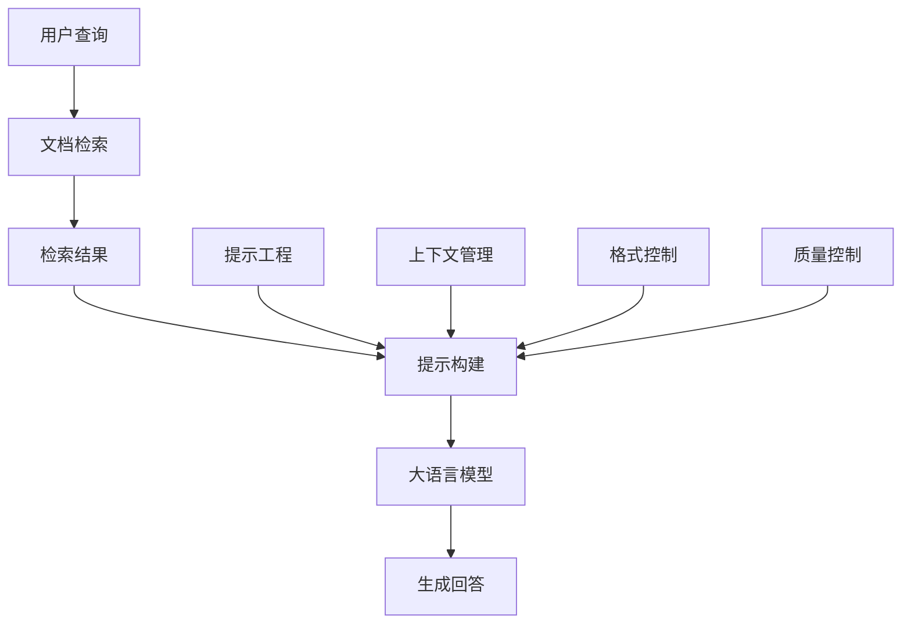

# 提示工程实践

## 引言

提示工程（Prompt Engineering）是RAG系统中连接检索结果和生成模型的关键技术。良好的提示设计能够显著提升生成质量，减少幻觉问题，提高回答的准确性和相关性。本文将深入探讨提示工程的核心原理、设计技巧和最佳实践。

## 提示工程概述

### 什么是提示工程

提示工程是通过精心设计输入提示来引导大语言模型生成期望输出的技术。在RAG系统中，提示工程将检索到的文档片段和用户查询组合成有效的输入，指导模型生成准确、相关的回答。

### 提示工程在RAG中的作用



### 提示工程的关键要素

1. **上下文组织**：合理组织检索到的文档信息
2. **指令设计**：明确告诉模型要做什么
3. **格式控制**：控制输出格式和结构
4. **质量控制**：确保生成内容的准确性

## 基础提示设计

### 1. 简单问答提示

#### 基础模板

```python
class BasicPromptTemplate:
    def __init__(self):
        self.template = """
基于以下文档内容回答用户问题：

文档内容：
{context}

用户问题：{question}

请基于上述文档内容提供准确的回答：
"""
    
    def format_prompt(self, question: str, context: str) -> str:
        """格式化提示"""
        return self.template.format(
            question=question,
            context=context
        )
```

#### 使用示例

```python
# 基础提示使用
prompt_template = BasicPromptTemplate()

question = "什么是机器学习？"
context = "机器学习是人工智能的一个分支，它使计算机能够在没有明确编程的情况下学习和改进。"

prompt = prompt_template.format_prompt(question, context)
print(prompt)
```

### 2. 结构化提示

#### 实现示例

```python
class StructuredPromptTemplate:
    def __init__(self):
        self.template = """
你是一个专业的问答助手。请基于以下相关信息回答用户问题。

相关信息：
{context}

用户问题：{question}

回答要求：
1. 基于提供的文档内容回答
2. 如果文档中没有相关信息，请明确说明
3. 引用具体的文档来源
4. 保持回答的准确性和客观性

回答：
"""
    
    def format_prompt(self, question: str, context: str) -> str:
        """格式化结构化提示"""
        return self.template.format(
            question=question,
            context=context
        )
```

### 3. 角色扮演提示

#### 实现示例

```python
class RoleBasedPromptTemplate:
    def __init__(self, role: str = "专业助手"):
        self.role = role
        self.template = """
你是一位{role}，具有丰富的专业知识和经验。

基于以下专业资料回答用户问题：

专业资料：
{context}

用户问题：{question}

请以{role}的身份，基于专业资料提供准确、专业的回答：

"""
    
    def format_prompt(self, question: str, context: str) -> str:
        """格式化角色提示"""
        return self.template.format(
            role=self.role,
            question=question,
            context=context
        )

# 使用示例
medical_prompt = RoleBasedPromptTemplate("医学专家")
legal_prompt = RoleBasedPromptTemplate("法律顾问")
tech_prompt = RoleBasedPromptTemplate("技术专家")
```

## 高级提示技巧

### 1. 少样本学习提示

#### 实现示例

```python
class FewShotPromptTemplate:
    def __init__(self):
        self.template = """
你是一个专业的问答助手。以下是几个示例：

示例1：
问题：什么是深度学习？
文档：深度学习是机器学习的一个子集，使用多层神经网络来模拟人脑的学习过程。
回答：深度学习是机器学习的一个子集，它使用多层神经网络来模拟人脑的学习过程。这种方法能够自动学习数据的复杂模式，在图像识别、自然语言处理等领域取得了突破性进展。

示例2：
问题：如何训练神经网络？
文档：神经网络训练通常包括前向传播、计算损失、反向传播和参数更新四个步骤。
回答：神经网络训练是一个迭代过程，主要包括四个步骤：1）前向传播，将输入数据通过网络计算输出；2）计算损失，比较预测结果与真实标签的差异；3）反向传播，计算梯度并更新网络参数；4）重复上述过程直到收敛。

现在请基于以下文档内容回答用户问题：

文档内容：
{context}

用户问题：{question}

回答：
"""
    
    def format_prompt(self, question: str, context: str) -> str:
        """格式化少样本提示"""
        return self.template.format(
            question=question,
            context=context
        )
```

### 2. 思维链提示

#### 实现示例

```python
class ChainOfThoughtPromptTemplate:
    def __init__(self):
        self.template = """
你是一个专业的分析助手。请按照以下步骤分析问题：

步骤1：理解问题
- 用户问的是什么？
- 需要什么类型的信息？

步骤2：分析文档内容
- 文档中包含了哪些相关信息？
- 这些信息如何回答用户的问题？

步骤3：综合回答
- 基于分析结果，给出完整的回答

文档内容：
{context}

用户问题：{question}

请按照上述步骤进行分析和回答：

步骤1：理解问题
用户询问的是：{question}

步骤2：分析文档内容
文档中的相关信息包括：

步骤3：综合回答
基于以上分析，我的回答是：
"""
    
    def format_prompt(self, question: str, context: str) -> str:
        """格式化思维链提示"""
        return self.template.format(
            question=question,
            context=context
        )
```

### 3. 自我验证提示

#### 实现示例

```python
class SelfVerificationPromptTemplate:
    def __init__(self):
        self.template = """
你是一个专业的问答助手。请按照以下步骤回答问题：

步骤1：基于文档内容回答问题
文档内容：
{context}

用户问题：{question}

初步回答：

步骤2：自我验证
请检查你的回答是否：
- 完全基于提供的文档内容
- 准确回答了用户的问题
- 没有添加文档中没有的信息
- 逻辑清晰，表达准确

验证结果：

步骤3：最终回答
如果需要修正，请提供修正后的最终回答：

最终回答：
"""
    
    def format_prompt(self, question: str, context: str) -> str:
        """格式化自我验证提示"""
        return self.template.format(
            question=question,
            context=context
        )
```

## 上下文管理

### 1. 上下文长度优化

#### 实现示例

```python
class ContextManager:
    def __init__(self, max_context_length: int = 4000):
        self.max_context_length = max_context_length
    
    def optimize_context(self, documents: List[str], query: str) -> str:
        """优化上下文长度"""
        # 计算每个文档的重要性分数
        doc_scores = self._calculate_document_scores(documents, query)
        
        # 按重要性排序
        sorted_docs = sorted(zip(documents, doc_scores), key=lambda x: x[1], reverse=True)
        
        # 选择最重要的文档，直到达到长度限制
        selected_docs = []
        current_length = 0
        
        for doc, score in sorted_docs:
            doc_length = len(doc)
            if current_length + doc_length <= self.max_context_length:
                selected_docs.append(doc)
                current_length += doc_length
            else:
                # 如果添加完整文档会超出限制，尝试截断
                remaining_length = self.max_context_length - current_length
                if remaining_length > 100:  # 至少保留100个字符
                    truncated_doc = self._truncate_document(doc, remaining_length)
                    selected_docs.append(truncated_doc)
                break
        
        return "\n\n".join(selected_docs)
    
    def _calculate_document_scores(self, documents: List[str], query: str) -> List[float]:
        """计算文档重要性分数"""
        query_words = set(query.lower().split())
        scores = []
        
        for doc in documents:
            doc_words = set(doc.lower().split())
            
            # 计算词汇重叠
            overlap = len(query_words.intersection(doc_words))
            total_words = len(query_words.union(doc_words))
            
            if total_words > 0:
                jaccard_score = overlap / total_words
            else:
                jaccard_score = 0
            
            # 考虑文档长度（中等长度文档得分更高）
            length_score = min(len(doc.split()) / 200, 1.0)
            
            # 综合分数
            combined_score = 0.7 * jaccard_score + 0.3 * length_score
            scores.append(combined_score)
        
        return scores
    
    def _truncate_document(self, document: str, max_length: int) -> str:
        """截断文档"""
        words = document.split()
        if len(words) <= max_length // 5:  # 假设平均每个词5个字符
            return document
        
        # 保留前面的部分
        truncated_words = words[:max_length // 5]
        return " ".join(truncated_words) + "..."
```

### 2. 上下文结构化

#### 实现示例

```python
class StructuredContextManager:
    def __init__(self):
        self.context_template = """
相关信息：

{structured_context}

用户问题：{question}

请基于上述结构化信息回答问题：
"""
    
    def structure_context(self, documents: List[str], metadata: List[Dict] = None) -> str:
        """结构化上下文"""
        structured_parts = []
        
        for i, doc in enumerate(documents):
            # 添加文档标识
            doc_header = f"文档 {i+1}:"
            
            # 添加元数据信息（如果有）
            if metadata and i < len(metadata):
                meta = metadata[i]
                if 'title' in meta:
                    doc_header += f" {meta['title']}"
                if 'source' in meta:
                    doc_header += f" (来源: {meta['source']})"
            
            # 组合文档
            doc_content = f"{doc_header}\n{doc}"
            structured_parts.append(doc_content)
        
        return "\n\n".join(structured_parts)
    
    def format_prompt(self, question: str, documents: List[str], 
                     metadata: List[Dict] = None) -> str:
        """格式化结构化提示"""
        structured_context = self.structure_context(documents, metadata)
        
        return self.context_template.format(
            question=question,
            structured_context=structured_context
        )
```

## 提示优化策略

### 1. 动态提示生成

#### 实现示例

```python
class DynamicPromptGenerator:
    def __init__(self):
        self.prompt_templates = {
            'factual': self._factual_template(),
            'analytical': self._analytical_template(),
            'creative': self._creative_template(),
            'technical': self._technical_template()
        }
    
    def generate_prompt(self, question: str, context: str, 
                       question_type: str = 'auto') -> str:
        """动态生成提示"""
        if question_type == 'auto':
            question_type = self._classify_question_type(question)
        
        template = self.prompt_templates.get(question_type, self.prompt_templates['factual'])
        
        return template.format(question=question, context=context)
    
    def _classify_question_type(self, question: str) -> str:
        """分类问题类型"""
        question_lower = question.lower()
        
        # 事实性问题
        if any(word in question_lower for word in ['什么', '是什么', '定义', '含义']):
            return 'factual'
        
        # 分析性问题
        elif any(word in question_lower for word in ['如何', '为什么', '分析', '比较']):
            return 'analytical'
        
        # 技术性问题
        elif any(word in question_lower for word in ['算法', '实现', '代码', '技术']):
            return 'technical'
        
        # 创造性问题
        elif any(word in question_lower for word in ['建议', '想法', '方案', '设计']):
            return 'creative'
        
        else:
            return 'factual'
    
    def _factual_template(self) -> str:
        """事实性模板"""
        return """
基于以下信息回答用户问题：

信息：
{context}

问题：{question}

请提供准确、客观的事实性回答：
"""
    
    def _analytical_template(self) -> str:
        """分析性模板"""
        return """
你是一个分析专家。请基于以下信息进行深入分析：

信息：
{context}

问题：{question}

请提供详细的分析和解释：
"""
    
    def _technical_template(self) -> str:
        """技术性模板"""
        return """
你是一个技术专家。请基于以下技术资料回答问题：

技术资料：
{context}

技术问题：{question}

请提供专业、准确的技术回答：
"""
    
    def _creative_template(self) -> str:
        """创造性模板"""
        return """
你是一个创意顾问。请基于以下信息提供创新建议：

背景信息：
{context}

问题：{question}

请提供有创意的建议和解决方案：
"""
```

### 2. 提示迭代优化

#### 实现示例

```python
class PromptOptimizer:
    def __init__(self):
        self.optimization_history = []
    
    def optimize_prompt(self, base_prompt: str, test_cases: List[Dict]) -> str:
        """优化提示"""
        best_prompt = base_prompt
        best_score = 0
        
        # 生成提示变体
        prompt_variants = self._generate_prompt_variants(base_prompt)
        
        # 测试每个变体
        for variant in prompt_variants:
            score = self._evaluate_prompt(variant, test_cases)
            
            if score > best_score:
                best_score = score
                best_prompt = variant
        
        # 记录优化历史
        self.optimization_history.append({
            'original': base_prompt,
            'optimized': best_prompt,
            'score': best_score
        })
        
        return best_prompt
    
    def _generate_prompt_variants(self, base_prompt: str) -> List[str]:
        """生成提示变体"""
        variants = [base_prompt]
        
        # 添加指令变体
        instruction_variants = [
            "请仔细阅读以下信息并回答问题：",
            "基于以下资料，请提供准确的回答：",
            "你是一个专业助手，请基于以下信息回答问题："
        ]
        
        for instruction in instruction_variants:
            variant = base_prompt.replace("基于以下", instruction)
            variants.append(variant)
        
        # 添加格式变体
        format_variants = [
            "\n回答格式：\n1. 直接回答\n2. 详细解释\n3. 相关建议",
            "\n请按以下格式回答：\n- 核心答案\n- 详细说明\n- 注意事项"
        ]
        
        for format_variant in format_variants:
            variant = base_prompt + format_variant
            variants.append(variant)
        
        return variants
    
    def _evaluate_prompt(self, prompt: str, test_cases: List[Dict]) -> float:
        """评估提示效果"""
        scores = []
        
        for test_case in test_cases:
            # 这里应该调用实际的模型进行评估
            # 简化实现，使用模拟分数
            score = self._simulate_evaluation(prompt, test_case)
            scores.append(score)
        
        return sum(scores) / len(scores) if scores else 0
    
    def _simulate_evaluation(self, prompt: str, test_case: Dict) -> float:
        """模拟评估（实际应用中应该调用真实模型）"""
        # 基于提示长度、清晰度等因素计算模拟分数
        length_score = min(len(prompt) / 1000, 1.0)
        clarity_score = 0.8  # 模拟清晰度分数
        
        return 0.6 * length_score + 0.4 * clarity_score
```

## 提示质量控制

### 1. 提示验证

#### 实现示例

```python
class PromptValidator:
    def __init__(self):
        self.validation_rules = [
            self._check_context_presence,
            self._check_question_presence,
            self._check_instruction_clarity,
            self._check_length_appropriateness
        ]
    
    def validate_prompt(self, prompt: str) -> Dict[str, bool]:
        """验证提示质量"""
        validation_results = {}
        
        for rule in self.validation_rules:
            rule_name = rule.__name__.replace('_check_', '')
            validation_results[rule_name] = rule(prompt)
        
        return validation_results
    
    def _check_context_presence(self, prompt: str) -> bool:
        """检查是否包含上下文"""
        context_indicators = ['文档', '信息', '资料', '内容', 'context']
        return any(indicator in prompt for indicator in context_indicators)
    
    def _check_question_presence(self, prompt: str) -> bool:
        """检查是否包含问题"""
        question_indicators = ['问题', 'question', '？', '?']
        return any(indicator in prompt for indicator in question_indicators)
    
    def _check_instruction_clarity(self, prompt: str) -> bool:
        """检查指令是否清晰"""
        clear_instructions = ['请', '基于', '回答', '提供']
        return any(instruction in prompt for instruction in clear_instructions)
    
    def _check_length_appropriateness(self, prompt: str) -> bool:
        """检查长度是否合适"""
        return 100 <= len(prompt) <= 4000
    
    def get_validation_score(self, prompt: str) -> float:
        """获取验证分数"""
        results = self.validate_prompt(prompt)
        return sum(results.values()) / len(results)
```

### 2. 提示效果监控

#### 实现示例

```python
class PromptEffectivenessMonitor:
    def __init__(self):
        self.metrics = {
            'response_quality': [],
            'relevance_score': [],
            'accuracy_score': [],
            'completeness_score': []
        }
    
    def monitor_prompt_effectiveness(self, prompt: str, 
                                   response: str, 
                                   expected_response: str = None) -> Dict[str, float]:
        """监控提示效果"""
        metrics = {}
        
        # 响应质量
        metrics['response_quality'] = self._evaluate_response_quality(response)
        
        # 相关性分数
        metrics['relevance_score'] = self._evaluate_relevance(prompt, response)
        
        # 准确性分数
        if expected_response:
            metrics['accuracy_score'] = self._evaluate_accuracy(response, expected_response)
        
        # 完整性分数
        metrics['completeness_score'] = self._evaluate_completeness(response)
        
        # 记录指标
        for key, value in metrics.items():
            self.metrics[key].append(value)
        
        return metrics
    
    def _evaluate_response_quality(self, response: str) -> float:
        """评估响应质量"""
        # 基于响应长度、结构等因素评估
        length_score = min(len(response) / 500, 1.0)
        structure_score = 0.8 if len(response.split('\n')) > 1 else 0.5
        
        return 0.6 * length_score + 0.4 * structure_score
    
    def _evaluate_relevance(self, prompt: str, response: str) -> float:
        """评估相关性"""
        # 简单的相关性评估
        prompt_words = set(prompt.lower().split())
        response_words = set(response.lower().split())
        
        overlap = len(prompt_words.intersection(response_words))
        union = len(prompt_words.union(response_words))
        
        return overlap / union if union > 0 else 0
    
    def _evaluate_accuracy(self, response: str, expected: str) -> float:
        """评估准确性"""
        # 使用简单的文本相似度
        from difflib import SequenceMatcher
        return SequenceMatcher(None, response, expected).ratio()
    
    def _evaluate_completeness(self, response: str) -> float:
        """评估完整性"""
        # 检查是否包含关键要素
        completeness_indicators = ['因为', '所以', '因此', '总结', '结论']
        found_indicators = sum(1 for indicator in completeness_indicators 
                             if indicator in response)
        
        return min(found_indicators / 3, 1.0)
    
    def get_effectiveness_summary(self) -> Dict[str, float]:
        """获取效果摘要"""
        summary = {}
        
        for metric, values in self.metrics.items():
            if values:
                summary[f'{metric}_avg'] = sum(values) / len(values)
                summary[f'{metric}_max'] = max(values)
                summary[f'{metric}_min'] = min(values)
        
        return summary
```

## 最佳实践

### 1. 提示设计原则

```python
class PromptDesignPrinciples:
    def __init__(self):
        self.principles = {
            'clarity': '提示应该清晰明确，避免歧义',
            'context': '提供足够的上下文信息',
            'instruction': '给出明确的指令和期望',
            'format': '指定输出格式和结构',
            'constraints': '设置必要的约束和限制'
        }
    
    def apply_principles(self, prompt: str) -> str:
        """应用设计原则"""
        improved_prompt = prompt
        
        # 确保清晰性
        if not self._is_clear(prompt):
            improved_prompt = self._improve_clarity(improved_prompt)
        
        # 确保有足够的上下文
        if not self._has_sufficient_context(improved_prompt):
            improved_prompt = self._add_context_guidance(improved_prompt)
        
        # 确保有明确的指令
        if not self._has_clear_instructions(improved_prompt):
            improved_prompt = self._add_instructions(improved_prompt)
        
        return improved_prompt
    
    def _is_clear(self, prompt: str) -> bool:
        """检查是否清晰"""
        unclear_indicators = ['可能', '也许', '大概', '似乎']
        return not any(indicator in prompt for indicator in unclear_indicators)
    
    def _has_sufficient_context(self, prompt: str) -> bool:
        """检查是否有足够的上下文"""
        return '基于' in prompt or '根据' in prompt
    
    def _has_clear_instructions(self, prompt: str) -> bool:
        """检查是否有明确的指令"""
        instruction_words = ['请', '回答', '提供', '说明']
        return any(word in prompt for word in instruction_words)
    
    def _improve_clarity(self, prompt: str) -> str:
        """改善清晰性"""
        return prompt.replace('可能', '请').replace('也许', '请')
    
    def _add_context_guidance(self, prompt: str) -> str:
        """添加上下文指导"""
        if '基于' not in prompt:
            prompt = prompt.replace('回答', '基于提供的信息回答')
        return prompt
    
    def _add_instructions(self, prompt: str) -> str:
        """添加指令"""
        if '请' not in prompt:
            prompt = '请' + prompt
        return prompt
```

### 2. 提示模板管理

```python
class PromptTemplateManager:
    def __init__(self):
        self.templates = {}
        self.template_versions = {}
    
    def register_template(self, name: str, template: str, version: str = '1.0'):
        """注册提示模板"""
        if name not in self.templates:
            self.templates[name] = {}
            self.template_versions[name] = []
        
        self.templates[name][version] = template
        self.template_versions[name].append(version)
    
    def get_template(self, name: str, version: str = None) -> str:
        """获取模板"""
        if name not in self.templates:
            raise ValueError(f"Template {name} not found")
        
        if version is None:
            # 获取最新版本
            version = max(self.template_versions[name])
        
        return self.templates[name][version]
    
    def list_templates(self) -> List[str]:
        """列出所有模板"""
        return list(self.templates.keys())
    
    def get_template_versions(self, name: str) -> List[str]:
        """获取模板版本"""
        return self.template_versions.get(name, [])
    
    def compare_templates(self, name: str, version1: str, version2: str) -> Dict[str, str]:
        """比较模板版本"""
        template1 = self.get_template(name, version1)
        template2 = self.get_template(name, version2)
        
        return {
            'version1': template1,
            'version2': template2,
            'differences': self._find_differences(template1, template2)
        }
    
    def _find_differences(self, template1: str, template2: str) -> List[str]:
        """查找差异"""
        differences = []
        
        if len(template1) != len(template2):
            differences.append(f"Length difference: {len(template1)} vs {len(template2)}")
        
        if template1 != template2:
            differences.append("Content differences detected")
        
        return differences
```

## 总结

提示工程是RAG系统成功的关键因素之一。本文介绍了提示工程的核心概念、设计技巧和最佳实践，包括基础提示设计、高级技巧、上下文管理、优化策略和质量控制等方面。

关键要点：
1. **设计原则**：清晰、具体、有指导性
2. **上下文管理**：合理组织检索信息
3. **动态优化**：根据问题类型调整提示
4. **质量控制**：建立验证和监控机制

在下一篇文章中，我们将探讨上下文管理技术，了解如何更有效地管理和利用检索到的上下文信息。

---

**下一步学习建议：**
- 阅读《上下文管理》，了解如何优化上下文的使用
- 实践不同的提示设计技巧，比较它们的效果
- 关注提示工程技术的最新发展和创新方案
