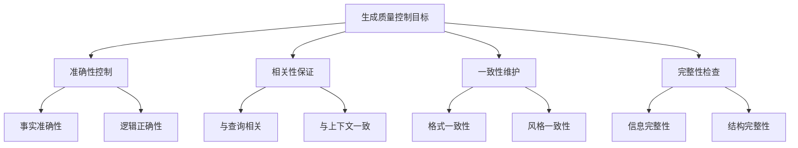

# 生成质量控制

## 引言

生成质量控制是RAG系统确保输出质量的关键环节。通过有效的质量控制机制，可以减少幻觉问题，提高回答的准确性、相关性和一致性。本文将深入探讨生成质量控制的技术、方法和最佳实践。

## 生成质量控制概述

### 什么是生成质量控制

生成质量控制是指通过多种技术手段对RAG系统生成的回答进行质量评估、验证和优化的过程。它确保生成的内容符合预期标准，减少错误和偏差。

### 质量控制的目标



### 质量控制的挑战

1. **幻觉检测**：识别和减少模型生成的不准确信息
2. **事实验证**：确保生成内容与源文档一致
3. **逻辑一致性**：检查回答的逻辑连贯性
4. **格式规范**：确保输出格式符合要求

## 基础质量控制

### 1. 基于规则的质量控制

#### 实现示例

```python
class RuleBasedQualityController:
    def __init__(self):
        self.quality_rules = [
            self._check_length_appropriateness,
            self._check_format_compliance,
            self._check_language_quality,
            self._check_factual_consistency
        ]
    
    def control_quality(self, response: str, query: str, context: str) -> Dict[str, any]:
        """基于规则的质量控制"""
        quality_report = {
            'response': response,
            'quality_score': 0.0,
            'issues': [],
            'suggestions': []
        }
        
        # 应用质量规则
        for rule in self.quality_rules:
            rule_result = rule(response, query, context)
            quality_report['quality_score'] += rule_result['score']
            
            if rule_result['issues']:
                quality_report['issues'].extend(rule_result['issues'])
            
            if rule_result['suggestions']:
                quality_report['suggestions'].extend(rule_result['suggestions'])
        
        # 计算总体质量分数
        quality_report['quality_score'] /= len(self.quality_rules)
        
        return quality_report
    
    def _check_length_appropriateness(self, response: str, query: str, context: str) -> Dict[str, any]:
        """检查长度适当性"""
        result = {'score': 0.0, 'issues': [], 'suggestions': []}
        
        response_length = len(response.split())
        
        # 根据查询类型确定期望长度
        if '什么' in query or '定义' in query:
            expected_length = (10, 50)  # 定义类问题
        elif '如何' in query or '为什么' in query:
            expected_length = (20, 100)  # 解释类问题
        else:
            expected_length = (10, 80)  # 一般问题
        
        if response_length < expected_length[0]:
            result['issues'].append("回答过短，可能信息不足")
            result['suggestions'].append("提供更详细的解释")
            result['score'] = 0.3
        elif response_length > expected_length[1]:
            result['issues'].append("回答过长，可能包含冗余信息")
            result['suggestions'].append("精简回答内容")
            result['score'] = 0.7
        else:
            result['score'] = 1.0
        
        return result
    
    def _check_format_compliance(self, response: str, query: str, context: str) -> Dict[str, any]:
        """检查格式合规性"""
        result = {'score': 0.0, 'issues': [], 'suggestions': []}
        
        # 检查是否有适当的标点符号
        if not response.endswith(('。', '！', '？', '.', '!', '?')):
            result['issues'].append("回答缺少适当的结尾标点")
            result['suggestions'].append("添加适当的标点符号")
        
        # 检查是否有合理的段落结构
        if len(response.split('\n')) == 1 and len(response.split()) > 50:
            result['issues'].append("长回答缺少段落结构")
            result['suggestions'].append("使用段落分隔长回答")
        
        # 计算格式分数
        format_score = 1.0
        if result['issues']:
            format_score -= len(result['issues']) * 0.2
        
        result['score'] = max(format_score, 0.0)
        return result
    
    def _check_language_quality(self, response: str, query: str, context: str) -> Dict[str, any]:
        """检查语言质量"""
        result = {'score': 0.0, 'issues': [], 'suggestions': []}
        
        # 检查重复词汇
        words = response.split()
        word_counts = {}
        for word in words:
            word_counts[word] = word_counts.get(word, 0) + 1
        
        repeated_words = [word for word, count in word_counts.items() if count > 3]
        if repeated_words:
            result['issues'].append(f"存在重复词汇: {', '.join(repeated_words[:3])}")
            result['suggestions'].append("使用同义词替换重复词汇")
        
        # 检查句子长度
        sentences = response.split('。')
        long_sentences = [s for s in sentences if len(s.split()) > 30]
        if long_sentences:
            result['issues'].append("存在过长的句子")
            result['suggestions'].append("将长句子分解为短句")
        
        # 计算语言质量分数
        language_score = 1.0
        if result['issues']:
            language_score -= len(result['issues']) * 0.15
        
        result['score'] = max(language_score, 0.0)
        return result
    
    def _check_factual_consistency(self, response: str, query: str, context: str) -> Dict[str, any]:
        """检查事实一致性"""
        result = {'score': 0.0, 'issues': [], 'suggestions': []}
        
        # 检查响应是否包含上下文中的信息
        context_words = set(context.lower().split())
        response_words = set(response.lower().split())
        
        overlap = len(context_words.intersection(response_words))
        total_context_words = len(context_words)
        
        if total_context_words > 0:
            coverage_ratio = overlap / total_context_words
            if coverage_ratio < 0.1:
                result['issues'].append("回答与上下文信息关联度低")
                result['suggestions'].append("更多引用上下文中的信息")
                result['score'] = 0.4
            elif coverage_ratio > 0.8:
                result['issues'].append("回答可能过度依赖上下文")
                result['suggestions'].append("增加原创性分析")
                result['score'] = 0.8
            else:
                result['score'] = 1.0
        else:
            result['score'] = 0.5
        
        return result
```

### 2. 基于模板的质量控制

#### 实现示例

```python
class TemplateBasedQualityController:
    def __init__(self):
        self.response_templates = {
            'definition': {
                'pattern': r'^(.+?)是(.+?)，(.+?)。$',
                'required_elements': ['概念', '定义', '说明'],
                'quality_criteria': {
                    'completeness': 0.8,
                    'clarity': 0.9,
                    'accuracy': 0.9
                }
            },
            'explanation': {
                'pattern': r'^(.+?)。(.+?)。(.+?)。$',
                'required_elements': ['要点1', '要点2', '要点3'],
                'quality_criteria': {
                    'completeness': 0.9,
                    'structure': 0.8,
                    'depth': 0.7
                }
            },
            'comparison': {
                'pattern': r'^(.+?)和(.+?)的区别在于(.+?)。$',
                'required_elements': ['对象1', '对象2', '区别'],
                'quality_criteria': {
                    'balance': 0.8,
                    'clarity': 0.9,
                    'completeness': 0.8
                }
            }
        }
    
    def control_quality(self, response: str, query: str, context: str) -> Dict[str, any]:
        """基于模板的质量控制"""
        # 识别查询类型
        query_type = self._identify_query_type(query)
        
        if query_type not in self.response_templates:
            return self._default_quality_check(response, query, context)
        
        template = self.response_templates[query_type]
        
        # 应用模板检查
        quality_report = self._apply_template_check(response, template, query, context)
        
        return quality_report
    
    def _identify_query_type(self, query: str) -> str:
        """识别查询类型"""
        query_lower = query.lower()
        
        if any(word in query_lower for word in ['什么', '定义', '含义']):
            return 'definition'
        elif any(word in query_lower for word in ['如何', '为什么', '解释']):
            return 'explanation'
        elif any(word in query_lower for word in ['比较', '区别', '差异']):
            return 'comparison'
        else:
            return 'general'
    
    def _apply_template_check(self, response: str, template: Dict, 
                            query: str, context: str) -> Dict[str, any]:
        """应用模板检查"""
        import re
        
        quality_report = {
            'response': response,
            'template_type': template,
            'quality_score': 0.0,
            'issues': [],
            'suggestions': []
        }
        
        # 检查模式匹配
        pattern = template['pattern']
        match = re.match(pattern, response)
        
        if match:
            # 检查必需元素
            elements = match.groups()
            required_elements = template['required_elements']
            
            completeness_score = 0.0
            for i, element in enumerate(elements):
                if i < len(required_elements) and element.strip():
                    completeness_score += 1.0 / len(required_elements)
            
            quality_report['quality_score'] = completeness_score
            
            # 检查质量标准
            criteria = template['quality_criteria']
            for criterion, threshold in criteria.items():
                criterion_score = self._evaluate_criterion(response, criterion)
                if criterion_score < threshold:
                    quality_report['issues'].append(f"{criterion}不达标")
                    quality_report['suggestions'].append(f"提高{criterion}质量")
        else:
            quality_report['issues'].append("回答格式不符合预期模板")
            quality_report['suggestions'].append("调整回答格式以符合模板要求")
            quality_report['quality_score'] = 0.3
        
        return quality_report
    
    def _evaluate_criterion(self, response: str, criterion: str) -> float:
        """评估质量标准"""
        if criterion == 'completeness':
            return self._evaluate_completeness(response)
        elif criterion == 'clarity':
            return self._evaluate_clarity(response)
        elif criterion == 'accuracy':
            return self._evaluate_accuracy(response)
        elif criterion == 'structure':
            return self._evaluate_structure(response)
        elif criterion == 'depth':
            return self._evaluate_depth(response)
        elif criterion == 'balance':
            return self._evaluate_balance(response)
        else:
            return 0.5
    
    def _evaluate_completeness(self, response: str) -> float:
        """评估完整性"""
        # 检查是否包含关键要素
        completeness_indicators = ['因为', '所以', '因此', '总结', '结论']
        found_indicators = sum(1 for indicator in completeness_indicators 
                             if indicator in response)
        
        return min(found_indicators / 3, 1.0)
    
    def _evaluate_clarity(self, response: str) -> float:
        """评估清晰度"""
        # 检查句子长度和复杂度
        sentences = response.split('。')
        avg_length = sum(len(s.split()) for s in sentences) / len(sentences) if sentences else 0
        
        # 中等长度的句子得分更高
        if 5 <= avg_length <= 20:
            return 1.0
        elif 3 <= avg_length < 5 or 20 < avg_length <= 30:
            return 0.7
        else:
            return 0.4
    
    def _evaluate_accuracy(self, response: str) -> float:
        """评估准确性"""
        # 简单的准确性评估
        # 实际应用中可以使用更复杂的方法
        return 0.8  # 默认分数
    
    def _evaluate_structure(self, response: str) -> float:
        """评估结构性"""
        # 检查是否有合理的结构
        structure_indicators = ['首先', '其次', '最后', '另外', '此外']
        found_indicators = sum(1 for indicator in structure_indicators 
                             if indicator in response)
        
        return min(found_indicators / 2, 1.0)
    
    def _evaluate_depth(self, response: str) -> float:
        """评估深度"""
        # 基于回答长度和复杂度评估深度
        word_count = len(response.split())
        
        if word_count > 100:
            return 1.0
        elif word_count > 50:
            return 0.7
        elif word_count > 20:
            return 0.5
        else:
            return 0.3
    
    def _evaluate_balance(self, response: str) -> float:
        """评估平衡性"""
        # 检查是否平衡地处理各个方面
        balance_indicators = ['一方面', '另一方面', '同时', '此外']
        found_indicators = sum(1 for indicator in balance_indicators 
                             if indicator in response)
        
        return min(found_indicators / 2, 1.0)
    
    def _default_quality_check(self, response: str, query: str, context: str) -> Dict[str, any]:
        """默认质量检查"""
        return {
            'response': response,
            'quality_score': 0.7,
            'issues': [],
            'suggestions': ['使用更具体的模板进行质量检查']
        }
```

## 高级质量控制

### 1. 基于模型的质量控制

#### 实现示例

```python
import torch
import torch.nn as nn
from transformers import AutoTokenizer, AutoModel
from typing import List, Dict, Tuple

class ModelBasedQualityController:
    def __init__(self, model_name: str = "bert-base-chinese"):
        self.tokenizer = AutoTokenizer.from_pretrained(model_name)
        self.model = AutoModel.from_pretrained(model_name)
        self.device = torch.device("cuda" if torch.cuda.is_available() else "cpu")
        self.model.to(self.device)
        self.model.eval()
        
        # 质量评估模型
        self.quality_classifier = QualityClassifier(self.model.config.hidden_size)
        self.quality_classifier.to(self.device)
    
    def control_quality(self, response: str, query: str, context: str) -> Dict[str, any]:
        """基于模型的质量控制"""
        # 准备输入
        input_text = f"{query} [SEP] {context} [SEP] {response}"
        
        # 编码输入
        inputs = self.tokenizer(
            input_text,
            return_tensors="pt",
            truncation=True,
            max_length=512,
            padding=True
        )
        
        inputs = {k: v.to(self.device) for k, v in inputs.items()}
        
        # 获取质量分数
        with torch.no_grad():
            outputs = self.model(**inputs)
            quality_scores = self.quality_classifier(outputs.last_hidden_state)
        
        # 解析质量分数
        quality_metrics = self._parse_quality_scores(quality_scores)
        
        # 生成质量报告
        quality_report = self._generate_quality_report(response, quality_metrics)
        
        return quality_report
    
    def _parse_quality_scores(self, quality_scores: torch.Tensor) -> Dict[str, float]:
        """解析质量分数"""
        scores = quality_scores.cpu().numpy()[0]
        
        return {
            'accuracy': float(scores[0]),
            'relevance': float(scores[1]),
            'completeness': float(scores[2]),
            'clarity': float(scores[3]),
            'consistency': float(scores[4])
        }
    
    def _generate_quality_report(self, response: str, 
                               quality_metrics: Dict[str, float]) -> Dict[str, any]:
        """生成质量报告"""
        overall_score = sum(quality_metrics.values()) / len(quality_metrics)
        
        issues = []
        suggestions = []
        
        # 分析各个质量指标
        for metric, score in quality_metrics.items():
            if score < 0.6:
                issues.append(f"{metric}分数较低: {score:.2f}")
                suggestions.append(self._get_improvement_suggestion(metric))
        
        return {
            'response': response,
            'quality_metrics': quality_metrics,
            'overall_score': overall_score,
            'issues': issues,
            'suggestions': suggestions
        }
    
    def _get_improvement_suggestion(self, metric: str) -> str:
        """获取改进建议"""
        suggestions = {
            'accuracy': "检查事实准确性，确保与源文档一致",
            'relevance': "提高与查询的相关性，减少无关信息",
            'completeness': "提供更完整的信息，补充缺失的要点",
            'clarity': "简化表达，使用更清晰的语言",
            'consistency': "保持逻辑一致性，避免矛盾信息"
        }
        
        return suggestions.get(metric, "改进回答质量")
    
    def train_quality_classifier(self, training_data: List[Dict]):
        """训练质量分类器"""
        # 准备训练数据
        train_inputs = []
        train_labels = []
        
        for data in training_data:
            input_text = f"{data['query']} [SEP] {data['context']} [SEP] {data['response']}"
            inputs = self.tokenizer(
                input_text,
                return_tensors="pt",
                truncation=True,
                max_length=512,
                padding=True
            )
            
            train_inputs.append(inputs)
            train_labels.append(data['quality_labels'])
        
        # 训练模型
        optimizer = torch.optim.Adam(self.quality_classifier.parameters(), lr=1e-5)
        criterion = nn.MSELoss()
        
        for epoch in range(10):  # 训练10个epoch
            for inputs, labels in zip(train_inputs, train_labels):
                inputs = {k: v.to(self.device) for k, v in inputs.items()}
                labels = torch.tensor(labels).to(self.device)
                
                with torch.no_grad():
                    outputs = self.model(**inputs)
                
                quality_scores = self.quality_classifier(outputs.last_hidden_state)
                loss = criterion(quality_scores, labels)
                
                optimizer.zero_grad()
                loss.backward()
                optimizer.step()


class QualityClassifier(nn.Module):
    def __init__(self, hidden_size: int, num_quality_metrics: int = 5):
        super().__init__()
        self.classifier = nn.Sequential(
            nn.Linear(hidden_size, hidden_size // 2),
            nn.ReLU(),
            nn.Dropout(0.1),
            nn.Linear(hidden_size // 2, num_quality_metrics),
            nn.Sigmoid()
        )
    
    def forward(self, hidden_states: torch.Tensor) -> torch.Tensor:
        # 使用[CLS]标记的表示
        cls_output = hidden_states[:, 0, :]
        return self.classifier(cls_output)
```

### 2. 多维度质量评估

#### 实现示例

```python
class MultiDimensionalQualityEvaluator:
    def __init__(self):
        self.evaluators = {
            'factual': FactualAccuracyEvaluator(),
            'semantic': SemanticRelevanceEvaluator(),
            'linguistic': LinguisticQualityEvaluator(),
            'structural': StructuralQualityEvaluator()
        }
    
    def evaluate_quality(self, response: str, query: str, context: str) -> Dict[str, any]:
        """多维度质量评估"""
        evaluation_results = {}
        
        # 各个维度的评估
        for dimension, evaluator in self.evaluators.items():
            result = evaluator.evaluate(response, query, context)
            evaluation_results[dimension] = result
        
        # 综合评估
        overall_score = self._calculate_overall_score(evaluation_results)
        
        # 生成综合报告
        comprehensive_report = self._generate_comprehensive_report(
            response, evaluation_results, overall_score
        )
        
        return comprehensive_report
    
    def _calculate_overall_score(self, evaluation_results: Dict[str, any]) -> float:
        """计算综合分数"""
        weights = {
            'factual': 0.3,
            'semantic': 0.25,
            'linguistic': 0.2,
            'structural': 0.25
        }
        
        weighted_score = 0.0
        for dimension, result in evaluation_results.items():
            weight = weights.get(dimension, 0.25)
            weighted_score += result['score'] * weight
        
        return weighted_score
    
    def _generate_comprehensive_report(self, response: str, 
                                     evaluation_results: Dict[str, any], 
                                     overall_score: float) -> Dict[str, any]:
        """生成综合报告"""
        all_issues = []
        all_suggestions = []
        
        for dimension, result in evaluation_results.items():
            if result.get('issues'):
                all_issues.extend([f"{dimension}: {issue}" for issue in result['issues']])
            if result.get('suggestions'):
                all_suggestions.extend([f"{dimension}: {suggestion}" for suggestion in result['suggestions']])
        
        return {
            'response': response,
            'overall_score': overall_score,
            'dimension_scores': {dim: result['score'] for dim, result in evaluation_results.items()},
            'issues': all_issues,
            'suggestions': all_suggestions,
            'detailed_results': evaluation_results
        }


class FactualAccuracyEvaluator:
    def evaluate(self, response: str, query: str, context: str) -> Dict[str, any]:
        """事实准确性评估"""
        result = {'score': 0.0, 'issues': [], 'suggestions': []}
        
        # 检查响应是否与上下文一致
        context_concepts = self._extract_concepts(context)
        response_concepts = self._extract_concepts(response)
        
        # 计算概念重叠度
        overlap = len(context_concepts.intersection(response_concepts))
        union = len(context_concepts.union(response_concepts))
        
        if union > 0:
            consistency_score = overlap / union
            result['score'] = consistency_score
            
            if consistency_score < 0.3:
                result['issues'].append("回答与上下文信息不一致")
                result['suggestions'].append("确保回答基于提供的上下文信息")
        
        return result
    
    def _extract_concepts(self, text: str) -> set:
        """提取概念"""
        words = text.lower().split()
        concepts = set()
        
        for word in words:
            if len(word) > 3:  # 过滤短词
                concepts.add(word)
        
        return concepts


class SemanticRelevanceEvaluator:
    def evaluate(self, response: str, query: str, context: str) -> Dict[str, any]:
        """语义相关性评估"""
        result = {'score': 0.0, 'issues': [], 'suggestions': []}
        
        # 计算查询与响应的相关性
        query_words = set(query.lower().split())
        response_words = set(response.lower().split())
        
        intersection = query_words.intersection(response_words)
        union = query_words.union(response_words)
        
        if len(union) > 0:
            relevance_score = len(intersection) / len(union)
            result['score'] = relevance_score
            
            if relevance_score < 0.2:
                result['issues'].append("回答与查询相关性较低")
                result['suggestions'].append("提高回答与查询的相关性")
        
        return result


class LinguisticQualityEvaluator:
    def evaluate(self, response: str, query: str, context: str) -> Dict[str, any]:
        """语言质量评估"""
        result = {'score': 0.0, 'issues': [], 'suggestions': []}
        
        # 检查语言质量指标
        language_score = 1.0
        
        # 检查语法正确性
        if not self._check_grammar(response):
            result['issues'].append("存在语法错误")
            result['suggestions'].append("检查并修正语法错误")
            language_score -= 0.3
        
        # 检查词汇多样性
        if not self._check_vocabulary_diversity(response):
            result['issues'].append("词汇使用单一")
            result['suggestions'].append("增加词汇多样性")
            language_score -= 0.2
        
        # 检查句子结构
        if not self._check_sentence_structure(response):
            result['issues'].append("句子结构单调")
            result['suggestions'].append("丰富句子结构")
            language_score -= 0.2
        
        result['score'] = max(language_score, 0.0)
        return result
    
    def _check_grammar(self, text: str) -> bool:
        """检查语法正确性"""
        # 简单的语法检查
        # 实际应用中可以使用更复杂的语法检查工具
        return True  # 简化实现
    
    def _check_vocabulary_diversity(self, text: str) -> bool:
        """检查词汇多样性"""
        words = text.split()
        unique_words = set(words)
        
        if len(words) == 0:
            return False
        
        diversity_ratio = len(unique_words) / len(words)
        return diversity_ratio > 0.6
    
    def _check_sentence_structure(self, text: str) -> bool:
        """检查句子结构"""
        sentences = text.split('。')
        if len(sentences) < 2:
            return True
        
        # 检查句子长度变化
        lengths = [len(s.split()) for s in sentences if s.strip()]
        if len(lengths) < 2:
            return True
        
        length_variance = sum((l - sum(lengths)/len(lengths))**2 for l in lengths) / len(lengths)
        return length_variance > 5  # 有一定的长度变化


class StructuralQualityEvaluator:
    def evaluate(self, response: str, query: str, context: str) -> Dict[str, any]:
        """结构质量评估"""
        result = {'score': 0.0, 'issues': [], 'suggestions': []}
        
        # 检查结构质量
        structure_score = 1.0
        
        # 检查是否有适当的开头
        if not self._check_opening(response):
            result['issues'].append("缺少适当的开头")
            result['suggestions'].append("添加适当的开头")
            structure_score -= 0.2
        
        # 检查是否有逻辑结构
        if not self._check_logical_structure(response):
            result['issues'].append("逻辑结构不清晰")
            result['suggestions'].append("改善逻辑结构")
            structure_score -= 0.3
        
        # 检查是否有适当的结尾
        if not self._check_ending(response):
            result['issues'].append("缺少适当的结尾")
            result['suggestions'].append("添加适当的结尾")
            structure_score -= 0.2
        
        result['score'] = max(structure_score, 0.0)
        return result
    
    def _check_opening(self, text: str) -> bool:
        """检查开头"""
        opening_indicators = ['根据', '基于', '关于', '对于']
        return any(text.startswith(indicator) for indicator in opening_indicators)
    
    def _check_logical_structure(self, text: str) -> bool:
        """检查逻辑结构"""
        structure_indicators = ['首先', '其次', '然后', '最后', '另外', '此外']
        return any(indicator in text for indicator in structure_indicators)
    
    def _check_ending(self, text: str) -> bool:
        """检查结尾"""
        ending_indicators = ['总结', '结论', '因此', '所以']
        return any(text.endswith(indicator) for indicator in ending_indicators)
```

## 实时质量控制

### 1. 流式质量监控

#### 实现示例

```python
class StreamingQualityMonitor:
    def __init__(self, quality_threshold: float = 0.7):
        self.quality_threshold = quality_threshold
        self.quality_history = []
        self.alert_count = 0
    
    def monitor_quality(self, response: str, query: str, context: str) -> Dict[str, any]:
        """流式质量监控"""
        # 快速质量评估
        quality_score = self._quick_quality_assessment(response, query, context)
        
        # 记录质量历史
        self.quality_history.append({
            'timestamp': time.time(),
            'quality_score': quality_score,
            'response_length': len(response)
        })
        
        # 检查质量趋势
        quality_trend = self._analyze_quality_trend()
        
        # 生成监控报告
        monitor_report = {
            'current_score': quality_score,
            'quality_trend': quality_trend,
            'alerts': self._check_quality_alerts(quality_score),
            'recommendations': self._generate_recommendations(quality_score, quality_trend)
        }
        
        return monitor_report
    
    def _quick_quality_assessment(self, response: str, query: str, context: str) -> float:
        """快速质量评估"""
        # 基于简单规则进行快速评估
        score = 0.0
        
        # 长度适当性
        response_length = len(response.split())
        if 10 <= response_length <= 200:
            score += 0.3
        elif 5 <= response_length < 10 or 200 < response_length <= 300:
            score += 0.2
        else:
            score += 0.1
        
        # 相关性
        query_words = set(query.lower().split())
        response_words = set(response.lower().split())
        overlap = len(query_words.intersection(response_words))
        if len(query_words) > 0:
            relevance = overlap / len(query_words)
            score += min(relevance * 0.4, 0.4)
        
        # 完整性
        completeness_indicators = ['因为', '所以', '因此', '总结']
        found_indicators = sum(1 for indicator in completeness_indicators 
                             if indicator in response)
        score += min(found_indicators * 0.1, 0.3)
        
        return score
    
    def _analyze_quality_trend(self) -> str:
        """分析质量趋势"""
        if len(self.quality_history) < 5:
            return "数据不足"
        
        recent_scores = [entry['quality_score'] for entry in self.quality_history[-5:]]
        avg_score = sum(recent_scores) / len(recent_scores)
        
        if avg_score > 0.8:
            return "质量优秀"
        elif avg_score > 0.6:
            return "质量良好"
        elif avg_score > 0.4:
            return "质量一般"
        else:
            return "质量较差"
    
    def _check_quality_alerts(self, quality_score: float) -> List[str]:
        """检查质量警报"""
        alerts = []
        
        if quality_score < self.quality_threshold:
            alerts.append(f"质量分数低于阈值: {quality_score:.2f}")
            self.alert_count += 1
        
        if self.alert_count > 5:
            alerts.append("连续多次质量警报，建议检查系统")
        
        return alerts
    
    def _generate_recommendations(self, quality_score: float, quality_trend: str) -> List[str]:
        """生成建议"""
        recommendations = []
        
        if quality_score < 0.5:
            recommendations.append("建议重新生成回答")
            recommendations.append("检查输入上下文的质量")
        elif quality_score < 0.7:
            recommendations.append("考虑优化回答内容")
            recommendations.append("增加更多相关细节")
        
        if quality_trend == "质量较差":
            recommendations.append("系统质量下降，建议检查模型参数")
        
        return recommendations
```

### 2. 自适应质量控制

#### 实现示例

```python
class AdaptiveQualityController:
    def __init__(self):
        self.quality_thresholds = {
            'high': 0.8,
            'medium': 0.6,
            'low': 0.4
        }
        self.adaptation_history = []
    
    def adaptive_quality_control(self, response: str, query: str, 
                               context: str, user_feedback: Dict = None) -> Dict[str, any]:
        """自适应质量控制"""
        # 评估当前质量
        quality_assessment = self._assess_quality(response, query, context)
        
        # 根据用户反馈调整阈值
        if user_feedback:
            self._adapt_thresholds(user_feedback)
        
        # 决定是否需要重新生成
        should_regenerate = self._should_regenerate(quality_assessment)
        
        # 生成控制建议
        control_suggestions = self._generate_control_suggestions(
            quality_assessment, should_regenerate
        )
        
        return {
            'quality_assessment': quality_assessment,
            'should_regenerate': should_regenerate,
            'control_suggestions': control_suggestions,
            'current_thresholds': self.quality_thresholds
        }
    
    def _assess_quality(self, response: str, query: str, context: str) -> Dict[str, any]:
        """评估质量"""
        # 使用多维度评估器
        evaluator = MultiDimensionalQualityEvaluator()
        assessment = evaluator.evaluate_quality(response, query, context)
        
        return assessment
    
    def _adapt_thresholds(self, user_feedback: Dict):
        """根据用户反馈调整阈值"""
        feedback_type = user_feedback.get('type', 'neutral')
        feedback_score = user_feedback.get('score', 0.5)
        
        if feedback_type == 'positive' and feedback_score > 0.7:
            # 用户满意，可以适当降低阈值
            for level in self.quality_thresholds:
                self.quality_thresholds[level] *= 0.95
        elif feedback_type == 'negative' and feedback_score < 0.3:
            # 用户不满意，提高阈值
            for level in self.quality_thresholds:
                self.quality_thresholds[level] *= 1.05
        
        # 记录调整历史
        self.adaptation_history.append({
            'timestamp': time.time(),
            'feedback': user_feedback,
            'new_thresholds': self.quality_thresholds.copy()
        })
    
    def _should_regenerate(self, quality_assessment: Dict[str, any]) -> bool:
        """决定是否需要重新生成"""
        overall_score = quality_assessment['overall_score']
        
        if overall_score < self.quality_thresholds['low']:
            return True
        elif overall_score < self.quality_thresholds['medium']:
            # 检查是否有严重问题
            issues = quality_assessment.get('issues', [])
            critical_issues = [issue for issue in issues if '严重' in issue or '错误' in issue]
            return len(critical_issues) > 0
        else:
            return False
    
    def _generate_control_suggestions(self, quality_assessment: Dict[str, any], 
                                    should_regenerate: bool) -> List[str]:
        """生成控制建议"""
        suggestions = []
        
        if should_regenerate:
            suggestions.append("建议重新生成回答")
            suggestions.append("检查输入上下文的质量")
            suggestions.append("考虑调整生成参数")
        else:
            suggestions.append("质量可接受，可以输出")
            
            # 基于具体问题提供建议
            issues = quality_assessment.get('issues', [])
            for issue in issues:
                if '相关性' in issue:
                    suggestions.append("提高回答与查询的相关性")
                elif '完整性' in issue:
                    suggestions.append("补充缺失的信息")
                elif '准确性' in issue:
                    suggestions.append("检查事实准确性")
        
        return suggestions
```

## 质量优化策略

### 1. 后处理优化

#### 实现示例

```python
class PostProcessingOptimizer:
    def __init__(self):
        self.optimization_rules = [
            self._optimize_length,
            self._optimize_format,
            self._optimize_clarity,
            self._optimize_completeness
        ]
    
    def optimize_response(self, response: str, query: str, context: str) -> str:
        """后处理优化响应"""
        optimized_response = response
        
        # 应用优化规则
        for rule in self.optimization_rules:
            optimized_response = rule(optimized_response, query, context)
        
        return optimized_response
    
    def _optimize_length(self, response: str, query: str, context: str) -> str:
        """优化长度"""
        words = response.split()
        
        # 根据查询类型确定理想长度
        if '什么' in query or '定义' in query:
            ideal_length = 30
        elif '如何' in query or '为什么' in query:
            ideal_length = 80
        else:
            ideal_length = 50
        
        if len(words) > ideal_length * 1.5:
            # 过长，进行压缩
            return self._compress_response(response, ideal_length)
        elif len(words) < ideal_length * 0.5:
            # 过短，尝试扩展
            return self._expand_response(response, ideal_length, context)
        
        return response
    
    def _compress_response(self, response: str, target_length: int) -> str:
        """压缩响应"""
        sentences = response.split('。')
        compressed_sentences = []
        current_length = 0
        
        for sentence in sentences:
            if sentence.strip():
                sentence_length = len(sentence.split())
                if current_length + sentence_length <= target_length:
                    compressed_sentences.append(sentence)
                    current_length += sentence_length
                else:
                    break
        
        return '。'.join(compressed_sentences) + '。'
    
    def _expand_response(self, response: str, target_length: int, context: str) -> str:
        """扩展响应"""
        # 从上下文中提取相关信息
        context_sentences = context.split('。')
        relevant_sentences = []
        
        response_words = set(response.lower().split())
        
        for sentence in context_sentences:
            if sentence.strip():
                sentence_words = set(sentence.lower().split())
                overlap = len(response_words.intersection(sentence_words))
                if overlap > 0:
                    relevant_sentences.append(sentence)
        
        # 添加相关信息
        expanded_response = response
        current_length = len(response.split())
        
        for sentence in relevant_sentences[:2]:  # 最多添加2个相关句子
            sentence_length = len(sentence.split())
            if current_length + sentence_length <= target_length:
                expanded_response += f" {sentence}。"
                current_length += sentence_length
        
        return expanded_response
    
    def _optimize_format(self, response: str, query: str, context: str) -> str:
        """优化格式"""
        # 确保有适当的标点符号
        if not response.endswith(('。', '！', '？', '.', '!', '?')):
            response += '。'
        
        # 优化段落结构
        if len(response.split()) > 100:
            response = self._add_paragraph_breaks(response)
        
        return response
    
    def _add_paragraph_breaks(self, response: str) -> str:
        """添加段落分隔"""
        sentences = response.split('。')
        paragraphs = []
        current_paragraph = []
        
        for i, sentence in enumerate(sentences):
            if sentence.strip():
                current_paragraph.append(sentence)
                
                # 每3-4个句子分一段
                if len(current_paragraph) >= 3:
                    paragraphs.append('。'.join(current_paragraph) + '。')
                    current_paragraph = []
        
        if current_paragraph:
            paragraphs.append('。'.join(current_paragraph) + '。')
        
        return '\n\n'.join(paragraphs)
    
    def _optimize_clarity(self, response: str, query: str, context: str) -> str:
        """优化清晰度"""
        # 简化复杂句子
        sentences = response.split('。')
        simplified_sentences = []
        
        for sentence in sentences:
            if sentence.strip():
                if len(sentence.split()) > 25:
                    # 分割长句子
                    simplified = self._split_long_sentence(sentence)
                    simplified_sentences.append(simplified)
                else:
                    simplified_sentences.append(sentence)
        
        return '。'.join(simplified_sentences) + '。'
    
    def _split_long_sentence(self, sentence: str) -> str:
        """分割长句子"""
        # 简单的句子分割逻辑
        words = sentence.split()
        if len(words) <= 25:
            return sentence
        
        # 在中间位置分割
        mid_point = len(words) // 2
        first_part = ' '.join(words[:mid_point])
        second_part = ' '.join(words[mid_point:])
        
        return f"{first_part}。{second_part}"
    
    def _optimize_completeness(self, response: str, query: str, context: str) -> str:
        """优化完整性"""
        # 检查是否回答了查询的核心问题
        query_words = set(query.lower().split())
        response_words = set(response.lower().split())
        
        # 计算查询覆盖率
        coverage = len(query_words.intersection(response_words)) / len(query_words) if query_words else 0
        
        if coverage < 0.3:
            # 添加更多相关信息
            return self._add_missing_information(response, query, context)
        
        return response
    
    def _add_missing_information(self, response: str, query: str, context: str) -> str:
        """添加缺失信息"""
        # 从上下文中提取相关信息
        context_sentences = context.split('。')
        relevant_info = []
        
        query_words = set(query.lower().split())
        
        for sentence in context_sentences:
            if sentence.strip():
                sentence_words = set(sentence.lower().split())
                overlap = len(query_words.intersection(sentence_words))
                if overlap > 0:
                    relevant_info.append(sentence)
        
        # 添加最相关的信息
        if relevant_info:
            additional_info = relevant_info[0]
            return f"{response} 另外，{additional_info}。"
        
        return response
```

## 最佳实践

### 1. 质量控制策略选择

```python
def select_quality_control_strategy(requirements: dict) -> str:
    """选择质量控制策略"""
    if requirements['accuracy'] == 'critical':
        return 'model_based_quality_control'
    elif requirements['speed'] == 'critical':
        return 'rule_based_quality_control'
    elif requirements['adaptability'] == 'high':
        return 'adaptive_quality_control'
    else:
        return 'multi_dimensional_quality_evaluation'
```

### 2. 质量优化建议

```python
class QualityOptimizationAdvisor:
    def __init__(self):
        self.optimization_recommendations = {}
    
    def get_optimization_recommendations(self, quality_metrics: Dict[str, float]) -> List[str]:
        """获取质量优化建议"""
        recommendations = []
        
        # 基于质量指标提供建议
        if quality_metrics.get('accuracy', 0) < 0.7:
            recommendations.append("提高事实准确性，加强与源文档的一致性检查")
        
        if quality_metrics.get('relevance', 0) < 0.6:
            recommendations.append("增强回答与查询的相关性，减少无关信息")
        
        if quality_metrics.get('completeness', 0) < 0.8:
            recommendations.append("提供更完整的信息，补充缺失的要点")
        
        if quality_metrics.get('clarity', 0) < 0.7:
            recommendations.append("简化表达，使用更清晰的语言")
        
        return recommendations
```

## 总结

生成质量控制是RAG系统确保输出质量的关键技术。本文介绍了质量控制的核心概念、方法和最佳实践，包括基于规则的控制、基于模型的控制、多维度评估、实时监控和优化策略等方面。

关键要点：
1. **多层次控制**：结合规则、模型和人工评估
2. **实时监控**：建立流式质量监控机制
3. **自适应优化**：根据反馈动态调整质量控制策略
4. **后处理优化**：通过后处理技术提升生成质量

在下一篇文章中，我们将探讨幻觉问题解决技术，了解如何有效减少和检测RAG系统中的幻觉问题。

---

**下一步学习建议：**
- 阅读《幻觉问题解决》，了解如何减少AI生成错误信息
- 实践不同的质量控制方法，比较它们的效果
- 关注生成质量控制技术的最新发展和创新方案
