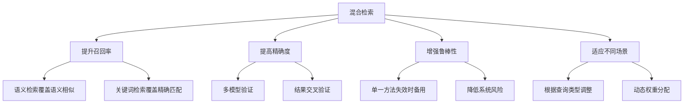

# 混合检索策略

## 引言

在实际应用中，单一的检索方法往往无法满足所有需求。混合检索策略通过结合多种检索方法的优势，能够显著提升RAG系统的检索效果。本文将深入探讨各种混合检索策略的原理、实现和优化方法。

## 混合检索概述

### 什么是混合检索

混合检索是指将多种不同的检索方法结合起来，通过融合它们的优势来提升整体检索效果的技术。常见的混合方式包括：

1. **语义检索 + 关键词检索**
2. **多模型融合**
3. **多阶段检索**
4. **自适应检索**

### 混合检索的优势



### 混合检索的挑战

1. **计算复杂度**：需要运行多种检索算法
2. **结果融合**：如何有效融合不同方法的结果
3. **权重调优**：确定各方法的最优权重
4. **性能平衡**：在效果和效率之间找到平衡

## 语义检索 + 关键词检索

### 1. 基础混合检索

#### 实现原理

结合语义检索的语义理解能力和关键词检索的精确匹配能力，通过加权融合提升整体效果。

#### 实现示例

```python
import numpy as np
from typing import List, Dict, Tuple, Set
from sentence_transformers import SentenceTransformer
import jieba
from collections import Counter

class HybridSemanticKeywordRetriever:
    def __init__(self, embedding_model: SentenceTransformer, 
                 documents: List[str], alpha: float = 0.7):
        self.embedding_model = embedding_model
        self.documents = documents
        self.alpha = alpha  # 语义检索权重
        self.beta = 1 - alpha  # 关键词检索权重
        
        # 构建关键词索引
        self.keyword_index = self._build_keyword_index()
        
        # 计算文档向量
        self.document_embeddings = self.embedding_model.encode(documents)
    
    def _build_keyword_index(self) -> Dict[str, Set[int]]:
        """构建关键词倒排索引"""
        keyword_index = {}
        
        for doc_id, document in enumerate(self.documents):
            # 分词
            words = jieba.cut(document)
            
            # 构建索引
            for word in words:
                word = word.strip().lower()
                if len(word) > 1:  # 过滤单字符词
                    if word not in keyword_index:
                        keyword_index[word] = set()
                    keyword_index[word].add(doc_id)
        
        return keyword_index
    
    def retrieve(self, query: str, top_k: int = 10) -> List[Tuple[int, float]]:
        """混合检索"""
        # 语义检索
        semantic_results = self._semantic_search(query, top_k * 2)
        
        # 关键词检索
        keyword_results = self._keyword_search(query, top_k * 2)
        
        # 融合结果
        combined_results = self._fuse_results(semantic_results, keyword_results)
        
        return combined_results[:top_k]
    
    def _semantic_search(self, query: str, top_k: int) -> List[Tuple[int, float]]:
        """语义检索"""
        query_embedding = self.embedding_model.encode([query])
        
        # 计算余弦相似度
        similarities = np.dot(self.document_embeddings, query_embedding.T).flatten()
        
        # 获取top-k结果
        top_indices = np.argsort(similarities)[::-1][:top_k]
        
        results = [(idx, float(similarities[idx])) for idx in top_indices]
        return results
    
    def _keyword_search(self, query: str, top_k: int) -> List[Tuple[int, float]]:
        """关键词检索"""
        query_words = list(jieba.cut(query))
        query_words = [word.strip().lower() for word in query_words if len(word.strip()) > 1]
        
        # 计算文档分数
        doc_scores = {}
        
        for word in query_words:
            if word in self.keyword_index:
                for doc_id in self.keyword_index[word]:
                    if doc_id not in doc_scores:
                        doc_scores[doc_id] = 0
                    doc_scores[doc_id] += 1
        
        # 归一化分数
        if doc_scores:
            max_score = max(doc_scores.values())
            doc_scores = {doc_id: score / max_score for doc_id, score in doc_scores.items()}
        
        # 排序并返回top-k
        results = [(doc_id, score) for doc_id, score in doc_scores.items()]
        results.sort(key=lambda x: x[1], reverse=True)
        
        return results[:top_k]
    
    def _fuse_results(self, semantic_results: List[Tuple[int, float]], 
                     keyword_results: List[Tuple[int, float]]) -> List[Tuple[int, float]]:
        """融合检索结果"""
        # 创建文档ID到分数的映射
        doc_scores = {}
        
        # 添加语义检索分数
        for doc_id, score in semantic_results:
            doc_scores[doc_id] = self.alpha * score
        
        # 添加关键词检索分数
        for doc_id, score in keyword_results:
            if doc_id in doc_scores:
                doc_scores[doc_id] += self.beta * score
            else:
                doc_scores[doc_id] = self.beta * score
        
        # 排序并返回
        combined_results = [(doc_id, score) for doc_id, score in doc_scores.items()]
        combined_results.sort(key=lambda x: x[1], reverse=True)
        
        return combined_results
```

### 2. 自适应权重混合检索

#### 实现原理

根据查询特征动态调整语义检索和关键词检索的权重，实现更智能的混合检索。

#### 实现示例

```python
class AdaptiveHybridRetriever:
    def __init__(self, embedding_model: SentenceTransformer, documents: List[str]):
        self.embedding_model = embedding_model
        self.documents = documents
        self.keyword_index = self._build_keyword_index()
        self.document_embeddings = self.embedding_model.encode(documents)
    
    def retrieve(self, query: str, top_k: int = 10) -> List[Tuple[int, float]]:
        """自适应混合检索"""
        # 分析查询特征
        query_features = self._analyze_query(query)
        
        # 动态调整权重
        alpha, beta = self._calculate_weights(query_features)
        
        # 执行混合检索
        semantic_results = self._semantic_search(query, top_k * 2)
        keyword_results = self._keyword_search(query, top_k * 2)
        
        # 使用动态权重融合结果
        combined_results = self._fuse_results(semantic_results, keyword_results, alpha, beta)
        
        return combined_results[:top_k]
    
    def _analyze_query(self, query: str) -> Dict[str, float]:
        """分析查询特征"""
        features = {}
        
        # 查询长度特征
        features['length'] = len(query)
        
        # 专业术语密度
        features['technical_density'] = self._calculate_technical_density(query)
        
        # 语义复杂度
        features['semantic_complexity'] = self._calculate_semantic_complexity(query)
        
        # 关键词匹配度
        features['keyword_match'] = self._calculate_keyword_match(query)
        
        return features
    
    def _calculate_technical_density(self, query: str) -> float:
        """计算专业术语密度"""
        # 定义专业术语词典
        technical_terms = {
            '算法', '机器学习', '深度学习', '神经网络', '人工智能',
            '数据挖掘', '自然语言处理', '计算机视觉', '推荐系统'
        }
        
        words = list(jieba.cut(query))
        technical_count = sum(1 for word in words if word in technical_terms)
        
        return technical_count / len(words) if words else 0
    
    def _calculate_semantic_complexity(self, query: str) -> float:
        """计算语义复杂度"""
        # 使用embedding的方差作为语义复杂度的指标
        query_embedding = self.embedding_model.encode([query])
        variance = np.var(query_embedding)
        
        return float(variance)
    
    def _calculate_keyword_match(self, query: str) -> float:
        """计算关键词匹配度"""
        query_words = list(jieba.cut(query))
        query_words = [word.strip().lower() for word in query_words if len(word.strip()) > 1]
        
        # 计算有多少查询词在索引中存在
        matched_words = sum(1 for word in query_words if word in self.keyword_index)
        
        return matched_words / len(query_words) if query_words else 0
    
    def _calculate_weights(self, query_features: Dict[str, float]) -> Tuple[float, float]:
        """计算动态权重"""
        # 基于查询特征计算权重
        technical_density = query_features['technical_density']
        semantic_complexity = query_features['semantic_complexity']
        keyword_match = query_features['keyword_match']
        
        # 专业术语多时，增加语义检索权重
        if technical_density > 0.3:
            alpha = 0.8
        # 关键词匹配度高时，增加关键词检索权重
        elif keyword_match > 0.7:
            alpha = 0.4
        # 语义复杂度高时，增加语义检索权重
        elif semantic_complexity > 0.5:
            alpha = 0.7
        else:
            alpha = 0.6
        
        beta = 1 - alpha
        return alpha, beta
    
    def _fuse_results(self, semantic_results: List[Tuple[int, float]], 
                     keyword_results: List[Tuple[int, float]], 
                     alpha: float, beta: float) -> List[Tuple[int, float]]:
        """使用动态权重融合结果"""
        doc_scores = {}
        
        # 添加语义检索分数
        for doc_id, score in semantic_results:
            doc_scores[doc_id] = alpha * score
        
        # 添加关键词检索分数
        for doc_id, score in keyword_results:
            if doc_id in doc_scores:
                doc_scores[doc_id] += beta * score
            else:
                doc_scores[doc_id] = beta * score
        
        # 排序并返回
        combined_results = [(doc_id, score) for doc_id, score in doc_scores.items()]
        combined_results.sort(key=lambda x: x[1], reverse=True)
        
        return combined_results
```

## 多模型融合检索

### 1. 多Embedding模型融合

#### 实现原理

使用多个不同的embedding模型进行检索，然后融合它们的结果，提升检索的鲁棒性和准确性。

#### 实现示例

```python
class MultiModelRetriever:
    def __init__(self, models: List[SentenceTransformer], weights: List[float] = None):
        self.models = models
        self.weights = weights or [1.0] * len(models)
        
        # 归一化权重
        total_weight = sum(self.weights)
        self.weights = [w / total_weight for w in self.weights]
    
    def retrieve(self, query: str, documents: List[str], top_k: int = 10) -> List[Tuple[int, float]]:
        """多模型融合检索"""
        all_results = []
        
        # 使用每个模型进行检索
        for model, weight in zip(self.models, self.weights):
            results = self._search_with_model(model, query, documents, top_k * 2)
            # 应用权重
            weighted_results = [(doc_id, score * weight) for doc_id, score in results]
            all_results.extend(weighted_results)
        
        # 融合结果
        fused_results = self._fuse_multi_model_results(all_results)
        
        return fused_results[:top_k]
    
    def _search_with_model(self, model: SentenceTransformer, query: str, 
                          documents: List[str], top_k: int) -> List[Tuple[int, float]]:
        """使用单个模型进行检索"""
        query_embedding = model.encode([query])
        document_embeddings = model.encode(documents)
        
        # 计算相似度
        similarities = np.dot(document_embeddings, query_embedding.T).flatten()
        
        # 获取top-k结果
        top_indices = np.argsort(similarities)[::-1][:top_k]
        
        results = [(idx, float(similarities[idx])) for idx in top_indices]
        return results
    
    def _fuse_multi_model_results(self, all_results: List[Tuple[int, float]]) -> List[Tuple[int, float]]:
        """融合多模型结果"""
        doc_scores = {}
        
        for doc_id, score in all_results:
            if doc_id in doc_scores:
                doc_scores[doc_id] += score
            else:
                doc_scores[doc_id] = score
        
        # 排序并返回
        fused_results = [(doc_id, score) for doc_id, score in doc_scores.items()]
        fused_results.sort(key=lambda x: x[1], reverse=True)
        
        return fused_results
```

### 2. 跨语言模型融合

#### 实现示例

```python
class CrossLingualRetriever:
    def __init__(self, chinese_model: SentenceTransformer, 
                 multilingual_model: SentenceTransformer):
        self.chinese_model = chinese_model
        self.multilingual_model = multilingual_model
    
    def retrieve(self, query: str, documents: List[str], top_k: int = 10) -> List[Tuple[int, float]]:
        """跨语言检索"""
        # 检测查询语言
        query_language = self._detect_language(query)
        
        # 根据语言选择模型
        if query_language == 'chinese':
            primary_model = self.chinese_model
            secondary_model = self.multilingual_model
            primary_weight = 0.7
        else:
            primary_model = self.multilingual_model
            secondary_model = self.chinese_model
            primary_weight = 0.7
        
        # 使用主要模型检索
        primary_results = self._search_with_model(primary_model, query, documents, top_k * 2)
        
        # 使用次要模型检索
        secondary_results = self._search_with_model(secondary_model, query, documents, top_k * 2)
        
        # 融合结果
        fused_results = self._fuse_cross_lingual_results(
            primary_results, secondary_results, primary_weight
        )
        
        return fused_results[:top_k]
    
    def _detect_language(self, text: str) -> str:
        """检测文本语言"""
        # 简单的语言检测逻辑
        chinese_chars = sum(1 for char in text if '\u4e00' <= char <= '\u9fff')
        total_chars = len(text)
        
        if chinese_chars / total_chars > 0.3:
            return 'chinese'
        else:
            return 'english'
    
    def _fuse_cross_lingual_results(self, primary_results: List[Tuple[int, float]], 
                                   secondary_results: List[Tuple[int, float]], 
                                   primary_weight: float) -> List[Tuple[int, float]]:
        """融合跨语言结果"""
        doc_scores = {}
        
        # 添加主要模型分数
        for doc_id, score in primary_results:
            doc_scores[doc_id] = primary_weight * score
        
        # 添加次要模型分数
        secondary_weight = 1 - primary_weight
        for doc_id, score in secondary_results:
            if doc_id in doc_scores:
                doc_scores[doc_id] += secondary_weight * score
            else:
                doc_scores[doc_id] = secondary_weight * score
        
        # 排序并返回
        fused_results = [(doc_id, score) for doc_id, score in doc_scores.items()]
        fused_results.sort(key=lambda x: x[1], reverse=True)
        
        return fused_results
```

## 多阶段检索

### 1. 粗排 + 精排

#### 实现原理

使用快速但精度较低的算法进行粗排，然后用精确但计算量大的算法对粗排结果进行精排。

#### 实现示例

```python
class TwoStageRetriever:
    def __init__(self, coarse_model: SentenceTransformer, 
                 fine_model: SentenceTransformer, 
                 coarse_ratio: float = 0.1):
        self.coarse_model = coarse_model
        self.fine_model = fine_model
        self.coarse_ratio = coarse_ratio  # 粗排保留比例
    
    def retrieve(self, query: str, documents: List[str], top_k: int = 10) -> List[Tuple[int, float]]:
        """两阶段检索"""
        # 第一阶段：粗排
        coarse_results = self._coarse_ranking(query, documents, top_k)
        
        # 第二阶段：精排
        fine_results = self._fine_ranking(query, documents, coarse_results, top_k)
        
        return fine_results
    
    def _coarse_ranking(self, query: str, documents: List[str], top_k: int) -> List[int]:
        """粗排阶段"""
        # 使用快速模型进行粗排
        query_embedding = self.coarse_model.encode([query])
        document_embeddings = self.coarse_model.encode(documents)
        
        # 计算相似度
        similarities = np.dot(document_embeddings, query_embedding.T).flatten()
        
        # 获取更多候选（粗排保留比例）
        coarse_k = max(int(len(documents) * self.coarse_ratio), top_k * 3)
        top_indices = np.argsort(similarities)[::-1][:coarse_k]
        
        return top_indices.tolist()
    
    def _fine_ranking(self, query: str, documents: List[str], 
                     candidate_indices: List[int], top_k: int) -> List[Tuple[int, float]]:
        """精排阶段"""
        # 只对候选文档使用精确模型
        candidate_documents = [documents[i] for i in candidate_indices]
        
        query_embedding = self.fine_model.encode([query])
        candidate_embeddings = self.fine_model.encode(candidate_documents)
        
        # 计算精确相似度
        similarities = np.dot(candidate_embeddings, query_embedding.T).flatten()
        
        # 获取top-k结果
        top_indices = np.argsort(similarities)[::-1][:top_k]
        
        results = [(candidate_indices[idx], float(similarities[idx])) for idx in top_indices]
        return results
```

### 2. 多轮检索

#### 实现示例

```python
class MultiRoundRetriever:
    def __init__(self, models: List[SentenceTransformer]):
        self.models = models
        self.round_weights = [0.5, 0.3, 0.2]  # 各轮权重
    
    def retrieve(self, query: str, documents: List[str], top_k: int = 10) -> List[Tuple[int, float]]:
        """多轮检索"""
        all_results = []
        remaining_docs = set(range(len(documents)))
        
        # 多轮检索
        for round_idx, (model, weight) in enumerate(zip(self.models, self.round_weights)):
            if not remaining_docs:
                break
            
            # 当前轮检索
            round_results = self._search_round(model, query, documents, remaining_docs, top_k)
            
            # 应用轮次权重
            weighted_results = [(doc_id, score * weight) for doc_id, score in round_results]
            all_results.extend(weighted_results)
            
            # 更新剩余文档
            retrieved_docs = {doc_id for doc_id, _ in round_results}
            remaining_docs -= retrieved_docs
        
        # 融合所有轮次的结果
        fused_results = self._fuse_round_results(all_results)
        
        return fused_results[:top_k]
    
    def _search_round(self, model: SentenceTransformer, query: str, 
                     documents: List[str], remaining_docs: Set[int], 
                     top_k: int) -> List[Tuple[int, float]]:
        """单轮检索"""
        # 只对剩余文档进行检索
        remaining_documents = [documents[i] for i in remaining_docs]
        
        query_embedding = model.encode([query])
        document_embeddings = model.encode(remaining_documents)
        
        # 计算相似度
        similarities = np.dot(document_embeddings, query_embedding.T).flatten()
        
        # 获取top-k结果
        top_indices = np.argsort(similarities)[::-1][:top_k]
        
        # 映射回原始文档ID
        doc_id_mapping = list(remaining_docs)
        results = [(doc_id_mapping[idx], float(similarities[idx])) for idx in top_indices]
        
        return results
    
    def _fuse_round_results(self, all_results: List[Tuple[int, float]]) -> List[Tuple[int, float]]:
        """融合多轮结果"""
        doc_scores = {}
        
        for doc_id, score in all_results:
            if doc_id in doc_scores:
                doc_scores[doc_id] += score
            else:
                doc_scores[doc_id] = score
        
        # 排序并返回
        fused_results = [(doc_id, score) for doc_id, score in doc_scores.items()]
        fused_results.sort(key=lambda x: x[1], reverse=True)
        
        return fused_results
```

## 自适应检索

### 1. 查询类型自适应

#### 实现示例

```python
class AdaptiveRetriever:
    def __init__(self, semantic_model: SentenceTransformer, 
                 keyword_model, documents: List[str]):
        self.semantic_model = semantic_model
        self.keyword_model = keyword_model
        self.documents = documents
        
        # 查询类型分类器
        self.query_classifier = self._build_query_classifier()
    
    def retrieve(self, query: str, top_k: int = 10) -> List[Tuple[int, float]]:
        """自适应检索"""
        # 分类查询类型
        query_type = self._classify_query(query)
        
        # 根据查询类型选择检索策略
        if query_type == 'factual':
            return self._factual_search(query, top_k)
        elif query_type == 'semantic':
            return self._semantic_search(query, top_k)
        elif query_type == 'keyword':
            return self._keyword_search(query, top_k)
        else:
            return self._hybrid_search(query, top_k)
    
    def _classify_query(self, query: str) -> str:
        """分类查询类型"""
        features = self._extract_query_features(query)
        
        # 基于特征进行分类
        if features['question_words'] > 0 and features['length'] < 20:
            return 'factual'
        elif features['technical_terms'] > 0:
            return 'semantic'
        elif features['exact_phrases'] > 0:
            return 'keyword'
        else:
            return 'hybrid'
    
    def _extract_query_features(self, query: str) -> Dict[str, int]:
        """提取查询特征"""
        features = {}
        
        # 问题词数量
        question_words = ['什么', '如何', '为什么', '哪里', '什么时候', '谁']
        features['question_words'] = sum(1 for word in question_words if word in query)
        
        # 查询长度
        features['length'] = len(query)
        
        # 专业术语数量
        technical_terms = ['算法', '机器学习', '深度学习', '人工智能']
        features['technical_terms'] = sum(1 for term in technical_terms if term in query)
        
        # 精确短语数量
        features['exact_phrases'] = len(query.split('"')) - 1
        
        return features
    
    def _factual_search(self, query: str, top_k: int) -> List[Tuple[int, float]]:
        """事实性查询检索"""
        # 使用关键词检索，注重精确匹配
        return self._keyword_search(query, top_k)
    
    def _semantic_search(self, query: str, top_k: int) -> List[Tuple[int, float]]:
        """语义查询检索"""
        # 使用语义检索
        query_embedding = self.semantic_model.encode([query])
        document_embeddings = self.semantic_model.encode(self.documents)
        
        similarities = np.dot(document_embeddings, query_embedding.T).flatten()
        top_indices = np.argsort(similarities)[::-1][:top_k]
        
        results = [(idx, float(similarities[idx])) for idx in top_indices]
        return results
    
    def _keyword_search(self, query: str, top_k: int) -> List[Tuple[int, float]]:
        """关键词检索"""
        # 使用关键词模型进行检索
        return self.keyword_model.search(query, top_k)
    
    def _hybrid_search(self, query: str, top_k: int) -> List[Tuple[int, float]]:
        """混合检索"""
        # 结合语义和关键词检索
        semantic_results = self._semantic_search(query, top_k * 2)
        keyword_results = self._keyword_search(query, top_k * 2)
        
        # 融合结果
        return self._fuse_results(semantic_results, keyword_results, 0.6, 0.4)
```

### 2. 动态权重调整

#### 实现示例

```python
class DynamicWeightRetriever:
    def __init__(self, models: List[object], initial_weights: List[float]):
        self.models = models
        self.weights = initial_weights
        self.performance_history = {i: [] for i in range(len(models))}
    
    def retrieve(self, query: str, top_k: int = 10) -> List[Tuple[int, float]]:
        """动态权重检索"""
        # 使用当前权重进行检索
        results = self._weighted_search(query, top_k)
        
        # 更新权重（基于历史性能）
        self._update_weights()
        
        return results
    
    def _weighted_search(self, query: str, top_k: int) -> List[Tuple[int, float]]:
        """加权搜索"""
        all_results = []
        
        for model, weight in zip(self.models, self.weights):
            model_results = model.search(query, top_k * 2)
            weighted_results = [(doc_id, score * weight) for doc_id, score in model_results]
            all_results.extend(weighted_results)
        
        # 融合结果
        fused_results = self._fuse_results(all_results)
        return fused_results[:top_k]
    
    def _update_weights(self):
        """更新权重"""
        # 基于历史性能调整权重
        for i, history in self.performance_history.items():
            if len(history) > 10:
                # 计算平均性能
                avg_performance = np.mean(history[-10:])
                
                # 调整权重
                if avg_performance > 0.8:
                    self.weights[i] *= 1.1
                elif avg_performance < 0.5:
                    self.weights[i] *= 0.9
        
        # 归一化权重
        total_weight = sum(self.weights)
        self.weights = [w / total_weight for w in self.weights]
    
    def update_performance(self, model_id: int, performance: float):
        """更新模型性能"""
        self.performance_history[model_id].append(performance)
```

## 混合检索优化

### 1. 结果去重和排序

```python
class ResultOptimizer:
    def __init__(self):
        self.optimization_strategies = []
    
    def optimize_results(self, results: List[Tuple[int, float]], 
                        strategy: str = 'default') -> List[Tuple[int, float]]:
        """优化检索结果"""
        if strategy == 'default':
            return self._default_optimization(results)
        elif strategy == 'diversity':
            return self._diversity_optimization(results)
        elif strategy == 'relevance':
            return self._relevance_optimization(results)
        else:
            return results
    
    def _default_optimization(self, results: List[Tuple[int, float]]) -> List[Tuple[int, float]]:
        """默认优化"""
        # 去重
        unique_results = {}
        for doc_id, score in results:
            if doc_id not in unique_results or score > unique_results[doc_id]:
                unique_results[doc_id] = score
        
        # 排序
        optimized_results = [(doc_id, score) for doc_id, score in unique_results.items()]
        optimized_results.sort(key=lambda x: x[1], reverse=True)
        
        return optimized_results
    
    def _diversity_optimization(self, results: List[Tuple[int, float]]) -> List[Tuple[int, float]]:
        """多样性优化"""
        # 实现多样性优化逻辑
        pass
    
    def _relevance_optimization(self, results: List[Tuple[int, float]]) -> List[Tuple[int, float]]:
        """相关性优化"""
        # 实现相关性优化逻辑
        pass
```

### 2. 缓存优化

```python
class HybridRetrievalCache:
    def __init__(self, cache_size: int = 1000):
        self.cache = {}
        self.cache_size = cache_size
        self.access_count = {}
    
    def get_cached_result(self, query: str) -> List[Tuple[int, float]]:
        """获取缓存结果"""
        query_hash = hash(query)
        
        if query_hash in self.cache:
            self.access_count[query_hash] = self.access_count.get(query_hash, 0) + 1
            return self.cache[query_hash]
        
        return None
    
    def cache_result(self, query: str, results: List[Tuple[int, float]]):
        """缓存结果"""
        query_hash = hash(query)
        
        # 如果缓存已满，移除最少使用的项
        if len(self.cache) >= self.cache_size:
            least_used = min(self.access_count.items(), key=lambda x: x[1])
            del self.cache[least_used[0]]
            del self.access_count[least_used[0]]
        
        self.cache[query_hash] = results
        self.access_count[query_hash] = 1
```

## 性能评估

### 1. 混合检索评估

```python
class HybridRetrievalEvaluator:
    def __init__(self, retriever, test_data: List[Dict]):
        self.retriever = retriever
        self.test_data = test_data
    
    def evaluate_hybrid_retrieval(self) -> Dict[str, float]:
        """评估混合检索效果"""
        metrics = {
            'precision': [],
            'recall': [],
            'f1': [],
            'map': [],
            'ndcg': []
        }
        
        for test_case in self.test_data:
            query = test_case['query']
            relevant_docs = set(test_case['relevant_docs'])
            
            # 执行检索
            retrieved_docs = self.retriever.retrieve(query, top_k=10)
            retrieved_ids = [doc_id for doc_id, _ in retrieved_docs]
            
            # 计算指标
            precision = self._calculate_precision(retrieved_ids, relevant_docs)
            recall = self._calculate_recall(retrieved_ids, relevant_docs)
            f1 = self._calculate_f1(precision, recall)
            map_score = self._calculate_map(retrieved_ids, relevant_docs)
            ndcg = self._calculate_ndcg(retrieved_ids, relevant_docs)
            
            metrics['precision'].append(precision)
            metrics['recall'].append(recall)
            metrics['f1'].append(f1)
            metrics['map'].append(map_score)
            metrics['ndcg'].append(ndcg)
        
        # 计算平均指标
        avg_metrics = {key: np.mean(values) for key, values in metrics.items()}
        return avg_metrics
```

## 最佳实践

### 1. 混合策略选择

```python
def select_hybrid_strategy(requirements: dict) -> str:
    """选择混合策略"""
    if requirements['accuracy'] == 'high' and requirements['speed'] == 'medium':
        return 'semantic_keyword_hybrid'
    elif requirements['robustness'] == 'high':
        return 'multi_model_fusion'
    elif requirements['efficiency'] == 'high':
        return 'two_stage_retrieval'
    else:
        return 'adaptive_retrieval'
```

### 2. 参数调优

```python
class HybridRetrievalOptimizer:
    def __init__(self, retriever):
        self.retriever = retriever
    
    def optimize_hybrid_parameters(self, test_data: List[Dict]) -> Dict:
        """优化混合检索参数"""
        best_params = None
        best_score = 0
        
        # 测试不同的参数组合
        param_combinations = self._generate_param_combinations()
        
        for params in param_combinations:
            # 设置参数
            self.retriever.set_parameters(params)
            
            # 评估性能
            score = self._evaluate_performance(test_data)
            
            if score > best_score:
                best_score = score
                best_params = params
        
        return best_params
```

## 总结

混合检索策略通过结合多种检索方法的优势，能够显著提升RAG系统的检索效果。本文介绍了语义+关键词混合、多模型融合、多阶段检索和自适应检索等多种策略。

关键要点：
1. **策略选择**：根据应用需求选择合适的混合策略
2. **权重调优**：通过实验找到最优的权重配置
3. **性能优化**：使用缓存、去重等技术提升性能
4. **效果评估**：建立完善的评估体系

在下一篇文章中，我们将探讨重排序技术，了解如何通过重排序进一步提升检索效果。

---

**下一步学习建议：**
- 阅读《重排序技术》，了解如何通过重排序优化检索结果
- 实践不同的混合检索策略，比较它们的效果
- 关注混合检索技术的最新发展和优化方案
