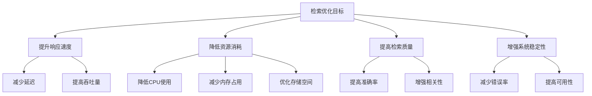

# 检索优化技巧

## 引言

检索优化是RAG系统性能提升的关键环节。通过合理的优化策略，可以在保持检索质量的同时显著提升系统性能。本文将深入探讨各种检索优化技巧，包括索引优化、查询优化、缓存策略和系统调优等方面。

## 检索优化概述

### 检索优化的目标



### 检索优化的层次

1. **算法层面**：优化检索算法本身
2. **系统层面**：优化系统架构和配置
3. **数据层面**：优化数据存储和索引
4. **应用层面**：优化查询处理和结果返回

## 索引优化

### 1. 索引结构优化

#### 向量索引优化

```python
import numpy as np
from typing import List, Dict, Tuple
import faiss

class VectorIndexOptimizer:
    def __init__(self, dimension: int = 384):
        self.dimension = dimension
        self.index = None
        self.index_type = None
    
    def create_optimized_index(self, vectors: List[List[float]], 
                              index_type: str = 'auto') -> faiss.Index:
        """创建优化的向量索引"""
        vectors_array = np.array(vectors).astype('float32')
        num_vectors = len(vectors)
        
        if index_type == 'auto':
            index_type = self._select_optimal_index_type(num_vectors)
        
        if index_type == 'flat':
            # 精确搜索，适合小规模数据
            self.index = faiss.IndexFlatIP(self.dimension)
        elif index_type == 'ivf':
            # IVF索引，适合中等规模数据
            nlist = min(4096, num_vectors // 100)
            quantizer = faiss.IndexFlatIP(self.dimension)
            self.index = faiss.IndexIVFFlat(quantizer, self.dimension, nlist)
            self.index.train(vectors_array)
        elif index_type == 'hnsw':
            # HNSW索引，适合大规模数据
            self.index = faiss.IndexHNSWFlat(self.dimension, 32)
        else:
            raise ValueError(f"Unsupported index type: {index_type}")
        
        # 添加向量到索引
        self.index.add(vectors_array)
        
        # 优化索引参数
        self._optimize_index_parameters()
        
        return self.index
    
    def _select_optimal_index_type(self, num_vectors: int) -> str:
        """根据数据规模选择最优索引类型"""
        if num_vectors < 10000:
            return 'flat'
        elif num_vectors < 1000000:
            return 'ivf'
        else:
            return 'hnsw'
    
    def _optimize_index_parameters(self):
        """优化索引参数"""
        if isinstance(self.index, faiss.IndexIVFFlat):
            # 优化IVF参数
            self.index.nprobe = min(64, self.index.nlist // 4)
        elif isinstance(self.index, faiss.IndexHNSWFlat):
            # 优化HNSW参数
            self.index.hnsw.efSearch = 64
            self.index.hnsw.efConstruction = 200
    
    def search_optimized(self, query_vector: List[float], k: int = 10) -> Tuple[np.ndarray, np.ndarray]:
        """优化的搜索"""
        query_array = np.array([query_vector]).astype('float32')
        
        # 执行搜索
        scores, indices = self.index.search(query_array, k)
        
        return scores[0], indices[0]
```

#### 倒排索引优化

```python
class InvertedIndexOptimizer:
    def __init__(self):
        self.index = {}
        self.doc_freq = {}
        self.collection_size = 0
    
    def build_optimized_index(self, documents: List[str]) -> Dict:
        """构建优化的倒排索引"""
        self.collection_size = len(documents)
        
        # 构建基础索引
        for doc_id, document in enumerate(documents):
            terms = self._tokenize(document)
            term_freq = {}
            
            for term in terms:
                if term not in self.index:
                    self.index[term] = {}
                    self.doc_freq[term] = 0
                
                if doc_id not in self.index[term]:
                    self.index[term][doc_id] = 0
                    self.doc_freq[term] += 1
                
                self.index[term][doc_id] += 1
                term_freq[term] = term_freq.get(term, 0) + 1
        
        # 优化索引
        self._optimize_index_structure()
        
        return self.index
    
    def _tokenize(self, text: str) -> List[str]:
        """分词"""
        import re
        # 简单的分词实现
        words = re.findall(r'\b\w+\b', text.lower())
        return words
    
    def _optimize_index_structure(self):
        """优化索引结构"""
        # 移除低频词
        min_doc_freq = max(1, self.collection_size // 1000)
        terms_to_remove = [term for term, freq in self.doc_freq.items() 
                          if freq < min_doc_freq]
        
        for term in terms_to_remove:
            del self.index[term]
            del self.doc_freq[term]
        
        # 压缩索引
        self._compress_index()
    
    def _compress_index(self):
        """压缩索引"""
        # 使用更紧凑的数据结构
        for term in self.index:
            doc_ids = list(self.index[term].keys())
            freqs = list(self.index[term].values())
            
            # 使用numpy数组存储
            self.index[term] = {
                'doc_ids': np.array(doc_ids, dtype=np.uint32),
                'freqs': np.array(freqs, dtype=np.uint16)
            }
    
    def search_optimized(self, query: str, k: int = 10) -> List[Tuple[int, float]]:
        """优化的搜索"""
        query_terms = self._tokenize(query)
        
        if not query_terms:
            return []
        
        # 计算文档分数
        doc_scores = {}
        
        for term in query_terms:
            if term not in self.index:
                continue
            
            # 计算TF-IDF分数
            term_data = self.index[term]
            doc_ids = term_data['doc_ids']
            freqs = term_data['freqs']
            
            idf = np.log(self.collection_size / self.doc_freq[term])
            
            for doc_id, freq in zip(doc_ids, freqs):
                tf = freq
                tf_idf = tf * idf
                
                if doc_id not in doc_scores:
                    doc_scores[doc_id] = 0
                doc_scores[doc_id] += tf_idf
        
        # 排序并返回top-k
        results = [(doc_id, score) for doc_id, score in doc_scores.items()]
        results.sort(key=lambda x: x[1], reverse=True)
        
        return results[:k]
```

### 2. 索引更新优化

#### 增量索引更新

```python
class IncrementalIndexUpdater:
    def __init__(self, base_index):
        self.base_index = base_index
        self.delta_index = {}
        self.deleted_docs = set()
    
    def add_documents(self, new_documents: List[str]) -> List[int]:
        """增量添加文档"""
        new_doc_ids = []
        
        for document in new_documents:
            doc_id = self._get_next_doc_id()
            new_doc_ids.append(doc_id)
            
            # 添加到增量索引
            terms = self._tokenize(document)
            for term in terms:
                if term not in self.delta_index:
                    self.delta_index[term] = {}
                
                if doc_id not in self.delta_index[term]:
                    self.delta_index[term][doc_id] = 0
                
                self.delta_index[term][doc_id] += 1
        
        return new_doc_ids
    
    def delete_documents(self, doc_ids: List[int]):
        """删除文档"""
        self.deleted_docs.update(doc_ids)
    
    def search_with_delta(self, query: str, k: int = 10) -> List[Tuple[int, float]]:
        """使用增量索引搜索"""
        # 基础索引搜索
        base_results = self.base_index.search_optimized(query, k * 2)
        
        # 增量索引搜索
        delta_results = self._search_delta_index(query, k * 2)
        
        # 合并结果
        combined_results = self._merge_results(base_results, delta_results)
        
        # 过滤已删除的文档
        filtered_results = [(doc_id, score) for doc_id, score in combined_results 
                           if doc_id not in self.deleted_docs]
        
        return filtered_results[:k]
    
    def _search_delta_index(self, query: str, k: int) -> List[Tuple[int, float]]:
        """搜索增量索引"""
        query_terms = self._tokenize(query)
        doc_scores = {}
        
        for term in query_terms:
            if term not in self.delta_index:
                continue
            
            for doc_id, freq in self.delta_index[term].items():
                if doc_id not in doc_scores:
                    doc_scores[doc_id] = 0
                doc_scores[doc_id] += freq
        
        results = [(doc_id, score) for doc_id, score in doc_scores.items()]
        results.sort(key=lambda x: x[1], reverse=True)
        
        return results[:k]
    
    def _merge_results(self, base_results: List[Tuple[int, float]], 
                      delta_results: List[Tuple[int, float]]) -> List[Tuple[int, float]]:
        """合并搜索结果"""
        doc_scores = {}
        
        # 添加基础索引结果
        for doc_id, score in base_results:
            doc_scores[doc_id] = score
        
        # 添加增量索引结果
        for doc_id, score in delta_results:
            if doc_id in doc_scores:
                doc_scores[doc_id] += score
            else:
                doc_scores[doc_id] = score
        
        # 排序
        combined_results = [(doc_id, score) for doc_id, score in doc_scores.items()]
        combined_results.sort(key=lambda x: x[1], reverse=True)
        
        return combined_results
```

## 查询优化

### 1. 查询预处理优化

```python
class QueryPreprocessor:
    def __init__(self):
        self.stop_words = self._load_stop_words()
        self.synonym_dict = self._load_synonyms()
    
    def optimize_query(self, query: str) -> str:
        """优化查询"""
        # 1. 清理查询
        cleaned_query = self._clean_query(query)
        
        # 2. 扩展查询
        expanded_query = self._expand_query(cleaned_query)
        
        # 3. 重写查询
        rewritten_query = self._rewrite_query(expanded_query)
        
        return rewritten_query
    
    def _clean_query(self, query: str) -> str:
        """清理查询"""
        import re
        
        # 移除特殊字符
        cleaned = re.sub(r'[^\w\s]', ' ', query)
        
        # 移除多余空格
        cleaned = re.sub(r'\s+', ' ', cleaned)
        
        return cleaned.strip()
    
    def _expand_query(self, query: str) -> str:
        """扩展查询"""
        words = query.split()
        expanded_words = []
        
        for word in words:
            expanded_words.append(word)
            
            # 添加同义词
            if word in self.synonym_dict:
                expanded_words.extend(self.synonym_dict[word][:2])  # 最多添加2个同义词
        
        return ' '.join(expanded_words)
    
    def _rewrite_query(self, query: str) -> str:
        """重写查询"""
        # 移除停用词
        words = query.split()
        filtered_words = [word for word in words if word not in self.stop_words]
        
        return ' '.join(filtered_words)
    
    def _load_stop_words(self) -> set:
        """加载停用词"""
        # 简单的停用词列表
        return {'的', '了', '在', '是', '我', '有', '和', '就', '不', '人', '都', '一', '一个', '上', '也', '很', '到', '说', '要', '去', '你', '会', '着', '没有', '看', '好', '自己', '这'}
    
    def _load_synonyms(self) -> dict:
        """加载同义词词典"""
        return {
            '人工智能': ['AI', '机器学习', '深度学习'],
            '算法': ['算法', '方法', '技术'],
            '数据': ['信息', '资料', '数据'],
            '系统': ['平台', '系统', '框架']
        }
```

### 2. 查询缓存优化

```python
class QueryCache:
    def __init__(self, cache_size: int = 10000, ttl: int = 3600):
        self.cache_size = cache_size
        self.ttl = ttl
        self.cache = {}
        self.access_times = {}
        self.access_counts = {}
    
    def get_cached_result(self, query: str) -> List[Tuple[int, float]]:
        """获取缓存结果"""
        query_hash = hash(query)
        current_time = time.time()
        
        if query_hash in self.cache:
            cache_time, result = self.cache[query_hash]
            
            # 检查TTL
            if current_time - cache_time < self.ttl:
                self.access_times[query_hash] = current_time
                self.access_counts[query_hash] = self.access_counts.get(query_hash, 0) + 1
                return result
            else:
                # 过期，删除
                del self.cache[query_hash]
                del self.access_times[query_hash]
                del self.access_counts[query_hash]
        
        return None
    
    def cache_result(self, query: str, result: List[Tuple[int, float]]):
        """缓存结果"""
        query_hash = hash(query)
        current_time = time.time()
        
        # 如果缓存已满，移除最少使用的项
        if len(self.cache) >= self.cache_size:
            self._evict_least_used()
        
        self.cache[query_hash] = (current_time, result)
        self.access_times[query_hash] = current_time
        self.access_counts[query_hash] = 1
    
    def _evict_least_used(self):
        """移除最少使用的缓存项"""
        if not self.cache:
            return
        
        # 找到最少使用的项
        least_used_hash = min(self.access_counts.items(), key=lambda x: x[1])[0]
        
        del self.cache[least_used_hash]
        del self.access_times[least_used_hash]
        del self.access_counts[least_used_hash]
    
    def get_cache_stats(self) -> Dict[str, int]:
        """获取缓存统计信息"""
        return {
            'cache_size': len(self.cache),
            'max_size': self.cache_size,
            'hit_rate': self._calculate_hit_rate()
        }
    
    def _calculate_hit_rate(self) -> float:
        """计算命中率"""
        total_accesses = sum(self.access_counts.values())
        if total_accesses == 0:
            return 0.0
        
        return len(self.cache) / total_accesses
```

### 3. 查询路由优化

```python
class QueryRouter:
    def __init__(self, retrievers: Dict[str, object]):
        self.retrievers = retrievers
        self.routing_rules = self._build_routing_rules()
    
    def route_query(self, query: str) -> str:
        """路由查询到合适的检索器"""
        query_features = self._extract_query_features(query)
        
        # 应用路由规则
        for rule in self.routing_rules:
            if self._matches_rule(query_features, rule):
                return rule['retriever']
        
        # 默认路由
        return 'default'
    
    def _extract_query_features(self, query: str) -> Dict[str, any]:
        """提取查询特征"""
        features = {}
        
        # 查询长度
        features['length'] = len(query.split())
        
        # 查询类型
        features['type'] = self._classify_query_type(query)
        
        # 语言
        features['language'] = self._detect_language(query)
        
        # 专业术语
        features['technical_terms'] = self._count_technical_terms(query)
        
        return features
    
    def _classify_query_type(self, query: str) -> str:
        """分类查询类型"""
        if '?' in query or query.startswith(('什么', '如何', '为什么')):
            return 'question'
        elif len(query.split()) < 3:
            return 'keyword'
        else:
            return 'semantic'
    
    def _detect_language(self, query: str) -> str:
        """检测语言"""
        chinese_chars = sum(1 for char in query if '\u4e00' <= char <= '\u9fff')
        if chinese_chars > len(query) * 0.3:
            return 'chinese'
        else:
            return 'english'
    
    def _count_technical_terms(self, query: str) -> int:
        """计算专业术语数量"""
        technical_terms = ['算法', '机器学习', '深度学习', '人工智能', '数据']
        return sum(1 for term in technical_terms if term in query)
    
    def _build_routing_rules(self) -> List[Dict]:
        """构建路由规则"""
        return [
            {
                'condition': lambda features: features['type'] == 'question',
                'retriever': 'semantic'
            },
            {
                'condition': lambda features: features['type'] == 'keyword',
                'retriever': 'keyword'
            },
            {
                'condition': lambda features: features['language'] == 'chinese',
                'retriever': 'chinese'
            },
            {
                'condition': lambda features: features['technical_terms'] > 0,
                'retriever': 'technical'
            }
        ]
    
    def _matches_rule(self, features: Dict, rule: Dict) -> bool:
        """检查是否匹配规则"""
        try:
            return rule['condition'](features)
        except:
            return False
```

## 缓存策略优化

### 1. 多级缓存

```python
class MultiLevelCache:
    def __init__(self, l1_size: int = 1000, l2_size: int = 10000):
        self.l1_cache = {}  # 内存缓存
        self.l2_cache = {}  # 磁盘缓存
        self.l1_size = l1_size
        self.l2_size = l2_size
        self.l1_access_times = {}
        self.l2_access_times = {}
    
    def get(self, key: str) -> any:
        """获取缓存数据"""
        # 首先检查L1缓存
        if key in self.l1_cache:
            self.l1_access_times[key] = time.time()
            return self.l1_cache[key]
        
        # 然后检查L2缓存
        if key in self.l2_cache:
            self.l2_access_times[key] = time.time()
            # 提升到L1缓存
            self._promote_to_l1(key, self.l2_cache[key])
            return self.l2_cache[key]
        
        return None
    
    def put(self, key: str, value: any):
        """存储缓存数据"""
        # 存储到L1缓存
        self._put_to_l1(key, value)
    
    def _put_to_l1(self, key: str, value: any):
        """存储到L1缓存"""
        # 如果L1缓存已满，移除最少使用的项
        if len(self.l1_cache) >= self.l1_size:
            self._evict_from_l1()
        
        self.l1_cache[key] = value
        self.l1_access_times[key] = time.time()
    
    def _promote_to_l1(self, key: str, value: any):
        """提升到L1缓存"""
        # 如果L1缓存已满，移除最少使用的项
        if len(self.l1_cache) >= self.l1_size:
            self._evict_from_l1()
        
        self.l1_cache[key] = value
        self.l1_access_times[key] = time.time()
        
        # 从L2缓存中移除
        if key in self.l2_cache:
            del self.l2_cache[key]
            del self.l2_access_times[key]
    
    def _evict_from_l1(self):
        """从L1缓存中移除最少使用的项"""
        if not self.l1_cache:
            return
        
        # 找到最少使用的项
        least_used_key = min(self.l1_access_times.items(), key=lambda x: x[1])[0]
        
        # 移动到L2缓存
        self._move_to_l2(least_used_key, self.l1_cache[least_used_key])
        
        # 从L1缓存中移除
        del self.l1_cache[least_used_key]
        del self.l1_access_times[least_used_key]
    
    def _move_to_l2(self, key: str, value: any):
        """移动到L2缓存"""
        # 如果L2缓存已满，移除最少使用的项
        if len(self.l2_cache) >= self.l2_size:
            self._evict_from_l2()
        
        self.l2_cache[key] = value
        self.l2_access_times[key] = time.time()
    
    def _evict_from_l2(self):
        """从L2缓存中移除最少使用的项"""
        if not self.l2_cache:
            return
        
        # 找到最少使用的项
        least_used_key = min(self.l2_access_times.items(), key=lambda x: x[1])[0]
        
        # 从L2缓存中移除
        del self.l2_cache[least_used_key]
        del self.l2_access_times[least_used_key]
```

### 2. 预取缓存

```python
class PrefetchCache:
    def __init__(self, cache_size: int = 1000, prefetch_size: int = 10):
        self.cache_size = cache_size
        self.prefetch_size = prefetch_size
        self.cache = {}
        self.access_patterns = {}
        self.prefetch_queue = []
    
    def get(self, key: str) -> any:
        """获取缓存数据"""
        if key in self.cache:
            # 记录访问模式
            self._record_access_pattern(key)
            
            # 触发预取
            self._trigger_prefetch(key)
            
            return self.cache[key]
        
        return None
    
    def put(self, key: str, value: any):
        """存储缓存数据"""
        # 如果缓存已满，移除最少使用的项
        if len(self.cache) >= self.cache_size:
            self._evict_least_used()
        
        self.cache[key] = value
    
    def _record_access_pattern(self, key: str):
        """记录访问模式"""
        current_time = time.time()
        
        if key not in self.access_patterns:
            self.access_patterns[key] = []
        
        self.access_patterns[key].append(current_time)
        
        # 只保留最近的访问记录
        if len(self.access_patterns[key]) > 100:
            self.access_patterns[key] = self.access_patterns[key][-100:]
    
    def _trigger_prefetch(self, key: str):
        """触发预取"""
        # 分析访问模式，预测下一个可能访问的键
        predicted_keys = self._predict_next_keys(key)
        
        # 添加到预取队列
        for pred_key in predicted_keys:
            if pred_key not in self.cache and pred_key not in self.prefetch_queue:
                self.prefetch_queue.append(pred_key)
    
    def _predict_next_keys(self, key: str) -> List[str]:
        """预测下一个可能访问的键"""
        # 简单的预测逻辑：基于历史访问模式
        if key in self.access_patterns:
            # 分析访问时间间隔
            access_times = self.access_patterns[key]
            if len(access_times) > 1:
                intervals = [access_times[i] - access_times[i-1] for i in range(1, len(access_times))]
                avg_interval = sum(intervals) / len(intervals)
                
                # 如果访问间隔较短，预测相关键
                if avg_interval < 60:  # 1分钟内
                    return self._get_related_keys(key)
        
        return []
    
    def _get_related_keys(self, key: str) -> List[str]:
        """获取相关键"""
        # 简单的相关键生成逻辑
        related_keys = []
        
        # 基于键的相似性生成相关键
        if 'query' in key:
            # 生成相似的查询键
            base_query = key.replace('query_', '')
            for i in range(3):
                related_keys.append(f'query_{base_query}_{i}')
        
        return related_keys[:self.prefetch_size]
    
    def _evict_least_used(self):
        """移除最少使用的项"""
        if not self.cache:
            return
        
        # 找到最少使用的项
        least_used_key = min(self.access_patterns.items(), 
                           key=lambda x: len(x[1]) if x[0] in self.cache else float('inf'))[0]
        
        if least_used_key in self.cache:
            del self.cache[least_used_key]
```

## 系统调优

### 1. 并发优化

```python
import asyncio
import aiohttp
from concurrent.futures import ThreadPoolExecutor
from typing import List, Dict, Any

class ConcurrentRetriever:
    def __init__(self, max_workers: int = 10):
        self.max_workers = max_workers
        self.executor = ThreadPoolExecutor(max_workers=max_workers)
        self.semaphore = asyncio.Semaphore(max_workers)
    
    async def concurrent_search(self, queries: List[str], 
                               documents: List[str]) -> List[List[Tuple[int, float]]]:
        """并发搜索"""
        tasks = []
        for query in queries:
            task = self._search_with_semaphore(query, documents)
            tasks.append(task)
        
        results = await asyncio.gather(*tasks)
        return results
    
    async def _search_with_semaphore(self, query: str, 
                                   documents: List[str]) -> List[Tuple[int, float]]:
        """使用信号量控制并发"""
        async with self.semaphore:
            return await self._async_search(query, documents)
    
    async def _async_search(self, query: str, 
                           documents: List[str]) -> List[Tuple[int, float]]:
        """异步搜索"""
        # 在线程池中执行CPU密集型任务
        loop = asyncio.get_event_loop()
        result = await loop.run_in_executor(
            self.executor, 
            self._cpu_intensive_search, 
            query, 
            documents
        )
        return result
    
    def _cpu_intensive_search(self, query: str, 
                             documents: List[str]) -> List[Tuple[int, float]]:
        """CPU密集型搜索"""
        # 实际的搜索逻辑
        results = []
        for i, doc in enumerate(documents):
            # 计算相似度
            similarity = self._calculate_similarity(query, doc)
            results.append((i, similarity))
        
        # 排序
        results.sort(key=lambda x: x[1], reverse=True)
        return results
    
    def _calculate_similarity(self, query: str, document: str) -> float:
        """计算相似度"""
        # 简单的相似度计算
        query_words = set(query.lower().split())
        doc_words = set(document.lower().split())
        
        intersection = query_words.intersection(doc_words)
        union = query_words.union(doc_words)
        
        if len(union) == 0:
            return 0.0
        
        return len(intersection) / len(union)
```

### 2. 内存优化

```python
class MemoryOptimizedRetriever:
    def __init__(self, max_memory_mb: int = 1024):
        self.max_memory_mb = max_memory_mb
        self.current_memory_mb = 0
        self.memory_usage = {}
    
    def optimize_memory_usage(self, vectors: List[List[float]]) -> np.ndarray:
        """优化内存使用"""
        vectors_array = np.array(vectors)
        
        # 使用更紧凑的数据类型
        if vectors_array.dtype == np.float64:
            vectors_array = vectors_array.astype(np.float32)
        
        # 压缩稀疏向量
        if self._is_sparse(vectors_array):
            vectors_array = self._compress_sparse_vectors(vectors_array)
        
        # 分块处理
        if vectors_array.nbytes > self.max_memory_mb * 1024 * 1024:
            vectors_array = self._chunk_vectors(vectors_array)
        
        return vectors_array
    
    def _is_sparse(self, vectors: np.ndarray) -> bool:
        """检查是否为稀疏向量"""
        zero_count = np.sum(vectors == 0)
        total_elements = vectors.size
        sparsity = zero_count / total_elements
        
        return sparsity > 0.5
    
    def _compress_sparse_vectors(self, vectors: np.ndarray) -> np.ndarray:
        """压缩稀疏向量"""
        from scipy.sparse import csr_matrix
        
        # 转换为稀疏矩阵
        sparse_vectors = csr_matrix(vectors)
        
        return sparse_vectors
    
    def _chunk_vectors(self, vectors: np.ndarray) -> np.ndarray:
        """分块处理向量"""
        chunk_size = self.max_memory_mb * 1024 * 1024 // vectors.itemsize
        num_chunks = (len(vectors) + chunk_size - 1) // chunk_size
        
        chunks = []
        for i in range(num_chunks):
            start_idx = i * chunk_size
            end_idx = min((i + 1) * chunk_size, len(vectors))
            chunk = vectors[start_idx:end_idx]
            chunks.append(chunk)
        
        return chunks
```

## 性能监控

### 1. 检索性能监控

```python
import time
import psutil
from typing import Dict, List
import logging

class RetrievalPerformanceMonitor:
    def __init__(self):
        self.metrics = {}
        self.logger = logging.getLogger(__name__)
    
    def monitor_search_performance(self, search_func, query: str, 
                                 documents: List[str]) -> Dict[str, float]:
        """监控搜索性能"""
        # 记录开始时间
        start_time = time.time()
        
        # 记录开始时的系统资源
        start_memory = psutil.Process().memory_info().rss / 1024 / 1024
        start_cpu = psutil.Process().cpu_percent()
        
        # 执行搜索
        try:
            results = search_func(query, documents)
            success = True
        except Exception as e:
            self.logger.error(f"Search failed: {e}")
            results = []
            success = False
        
        # 记录结束时间
        end_time = time.time()
        
        # 记录结束时的系统资源
        end_memory = psutil.Process().memory_info().rss / 1024 / 1024
        end_cpu = psutil.Process().cpu_percent()
        
        # 计算性能指标
        metrics = {
            'search_time': end_time - start_time,
            'memory_usage': end_memory - start_memory,
            'cpu_usage': end_cpu - start_cpu,
            'result_count': len(results),
            'success': success
        }
        
        # 记录指标
        self._record_metrics(metrics)
        
        return metrics
    
    def _record_metrics(self, metrics: Dict[str, float]):
        """记录性能指标"""
        for key, value in metrics.items():
            if key not in self.metrics:
                self.metrics[key] = []
            
            self.metrics[key].append(value)
    
    def get_performance_summary(self) -> Dict[str, float]:
        """获取性能摘要"""
        summary = {}
        
        for key, values in self.metrics.items():
            if values:
                summary[f'{key}_avg'] = sum(values) / len(values)
                summary[f'{key}_max'] = max(values)
                summary[f'{key}_min'] = min(values)
        
        return summary
    
    def detect_performance_issues(self) -> List[str]:
        """检测性能问题"""
        issues = []
        
        # 检查搜索时间
        if 'search_time' in self.metrics:
            avg_time = sum(self.metrics['search_time']) / len(self.metrics['search_time'])
            if avg_time > 1.0:  # 超过1秒
                issues.append(f"Average search time too high: {avg_time:.2f}s")
        
        # 检查内存使用
        if 'memory_usage' in self.metrics:
            avg_memory = sum(self.metrics['memory_usage']) / len(self.metrics['memory_usage'])
            if avg_memory > 100:  # 超过100MB
                issues.append(f"Average memory usage too high: {avg_memory:.2f}MB")
        
        # 检查成功率
        if 'success' in self.metrics:
            success_rate = sum(self.metrics['success']) / len(self.metrics['success'])
            if success_rate < 0.95:  # 成功率低于95%
                issues.append(f"Success rate too low: {success_rate:.2%}")
        
        return issues
```

## 最佳实践

### 1. 优化策略选择

```python
def select_optimization_strategy(requirements: dict) -> List[str]:
    """选择优化策略"""
    strategies = []
    
    if requirements['latency'] == 'critical':
        strategies.extend(['query_cache', 'index_optimization', 'concurrent_processing'])
    
    if requirements['memory'] == 'limited':
        strategies.extend(['memory_optimization', 'chunked_processing'])
    
    if requirements['accuracy'] == 'high':
        strategies.extend(['reranking', 'query_expansion'])
    
    if requirements['scalability'] == 'high':
        strategies.extend(['distributed_indexing', 'load_balancing'])
    
    return strategies
```

### 2. 性能调优指南

```python
class PerformanceTuningGuide:
    def __init__(self):
        self.tuning_recommendations = {}
    
    def get_tuning_recommendations(self, performance_metrics: Dict[str, float]) -> List[str]:
        """获取调优建议"""
        recommendations = []
        
        # 基于性能指标提供建议
        if performance_metrics.get('search_time', 0) > 1.0:
            recommendations.append("Consider using faster indexing algorithms like HNSW")
            recommendations.append("Implement query caching to reduce repeated computations")
        
        if performance_metrics.get('memory_usage', 0) > 500:
            recommendations.append("Use memory-efficient data structures")
            recommendations.append("Implement vector compression techniques")
        
        if performance_metrics.get('cpu_usage', 0) > 80:
            recommendations.append("Optimize CPU-intensive operations")
            recommendations.append("Consider using GPU acceleration")
        
        return recommendations
```

## 总结

检索优化是RAG系统性能提升的关键环节。本文介绍了索引优化、查询优化、缓存策略和系统调优等多个方面的优化技巧。

关键要点：
1. **索引优化**：选择合适的索引结构和参数
2. **查询优化**：预处理查询、缓存结果、路由查询
3. **缓存策略**：多级缓存、预取缓存
4. **系统调优**：并发优化、内存优化、性能监控

通过合理应用这些优化技巧，可以显著提升RAG系统的性能和用户体验。

---

**下一步学习建议：**
- 阅读《生成与优化》系列，了解RAG系统的生成阶段优化
- 实践不同的优化技巧，测量性能提升效果
- 关注检索优化技术的最新发展和创新方案
