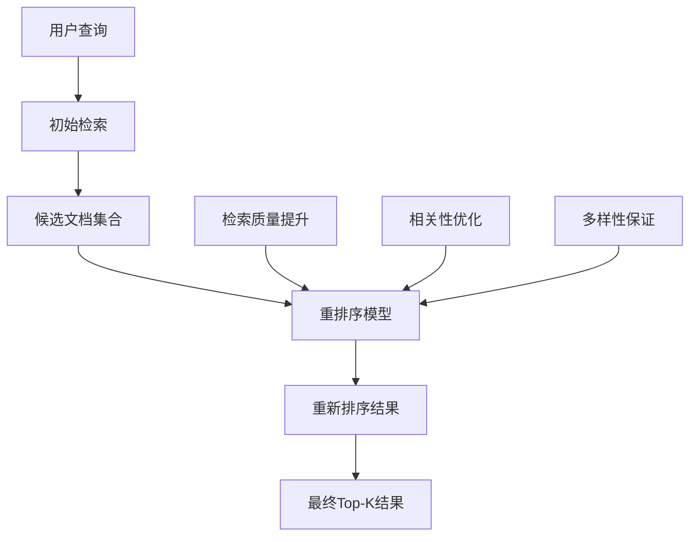

# 重排序技术

## 引言

重排序（Reranking）是RAG系统中的重要优化技术，它通过对初始检索结果进行重新排序来提升最终结果的质量。重排序技术能够弥补初始检索的不足，显著提高检索的准确性和相关性。本文将深入探讨各种重排序技术的原理、实现和应用。

## 重排序概述

### 什么是重排序

重排序是在初始检索结果的基础上，使用更精确的模型或算法对结果进行重新排序的过程。它通常作为检索管道的最后一步，用于优化最终结果的质量。

### 重排序的作用



### 重排序的优势

1. **提升准确性**：使用更精确的模型重新评估相关性
2. **弥补检索不足**：修正初始检索的排序错误
3. **融合多信号**：结合多种相关性信号
4. **个性化排序**：根据用户偏好调整排序

## 基于模型的重排序

### 1. 交叉编码器重排序

#### 原理介绍

交叉编码器（Cross-Encoder）同时编码查询和文档，能够捕获它们之间的深层交互信息，通常比重排序前的双编码器更准确。

#### 实现示例

```python
import torch
import torch.nn as nn
from transformers import AutoTokenizer, AutoModel
from typing import List, Tuple, Dict
import numpy as np

class CrossEncoderReranker:
    def __init__(self, model_name: str = "cross-encoder/ms-marco-MiniLM-L-6-v2"):
        self.tokenizer = AutoTokenizer.from_pretrained(model_name)
        self.model = AutoModel.from_pretrained(model_name)
        self.device = torch.device("cuda" if torch.cuda.is_available() else "cpu")
        self.model.to(self.device)
        self.model.eval()
    
    def rerank(self, query: str, documents: List[str], 
               initial_scores: List[float] = None) -> List[Tuple[int, float]]:
        """重排序文档"""
        if not documents:
            return []
        
        # 准备输入对
        query_doc_pairs = [(query, doc) for doc in documents]
        
        # 批量编码
        scores = self._batch_encode(query_doc_pairs)
        
        # 结合初始分数（可选）
        if initial_scores:
            scores = self._combine_scores(scores, initial_scores)
        
        # 创建结果列表
        results = [(i, score) for i, score in enumerate(scores)]
        
        # 按分数排序
        results.sort(key=lambda x: x[1], reverse=True)
        
        return results
    
    def _batch_encode(self, query_doc_pairs: List[Tuple[str, str]], 
                     batch_size: int = 32) -> List[float]:
        """批量编码查询-文档对"""
        all_scores = []
        
        for i in range(0, len(query_doc_pairs), batch_size):
            batch_pairs = query_doc_pairs[i:i + batch_size]
            batch_scores = self._encode_batch(batch_pairs)
            all_scores.extend(batch_scores)
        
        return all_scores
    
    def _encode_batch(self, query_doc_pairs: List[Tuple[str, str]]) -> List[float]:
        """编码一个批次的查询-文档对"""
        # 准备输入
        inputs = []
        for query, doc in query_doc_pairs:
            # 截断过长的文档
            doc = self._truncate_document(doc, max_length=512)
            inputs.append(f"{query} [SEP] {doc}")
        
        # 分词
        encoded = self.tokenizer(
            inputs,
            padding=True,
            truncation=True,
            max_length=512,
            return_tensors="pt"
        )
        
        # 移动到设备
        encoded = {k: v.to(self.device) for k, v in encoded.items()}
        
        # 前向传播
        with torch.no_grad():
            outputs = self.model(**encoded)
            # 使用[CLS]标记的表示计算分数
            scores = torch.sigmoid(outputs.last_hidden_state[:, 0, :]).mean(dim=1)
        
        return scores.cpu().numpy().tolist()
    
    def _truncate_document(self, doc: str, max_length: int = 512) -> str:
        """截断文档"""
        words = doc.split()
        if len(words) <= max_length:
            return doc
        
        return ' '.join(words[:max_length])
    
    def _combine_scores(self, rerank_scores: List[float], 
                       initial_scores: List[float], 
                       alpha: float = 0.7) -> List[float]:
        """结合重排序分数和初始分数"""
        combined_scores = []
        for rerank_score, initial_score in zip(rerank_scores, initial_scores):
            combined_score = alpha * rerank_score + (1 - alpha) * initial_score
            combined_scores.append(combined_score)
        return combined_scores
```

### 2. 双编码器重排序

#### 实现示例

```python
class DualEncoderReranker:
    def __init__(self, query_model, doc_model):
        self.query_model = query_model
        self.doc_model = doc_model
    
    def rerank(self, query: str, documents: List[str], 
               initial_scores: List[float] = None) -> List[Tuple[int, float]]:
        """双编码器重排序"""
        # 编码查询
        query_embedding = self.query_model.encode(query)
        
        # 编码文档
        doc_embeddings = self.doc_model.encode(documents)
        
        # 计算相似度
        similarities = np.dot(doc_embeddings, query_embedding)
        
        # 结合初始分数
        if initial_scores:
            similarities = self._combine_scores(similarities, initial_scores)
        
        # 创建结果
        results = [(i, score) for i, score in enumerate(similarities)]
        results.sort(key=lambda x: x[1], reverse=True)
        
        return results
    
    def _combine_scores(self, similarity_scores: np.ndarray, 
                       initial_scores: List[float], 
                       alpha: float = 0.6) -> np.ndarray:
        """结合相似度分数和初始分数"""
        initial_scores = np.array(initial_scores)
        combined_scores = alpha * similarity_scores + (1 - alpha) * initial_scores
        return combined_scores
```

## 基于规则的重排序

### 1. 多信号融合重排序

#### 实现示例

```python
class MultiSignalReranker:
    def __init__(self):
        self.signal_weights = {
            'semantic_similarity': 0.4,
            'keyword_match': 0.3,
            'document_length': 0.1,
            'freshness': 0.1,
            'popularity': 0.1
        }
    
    def rerank(self, query: str, documents: List[str], 
               metadata: List[Dict] = None) -> List[Tuple[int, float]]:
        """多信号重排序"""
        if not documents:
            return []
        
        # 计算各种信号
        signals = self._calculate_signals(query, documents, metadata)
        
        # 融合信号
        combined_scores = self._fuse_signals(signals)
        
        # 创建结果
        results = [(i, score) for i, score in enumerate(combined_scores)]
        results.sort(key=lambda x: x[1], reverse=True)
        
        return results
    
    def _calculate_signals(self, query: str, documents: List[str], 
                          metadata: List[Dict]) -> Dict[str, List[float]]:
        """计算各种信号"""
        signals = {}
        
        # 语义相似度
        signals['semantic_similarity'] = self._calculate_semantic_similarity(query, documents)
        
        # 关键词匹配
        signals['keyword_match'] = self._calculate_keyword_match(query, documents)
        
        # 文档长度
        signals['document_length'] = self._calculate_length_signal(documents)
        
        # 新鲜度
        if metadata:
            signals['freshness'] = self._calculate_freshness_signal(metadata)
        else:
            signals['freshness'] = [0.5] * len(documents)
        
        # 流行度
        if metadata:
            signals['popularity'] = self._calculate_popularity_signal(metadata)
        else:
            signals['popularity'] = [0.5] * len(documents)
        
        return signals
    
    def _calculate_semantic_similarity(self, query: str, documents: List[str]) -> List[float]:
        """计算语义相似度"""
        # 使用简单的TF-IDF相似度
        from sklearn.feature_extraction.text import TfidfVectorizer
        from sklearn.metrics.pairwise import cosine_similarity
        
        vectorizer = TfidfVectorizer()
        all_texts = [query] + documents
        tfidf_matrix = vectorizer.fit_transform(all_texts)
        
        query_vector = tfidf_matrix[0:1]
        doc_vectors = tfidf_matrix[1:]
        
        similarities = cosine_similarity(query_vector, doc_vectors).flatten()
        return similarities.tolist()
    
    def _calculate_keyword_match(self, query: str, documents: List[str]) -> List[float]:
        """计算关键词匹配"""
        query_words = set(query.lower().split())
        scores = []
        
        for doc in documents:
            doc_words = set(doc.lower().split())
            intersection = query_words.intersection(doc_words)
            union = query_words.union(doc_words)
            
            if len(union) == 0:
                scores.append(0.0)
            else:
                jaccard_score = len(intersection) / len(union)
                scores.append(jaccard_score)
        
        return scores
    
    def _calculate_length_signal(self, documents: List[str]) -> List[float]:
        """计算文档长度信号"""
        lengths = [len(doc.split()) for doc in documents]
        max_length = max(lengths) if lengths else 1
        
        # 归一化长度分数（中等长度文档得分更高）
        scores = []
        for length in lengths:
            # 使用高斯函数，峰值在max_length/2
            optimal_length = max_length / 2
            score = np.exp(-((length - optimal_length) ** 2) / (2 * (max_length / 4) ** 2))
            scores.append(score)
        
        return scores
    
    def _calculate_freshness_signal(self, metadata: List[Dict]) -> List[float]:
        """计算新鲜度信号"""
        import datetime
        
        scores = []
        current_time = datetime.datetime.now()
        
        for meta in metadata:
            if 'created_time' in meta:
                created_time = datetime.datetime.fromisoformat(meta['created_time'])
                days_old = (current_time - created_time).days
                # 新鲜度分数随时间衰减
                score = np.exp(-days_old / 365)  # 一年衰减到1/e
                scores.append(score)
            else:
                scores.append(0.5)  # 默认分数
        
        return scores
    
    def _calculate_popularity_signal(self, metadata: List[Dict]) -> List[float]:
        """计算流行度信号"""
        scores = []
        
        for meta in metadata:
            if 'view_count' in meta:
                view_count = meta['view_count']
                # 使用对数缩放
                score = np.log(1 + view_count) / 10  # 归一化
                scores.append(min(score, 1.0))
            else:
                scores.append(0.5)  # 默认分数
        
        return scores
    
    def _fuse_signals(self, signals: Dict[str, List[float]]) -> List[float]:
        """融合信号"""
        num_docs = len(list(signals.values())[0])
        combined_scores = [0.0] * num_docs
        
        for signal_name, signal_scores in signals.items():
            weight = self.signal_weights.get(signal_name, 0.0)
            for i, score in enumerate(signal_scores):
                combined_scores[i] += weight * score
        
        return combined_scores
```

### 2. 多样性重排序

#### 实现示例

```python
class DiversityReranker:
    def __init__(self, similarity_threshold: float = 0.8):
        self.similarity_threshold = similarity_threshold
    
    def rerank(self, query: str, documents: List[str], 
               initial_scores: List[float]) -> List[Tuple[int, float]]:
        """多样性重排序"""
        if not documents:
            return []
        
        # 计算文档间相似度矩阵
        similarity_matrix = self._calculate_document_similarity(documents)
        
        # 多样性重排序
        reranked_indices = self._diversity_rerank(similarity_matrix, initial_scores)
        
        # 创建结果
        results = [(idx, initial_scores[idx]) for idx in reranked_indices]
        
        return results
    
    def _calculate_document_similarity(self, documents: List[str]) -> np.ndarray:
        """计算文档间相似度矩阵"""
        from sklearn.feature_extraction.text import TfidfVectorizer
        from sklearn.metrics.pairwise import cosine_similarity
        
        vectorizer = TfidfVectorizer()
        tfidf_matrix = vectorizer.fit_transform(documents)
        similarity_matrix = cosine_similarity(tfidf_matrix)
        
        return similarity_matrix
    
    def _diversity_rerank(self, similarity_matrix: np.ndarray, 
                         initial_scores: List[float]) -> List[int]:
        """多样性重排序"""
        num_docs = len(initial_scores)
        selected_indices = []
        remaining_indices = list(range(num_docs))
        
        # 按初始分数排序
        sorted_indices = sorted(range(num_docs), key=lambda i: initial_scores[i], reverse=True)
        
        # 贪心选择，保证多样性
        while remaining_indices and len(selected_indices) < num_docs:
            best_idx = None
            best_score = -1
            
            for idx in remaining_indices:
                # 计算多样性分数
                diversity_score = self._calculate_diversity_score(idx, selected_indices, similarity_matrix)
                
                # 结合初始分数和多样性分数
                combined_score = 0.7 * initial_scores[idx] + 0.3 * diversity_score
                
                if combined_score > best_score:
                    best_score = combined_score
                    best_idx = idx
            
            if best_idx is not None:
                selected_indices.append(best_idx)
                remaining_indices.remove(best_idx)
        
        return selected_indices
    
    def _calculate_diversity_score(self, candidate_idx: int, 
                                 selected_indices: List[int], 
                                 similarity_matrix: np.ndarray) -> float:
        """计算多样性分数"""
        if not selected_indices:
            return 1.0
        
        # 计算与已选文档的最大相似度
        max_similarity = 0.0
        for selected_idx in selected_indices:
            similarity = similarity_matrix[candidate_idx][selected_idx]
            max_similarity = max(max_similarity, similarity)
        
        # 多样性分数 = 1 - 最大相似度
        diversity_score = 1.0 - max_similarity
        return diversity_score
```

## 学习排序重排序

### 1. 学习排序模型

#### 实现示例

```python
import xgboost as xgb
from sklearn.model_selection import train_test_split
from sklearn.metrics import ndcg_score
import numpy as np

class LearningToRankReranker:
    def __init__(self, model_type: str = 'xgboost'):
        self.model_type = model_type
        self.model = None
        self.feature_names = []
    
    def train(self, training_data: List[Dict]):
        """训练学习排序模型"""
        # 提取特征和标签
        X, y, groups = self._extract_features_and_labels(training_data)
        
        # 分割训练和验证集
        X_train, X_val, y_train, y_val, groups_train, groups_val = train_test_split(
            X, y, groups, test_size=0.2, random_state=42
        )
        
        if self.model_type == 'xgboost':
            self._train_xgboost(X_train, y_train, X_val, y_val, groups_train, groups_val)
        else:
            raise ValueError(f"Unsupported model type: {self.model_type}")
    
    def _extract_features_and_labels(self, training_data: List[Dict]) -> Tuple[np.ndarray, np.ndarray, List[int]]:
        """提取特征和标签"""
        features = []
        labels = []
        groups = []
        
        for query_data in training_data:
            query = query_data['query']
            documents = query_data['documents']
            relevance_scores = query_data['relevance_scores']
            
            query_group = []
            for i, (doc, score) in enumerate(zip(documents, relevance_scores)):
                # 提取特征
                feature_vector = self._extract_query_doc_features(query, doc)
                features.append(feature_vector)
                labels.append(score)
                query_group.append(len(features) - 1)
            
            groups.append(len(query_group))
        
        return np.array(features), np.array(labels), groups
    
    def _extract_query_doc_features(self, query: str, document: str) -> List[float]:
        """提取查询-文档特征"""
        features = []
        
        # 文本长度特征
        features.append(len(query.split()))
        features.append(len(document.split()))
        features.append(len(query) / len(document) if len(document) > 0 else 0)
        
        # 词汇重叠特征
        query_words = set(query.lower().split())
        doc_words = set(document.lower().split())
        
        intersection = query_words.intersection(doc_words)
        union = query_words.union(doc_words)
        
        features.append(len(intersection))  # 重叠词数
        features.append(len(intersection) / len(union) if len(union) > 0 else 0)  # Jaccard相似度
        features.append(len(intersection) / len(query_words) if len(query_words) > 0 else 0)  # 查询覆盖率
        
        # TF-IDF特征
        tfidf_features = self._calculate_tfidf_features(query, document)
        features.extend(tfidf_features)
        
        # 位置特征
        position_features = self._calculate_position_features(query, document)
        features.extend(position_features)
        
        return features
    
    def _calculate_tfidf_features(self, query: str, document: str) -> List[float]:
        """计算TF-IDF特征"""
        from sklearn.feature_extraction.text import TfidfVectorizer
        from sklearn.metrics.pairwise import cosine_similarity
        
        vectorizer = TfidfVectorizer()
        tfidf_matrix = vectorizer.fit_transform([query, document])
        
        # 余弦相似度
        similarity = cosine_similarity(tfidf_matrix[0:1], tfidf_matrix[1:2])[0][0]
        
        return [similarity]
    
    def _calculate_position_features(self, query: str, document: str) -> List[float]:
        """计算位置特征"""
        query_words = query.lower().split()
        doc_words = document.lower().split()
        
        features = []
        
        # 查询词在文档中的平均位置
        positions = []
        for word in query_words:
            if word in doc_words:
                pos = doc_words.index(word)
                positions.append(pos)
        
        if positions:
            features.append(np.mean(positions) / len(doc_words))
            features.append(np.min(positions) / len(doc_words))
        else:
            features.extend([1.0, 1.0])
        
        return features
    
    def _train_xgboost(self, X_train, y_train, X_val, y_val, groups_train, groups_val):
        """训练XGBoost模型"""
        # 创建XGBoost数据集
        dtrain = xgb.DMatrix(X_train, label=y_train)
        dval = xgb.DMatrix(X_val, label=y_val)
        
        # 设置参数
        params = {
            'objective': 'rank:pairwise',
            'eval_metric': 'ndcg',
            'eta': 0.1,
            'max_depth': 6,
            'subsample': 0.8,
            'colsample_bytree': 0.8,
            'random_state': 42
        }
        
        # 训练模型
        self.model = xgb.train(
            params,
            dtrain,
            num_boost_round=100,
            evals=[(dtrain, 'train'), (dval, 'val')],
            early_stopping_rounds=10,
            verbose_eval=False
        )
    
    def rerank(self, query: str, documents: List[str], 
               initial_scores: List[float] = None) -> List[Tuple[int, float]]:
        """使用学习排序模型重排序"""
        if not documents:
            return []
        
        # 提取特征
        features = []
        for doc in documents:
            feature_vector = self._extract_query_doc_features(query, doc)
            features.append(feature_vector)
        
        # 预测分数
        if self.model_type == 'xgboost':
            dtest = xgb.DMatrix(np.array(features))
            scores = self.model.predict(dtest)
        else:
            scores = self.model.predict(np.array(features))
        
        # 结合初始分数
        if initial_scores:
            scores = self._combine_scores(scores, initial_scores)
        
        # 创建结果
        results = [(i, score) for i, score in enumerate(scores)]
        results.sort(key=lambda x: x[1], reverse=True)
        
        return results
    
    def _combine_scores(self, learned_scores: np.ndarray, 
                       initial_scores: List[float], 
                       alpha: float = 0.8) -> np.ndarray:
        """结合学习分数和初始分数"""
        initial_scores = np.array(initial_scores)
        combined_scores = alpha * learned_scores + (1 - alpha) * initial_scores
        return combined_scores
```

## 实时重排序

### 1. 流式重排序

#### 实现示例

```python
class StreamingReranker:
    def __init__(self, window_size: int = 100):
        self.window_size = window_size
        self.document_buffer = []
        self.score_buffer = []
    
    def add_document(self, doc_id: int, document: str, initial_score: float):
        """添加文档到缓冲区"""
        self.document_buffer.append((doc_id, document))
        self.score_buffer.append(initial_score)
        
        # 如果缓冲区满了，进行重排序
        if len(self.document_buffer) >= self.window_size:
            return self._rerank_buffer()
        
        return None
    
    def _rerank_buffer(self) -> List[Tuple[int, float]]:
        """重排序缓冲区中的文档"""
        if not self.document_buffer:
            return []
        
        # 简单的重排序逻辑（可以根据需要替换为更复杂的模型）
        reranked_results = []
        
        for i, ((doc_id, document), initial_score) in enumerate(zip(self.document_buffer, self.score_buffer)):
            # 这里可以实现更复杂的重排序逻辑
            # 例如使用交叉编码器或其他模型
            reranked_score = self._calculate_rerank_score(document, initial_score)
            reranked_results.append((doc_id, reranked_score))
        
        # 按分数排序
        reranked_results.sort(key=lambda x: x[1], reverse=True)
        
        # 清空缓冲区
        self.document_buffer.clear()
        self.score_buffer.clear()
        
        return reranked_results
    
    def _calculate_rerank_score(self, document: str, initial_score: float) -> float:
        """计算重排序分数"""
        # 简单的重排序逻辑
        # 可以根据文档长度、关键词密度等因素调整分数
        length_factor = min(len(document.split()) / 100, 1.0)
        reranked_score = initial_score * (0.8 + 0.2 * length_factor)
        
        return reranked_score
    
    def flush(self) -> List[Tuple[int, float]]:
        """刷新缓冲区"""
        if self.document_buffer:
            return self._rerank_buffer()
        return []
```

## 重排序优化

### 1. 缓存优化

```python
class RerankingCache:
    def __init__(self, cache_size: int = 1000):
        self.cache = {}
        self.cache_size = cache_size
        self.access_count = {}
    
    def get_cached_rerank(self, query: str, doc_ids: List[int]) -> List[Tuple[int, float]]:
        """获取缓存的重排序结果"""
        cache_key = self._generate_cache_key(query, doc_ids)
        
        if cache_key in self.cache:
            self.access_count[cache_key] = self.access_count.get(cache_key, 0) + 1
            return self.cache[cache_key]
        
        return None
    
    def cache_rerank_result(self, query: str, doc_ids: List[int], 
                           rerank_result: List[Tuple[int, float]]):
        """缓存重排序结果"""
        cache_key = self._generate_cache_key(query, doc_ids)
        
        # 如果缓存已满，移除最少使用的项
        if len(self.cache) >= self.cache_size:
            least_used = min(self.access_count.items(), key=lambda x: x[1])
            del self.cache[least_used[0]]
            del self.access_count[least_used[0]]
        
        self.cache[cache_key] = rerank_result
        self.access_count[cache_key] = 1
    
    def _generate_cache_key(self, query: str, doc_ids: List[int]) -> str:
        """生成缓存键"""
        doc_ids_str = ','.join(map(str, sorted(doc_ids)))
        return f"{hash(query)}_{doc_ids_str}"
```

### 2. 批量处理优化

```python
class BatchReranker:
    def __init__(self, reranker, batch_size: int = 32):
        self.reranker = reranker
        self.batch_size = batch_size
    
    def rerank_batch(self, queries: List[str], 
                    documents_list: List[List[str]]) -> List[List[Tuple[int, float]]]:
        """批量重排序"""
        results = []
        
        for query, documents in zip(queries, documents_list):
            # 分批处理文档
            query_results = []
            
            for i in range(0, len(documents), self.batch_size):
                batch_docs = documents[i:i + self.batch_size]
                batch_results = self.reranker.rerank(query, batch_docs)
                
                # 调整索引
                adjusted_results = [(i + j, score) for j, (_, score) in enumerate(batch_results)]
                query_results.extend(adjusted_results)
            
            # 排序并添加到结果
            query_results.sort(key=lambda x: x[1], reverse=True)
            results.append(query_results)
        
        return results
```

## 重排序评估

### 1. 重排序效果评估

```python
class RerankingEvaluator:
    def __init__(self, reranker, test_data: List[Dict]):
        self.reranker = reranker
        self.test_data = test_data
    
    def evaluate_reranking(self) -> Dict[str, float]:
        """评估重排序效果"""
        metrics = {
            'ndcg_improvement': [],
            'precision_improvement': [],
            'recall_improvement': [],
            'map_improvement': []
        }
        
        for test_case in self.test_data:
            query = test_case['query']
            documents = test_case['documents']
            initial_scores = test_case['initial_scores']
            relevance_scores = test_case['relevance_scores']
            
            # 初始排序
            initial_results = [(i, score) for i, score in enumerate(initial_scores)]
            initial_results.sort(key=lambda x: x[1], reverse=True)
            
            # 重排序
            reranked_results = self.reranker.rerank(query, documents, initial_scores)
            
            # 计算改进
            ndcg_improvement = self._calculate_ndcg_improvement(
                initial_results, reranked_results, relevance_scores
            )
            
            precision_improvement = self._calculate_precision_improvement(
                initial_results, reranked_results, relevance_scores
            )
            
            recall_improvement = self._calculate_recall_improvement(
                initial_results, reranked_results, relevance_scores
            )
            
            map_improvement = self._calculate_map_improvement(
                initial_results, reranked_results, relevance_scores
            )
            
            metrics['ndcg_improvement'].append(ndcg_improvement)
            metrics['precision_improvement'].append(precision_improvement)
            metrics['recall_improvement'].append(recall_improvement)
            metrics['map_improvement'].append(map_improvement)
        
        # 计算平均改进
        avg_metrics = {key: np.mean(values) for key, values in metrics.items()}
        return avg_metrics
    
    def _calculate_ndcg_improvement(self, initial_results: List[Tuple[int, float]], 
                                  reranked_results: List[Tuple[int, float]], 
                                  relevance_scores: List[float]) -> float:
        """计算NDCG改进"""
        initial_ndcg = self._calculate_ndcg(initial_results, relevance_scores)
        reranked_ndcg = self._calculate_ndcg(reranked_results, relevance_scores)
        
        return reranked_ndcg - initial_ndcg
    
    def _calculate_ndcg(self, results: List[Tuple[int, float]], 
                       relevance_scores: List[float]) -> float:
        """计算NDCG"""
        if not results:
            return 0.0
        
        # 计算DCG
        dcg = 0.0
        for i, (doc_idx, _) in enumerate(results):
            if doc_idx < len(relevance_scores):
                dcg += relevance_scores[doc_idx] / np.log2(i + 2)
        
        # 计算IDCG
        ideal_scores = sorted(relevance_scores, reverse=True)
        idcg = 0.0
        for i in range(min(len(results), len(ideal_scores))):
            idcg += ideal_scores[i] / np.log2(i + 2)
        
        return dcg / idcg if idcg > 0 else 0.0
```

## 最佳实践

### 1. 重排序策略选择

```python
def select_reranking_strategy(requirements: dict) -> str:
    """选择重排序策略"""
    if requirements['accuracy'] == 'high' and requirements['latency'] == 'low':
        return 'cross_encoder'
    elif requirements['diversity'] == 'high':
        return 'diversity_reranking'
    elif requirements['personalization'] == 'high':
        return 'learning_to_rank'
    else:
        return 'multi_signal_reranking'
```

### 2. 重排序参数调优

```python
class RerankingOptimizer:
    def __init__(self, reranker):
        self.reranker = reranker
    
    def optimize_reranking_parameters(self, test_data: List[Dict]) -> Dict:
        """优化重排序参数"""
        best_params = None
        best_score = 0
        
        # 测试不同的参数组合
        param_combinations = self._generate_param_combinations()
        
        for params in param_combinations:
            # 设置参数
            self.reranker.set_parameters(params)
            
            # 评估性能
            score = self._evaluate_performance(test_data)
            
            if score > best_score:
                best_score = score
                best_params = params
        
        return best_params
```

## 总结

重排序技术是RAG系统的重要优化手段，能够显著提升检索结果的质量。本文介绍了基于模型的重排序、基于规则的重排序、学习排序重排序等多种技术。

关键要点：
1. **策略选择**：根据应用需求选择合适的重排序策略
2. **性能优化**：使用缓存、批量处理等技术提升性能
3. **效果评估**：建立完善的评估体系
4. **参数调优**：通过实验找到最优参数配置

在下一篇文章中，我们将探讨检索优化技巧，了解如何进一步提升检索系统的整体性能。

---

**下一步学习建议：**
- 阅读《检索优化技巧》，了解检索系统的性能优化方法
- 实践不同的重排序技术，比较它们的效果
- 关注重排序技术的最新发展和优化方案
