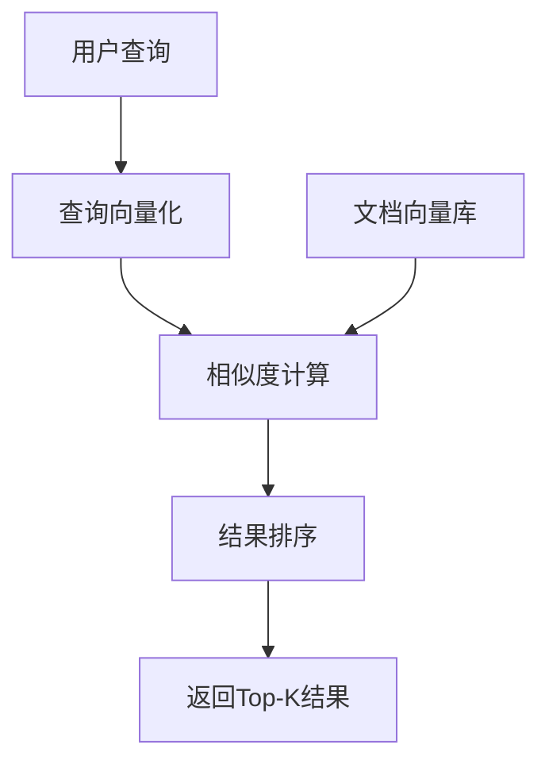

# 相似度检索算法

## 引言

相似度检索是RAG系统的核心功能，决定了系统能否准确找到与用户查询最相关的文档片段。不同的相似度算法有不同的特点和适用场景。本文将深入探讨各种相似度检索算法的原理、实现和应用。

## 相似度检索概述

### 什么是相似度检索

相似度检索是在向量空间中寻找与查询向量最相似的文档向量的过程。它通过计算向量间的距离或相似度来评估相关性。

### 相似度检索的基本流程



### 相似度检索的关键挑战

1. **计算复杂度**：大规模向量数据的相似度计算
2. **精度与效率平衡**：在准确性和速度之间找到平衡
3. **维度诅咒**：高维向量空间的检索效率问题
4. **语义理解**：确保检索结果符合语义相关性

## 距离度量方法

### 1. 欧几里得距离（L2距离）

#### 数学定义
对于两个向量 $x$ 和 $y$，欧几里得距离定义为：

$$d(x, y) = \sqrt{\sum_{i=1}^{n}(x_i - y_i)^2}$$

#### 实现示例

```python
import numpy as np
from typing import List, Tuple

class EuclideanDistance:
    def __init__(self):
        self.name = "Euclidean Distance"
    
    def calculate_distance(self, vector1: List[float], vector2: List[float]) -> float:
        """计算欧几里得距离"""
        vector1 = np.array(vector1)
        vector2 = np.array(vector2)
        
        # 确保向量维度相同
        if len(vector1) != len(vector2):
            raise ValueError("Vectors must have the same dimension")
        
        # 计算欧几里得距离
        distance = np.sqrt(np.sum((vector1 - vector2) ** 2))
        return float(distance)
    
    def calculate_similarity(self, vector1: List[float], vector2: List[float]) -> float:
        """计算相似度（距离的倒数）"""
        distance = self.calculate_distance(vector1, vector2)
        # 避免除零错误
        similarity = 1 / (1 + distance)
        return similarity
    
    def batch_calculate(self, query_vector: List[float], 
                       document_vectors: List[List[float]]) -> List[Tuple[int, float]]:
        """批量计算距离"""
        query_vector = np.array(query_vector)
        document_vectors = np.array(document_vectors)
        
        # 计算所有文档向量与查询向量的距离
        distances = np.sqrt(np.sum((document_vectors - query_vector) ** 2, axis=1))
        
        # 返回索引和距离的元组列表
        results = [(i, float(dist)) for i, dist in enumerate(distances)]
        return results
```

#### 优缺点分析

**优点：**
- 直观易懂，符合几何直觉
- 计算相对简单
- 适合低维数据

**缺点：**
- 受维度影响大
- 对异常值敏感
- 不适合高维稀疏向量

### 2. 余弦相似度

#### 数学定义
余弦相似度通过计算两个向量夹角的余弦值来衡量相似性：

$$\text{cosine\_similarity}(x, y) = \frac{x \cdot y}{||x|| \cdot ||y||} = \frac{\sum_{i=1}^{n}x_i y_i}{\sqrt{\sum_{i=1}^{n}x_i^2} \cdot \sqrt{\sum_{i=1}^{n}y_i^2}}$$

#### 实现示例

```python
class CosineSimilarity:
    def __init__(self):
        self.name = "Cosine Similarity"
    
    def calculate_similarity(self, vector1: List[float], vector2: List[float]) -> float:
        """计算余弦相似度"""
        vector1 = np.array(vector1)
        vector2 = np.array(vector2)
        
        # 计算点积
        dot_product = np.dot(vector1, vector2)
        
        # 计算向量的模长
        norm1 = np.linalg.norm(vector1)
        norm2 = np.linalg.norm(vector2)
        
        # 避免除零错误
        if norm1 == 0 or norm2 == 0:
            return 0.0
        
        # 计算余弦相似度
        similarity = dot_product / (norm1 * norm2)
        return float(similarity)
    
    def calculate_distance(self, vector1: List[float], vector2: List[float]) -> float:
        """计算余弦距离（1 - 余弦相似度）"""
        similarity = self.calculate_similarity(vector1, vector2)
        distance = 1 - similarity
        return distance
    
    def batch_calculate(self, query_vector: List[float], 
                       document_vectors: List[List[float]]) -> List[Tuple[int, float]]:
        """批量计算相似度"""
        query_vector = np.array(query_vector)
        document_vectors = np.array(document_vectors)
        
        # 计算点积
        dot_products = np.dot(document_vectors, query_vector)
        
        # 计算模长
        query_norm = np.linalg.norm(query_vector)
        doc_norms = np.linalg.norm(document_vectors, axis=1)
        
        # 计算余弦相似度
        similarities = dot_products / (query_norm * doc_norms)
        
        # 处理可能的NaN值
        similarities = np.nan_to_num(similarities, nan=0.0)
        
        results = [(i, float(sim)) for i, sim in enumerate(similarities)]
        return results
```

#### 优缺点分析

**优点：**
- 不受向量长度影响，只关注方向
- 适合高维稀疏向量
- 对文本向量化效果好
- 计算效率高

**缺点：**
- 不考虑向量的绝对大小
- 对某些应用场景可能不够敏感

### 3. 曼哈顿距离（L1距离）

#### 数学定义
曼哈顿距离是各维度差值的绝对值之和：

$$d(x, y) = \sum_{i=1}^{n}|x_i - y_i|$$

#### 实现示例

```python
class ManhattanDistance:
    def __init__(self):
        self.name = "Manhattan Distance"
    
    def calculate_distance(self, vector1: List[float], vector2: List[float]) -> float:
        """计算曼哈顿距离"""
        vector1 = np.array(vector1)
        vector2 = np.array(vector2)
        
        # 计算曼哈顿距离
        distance = np.sum(np.abs(vector1 - vector2))
        return float(distance)
    
    def calculate_similarity(self, vector1: List[float], vector2: List[float]) -> float:
        """计算相似度"""
        distance = self.calculate_distance(vector1, vector2)
        similarity = 1 / (1 + distance)
        return similarity
    
    def batch_calculate(self, query_vector: List[float], 
                       document_vectors: List[List[float]]) -> List[Tuple[int, float]]:
        """批量计算距离"""
        query_vector = np.array(query_vector)
        document_vectors = np.array(document_vectors)
        
        # 计算曼哈顿距离
        distances = np.sum(np.abs(document_vectors - query_vector), axis=1)
        
        results = [(i, float(dist)) for i, dist in enumerate(distances)]
        return results
```

### 4. 点积相似度

#### 数学定义
点积相似度直接计算两个向量的点积：

$$\text{dot\_product}(x, y) = \sum_{i=1}^{n}x_i y_i$$

#### 实现示例

```python
class DotProductSimilarity:
    def __init__(self):
        self.name = "Dot Product Similarity"
    
    def calculate_similarity(self, vector1: List[float], vector2: List[float]) -> float:
        """计算点积相似度"""
        vector1 = np.array(vector1)
        vector2 = np.array(vector2)
        
        # 计算点积
        similarity = np.dot(vector1, vector2)
        return float(similarity)
    
    def batch_calculate(self, query_vector: List[float], 
                       document_vectors: List[List[float]]) -> List[Tuple[int, float]]:
        """批量计算点积相似度"""
        query_vector = np.array(query_vector)
        document_vectors = np.array(document_vectors)
        
        # 计算点积
        similarities = np.dot(document_vectors, query_vector)
        
        results = [(i, float(sim)) for i, sim in enumerate(similarities)]
        return results
```

## 近似最近邻搜索算法

### 1. 随机投影（Random Projection）

#### 算法原理
通过随机投影将高维向量映射到低维空间，在低维空间中进行快速搜索。

#### 实现示例

```python
class RandomProjectionLSH:
    def __init__(self, n_components: int = 100, n_hash_tables: int = 10):
        self.n_components = n_components
        self.n_hash_tables = n_hash_tables
        self.hash_tables = []
        self.projections = []
        self.vectors = []
        self.vector_ids = []
    
    def fit(self, vectors: List[List[float]]):
        """训练LSH模型"""
        vectors = np.array(vectors)
        n_features = vectors.shape[1]
        
        # 生成随机投影矩阵
        for _ in range(self.n_hash_tables):
            projection = np.random.randn(n_features, self.n_components)
            self.projections.append(projection)
            self.hash_tables.append({})
        
        # 存储向量
        self.vectors = vectors
        self.vector_ids = list(range(len(vectors)))
        
        # 构建哈希表
        for i, vector in enumerate(vectors):
            self._add_vector_to_tables(vector, i)
    
    def _add_vector_to_tables(self, vector: np.ndarray, vector_id: int):
        """将向量添加到哈希表"""
        for table_idx, projection in enumerate(self.projections):
            # 投影到低维空间
            projected = np.dot(vector, projection)
            
            # 生成哈希码
            hash_code = self._generate_hash_code(projected)
            
            # 添加到哈希表
            if hash_code not in self.hash_tables[table_idx]:
                self.hash_tables[table_idx][hash_code] = []
            self.hash_tables[table_idx][hash_code].append(vector_id)
    
    def _generate_hash_code(self, projected_vector: np.ndarray) -> str:
        """生成哈希码"""
        # 将投影向量二值化
        binary_vector = (projected_vector > 0).astype(int)
        # 转换为字符串哈希码
        hash_code = ''.join(map(str, binary_vector))
        return hash_code
    
    def query(self, query_vector: List[float], top_k: int = 10) -> List[Tuple[int, float]]:
        """查询相似向量"""
        query_vector = np.array(query_vector)
        candidate_ids = set()
        
        # 在哈希表中查找候选向量
        for table_idx, projection in enumerate(self.projections):
            projected = np.dot(query_vector, projection)
            hash_code = self._generate_hash_code(projected)
            
            if hash_code in self.hash_tables[table_idx]:
                candidate_ids.update(self.hash_tables[table_idx][hash_code])
        
        # 计算精确相似度
        results = []
        for candidate_id in candidate_ids:
            similarity = self._calculate_similarity(query_vector, self.vectors[candidate_id])
            results.append((candidate_id, similarity))
        
        # 排序并返回top-k
        results.sort(key=lambda x: x[1], reverse=True)
        return results[:top_k]
    
    def _calculate_similarity(self, vector1: np.ndarray, vector2: np.ndarray) -> float:
        """计算相似度"""
        return float(np.dot(vector1, vector2) / (np.linalg.norm(vector1) * np.linalg.norm(vector2)))
```

### 2. 分层可导航小世界图（HNSW）

#### 算法原理
HNSW是一种基于图的近似最近邻搜索算法，通过构建多层图结构实现高效搜索。

#### 实现示例

```python
import heapq
from typing import List, Set, Dict

class HNSWIndex:
    def __init__(self, m: int = 16, ef_construction: int = 200, ef_search: int = 50):
        self.m = m  # 每个节点的最大连接数
        self.ef_construction = ef_construction  # 构建时的搜索宽度
        self.ef_search = ef_search  # 搜索时的搜索宽度
        self.vectors = []
        self.graph = {}  # 图结构：{node_id: [neighbor_ids]}
        self.levels = {}  # 节点层级：{node_id: level}
        self.max_level = 0
    
    def add_vector(self, vector: List[float]) -> int:
        """添加向量到索引"""
        vector_id = len(self.vectors)
        self.vectors.append(vector)
        
        # 随机分配层级
        level = self._random_level()
        self.levels[vector_id] = level
        
        # 初始化图结构
        self.graph[vector_id] = []
        
        if vector_id == 0:
            # 第一个向量
            self.max_level = level
            return vector_id
        
        # 从最高层开始搜索
        current_level = min(level, self.max_level)
        entry_point = self._find_entry_point()
        
        # 在每一层添加连接
        for l in range(current_level, -1, -1):
            candidates = self._search_layer(vector, entry_point, self.ef_construction, l)
            neighbors = self._select_neighbors(candidates, self.m)
            
            # 添加双向连接
            for neighbor in neighbors:
                self.graph[vector_id].append(neighbor)
                self.graph[neighbor].append(vector_id)
            
            # 更新入口点
            entry_point = candidates[0][1] if candidates else entry_point
        
        # 更新最大层级
        if level > self.max_level:
            self.max_level = level
        
        return vector_id
    
    def _random_level(self) -> int:
        """随机生成层级"""
        level = 0
        while random.random() < 0.5 and level < 16:
            level += 1
        return level
    
    def _find_entry_point(self) -> int:
        """找到入口点"""
        # 找到最高层级的节点
        max_level_nodes = [node_id for node_id, level in self.levels.items() 
                          if level == self.max_level]
        return max_level_nodes[0] if max_level_nodes else 0
    
    def _search_layer(self, query_vector: List[float], entry_point: int, 
                     ef: int, level: int) -> List[Tuple[float, int]]:
        """在指定层级搜索"""
        visited = set()
        candidates = [(-self._distance(query_vector, self.vectors[entry_point]), entry_point)]
        heapq.heapify(candidates)
        visited.add(entry_point)
        
        while candidates:
            current_dist, current_id = heapq.heappop(candidates)
            
            # 检查邻居
            for neighbor_id in self.graph.get(current_id, []):
                if neighbor_id in visited:
                    continue
                
                if self.levels.get(neighbor_id, 0) < level:
                    continue
                
                visited.add(neighbor_id)
                dist = self._distance(query_vector, self.vectors[neighbor_id])
                
                if len(candidates) < ef or dist < -candidates[0][0]:
                    heapq.heappush(candidates, (-dist, neighbor_id))
                    
                    if len(candidates) > ef:
                        heapq.heappop(candidates)
        
        return [(-dist, node_id) for dist, node_id in candidates]
    
    def _select_neighbors(self, candidates: List[Tuple[float, int]], m: int) -> List[int]:
        """选择邻居节点"""
        if len(candidates) <= m:
            return [node_id for _, node_id in candidates]
        
        # 贪心选择
        selected = []
        remaining = candidates.copy()
        
        while len(selected) < m and remaining:
            # 选择距离最小的节点
            best_dist, best_id = min(remaining)
            selected.append(best_id)
            
            # 移除已选择的节点
            remaining = [(dist, node_id) for dist, node_id in remaining if node_id != best_id]
        
        return selected
    
    def search(self, query_vector: List[float], top_k: int = 10) -> List[Tuple[int, float]]:
        """搜索最相似的向量"""
        if not self.vectors:
            return []
        
        # 从最高层开始搜索
        entry_point = self._find_entry_point()
        current_level = self.max_level
        
        # 在每一层搜索
        while current_level > 0:
            candidates = self._search_layer(query_vector, entry_point, 1, current_level)
            if candidates:
                entry_point = candidates[0][1]
            current_level -= 1
        
        # 在最底层进行最终搜索
        candidates = self._search_layer(query_vector, entry_point, self.ef_search, 0)
        
        # 返回top-k结果
        results = [(node_id, -dist) for dist, node_id in candidates[:top_k]]
        return results
    
    def _distance(self, vector1: List[float], vector2: List[float]) -> float:
        """计算距离"""
        return np.linalg.norm(np.array(vector1) - np.array(vector2))
```

### 3. 倒排文件（IVF）

#### 算法原理
IVF通过聚类将向量分组，搜索时只在相关聚类中进行，减少搜索空间。

#### 实现示例

```python
from sklearn.cluster import KMeans
from typing import List, Dict, Set

class IVFIndex:
    def __init__(self, n_clusters: int = 100, n_probe: int = 10):
        self.n_clusters = n_clusters
        self.n_probe = n_probe
        self.vectors = []
        self.vector_ids = []
        self.cluster_centers = None
        self.cluster_assignments = {}
        self.cluster_vectors = {}  # {cluster_id: [vector_ids]}
        self.kmeans = None
    
    def fit(self, vectors: List[List[float]]):
        """训练IVF索引"""
        self.vectors = vectors
        self.vector_ids = list(range(len(vectors)))
        
        # 使用K-means聚类
        self.kmeans = KMeans(n_clusters=self.n_clusters, random_state=42)
        cluster_labels = self.kmeans.fit_predict(vectors)
        
        # 存储聚类中心和分配
        self.cluster_centers = self.kmeans.cluster_centers_
        
        # 构建聚类到向量的映射
        for vector_id, cluster_id in enumerate(cluster_labels):
            self.cluster_assignments[vector_id] = cluster_id
            if cluster_id not in self.cluster_vectors:
                self.cluster_vectors[cluster_id] = []
            self.cluster_vectors[cluster_id].append(vector_id)
    
    def query(self, query_vector: List[float], top_k: int = 10) -> List[Tuple[int, float]]:
        """查询相似向量"""
        query_vector = np.array(query_vector)
        
        # 找到最近的聚类
        distances_to_centers = []
        for cluster_id, center in enumerate(self.cluster_centers):
            dist = np.linalg.norm(query_vector - center)
            distances_to_centers.append((dist, cluster_id))
        
        # 选择最近的n_probe个聚类
        distances_to_centers.sort()
        probe_clusters = [cluster_id for _, cluster_id in distances_to_centers[:self.n_probe]]
        
        # 在选定的聚类中搜索
        candidates = []
        for cluster_id in probe_clusters:
            for vector_id in self.cluster_vectors[cluster_id]:
                vector = np.array(self.vectors[vector_id])
                dist = np.linalg.norm(query_vector - vector)
                candidates.append((vector_id, dist))
        
        # 排序并返回top-k
        candidates.sort(key=lambda x: x[1])
        return candidates[:top_k]
    
    def add_vector(self, vector: List[float]) -> int:
        """添加新向量"""
        vector_id = len(self.vectors)
        self.vectors.append(vector)
        
        # 分配到最近的聚类
        vector_array = np.array(vector).reshape(1, -1)
        cluster_id = self.kmeans.predict(vector_array)[0]
        
        self.cluster_assignments[vector_id] = cluster_id
        if cluster_id not in self.cluster_vectors:
            self.cluster_vectors[cluster_id] = []
        self.cluster_vectors[cluster_id].append(vector_id)
        
        return vector_id
```

## 混合检索策略

### 1. 语义检索 + 关键词检索

#### 实现示例

```python
class HybridRetriever:
    def __init__(self, embedding_model, keyword_index):
        self.embedding_model = embedding_model
        self.keyword_index = keyword_index
        self.alpha = 0.7  # 语义检索权重
    
    def retrieve(self, query: str, top_k: int = 10) -> List[Tuple[int, float]]:
        """混合检索"""
        # 语义检索
        semantic_results = self._semantic_search(query, top_k * 2)
        
        # 关键词检索
        keyword_results = self._keyword_search(query, top_k * 2)
        
        # 合并结果
        combined_results = self._combine_results(semantic_results, keyword_results)
        
        # 返回top-k
        return combined_results[:top_k]
    
    def _semantic_search(self, query: str, top_k: int) -> List[Tuple[int, float]]:
        """语义检索"""
        query_embedding = self.embedding_model.encode(query)
        # 使用向量数据库进行语义搜索
        results = self.embedding_model.search(query_embedding, top_k)
        return results
    
    def _keyword_search(self, query: str, top_k: int) -> List[Tuple[int, float]]:
        """关键词检索"""
        # 使用传统搜索引擎进行关键词搜索
        results = self.keyword_index.search(query, top_k)
        return results
    
    def _combine_results(self, semantic_results: List[Tuple[int, float]], 
                        keyword_results: List[Tuple[int, float]]) -> List[Tuple[int, float]]:
        """合并检索结果"""
        # 创建文档ID到分数的映射
        doc_scores = {}
        
        # 添加语义检索分数
        for doc_id, score in semantic_results:
            doc_scores[doc_id] = self.alpha * score
        
        # 添加关键词检索分数
        for doc_id, score in keyword_results:
            if doc_id in doc_scores:
                doc_scores[doc_id] += (1 - self.alpha) * score
            else:
                doc_scores[doc_id] = (1 - self.alpha) * score
        
        # 排序并返回
        combined_results = [(doc_id, score) for doc_id, score in doc_scores.items()]
        combined_results.sort(key=lambda x: x[1], reverse=True)
        
        return combined_results
```

### 2. 多模型融合检索

#### 实现示例

```python
class MultiModelRetriever:
    def __init__(self, models: List[object], weights: List[float] = None):
        self.models = models
        self.weights = weights or [1.0] * len(models)
        
        # 归一化权重
        total_weight = sum(self.weights)
        self.weights = [w / total_weight for w in self.weights]
    
    def retrieve(self, query: str, top_k: int = 10) -> List[Tuple[int, float]]:
        """多模型融合检索"""
        all_results = []
        
        # 使用每个模型进行检索
        for model, weight in zip(self.models, self.weights):
            results = model.search(query, top_k * 2)
            # 应用权重
            weighted_results = [(doc_id, score * weight) for doc_id, score in results]
            all_results.extend(weighted_results)
        
        # 合并结果
        doc_scores = {}
        for doc_id, score in all_results:
            if doc_id in doc_scores:
                doc_scores[doc_id] += score
            else:
                doc_scores[doc_id] = score
        
        # 排序并返回
        combined_results = [(doc_id, score) for doc_id, score in doc_scores.items()]
        combined_results.sort(key=lambda x: x[1], reverse=True)
        
        return combined_results[:top_k]
```

## 检索质量评估

### 1. 检索指标

```python
class RetrievalMetrics:
    def __init__(self):
        self.metrics = {}
    
    def calculate_precision_at_k(self, retrieved_docs: List[int], 
                                relevant_docs: Set[int], k: int) -> float:
        """计算P@K"""
        retrieved_at_k = set(retrieved_docs[:k])
        relevant_at_k = retrieved_at_k.intersection(relevant_docs)
        
        if len(retrieved_at_k) == 0:
            return 0.0
        
        return len(relevant_at_k) / len(retrieved_at_k)
    
    def calculate_recall_at_k(self, retrieved_docs: List[int], 
                             relevant_docs: Set[int], k: int) -> float:
        """计算R@K"""
        retrieved_at_k = set(retrieved_docs[:k])
        relevant_at_k = retrieved_at_k.intersection(relevant_docs)
        
        if len(relevant_docs) == 0:
            return 0.0
        
        return len(relevant_at_k) / len(relevant_docs)
    
    def calculate_map(self, retrieved_docs: List[int], 
                     relevant_docs: Set[int]) -> float:
        """计算MAP"""
        if len(relevant_docs) == 0:
            return 0.0
        
        precision_sum = 0.0
        relevant_count = 0
        
        for i, doc_id in enumerate(retrieved_docs):
            if doc_id in relevant_docs:
                relevant_count += 1
                precision_at_i = relevant_count / (i + 1)
                precision_sum += precision_at_i
        
        return precision_sum / len(relevant_docs)
    
    def calculate_ndcg_at_k(self, retrieved_docs: List[int], 
                           relevance_scores: List[float], k: int) -> float:
        """计算NDCG@K"""
        # 计算DCG
        dcg = 0.0
        for i in range(min(k, len(retrieved_docs))):
            doc_id = retrieved_docs[i]
            if doc_id < len(relevance_scores):
                dcg += relevance_scores[doc_id] / np.log2(i + 2)
        
        # 计算IDCG
        ideal_scores = sorted(relevance_scores, reverse=True)
        idcg = 0.0
        for i in range(min(k, len(ideal_scores))):
            idcg += ideal_scores[i] / np.log2(i + 2)
        
        # 计算NDCG
        if idcg == 0:
            return 0.0
        
        return dcg / idcg
```

### 2. 检索效果评估

```python
class RetrievalEvaluator:
    def __init__(self, retriever, test_data: List[Dict]):
        self.retriever = retriever
        self.test_data = test_data
    
    def evaluate(self, k_values: List[int] = [1, 5, 10]) -> Dict[str, float]:
        """评估检索效果"""
        metrics = {}
        
        for k in k_values:
            precision_scores = []
            recall_scores = []
            map_scores = []
            ndcg_scores = []
            
            for test_case in self.test_data:
                query = test_case['query']
                relevant_docs = set(test_case['relevant_docs'])
                relevance_scores = test_case.get('relevance_scores', [1.0] * len(relevant_docs))
                
                # 执行检索
                retrieved_docs = self.retriever.retrieve(query, top_k=max(k_values))
                retrieved_ids = [doc_id for doc_id, _ in retrieved_docs]
                
                # 计算指标
                precision = self._calculate_precision_at_k(retrieved_ids, relevant_docs, k)
                recall = self._calculate_recall_at_k(retrieved_ids, relevant_docs, k)
                map_score = self._calculate_map(retrieved_ids, relevant_docs)
                ndcg = self._calculate_ndcg_at_k(retrieved_ids, relevance_scores, k)
                
                precision_scores.append(precision)
                recall_scores.append(recall)
                map_scores.append(map_score)
                ndcg_scores.append(ndcg)
            
            # 计算平均指标
            metrics[f'P@{k}'] = np.mean(precision_scores)
            metrics[f'R@{k}'] = np.mean(recall_scores)
            metrics[f'MAP@{k}'] = np.mean(map_scores)
            metrics[f'NDCG@{k}'] = np.mean(ndcg_scores)
        
        return metrics
```

## 检索优化技巧

### 1. 查询扩展

```python
class QueryExpansion:
    def __init__(self, embedding_model, synonym_dict: Dict[str, List[str]]):
        self.embedding_model = embedding_model
        self.synonym_dict = synonym_dict
    
    def expand_query(self, query: str) -> str:
        """扩展查询"""
        # 同义词扩展
        expanded_terms = []
        for term in query.split():
            expanded_terms.append(term)
            if term in self.synonym_dict:
                expanded_terms.extend(self.synonym_dict[term])
        
        # 语义扩展
        semantic_terms = self._semantic_expansion(query)
        expanded_terms.extend(semantic_terms)
        
        return ' '.join(expanded_terms)
    
    def _semantic_expansion(self, query: str) -> List[str]:
        """语义扩展"""
        # 使用embedding模型找到语义相似的词
        query_embedding = self.embedding_model.encode(query)
        similar_terms = self.embedding_model.find_similar_terms(query_embedding, top_k=3)
        return similar_terms
```

### 2. 结果重排序

```python
class ResultReranker:
    def __init__(self, reranking_model):
        self.reranking_model = reranking_model
    
    def rerank(self, query: str, documents: List[str], 
               initial_scores: List[float]) -> List[Tuple[int, float]]:
        """重排序结果"""
        # 使用重排序模型计算新的分数
        reranked_scores = []
        for doc in documents:
            score = self.reranking_model.score(query, doc)
            reranked_scores.append(score)
        
        # 结合初始分数和重排序分数
        combined_scores = []
        for i, (initial_score, reranked_score) in enumerate(zip(initial_scores, reranked_scores)):
            combined_score = 0.7 * reranked_score + 0.3 * initial_score
            combined_scores.append((i, combined_score))
        
        # 排序
        combined_scores.sort(key=lambda x: x[1], reverse=True)
        return combined_scores
```

## 最佳实践

### 1. 算法选择策略

```python
def select_retrieval_algorithm(requirements: dict) -> str:
    """选择检索算法"""
    if requirements['accuracy'] == 'high':
        if requirements['speed'] == 'high':
            return 'HNSW'
        else:
            return 'Exact Search'
    elif requirements['scalability'] == 'high':
        return 'IVF'
    else:
        return 'Random Projection LSH'
```

### 2. 参数调优

```python
class RetrievalOptimizer:
    def __init__(self, retriever):
        self.retriever = retriever
    
    def optimize_parameters(self, test_data: List[Dict]) -> Dict:
        """优化检索参数"""
        best_params = None
        best_score = 0
        
        # 测试不同的参数组合
        param_combinations = self._generate_param_combinations()
        
        for params in param_combinations:
            # 设置参数
            self.retriever.set_parameters(params)
            
            # 评估性能
            score = self._evaluate_performance(test_data)
            
            if score > best_score:
                best_score = score
                best_params = params
        
        return best_params
    
    def _generate_param_combinations(self) -> List[Dict]:
        """生成参数组合"""
        # 根据具体算法生成参数组合
        pass
    
    def _evaluate_performance(self, test_data: List[Dict]) -> float:
        """评估性能"""
        # 实现性能评估逻辑
        pass
```

## 总结

相似度检索算法是RAG系统的核心，选择合适的算法对系统性能至关重要。本文介绍了各种距离度量方法、近似最近邻搜索算法、混合检索策略和优化技巧。

关键要点：
1. **算法选择**：根据准确性、速度和可扩展性要求选择合适算法
2. **混合策略**：结合多种检索方法提升效果
3. **质量评估**：建立完善的评估体系
4. **参数优化**：通过实验找到最佳参数配置

在下一篇文章中，我们将探讨混合检索策略，了解如何结合不同检索方法的优势。

---

**下一步学习建议：**
- 阅读《混合检索策略》，了解如何结合多种检索方法
- 实践不同的相似度算法，比较它们的效果
- 关注检索技术的最新发展和优化方案
