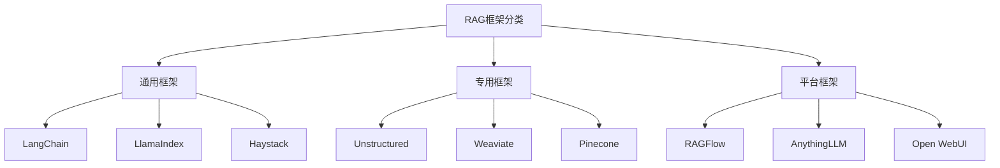
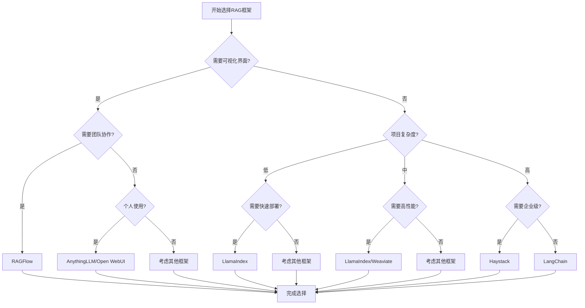

# 开源RAG框架对比

## 引言

随着RAG技术的快速发展，出现了许多优秀的开源RAG框架。本文将深入对比分析主流RAG框架的特点、优势和适用场景，帮助开发者选择最适合的框架。

## 主流RAG框架概览

### 框架分类



## 详细对比分析

### 1. LangChain

#### 特点
- **模块化设计**：提供丰富的组件和工具
- **链式调用**：支持复杂的流程编排
- **丰富集成**：支持多种LLM和工具
- **活跃社区**：文档完善，社区活跃

#### 优势
```python
# 示例：LangChain的模块化设计
from langchain.llms import OpenAI
from langchain.chains import RetrievalQA
from langchain.vectorstores import Chroma

# 组件可以灵活组合
llm = OpenAI(temperature=0.7)
vectorstore = Chroma.from_documents(documents, embeddings)
qa_chain = RetrievalQA.from_chain_type(
    llm=llm,
    chain_type="stuff",
    retriever=vectorstore.as_retriever()
)
```

#### 劣势
- 学习曲线陡峭
- 性能开销较大
- 版本更新频繁

#### 适用场景
- 复杂的RAG应用开发
- 需要高度定制化的场景
- 研究和实验项目

### 2. LlamaIndex

#### 特点
- **专门优化**：专为RAG应用设计
- **数据连接**：强大的数据连接能力
- **索引构建**：灵活的索引构建方式
- **查询处理**：高效的查询处理

#### 优势
```python
# 示例：LlamaIndex的简洁API
from llama_index import VectorStoreIndex, SimpleDirectoryReader

# 简洁的API设计
documents = SimpleDirectoryReader("./data").load_data()
index = VectorStoreIndex.from_documents(documents)
query_engine = index.as_query_engine()
response = query_engine.query("What is RAG?")
```

#### 劣势
- 功能相对单一
- 社区规模较小
- 文档相对简单

#### 适用场景
- 快速原型开发
- 数据密集型应用
- 需要高性能检索的场景

### 3. Haystack

#### 特点
- **企业级**：面向企业级应用
- **管道设计**：基于管道的架构
- **多模态**：支持多种模态
- **可扩展**：高度可扩展

#### 优势
```python
# 示例：Haystack的管道设计
from haystack import Pipeline
from haystack.nodes import EmbeddingRetriever, FARMReader

# 管道式架构
pipeline = Pipeline()
pipeline.add_node(component=retriever, name="Retriever", inputs=["Query"])
pipeline.add_node(component=reader, name="Reader", inputs=["Retriever"])
```

#### 劣势
- 学习曲线较陡
- 配置复杂
- 资源消耗较大

#### 适用场景
- 企业级应用
- 大规模部署
- 需要高可扩展性的场景

### 4. Unstructured

#### 特点
- **文档处理**：专注于文档处理
- **格式支持**：支持多种文档格式
- **结构化**：将非结构化数据结构化
- **API友好**：提供REST API

#### 优势
```python
# 示例：Unstructured的文档处理
from unstructured.partition.pdf import partition_pdf

# 强大的文档处理能力
elements = partition_pdf("document.pdf")
for element in elements:
    print(f"Type: {element.category}")
    print(f"Text: {element.text}")
```

#### 劣势
- 功能相对单一
- 主要关注文档处理
- 需要与其他框架配合

#### 适用场景
- 文档预处理
- 数据清洗
- 结构化数据提取

### 5. Weaviate

#### 特点
- **向量数据库**：专门的向量数据库
- **GraphQL**：支持GraphQL查询
- **多模态**：支持多种模态
- **云原生**：云原生设计

#### 优势
```python
# 示例：Weaviate的向量存储
import weaviate

client = weaviate.Client("http://localhost:8080")

# 强大的向量存储能力
client.schema.create_class({
    "class": "Document",
    "properties": [
        {"name": "content", "dataType": ["text"]},
        {"name": "vector", "dataType": ["number[]"]}
    ]
})
```

#### 劣势
- 主要是存储层
- 需要额外开发
- 学习成本较高

#### 适用场景
- 大规模向量存储
- 高性能检索
- 多模态应用

### 6. Pinecone

#### 特点
- **托管服务**：完全托管的向量数据库
- **高性能**：优化的性能
- **易用性**：简单的API
- **可扩展**：自动扩展

#### 优势
```python
# 示例：Pinecone的简单API
import pinecone

pinecone.init(api_key="your-api-key", environment="us-west1-gcp")
index = pinecone.Index("my-index")

# 简单的向量操作
index.upsert(vectors=[("id1", [0.1, 0.2, 0.3])])
results = index.query(vector=[0.1, 0.2, 0.3], top_k=5)
```

#### 劣势
- 成本较高
- 依赖外部服务
- 定制化程度低

#### 适用场景
- 快速原型开发
- 中小规模应用
- 需要托管服务的场景

### 7. RAGFlow

#### 特点
- **可视化**：提供可视化界面
- **开箱即用**：快速部署
- **团队协作**：支持团队协作
- **多模态**：支持多模态

#### 优势
```python
# 示例：RAGFlow的简单使用
from ragflow import RAGFlowClient

client = RAGFlowClient(api_key="your-api-key")

# 简单的API调用
kb = client.create_knowledge_base(name="My KB")
app = client.create_app(name="My App", knowledge_base_id=kb.id)
response = client.test_app(app_id=app.id, question="What is RAG?")
```

#### 劣势
- 定制化程度低
- 依赖平台
- 功能相对固定

#### 适用场景
- 快速部署
- 团队协作
- 非技术用户

### 8. AnythingLLM

#### 特点
- **本地部署**：支持本地部署
- **隐私保护**：数据不离开本地
- **多模型**：支持多种模型
- **易用性**：界面友好

#### 优势
```python
# 示例：AnythingLLM的本地部署
# 通过Web界面配置，无需编程
# 支持多种模型和文档格式
# 提供REST API接口
```

#### 劣势
- 功能相对简单
- 定制化程度低
- 主要面向个人用户

#### 适用场景
- 个人使用
- 隐私要求高
- 快速部署

### 9. Open WebUI

#### 特点
- **开源**：完全开源
- **本地部署**：支持本地部署
- **多模型**：支持多种模型
- **社区驱动**：社区驱动开发

#### 优势
```python
# 示例：Open WebUI的本地部署
# 通过Docker快速部署
# 支持多种模型
# 提供Web界面
```

#### 劣势
- 功能相对简单
- 主要面向聊天
- 定制化程度低

#### 适用场景
- 个人使用
- 快速部署
- 简单应用

## 性能对比

### 1. 性能指标

| 框架 | 启动时间 | 内存占用 | 响应速度 | 并发能力 | 扩展性 |
|------|----------|----------|----------|----------|--------|
| LangChain | 中等 | 高 | 中等 | 中等 | 高 |
| LlamaIndex | 快 | 中等 | 快 | 高 | 中等 |
| Haystack | 慢 | 高 | 快 | 高 | 高 |
| Unstructured | 快 | 低 | 快 | 中等 | 低 |
| Weaviate | 中等 | 中等 | 快 | 高 | 高 |
| Pinecone | 快 | 低 | 快 | 高 | 高 |
| RAGFlow | 中等 | 中等 | 中等 | 中等 | 中等 |
| AnythingLLM | 快 | 低 | 中等 | 低 | 低 |
| Open WebUI | 快 | 低 | 中等 | 低 | 低 |

### 2. 性能测试

```python
import time
import psutil
import asyncio
from concurrent.futures import ThreadPoolExecutor

class PerformanceTester:
    def __init__(self):
        self.results = {}
    
    def test_startup_time(self, framework_name, setup_func):
        """测试启动时间"""
        start_time = time.time()
        setup_func()
        end_time = time.time()
        self.results[framework_name] = {
            "startup_time": end_time - start_time
        }
    
    def test_memory_usage(self, framework_name, run_func):
        """测试内存使用"""
        process = psutil.Process()
        initial_memory = process.memory_info().rss / 1024 / 1024  # MB
        
        run_func()
        
        final_memory = process.memory_info().rss / 1024 / 1024  # MB
        memory_usage = final_memory - initial_memory
        
        if framework_name not in self.results:
            self.results[framework_name] = {}
        self.results[framework_name]["memory_usage"] = memory_usage
    
    def test_response_time(self, framework_name, query_func, query):
        """测试响应时间"""
        start_time = time.time()
        query_func(query)
        end_time = time.time()
        
        if framework_name not in self.results:
            self.results[framework_name] = {}
        self.results[framework_name]["response_time"] = end_time - start_time
    
    def test_concurrency(self, framework_name, query_func, queries, max_workers=10):
        """测试并发能力"""
        start_time = time.time()
        
        with ThreadPoolExecutor(max_workers=max_workers) as executor:
            futures = [executor.submit(query_func, query) for query in queries]
            results = [future.result() for future in futures]
        
        end_time = time.time()
        
        if framework_name not in self.results:
            self.results[framework_name] = {}
        self.results[framework_name]["concurrency_time"] = end_time - start_time
        self.results[framework_name]["concurrency_success"] = len(results)
    
    def get_results(self):
        """获取测试结果"""
        return self.results

# 使用示例
tester = PerformanceTester()

# 测试LangChain
def setup_langchain():
    from langchain.llms import OpenAI
    from langchain.vectorstores import Chroma
    # 设置代码

def query_langchain(query):
    # 查询代码
    pass

tester.test_startup_time("LangChain", setup_langchain)
tester.test_memory_usage("LangChain", lambda: query_langchain("test"))
tester.test_response_time("LangChain", query_langchain, "What is RAG?")
tester.test_concurrency("LangChain", query_langchain, ["query1", "query2", "query3"])

# 测试LlamaIndex
def setup_llamaindex():
    from llama_index import VectorStoreIndex, SimpleDirectoryReader
    # 设置代码

def query_llamaindex(query):
    # 查询代码
    pass

tester.test_startup_time("LlamaIndex", setup_llamaindex)
tester.test_memory_usage("LlamaIndex", lambda: query_llamaindex("test"))
tester.test_response_time("LlamaIndex", query_llamaindex, "What is RAG?")
tester.test_concurrency("LlamaIndex", query_llamaindex, ["query1", "query2", "query3"])

results = tester.get_results()
print("性能测试结果:", results)
```

## 功能对比

### 1. 功能矩阵

| 功能 | LangChain | LlamaIndex | Haystack | Unstructured | Weaviate | Pinecone | RAGFlow | AnythingLLM | Open WebUI |
|------|-----------|------------|----------|--------------|----------|----------|---------|--------------|------------|
| 文档处理 | ✓ | ✓ | ✓ | ✓ | ✗ | ✗ | ✓ | ✓ | ✓ |
| 向量存储 | ✓ | ✓ | ✓ | ✗ | ✓ | ✓ | ✓ | ✓ | ✓ |
| 检索 | ✓ | ✓ | ✓ | ✗ | ✓ | ✓ | ✓ | ✓ | ✓ |
| 生成 | ✓ | ✓ | ✓ | ✗ | ✗ | ✗ | ✓ | ✓ | ✓ |
| 多模态 | ✓ | ✓ | ✓ | ✓ | ✓ | ✓ | ✓ | ✓ | ✓ |
| 可视化 | ✗ | ✗ | ✗ | ✗ | ✗ | ✗ | ✓ | ✓ | ✓ |
| 团队协作 | ✗ | ✗ | ✗ | ✗ | ✗ | ✗ | ✓ | ✗ | ✗ |
| 本地部署 | ✓ | ✓ | ✓ | ✓ | ✓ | ✗ | ✓ | ✓ | ✓ |
| 云服务 | ✓ | ✓ | ✓ | ✓ | ✓ | ✓ | ✓ | ✗ | ✗ |
| API接口 | ✓ | ✓ | ✓ | ✓ | ✓ | ✓ | ✓ | ✓ | ✓ |

### 2. 功能详细对比

```python
class FeatureComparison:
    def __init__(self):
        self.frameworks = {
            "LangChain": {
                "document_processing": "支持多种文档格式，丰富的解析器",
                "vector_storage": "支持多种向量数据库",
                "retrieval": "支持多种检索策略",
                "generation": "支持多种LLM",
                "multimodal": "支持多模态处理",
                "visualization": "无内置可视化",
                "team_collaboration": "无团队协作功能",
                "local_deployment": "支持本地部署",
                "cloud_service": "支持云服务",
                "api_interface": "提供Python API"
            },
            "LlamaIndex": {
                "document_processing": "支持多种文档格式，优化的解析器",
                "vector_storage": "支持多种向量数据库",
                "retrieval": "高效的检索算法",
                "generation": "支持多种LLM",
                "multimodal": "支持多模态处理",
                "visualization": "无内置可视化",
                "team_collaboration": "无团队协作功能",
                "local_deployment": "支持本地部署",
                "cloud_service": "支持云服务",
                "api_interface": "提供Python API"
            },
            "Haystack": {
                "document_processing": "企业级文档处理",
                "vector_storage": "支持多种向量数据库",
                "retrieval": "管道式检索",
                "generation": "支持多种LLM",
                "multimodal": "支持多模态处理",
                "visualization": "无内置可视化",
                "team_collaboration": "无团队协作功能",
                "local_deployment": "支持本地部署",
                "cloud_service": "支持云服务",
                "api_interface": "提供Python API"
            },
            "Unstructured": {
                "document_processing": "专业的文档处理",
                "vector_storage": "无向量存储",
                "retrieval": "无检索功能",
                "generation": "无生成功能",
                "multimodal": "支持多模态处理",
                "visualization": "无内置可视化",
                "team_collaboration": "无团队协作功能",
                "local_deployment": "支持本地部署",
                "cloud_service": "支持云服务",
                "api_interface": "提供Python API和REST API"
            },
            "Weaviate": {
                "document_processing": "无文档处理",
                "vector_storage": "专业的向量数据库",
                "retrieval": "高效的向量检索",
                "generation": "无生成功能",
                "multimodal": "支持多模态存储",
                "visualization": "无内置可视化",
                "team_collaboration": "无团队协作功能",
                "local_deployment": "支持本地部署",
                "cloud_service": "支持云服务",
                "api_interface": "提供GraphQL API"
            },
            "Pinecone": {
                "document_processing": "无文档处理",
                "vector_storage": "托管的向量数据库",
                "retrieval": "高效的向量检索",
                "generation": "无生成功能",
                "multimodal": "支持多模态存储",
                "visualization": "无内置可视化",
                "team_collaboration": "无团队协作功能",
                "local_deployment": "不支持本地部署",
                "cloud_service": "完全托管服务",
                "api_interface": "提供REST API"
            },
            "RAGFlow": {
                "document_processing": "支持多种文档格式",
                "vector_storage": "内置向量存储",
                "retrieval": "支持多种检索策略",
                "generation": "支持多种LLM",
                "multimodal": "支持多模态处理",
                "visualization": "提供可视化界面",
                "team_collaboration": "支持团队协作",
                "local_deployment": "支持本地部署",
                "cloud_service": "支持云服务",
                "api_interface": "提供REST API"
            },
            "AnythingLLM": {
                "document_processing": "支持多种文档格式",
                "vector_storage": "内置向量存储",
                "retrieval": "基础检索功能",
                "generation": "支持多种LLM",
                "multimodal": "支持多模态处理",
                "visualization": "提供Web界面",
                "team_collaboration": "无团队协作功能",
                "local_deployment": "支持本地部署",
                "cloud_service": "不支持云服务",
                "api_interface": "提供REST API"
            },
            "Open WebUI": {
                "document_processing": "支持多种文档格式",
                "vector_storage": "内置向量存储",
                "retrieval": "基础检索功能",
                "generation": "支持多种LLM",
                "multimodal": "支持多模态处理",
                "visualization": "提供Web界面",
                "team_collaboration": "无团队协作功能",
                "local_deployment": "支持本地部署",
                "cloud_service": "不支持云服务",
                "api_interface": "提供REST API"
            }
        }
    
    def compare_features(self, framework1: str, framework2: str):
        """对比两个框架的功能"""
        if framework1 not in self.frameworks or framework2 not in self.frameworks:
            raise ValueError("框架不存在")
        
        features1 = self.frameworks[framework1]
        features2 = self.frameworks[framework2]
        
        comparison = {}
        for feature in features1:
            comparison[feature] = {
                framework1: features1[feature],
                framework2: features2[feature]
            }
        
        return comparison
    
    def get_framework_summary(self, framework: str):
        """获取框架摘要"""
        if framework not in self.frameworks:
            raise ValueError("框架不存在")
        
        features = self.frameworks[framework]
        summary = {
            "strengths": [],
            "weaknesses": [],
            "use_cases": []
        }
        
        # 分析优势
        if features["document_processing"] != "无文档处理":
            summary["strengths"].append("文档处理能力强")
        if features["vector_storage"] != "无向量存储":
            summary["strengths"].append("向量存储支持")
        if features["retrieval"] != "无检索功能":
            summary["strengths"].append("检索功能完善")
        if features["generation"] != "无生成功能":
            summary["strengths"].append("生成功能支持")
        if features["visualization"] != "无内置可视化":
            summary["strengths"].append("可视化界面")
        if features["team_collaboration"] != "无团队协作功能":
            summary["strengths"].append("团队协作支持")
        
        # 分析劣势
        if features["document_processing"] == "无文档处理":
            summary["weaknesses"].append("无文档处理功能")
        if features["vector_storage"] == "无向量存储":
            summary["weaknesses"].append("无向量存储功能")
        if features["retrieval"] == "无检索功能":
            summary["weaknesses"].append("无检索功能")
        if features["generation"] == "无生成功能":
            summary["weaknesses"].append("无生成功能")
        if features["local_deployment"] == "不支持本地部署":
            summary["weaknesses"].append("不支持本地部署")
        
        # 推荐使用场景
        if framework in ["LangChain", "LlamaIndex", "Haystack"]:
            summary["use_cases"].append("复杂RAG应用开发")
        if framework in ["RAGFlow", "AnythingLLM", "Open WebUI"]:
            summary["use_cases"].append("快速部署")
        if framework in ["Weaviate", "Pinecone"]:
            summary["use_cases"].append("大规模向量存储")
        if framework == "Unstructured":
            summary["use_cases"].append("文档预处理")
        
        return summary

# 使用示例
comparison = FeatureComparison()

# 对比LangChain和LlamaIndex
langchain_vs_llamaindex = comparison.compare_features("LangChain", "LlamaIndex")
print("LangChain vs LlamaIndex:", langchain_vs_llamaindex)

# 获取LangChain摘要
langchain_summary = comparison.get_framework_summary("LangChain")
print("LangChain摘要:", langchain_summary)
```

## 选择建议

### 1. 选择指南

```python
class FrameworkSelector:
    def __init__(self):
        self.selection_criteria = {
            "complexity": {
                "low": ["RAGFlow", "AnythingLLM", "Open WebUI"],
                "medium": ["LlamaIndex", "Pinecone"],
                "high": ["LangChain", "Haystack", "Weaviate"]
            },
            "deployment": {
                "local": ["LangChain", "LlamaIndex", "Haystack", "Unstructured", "Weaviate", "RAGFlow", "AnythingLLM", "Open WebUI"],
                "cloud": ["LangChain", "LlamaIndex", "Haystack", "Unstructured", "Weaviate", "Pinecone", "RAGFlow"],
                "hybrid": ["LangChain", "LlamaIndex", "Haystack", "RAGFlow"]
            },
            "team_size": {
                "individual": ["AnythingLLM", "Open WebUI", "LlamaIndex"],
                "small": ["RAGFlow", "LangChain", "LlamaIndex"],
                "large": ["Haystack", "Weaviate", "Pinecone"]
            },
            "budget": {
                "free": ["LangChain", "LlamaIndex", "Haystack", "Unstructured", "Weaviate", "RAGFlow", "AnythingLLM", "Open WebUI"],
                "paid": ["Pinecone", "RAGFlow Cloud"]
            },
            "use_case": {
                "research": ["LangChain", "LlamaIndex", "Haystack"],
                "production": ["Haystack", "Weaviate", "Pinecone", "RAGFlow"],
                "prototype": ["LlamaIndex", "RAGFlow", "AnythingLLM"],
                "document_processing": ["Unstructured", "LangChain", "LlamaIndex"]
            }
        }
    
    def recommend_framework(self, requirements: dict) -> list:
        """推荐框架"""
        recommendations = []
        
        # 根据复杂度推荐
        if "complexity" in requirements:
            complexity = requirements["complexity"]
            if complexity in self.selection_criteria["complexity"]:
                recommendations.extend(self.selection_criteria["complexity"][complexity])
        
        # 根据部署方式推荐
        if "deployment" in requirements:
            deployment = requirements["deployment"]
            if deployment in self.selection_criteria["deployment"]:
                if recommendations:
                    recommendations = list(set(recommendations) & set(self.selection_criteria["deployment"][deployment]))
                else:
                    recommendations.extend(self.selection_criteria["deployment"][deployment])
        
        # 根据团队规模推荐
        if "team_size" in requirements:
            team_size = requirements["team_size"]
            if team_size in self.selection_criteria["team_size"]:
                if recommendations:
                    recommendations = list(set(recommendations) & set(self.selection_criteria["team_size"][team_size]))
                else:
                    recommendations.extend(self.selection_criteria["team_size"][team_size])
        
        # 根据预算推荐
        if "budget" in requirements:
            budget = requirements["budget"]
            if budget in self.selection_criteria["budget"]:
                if recommendations:
                    recommendations = list(set(recommendations) & set(self.selection_criteria["budget"][budget]))
                else:
                    recommendations.extend(self.selection_criteria["budget"][budget])
        
        # 根据使用场景推荐
        if "use_case" in requirements:
            use_case = requirements["use_case"]
            if use_case in self.selection_criteria["use_case"]:
                if recommendations:
                    recommendations = list(set(recommendations) & set(self.selection_criteria["use_case"][use_case]))
                else:
                    recommendations.extend(self.selection_criteria["use_case"][use_case])
        
        return list(set(recommendations))  # 去重
    
    def get_detailed_recommendation(self, requirements: dict) -> dict:
        """获取详细推荐"""
        recommendations = self.recommend_framework(requirements)
        
        detailed_recommendation = {
            "recommended_frameworks": recommendations,
            "reasoning": {},
            "next_steps": []
        }
        
        # 分析推荐理由
        for framework in recommendations:
            reasoning = []
            
            if "complexity" in requirements:
                complexity = requirements["complexity"]
                if framework in self.selection_criteria["complexity"][complexity]:
                    reasoning.append(f"适合{complexity}复杂度需求")
            
            if "deployment" in requirements:
                deployment = requirements["deployment"]
                if framework in self.selection_criteria["deployment"][deployment]:
                    reasoning.append(f"支持{deployment}部署")
            
            if "team_size" in requirements:
                team_size = requirements["team_size"]
                if framework in self.selection_criteria["team_size"][team_size]:
                    reasoning.append(f"适合{team_size}团队")
            
            if "budget" in requirements:
                budget = requirements["budget"]
                if framework in self.selection_criteria["budget"][budget]:
                    reasoning.append(f"符合{budget}预算")
            
            if "use_case" in requirements:
                use_case = requirements["use_case"]
                if framework in self.selection_criteria["use_case"][use_case]:
                    reasoning.append(f"适合{use_case}场景")
            
            detailed_recommendation["reasoning"][framework] = reasoning
        
        # 提供下一步建议
        if recommendations:
            detailed_recommendation["next_steps"] = [
                "1. 查看推荐框架的官方文档",
                "2. 尝试快速入门教程",
                "3. 评估框架是否满足具体需求",
                "4. 进行性能测试",
                "5. 制定实施计划"
            ]
        else:
            detailed_recommendation["next_steps"] = [
                "1. 重新评估需求",
                "2. 考虑组合使用多个框架",
                "3. 咨询技术专家",
                "4. 进行更详细的技术调研"
            ]
        
        return detailed_recommendation

# 使用示例
selector = FrameworkSelector()

# 示例需求
requirements = {
    "complexity": "medium",
    "deployment": "local",
    "team_size": "small",
    "budget": "free",
    "use_case": "prototype"
}

# 获取推荐
recommendations = selector.recommend_framework(requirements)
print("推荐框架:", recommendations)

# 获取详细推荐
detailed = selector.get_detailed_recommendation(requirements)
print("详细推荐:", detailed)
```

### 2. 决策树



## 总结

本文深入对比了主流RAG框架的特点、优势和适用场景。每个框架都有其独特的优势和适用场景：

**通用框架**：
- **LangChain**：适合复杂应用开发，学习曲线陡峭
- **LlamaIndex**：适合快速原型开发，性能优秀
- **Haystack**：适合企业级应用，功能强大

**专用框架**：
- **Unstructured**：专注于文档处理
- **Weaviate**：专业的向量数据库
- **Pinecone**：托管的向量数据库

**平台框架**：
- **RAGFlow**：提供可视化界面和团队协作
- **AnythingLLM**：适合个人使用
- **Open WebUI**：开源聊天界面

选择建议：
1. **快速原型**：选择LlamaIndex或RAGFlow
2. **复杂应用**：选择LangChain或Haystack
3. **企业级**：选择Haystack或Weaviate
4. **个人使用**：选择AnythingLLM或Open WebUI
5. **团队协作**：选择RAGFlow

在下一篇文章中，我们将探讨多模态RAG，了解RAG技术在多模态领域的应用。

---

**下一步学习建议：**
- 阅读《多模态RAG》，了解RAG技术在多模态领域的应用
- 根据需求选择合适的RAG框架
- 关注RAG框架技术的最新发展和创新方案
