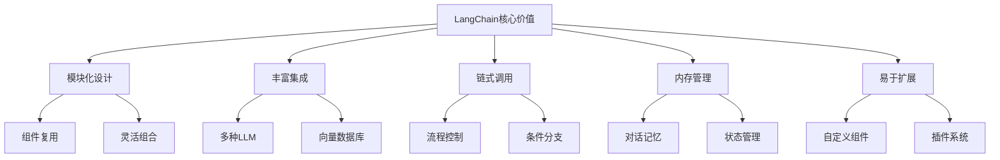

# LangChain实战

## 引言

LangChain是一个强大的RAG应用开发框架，提供了丰富的组件和工具来构建复杂的RAG系统。本文将深入探讨LangChain的核心概念、使用方法和实战应用。

## LangChain概述

### 什么是LangChain

LangChain是一个用于构建基于大语言模型应用的框架，它提供了：
- 模块化的组件设计
- 丰富的工具和集成
- 灵活的链式调用
- 强大的内存管理
- 完善的文档和社区支持

### LangChain的核心价值



## 核心组件

### 1. LLM和Chat Models

```python
from langchain.llms import OpenAI
from langchain.chat_models import ChatOpenAI
from langchain.schema import HumanMessage, SystemMessage

# 基础LLM使用
llm = OpenAI(temperature=0.7, max_tokens=1000)

# Chat Model使用
chat_model = ChatOpenAI(temperature=0.7, model_name="gpt-3.5-turbo")

# 消息格式
messages = [
    SystemMessage(content="你是一个专业的AI助手"),
    HumanMessage(content="请解释什么是RAG技术")
]

# 调用模型
response = chat_model(messages)
print(response.content)
```

### 2. 提示模板

```python
from langchain.prompts import PromptTemplate, ChatPromptTemplate
from langchain.schema import HumanMessagePromptTemplate, SystemMessagePromptTemplate

# 基础提示模板
prompt_template = PromptTemplate(
    input_variables=["topic", "context"],
    template="请基于以下上下文回答关于{topic}的问题：\n\n上下文：{context}\n\n回答："
)

# Chat提示模板
chat_prompt = ChatPromptTemplate.from_messages([
    SystemMessagePromptTemplate.from_template("你是一个专业的{role}"),
    HumanMessagePromptTemplate.from_template("请解释{topic}")
])

# 使用模板
formatted_prompt = prompt_template.format(
    topic="机器学习",
    context="机器学习是人工智能的一个分支..."
)
```

### 3. 输出解析器

```python
from langchain.output_parsers import PydanticOutputParser
from pydantic import BaseModel, Field
from typing import List

# 定义输出结构
class RAGAnalysis(BaseModel):
    summary: str = Field(description="RAG技术的总结")
    advantages: List[str] = Field(description="RAG技术的优势")
    applications: List[str] = Field(description="RAG技术的应用场景")
    confidence: float = Field(description="分析的置信度")

# 创建解析器
parser = PydanticOutputParser(pydantic_object=RAGAnalysis)

# 使用解析器
response = llm(formatted_prompt)
parsed_output = parser.parse(response)
print(parsed_output.summary)
```

### 4. 文档加载器

```python
from langchain.document_loaders import TextLoader, PyPDFLoader, WebBaseLoader
from langchain.text_splitter import RecursiveCharacterTextSplitter

# 加载文档
loader = PyPDFLoader("document.pdf")
documents = loader.load()

# 文本分割
text_splitter = RecursiveCharacterTextSplitter(
    chunk_size=1000,
    chunk_overlap=200,
    length_function=len
)
texts = text_splitter.split_documents(documents)

# 网页加载
web_loader = WebBaseLoader("https://example.com")
web_documents = web_loader.load()
```

### 5. 向量存储

```python
from langchain.vectorstores import Chroma, FAISS
from langchain.embeddings import OpenAIEmbeddings

# 创建嵌入
embeddings = OpenAIEmbeddings()

# 使用Chroma向量数据库
vectorstore = Chroma.from_documents(
    documents=texts,
    embedding=embeddings,
    persist_directory="./chroma_db"
)

# 使用FAISS向量数据库
vectorstore = FAISS.from_documents(texts, embeddings)

# 相似性搜索
query = "什么是RAG技术？"
docs = vectorstore.similarity_search(query, k=4)
```

## 链式调用

### 1. 基础链

```python
from langchain.chains import LLMChain, SimpleSequentialChain

# 创建LLM链
llm_chain = LLMChain(
    llm=llm,
    prompt=prompt_template,
    output_key="answer"
)

# 执行链
result = llm_chain.run(topic="RAG技术", context="检索增强生成...")

# 简单顺序链
simple_chain = SimpleSequentialChain(
    chains=[llm_chain],
    verbose=True
)
```

### 2. 检索链

```python
from langchain.chains import RetrievalQA, ConversationalRetrievalChain
from langchain.memory import ConversationBufferMemory

# 检索问答链
qa_chain = RetrievalQA.from_chain_type(
    llm=llm,
    chain_type="stuff",
    retriever=vectorstore.as_retriever(),
    return_source_documents=True
)

# 对话检索链
memory = ConversationBufferMemory(
    memory_key="chat_history",
    return_messages=True
)

conversational_chain = ConversationalRetrievalChain.from_llm(
    llm=llm,
    retriever=vectorstore.as_retriever(),
    memory=memory,
    return_source_documents=True
)
```

### 3. 自定义链

```python
from langchain.chains.base import Chain
from typing import Dict, List, Any

class CustomRAGChain(Chain):
    """自定义RAG链"""
    
    input_key: str = "question"
    output_key: str = "answer"
    
    def __init__(self, llm, retriever, **kwargs):
        super().__init__(**kwargs)
        self.llm = llm
        self.retriever = retriever
    
    @property
    def input_keys(self) -> List[str]:
        return [self.input_key]
    
    @property
    def output_keys(self) -> List[str]:
        return [self.output_key]
    
    def _call(self, inputs: Dict[str, Any]) -> Dict[str, Any]:
        question = inputs[self.input_key]
        
        # 检索相关文档
        docs = self.retriever.get_relevant_documents(question)
        
        # 构建上下文
        context = "\n".join([doc.page_content for doc in docs])
        
        # 生成回答
        prompt = f"基于以下上下文回答问题：\n\n上下文：{context}\n\n问题：{question}\n\n回答："
        answer = self.llm(prompt)
        
        return {self.output_key: answer}

# 使用自定义链
custom_chain = CustomRAGChain(llm=llm, retriever=vectorstore.as_retriever())
result = custom_chain.run(question="什么是RAG技术？")
```

## 内存管理

### 1. 对话内存

```python
from langchain.memory import ConversationBufferMemory, ConversationSummaryMemory
from langchain.memory import ConversationBufferWindowMemory

# 缓冲区内存
buffer_memory = ConversationBufferMemory(
    memory_key="chat_history",
    return_messages=True
)

# 摘要内存
summary_memory = ConversationSummaryMemory(
    llm=llm,
    memory_key="chat_history",
    return_messages=True
)

# 窗口内存
window_memory = ConversationBufferWindowMemory(
    k=5,  # 保留最近5轮对话
    memory_key="chat_history",
    return_messages=True
)
```

### 2. 实体内存

```python
from langchain.memory import ConversationEntityMemory

# 实体内存
entity_memory = ConversationEntityMemory(
    llm=llm,
    memory_key="chat_history",
    return_messages=True
)

# 使用实体内存
conversational_chain = ConversationalRetrievalChain.from_llm(
    llm=llm,
    retriever=vectorstore.as_retriever(),
    memory=entity_memory
)
```

## 工具和代理

### 1. 工具定义

```python
from langchain.tools import Tool
from langchain.utilities import WikipediaAPIWrapper, DuckDuckGoSearchAPIWrapper

# 维基百科工具
wikipedia = WikipediaAPIWrapper()
wikipedia_tool = Tool(
    name="Wikipedia",
    description="搜索维基百科获取信息",
    func=wikipedia.run
)

# 搜索工具
search = DuckDuckGoSearchAPIWrapper()
search_tool = Tool(
    name="Search",
    description="搜索互联网获取最新信息",
    func=search.run
)

# 自定义工具
def custom_tool(query: str) -> str:
    """自定义工具函数"""
    # 实现自定义逻辑
    return f"处理查询: {query}"

custom_tool = Tool(
    name="CustomTool",
    description="自定义工具",
    func=custom_tool
)
```

### 2. 代理使用

```python
from langchain.agents import initialize_agent, AgentType
from langchain.agents import create_react_agent, AgentExecutor

# 初始化代理
agent = initialize_agent(
    tools=[wikipedia_tool, search_tool],
    llm=llm,
    agent=AgentType.ZERO_SHOT_REACT_DESCRIPTION,
    verbose=True
)

# 使用代理
result = agent.run("什么是RAG技术？请搜索最新信息。")

# 创建ReAct代理
prompt = ChatPromptTemplate.from_messages([
    ("system", "你是一个有用的AI助手"),
    ("human", "{input}"),
    ("placeholder", "{agent_scratchpad}")
])

agent = create_react_agent(llm, [wikipedia_tool, search_tool], prompt)
agent_executor = AgentExecutor(agent=agent, tools=[wikipedia_tool, search_tool])

result = agent_executor.invoke({"input": "什么是RAG技术？"})
```

## 实战应用

### 1. 知识库问答系统

```python
from langchain.chains import RetrievalQA
from langchain.vectorstores import Chroma
from langchain.embeddings import OpenAIEmbeddings
from langchain.text_splitter import RecursiveCharacterTextSplitter
from langchain.document_loaders import DirectoryLoader

class KnowledgeBaseQA:
    def __init__(self, documents_path: str, openai_api_key: str):
        self.documents_path = documents_path
        self.openai_api_key = openai_api_key
        self.llm = ChatOpenAI(openai_api_key=openai_api_key)
        self.embeddings = OpenAIEmbeddings(openai_api_key=openai_api_key)
        self.vectorstore = None
        self.qa_chain = None
        
    def setup_knowledge_base(self):
        """设置知识库"""
        # 加载文档
        loader = DirectoryLoader(self.documents_path)
        documents = loader.load()
        
        # 分割文档
        text_splitter = RecursiveCharacterTextSplitter(
            chunk_size=1000,
            chunk_overlap=200
        )
        texts = text_splitter.split_documents(documents)
        
        # 创建向量存储
        self.vectorstore = Chroma.from_documents(
            documents=texts,
            embedding=self.embeddings,
            persist_directory="./chroma_db"
        )
        
        # 创建QA链
        self.qa_chain = RetrievalQA.from_chain_type(
            llm=self.llm,
            chain_type="stuff",
            retriever=self.vectorstore.as_retriever(),
            return_source_documents=True
        )
    
    def ask_question(self, question: str) -> Dict[str, Any]:
        """提问"""
        if not self.qa_chain:
            raise ValueError("知识库未设置，请先调用setup_knowledge_base()")
        
        result = self.qa_chain({"query": question})
        return {
            "answer": result["result"],
            "source_documents": result["source_documents"]
        }

# 使用示例
kb_qa = KnowledgeBaseQA("./documents", "your-openai-api-key")
kb_qa.setup_knowledge_base()
result = kb_qa.ask_question("什么是RAG技术？")
print(result["answer"])
```

### 2. 对话式RAG系统

```python
from langchain.chains import ConversationalRetrievalChain
from langchain.memory import ConversationBufferMemory

class ConversationalRAG:
    def __init__(self, vectorstore, llm):
        self.vectorstore = vectorstore
        self.llm = llm
        self.memory = ConversationBufferMemory(
            memory_key="chat_history",
            return_messages=True
        )
        self.chain = None
        
    def setup_chain(self):
        """设置对话链"""
        self.chain = ConversationalRetrievalChain.from_llm(
            llm=self.llm,
            retriever=self.vectorstore.as_retriever(),
            memory=self.memory,
            return_source_documents=True
        )
    
    def chat(self, question: str) -> Dict[str, Any]:
        """对话"""
        if not self.chain:
            raise ValueError("对话链未设置，请先调用setup_chain()")
        
        result = self.chain({"question": question})
        return {
            "answer": result["answer"],
            "chat_history": result["chat_history"],
            "source_documents": result["source_documents"]
        }
    
    def clear_memory(self):
        """清空记忆"""
        self.memory.clear()

# 使用示例
conversational_rag = ConversationalRAG(vectorstore, llm)
conversational_rag.setup_chain()

# 对话
result1 = conversational_rag.chat("什么是RAG技术？")
result2 = conversational_rag.chat("RAG有什么优势？")
```

### 3. 多模态RAG系统

```python
from langchain.document_loaders import UnstructuredFileLoader
from langchain.vectorstores import Chroma
from langchain.embeddings import OpenAIEmbeddings
from langchain.chains import RetrievalQA

class MultimodalRAG:
    def __init__(self, openai_api_key: str):
        self.openai_api_key = openai_api_key
        self.llm = ChatOpenAI(openai_api_key=openai_api_key)
        self.embeddings = OpenAIEmbeddings(openai_api_key=openai_api_key)
        self.vectorstore = None
        self.qa_chain = None
        
    def load_multimodal_documents(self, file_paths: List[str]):
        """加载多模态文档"""
        documents = []
        
        for file_path in file_paths:
            loader = UnstructuredFileLoader(file_path)
            docs = loader.load()
            documents.extend(docs)
        
        # 分割文档
        text_splitter = RecursiveCharacterTextSplitter(
            chunk_size=1000,
            chunk_overlap=200
        )
        texts = text_splitter.split_documents(documents)
        
        # 创建向量存储
        self.vectorstore = Chroma.from_documents(
            documents=texts,
            embedding=self.embeddings,
            persist_directory="./multimodal_chroma_db"
        )
        
        # 创建QA链
        self.qa_chain = RetrievalQA.from_chain_type(
            llm=self.llm,
            chain_type="stuff",
            retriever=self.vectorstore.as_retriever(),
            return_source_documents=True
        )
    
    def query(self, question: str) -> Dict[str, Any]:
        """查询"""
        if not self.qa_chain:
            raise ValueError("多模态RAG系统未设置")
        
        result = self.qa_chain({"query": question})
        return {
            "answer": result["result"],
            "source_documents": result["source_documents"]
        }

# 使用示例
multimodal_rag = MultimodalRAG("your-openai-api-key")
multimodal_rag.load_multimodal_documents(["./doc1.pdf", "./doc2.docx"])
result = multimodal_rag.query("文档中提到了哪些重要概念？")
```

## 高级特性

### 1. 自定义嵌入

```python
from langchain.embeddings.base import Embeddings
from typing import List
import numpy as np

class CustomEmbeddings(Embeddings):
    """自定义嵌入类"""
    
    def __init__(self, model_name: str = "custom-model"):
        self.model_name = model_name
    
    def embed_documents(self, texts: List[str]) -> List[List[float]]:
        """嵌入文档"""
        # 实现自定义嵌入逻辑
        embeddings = []
        for text in texts:
            # 这里应该调用实际的嵌入模型
            embedding = np.random.rand(768).tolist()  # 示例
            embeddings.append(embedding)
        return embeddings
    
    def embed_query(self, text: str) -> List[float]:
        """嵌入查询"""
        # 实现自定义查询嵌入逻辑
        return np.random.rand(768).tolist()  # 示例

# 使用自定义嵌入
custom_embeddings = CustomEmbeddings()
vectorstore = Chroma.from_documents(
    documents=texts,
    embedding=custom_embeddings
)
```

### 2. 自定义检索器

```python
from langchain.schema.retriever import BaseRetriever
from langchain.schema import Document
from typing import List

class CustomRetriever(BaseRetriever):
    """自定义检索器"""
    
    def __init__(self, vectorstore, similarity_threshold: float = 0.7):
        self.vectorstore = vectorstore
        self.similarity_threshold = similarity_threshold
    
    def get_relevant_documents(self, query: str) -> List[Document]:
        """获取相关文档"""
        # 执行相似性搜索
        docs = self.vectorstore.similarity_search(query, k=10)
        
        # 过滤低相似度文档
        filtered_docs = []
        for doc in docs:
            # 这里应该计算实际的相似度
            similarity = 0.8  # 示例
            if similarity >= self.similarity_threshold:
                filtered_docs.append(doc)
        
        return filtered_docs
    
    async def aget_relevant_documents(self, query: str) -> List[Document]:
        """异步获取相关文档"""
        return self.get_relevant_documents(query)

# 使用自定义检索器
custom_retriever = CustomRetriever(vectorstore, similarity_threshold=0.8)
qa_chain = RetrievalQA.from_chain_type(
    llm=llm,
    chain_type="stuff",
    retriever=custom_retriever
)
```

### 3. 自定义链

```python
from langchain.chains.base import Chain
from typing import Dict, List, Any

class AdvancedRAGChain(Chain):
    """高级RAG链"""
    
    input_key: str = "question"
    output_key: str = "answer"
    
    def __init__(self, llm, retriever, reranker=None, **kwargs):
        super().__init__(**kwargs)
        self.llm = llm
        self.retriever = retriever
        self.reranker = reranker
    
    @property
    def input_keys(self) -> List[str]:
        return [self.input_key]
    
    @property
    def output_keys(self) -> List[str]:
        return [self.output_key]
    
    def _call(self, inputs: Dict[str, Any]) -> Dict[str, Any]:
        question = inputs[self.input_key]
        
        # 检索相关文档
        docs = self.retriever.get_relevant_documents(question)
        
        # 重排序（如果提供）
        if self.reranker:
            docs = self.reranker.rerank(question, docs)
        
        # 构建上下文
        context = "\n".join([doc.page_content for doc in docs[:5]])
        
        # 生成回答
        prompt = f"""
        基于以下上下文回答问题：
        
        上下文：
        {context}
        
        问题：{question}
        
        请提供准确、详细的回答：
        """
        
        answer = self.llm(prompt)
        
        return {self.output_key: answer}

# 使用高级RAG链
advanced_chain = AdvancedRAGChain(
    llm=llm,
    retriever=vectorstore.as_retriever(),
    reranker=None  # 可以添加重排序器
)
```

## 最佳实践

### 1. 性能优化

```python
import asyncio
from langchain.chains import RetrievalQA
from langchain.vectorstores import Chroma
from langchain.embeddings import OpenAIEmbeddings

class OptimizedRAG:
    def __init__(self, openai_api_key: str):
        self.openai_api_key = openai_api_key
        self.llm = ChatOpenAI(openai_api_key=openai_api_key)
        self.embeddings = OpenAIEmbeddings(openai_api_key=openai_api_key)
        self.vectorstore = None
        self.qa_chain = None
        
    def setup_optimized_system(self, documents_path: str):
        """设置优化的RAG系统"""
        # 并行加载文档
        loader = DirectoryLoader(documents_path)
        documents = loader.load()
        
        # 优化文本分割
        text_splitter = RecursiveCharacterTextSplitter(
            chunk_size=800,  # 较小的chunk size
            chunk_overlap=100,  # 较小的overlap
            length_function=len
        )
        texts = text_splitter.split_documents(documents)
        
        # 使用Chroma的持久化存储
        self.vectorstore = Chroma.from_documents(
            documents=texts,
            embedding=self.embeddings,
            persist_directory="./optimized_chroma_db"
        )
        
        # 创建优化的QA链
        self.qa_chain = RetrievalQA.from_chain_type(
            llm=self.llm,
            chain_type="map_reduce",  # 使用map_reduce处理长文档
            retriever=self.vectorstore.as_retriever(
                search_kwargs={"k": 5}  # 限制检索数量
            ),
            return_source_documents=True
        )
    
    async def async_query(self, question: str) -> Dict[str, Any]:
        """异步查询"""
        if not self.qa_chain:
            raise ValueError("RAG系统未设置")
        
        # 异步执行查询
        result = await self.qa_chain.arun({"query": question})
        return result

# 使用示例
optimized_rag = OptimizedRAG("your-openai-api-key")
optimized_rag.setup_optimized_system("./documents")

# 异步查询
async def main():
    result = await optimized_rag.async_query("什么是RAG技术？")
    print(result)

asyncio.run(main())
```

### 2. 错误处理

```python
from langchain.chains import RetrievalQA
from langchain.vectorstores import Chroma
from langchain.embeddings import OpenAIEmbeddings
import logging

class RobustRAG:
    def __init__(self, openai_api_key: str):
        self.openai_api_key = openai_api_key
        self.llm = ChatOpenAI(openai_api_key=openai_api_key)
        self.embeddings = OpenAIEmbeddings(openai_api_key=openai_api_key)
        self.vectorstore = None
        self.qa_chain = None
        self.logger = logging.getLogger(__name__)
        
    def setup_robust_system(self, documents_path: str):
        """设置健壮的RAG系统"""
        try:
            # 加载文档
            loader = DirectoryLoader(documents_path)
            documents = loader.load()
            
            if not documents:
                raise ValueError("没有找到任何文档")
            
            # 分割文档
            text_splitter = RecursiveCharacterTextSplitter(
                chunk_size=1000,
                chunk_overlap=200
            )
            texts = text_splitter.split_documents(documents)
            
            # 创建向量存储
            self.vectorstore = Chroma.from_documents(
                documents=texts,
                embedding=self.embeddings,
                persist_directory="./robust_chroma_db"
            )
            
            # 创建QA链
            self.qa_chain = RetrievalQA.from_chain_type(
                llm=self.llm,
                chain_type="stuff",
                retriever=self.vectorstore.as_retriever(),
                return_source_documents=True
            )
            
            self.logger.info("RAG系统设置成功")
            
        except Exception as e:
            self.logger.error(f"RAG系统设置失败: {str(e)}")
            raise
    
    def query_with_fallback(self, question: str) -> Dict[str, Any]:
        """带降级的查询"""
        if not self.qa_chain:
            return {
                "answer": "抱歉，系统暂时不可用，请稍后再试。",
                "error": "RAG系统未设置"
            }
        
        try:
            result = self.qa_chain({"query": question})
            return {
                "answer": result["result"],
                "source_documents": result["source_documents"],
                "error": None
            }
        except Exception as e:
            self.logger.error(f"查询失败: {str(e)}")
            return {
                "answer": "抱歉，查询过程中出现错误，请稍后再试。",
                "error": str(e)
            }

# 使用示例
robust_rag = RobustRAG("your-openai-api-key")
robust_rag.setup_robust_system("./documents")
result = robust_rag.query_with_fallback("什么是RAG技术？")
```

### 3. 监控和日志

```python
import time
import logging
from langchain.chains import RetrievalQA
from langchain.vectorstores import Chroma
from langchain.embeddings import OpenAIEmbeddings

class MonitoredRAG:
    def __init__(self, openai_api_key: str):
        self.openai_api_key = openai_api_key
        self.llm = ChatOpenAI(openai_api_key=openai_api_key)
        self.embeddings = OpenAIEmbeddings(openai_api_key=openai_api_key)
        self.vectorstore = None
        self.qa_chain = None
        self.logger = logging.getLogger(__name__)
        self.metrics = {
            "total_queries": 0,
            "successful_queries": 0,
            "failed_queries": 0,
            "average_response_time": 0
        }
        
    def setup_monitored_system(self, documents_path: str):
        """设置监控的RAG系统"""
        start_time = time.time()
        
        try:
            # 加载文档
            loader = DirectoryLoader(documents_path)
            documents = loader.load()
            
            # 分割文档
            text_splitter = RecursiveCharacterTextSplitter(
                chunk_size=1000,
                chunk_overlap=200
            )
            texts = text_splitter.split_documents(documents)
            
            # 创建向量存储
            self.vectorstore = Chroma.from_documents(
                documents=texts,
                embedding=self.embeddings,
                persist_directory="./monitored_chroma_db"
            )
            
            # 创建QA链
            self.qa_chain = RetrievalQA.from_chain_type(
                llm=self.llm,
                chain_type="stuff",
                retriever=self.vectorstore.as_retriever(),
                return_source_documents=True
            )
            
            setup_time = time.time() - start_time
            self.logger.info(f"RAG系统设置成功，耗时: {setup_time:.2f}秒")
            
        except Exception as e:
            self.logger.error(f"RAG系统设置失败: {str(e)}")
            raise
    
    def monitored_query(self, question: str) -> Dict[str, Any]:
        """监控查询"""
        start_time = time.time()
        self.metrics["total_queries"] += 1
        
        try:
            result = self.qa_chain({"query": question})
            
            response_time = time.time() - start_time
            self.metrics["successful_queries"] += 1
            self.metrics["average_response_time"] = (
                self.metrics["average_response_time"] * (self.metrics["successful_queries"] - 1) + 
                response_time
            ) / self.metrics["successful_queries"]
            
            self.logger.info(f"查询成功，耗时: {response_time:.2f}秒")
            
            return {
                "answer": result["result"],
                "source_documents": result["source_documents"],
                "response_time": response_time,
                "error": None
            }
            
        except Exception as e:
            self.metrics["failed_queries"] += 1
            self.logger.error(f"查询失败: {str(e)}")
            return {
                "answer": "抱歉，查询过程中出现错误。",
                "error": str(e),
                "response_time": time.time() - start_time
            }
    
    def get_metrics(self) -> Dict[str, Any]:
        """获取指标"""
        return self.metrics.copy()

# 使用示例
monitored_rag = MonitoredRAG("your-openai-api-key")
monitored_rag.setup_monitored_system("./documents")
result = monitored_rag.monitored_query("什么是RAG技术？")
metrics = monitored_rag.get_metrics()
print(f"系统指标: {metrics}")
```

## 总结

LangChain是一个强大的RAG应用开发框架，提供了丰富的组件和工具来构建复杂的RAG系统。本文介绍了LangChain的核心概念、使用方法和实战应用，包括LLM集成、链式调用、内存管理、工具代理等方面。

关键要点：
1. **模块化设计**：LangChain提供了丰富的组件，可以灵活组合
2. **链式调用**：通过链式调用实现复杂的RAG流程
3. **内存管理**：支持多种内存类型，实现对话状态管理
4. **工具代理**：集成外部工具，扩展RAG系统能力
5. **最佳实践**：通过性能优化、错误处理和监控提升系统质量

在下一篇文章中，我们将探讨LlamaIndex应用，了解如何使用LlamaIndex框架构建RAG应用。

---

**下一步学习建议：**
- 阅读《LlamaIndex应用》，了解如何使用LlamaIndex框架构建RAG应用
- 实践LangChain的各种组件和链式调用
- 关注LangChain技术的最新发展和创新方案
