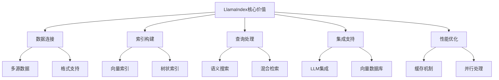

# LlamaIndex应用

## 引言

LlamaIndex是一个专门为RAG应用设计的框架，提供了强大的数据连接、索引构建和查询处理能力。本文将深入探讨LlamaIndex的核心概念、使用方法和实战应用。

## LlamaIndex概述

### 什么是LlamaIndex

LlamaIndex是一个专门为RAG应用设计的框架，它提供了：
- 强大的数据连接能力
- 灵活的索引构建
- 高效的查询处理
- 丰富的集成支持
- 完善的文档和社区

### LlamaIndex的核心价值



## 核心组件

### 1. 数据连接器

```python
from llama_index import SimpleDirectoryReader, PDFReader, DocxReader
from llama_index import NotionPageReader, SlackReader, DiscordReader
from llama_index import WebPageReader, TwitterTweetReader

# 本地文件读取
reader = SimpleDirectoryReader("./documents")
documents = reader.load_data()

# PDF文件读取
pdf_reader = PDFReader()
pdf_documents = pdf_reader.load_data("./document.pdf")

# Word文档读取
docx_reader = DocxReader()
docx_documents = docx_reader.load_data("./document.docx")

# 网页读取
web_reader = WebPageReader()
web_documents = web_reader.load_data(["https://example.com"])

# Notion页面读取
notion_reader = NotionPageReader(integration_token="your-token")
notion_documents = notion_reader.load_data(page_ids=["page-id"])

# Slack消息读取
slack_reader = SlackReader()
slack_documents = slack_reader.load_data(channel_ids=["channel-id"])

# Discord消息读取
discord_reader = DiscordReader()
discord_documents = discord_reader.load_data(channel_ids=["channel-id"])

# Twitter推文读取
twitter_reader = TwitterTweetReader(bearer_token="your-token")
twitter_documents = twitter_reader.load_data(tweet_ids=["tweet-id"])
```

### 2. 文档处理

```python
from llama_index import Document
from llama_index.text_splitter import SentenceSplitter, TokenTextSplitter
from llama_index.node_parser import SimpleNodeParser, HierarchicalNodeParser

# 创建文档
document = Document(
    text="这是文档内容...",
    metadata={"source": "example.txt", "author": "AI助手"}
)

# 句子分割器
sentence_splitter = SentenceSplitter(
    chunk_size=1024,
    chunk_overlap=20
)

# 令牌分割器
token_splitter = TokenTextSplitter(
    chunk_size=1024,
    chunk_overlap=20
)

# 简单节点解析器
node_parser = SimpleNodeParser.from_defaults(
    text_splitter=sentence_splitter
)

# 层次化节点解析器
hierarchical_parser = HierarchicalNodeParser.from_defaults(
    chunk_sizes=[2048, 512, 128]
)

# 解析文档
nodes = node_parser.get_nodes_from_documents([document])
```

### 3. 索引构建

```python
from llama_index import VectorStoreIndex, TreeIndex, KeywordTableIndex
from llama_index import ListIndex, DocumentSummaryIndex
from llama_index.embeddings import OpenAIEmbedding, HuggingFaceEmbedding
from llama_index.vector_stores import ChromaVectorStore, PineconeVectorStore
from llama_index.storage.storage_context import StorageContext

# 创建嵌入
embedding = OpenAIEmbedding(api_key="your-api-key")

# 向量存储
vector_store = ChromaVectorStore(
    collection_name="my_collection",
    persist_directory="./chroma_db"
)

# 存储上下文
storage_context = StorageContext.from_defaults(
    vector_store=vector_store
)

# 向量索引
vector_index = VectorStoreIndex.from_documents(
    documents,
    storage_context=storage_context,
    embed_model=embedding
)

# 树状索引
tree_index = TreeIndex.from_documents(
    documents,
    storage_context=storage_context
)

# 关键词表索引
keyword_index = KeywordTableIndex.from_documents(
    documents,
    storage_context=storage_context
)

# 列表索引
list_index = ListIndex.from_documents(
    documents,
    storage_context=storage_context
)

# 文档摘要索引
summary_index = DocumentSummaryIndex.from_documents(
    documents,
    storage_context=storage_context
)
```

### 4. 查询引擎

```python
from llama_index import QueryEngine, RetrieverQueryEngine
from llama_index.retrievers import VectorIndexRetriever, TreeIndexRetriever
from llama_index.response_synthesizers import ResponseMode, get_response_synthesizer
from llama_index.query_engine import SubQuestionQueryEngine

# 向量检索器
vector_retriever = VectorIndexRetriever(
    index=vector_index,
    similarity_top_k=5
)

# 树状检索器
tree_retriever = TreeIndexRetriever(
    index=tree_index,
    child_branch_factor=2
)

# 响应合成器
response_synthesizer = get_response_synthesizer(
    response_mode=ResponseMode.COMPACT
)

# 检索查询引擎
query_engine = RetrieverQueryEngine(
    retriever=vector_retriever,
    response_synthesizer=response_synthesizer
)

# 子问题查询引擎
sub_question_engine = SubQuestionQueryEngine.from_defaults(
    query_engine_tools=[
        QueryEngineTool.from_defaults(
            query_engine=query_engine,
            description="用于回答一般问题"
        )
    ]
)

# 执行查询
response = query_engine.query("什么是RAG技术？")
print(response.response)
```

## 高级特性

### 1. 多模态支持

```python
from llama_index import SimpleDirectoryReader
from llama_index.multi_modal_llms import OpenAIMM, ReplicateMultiModal
from llama_index.multi_modal_llms.utils import ImageUrl
from llama_index.schema import ImageNode

# 多模态LLM
mm_llm = OpenAIMM(api_key="your-api-key")

# 读取多模态文档
reader = SimpleDirectoryReader(
    input_dir="./multimodal_docs",
    file_extractor={
        ".jpg": ImageReader(),
        ".png": ImageReader(),
        ".pdf": PDFReader()
    }
)
documents = reader.load_data()

# 创建多模态索引
mm_index = VectorStoreIndex.from_documents(
    documents,
    embed_model=mm_llm
)

# 多模态查询
query = "这张图片显示了什么？"
response = mm_index.query(query)
print(response.response)
```

### 2. 自定义检索器

```python
from llama_index.retrievers import BaseRetriever
from llama_index.schema import NodeWithScore, QueryBundle
from typing import List, Optional
import numpy as np

class CustomRetriever(BaseRetriever):
    """自定义检索器"""
    
    def __init__(self, vector_index, similarity_threshold: float = 0.7):
        super().__init__()
        self.vector_index = vector_index
        self.similarity_threshold = similarity_threshold
    
    def _retrieve(self, query_bundle: QueryBundle) -> List[NodeWithScore]:
        """检索相关节点"""
        # 执行向量搜索
        nodes = self.vector_index.query(
            query_bundle.query_str,
            top_k=10
        )
        
        # 过滤低相似度节点
        filtered_nodes = []
        for node in nodes:
            if node.score >= self.similarity_threshold:
                filtered_nodes.append(node)
        
        return filtered_nodes
    
    def retrieve(self, query_bundle: QueryBundle) -> List[NodeWithScore]:
        """检索方法"""
        return self._retrieve(query_bundle)

# 使用自定义检索器
custom_retriever = CustomRetriever(vector_index, similarity_threshold=0.8)
query_engine = RetrieverQueryEngine(
    retriever=custom_retriever,
    response_synthesizer=response_synthesizer
)
```

### 3. 自定义响应合成器

```python
from llama_index.response_synthesizers import BaseSynthesizer
from llama_index.schema import NodeWithScore, QueryBundle
from llama_index.llms import LLM
from typing import List, Optional

class CustomSynthesizer(BaseSynthesizer):
    """自定义响应合成器"""
    
    def __init__(self, llm: LLM, response_mode: str = "compact"):
        super().__init__()
        self.llm = llm
        self.response_mode = response_mode
    
    def synthesize(
        self,
        query_bundle: QueryBundle,
        nodes: List[NodeWithScore],
        additional_source_nodes: Optional[List[NodeWithScore]] = None,
    ) -> str:
        """合成响应"""
        # 构建上下文
        context = self._build_context(nodes)
        
        # 构建提示
        prompt = self._build_prompt(query_bundle.query_str, context)
        
        # 生成响应
        response = self.llm.complete(prompt)
        
        return response.text
    
    def _build_context(self, nodes: List[NodeWithScore]) -> str:
        """构建上下文"""
        context_parts = []
        for node in nodes:
            context_parts.append(f"文档: {node.node.text}")
        return "\n\n".join(context_parts)
    
    def _build_prompt(self, query: str, context: str) -> str:
        """构建提示"""
        return f"""
        基于以下上下文回答问题：
        
        上下文：
        {context}
        
        问题：{query}
        
        请提供准确、详细的回答：
        """

# 使用自定义响应合成器
custom_synthesizer = CustomSynthesizer(llm, response_mode="compact")
query_engine = RetrieverQueryEngine(
    retriever=vector_retriever,
    response_synthesizer=custom_synthesizer
)
```

## 实战应用

### 1. 知识库问答系统

```python
from llama_index import VectorStoreIndex, SimpleDirectoryReader
from llama_index.embeddings import OpenAIEmbedding
from llama_index.vector_stores import ChromaVectorStore
from llama_index.storage.storage_context import StorageContext
from llama_index import QueryEngine, RetrieverQueryEngine
from llama_index.retrievers import VectorIndexRetriever
from llama_index.response_synthesizers import ResponseMode, get_response_synthesizer

class KnowledgeBaseQA:
    def __init__(self, documents_path: str, openai_api_key: str):
        self.documents_path = documents_path
        self.openai_api_key = openai_api_key
        self.embedding = OpenAIEmbedding(api_key=openai_api_key)
        self.vector_store = None
        self.index = None
        self.query_engine = None
        
    def setup_knowledge_base(self):
        """设置知识库"""
        # 读取文档
        reader = SimpleDirectoryReader(self.documents_path)
        documents = reader.load_data()
        
        # 创建向量存储
        self.vector_store = ChromaVectorStore(
            collection_name="knowledge_base",
            persist_directory="./chroma_db"
        )
        
        # 创建存储上下文
        storage_context = StorageContext.from_defaults(
            vector_store=self.vector_store
        )
        
        # 创建索引
        self.index = VectorStoreIndex.from_documents(
            documents,
            storage_context=storage_context,
            embed_model=self.embedding
        )
        
        # 创建查询引擎
        retriever = VectorIndexRetriever(
            index=self.index,
            similarity_top_k=5
        )
        
        response_synthesizer = get_response_synthesizer(
            response_mode=ResponseMode.COMPACT
        )
        
        self.query_engine = RetrieverQueryEngine(
            retriever=retriever,
            response_synthesizer=response_synthesizer
        )
    
    def ask_question(self, question: str) -> str:
        """提问"""
        if not self.query_engine:
            raise ValueError("知识库未设置，请先调用setup_knowledge_base()")
        
        response = self.query_engine.query(question)
        return response.response

# 使用示例
kb_qa = KnowledgeBaseQA("./documents", "your-openai-api-key")
kb_qa.setup_knowledge_base()
answer = kb_qa.ask_question("什么是RAG技术？")
print(answer)
```

### 2. 对话式RAG系统

```python
from llama_index import VectorStoreIndex, SimpleDirectoryReader
from llama_index.embeddings import OpenAIEmbedding
from llama_index.vector_stores import ChromaVectorStore
from llama_index.storage.storage_context import StorageContext
from llama_index import QueryEngine, RetrieverQueryEngine
from llama_index.retrievers import VectorIndexRetriever
from llama_index.response_synthesizers import ResponseMode, get_response_synthesizer
from llama_index.memory import ChatMemoryBuffer
from llama_index.chat_engine import ContextChatEngine

class ConversationalRAG:
    def __init__(self, documents_path: str, openai_api_key: str):
        self.documents_path = documents_path
        self.openai_api_key = openai_api_key
        self.embedding = OpenAIEmbedding(api_key=openai_api_key)
        self.vector_store = None
        self.index = None
        self.chat_engine = None
        
    def setup_conversational_system(self):
        """设置对话系统"""
        # 读取文档
        reader = SimpleDirectoryReader(self.documents_path)
        documents = reader.load_data()
        
        # 创建向量存储
        self.vector_store = ChromaVectorStore(
            collection_name="conversational_rag",
            persist_directory="./chroma_db"
        )
        
        # 创建存储上下文
        storage_context = StorageContext.from_defaults(
            vector_store=self.vector_store
        )
        
        # 创建索引
        self.index = VectorStoreIndex.from_documents(
            documents,
            storage_context=storage_context,
            embed_model=self.embedding
        )
        
        # 创建对话引擎
        self.chat_engine = self.index.as_chat_engine(
            chat_mode="context",
            memory=ChatMemoryBuffer.from_defaults(token_limit=2000)
        )
    
    def chat(self, message: str) -> str:
        """对话"""
        if not self.chat_engine:
            raise ValueError("对话系统未设置，请先调用setup_conversational_system()")
        
        response = self.chat_engine.chat(message)
        return response.response
    
    def reset_conversation(self):
        """重置对话"""
        if self.chat_engine:
            self.chat_engine.reset()

# 使用示例
conversational_rag = ConversationalRAG("./documents", "your-openai-api-key")
conversational_rag.setup_conversational_system()

# 对话
response1 = conversational_rag.chat("什么是RAG技术？")
response2 = conversational_rag.chat("RAG有什么优势？")
```

### 3. 多模态RAG系统

```python
from llama_index import SimpleDirectoryReader
from llama_index.multi_modal_llms import OpenAIMM
from llama_index.multi_modal_llms.utils import ImageUrl
from llama_index.schema import ImageNode
from llama_index import VectorStoreIndex
from llama_index.embeddings import OpenAIEmbedding
from llama_index.vector_stores import ChromaVectorStore
from llama_index.storage.storage_context import StorageContext

class MultimodalRAG:
    def __init__(self, documents_path: str, openai_api_key: str):
        self.documents_path = documents_path
        self.openai_api_key = openai_api_key
        self.embedding = OpenAIEmbedding(api_key=openai_api_key)
        self.mm_llm = OpenAIMM(api_key=openai_api_key)
        self.vector_store = None
        self.index = None
        self.query_engine = None
        
    def setup_multimodal_system(self):
        """设置多模态系统"""
        # 读取多模态文档
        reader = SimpleDirectoryReader(
            input_dir=self.documents_path,
            file_extractor={
                ".jpg": ImageReader(),
                ".png": ImageReader(),
                ".pdf": PDFReader(),
                ".docx": DocxReader()
            }
        )
        documents = reader.load_data()
        
        # 创建向量存储
        self.vector_store = ChromaVectorStore(
            collection_name="multimodal_rag",
            persist_directory="./chroma_db"
        )
        
        # 创建存储上下文
        storage_context = StorageContext.from_defaults(
            vector_store=self.vector_store
        )
        
        # 创建多模态索引
        self.index = VectorStoreIndex.from_documents(
            documents,
            storage_context=storage_context,
            embed_model=self.embedding
        )
        
        # 创建查询引擎
        self.query_engine = self.index.as_query_engine(
            llm=self.mm_llm
        )
    
    def query(self, question: str) -> str:
        """查询"""
        if not self.query_engine:
            raise ValueError("多模态系统未设置，请先调用setup_multimodal_system()")
        
        response = self.query_engine.query(question)
        return response.response

# 使用示例
multimodal_rag = MultimodalRAG("./multimodal_docs", "your-openai-api-key")
multimodal_rag.setup_multimodal_system()
answer = multimodal_rag.query("文档中提到了哪些重要概念？")
```

## 性能优化

### 1. 缓存机制

```python
from llama_index import VectorStoreIndex, SimpleDirectoryReader
from llama_index.embeddings import OpenAIEmbedding
from llama_index.vector_stores import ChromaVectorStore
from llama_index.storage.storage_context import StorageContext
from llama_index.cache import SimpleCache
from llama_index import Settings

class CachedRAG:
    def __init__(self, documents_path: str, openai_api_key: str):
        self.documents_path = documents_path
        self.openai_api_key = openai_api_key
        self.embedding = OpenAIEmbedding(api_key=openai_api_key)
        self.vector_store = None
        self.index = None
        self.query_engine = None
        
    def setup_cached_system(self):
        """设置缓存系统"""
        # 设置缓存
        Settings.cache = SimpleCache()
        
        # 读取文档
        reader = SimpleDirectoryReader(self.documents_path)
        documents = reader.load_data()
        
        # 创建向量存储
        self.vector_store = ChromaVectorStore(
            collection_name="cached_rag",
            persist_directory="./chroma_db"
        )
        
        # 创建存储上下文
        storage_context = StorageContext.from_defaults(
            vector_store=self.vector_store
        )
        
        # 创建索引
        self.index = VectorStoreIndex.from_documents(
            documents,
            storage_context=storage_context,
            embed_model=self.embedding
        )
        
        # 创建查询引擎
        self.query_engine = self.index.as_query_engine()
    
    def query(self, question: str) -> str:
        """查询"""
        if not self.query_engine:
            raise ValueError("缓存系统未设置，请先调用setup_cached_system()")
        
        response = self.query_engine.query(question)
        return response.response

# 使用示例
cached_rag = CachedRAG("./documents", "your-openai-api-key")
cached_rag.setup_cached_system()
answer = cached_rag.query("什么是RAG技术？")
```

### 2. 并行处理

```python
import asyncio
from llama_index import VectorStoreIndex, SimpleDirectoryReader
from llama_index.embeddings import OpenAIEmbedding
from llama_index.vector_stores import ChromaVectorStore
from llama_index.storage.storage_context import StorageContext
from llama_index import QueryEngine

class AsyncRAG:
    def __init__(self, documents_path: str, openai_api_key: str):
        self.documents_path = documents_path
        self.openai_api_key = openai_api_key
        self.embedding = OpenAIEmbedding(api_key=openai_api_key)
        self.vector_store = None
        self.index = None
        self.query_engine = None
        
    async def setup_async_system(self):
        """设置异步系统"""
        # 读取文档
        reader = SimpleDirectoryReader(self.documents_path)
        documents = reader.load_data()
        
        # 创建向量存储
        self.vector_store = ChromaVectorStore(
            collection_name="async_rag",
            persist_directory="./chroma_db"
        )
        
        # 创建存储上下文
        storage_context = StorageContext.from_defaults(
            vector_store=self.vector_store
        )
        
        # 创建索引
        self.index = VectorStoreIndex.from_documents(
            documents,
            storage_context=storage_context,
            embed_model=self.embedding
        )
        
        # 创建查询引擎
        self.query_engine = self.index.as_query_engine()
    
    async def async_query(self, question: str) -> str:
        """异步查询"""
        if not self.query_engine:
            raise ValueError("异步系统未设置，请先调用setup_async_system()")
        
        response = await self.query_engine.aquery(question)
        return response.response

# 使用示例
async def main():
    async_rag = AsyncRAG("./documents", "your-openai-api-key")
    await async_rag.setup_async_system()
    answer = await async_rag.async_query("什么是RAG技术？")
    print(answer)

asyncio.run(main())
```

### 3. 索引优化

```python
from llama_index import VectorStoreIndex, SimpleDirectoryReader
from llama_index.embeddings import OpenAIEmbedding
from llama_index.vector_stores import ChromaVectorStore
from llama_index.storage.storage_context import StorageContext
from llama_index.text_splitter import SentenceSplitter
from llama_index.node_parser import SimpleNodeParser

class OptimizedRAG:
    def __init__(self, documents_path: str, openai_api_key: str):
        self.documents_path = documents_path
        self.openai_api_key = openai_api_key
        self.embedding = OpenAIEmbedding(api_key=openai_api_key)
        self.vector_store = None
        self.index = None
        self.query_engine = None
        
    def setup_optimized_system(self):
        """设置优化系统"""
        # 读取文档
        reader = SimpleDirectoryReader(self.documents_path)
        documents = reader.load_data()
        
        # 优化文本分割
        text_splitter = SentenceSplitter(
            chunk_size=800,
            chunk_overlap=100
        )
        
        # 优化节点解析器
        node_parser = SimpleNodeParser.from_defaults(
            text_splitter=text_splitter
        )
        
        # 创建向量存储
        self.vector_store = ChromaVectorStore(
            collection_name="optimized_rag",
            persist_directory="./chroma_db"
        )
        
        # 创建存储上下文
        storage_context = StorageContext.from_defaults(
            vector_store=self.vector_store
        )
        
        # 创建优化索引
        self.index = VectorStoreIndex.from_documents(
            documents,
            storage_context=storage_context,
            embed_model=self.embedding,
            node_parser=node_parser
        )
        
        # 创建查询引擎
        self.query_engine = self.index.as_query_engine(
            similarity_top_k=5
        )
    
    def query(self, question: str) -> str:
        """查询"""
        if not self.query_engine:
            raise ValueError("优化系统未设置，请先调用setup_optimized_system()")
        
        response = self.query_engine.query(question)
        return response.response

# 使用示例
optimized_rag = OptimizedRAG("./documents", "your-openai-api-key")
optimized_rag.setup_optimized_system()
answer = optimized_rag.query("什么是RAG技术？")
```

## 最佳实践

### 1. 错误处理

```python
import logging
from llama_index import VectorStoreIndex, SimpleDirectoryReader
from llama_index.embeddings import OpenAIEmbedding
from llama_index.vector_stores import ChromaVectorStore
from llama_index.storage.storage_context import StorageContext

class RobustRAG:
    def __init__(self, documents_path: str, openai_api_key: str):
        self.documents_path = documents_path
        self.openai_api_key = openai_api_key
        self.embedding = OpenAIEmbedding(api_key=openai_api_key)
        self.vector_store = None
        self.index = None
        self.query_engine = None
        self.logger = logging.getLogger(__name__)
        
    def setup_robust_system(self):
        """设置健壮系统"""
        try:
            # 读取文档
            reader = SimpleDirectoryReader(self.documents_path)
            documents = reader.load_data()
            
            if not documents:
                raise ValueError("没有找到任何文档")
            
            # 创建向量存储
            self.vector_store = ChromaVectorStore(
                collection_name="robust_rag",
                persist_directory="./chroma_db"
            )
            
            # 创建存储上下文
            storage_context = StorageContext.from_defaults(
                vector_store=self.vector_store
            )
            
            # 创建索引
            self.index = VectorStoreIndex.from_documents(
                documents,
                storage_context=storage_context,
                embed_model=self.embedding
            )
            
            # 创建查询引擎
            self.query_engine = self.index.as_query_engine()
            
            self.logger.info("RAG系统设置成功")
            
        except Exception as e:
            self.logger.error(f"RAG系统设置失败: {str(e)}")
            raise
    
    def query_with_fallback(self, question: str) -> str:
        """带降级的查询"""
        if not self.query_engine:
            return "抱歉，系统暂时不可用，请稍后再试。"
        
        try:
            response = self.query_engine.query(question)
            return response.response
        except Exception as e:
            self.logger.error(f"查询失败: {str(e)}")
            return "抱歉，查询过程中出现错误，请稍后再试。"

# 使用示例
robust_rag = RobustRAG("./documents", "your-openai-api-key")
robust_rag.setup_robust_system()
answer = robust_rag.query_with_fallback("什么是RAG技术？")
```

### 2. 监控和日志

```python
import time
import logging
from llama_index import VectorStoreIndex, SimpleDirectoryReader
from llama_index.embeddings import OpenAIEmbedding
from llama_index.vector_stores import ChromaVectorStore
from llama_index.storage.storage_context import StorageContext

class MonitoredRAG:
    def __init__(self, documents_path: str, openai_api_key: str):
        self.documents_path = documents_path
        self.openai_api_key = openai_api_key
        self.embedding = OpenAIEmbedding(api_key=openai_api_key)
        self.vector_store = None
        self.index = None
        self.query_engine = None
        self.logger = logging.getLogger(__name__)
        self.metrics = {
            "total_queries": 0,
            "successful_queries": 0,
            "failed_queries": 0,
            "average_response_time": 0
        }
        
    def setup_monitored_system(self):
        """设置监控系统"""
        start_time = time.time()
        
        try:
            # 读取文档
            reader = SimpleDirectoryReader(self.documents_path)
            documents = reader.load_data()
            
            # 创建向量存储
            self.vector_store = ChromaVectorStore(
                collection_name="monitored_rag",
                persist_directory="./chroma_db"
            )
            
            # 创建存储上下文
            storage_context = StorageContext.from_defaults(
                vector_store=self.vector_store
            )
            
            # 创建索引
            self.index = VectorStoreIndex.from_documents(
                documents,
                storage_context=storage_context,
                embed_model=self.embedding
            )
            
            # 创建查询引擎
            self.query_engine = self.index.as_query_engine()
            
            setup_time = time.time() - start_time
            self.logger.info(f"RAG系统设置成功，耗时: {setup_time:.2f}秒")
            
        except Exception as e:
            self.logger.error(f"RAG系统设置失败: {str(e)}")
            raise
    
    def monitored_query(self, question: str) -> str:
        """监控查询"""
        start_time = time.time()
        self.metrics["total_queries"] += 1
        
        try:
            response = self.query_engine.query(question)
            
            response_time = time.time() - start_time
            self.metrics["successful_queries"] += 1
            self.metrics["average_response_time"] = (
                self.metrics["average_response_time"] * (self.metrics["successful_queries"] - 1) + 
                response_time
            ) / self.metrics["successful_queries"]
            
            self.logger.info(f"查询成功，耗时: {response_time:.2f}秒")
            
            return response.response
            
        except Exception as e:
            self.metrics["failed_queries"] += 1
            self.logger.error(f"查询失败: {str(e)}")
            return "抱歉，查询过程中出现错误。"
    
    def get_metrics(self) -> dict:
        """获取指标"""
        return self.metrics.copy()

# 使用示例
monitored_rag = MonitoredRAG("./documents", "your-openai-api-key")
monitored_rag.setup_monitored_system()
answer = monitored_rag.monitored_query("什么是RAG技术？")
metrics = monitored_rag.get_metrics()
print(f"系统指标: {metrics}")
```

## 总结

LlamaIndex是一个专门为RAG应用设计的强大框架，提供了丰富的数据连接、索引构建和查询处理能力。本文介绍了LlamaIndex的核心概念、使用方法和实战应用，包括数据连接器、索引构建、查询引擎、多模态支持等方面。

关键要点：
1. **数据连接**：支持多种数据源的连接和读取
2. **索引构建**：提供多种索引类型，满足不同需求
3. **查询处理**：高效的查询引擎和响应合成
4. **多模态支持**：支持文本、图像等多种模态
5. **性能优化**：通过缓存、并行处理和索引优化提升性能

在下一篇文章中，我们将探讨RAGFlow使用指南，了解如何使用RAGFlow平台构建RAG应用。

---

**下一步学习建议：**
- 阅读《RAGFlow使用指南》，了解如何使用RAGFlow平台构建RAG应用
- 实践LlamaIndex的各种组件和功能
- 关注LlamaIndex技术的最新发展和创新方案
