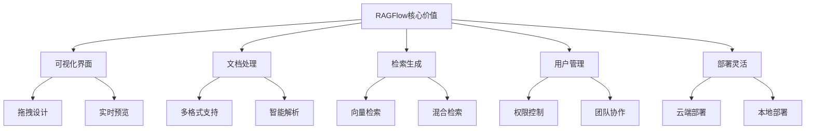

# RAGFlow使用指南

## 引言

RAGFlow是一个开源的RAG应用开发平台，提供了可视化的界面和丰富的功能来构建RAG应用。本文将深入探讨RAGFlow的使用方法、功能特性和实战应用。

## RAGFlow概述

### 什么是RAGFlow

RAGFlow是一个开源的RAG应用开发平台，它提供了：
- 可视化的界面设计
- 丰富的文档处理能力
- 强大的检索和生成功能
- 完善的用户管理
- 灵活的部署选项

### RAGFlow的核心价值



## 安装和部署

### 1. 环境要求

```bash
# 系统要求
- Python 3.8+
- Node.js 16+
- Docker (可选)
- 8GB+ RAM
- 50GB+ 存储空间

# 依赖安装
pip install ragflow
npm install -g ragflow-cli
```

### 2. 本地部署

```bash
# 克隆仓库
git clone https://github.com/infiniflow/ragflow.git
cd ragflow

# 安装依赖
pip install -r requirements.txt
npm install

# 配置环境变量
cp .env.example .env
# 编辑.env文件，设置必要的配置

# 启动服务
python app.py
```

### 3. Docker部署

```bash
# 使用Docker Compose
docker-compose up -d

# 或者使用Docker
docker run -d \
  --name ragflow \
  -p 8000:8000 \
  -v ragflow_data:/app/data \
  ragflow:latest
```

### 4. 云端部署

```bash
# 使用RAGFlow Cloud
# 1. 访问 https://ragflow.cloud
# 2. 注册账号
# 3. 创建项目
# 4. 配置环境
# 5. 部署应用
```

## 核心功能

### 1. 文档管理

```python
# 文档上传
from ragflow import RAGFlowClient

client = RAGFlowClient(
    api_key="your-api-key",
    base_url="https://api.ragflow.com"
)

# 上传文档
document = client.upload_document(
    file_path="./document.pdf",
    title="RAG技术文档",
    description="关于RAG技术的详细介绍"
)

# 文档列表
documents = client.list_documents()
for doc in documents:
    print(f"标题: {doc.title}")
    print(f"状态: {doc.status}")
    print(f"创建时间: {doc.created_at}")

# 文档详情
doc_detail = client.get_document(document_id="doc-123")
print(f"内容: {doc_detail.content}")
print(f"元数据: {doc_detail.metadata}")
```

### 2. 知识库构建

```python
# 创建知识库
knowledge_base = client.create_knowledge_base(
    name="RAG技术知识库",
    description="包含RAG技术相关文档的知识库",
    settings={
        "chunk_size": 1000,
        "chunk_overlap": 200,
        "embedding_model": "text-embedding-ada-002"
    }
)

# 添加文档到知识库
client.add_document_to_kb(
    knowledge_base_id=knowledge_base.id,
    document_id=document.id
)

# 知识库列表
knowledge_bases = client.list_knowledge_bases()
for kb in knowledge_bases:
    print(f"名称: {kb.name}")
    print(f"文档数量: {kb.document_count}")
    print(f"状态: {kb.status}")
```

### 3. 检索配置

```python
# 配置检索器
retriever_config = {
    "type": "hybrid",
    "vector_search": {
        "top_k": 5,
        "similarity_threshold": 0.7
    },
    "keyword_search": {
        "top_k": 3,
        "boost": 0.3
    },
    "reranker": {
        "model": "cross-encoder",
        "top_k": 3
    }
}

# 更新知识库检索配置
client.update_knowledge_base_retriever(
    knowledge_base_id=knowledge_base.id,
    retriever_config=retriever_config
)
```

### 4. 生成配置

```python
# 配置生成器
generator_config = {
    "model": "gpt-3.5-turbo",
    "temperature": 0.7,
    "max_tokens": 1000,
    "prompt_template": """
    基于以下上下文回答问题：
    
    上下文：
    {context}
    
    问题：{question}
    
    请提供准确、详细的回答：
    """
}

# 更新知识库生成配置
client.update_knowledge_base_generator(
    knowledge_base_id=knowledge_base.id,
    generator_config=generator_config
)
```

## 应用构建

### 1. 创建应用

```python
# 创建RAG应用
app = client.create_app(
    name="RAG技术问答",
    description="基于RAG技术的智能问答应用",
    knowledge_base_id=knowledge_base.id,
    settings={
        "welcome_message": "您好！我是RAG技术助手，有什么可以帮助您的吗？",
        "max_turns": 10,
        "enable_feedback": True
    }
)

# 应用列表
apps = client.list_apps()
for app in apps:
    print(f"名称: {app.name}")
    print(f"状态: {app.status}")
    print(f"知识库: {app.knowledge_base_name}")
```

### 2. 配置对话流程

```python
# 配置对话流程
conversation_config = {
    "flow_type": "conversational",
    "steps": [
        {
            "type": "retrieval",
            "config": {
                "knowledge_base_id": knowledge_base.id,
                "top_k": 5
            }
        },
        {
            "type": "generation",
            "config": {
                "model": "gpt-3.5-turbo",
                "temperature": 0.7
            }
        },
        {
            "type": "feedback",
            "config": {
                "enabled": True,
                "collect_rating": True
            }
        }
    ]
}

# 更新应用配置
client.update_app_config(
    app_id=app.id,
    config=conversation_config
)
```

### 3. 测试应用

```python
# 测试应用
test_questions = [
    "什么是RAG技术？",
    "RAG有什么优势？",
    "RAG的应用场景有哪些？"
]

for question in test_questions:
    response = client.test_app(
        app_id=app.id,
        question=question
    )
    print(f"问题: {question}")
    print(f"回答: {response.answer}")
    print(f"置信度: {response.confidence}")
    print(f"来源文档: {response.source_documents}")
    print("-" * 50)
```

## 高级功能

### 1. 自定义组件

```python
# 自定义检索器
class CustomRetriever:
    def __init__(self, config):
        self.config = config
    
    def retrieve(self, query, knowledge_base_id):
        # 实现自定义检索逻辑
        pass

# 自定义生成器
class CustomGenerator:
    def __init__(self, config):
        self.config = config
    
    def generate(self, query, context):
        # 实现自定义生成逻辑
        pass

# 注册自定义组件
client.register_custom_component(
    component_type="retriever",
    component_class=CustomRetriever,
    name="custom_retriever"
)

client.register_custom_component(
    component_type="generator",
    component_class=CustomGenerator,
    name="custom_generator"
)
```

### 2. 多模态支持

```python
# 上传多模态文档
multimodal_doc = client.upload_multimodal_document(
    file_path="./multimodal.pdf",
    title="多模态文档",
    description="包含文本和图像的文档",
    modalities=["text", "image"]
)

# 配置多模态检索
multimodal_config = {
    "text_retriever": {
        "type": "vector",
        "top_k": 3
    },
    "image_retriever": {
        "type": "vision",
        "top_k": 2
    },
    "fusion_strategy": "weighted"
}

# 更新知识库多模态配置
client.update_knowledge_base_multimodal(
    knowledge_base_id=knowledge_base.id,
    multimodal_config=multimodal_config
)
```

### 3. 实时协作

```python
# 创建团队
team = client.create_team(
    name="RAG开发团队",
    description="负责RAG应用开发的团队"
)

# 邀请成员
client.invite_team_member(
    team_id=team.id,
    email="member@example.com",
    role="developer"
)

# 共享知识库
client.share_knowledge_base(
    knowledge_base_id=knowledge_base.id,
    team_id=team.id,
    permissions=["read", "write"]
)

# 共享应用
client.share_app(
    app_id=app.id,
    team_id=team.id,
    permissions=["read", "test"]
)
```

## 实战应用

### 1. 企业知识库问答

```python
class EnterpriseKBQA:
    def __init__(self, api_key: str):
        self.client = RAGFlowClient(api_key=api_key)
        self.knowledge_base = None
        self.app = None
        
    def setup_enterprise_kb(self, documents_path: str):
        """设置企业知识库"""
        # 创建知识库
        self.knowledge_base = self.client.create_knowledge_base(
            name="企业知识库",
            description="企业内部知识库",
            settings={
                "chunk_size": 1000,
                "chunk_overlap": 200,
                "embedding_model": "text-embedding-ada-002"
            }
        )
        
        # 批量上传文档
        import os
        for filename in os.listdir(documents_path):
            if filename.endswith(('.pdf', '.docx', '.txt')):
                file_path = os.path.join(documents_path, filename)
                document = self.client.upload_document(
                    file_path=file_path,
                    title=filename,
                    description=f"企业文档: {filename}"
                )
                self.client.add_document_to_kb(
                    knowledge_base_id=self.knowledge_base.id,
                    document_id=document.id
                )
        
        # 配置检索和生成
        self._configure_kb()
    
    def _configure_kb(self):
        """配置知识库"""
        # 检索配置
        retriever_config = {
            "type": "hybrid",
            "vector_search": {
                "top_k": 5,
                "similarity_threshold": 0.7
            },
            "keyword_search": {
                "top_k": 3,
                "boost": 0.3
            }
        }
        
        # 生成配置
        generator_config = {
            "model": "gpt-3.5-turbo",
            "temperature": 0.7,
            "max_tokens": 1000,
            "prompt_template": """
            基于企业知识库回答以下问题：
            
            上下文：
            {context}
            
            问题：{question}
            
            请提供准确、专业的回答：
            """
        }
        
        self.client.update_knowledge_base_retriever(
            knowledge_base_id=self.knowledge_base.id,
            retriever_config=retriever_config
        )
        
        self.client.update_knowledge_base_generator(
            knowledge_base_id=self.knowledge_base.id,
            generator_config=generator_config
        )
    
    def create_qa_app(self):
        """创建问答应用"""
        self.app = self.client.create_app(
            name="企业知识库问答",
            description="基于企业知识库的智能问答应用",
            knowledge_base_id=self.knowledge_base.id,
            settings={
                "welcome_message": "您好！我是企业知识库助手，有什么可以帮助您的吗？",
                "max_turns": 10,
                "enable_feedback": True
            }
        )
    
    def ask_question(self, question: str) -> str:
        """提问"""
        if not self.app:
            raise ValueError("应用未创建，请先调用create_qa_app()")
        
        response = self.client.test_app(
            app_id=self.app.id,
            question=question
        )
        return response.answer

# 使用示例
enterprise_kb = EnterpriseKBQA("your-api-key")
enterprise_kb.setup_enterprise_kb("./enterprise_docs")
enterprise_kb.create_qa_app()
answer = enterprise_kb.ask_question("公司的请假政策是什么？")
print(answer)
```

### 2. 客服机器人

```python
class CustomerServiceBot:
    def __init__(self, api_key: str):
        self.client = RAGFlowClient(api_key=api_key)
        self.knowledge_base = None
        self.app = None
        
    def setup_customer_service_kb(self, faq_documents: list):
        """设置客服知识库"""
        # 创建知识库
        self.knowledge_base = self.client.create_knowledge_base(
            name="客服知识库",
            description="客服常见问题知识库",
            settings={
                "chunk_size": 500,
                "chunk_overlap": 100,
                "embedding_model": "text-embedding-ada-002"
            }
        )
        
        # 上传FAQ文档
        for faq_doc in faq_documents:
            document = self.client.upload_document(
                file_path=faq_doc["file_path"],
                title=faq_doc["title"],
                description=faq_doc["description"]
            )
            self.client.add_document_to_kb(
                knowledge_base_id=self.knowledge_base.id,
                document_id=document.id
            )
        
        # 配置客服专用检索和生成
        self._configure_customer_service()
    
    def _configure_customer_service(self):
        """配置客服系统"""
        # 检索配置
        retriever_config = {
            "type": "hybrid",
            "vector_search": {
                "top_k": 3,
                "similarity_threshold": 0.8
            },
            "keyword_search": {
                "top_k": 2,
                "boost": 0.4
            }
        }
        
        # 生成配置
        generator_config = {
            "model": "gpt-3.5-turbo",
            "temperature": 0.5,
            "max_tokens": 500,
            "prompt_template": """
            作为客服助手，请基于以下信息回答客户问题：
            
            相关信息：
            {context}
            
            客户问题：{question}
            
            请提供友好、准确的回答：
            """
        }
        
        self.client.update_knowledge_base_retriever(
            knowledge_base_id=self.knowledge_base.id,
            retriever_config=retriever_config
        )
        
        self.client.update_knowledge_base_generator(
            knowledge_base_id=self.knowledge_base.id,
            generator_config=generator_config
        )
    
    def create_customer_service_app(self):
        """创建客服应用"""
        self.app = self.client.create_app(
            name="智能客服",
            description="基于知识库的智能客服应用",
            knowledge_base_id=self.knowledge_base.id,
            settings={
                "welcome_message": "您好！我是智能客服助手，很高兴为您服务！",
                "max_turns": 5,
                "enable_feedback": True,
                "escalation_threshold": 0.6
            }
        )
    
    def handle_customer_query(self, query: str) -> dict:
        """处理客户查询"""
        if not self.app:
            raise ValueError("应用未创建，请先调用create_customer_service_app()")
        
        response = self.client.test_app(
            app_id=self.app.id,
            question=query
        )
        
        return {
            "answer": response.answer,
            "confidence": response.confidence,
            "escalation_needed": response.confidence < 0.6,
            "source_documents": response.source_documents
        }

# 使用示例
customer_service = CustomerServiceBot("your-api-key")
faq_documents = [
    {"file_path": "./faq1.pdf", "title": "产品FAQ", "description": "产品相关常见问题"},
    {"file_path": "./faq2.pdf", "title": "服务FAQ", "description": "服务相关常见问题"}
]
customer_service.setup_customer_service_kb(faq_documents)
customer_service.create_customer_service_app()

result = customer_service.handle_customer_query("如何申请退款？")
print(f"回答: {result['answer']}")
print(f"需要转人工: {result['escalation_needed']}")
```

### 3. 教育助手

```python
class EducationAssistant:
    def __init__(self, api_key: str):
        self.client = RAGFlowClient(api_key=api_key)
        self.knowledge_base = None
        self.app = None
        
    def setup_education_kb(self, course_materials: list):
        """设置教育知识库"""
        # 创建知识库
        self.knowledge_base = self.client.create_knowledge_base(
            name="教育知识库",
            description="课程材料知识库",
            settings={
                "chunk_size": 800,
                "chunk_overlap": 150,
                "embedding_model": "text-embedding-ada-002"
            }
        )
        
        # 上传课程材料
        for material in course_materials:
            document = self.client.upload_document(
                file_path=material["file_path"],
                title=material["title"],
                description=material["description"]
            )
            self.client.add_document_to_kb(
                knowledge_base_id=self.knowledge_base.id,
                document_id=document.id
            )
        
        # 配置教育专用检索和生成
        self._configure_education()
    
    def _configure_education(self):
        """配置教育系统"""
        # 检索配置
        retriever_config = {
            "type": "hybrid",
            "vector_search": {
                "top_k": 4,
                "similarity_threshold": 0.7
            },
            "keyword_search": {
                "top_k": 3,
                "boost": 0.3
            }
        }
        
        # 生成配置
        generator_config = {
            "model": "gpt-3.5-turbo",
            "temperature": 0.6,
            "max_tokens": 800,
            "prompt_template": """
            作为教育助手，请基于课程材料回答学生问题：
            
            课程内容：
            {context}
            
            学生问题：{question}
            
            请提供清晰、详细的教学回答：
            """
        }
        
        self.client.update_knowledge_base_retriever(
            knowledge_base_id=self.knowledge_base.id,
            retriever_config=retriever_config
        )
        
        self.client.update_knowledge_base_generator(
            knowledge_base_id=self.knowledge_base.id,
            generator_config=generator_config
        )
    
    def create_education_app(self):
        """创建教育应用"""
        self.app = self.client.create_app(
            name="教育助手",
            description="基于课程材料的智能教育助手",
            knowledge_base_id=self.knowledge_base.id,
            settings={
                "welcome_message": "您好！我是教育助手，有什么学习问题可以帮助您吗？",
                "max_turns": 8,
                "enable_feedback": True,
                "learning_mode": True
            }
        )
    
    def answer_student_question(self, question: str) -> dict:
        """回答学生问题"""
        if not self.app:
            raise ValueError("应用未创建，请先调用create_education_app()")
        
        response = self.client.test_app(
            app_id=self.app.id,
            question=question
        )
        
        return {
            "answer": response.answer,
            "confidence": response.confidence,
            "related_topics": self._extract_related_topics(response.source_documents),
            "source_documents": response.source_documents
        }
    
    def _extract_related_topics(self, source_documents: list) -> list:
        """提取相关主题"""
        topics = []
        for doc in source_documents:
            if "topic" in doc.metadata:
                topics.append(doc.metadata["topic"])
        return list(set(topics))

# 使用示例
education_assistant = EducationAssistant("your-api-key")
course_materials = [
    {"file_path": "./lesson1.pdf", "title": "第一课", "description": "机器学习基础"},
    {"file_path": "./lesson2.pdf", "title": "第二课", "description": "深度学习原理"}
]
education_assistant.setup_education_kb(course_materials)
education_assistant.create_education_app()

result = education_assistant.answer_student_question("什么是机器学习？")
print(f"回答: {result['answer']}")
print(f"相关主题: {result['related_topics']}")
```

## 最佳实践

### 1. 性能优化

```python
class OptimizedRAGFlow:
    def __init__(self, api_key: str):
        self.client = RAGFlowClient(api_key=api_key)
        self.knowledge_base = None
        self.app = None
        
    def setup_optimized_system(self, documents_path: str):
        """设置优化系统"""
        # 创建知识库
        self.knowledge_base = self.client.create_knowledge_base(
            name="优化知识库",
            description="性能优化的知识库",
            settings={
                "chunk_size": 600,  # 较小的chunk size
                "chunk_overlap": 100,  # 较小的overlap
                "embedding_model": "text-embedding-ada-002",
                "enable_caching": True,  # 启用缓存
                "parallel_processing": True  # 启用并行处理
            }
        )
        
        # 批量上传文档
        self._batch_upload_documents(documents_path)
        
        # 配置优化检索和生成
        self._configure_optimized_system()
    
    def _batch_upload_documents(self, documents_path: str):
        """批量上传文档"""
        import os
        documents = []
        
        for filename in os.listdir(documents_path):
            if filename.endswith(('.pdf', '.docx', '.txt')):
                file_path = os.path.join(documents_path, filename)
                documents.append({
                    "file_path": file_path,
                    "title": filename,
                    "description": f"文档: {filename}"
                })
        
        # 批量上传
        for doc_info in documents:
            document = self.client.upload_document(**doc_info)
            self.client.add_document_to_kb(
                knowledge_base_id=self.knowledge_base.id,
                document_id=document.id
            )
    
    def _configure_optimized_system(self):
        """配置优化系统"""
        # 优化检索配置
        retriever_config = {
            "type": "hybrid",
            "vector_search": {
                "top_k": 3,  # 减少检索数量
                "similarity_threshold": 0.8  # 提高相似度阈值
            },
            "keyword_search": {
                "top_k": 2,  # 减少关键词检索数量
                "boost": 0.3
            },
            "enable_caching": True  # 启用检索缓存
        }
        
        # 优化生成配置
        generator_config = {
            "model": "gpt-3.5-turbo",
            "temperature": 0.6,
            "max_tokens": 600,  # 限制生成长度
            "enable_streaming": True,  # 启用流式生成
            "prompt_template": """
            基于以下信息简洁回答：
            
            信息：
            {context}
            
            问题：{question}
            
            回答：
            """
        }
        
        self.client.update_knowledge_base_retriever(
            knowledge_base_id=self.knowledge_base.id,
            retriever_config=retriever_config
        )
        
        self.client.update_knowledge_base_generator(
            knowledge_base_id=self.knowledge_base.id,
            generator_config=generator_config
        )
    
    def create_optimized_app(self):
        """创建优化应用"""
        self.app = self.client.create_app(
            name="优化RAG应用",
            description="性能优化的RAG应用",
            knowledge_base_id=self.knowledge_base.id,
            settings={
                "welcome_message": "您好！我是优化助手，有什么可以帮助您的吗？",
                "max_turns": 5,  # 限制对话轮数
                "enable_feedback": True,
                "response_timeout": 30,  # 设置响应超时
                "enable_monitoring": True  # 启用监控
            }
        )
    
    def optimized_query(self, question: str) -> dict:
        """优化查询"""
        if not self.app:
            raise ValueError("应用未创建，请先调用create_optimized_app()")
        
        import time
        start_time = time.time()
        
        response = self.client.test_app(
            app_id=self.app.id,
            question=question
        )
        
        response_time = time.time() - start_time
        
        return {
            "answer": response.answer,
            "confidence": response.confidence,
            "response_time": response_time,
            "source_documents": response.source_documents
        }

# 使用示例
optimized_rag = OptimizedRAGFlow("your-api-key")
optimized_rag.setup_optimized_system("./documents")
optimized_rag.create_optimized_app()

result = optimized_rag.optimized_query("什么是RAG技术？")
print(f"回答: {result['answer']}")
print(f"响应时间: {result['response_time']:.2f}秒")
```

### 2. 监控和日志

```python
import logging
import time
from ragflow import RAGFlowClient

class MonitoredRAGFlow:
    def __init__(self, api_key: str):
        self.client = RAGFlowClient(api_key=api_key)
        self.knowledge_base = None
        self.app = None
        self.logger = logging.getLogger(__name__)
        self.metrics = {
            "total_queries": 0,
            "successful_queries": 0,
            "failed_queries": 0,
            "average_response_time": 0
        }
        
    def setup_monitored_system(self, documents_path: str):
        """设置监控系统"""
        start_time = time.time()
        
        try:
            # 创建知识库
            self.knowledge_base = self.client.create_knowledge_base(
                name="监控知识库",
                description="带监控的知识库",
                settings={
                    "chunk_size": 1000,
                    "chunk_overlap": 200,
                    "embedding_model": "text-embedding-ada-002"
                }
            )
            
            # 上传文档
            self._upload_documents(documents_path)
            
            # 配置系统
            self._configure_system()
            
            setup_time = time.time() - start_time
            self.logger.info(f"监控系统设置成功，耗时: {setup_time:.2f}秒")
            
        except Exception as e:
            self.logger.error(f"监控系统设置失败: {str(e)}")
            raise
    
    def _upload_documents(self, documents_path: str):
        """上传文档"""
        import os
        for filename in os.listdir(documents_path):
            if filename.endswith(('.pdf', '.docx', '.txt')):
                file_path = os.path.join(documents_path, filename)
                document = self.client.upload_document(
                    file_path=file_path,
                    title=filename,
                    description=f"文档: {filename}"
                )
                self.client.add_document_to_kb(
                    knowledge_base_id=self.knowledge_base.id,
                    document_id=document.id
                )
    
    def _configure_system(self):
        """配置系统"""
        # 检索配置
        retriever_config = {
            "type": "hybrid",
            "vector_search": {
                "top_k": 5,
                "similarity_threshold": 0.7
            },
            "keyword_search": {
                "top_k": 3,
                "boost": 0.3
            }
        }
        
        # 生成配置
        generator_config = {
            "model": "gpt-3.5-turbo",
            "temperature": 0.7,
            "max_tokens": 1000,
            "prompt_template": """
            基于以下信息回答问题：
            
            信息：
            {context}
            
            问题：{question}
            
            回答：
            """
        }
        
        self.client.update_knowledge_base_retriever(
            knowledge_base_id=self.knowledge_base.id,
            retriever_config=retriever_config
        )
        
        self.client.update_knowledge_base_generator(
            knowledge_base_id=self.knowledge_base.id,
            generator_config=generator_config
        )
    
    def create_monitored_app(self):
        """创建监控应用"""
        self.app = self.client.create_app(
            name="监控RAG应用",
            description="带监控的RAG应用",
            knowledge_base_id=self.knowledge_base.id,
            settings={
                "welcome_message": "您好！我是监控助手，有什么可以帮助您的吗？",
                "max_turns": 10,
                "enable_feedback": True,
                "enable_monitoring": True
            }
        )
    
    def monitored_query(self, question: str) -> dict:
        """监控查询"""
        start_time = time.time()
        self.metrics["total_queries"] += 1
        
        try:
            response = self.client.test_app(
                app_id=self.app.id,
                question=question
            )
            
            response_time = time.time() - start_time
            self.metrics["successful_queries"] += 1
            self.metrics["average_response_time"] = (
                self.metrics["average_response_time"] * (self.metrics["successful_queries"] - 1) + 
                response_time
            ) / self.metrics["successful_queries"]
            
            self.logger.info(f"查询成功，耗时: {response_time:.2f}秒")
            
            return {
                "answer": response.answer,
                "confidence": response.confidence,
                "response_time": response_time,
                "source_documents": response.source_documents,
                "error": None
            }
            
        except Exception as e:
            self.metrics["failed_queries"] += 1
            self.logger.error(f"查询失败: {str(e)}")
            return {
                "answer": "抱歉，查询过程中出现错误。",
                "error": str(e),
                "response_time": time.time() - start_time
            }
    
    def get_metrics(self) -> dict:
        """获取指标"""
        return self.metrics.copy()

# 使用示例
monitored_rag = MonitoredRAGFlow("your-api-key")
monitored_rag.setup_monitored_system("./documents")
monitored_rag.create_monitored_app()

result = monitored_rag.monitored_query("什么是RAG技术？")
metrics = monitored_rag.get_metrics()
print(f"系统指标: {metrics}")
```

## 总结

RAGFlow是一个功能强大的RAG应用开发平台，提供了可视化的界面和丰富的功能来构建RAG应用。本文介绍了RAGFlow的使用方法、功能特性和实战应用，包括文档管理、知识库构建、应用创建、高级功能等方面。

关键要点：
1. **可视化界面**：提供直观的拖拽式界面设计
2. **文档处理**：支持多种格式的文档上传和处理
3. **知识库构建**：灵活的知识库配置和管理
4. **应用创建**：简单易用的应用构建流程
5. **高级功能**：支持自定义组件、多模态、实时协作等

在下一篇文章中，我们将探讨开源RAG框架对比，了解不同RAG框架的特点和适用场景。

---

**下一步学习建议：**
- 阅读《开源RAG框架对比》，了解不同RAG框架的特点和适用场景
- 实践RAGFlow的各种功能和应用
- 关注RAGFlow技术的最新发展和创新方案
