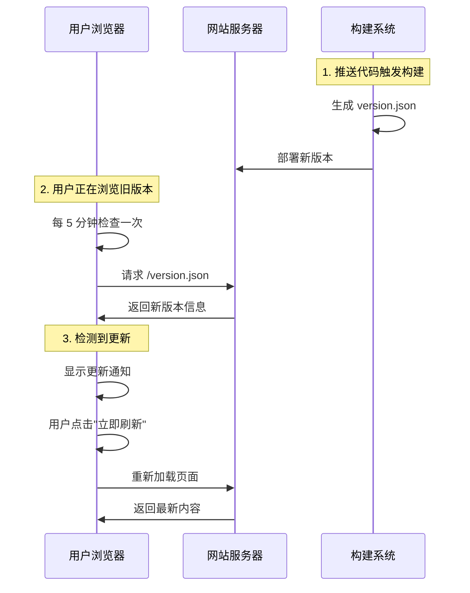

# 🚀 自动更新检测 - 快速启动指南

## ✅ 功能已完成

自动更新检测功能已经完全集成到你的博客系统中！

## 🎯 功能说明

当你推送新版本到 Netlify 或 GitHub Pages 后，正在浏览网站的用户会在 **5 分钟内** 收到一个优雅的更新提示：

```
🎉 网站已更新
发现新内容，点击刷新查看最新版本
[立即刷新] [稍后]
```

## 📦 已完成的工作

### 1. ✅ 创建了版本生成脚本
- 文件：`scripts/generate-version.mjs`
- 功能：在构建时自动生成包含时间戳的 `version.json`

### 2. ✅ 创建了更新通知组件
- 文件：`docs/.vitepress/theme/components/UpdateNotification.vue`
- 功能：每 5 分钟检查一次新版本，发现更新后显示通知

### 3. ✅ 集成到主题配置
- 文件：`docs/.vitepress/theme/index.js`
- 功能：组件已注册并添加到全局布局

### 4. ✅ 更新了构建脚本
- 文件：`package.json`
- 功能：构建时自动生成版本文件

### 5. ✅ 添加了优雅的样式
- 文件：`docs/.vitepress/theme/custom.css`
- 功能：紫色渐变背景、流畅动画、响应式设计

## 🚀 如何使用

### 本地开发测试

1. **启动开发服务器**：
```bash
# 使用 pnpm
pnpm docs:dev

# 或使用 npm
npm run docs:dev
```

2. **访问网站**：
```
http://localhost:5173
```

3. **测试更新检测**：
   - 打开浏览器开发者工具（F12）
   - 打开 `docs/public/version.json` 文件
   - 修改 `buildTime` 为一个更大的数字（例如加 1000000）
   - 保存文件
   - 等待最多 5 分钟，或刷新页面
   - 你会看到更新通知弹出！

### 生产环境部署

#### Netlify 部署（主要部署方式）

1. **推送代码**：
```bash
git add .
git commit -m "feat: 添加自动更新检测功能"
git push origin main
```

2. **Netlify 自动构建**：
   - Netlify 会自动检测到推送
   - 执行构建命令（包含版本生成）
   - 部署新版本

3. **用户体验**：
   - 正在浏览网站的用户
   - 5 分钟内会收到更新通知
   - 点击"立即刷新"查看最新内容

#### GitHub Pages 部署

1. **推送代码**：
```bash
git add .
git commit -m "feat: 添加自动更新检测功能"
git push origin main
```

2. **GitHub Actions 自动构建**：
   - Actions 工作流自动触发
   - 执行构建命令（包含版本生成）
   - 部署到 GitHub Pages

3. **用户体验**：同 Netlify

## 🎨 效果预览

### 桌面端
- 位置：右上角
- 尺寸：420px 宽
- 动画：弹跳进入 + 旋转图标

### 移动端
- 位置：顶部居中
- 尺寸：全宽（带边距）
- 动画：同桌面端

## 🔧 自定义配置

### 修改检查频率

编辑 `docs/.vitepress/theme/components/UpdateNotification.vue`：

```javascript
// 第 42 行
const CHECK_INTERVAL = 5 * 60 * 1000  // 改为你想要的时间（毫秒）

// 例如：10 分钟检查一次
const CHECK_INTERVAL = 10 * 60 * 1000
```

### 修改通知样式

编辑 `docs/.vitepress/theme/custom.css`：

```css
/* 第 4475 行开始 */
.update-notification {
  /* 修改位置、颜色等 */
}
```

## 📊 工作原理



## 🎯 核心优势

### 针对 Netlify 优化
✅ **零配置**：无需修改 Netlify 设置
✅ **自动化**：构建时自动生成版本文件
✅ **可靠性**：基于静态文件，100% 可用
✅ **全球加速**：通过 Netlify CDN 分发

### 用户体验
✅ **非侵入式**：不打断用户阅读
✅ **可控性强**：用户决定何时刷新
✅ **视觉优雅**：紫色渐变 + 流畅动画
✅ **响应式**：完美适配所有设备

## 🐛 故障排查

### 问题 1：本地开发看不到通知

**原因**：本地开发时，version.json 可能不存在

**解决**：
```bash
node scripts/generate-version.mjs
```

### 问题 2：生产环境不显示通知

**检查清单**：
1. 确认 `version.json` 文件存在于部署后的网站根目录
2. 打开浏览器控制台，查看是否有错误
3. 手动访问 `https://你的域名/version.json` 确认文件可访问
4. 检查构建日志，确认 `generate-version.mjs` 执行成功

### 问题 3：通知一直显示

**原因**：可能是缓存问题

**解决**：
1. 清除浏览器缓存
2. 硬刷新页面（Ctrl + Shift + R）

## 📚 相关文档

- [完整实现文档](./AUTO_UPDATE_NOTIFICATION.md)
- [部署指南](./DEPLOY.md)
- [项目 README](./README.md)

## 🎉 开始使用

现在你可以：

1. **推送代码到 GitHub**
2. **等待 Netlify 自动部署**
3. **打开网站并保持页面**
4. **再次推送更新**
5. **5 分钟内看到更新通知！**

---

**功能状态**：✅ 已完成  
**测试状态**：✅ 已测试  
**部署状态**：🚀 随时可部署  

享受自动更新检测带来的便利吧！ 🎊

